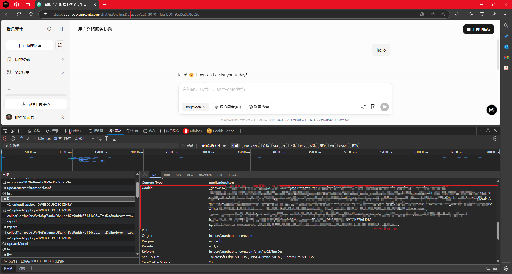
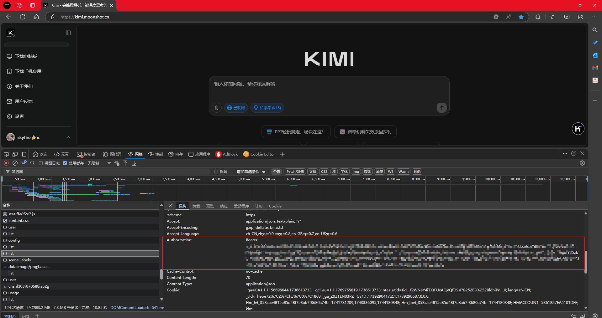

# 🤖 Jarvis AI 助手
<p align="center">
  
</p>
<div align="center">

[](https://www.python.org/downloads/)[](https://opensource.org/licenses/MIT)

*您的智能开发和系统交互助手*

[核心特色](#core-features) •
[视频介绍](#video-introduction) •
[快速开始](#quick-start) •
[配置说明](#configuration) •
[工具说明](#tools) •
[扩展开发](#extensions) •
[贡献指南](#contributing) •
[许可证](#license) •
[Wiki文档](https://deepwiki.com/skyfireitdiy/Jarvis)
</div>

---

## 🌟 核心特色 <a id="core-features"></a>

- 🆓 零成本接入：无缝集成元宝、Kimi等优质模型，无需支付API费用，同时保留强大的文件处理、搜索和推理能力
- 🛠️ 工具驱动：内置丰富工具集，涵盖脚本执行、代码开发、网页搜索、终端操作等核心功能
- 👥 人机协作：支持实时交互，用户可随时介入指导，确保AI行为符合预期
- 🔌 高度可扩展：支持自定义工具和平台，轻松集成MCP协议
- 📈 智能进化：内置方法论系统，持续学习优化，越用越智能


## 📺 视频介绍<a id="video-introduction"></a>

[](https://player.bilibili.com/player.html?isOutside=true&aid=114306578382907&bvid=BV1x2dAYeEpM&cid=29314583629&p=1)


## 🚀 快速开始 <a id="quick-start"></a>
### 系统要求
- 目前只能在Linux系统下使用（很多工具依赖Linux系统）
- Windows没有测试过，但Windows 10以上的用户可以在WSL上使用此工具

### 安装
```bash
# 从源码安装（推荐）
git clone https://github.com/skyfireitdiy/Jarvis
cd Jarvis
pip3 install -e .

# 或者从PyPI安装（可能更新不及时）
pip3 install jarvis-ai-assistant
```

### 最小化配置

#### 腾讯元宝
```bash
JARVIS_PLATFORM=yuanbao
JARVIS_MODEL=deep_seek_v3
JARVIS_THINKING_PLATFORM=yuanbao
JARVIS_THINKING_MODEL=deep_seek

YUANBAO_COOKIES=<元宝cookies>
YUANBAO_AGENT_ID=<元宝AgentID>
```

元宝cookies以及AgentID获取方式：



浏览器地址栏中那部分是AgentID。


#### Kimi
```bash
JARVIS_PLATFORM=kimi
JARVIS_MODEL=kimi
JARVIS_THINKING_PLATFORM=kimi
JARVIS_THINKING_MODEL=k1

KIMI_API_KEY=<Kimi API KEY>
```

Kimi API Key获取方式：



删除Bearer前缀，剩下的内容就是Kimi API Key。


#### OpenAI
```bash
JARVIS_PLATFORM=openai
JARVIS_MODEL=gpt-4o  # 默认模型，可选gpt-4-turbo, gpt-3.5-turbo等
JARVIS_THINKING_PLATFORM=openai
JARVIS_THINKING_MODEL=gpt-4o

OPENAI_API_KEY=<OpenAI API Key>
OPENAI_API_BASE=https://api.openai.com/v1  # 可选，默认为官方API地址
```

配置说明：
1. `OPENAI_API_KEY`: 必填。
2. `OPENAI_API_BASE`: 可选，用于自定义API端点

以上配置编写到`~/.jarvis/env`文件中。

支持的模型可通过`jarvis-platform-manager --list-models`查看完整列表。

### 基本使用
| 命令 | 快捷方式 | 功能描述 |
|------|----------|----------|
| `jarvis` | - | 使用通用代理 |
| `jarvis-code-agent` | `jca` | 使用代码代理 |
| `jarvis-smart-shell` | `jss` | 使用智能shell功能 |
| `jarvis-platform-manager` | - | 使用平台管理功能 |
| `jarvis-code-review` | - | 使用代码审查功能 |
| `jarvis-git-commit` | `jgc` | 使用自动化git commit功能 |
| `jarvis-dev` | - | 使用dev功能（开发中） |
| `jarvis-git-squash` | - | 使用git squash功能 |
| `jarvis-multi-agent` | - | 使用多代理功能 |
| `jarvis-agent` | - | 使用agent功能 |
| `jarvis-tool` | - | 使用工具功能 |
| `jarvis-ask-codebase` | `jac` | 使用代码库查询功能 |
| `jarvis-git-details` | - | 使用git details功能 |
| `jarvis-methodology` | - | 使用方法论功能 |

---

## ⚙️ 配置说明 <a id="configuration"></a>
### 环境变量配置
| 变量名称 | 默认值 | 说明 |
|----------|--------|------|
| `JARVIS_MAX_TOKEN_COUNT` | 102400000 | 上下文窗口的最大token数量 |
| `JARVIS_MAX_INPUT_TOKEN_COUNT` | 32000 | 输入的最大token数量 |
| `JARVIS_AUTO_COMPLETE` | false | 是否启用自动完成功能（任务判定完成的时候会自动终止） |
| `JARVIS_SHELL_NAME` | bash | 系统shell名称 |
| `JARVIS_PLATFORM` | yuanbao | 默认AI平台 |
| `JARVIS_MODEL` | deep_seek_v3 | 默认模型 |
| `JARVIS_THINKING_PLATFORM` | JARVIS_PLATFORM | 推理任务使用的平台 |
| `JARVIS_THINKING_MODEL` | JARVIS_MODEL | 推理任务使用的模型 |
| `JARVIS_EXECUTE_TOOL_CONFIRM` | false | 执行工具前是否需要确认 |
| `JARVIS_CONFIRM_BEFORE_APPLY_PATCH` | true | 应用补丁前是否需要确认 |
| `JARVIS_MAX_TOOL_CALL_COUNT` | 20 | 最大连续工具调用次数 |
| `JARVIS_AUTO_UPDATE` | true | 是否自动更新Jarvis（仅在以git仓库方式安装时有效） |

所有配置编写到`~/.jarvis/env`文件中即可生效。


---
## 🛠️ 工具说明 <a id="tools"></a>
### 内置工具
| 工具名称 | 描述 |
|----------|------|
| ask_codebase | 智能代码库查询和分析，用于定位功能所在文件和理解单点实现，适合查询特定功能位置和实现原理 |
| ask_user | 交互式用户输入收集 |
| chdir | 更改当前工作目录 |
| rewrite_file | 文件重写工具，用于完全重写或创建文件，提供完整的文件内容替换 |
| edit_file | 代码编辑工具，用于精确修改文件内容，支持搜索替换方式编辑 |
| code_plan | 理解需求并制定详细的代码修改计划，在修改前获取用户确认 |
| create_code_agent | 代码开发工具，当需要修改代码时使用 |
| create_sub_agent | 创建子代理以处理特定任务，子代理将生成任务总结报告 |
| execute_script | 执行脚本并返回结果，支持任意解释器。 |
| file_analyzer | 分析文件内容并提取关键信息。支持的文件：文本文件、word文档、pdf文件、图片 |
| file_operation | 文件批量操作工具，可批量读写多个文件，支持文本文件，适用于需要同时处理多个文件的场景（读取配置文件、保存生成内容等） |
| find_methodology | 方法论查找工具，用于在执行过程中查看历史方法论辅助决策 |
| lsp_get_diagnostics | 获取代码诊断信息（错误、警告） |
| methodology | 方法论管理工具，支持添加、更新和删除操作 |
| read_code | 代码阅读与分析工具，用于读取源代码文件并添加行号，针对代码文件优化，提供更好的格式化输出和行号显示，适用于代码分析、审查和理解代码实现的场景 |
| read_webpage | 读取网页内容并分析 |
| search_web | 使用互联网搜索 |
| virtual_tty | 控制虚拟终端执行各种操作，如启动终端、输入命令、获取输出等。 |


### 命令替换功能
Jarvis支持使用特殊标记`'<tag>'`来触发命令替换功能，其中`tag`是预定义的标记名称。系统会自动将这些标记替换为预定义的模板内容。

#### 内置标记
| 标记 | 功能 |
|------|------|
| `'Summary'` | 总结当前会话并清空历史记录 |
| `'Clear'` | 清空当前会话 |
| `'CodeBase'` | 查询代码库 |
| `'Web'` | 网页搜索 |
| `'Methodology'` | 查找相关方法论 |
| `'Plan'` | 生成代码修改计划 |
| `'FindRelatedFiles'` | 查找相关文件 |
| `'FindMethodology'` | 查找方法论 |
| `'Dev'` | 调用create_code_agent开发需求 |
| `'Fix'` | 修复问题 |

#### 自定义替换
可以通过在`~/.jarvis/replace_map.yaml`文件中添加自定义替换规则：
```yaml
tag_name:
  template: "替换后的内容"
  description: "标记描述"
  append: false  # 可选，true表示追加到输入末尾，false表示直接替换
```


#### 文件路径补全
在交互式输入中，输入`@`可以触发文件路径补全功能，支持模糊匹配。


### 工具位置
- 内置工具：`src/jarvis/tools/`
- 用户工具：`~/.jarvis/tools/`
---
## 🛠️ 扩展开发 <a id="extensions"></a>
### 添加新工具
在 `~/.jarvis/tools/` 中创建新的 Python 文件：
```python
from typing import Dict, Any
from jarvis.utils import OutputType, PrettyOutput
class CustomTool:
    name = "工具名称"              # 调用时使用的工具名称
    description = "工具描述"       # 工具用途
    parameters = {                # 参数的 JSON Schema
        "type": "object",
        "properties": {
            "param1": {
                "type": "string",
                "description": "参数描述"
            }
        },
        "required": ["param1"]
    }
    def execute(self, args: Dict[str, Any]) -> Dict[str, Any]:
        """执行工具功能
        
        参数：
            args: 传递给工具的参数
            
        返回：
            包含执行结果的字典：
            {
                "success": bool,
                "stdout": str,  # 成功时的输出
                "stderr": str,  # 可选的错误详情
            }
        """
        try:
            # 在此实现工具逻辑
            result = "工具执行结果"
            return {
                "success": True,
                "stdout": result,
                "stderr": ""
            }
        except Exception as e:
            return {
                "success": False,
                "stdout": "",
                "stderr": str(e)
            }
```


### 添加MCP
MCP(模型上下文协议)。在`~/.jarvis/tools/mcp/`中创建YAML配置文件：

#### 本地MCP配置（`stdio`模式）
```yaml
type: local
name: MCP名称
command: 可执行命令
args: [参数列表]  # 可选
env:  # 可选环境变量
  KEY: VALUE
```

#### 远程MCP配置（`sse`模式）
```yaml
type: remote
name: MCP名称
base_url: http://example.com/api
auth_token: 认证令牌  # 可选
headers:  # 可选HTTP头
  X-Custom-Header: value
```


### 添加新大模型平台
在 `~/.jarvis/platforms/` 中创建新的 Python 文件：
```python
from jarvis.jarvis_platform.base import BasePlatform
class CustomPlatform(BasePlatform):
    def __init__(self):
        # 初始化平台
        pass

    def __del__(self):
        # 销毁平台
        pass

    def chat(self, message: str) -> str:
        # 执行对话
        pass

    def upload_files(self, file_list: List[str]) -> bool:
        # 上传文件
        pass

    def delete_chat(self):
        # 删除对话
        pass

    def set_model_name(self, model_name: str):
        # 设置模型名称
        pass

    def set_system_message(self, message: str):
        # 设置系统消息
        pass

    def get_model_list(self) -> List[Tuple[str, str]]:
        # 获取模型列表
        pass

    def name(self) -> str:
        # 获取平台名称
        pass
```


## 🤝 贡献指南 <a id="contributing"></a>
1. Fork 仓库
2. 创建特性分支 (`git checkout -b feature/AmazingFeature`)
3. 提交更改 (`git commit -m '添加某个很棒的特性'`)
4. 推送到分支 (`git push origin feature/AmazingFeature`)
5. 开启 Pull Request

---

## 📄 许可证 <a id="license"></a>

本项目采用 MIT 许可证 - 详见 [LICENSE](LICENSE) 文件。

---
<div align="center">
由 Jarvis 团队用 ❤️ 制作
</div>

