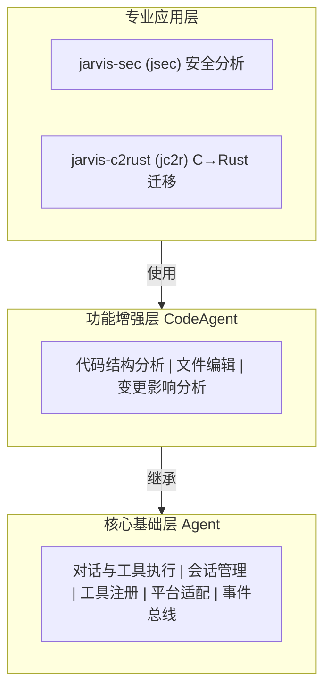

# 🤖 Jarvis AI 助手

<p align="center">
  
</p>
<div align="center">

[](https://www.python.org/downloads/)[](https://opensource.org/licenses/MIT)

_您的智能开发和系统交互助手_

[快速开始](#quick-start) • [系统架构](#architecture) • [关键组件](#components) • [配置说明](#configuration) • [Jarvis Book](#jarvis-book) • [贡献指南](#contributing) • [许可证](#license)

</div>

---

## 🎯 定位与优势

Jarvis 是**本地化 AI 助手平台**，以 CLI 与 Python SDK 双形态交付：既有开箱即用的专业套件（通用代理、代码代理、安全分析、C→Rust 迁移等），也支持可编程的二次开发。采用分层架构与可复用组件，支持即用即走或深度定制，有别于固定工作流的 Agent 平台；规则与 Skills 标准兼容，可无缝迁移。

| 维度             | 能力                                                                                             |
| ---------------- | ------------------------------------------------------------------------------------------------ |
| **本地化**       | 可操作本机任意资源（文件、命令、进程等）                                                         |
| **方法论**       | 成功经验自动沉淀为可复用方法论                                                                   |
| **记忆管理**     | 标签化分层（短期/项目/全局），无向量计算，更轻量                                                 |
| **代码开发**     | 全自动 Git、Worktree 并行、波及分析、交叉引用、上下文推荐、独立 Agent 验证、静态检查、代码格式化 |
| **上下文压缩**   | Git 上下文、任务列表、近期记忆、关键信息等多机制，保证任务目标不偏离                             |
| **任务列表**     | 支线流程与主流程分离，不污染主 Agent 上下文                                                      |
| **会话管理**     | 自动保存、手动恢复，退出可继续                                                                   |
| **人格与规则**   | 内置多种人格与开发规则，高效开发兼顾情绪价值                                                     |
| **规则加载**     | 前期固定流程筛选，后期按需自主加载，确保规则能被有效运用                                         |
| **Windows 支持** | 支持 Windows，可自动化操作 Windows GUI 程序                                                      |

### 与同类项目对比

| 项目          | 定位              | 形态             | 核心场景                        |
| ------------- | ----------------- | ---------------- | ------------------------------- |
| **Jarvis**    | AI 助手平台       | CLI + Python SDK | 代码开发、安全分析、C→Rust 迁移 |
| **LangChain** | LLM 应用框架      | Python 库        | 通用 Agent、RAG、工作流编排     |
| **AutoGPT**   | 自主 AI Agent     | 独立应用         | 目标驱动的自主任务执行          |
| **OpenClaw**  | 个人 AI 助手框架  | Node.js 应用     | 多通道消息、24/7 自主运行       |
| **ZeroClaw**  | OpenClaw 轻量替代 | Rust 二进制      | 同 OpenClaw                     |

- **Jarvis**：面向代码开发，分层架构（Agent/CodeAgent），本地化、轻量记忆、任务分离、规则按需加载，支持 Windows GUI 自动化。
- **LangChain**：通用编排框架，1000+ 集成，LangGraph 图编排，侧重生产级 RAG 与工作流，记忆以向量存储为主。
- **AutoGPT**：早期自主 Agent，目标驱动、有会话保存，但易陷入循环、成本较高、任务上下文分离不足。
- **OpenClaw / ZeroClaw**：消息渠道与日常自动化，Skills 兼容，OpenClaw 支持 Windows GUI，ZeroClaw 极致轻量（~3MB）。

---

## 🏗️ 系统架构 <a id="architecture"></a>

Jarvis 采用**分层架构**：以通用 Agent 为核心，通过继承构建 CodeAgent 增强层，再实现专业应用（安全分析、C→Rust 迁移等）。


```mermaid
flowchart TB
    subgraph 专业应用层["专业应用层"]
        jsec["jarvis-sec (jsec) 安全分析"]
        jc2r["jarvis-c2rust (jc2r) C→Rust 迁移"]
    end

    subgraph 功能增强层["功能增强层 CodeAgent"]
        code["代码结构分析 | 文件编辑 | 变更影响分析"]
    end

    subgraph 核心基础层["核心基础层 Agent"]
        agent["对话与工具执行 | 会话管理 | 工具注册 | 平台适配 | 事件总线"]
    end

    专业应用层 -->|使用| 功能增强层
    功能增强层 -->|继承| 核心基础层
```

### 核心基础层：Agent

Jarvis 的核心执行实体，提供对话、工具执行、会话管理等基础能力：统一入口、会话管理、工具注册、平台适配、事件总线与输入/输出处理链，支持非交互模式与多 Agent 编排。

### 功能增强层：CodeAgent

继承自 Agent，叠加代码相关能力：代码结构分析（文件/函数/类层次）、文件编辑（`edit_file` 支持 search/replace 与整文件重写）、变更影响分析（依赖与调用链）、基于构建错误的自动迭代修复。被 jarvis-c2rust 用于代码生成与修复，也可独立使用（`jca`）。

### 专业应用层

| 应用              | 命令   | 说明                                                                               |
| ----------------- | ------ | ---------------------------------------------------------------------------------- |
| **jarvis-sec**    | `jsec` | 安全分析套件：启发式扫描 → 聚类 → Agent 验证 → 报告聚合，支持 C/C++ 与 Rust        |
| **jarvis-c2rust** | `jc2r` | C→Rust 迁移套件：scan → lib-replace → prepare → transpile → optimize，支持断点续跑 |

---

## 🔧 关键组件 <a id="components"></a>

| 组件                                | 用途                                                        |
| ----------------------------------- | ----------------------------------------------------------- |
| **AgentRunLoop**                    | 主运行循环，驱动「模型思考 → 工具执行 → 结果拼接」迭代      |
| **SessionManager**                  | 会话状态管理，支持保存、恢复、清理历史                      |
| **PromptManager**                   | 构建系统提示与附加提示（工具规范、记忆引导等）              |
| **EventBus**                        | 事件总线，关键节点广播，支持旁路扩展                        |
| **ToolRegistry**                    | 工具注册表，发现、加载、执行工具（内置、外部、MCP）         |
| **MemoryManager**                   | 记忆管理，短期/项目/全局三层架构                            |
| **TaskAnalyzer**                    | 任务分析，满意度收集与方法论沉淀                            |
| **PlatformRegistry / BasePlatform** | 平台适配层，屏蔽不同 LLM 服务商差异                         |
| **RulesManager**                    | 规则管理，多来源加载与激活，与 Skills 标准兼容              |
| **输入处理器链**                    | 内置、Shell、文件上下文处理器，处理特殊标记、命令、文件引用 |

---

## Star History

<a href="https://www.star-history.com/?repos=skyfireitdiy%2FJarvis&type=date&legend=top-left">
 <picture>
   <source media="(prefers-color-scheme: dark)" srcset="https://api.star-history.com/image?repos=skyfireitdiy/Jarvis&type=date&theme=dark&legend=top-left" />
   <source media="(prefers-color-scheme: light)" srcset="https://api.star-history.com/image?repos=skyfireitdiy/Jarvis&type=date&legend=top-left" />
   
 </picture>
</a>

---

## 🚀 快速开始 <a id="quick-start"></a>

### 系统要求

- **操作系统**：Linux（主要）、Windows 10/11（WSL 或原生，支持 GUI 自动化）
- **Python**：3.12
- **Docker**（可选）：镜像已预装依赖，无需本地 Python/Rust

### 安装

**一键安装（推荐）**

```bash
# Linux/macOS
bash -c "$(curl -fsSL https://raw.githubusercontent.com/skyfireitdiy/Jarvis/main/scripts/install.sh)"

# Windows PowerShell
iex ((New-Object System.Net.WebClient).DownloadString('https://raw.githubusercontent.com/skyfireitdiy/Jarvis/main/scripts/install.ps1'))
```

**手动安装**

```bash
git clone https://github.com/skyfireitdiy/Jarvis.git
cd Jarvis
pip3 install -e .
```

**Docker**

```bash
docker pull ghcr.io/skyfireitdiy/jarvis:latest
docker-compose run --rm jarvis
```

### 主要命令

| 命令                      | 快捷方式 | 功能                         |
| ------------------------- | -------- | ---------------------------- |
| `jarvis`                  | `jvs`    | 通用 AI 代理                 |
| `jarvis-code-agent`       | `jca`    | 代码代理（分析、修改、生成） |
| `jarvis-sec`              | `jsec`   | 安全分析套件                 |
| `jarvis-c2rust`           | `jc2r`   | C→Rust 迁移套件              |
| `jarvis-git-commit`       | `jgc`    | 自动生成 Git 提交信息        |
| `jarvis-platform-manager` | `jpm`    | 管理大语言模型平台           |

完整命令列表见 [使用指南](docs/jarvis_book/4.使用指南.md)。

### SDK 示例

```python
from jarvis.jarvis_code_agent.code_agent import CodeAgent

agent = CodeAgent()
agent.run('修复 user/service.py 中的登录验证 bug')
```

```python
from jarvis import Agent

agent = Agent(
    system_prompt="你是一个专业的文档维护助手。",
    name="DocGenerator"
)
agent.run('分析 README.md，补充用户群体信息')
```

---

## ⚙️ 配置说明 <a id="configuration"></a>

配置文件位于 `~/.jarvis/config.yaml`，首次运行将启动交互式配置向导。

**示例**

```yaml
llm_group: default

llm_groups:
  default:
    normal_llm: gpt-5

llms:
  gpt-5:
    platform: openai
    model: gpt-5
    max_input_token_count: 128000
    llm_config:
      openai_api_key: "your-api-key-here"
```

更多配置项见 [使用指南](docs/jarvis_book/4.使用指南.md)。

---

## 🛠️ 扩展开发 <a id="extensions"></a>

- **自定义工具**：在 `~/.jarvis/tools/` 下创建并注册
- **新 LLM 平台**：在 `~/.jarvis/platforms/` 下添加适配器
- **MCP 集成**：通过配置文件接入命令协议

详见 [功能扩展](docs/jarvis_book/5.功能扩展.md)。

---

## 📖 Jarvis Book <a id="jarvis-book"></a>

[项目介绍](docs/jarvis_book/1.项目介绍.md) · [快速开始](docs/jarvis_book/2.快速开始.md) · [核心概念与架构](docs/jarvis_book/3.核心概念与架构.md) · [使用指南](docs/jarvis_book/4.使用指南.md) · [功能扩展](docs/jarvis_book/5.功能扩展.md) · [高级主题](docs/jarvis_book/6.高级主题.md) · [参与贡献](docs/jarvis_book/7.参与贡献.md) · [常见问题](docs/jarvis_book/8.常见问题.md)

---

## 🤝 贡献指南 <a id="contributing"></a>

欢迎贡献！仓库镜像：

- **GitHub**: https://github.com/skyfireitdiy/Jarvis.git
- **Gitee**: https://gitee.com/skyfireitdiy/Jarvis.git

1. Fork 仓库
2. 创建特性分支：`git checkout -b feature/AmazingFeature`
3. 提交更改：`git commit -m 'Add some AmazingFeature'`
4. 推送分支：`git push origin feature/AmazingFeature`
5. 开启 Pull Request

---

## ⚠️ 免责声明 <a id="disclaimer"></a>

- **模型使用**：请遵守各模型平台服务条款，合理使用。
- **命令执行**：Jarvis 具备执行系统命令能力，请谨慎输入；可启用 `execute_tool_confirm: true` 进行执行前确认。

---

## 📄 许可证 <a id="license"></a>

MIT 许可证，详见 [LICENSE](LICENSE)。

---

<div align="center">
由 Jarvis 团队用 ❤️ 制作
</div>
