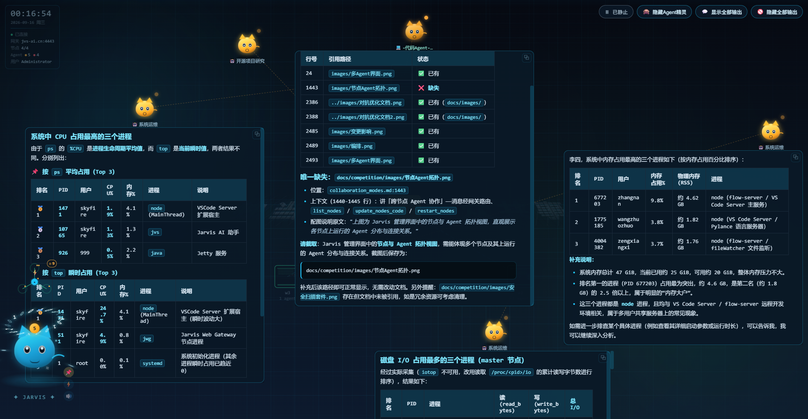
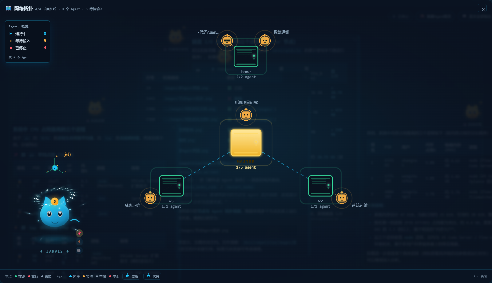
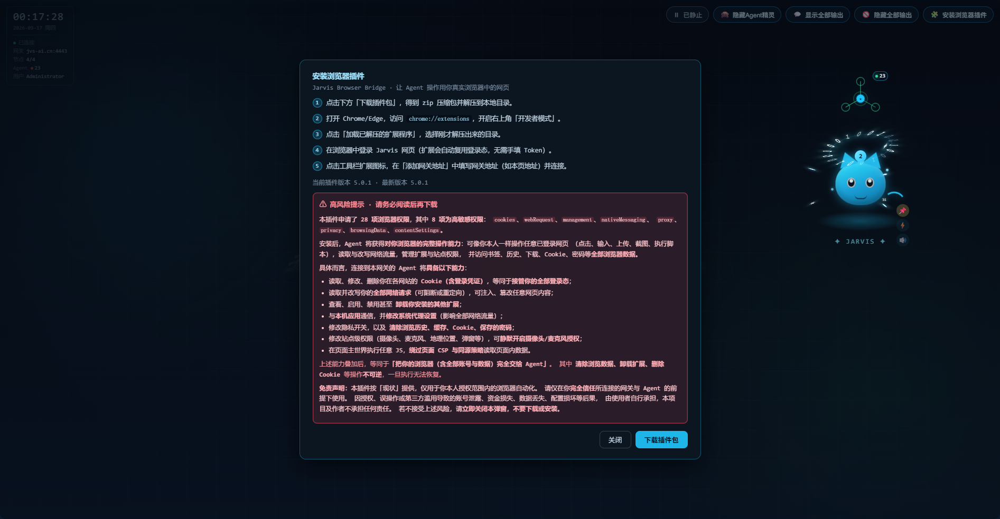
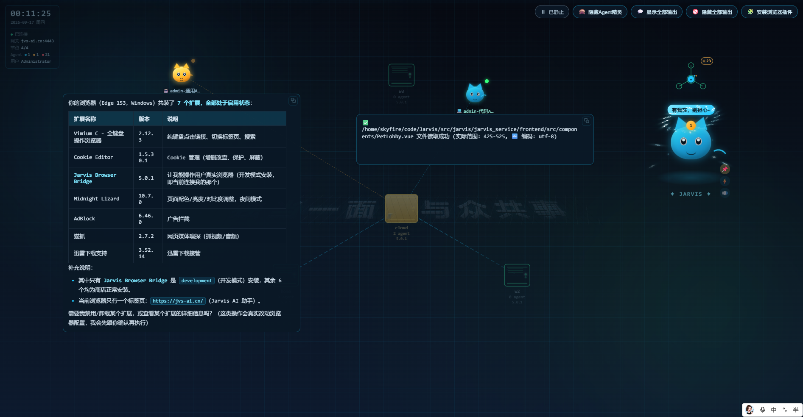
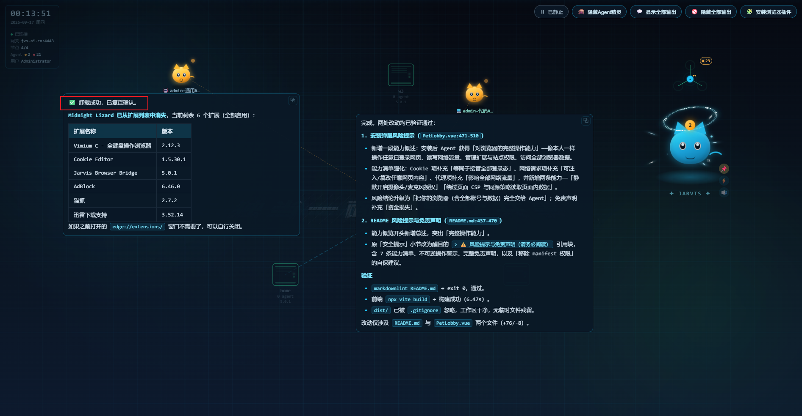

# Jarvis AI 助手


[](https://www.python.org/downloads/)
[](https://opensource.org/licenses/MIT)

> ## 🏆 第三届开放原子大赛总冠军
>
> **「智锻代码·开源鸿蒙全球 AI Agent 代码生成挑战赛」总冠军**（99 支报名团队）
>
> - 🤖 **超 1 万次 Agent 自举提交**：2025 年 5795 次 + 2026 年 4524 次，**99% 以上由 CodeAgent 自主完成**
> - 📦 **项目规模**：319 个 Python 文件、158181 行代码、84 个测试文件、1064 个测试用例（v5.0.1）

## 让 Agent 从「独自工作」走向「与众共事」 🚀

**一句话**：本地运行、开箱即用、可深度定制的**协作式 AI 开发平台**——完整覆盖「单人单 Agent、单人多 Agent、多人单 Agent、多人多 Agent」四种协作模式，写代码、做审查、跑自动化、做安全分析、搞 C→Rust 迁移，一个命令行搞定。

[为什么选 Jarvis](#-为什么选-jarvis) · [协作模式](#协作模式四象限) · [访问方式](#-访问方式) · [核心能力](#-核心能力) · [快速开始](#-快速开始) · [常用命令](#-常用命令) · [Python SDK](#-python-sdk-集成) · [配置说明](#-配置说明) · [扩展能力](#-扩展能力) · [贡献指南](#-贡献指南)

---

## 👋 Jarvis 是什么？

Jarvis 是一个面向开发者的 **协作式 AI 开发平台**。它不只是对话工具，还能真正进入工作流：读代码、改代码、执行工具、管理上下文、复用经验，并在关键节点保持可控。

它的核心命题是：**让 Agent 从「独自工作」走向「与众共事」**。AI 开发工具的协作能力可以从两个维度交叉分析——**人的维度**（单人 vs 多人）与 **Agent 的维度**（单个 vs 多个），由此得到四种协作模式，Jarvis 完整覆盖全部四种。

如果你希望 AI 不只是“给建议”，而是能在你的本地环境里 **帮助分析、执行、验证和沉淀经验**，Jarvis 就是为这种场景设计的。


### 适合谁使用？

- 想把 AI 引入日常开发流程的个人开发者
- 想统一代码修改、审查、验证流程的工程团队
- 需要做安全分析、自动化处理、C→Rust 迁移的专项场景用户
- 希望保留本地可控性、避免被单一平台深度绑定的用户

### 协作模式（四象限）

| 协作模式         | 一句话价值       | 核心能力                                                         |
| ---------------- | ---------------- | ---------------------------------------------------------------- |
| **单人单 Agent** | 独当一面         | 符号级代码理解、影响分析、无人值守、交叉验证、集成终端/编辑器    |
| **单人多 Agent** | 一人驱动一个团队 | 编排网络（devteam）、Agent 间通信（群聊/点对点）、多面板同屏操作 |
| **多人单 Agent** | 团队共享一个 AI  | 多用户认证、ACL 权限、共享协作、聊天室群聊                       |
| **多人多 Agent** | 分布式协作网络   | 多节点多网关、跨节点通信、节点级运维、权限控制                   |

四种模式层层递进：**单人单 Agent 是基础，单人多 Agent 是扩展，多人单 Agent 是共享，多人多 Agent 是终极形态**。主流工具（Claude Code、CodeX、CodeBuddy）聚焦「单人单 Agent」场景，Jarvis 则完整覆盖人 × Agent 两个维度的四种协作模式。



### 核心亮点

- 🏆 **第三届开放原子大赛总冠军**：从 99 支报名团队中脱颖而出
- 🤖 **超 1 万次 Agent 自举提交**：99% 以上由 CodeAgent 自主完成
- 🧩 **完整覆盖四种协作模式**：从单人单 Agent 到多人多 Agent 的分布式协作网络
- 🔍 **符号级代码理解**：Django 52.4 万行建库 22.11 秒，find_definition 6.4ms、find_references 1.4ms
- 🧠 **五层能力系统级整合**：符号级理解 + 多 Agent 协作 + Agent 自举闭环 + 多人共享架构 + 分层知识沉淀

详细论述见 [协作模式文档](docs/competition/collaboration_modes.md)。

---

## ✨ 为什么选 Jarvis？

> 不是又一个“聊天机器人”，而是一个 **真正能动手、还能与人共事** 的 AI 伙伴。

- 🎯 **即用即走**：一条命令启动，无需复杂配置，支持一键安装
- 💻 **代码优先**：专为开发者设计，自动 Git、构建验证、静态检查、影响分析
- 🧠 **越用越聪明**：方法论沉淀、记忆分层、规则按需加载，经验可复用
- 🔒 **本地可控**：数据留在本机，支持 Windows GUI 自动化，无 vendor lock-in
- 🔌 **高度可扩展**：自定义工具、MCP 集成、元代理自举、新平台适配，想加就加
- 🤝 **协作共事**：多用户认证、多 Agent 编排、多节点分布式，从个人工具到团队平台

### 与其他方案对比

| 项目            | 定位               | 形态            | 协作模式                | 核心场景                        |
| --------------- | ------------------ | --------------- | ----------------------- | ------------------------------- |
| **Jarvis**      | 协作式 AI 开发平台 | CLI + Web + SDK | 人 × Agent 四象限全覆盖 | 代码开发、安全分析、C→Rust 迁移 |
| **Claude Code** | 代码助手           | CLI             | 单人单 Agent 为主       | 单人编码                        |
| **CodeX**       | 代码助手           | CLI             | 单人单 Agent 为主       | 单人编码                        |
| **CodeBuddy**   | 代码助手           | IDE 插件        | 单用户多 Agent          | 单人编码                        |
| **OpenClaw**    | 个人 AI 助手框架   | Node.js 应用    | 单人/团队共享 Gateway   | 多通道消息、24/7 自主运行       |
| **AutoGen**     | 多 Agent 编排框架  | Python 库       | Agent 间消息传递        | 构建多 Agent 应用               |
| **CrewAI**      | 多 Agent 编排框架  | Python 库       | 角色协作 + 事件驱动     | 构建多 Agent 应用               |
| **MetaGPT**     | 多 Agent 框架      | Python 库 + CLI | SOP 驱动的角色流水线    | 模拟软件公司流程                |

- **Jarvis**：面向代码开发的**协作式平台**，采用多节点、多网关、多 Agent 架构，强调本地化、轻量记忆、任务分离、规则按需加载，并支持 Windows GUI 自动化；内置符号数据库 + 影响分析，提供精确的结构化代码理解。
- **Claude Code / CodeX / CodeBuddy**：聚焦「单人单 Agent」场景的代码助手，多 Agent 协作以子代理树状扩展为主，团队协同与跨节点能力有限。
- **OpenClaw**：更偏向消息渠道和日常自动化场景，支持团队共享 Gateway，但无 JWT 认证与 ACL 权限组等细粒度权限控制。
- **AutoGen / CrewAI / MetaGPT**：多 Agent 编排**开发框架**，需自行编写 Agent 逻辑搭建应用；Jarvis 则是开箱即用的协作平台。

> 详细对比（含量化性能数据）见 [协作模式文档 · 第四章](docs/competition/collaboration_modes.md)。

### 你可以用它做什么？

- 分析项目结构，生成执行计划
- 修改代码后自动跑验证，减少手工来回切换
- 用符号数据库精确回答「改这个函数会影响哪里」，并给出风险等级
- 做安全扫描与报告聚合（污点分析 + 数据流分析）
- 执行 C→Rust 迁移流水线并支持断点续跑
- 沉淀团队方法论、规则和长期记忆，并通过中心 Git 仓库共享
- 一人驱动多个 Agent 组成开发/测试/部署流水线
- 团队共享同一个 Agent，或搭建跨节点的分布式 Agent 网络
- 定时调度 Agent 无人值守运行，接入 CI/CD
- 让 Agent 操作用户**真实浏览器**中的网页（复用登录态与 Cookie，见 [浏览器扩展](#-浏览器扩展browser-bridge)）
- 通过 CLI、Web 界面或 Python SDK 集成到自己的流程中

---

## 📱 访问方式

Jarvis 提供三种访问方式，满足不同场景需求：

| 方式           | 适用场景             | 说明                                                                 |
| -------------- | -------------------- | -------------------------------------------------------------------- |
| **CLI**        | 终端用户、自动化脚本 | 命令行工具，支持 `jvs`、`jca` 等快捷命令                             |
| **Web**        | 浏览器访问、团队协作 | 通过 `jarvis-service` 启动 Web 网关，支持多节点分布式部署            |
| **Python SDK** | 集成到自有系统       | 以库的形式嵌入，供内部工具调用（见 [Python SDK](#-python-sdk-集成)） |

> 💡 **多用户与协作能力仅通过 Web 接口提供**，CLI 面向单人使用。

### CLI（命令行）

```bash
# 启动通用 Agent
jvs

# 启动代码 Agent
jca

# 启动安全分析
jsec
```

### Web 网关

```bash
# 启动 Web 服务（默认监听 localhost:8000）
jarvis-service

# 指定监听地址和端口
jarvis-service --host 0.0.0.0 --port 9000

# 设置访问密码
jarvis-service --gateway-password your_password
```

启动后在浏览器访问 `http://localhost:8000` 即可使用。

#### 分布式部署

**Master 节点**（主节点，提供统一入口）：

```bash
jarvis-service --node-mode master --gateway-host 0.0.0.0 --gateway-port 8000 --gateway-password your_password
```

**Child 节点**（子节点，运行 Agent）：

```bash
jarvis-service --node-mode child \
    --node-id worker-01 \
    --master-url ws://master-host:8000 \
    --node-secret your_secret_key
```

> 💡 **获取节点密钥**：启动 Master 节点后，可通过前端管理页面的"设置"→"节点连接私钥"获取。Child 节点启动时需要使用相同的密钥。



详细部署说明见 [分布式网关部署方法](docs/用户手册/04_web_界面与网关/分布式网关部署方法.md)。

#### 多用户与协作

Jarvis 支持完整的多用户认证、权限管理与团队协作能力，适合团队共享使用。

- **多用户认证**：基于 JWT 的认证体系，支持注册/登录/登出，管理员与普通用户角色区分
- **权限管理**：分组权限体系（内置组 + 自定义组）、权限矩阵可视化配置、节点级权限控制、Agent 访问控制（ACL）持久化
- **聊天室协作**：群聊/私聊、在线用户实时同步、未读消息角标、图片发送、聊天记录持久化与清空
- **多用户会话**：多端广播、WebSocket 会话隔离、终端操作与文件上传权限校验

详细说明见 [Web 界面与网关](docs/用户手册/04_web_界面与网关/)。

---

## 🎯 核心能力

| 维度              | 能力                                                                                                              |
| ----------------- | ----------------------------------------------------------------------------------------------------------------- |
| **本地化**        | 可操作本机任意资源（文件、命令、进程等）                                                                          |
| **人机协作**      | 执行前确认、虚拟终端、关键节点可介入，确保过程透明可控                                                            |
| **符号级理解**    | SQLite 符号数据库 + 图遍历，精确回答「改这个函数会影响哪里」（Django 52.4 万行建库 22 秒，find_definition 6.4ms） |
| **影响分析**      | 五类影响（引用/依赖/测试/接口变更/依赖链）+ 风险等级评估                                                          |
| **方法论**        | 成功经验自动沉淀为可复用方法论，支持中心库 Git 共享                                                               |
| **记忆管理**      | 标签化分层（短期 / 项目 / 全局），无向量计算，更轻量                                                              |
| **代码开发**      | 全自动 Git、Worktree 并行、波及分析、交叉引用、上下文推荐、独立 Agent 验证、静态检查、代码格式化、变更后自动处理  |
| **多 Agent 编排** | YAML 声明式编排一键部署 Agent 网络，Agent 间群聊/点对点通信，多面板同屏操作                                       |
| **多人协作**      | JWT 多用户认证、两层权限模型（系统级 + 资源级）、聊天室群聊私聊、共享 Agent                                       |
| **分布式部署**    | 多节点多网关架构、跨节点 Agent 通信、节点级一键更新/重启、拓扑可视化                                              |
| **上下文压缩**    | Git 上下文、任务列表、近期记忆、关键信息、意图识别等多机制，保证任务目标不偏离                                    |
| **任务列表**      | 支线流程与主流程分离，不污染主 Agent 上下文                                                                       |
| **会话管理**      | 自动保存、手动恢复，退出可继续                                                                                    |
| **规则加载**      | 前期固定流程筛选，后期按需自主加载，确保规则能被有效运用                                                          |
| **插件机制**      | 内核 + 插件包架构，`config.yaml` 支持的任意配置（工具/规则/方法论/模型/Agent 定义）均可插件化，无需改内核         |
| **知识沉淀**      | 方法论、规则、工具三类知识资产按问题类型索引，支持中心 Git 仓库团队共享                                           |
| **MCP 集成**      | 支持 stdio / sse / streamable 三种传输方式，MCP 工具可纳入多 Agent 协作体系                                       |
| **多模型调度**    | normal / cheap / smart 三档模型按任务复杂度自动调度，无需人工切换                                                 |
| **定时任务**      | 全工具支持 `after` / `at` / `loop` 参数，支持相对时间、绝对时间、循环间隔与跨节点定时                             |
| **多语言支持**    | 基于 tree-sitter 的 AST 级解析，支持 Python / Go / Java / JavaScript / TypeScript / Rust / C / C++ 八种语言       |
| **无人值守**      | 任务级（`<AutoComplete>` 自动完成）与进程级（`no_interaction_mode`）双模式，覆盖半自动到全自动                    |
| **Fork 子 Agent** | `sub_agent` / `sub_code_agent` 默认继承父 Agent 完整上下文，零丢失传递                                            |
| **对抗式优化**    | 对抗 Agent 与开发 Agent 迭代，将模型泛化能力沉淀为专家系统确定性规则（如 jsec 静态检查规则）                      |
| **宠物大厅**      | 前端将每个 Agent 可视化为宠物精灵，叠加节点拓扑层，多 Agent 运行状态一眼可见、可直接交互                          |
| **工具自举**      | 元代理（meta_agent）根据自然语言生成 / 改进工具并注册，支持自演化                                                 |
| **工具调度**      | 按任务智能筛选工具、工具组切换，支持多工具并行调用（无依赖时）                                                    |
| **智能提示**      | 根据任务优化系统提示词，使 Agent 更贴合当前场景                                                                   |
| **Windows 支持**  | 支持 Windows，可自动化操作 Windows GUI 程序                                                                       |
| **浏览器扩展**    | 通过浏览器扩展操作用户**真实浏览器**（复用登录态/Cookie/已开标签页），支持 DOM 操作、CDP 调试、类油猴脚本等       |


---

## 🚀 快速开始

> 💡 **30 秒上手**：安装后运行 `jvs` 或 `jca`，按提示配置 API Key，即可开始与 AI 协作开发。

### 系统要求

- **操作系统**：Linux（主要）、Windows 10/11（WSL 或原生，支持 GUI 自动化）
- **Python**：3.12
- **Docker**（可选）：镜像已预装依赖，无需本地 Python / Rust

### 安装

#### 一键安装（推荐）

```bash
# Linux/macOS（GitHub 源）
bash -c "$(curl -fsSL https://raw.githubusercontent.com/skyfireitdiy/Jarvis/main/scripts/quick-install.sh)"

# Linux/macOS（Gitee 源，国内用户加速）
bash -c "$(curl -fsSL https://gitee.com/skyfireitdiy/Jarvis/raw/main/scripts/quick-install.sh)"
```

安装脚本会自动完成以下操作：

- 自动安装 `uv` 包管理器（如果未安装）
- 下载 Jarvis 最新版本源码（浅克隆，减少下载体积）
- 使用 `uv tool install -e . --python 3.12` 安装 Jarvis
- 可选安装增强工具（rg、fd、fzf、tmux、tree）

> 💡 **提示**：新版本采用极简安装方式，不再内置二进制依赖，仓库体积减小约 164MB。安装过程需要网络连接以下载 `uv` 和 Python 依赖。

#### 手动安装

如果您希望手动安装或自定义安装位置：

```bash
# 1. 安装 uv（如果未安装）
curl -LsSf https://astral.sh/uv/install.sh | sh

# 2. 克隆仓库
git clone --depth 1 https://github.com/skyfireitdiy/Jarvis.git ~/Jarvis
cd ~/Jarvis

# 3. 安装 Jarvis
uv tool install -e . --python 3.12

# 4. 验证安装
jarvis --version
```

#### 升级

```bash
cd ~/Jarvis
git pull
uv tool install -e . --python 3.12
```

#### 手动源码安装

```bash
git clone --depth 1 --branch <latest-tag> https://github.com/skyfireitdiy/Jarvis.git
cd Jarvis
export PATH="$(pwd)/src/jarvis/jarvis_data/deps/x86_64_linux:$PATH"
uv tool install -e . --python 3.12
uv tool install playwright
uv tool install ddgr
```

> Docker 相关说明请参考仓库中的容器/部署文档；主安装入口已统一为“源码下载 + 仓库内置 `uv` + `uv tool` 安装”方式。

### 第一个任务

```bash
# 通用任务：让 AI 帮你分析、规划、执行
jvs -T "分析当前项目结构，找出可优化的依赖关系"

# 代码任务：自动读代码、改代码、跑测试
jca -T "在 user 模块添加忘记密码功能"

# 一键生成规范的 Git 提交信息
jgc
```

---

## 💡 常用命令

Jarvis 安装后提供以下命令，短命令为对应长命令的快捷方式：

| 命令                           | 快捷方式   | 功能                           |
| ------------------------------ | ---------- | ------------------------------ |
| `jarvis`                       | `jvs`      | 通用 AI 代理                   |
| `jarvis-agent`                 | `ja`       | 通用 Agent 命令行入口          |
| `jarvis-agent-dispatcher`      | `jvsd`     | 通用 Agent 任务派发            |
| `jarvis-code-agent`            | `jca`      | 代码代理（分析、修改、生成）   |
| `jarvis-code-agent-dispatcher` | `jcad`     | 代码 Agent 任务派发            |
| `jarvis-smart-shell`           | `jss`      | 自然语言转 Shell 命令          |
| `jarvis-sec`                   | `jsec`     | 安全分析套件                   |
| `jarvis-c2rust`                | `jc2r`     | C→Rust 迁移套件                |
| `jarvis-git-commit`            | `jgc`      | 自动生成 Git 提交信息          |
| `jarvis-git-squash`            | `jgs`      | Git 提交压缩工具               |
| `jarvis-platform-manager`      | `jpm`      | 管理大语言模型平台             |
| `jarvis-config`                | `jcfg`     | 配置管理工具                   |
| `jarvis-quick-config`          | `jqc`      | 快速配置工具                   |
| `jarvis-memory-organizer`      | `jmo`      | 记忆整理（合并相似标签的记忆） |
| `jarvis-methodology`           | `jm`       | 方法论导入 / 导出              |
| `jarvis-tool`                  | `jt`       | 工具系统命令行界面             |
| `jarvis-lsp`                   | `jlsp`     | LSP 语言服务客户端             |
| `jarvis-browser`               | `jb`       | 浏览器自动化工具               |
| `jarvis-windows`               | `jw`       | Windows 应用自动化工具         |
| `jarvis-web-gateway`           | `jwg`      | Web 网关                       |
| `jarvis-service`               | `jservice` | Web 服务（含多用户与协作）     |
| `jarvis-rules-index`           | `jri`      | 规则索引                       |

> 💡 运行任意命令加 `--help` 可查看详细参数，例如 `jca --help`。

---

## 🐍 Python SDK 集成

```python
from jarvis.jarvis_code_agent.code_agent import CodeAgent

agent = CodeAgent()
agent.run('修复 user/service.py 中的登录验证 bug')
```

```python
from jarvis.jarvis_agent import Agent

agent = Agent(system_prompt="你是一个专业的文档维护助手。", name="DocGenerator")
agent.run('分析 README.md，补充用户群体信息')
```

---

## ⚙ 配置说明

配置文件位于 `~/.jarvis/config.yaml`，首次运行将启动交互式配置向导。

### 示例

```yaml
llm_group: default

llm_groups:
  default:
    normal_llm: gpt-5
    fast_llm: gpt-5-mini
    # 可选：结构化评估模型（如 Jev），用于方法论/规则等候选选择场景
    eval_llm: jev
  code:
    normal_llm: claude-sonnet

llms:
  gpt-5:
    platform: openai
    model: gpt-5
    max_input_token_count: 128000
    llm_config:
      openai_api_key: "your-api-key-here"
  gpt-5-mini:
    platform: openai
    model: gpt-5-mini
    max_input_token_count: 64000
    llm_config:
      openai_api_key: "your-api-key-here"
  claude-sonnet:
    platform: anthropic
    model: claude-sonnet-4
    max_input_token_count: 128000
    llm_config:
      anthropic_api_key: "your-anthropic-key-here"
  jev:
    platform: jev
    model: jev-latest
    max_input_token_count: 128000
    llm_config:
      jev_api_key: "your-jev-key-here"
```

> **关于 `eval_llm`（可选）**：为模型组配置 `eval_llm` 后，方法论加载、规则选择等"从候选中挑相关项"的场景会优先用该结构化评估模型（如 Jev）打分选择；未配置或调用失败时自动回退到 `normal_llm` 的常规流程，不影响原有行为。

更多配置项见 [使用指南](docs/jarvis_book/4.使用指南.md)。

---

## 🛠 扩展能力

- **自定义工具**：在 `~/.jarvis/tools/` 下创建并注册，支持中心工具仓库（`central_tool_repo`）团队共享
- **插件包**：内核 + 插件包架构，`config.yaml` 支持的任意配置（工具/规则/方法论/模型/Agent 定义/回调）均可打包为插件，安装后自动发现并注入，无需改内核、无需重新部署
- **新 LLM 平台**：在 `~/.jarvis/platforms/` 下添加适配器
- **MCP 集成**：通过配置文件接入 MCP 服务，支持 stdio / sse / streamable 三种传输方式
- **工具自举**：元代理（meta_agent）根据自然语言生成 / 改进工具并自动注册

详见 [功能扩展](docs/jarvis_book/5.功能扩展.md)。

---

## 🌐 浏览器扩展（Browser Bridge）

让 Agent 操作**用户真实浏览器**中的网页：复用已登录的 Cookie 与 Session，直接读写用户当前打开的标签页，
无需重新登录、无需公网 IP、无需开放端口。

与 `jarvis-browser`（`jb`，服务端 Playwright 启动独立浏览器）不同，本扩展运行在用户浏览器内，
通过 WebSocket 主动连出到 Jarvis 网关，因此适用于「操作我自己已登录的网页」这类场景。

### 安装

1. 在 Web 界面（宠物大厅）点击「安装浏览器插件」，下载插件包（zip）并解压到本地目录
2. 打开 Chrome/Edge 的 `chrome://extensions`，开启「开发者模式」
3. 点击「加载已解压的扩展程序」，选择解压后的目录
4. 在浏览器中登录 Jarvis 网页（扩展自动复用登录态，**无需手填 Token**）
5. 点击工具栏扩展图标，填写网关地址（如 `https://jvs-ai.cn`）并连接

> 💡 扩展源码位于仓库根目录 `browser_extension/`，网关按需打包下载，保证版本与网关一致；
> 前端会自动检测插件版本并在有新版本时提示更新。

### 能力概览

安装后，Agent 将获得**对用户浏览器的完整操作能力**：可像用户本人一样操作任意已登录网页，
读取与改写网络流量，管理扩展与站点权限，并访问全部浏览器数据。

- **网页操作**：标签页 / 导航 / DOM 读写（点击、输入、悬停、下拉、滚动、上传文件）/ 截图
- **调试**：通过 CDP 读取 Console 日志、采集网络请求、执行任意表达式（不受页面 CSP 限制）
- **脚本库（类油猴）**：安装自定义页面脚本，Agent 通过 `script.*` 查询并调用，适合封装站点专用操作
- **浏览器数据**：书签、历史、下载、会话、阅读列表、标签组、常用站点、站点图标
- **剪贴板**：读取网关静态文件并写入前端剪贴板（如把图片贴进富文本编辑器）
- **高敏感能力**（调用前需用户确认）：Cookie、网络请求规则、扩展管理、本机通信、代理、隐私、浏览数据、内容设置

> ⚠️ **风险提示与免责声明（请务必阅读）**
>
> 本扩展申请了 **28 项浏览器权限**，其中 **8 项为高敏感权限**（`cookies`、`webRequest`、
> `management`、`nativeMessaging`、`proxy`、`privacy`、`browsingData`、`contentSettings`）。
> 这些能力叠加后，等同于**把浏览器（含全部账号与数据）完全交给 Agent**：
>
> - 读取、修改、删除各网站 **Cookie（含登录凭证）**，等同于**接管全部登录态**；
> - 读取并改写**全部网络请求**（可阻断或重定向），可注入、篡改任意网页内容；
> - 查看、启用、禁用甚至 **卸载其他扩展**；
> - 与**本机应用**通信，并**修改系统代理设置**（影响全部网络流量）；
> - 修改隐私开关，以及 **清除浏览历史、缓存、Cookie、保存的密码**；
> - 修改站点级权限（摄像头、麦克风、地理位置、弹窗等），可**静默开启摄像头/麦克风授权**；
> - 在页面主世界执行任意 JS，**绕过页面 CSP 与同源策略**读取页面内数据。
>
> 本方案**不做权限控制**（设计决策），因此上述能力对已连接的 Agent 完全开放。
> 其中 **清除浏览数据、卸载扩展、删除 Cookie** 等操作**不可逆**，一旦执行无法恢复。
>
> **免责声明**：本扩展按「现状」提供，仅用于用户本人授权范围内的浏览器自动化。
> 请仅在**完全信任**所连接网关与 Agent 的前提下使用。因授权、误操作或第三方滥用导致的
> 账号泄露、资金损失、数据丢失、配置损坏等后果，由使用者自行承担，本项目及作者不承担任何责任。
> 若不接受上述风险，请**不要下载或安装**本扩展；不需要相关能力时，可从
> `browser_extension/manifest.json` 的 `permissions` 中移除对应项并重新加载扩展。

安装前，前端会弹出风险提示与免责声明，需用户确认后才会开始下载插件包：



### 风险操作示例：列出与卸载扩展

高敏感能力并非停留在纸面。以下示例中，Agent 通过 `extmgr_list` 列出用户浏览器中已安装的全部扩展，
再通过 `extmgr_uninstall` 卸载指定扩展——整个过程无需用户手动打开扩展管理页：



_Agent 调用 `extmgr_list`，列出浏览器中已安装的扩展及其启用状态。_



_Agent 调用 `extmgr_uninstall` 卸载指定扩展；此类操作**不可逆**，请谨慎授权。_

完整指令列表、脚本格式、消息协议与排障说明见
[浏览器扩展 README](browser_extension/README.md)，
设计细节见 [浏览器插件方案](docs/design/browser-extension-agent-control.md)。

---

## 🤝 贡献指南

欢迎一起把 Jarvis 做得更好！无论是修 Bug、加功能、写文档，还是分享使用心得，我们都期待你的参与。

- **GitHub**: [https://github.com/skyfireitdiy/Jarvis.git](https://github.com/skyfireitdiy/Jarvis.git)
- **Gitee**: [https://gitee.com/skyfireitdiy/Jarvis.git](https://gitee.com/skyfireitdiy/Jarvis.git)

参与流程：**Fork 仓库 → 创建分支 → 提交更改 → 发起 Pull Request**

---

## ⚠ 注意事项

- **模型使用**：请遵守各模型平台服务条款，合理使用。
- **命令执行**：Jarvis 具备执行系统命令能力，请谨慎输入；可启用 `execute_tool_confirm: true` 进行执行前确认。

---

## 📄 许可证

MIT 许可证，详见 [LICENSE](LICENSE)。

---

## 如果 Jarvis 对你有帮助，欢迎给个 ⭐ Star

由 Jarvis 团队用 ❤ 制作。
