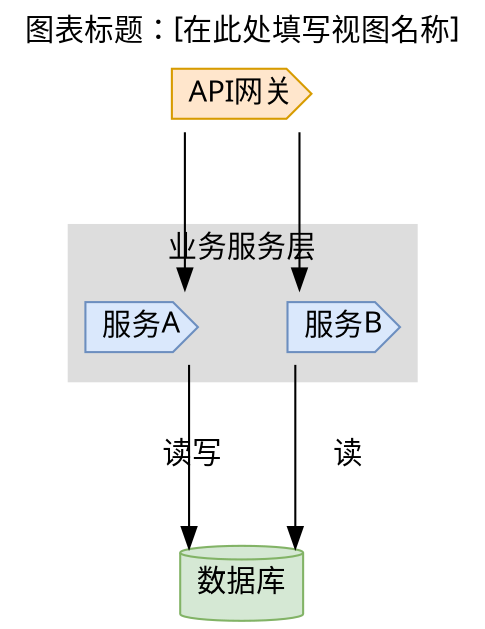

# 架构图生成规则

## 你必须遵循的工作流程

### 架构图生成完整流程（严格执行）

1. **需求澄清阶段**:
   - 必须明确用户需要生成哪一种或哪几种架构视图
   - 禁止在需求不明确的情况下开始代码分析

2. **代码阅读阶段**:
   - 必须使用 `read_code` 工具完整地、仔细地阅读和分析用户提供的所有相关源代码
   - 禁止只阅读部分代码或凭空猜测

3. **组件识别与关系分析阶段**:
   - 必须识别核心类、模块、接口和函数
   - 必须分析它们之间的依赖、继承、调用和数据流关系
   - 必须根据视图类型，对组件进行适当的抽象和分组

4. **视图绘制阶段 (DOT语言)**:
   - **逻辑视图**: 必须关注功能和系统结构，主要呈现分层关系，避免组件间过于密集的连线
   - **实现视图**: 必须关注代码的物理组织，展示文件、模块、包及其依赖关系
   - **进程视图**: 必须关注系统的运行时行为，展示主要的进程、线程、任务以及它们之间的通信
   - **部署视图**: 必须关注系统的物理部署，展示硬件节点、网络连接以及在节点上部署的软件组件
   - **用例视图**: 必须关注用户与系统的交互，展示参与者和用例

5. **图表生成与渲染阶段**:
   - 必须将生成的Graphviz DOT代码输出到以`.dot`为后缀的文件中
   - 必须使用`execute_script`工具调用`dot`命令将`.dot`文件渲染为`.png`图片
   - 必须向用户报告渲染后的图片路径

## 你必须遵守的原则

### 代码完整性原则

- **禁止**：只阅读部分代码或凭空猜测系统架构
- **必须**：完整地、仔细地阅读和分析用户提供的所有相关源代码
- **必须**：准确识别核心类、模块、接口和函数及其相互关系

### 视图准确性原则

- **必须**：图表必须准确反映代码的实际结构
- **必须**：在同一系列的图表中，相同组件的表示应保持一致
- **禁止**：在图表中体现具体实现名称或路径，必须使用抽象的职责或角色命名

### 图表清晰性原则

- **必须**：图表必须简单明了，易于理解
- **必须**：避免组件间过于密集的连线，保持图表清晰
- **必须**：确保图表颜色搭配合理，布局清晰

### 专业性原则

- **必须**：严格遵循架构设计和Graphviz的最佳实践
- **必须**：所有输出的DOT代码必须是完整的、可直接渲染的
- **必须**：包含在 `digraph G { ... }` 中，遵循统一的样式规范

## 具体要求和规范

- 所有输出的DOT代码必须是完整的、可直接渲染的。
- 必须包含在 `digraph G { ... }` 中。
- **布局方向**: 对于层次结构明显的图（如组织架构、调用链），
  应优先使用 `rankdir="TB"` 实现从上到下的布局。对于流程或序列
  关系，`rankdir="LR"` (从左到右) 可能更合适。
- **布局对齐**: 为了获得规整对齐的布局，请积极使用
  `subgraph cluster_...` 对节点进行分组，并使用
  `{ rank=same; ... }` 语句将需要水平对齐的节点放在同一层级。
- **布局间距**: 为了避免节点或文字重叠，可以在 `graph [...]`
  中设置 `nodesep` 和 `ranksep` 属性来增大节点和层级间距，
  例如 `nodesep=0.6, ranksep=1.0`。同时可设置 `overlap=false` 禁止
  重叠。
- 使用graph、node和edge属性来美化图表。推荐使用以下基础样式：

- 根据不同的视图，使用合适的形状和样式。
- 模块节点尽量使用矩形（shape=box）；除数据库、外部系统、消息队列等特殊组件外，避免用其它形状表示"模块"。
- 抽象命名规范：不要在图中体现具体实现名称或路径（如 utils.output、xxx.py、具体函数名），使用抽象的职责或角色命名（如 输出模块、存储模块、网络层、鉴权服务）。
- 注释清晰，解释图表中的关键元素和关系。
- **准确性**: 图表必须准确反映代码的实际结构。
- **清晰性**: 图表必须简单明了，易于理解。
- **一致性**: 在同一系列的图表中，相同组件的表示应保持一致。
- **专业性**: 严格遵循架构设计和Graphviz的最佳实践。

## 实践指导

### 代码分析最佳实践

- **从入口点开始**：先识别系统的主要入口点（如API网关、主函数、核心控制器）
- **分层分析**：按照表现层、业务逻辑层、数据访问层的层次结构进行分析
- **依赖追踪**：使用工具或手动追踪代码间的依赖关系，绘制依赖图谱
- **模块识别**：识别高内聚、低耦合的模块单元

### 组件抽象技巧

- **使用抽象命名**：将具体的类名、函数名抽象为职责描述（如将`UserService`抽象为"用户管理服务"）
- **合理分组**：将相关功能组件分组到同一子图中，使用`subgraph cluster_xxx`语法
- **层级划分**：明确区分接口层、服务层、数据层等不同层级
- **外部系统标识**：清晰标识外部系统、数据库、消息队列等外部组件

### 视图选择指导

- **逻辑视图**：适用于展示系统功能模块划分和交互关系
- **实现视图**：适用于展示代码组织结构、包依赖关系
- **进程视图**：适用于展示系统运行时进程、线程间的并发和通信
- **部署视图**：适用于展示系统在物理环境中的部署拓扑
- **用例视图**：适用于展示用户与系统的交互场景

### Graphviz 使用技巧

- **布局选择**：层次结构使用`rankdir="TB"`，流程关系使用`rankdir="LR"`
- **节点对齐**：使用`{ rank=same; node1; node2; }`实现水平对齐
- **间距调整**：通过`nodesep`和`ranksep`属性调整节点间距避免重叠
- **颜色搭配**：使用协调的颜色方案，不同层级使用不同色系
- **形状规范**：接口用`shape=cds`，数据库用`shape=cylinder`，服务用默认矩形

## 渲染步骤

1. 首先，使用 REWRITE 操作或 PATCH 操作将生成的DOT代码写入`.dot`文件。
2. 然后，使用`execute_script`调用`dot`命令进行渲染。
3. 最后，将生成的`.png`文件路径告知用户。

## 执行检查清单

在开始架构图生成前，你必须确认：

- [ ] 已明确用户需要生成的架构视图类型（逻辑/实现/进程/部署/用例视图）
- [ ] 已获取所有相关的源代码文件路径
- [ ] 已准备好代码分析工具和环境

在进行代码分析时，你必须确认：

- [ ] 完整阅读了所有相关源代码，没有遗漏关键文件
- [ ] 准确识别了系统的核心组件和模块
- [ ] 分析了组件间的依赖、继承、调用和数据流关系
- [ ] 根据视图类型对组件进行了适当的抽象和分组

在绘制架构图时，你必须确认：

- [ ] 选择了合适的视图类型来展示系统架构
- [ ] 使用了正确的Graphviz语法和DOT语言格式
- [ ] 遵循了统一的样式规范和颜色搭配
- [ ] 图表布局清晰，易于理解
- [ ] 组件命名抽象，没有暴露具体实现细节

在生成和渲染图表时，你必须确认：

- [ ] DOT代码完整且语法正确
- [ ] 使用`dot`命令成功渲染为PNG图片
- [ ] 生成的图片文件路径正确并可访问
- [ ] 向用户提供了清晰的图片访问路径

在交付结果前，你必须确认：

- [ ] 架构图准确反映了代码的实际结构
- [ ] 图表符合架构设计的最佳实践
- [ ] 所有组件和关系都正确表示
- [ ] 图片质量清晰，适合展示和分享
