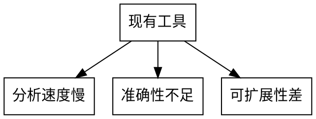

# PPT生成规则

## 规则概述

本规则定义了如何根据PPT设计文档（由`presentation_ppt_outline.md`生成）自动生成PowerPoint演示文稿（.pptx文件）。

## 核心目标

- 读取PPT大纲设计文档
- 使用python-pptx库生成PPTX文件
- 实现标准页面布局
- 添加文案内容和配图
- 应用配色方案
- 输出可用的PPT文件

## 技术栈

- **python-pptx**：生成和操作PowerPoint文件
- **Pillow (PIL)**：图片处理
- **GraphViz**：生成流程图、状态图
- **PlantUML**：生成时序图、架构图
- **Jinja2**：模板渲染（可选）

## 前置条件

### 依赖安装

```bash
pip install python-pptx pillow
```

### GraphViz安装

```bash
# Ubuntu/Debian
sudo apt-get install graphviz

# macOS
brew install graphviz

# Windows
# 下载安装包：https://graphviz.org/download/
```

### PlantUML安装

```bash
# 下载plantuml.jar
wget https://github.com/plantuml/plantuml/releases/download/v1.2024.0/plantuml-1.2024.0.jar

# 或使用Docker
docker pull plantuml/plantuml-server
```

## 工作流程

### 阶段1：读取设计文档

1. **定位设计文档**
   - 从指定路径读取Markdown格式的大纲文档
   - 解析文档结构（页面信息、内容、配图要求）

2. **验证文档完整性**
   - 检查必需字段：页面类型、标题、内容
   - 验证配图代码是否完整
   - 确认配色方案定义

3. **提取元数据**
   - 汇报主题、场景、时长、受众
   - 总页数、页面类型分布
   - 整体配色方案

### 阶段2：初始化PPT

```python
from pptx import Presentation
from pptx.util import Inches, Pt
from pptx.enum.text import PP_ALIGN
from pptx.dml.color import RGBColor

def create_ppt(title, theme='default'):
    """
    创建PPT对象并应用主题

    Args:
        title: 演示文稿标题
        theme: 主题名称（tech/business/creative/academic）

    Returns:
        Presentation对象
    """
    prs = Presentation()
    prs.slide_width = Inches(10)
    prs.slide_height = Inches(7.5)

    # 设置主题配色
    colors = get_theme_colors(theme)
    prs.colors = colors

    return prs
```

### 阶段3：生成页面

#### 3.1 标题页（Title Page）

```python
def add_title_slide(prs, title, subtitle, author, date):
    """
    添加标题页

    布局设计：
    - 主标题：居中，大字号（48-60pt）
    - 副标题：居中，中等字号（28-36pt）
    - 作者/日期：底部，小字号（18-24pt）
    """
    slide = prs.slides.add_slide(prs.slide_layouts[6])  # 空白布局

    # 背景
    background = slide.background
    fill = background.fill
    fill.solid()
    fill.fore_color.rgb = prs.colors['primary']

    # 主标题
    title_box = slide.shapes.title
    title_box.text = title
    title_para = title_box.text_frame.paragraphs[0]
    title_para.alignment = PP_ALIGN.CENTER
    title_para.font.size = Pt(54)
    title_para.font.bold = True
    title_para.font.color.rgb = prs.colors['text_on_primary']
    title_box.top = Inches(2.5)
    title_box.left = Inches(1)
    title_box.width = Inches(8)
    title_box.height = Inches(1.5)

    # 副标题
    subtitle_box = slide.shapes.add_textbox(
        Inches(1), Inches(4.2), Inches(8), Inches(0.8)
    )
    subtitle_frame = subtitle_box.text_frame
    subtitle_frame.text = subtitle
    subtitle_para = subtitle_frame.paragraphs[0]
    subtitle_para.alignment = PP_ALIGN.CENTER
    subtitle_para.font.size = Pt(32)
    subtitle_para.font.color.rgb = prs.colors['text_on_primary']

    # 作者和日期
    info_box = slide.shapes.add_textbox(
        Inches(1), Inches(6.5), Inches(8), Inches(0.5)
    )
    info_frame = info_box.text_frame
    info_frame.text = f"{author} | {date}"
    info_para = info_frame.paragraphs[0]
    info_para.alignment = PP_ALIGN.CENTER
    info_para.font.size = Pt(20)
    info_para.font.color.rgb = prs.colors['text_on_primary']

    return slide
```

#### 3.2 目录页（Table of Contents）

```python
def add_toc_slide(prs, sections):
    """
    添加目录页

    Args:
        sections: 章节列表，格式：[(章节名, 页码), ...]

    布局设计：
    - 标题：左上角，大字号
    - 目录项：两列或一列，带页码
    """
    slide = prs.slides.add_slide(prs.slide_layouts[6])

    # 标题
    title_box = slide.shapes.add_textbox(
        Inches(0.5), Inches(0.5), Inches(9), Inches(0.8)
    )
    title_frame = title_box.text_frame
    title_frame.text = "目录"
    title_para = title_frame.paragraphs[0]
    title_para.font.size = Pt(44)
    title_para.font.bold = True
    title_para.font.color.rgb = prs.colors['primary']

    # 目录项（两列布局）
    col1_x = 1.5
    col2_x = 5.5
    y = 2.0
    item_height = 0.5

    for i, (section, page_num) in enumerate(sections):
        col = col1_x if i % 2 == 0 else col2_x
        row = y + (i // 2) * item_height

        # 章节名
        text_box = slide.shapes.add_textbox(
            Inches(col), Inches(row), Inches(3), Inches(0.4)
        )
        text_frame = text_box.text_frame
        text_frame.text = section
        text_para = text_frame.paragraphs[0]
        text_para.font.size = Pt(24)
        text_para.font.color.rgb = prs.colors['text']

        # 页码
        num_box = slide.shapes.add_textbox(
            Inches(col + 3.2), Inches(row), Inches(0.5), Inches(0.4)
        )
        num_frame = num_box.text_frame
        num_frame.text = str(page_num)
        num_para = num_frame.paragraphs[0]
        num_para.alignment = PP_ALIGN.RIGHT
        num_para.font.size = Pt(24)
        num_para.font.color.rgb = prs.colors['accent']

    return slide
```

#### 3.3 内容页（Content Slide）

```python
def add_content_slide(prs, title, content_items, layout='bullet'):
    """
    添加内容页

    Args:
        title: 页面标题
        content_items: 内容项列表
        layout: 布局类型（bullet/two_col/image_left/image_right）

    布局设计：
    - 标题：顶部横条，背景色
    - 内容：主体区域，带项目符号
    """
    slide = prs.slides.add_slide(prs.slide_layouts[6])

    # 标题栏
    title_bar = slide.shapes.add_shape(
        1,  # 矩形
        Inches(0), Inches(0),
        Inches(10), Inches(1.2)
    )
    title_bar.fill.solid()
    title_bar.fill.fore_color.rgb = prs.colors['primary']
    title_bar.line.fill.background()

    # 标题文字
    title_box = slide.shapes.add_textbox(
        Inches(0.5), Inches(0.35), Inches(9), Inches(0.7)
    )
    title_frame = title_box.text_frame
    title_frame.text = title
    title_para = title_frame.paragraphs[0]
    title_para.font.size = Pt(36)
    title_para.font.bold = True
    title_para.font.color.rgb = prs.colors['text_on_primary']

    # 内容区域
    if layout == 'bullet':
        content_box = slide.shapes.add_textbox(
            Inches(0.8), Inches(1.6),
            Inches(8.4), Inches(5.4)
        )
        text_frame = content_box.text_frame
        text_frame.word_wrap = True

        for i, item in enumerate(content_items):
            if i > 0:
                text_frame.add_paragraph()
            p = text_frame.paragraphs[i]
            p.text = item
            p.level = 0
            p.space_before = Pt(12)
            p.font.size = Pt(24)
            p.font.color.rgb = prs.colors['text']

    return slide
```

#### 3.4 图片页（Image Slide）

```python
def add_image_slide(prs, title, image_path, caption=None, position='right'):
    """
    添加图片页

    Args:
        title: 页面标题
        image_path: 图片路径
        caption: 图片说明（可选）
        position: 图片位置（left/right/center/full）

    布局设计：
    - 标题：顶部横条
    - 图片：主体区域
    - 说明：底部（可选）
    """
    slide = prs.slides.add_slide(prs.slide_layouts[6])

    # 标题栏（同上）
    # ...

    # 图片
    if position == 'center':
        pic = slide.shapes.add_picture(
            image_path,
            Inches(1.5), Inches(1.8),
            width=Inches(7)
        )
    elif position == 'left':
        pic = slide.shapes.add_picture(
            image_path,
            Inches(0.5), Inches(1.8),
            width=Inches(5)
        )
        # 右侧文字区域
        text_box = slide.shapes.add_textbox(
            Inches(5.8), Inches(1.8),
            Inches(3.7), Inches(5.2)
        )

    # 图片说明
    if caption:
        caption_box = slide.shapes.add_textbox(
            Inches(0.5), Inches(6.8),
            Inches(9), Inches(0.4)
        )
        caption_frame = caption_box.text_frame
        caption_frame.text = caption
        caption_para = caption_frame.paragraphs[0]
        caption_para.alignment = PP_ALIGN.CENTER
        caption_para.font.size = Pt(18)
        caption_para.font.italic = True
        caption_para.font.color.rgb = prs.colors['text_secondary']

    return slide
```

### 阶段4：生成配图

#### 4.1 GraphViz图片生成

```python
import subprocess
import os

def generate_graphviz(dot_code, output_path, format='png'):
    """
    使用GraphViz生成图片

    Args:
        dot_code: DOT语言代码
        output_path: 输出图片路径
        format: 输出格式（png/svg/pdf）

    Returns:
        生成成功返回True，失败返回False
    """
    try:
        # 写入临时DOT文件
        dot_file = output_path.replace(f'.{format}', '.dot')
        with open(dot_file, 'w', encoding='utf-8') as f:
            f.write(dot_code)

        # 调用GraphViz
        cmd = ['dot', f'-T{format}', dot_file, '-o', output_path]
        result = subprocess.run(cmd, capture_output=True, text=True)

        if result.returncode == 0:
            os.remove(dot_file)  # 删除临时文件
            return True
        else:
            print(f"GraphViz错误: {result.stderr}")
            return False
    except Exception as e:
        print(f"生成GraphViz图片失败: {str(e)}")
        return False
```

#### 4.2 PlantUML图片生成

```python
def generate_plantuml(plantuml_code, output_path, format='png'):
    """
    使用PlantUML生成图片

    Args:
        plantuml_code: PlantUML代码
        output_path: 输出图片路径
        format: 输出格式（png/svg）

    Returns:
        生成成功返回True，失败返回False
    """
    try:
        # 写入临时PU文件
        puml_file = output_path.replace(f'.{format}', '.puml')
        with open(puml_file, 'w', encoding='utf-8') as f:
            f.write('@startuml\n')
            f.write(plantuml_code)
            f.write('\n@enduml')

        # 调用PlantUML
        jar_path = '/path/to/plantuml.jar'  # 需要配置
        cmd = ['java', '-jar', jar_path, puml_file, '-t' + format]
        result = subprocess.run(cmd, capture_output=True, text=True)

        if result.returncode == 0:
            os.remove(puml_file)  # 删除临时文件
            return True
        else:
            print(f"PlantUML错误: {result.stderr}")
            return False
    except Exception as e:
        print(f"生成PlantUML图片失败: {str(e)}")
        return False
```

### 阶段5：应用配色方案

```python
def get_theme_colors(theme):
    """
    获取主题配色方案

    Args:
        theme: 主题名称

    Returns:
        颜色字典
    """
    themes = {
        'tech': {
            'primary': RGBColor(0, 82, 204),      # 深蓝
            'secondary': RGBColor(0, 150, 136),   # 青绿
            'accent': RGBColor(255, 152, 0),      # 橙色
            'background': RGBColor(255, 255, 255), # 白色
            'text': RGBColor(33, 33, 33),        # 深灰
            'text_secondary': RGBColor(97, 97, 97), # 中灰
            'text_on_primary': RGBColor(255, 255, 255), # 白色
        },
        'business': {
            'primary': RGBColor(25, 25, 25),      # 黑色
            'secondary': RGBColor(75, 75, 75),    # 深灰
            'accent': RGBColor(206, 17, 38),     # 深红
            'background': RGBColor(245, 245, 245), # 浅灰
            'text': RGBColor(25, 25, 25),        # 黑色
            'text_secondary': RGBColor(75, 75, 75), # 深灰
            'text_on_primary': RGBColor(255, 255, 255), # 白色
        },
        # ... 其他主题
    }

    return themes.get(theme, themes['tech'])
```

### 阶段6：输出和验证

```python
def save_ppt(prs, output_path):
    """
    保存PPT文件

    Args:
        prs: Presentation对象
        output_path: 输出文件路径

    Returns:
        保存成功返回True，失败返回False
    """
    try:
        prs.save(output_path)
        print(f"PPT已保存到: {output_path}")

        # 验证文件
        file_size = os.path.getsize(output_path)
        if file_size > 0:
            print(f"文件大小: {file_size / 1024:.2f} KB")
            return True
        else:
            print("错误: 生成的文件为空")
            return False
    except Exception as e:
        print(f"保存PPT失败: {str(e)}")
        return False
```

## 完整示例

### 输入：PPT设计文档（markdown）

````markdown
# Jarvis优化方案 PPT大纲

## 汇报信息

- **主题**: Jarvis代码分析工具优化
- **场景**: 技术方案评审
- **时长**: 20分钟
- **受众**: 技术团队
- **生成时间**: 2025-02-05 14:00:00

## PPT结构概览

本PPT共8页，分为3个部分：背景与问题、解决方案、预期效果

---

## 第1页：标题页

**页面类型**: title
**核心观点**: 展示汇报主题
**布局设计**: 标题页布局
**文案内容**:

- 标题: Jarvis代码分析工具优化方案
- 副标题: 提升代码分析效率与准确性
- 作者: Jarvis开发团队
- 日期: 2025-02-05
  **配图方案**: 无
  **配色建议**: tech主题

---

## 第2页：目录

**页面类型**: toc
**核心观点**: 展示汇报结构
**布局设计**: 目录页布局
**文案内容**:

1. 背景与问题 (2页)
2. 解决方案 (3页)
3. 预期效果 (2页)
   **配图方案**: 无
   **配色建议**: 继承主题

---

## 第3页：当前问题分析

**页面类型**: content
**核心观点**: 分析现有工具的问题
**布局设计**: 内容页布局（带项目符号）
**文案内容**:

- 分析速度慢：大型代码库需要30分钟以上
- 准确性不足：误报率高，需要大量人工验证
- 可扩展性差：难以支持新的编程语言
  **配图方案**:
- 使用GraphViz绘制问题分类图


````

**配色建议**: 继承主题

---

[后续页面...]

---

## 附录

### 配图代码汇总

[所有GraphViz/PlantUML代码]

### 配色方案

tech主题：深蓝主色调，专业严谨

### 备注

图片输出目录：/tmp/ppt_images/

````

### 输出：Python生成脚本

```python
#!/usr/bin/env python3
"""
PPT生成脚本
根据PPT设计文档生成PowerPoint文件
"""

from pptx import Presentation
from pptx.util import Inches, Pt
from pptx.enum.text import PP_ALIGN
from pptx.dml.color import RGBColor
import re
import os
import subprocess

def parse_outline(markdown_file):
    """
    解析PPT设计文档
    """
    with open(markdown_file, 'r', encoding='utf-8') as f:
        content = f.read()

    # 提取元数据
    meta = extract_meta(content)

    # 提取页面信息
    pages = extract_pages(content)

    return meta, pages

def extract_meta(content):
    """
    提取汇报元数据
    """
    meta = {}

    # 提取主题
    match = re.search(r'\*\*主题\*\*: (.+)', content)
    if match:
        meta['title'] = match.group(1)

    # 提取场景
    match = re.search(r'\*\*场景\*\*: (.+)', content)
    if match:
        meta['scenario'] = match.group(1)

    # ... 提取其他元数据

    return meta

def extract_pages(content):
    """
    提取页面信息
    """
    pages = []

    # 按分隔符分页
    page_blocks = re.split(r'^---$', content, flags=re.MULTILINE)

    for block in page_blocks:
        if not block.strip():
            continue

        page = parse_page(block)
        if page:
            pages.append(page)

    return pages

def parse_page(block):
    """
    解析单页内容
    """
    page = {}

    # 提取页面类型
    match = re.search(r'\*\*页面类型\*\*: (.+)', block)
    if match:
        page['type'] = match.group(1).strip()

    # 提取标题
    match = re.search(r'^## (\d+)?第?\d*页[：:](.+)', block, re.MULTILINE)
    if match:
        page['title'] = match.group(2).strip()

    # 提取核心观点
    match = re.search(r'\*\*核心观点\*\*: (.+)', block)
    if match:
        page['point'] = match.group(1).strip()

    # 提取布局设计
    match = re.search(r'\*\*布局设计\*\*: (.+)', block)
    if match:
        page['layout'] = match.group(1).strip()

    # 提取文案内容
    match = re.search(r'\*\*文案内容\*\*:(.+?)(?=\*\*配图方案\*\*|$)', block, re.DOTALL)
    if match:
        content_text = match.group(1).strip()
        page['content'] = parse_content(content_text)

    # 提取配图方案
    match = re.search(r'\*\*配图方案\*\*:(.+?)(?=\*\*配色建议\*\*|$)', block, re.DOTALL)
    if match:
        page['image'] = parse_image(match.group(1).strip())

    return page

def parse_content(text):
    """
    解析文案内容
    """
    items = []

    if text.startswith('-'):
        # 列表形式
        lines = text.split('\n')
        for line in lines:
            line = line.strip()
            if line.startswith('-'):
                items.append(line[1:].strip())
    else:
        # 直接文本
        items.append(text)

    return items

def parse_image(text):
    """
    解析配图方案
    """
    image = {'has_image': False}

    if '无' in text or '不需要' in text:
        return image

    image['has_image'] = True
    image['description'] = text

    # 提取GraphViz代码
    dot_match = re.search(r'```dot\n(.+?)```', text, re.DOTALL)
    if dot_match:
        image['type'] = 'graphviz'
        image['code'] = dot_match.group(1)
        return image

    # 提取PlantUML代码
    puml_match = re.search(r'```plantuml\n(.+?)```', text, re.DOTALL)
    if puml_match:
        image['type'] = 'plantuml'
        image['code'] = puml_match.group(1)
        return image

    return image

def generate_ppt(markdown_file, output_path):
    """
    生成PPT
    """
    print(f"正在读取设计文档: {markdown_file}")
    meta, pages = parse_outline(markdown_file)

    print(f"创建PPT: {meta.get('title', '未命名')}")
    print(f"总页数: {len(pages)}")

    # 创建PPT对象
    prs = Presentation()
    prs.slide_width = Inches(10)
    prs.slide_height = Inches(7.5)

    # 获取配色方案
    colors = get_theme_colors('tech')  # 可从meta中提取
    prs.colors = colors

    # 创建图片输出目录
    image_dir = '/tmp/ppt_images/'
    os.makedirs(image_dir, exist_ok=True)

    # 逐页生成
    for i, page in enumerate(pages, 1):
        print(f"\n生成第{i}页: {page.get('title', '未命名')}")

        page_type = page.get('type', 'content')

        if page_type == 'title':
            slide = add_title_slide(
                prs,
                page['content'][0] if page.get('content') else meta.get('title', ''),
                page['content'][1] if len(page.get('content', [])) > 1 else '',
                meta.get('author', ''),
                meta.get('date', '')
            )

        elif page_type == 'toc':
            sections = extract_sections(page.get('content', []))
            slide = add_toc_slide(prs, sections)

        elif page_type == 'content':
            # 生成配图
            image_path = None
            if page.get('image', {}).get('has_image'):
                image_path = generate_page_image(
                    page['image'],
                    f"{image_dir}page_{i}.png"
                )

            if image_path:
                slide = add_image_slide(
                    prs,
                    page.get('title', ''),
                    image_path,
                    page.get('image', {}).get('caption')
                )
            else:
                slide = add_content_slide(
                    prs,
                    page.get('title', ''),
                    page.get('content', [])
                )

    # 保存PPT
    print(f"\n正在保存PPT: {output_path}")
    prs.save(output_path)
    print(f"✅ PPT生成完成: {output_path}")

    return True

def generate_page_image(image_info, output_path):
    """
    生成页面配图
    """
    if image_info.get('type') == 'graphviz':
        if generate_graphviz(image_info['code'], output_path):
            print(f"  ✅ GraphViz图片生成成功")
            return output_path

    elif image_info.get('type') == 'plantuml':
        if generate_plantuml(image_info['code'], output_path):
            print(f"  ✅ PlantUML图片生成成功")
            return output_path

    print(f"  ⚠️ 图片生成失败")
    return None

def extract_sections(content_items):
    """
    从内容项中提取章节
    """
    sections = []
    page_num = 2  # 目录后从第2页开始

    for item in content_items:
        # 解析格式："章节名 (x页)"
        match = re.match(r'(.+?)\s*\((\d+)页\)', item)
        if match:
            name = match.group(1).strip()
            pages = int(match.group(2))
            sections.append((name, page_num))
            page_num += pages

    return sections

if __name__ == '__main__':
    import sys

    if len(sys.argv) < 2:
        print("用法: python generate_ppt.py <设计文档.md> [输出.pptx]")
        sys.exit(1)

    markdown_file = sys.argv[1]
    output_path = sys.argv[2] if len(sys.argv) > 2 else 'output.pptx'

    generate_ppt(markdown_file, output_path)
````

## 验证清单

生成PPT后，必须验证：

- [ ] 文件已成功创建
- [ ] 文件可以正常打开（PowerPoint/WPS）
- [ ] 页面数量与设计文档一致
- [ ] 所有文字内容正确显示
- [ ] 布局符合设计要求
- [ ] 配图已正确插入
- [ ] 配色方案已正确应用
- [ ] 无格式错误或错位

## 常见问题

### Q1: 图片生成失败

**可能原因**：

- GraphViz/PlantUML未安装
- 配图代码有语法错误
- 输出目录无写权限

**解决方案**：

1. 检查工具是否正确安装
2. 手动测试配图代码
3. 检查文件权限

### Q2: 中文乱码

**可能原因**：

- 系统缺少中文字体
- python-pptx字体设置问题

**解决方案**：

1. 安装中文字体（如微软雅黑）
2. 在代码中明确指定字体

### Q3: 布局错位

**可能原因**：

- 内容过长超出页面
- 图片尺寸不合适

**解决方案**：

1. 调整内容长度
2. 设置合适的图片尺寸
3. 使用自适应布局

## 注意事项

1. **字体兼容性**：确保使用的字体在目标系统上存在
2. **图片质量**：使用高分辨率图片（建议300dpi以上）
3. **文件大小**：控制图片大小，避免PPT文件过大
4. **版本兼容性**：考虑不同PowerPoint版本的兼容性
5. **测试验证**：生成后务必打开文件检查效果
6. **备份原始文件**：保留设计文档，便于后续修改
