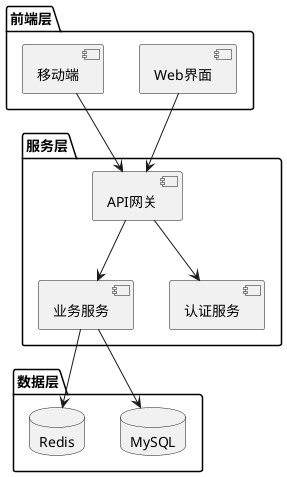
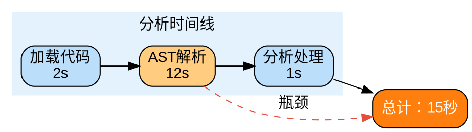

# 汇报PPT大纲生成规则

## 规则概述

本规则用于生成汇报PPT大纲，采用金字塔叙事方法，从用户提供的信息中设计完整的PPT结构，包括每页的布局、文案、配图和配色方案。

## 工作流程

### 阶段1：信息收集（必须完成）

在生成PPT大纲之前，必须收集以下关键信息。**如果信息不足，必须主动询问用户补充**。

#### 必需信息清单

1. **汇报主题**
   - 主题名称：[必填]
   - 汇报场景：[必填]（例：项目汇报、技术方案汇报、工作总结、竞聘演讲等）
   - 汇报时长：[建议]（用于控制PPT页数，一般1-2分钟/页）

2. **核心目标**
   - 汇报目标：[必填]（例：争取资源、汇报进度、说服决策、展示成果等）
   - 期望达成的结果：[必填]

3. **受众信息**
   - 受众角色：[必填]（例：高层领导、技术专家、业务人员、混合受众等）
   - 受众关注点：[建议]（例：成本、技术可行性、业务价值、风险控制等）
   - 受众背景知识：[建议]（专家/入门/混合）

4. **核心内容**
   - 关键信息点：[必填]（至少3个）
   - 数据/证据：[建议]（支撑观点的数据、案例、调研结果等）
   - 对比/竞品：[可选]（与现有方案、竞品的对比）

5. **背景约束**
   - 时间约束：[可选]
   - 资源约束：[可选]
   - 风险/挑战：[可选]

#### 信息收集话术模板

当信息不足时，使用以下话术询问：

```
为了生成更精准的PPT大纲，请补充以下信息：

[具体缺失的信息项]

您可以直接提供，或者我可以基于现有信息进行合理推演。
```

### 阶段2：金字塔结构设计（核心方法）

使用**金字塔原理**设计PPT叙事逻辑：

#### 金字塔三大原则

1. **结论先行**（Top-Down）
   - 核心观点放在最前面
   - 先说结论，再说论据
   - 先说结果，再说过程

2. **MECE原则**（Mutually Exclusive, Collectively Exhaustive）
   - 各部分相互独立，不重叠
   - 所有部分完全穷尽，无遗漏

3. **上下对应**
   - 上层观点是下层观点的总结
   - 下层观点支撑上层观点
   - 每页PPT只有一个核心观点

#### 标准PPT结构模板

**结构1：问题-解决方案型**（适用于技术方案、项目汇报）

```
1. 标题页
2. 目录页
3. 背景与问题（现状-痛点-影响）
4. 解决方案（核心方案-关键优势）
5. 技术实现（技术架构-核心模块-关键技术）
6. 效果与价值（数据对比-业务价值-未来规划）
7. 总结与展望
```

**结构2：成果展示型**（适用于工作总结、项目汇报）

```
1. 标题页
2. 目录页
3. 项目概况（目标-范围-周期）
4. 核心成果（亮点1-亮点2-亮点3）
5. 关键数据（指标达成-数据对比）
6. 经验总结（成功经验-改进方向）
7. 下一步计划
```

**结构3：说服决策型**（适用于资源申请、方案评审）

```
1. 标题页
2. 核心观点（一句话总结）
3. 现状分析（数据-问题-机会）
4. 方案建议（方案概览-关键措施）
5. 可行性论证（技术可行-成本可控-风险可控）
6. 预期收益（业务价值-投入产出）
7. 行动呼吁（请求决策-下一步）
```

### 阶段3：PPT大纲生成（详细输出）

对每一页PPT，必须提供以下详细信息：

#### 单页PPT输出格式

````markdown
## 第N页：[页面标题]

### 页面类型

[标题页/目录页/内容页/数据页/总结页等]

### 核心观点

[一句话总结本页核心传达的信息]

### 布局设计

[描述页面布局，例：左右分栏、上下分区、三列布局等]

### 文案内容

[具体的文字内容，包括标题、要点列表、关键数据等]

#### 标题

[页面主标题]

#### 内容要点

- 要点1：[具体描述]
- 要点2：[具体描述]
- 要点3：[具体描述]

### 配图方案

#### 配图类型

[流程图/架构图/对比图/时序图/思维导图/数据图表等]

#### 配图内容

**方案1：GraphViz绘制**

```dot
// GraphViz代码
digraph G {
    // 节点和边的定义
}
```
````

**方案2：PlantUML绘制**

```plantuml
@startuml
// PlantUML代码
@enduml
```

**方案3：图像说明**（无法用代码绘制时）
[详细描述需要的图像内容、构图、元素等]

### 配色建议

#### 主色调

[颜色代码，例：#1F77B4（蓝色）- 体现专业、信任]

#### 辅助色

[颜色代码，例：#FF7F0E（橙色）- 强调重点]

#### 背景色

[颜色代码，例：#FFFFFF（白色）或 #F5F5F5（浅灰）]

#### 配色原理

[说明配色方案的选择理由，例：蓝色代表专业科技，橙色用于强调关键数据]

---

````

#### 页面类型与布局建议

**标题页**
- 布局：居中对齐
- 内容：主标题、副标题、汇报人、日期
- 配图：可选添加主题相关背景图或Logo
- 配色：主色调 + 纯白/纯黑背景

**目录页**
- 布局：左右分栏或上下分区
- 内容：章节标题、页码、简短描述
- 配图：可选添加章节关系图

**内容页**
- 布局：左右分栏（左图右文或左文右图）
- 内容：标题、3-5个要点、支撑数据
- 配图：与内容匹配的图表

**数据页**
- 布局：图表为主，文字辅助
- 内容：数据标题、核心数据、对比数据、趋势分析
- 配图：柱状图/折线图/饼图等

**总结页**
- 布局：简洁明了，突出重点
- 内容：3个核心结论、行动呼吁
- 配图：可选添加里程碑路线图


### 配图绘制规范

#### GraphViz使用指南

**适用场景**：流程图、状态图、组织结构图

**基础语法**：

```dot
digraph G {
    // 设置全局属性
    rankdir=TB; // TB=从上到下, LR=从左到右
    node [shape=box, style="rounded,filled", fillcolor="#E3F2FD"];
    edge [color="#1F77B4", fontcolor="#333333"];

    // 定义节点
    Start [label="开始", shape=ellipse, fillcolor="#BBDEFB"];
    Process1 [label="处理步骤1"];
    Process2 [label="处理步骤2"];
    End [label="结束", shape=ellipse, fillcolor="#BBDEFB"];

    // 定义边
    Start -> Process1 [label="输入"];
    Process1 -> Process2 [label="处理"];
    Process2 -> End [label="输出"];
}
````

**常用形状**：

- `box`：矩形
- `ellipse`：椭圆
- `diamond`：菱形（决策）
- `circle`：圆形
- `rounded`：圆角矩形

**颜色建议**：

- 主节点：`#BBDEFB`（浅蓝）
- 普通节点：`#E3F2FD`（更浅蓝）
- 强调节点：`#FFCC80`（浅橙）
- 边线：`#1F77B4`（深蓝）

#### PlantUML使用指南

**适用场景**：时序图、用例图、类图、架构图

**时序图示例**：

```plantuml
@startuml
actor 用户
participant "前端系统" as Front
participant "后端服务" as Back
database "数据库" as DB

用户 -> Front: 发起请求
Front -> Back: API调用
Back -> DB: 查询数据
DB --> Back: 返回结果
Back --> Front: JSON响应
Front --> 用户: 展示页面
@enduml
```

**架构图示例**：



#### 数据图表说明

**柱状图**：

- 用途：对比不同类别的数据
- 描述：X轴为类别，Y轴为数值，每个柱子代表一个类别

**折线图**：

- 用途：展示数据趋势变化
- 描述：X轴为时间，Y轴为数值，线条表示变化趋势

**饼图**：

- 用途：展示占比关系
- 描述：整体分为若干部分，每个扇区代表一个部分及其占比

### 配色方案建议

#### 场景配色

**技术汇报（专业、严谨）**

- 主色：`#1F77B4`（蓝色）- 体现专业、信任
- 辅色：`#FF7F0E`（橙色）- 强调重点
- 背景：`#FFFFFF`（白色）
- 文字：`#333333`（深灰）

**商业汇报（稳重、大气）**

- 主色：`#2C3E50`（深蓝灰）- 体现稳重
- 辅色：`#E74C3C`（红色）- 强调重点
- 背景：`#ECF0F1`（浅灰）
- 文字：`#2C3E50`（深灰蓝）

**创新汇报（活力、创意）**

- 主色：`#9B59B6`（紫色）- 体现创新
- 辅色：`#1ABC9C`（青色）- 强调生机
- 背景：`#FDFEFE`（米白）
- 文字：`#34495E`（深灰）

**学术汇报（简洁、清晰）**

- 主色：`#34495E`（深灰）- 体现简洁
- 辅色：`#3498DB`（蓝色）- 强调重点
- 背景：`#FFFFFF`（纯白）
- 文字：`#2C3E50`（深色）

#### 配色原则

1. **色彩数量**：每页不超过3种主色调
2. **对比度**：文字与背景对比度足够（至少4.5:1）
3. **一致性**：整个PPT保持配色风格一致
4. **功能色**：红色用于警示/问题，绿色用于成功/正向，橙色用于强调

## 输出验证清单

生成PPT大纲后，必须进行以下检查：

### 内容完整性

- [ ] 信息收集是否完整（主题、目标、受众、核心内容）
- [ ] 是否使用金字塔结构（结论先行、MECE、上下对应）
- [ ] 每页是否只有一个核心观点

### 输出完整性

- [ ] 每页是否包含：页面类型、核心观点、布局设计、文案内容
- [ ] 每页是否包含：配图方案（GraphViz/PlantUML/图像说明）
- [ ] 每页是否包含：配色建议（主色、辅色、背景色、配色原理）

### 逻辑连贯性

- [ ] 页面之间逻辑是否连贯
- [ ] 是否有明确的叙事主线
- [ ] 数据、证据是否支撑观点

### 可执行性

- [ ] 配图代码是否可执行（GraphViz/PlantUML）
- [ ] 配图描述是否清晰具体（无法绘制时）
- [ ] 配色方案是否可落地

## 使用示例

### 示例输入

```text
汇报主题：Jarvis代码分析工具优化
汇报场景：技术方案汇报
汇报时长：20分钟
汇报目标：争取优化资源
受众：技术团队负责人、架构师
关键信息：
1. 当前分析速度慢，影响用户体验
2. 发现性能瓶颈在AST解析模块
3. 优化方案：缓存+并行处理
4. 预期提升：性能提升3倍
```

### 示例输出（部分）

````markdown
## 第1页：标题页

### 页面类型

标题页

### 核心观点

Jarvis代码分析工具性能优化方案

### 布局设计

居中对齐，标题突出，底部添加汇报人信息

### 文案内容

#### 主标题

Jarvis代码分析工具性能优化方案

#### 副标题

通过缓存与并行处理提升分析性能

#### 汇报信息

- 汇报人：XXX
- 日期：2026年2月

### 配图方案

#### 配图类型

背景装饰图

#### 配图内容

**方案3：图像说明**

[背景使用抽象的代码分析流程图，采用半透明处理，不干扰文字阅读。建议使用蓝色系线条，体现技术感]

### 配色建议

#### 主色调

#1F77B4（蓝色）- 体现专业、信任

#### 辅助色

#FF7F0E（橙色）- 强调重点

#### 背景色

#FFFFFF（白色）

#### 配色原理

蓝色代表专业科技，橙色用于强调性能提升的关键数据

---

## 第3页：问题分析

### 页面类型

内容页

### 核心观点

当前代码分析性能瓶颈严重影响用户体验

### 布局设计

左右分栏：左侧问题描述，右侧数据支撑

### 文案内容

#### 标题

性能问题分析

#### 内容要点

- **现状**：平均分析耗时15秒，用户等待时间长
- **影响**：30%用户因等待时间过长放弃使用
- **瓶颈定位**：AST解析模块占用80%分析时间
- **用户反馈**："分析太慢"是Top 1投诉问题

### 配图方案

#### 配图类型

性能对比图

#### 配图内容

**方案1：GraphViz绘制**


````

**方案2：数据图表**

[柱状图：横轴为各模块（加载、解析、分析），纵轴为耗时（秒），AST解析柱子显著高于其他模块，用橙色标注]

### 配色建议

#### 主色调

#1F77B4（蓝色）- 常规模块

#### 辅助色

#FF7F0E（橙色）- 突出瓶颈

#### 背景色

#FFFFFF（白色）

#### 配色原理

蓝色表示正常流程，橙色高亮显示性能瓶颈，形成视觉对比

---

```

## 注意事项

1. **信息不足时必须询问**，不要假设或虚构信息
2. **遵循金字塔原理**，确保逻辑清晰、层次分明
3. **每页一个观点**，避免信息过载
4. **配图服务于内容**，不要为了配图而配图
5. **配色保持一致**，整个PPT风格统一
6. **考虑受众背景**，技术术语适当解释
7. **数据要有支撑**，关键论断必须有数据或案例支撑
8. **行动呼吁明确**，结尾要有明确的下一步或行动建议

## 输出到文件

### 文件输出规范

**必须在生成PPT大纲后，将完整内容写入文件保存。**

#### 文件位置

**项目相关汇报**：
```

{{ git_root_dir }}/docs/presentations/<汇报主题>\_outline.md

```

**个人汇报**：
```

~/Documents/presentations/<汇报主题>\_outline.md

```

**临时草稿**：
```

/tmp/ppt*outline*<时间戳>.md

````

#### 文件命名规范

- 使用小写字母
- 使用下划线 `_` 或连字符 `-` 分隔单词
- 包含日期或版本号（可选）
- 使用 `.md` 后缀

**命名示例**：
- ✅ 正确：`jarvis_optimization_20260205.md`
- ✅ 正确：`code-review-plan-v1.md`
- ❌ 错误：`Jarvis优化方案.md`

#### 文件内容结构

输出文件应包含以下结构：

```markdown
# <汇报主题> PPT大纲

## 汇报信息
- **主题**：<汇报主题>
- **场景**：<汇报场景>
- **时长**：<汇报时长>
- **受众**：<受众角色>
- **生成时间**：<YYYY-MM-DD HH:MM:SS>

## PPT结构概览
[整体结构说明，如：本PPT共X页，分为X个部分]

---

## 第1页：[页面标题]
[单页PPT详细内容]

---

## 第2页：[页面标题]
[单页PPT详细内容]

---

...

---

## 附录

### 配图代码汇总
[所有GraphViz/PlantUML代码汇总，便于批量生成图片]

### 配色方案
[整体配色方案说明]

### 备注
[其他注意事项或补充说明]
````

#### 输出时机

1. **完成大纲生成后立即输出**：完成所有页面的设计后
2. **用户确认后输出**：用户确认大纲内容符合要求后
3. **自动保存草稿**：生成过程中定期保存（如每完成5页）

#### 文件管理建议

1. **版本控制**：重要汇报应纳入git版本管理
2. **备份机制**：生成后自动备份到指定目录
3. **命名规范**：使用有意义的文件名，便于检索
4. **目录组织**：按项目/日期/类型组织文件

#### 输出验证

文件输出后，必须验证：

- [ ] 文件已成功创建
- [ ] 文件路径正确
- [ ] 文件内容完整（无截断）
- [ ] Markdown格式正确
- [ ] 配图代码可复制使用
