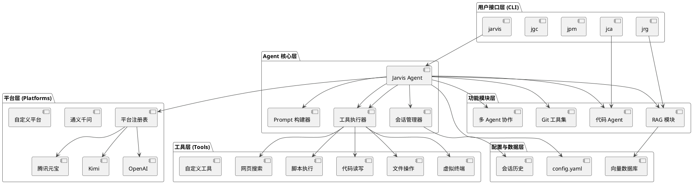

# Jarvis AI 助手产品汇报

---

## 1. 产品概述

### 1.1 项目简介

Jarvis 是一款专为开发人员和高级用户设计的智能化开发与系统交互助手。它深度融合了大型语言模型（LLM）的理解与生成能力，以及强大的本地工具集，旨在自动化和简化从日常办公到复杂软件开发的全流程任务。

Jarvis 的核心设计理念是“AI Agent as a Tool”，即不仅将 AI 视为一个对话伙伴，更将其打造为一个能够自主规划、执行、反思并与本地环境深度交互的智能工具，从而成为用户在数字世界中的得力助手。

### 1.2 核心特性
- **零成本接入**: 无缝集成腾讯元宝、Kimi等多种免费或付费的大型语言模型，提供灵活选择。
- **工具驱动**: 内置丰富的工具集，涵盖代码分析、文件操作、脚本执行、网页搜索、虚拟终端控制等，赋予 AI 实际操作环境的能力。
- **高度可扩展**: 支持用户自定义工具、添加新的大模型平台以及通过 MCP 协议集成外部服务，具备无限扩展潜力。
- **人机协作**: 在自动化执行的同时，支持用户随时进行交互式干预和指导，确保 AI 的行为始终符合最终预期。
- **RAG 增强**: 内置检索增强生成（RAG）功能，可轻松构建基于本地文档（代码、笔记、文档）的专属知识库，让 AI 的回答更具针对性和准确性。
- **智能进化**: 内置方法论系统，能够从任务执行中学习和优化策略，实现“越用越智能”的自适应进化。

---

## 2. 系统架构

Jarvis 采用模块化的分层架构，确保了系统的灵活性、可扩展性和可维护性。

---

## 3. 竞品分析

为了更好地定位 Jarvis 的市场价值和差异化优势，我们选取了市面上几款主流的 AI 编程助手进行对比。

| 特性 | Jarvis | GitHub Copilot | Cursor | Mentat / Claude Code |
| :--- | :--- | :--- | :--- | :--- |
| **产品形态** | 独立 CLI 工具集 | 主流 IDE 插件 | 定制化 IDE (Fork VSCode) | 独立 CLI 工具 |
| **核心交互** | **命令行对话** | GUI 聊天, 行内编辑 | GUI 聊天, `@`引用, 行内编辑 | **命令行对话** |
| **核心能力** | Agent 自主任务, **工具调用**, RAG, 代码生成/修改 | 代码补全, Chat 问答, Agent 自主任务 | 代码生成/编辑, Agent 自主任务, 调试 | Agent 自主任务, 代码生成/修改 |
| **上下文感知** | ✅ **项目级上下文**, ✅ **本地 RAG** | ✅ 工作区上下文, ✅ PR/Issue 上下文 | ✅ 项目级上下文, ✅ `@`符号引用 (文档/网页) | ✅ 项目级上下文 |
| **扩展性** | ✅ **自定义工具**, ✅ **自定义模型/平台** | ❌ 有限 (模型可选) | ❌ 有限 (支持 VSCode 插件) | ❌ 有限 (可自定义 LLM 服务) |
| **运行环境** | ✅ **本地优先**, 可配置任意云端模型 | 云端服务 | 云端服务 | ✅ **本地优先** |
| **开源与成本** | ✅ **开源**, 主要成本为 LLM API (可免费) | 商业闭源, 订阅制 | 商业闭源, 订阅制 | ✅ **开源**, 主要成本为 LLM API |
| **差异化优势** | **极高的灵活性和扩展性**, **工具驱动**, **CLI 原生**, **完全控制数据和模型** | **与 GitHub 生态深度融合**, **代码补全能力强** | **“AI 优先”的 IDE 体验**, **交互流畅** | **专注于纯粹的命令行 Agent 体验** |

---

## 4. 核心应用场景

Jarvis 的强大能力使其能够深度融入日常工作的各个环节，以下是部分核心应用场景的详细阐述。

### 4.1 日常事务处理

利用 Jarvis 的**工具调用**和**自然语言理解**能力，可以自动化处理繁琐的日常办公任务。

- **邮件处理**:
  - **场景**: 收到一封包含多个待办事项和附件的技术支持邮件。
  - **Jarvis 应用**: 结合自定义的邮件读取工具和文件操作工具，Jarvis 可以：
    1.  `'读取最新邮件内容和附件'`
    2.  `'总结邮件要点，并提取待办事项列表'`
    3.  `'将附件下载到本地指定目录'`
    4.  `'根据待办事项起草回复邮件，并交由用户确认发送'`

- **任务管理**:
  - **场景**: 将项目周会的会议纪要转化为团队协作工具（如Jira, Trello）中的具体任务。
  - **Jarvis 应用**:
    1.  `'读取会议纪要文件 a.md'`
    2.  `'分析纪要，识别出每个人的任务、截止日期'`
    3.  `'调用 Jira API 工具，为每个人创建对应的 Task'`

- **汇报材料准备**:
  - **场景**: 根据最近一周的 Git 提交记录和 Jira 任务完成情况，自动生成周报初稿。
  - **Jarvis 应用**:
    1.  `'执行脚本，获取 git log --since="1 week ago"'`
    2.  `'调用 Jira API，获取本周已完成的 Story 和 Bug 列表'`
    3.  `'结合上述信息，按照周报模板生成周报 markdown 文件'`
    
- **信息搜集与整合**:
  - **场景**: 调研“5G核心网UPF的最新开源实现方案”，并整合成报告。
  - **Jarvis 应用**:
    1.  `'使用 search_web 工具搜索 "5G core UPF open source implementation"'`
    2.  `'使用 read_webpage 工具，阅读搜索结果中相关的 GitHub 仓库和技术博客'`
    3.  `'对阅读过的内容进行总结，提取关键项目（如 free5GC, Open5GS）的技术特点、编程语言（C/Go）和社区活跃度'`
    4.  `'将总结和关键点整理成一份调研报告'`

### 4.2 开发环境搭建

对于新项目启动或新成员加入，环境搭建往往耗时且易出错。Jarvis 可将此过程变为“一句话的事”。

- **场景**: 为一个新的基于 Rust 的嵌入式网络监控应用，搭建支持交叉编译的开发环境（目标平台 aarch64-unknown-linux-gnu）。
- **Jarvis 应用** (`jvs`):
  1.  **用户输入**: `'为我搭建一个 Rust 交叉编译环境，目标是 aarch64 平台的 Linux 系统。'`
  2.  **Jarvis 规划与执行**:
      - **规划**: 识别出关键组件：Rust (rustup), aarch64-linux-gnu 交叉编译工具链, QEMU (用于模拟测试)。
      - **执行**:
        - `'使用 virtual_tty 检查系统是否已安装 a. rustc b. aarch64-linux-gnu-gcc c. qemu-aarch64'`
        - `'如果 rustc 未安装，则执行官方安装脚本 curl --proto '=https' --tlsv1.2 -sSf https://sh.rustup.rs | sh'`
        - `'执行 rustup target add aarch64-unknown-linux-gnu 添加交叉编译目标'`
        - `'检查并提示用户在 .cargo/config.toml 文件中配置 linker = "aarch64-linux-gnu-gcc"'`
        - `'创建一个名为 "rust-embedded-monitor" 的新目录并进入'`
        - `'执行 cargo new --bin . 初始化项目'`
        - `'执行 cargo add pnet --features=std'`
        - `'在 main.rs 中写入一个简单的使用 pnet 库捕获本机网络数据包的示例'`
        - `'提供交叉编译指令：cargo build --target=aarch64-unknown-linux-gnu'`
  3.  **结果**: 用户只需一条指令，即可获得一个配置好交叉编译工具链、包含基础网络库依赖和示例代码的可立即编译的项目环境。

### 4.3 代码开发与重构

这是 Jarvis 的核心价值所在，`jarvis-code-agent` (`jca`) 能够像一名初级开发人员一样，根据需求完成编码任务。

- **新功能开发**:
  - **场景**: 在一个C语言实现的嵌入式网关程序中，增加一个新的CLI（命令行接口）命令 `show ip route`，用于显示系统的路由表信息。
  - **Jarvis 应用** (`jca`):
    1.  **用户输入**: `jca -r "在cli模块中添加一个新的命令 'show ip route'，该命令需要读取并格式化输出 /proc/net/route 的内容。"`
    2.  **Jarvis 规划与执行**:
        - **分析**: 理解需求，定位到需要修改的文件（如 `cli/cli_commands.c`, `cli/cli_parser.c`）和需要引用的头文件。
        - **执行**:
          - `'分析 cli_commands.c，参考现有命令的实现，定义一个新的函数 cli_show_ip_route()。'`
          - `'在该函数中，实现打开、读取并解析 /proc/net/route 文件的逻辑。'`
          - `'将解析出的目标地址、网关、掩码等信息格式化为可读的表格形式输出。'`
          - `'在 cli_parser.c 中注册新的命令 'show ip route' 并将其与 cli_show_ip_route 函数关联。'`
          - `'更新相关的 Makefile 或头文件，确保新函数被正确编译和声明。'`
    3.  **结果**: Jarvis 自动在正确的位置添加了新功能的代码，并处理了相关的注册和构建配置，用户只需审查和编译即可测试新命令。

- **代码重构**:
  - **场景**: 在一个处理通信协议的 Rust 项目中，函数 `handle_incoming_pdu(pdu: &[u8])` 逻辑过于复杂，包含了报文解析、业务处理和应答封装，需要进行重构。
  - **Jarvis 应用** (`jca`):
    1.  **用户输入**: `jca -r "重构 pdu_handler.rs 文件中的 handle_incoming_pdu 函数，将其拆分为独立的解析、处理和响应函数，提高模块化程度。"`
    2.  **Jarvis 规划与执行**:
        - `'读取并分析 pdu_handler.rs 中 handle_incoming_pdu 函数的逻辑。'`
        - `'识别出函数内可独立拆分的逻辑块：协议头解析、消息体验证、业务逻辑分发、构造响应报文。'`
        - `'创建新的私有函数，如 parse_pdu(pdu: &[u8]) -> Result<Pdu, Error>，process_business_logic(pdu: &Pdu) -> Result<Response, Error>，build_response_pdu(response: &Response) -> Vec<u8>。'`
        - `'将 handle_incoming_pdu 的实现，替换为按顺序调用上述新创建的函数，并处理它们之间的 Result 错误传递。'`
        - `'确保重构后的函数对外接口和错误处理与原始函数保持兼容。'`
    3.  **结果**: 自动完成复杂函数的重构，将代码分解为符合 Rust 设计哲学（如使用 Result 进行错误处理）的多个内聚单元，并等待用户确认。

### 4.4 故障定位与修复

面对线上突发故障，Jarvis 可以成为快速响应、定位问题的得力助手。

- **场景**: 现场通信设备发生崩溃，生成了一个 coredump 文件。初步定位是处理特定SIP信令时发生段错误（Segmentation Fault）。
- **Jarvis 应用** (`jvs` 或 `jca`):
  1.  **用户输入**: `'设备上报了一个 coredump，gdb 初步定位在 sip_handler.c 的 process_sip_invite 函数。帮我分析 coredump 并定位根因。这是 coredump 和可执行文件路径：[...]'`
  2.  **Jarvis 规划与执行**:
      - **信息收集**:
        - `'使用 virtual_tty 启动 gdb，加载可执行文件和 coredump 文件。'`
        - `'在 gdb 中执行 backtrace (bt) 命令，获取崩溃时的函数调用栈。'`
        - `'根据调用栈，定位到崩溃的具体代码行，并打印相关变量的值，特别是指针和数组索引。'`
        - `'使用 jarvis-rag query "处理SIP INVITE消息时发生段错误的历史案例"，查询内部故障处理知识库。'`
      - **分析与诊断**:
        - 结合调用栈、变量值（例如：发现一个指针为 NULL）和 RAG 返回的内部知识（例如：“某型号终端发来的 INVITE 消息可能缺少 'Contact' 头域”），Jarvis 推断出问题根源：`代码在处理缺少 'Contact' 头域的 INVITE 消息时，对一个空指针进行了访问`。
      - **修复与验证**:
        - `'使用 edit_file 工具，在解引用指针前增加一个空指针检查。'`
        - `'为该修复添加详细的错误日志，记录收到的畸形报文。'`
        - `'编写一个新的单元测试用例（或报文重放脚本），专门构造缺少 'Contact' 头域的 INVITE 报文，确保修复后的代码能正确处理异常并返回错误码，而不是崩溃。'`
  3.  **结果**: Jarvis 不仅定位了导致崩溃的直接原因并进行了修复，还结合内部知识库指出了问题场景，并补充了单元测试以防止问题复发。

### 4.5 DevOps 流程自动化

通过将 Jarvis 的能力与 CI/CD 流水线结合，可以实现更高层次的自动化。

- **场景**: C++ 语言编写的基站协议栈项目，在代码合并到发布分支后，自动完成版本更新、生成发布日志、交叉编译、打包固件并归档。
- **Jarvis 应用** (作为 CI/CD 脚本的一部分):
  1.  **触发**: Jenkins / GitLab CI 检测到 `release` 分支有新的合并。
  2.  **执行脚本调用 Jarvis**:
      - **版本更新**: `jca -r "根据 conventional commits 规范，将项目版本号从 $(cat VERSION) 进行 'patch' 级别的提升，并更新到 VERSION 文件和代码头文件中"`
      - **生成发布日志**: `jvs -t "读取 git log --since=<上次发布tag>，总结这段时间的主要变更，包括协议优化、缺陷修复，生成 ReleaseNotes.md 的最新条目"`
      - **构建与打包**:
        - `'读取 VERSION 文件获取最新版本号'`
        - `'执行交叉编译脚本 build.sh --platform=arm-linux --version=$(cat VERSION)'`
        - `'执行打包脚本 package.sh，将编译出的二进制文件、配置文件和依赖库打包成 a.b.c.tar.gz 固件包'`
        - `'调用自定义工具，将固件包上传到 Artifactory，并通知测试团队准备验证'`
  3.  **结果**: 整个发布流程无需人工干预，Jarvis 承担了其中需要智能分析（如判断版本升级类型、总结变更日志）和重复执行（编译、打包、归档）的工作，极大地提升了嵌入式软件发布流程的效率和规范性。

---

## 5. 后续发展规划

为了持续提升 Jarvis 的核心竞争力，我们规划了以下发展方向：

- **增强型多 Agent 协作**:
  - **目标**: 从目前的单 Agent 主导或简单的子任务分发，演进为更复杂的、基于角色的多 Agent 协作模式（如模拟“产品经理”、“开发工程师”、“测试工程师”协同工作）。
  - **实施路径**: 引入 Agent 间的通信协议，建立任务协调和状态同步机制，使其能独立完成从需求分析到代码提测的完整闭环。

- **可视化交互界面 (GUI)**:
  - **目标**: 降低使用门槛，为非 CLI 用户提供图形化操作界面。
  - **实施路径**: 开发一个独立的桌面应用或 Web 应用，以可视化的方式展示 Agent 的思考过程、任务规划、文件变更和工具调用结果，并允许用户通过点击、拖拽等方式进行干预和确认。

- **深度 IDE 集成**:
  - **目标**: 将 Jarvis 的强大 Agent 能力无缝嵌入到开发者的日常工作环境中，如 VS Code。
  - **实施路径**: 开发一个 VS Code 插件，实现：
    - 将 `jca` 的代码修改能力与编辑器的“问题”面板和“差异”视图结合。
    - 提供侧边栏聊天窗口，支持 `@file`、`@symbol` 等上下文引用。
    - 将 `jvs` 的终端能力直接集成到 VS Code 的内置终端中。

- **开放生态建设**:
  - **目标**: 打造一个开放的、可共享的工具和方法论社区。
  - **实施路径**:
    - 建立一个公共的**工具市场**，允许用户发布和分享自己的自定义工具。
    - 创建一个**方法论（Methodology）仓库**，鼓励社区贡献针对不同场景（如“数据库性能优化”、“前端组件开发”）的最佳实践工作流，让 Jarvis 可以动态加载并应用。
