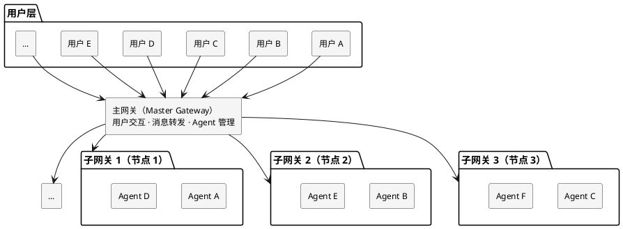
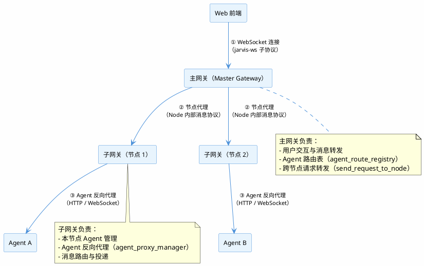

# Jarvis：面向开发者的多智能体协作与 AI 编程平台

> **一句话定位**：Jarvis 是首个将「多人协作 + 多 Agent 协同 + 符号级代码理解」三者统一的 AI 开发平台——单兵要强，军团要协同。

> **参赛赛道**：开源 AI 工具赛道
> **项目名称**：Jarvis AI 助手（jarvis-ai-assistant）
> **开源协议**：MIT License
> **技术栈**：Python 3.12 / SQLite / tree-sitter / FastAPI / WebSocket / Playwright
> **当前版本**：4.0.0
> **项目规模**：319 个 Python 源文件 / 15.5 万行代码 / 70 个测试文件 / 960 个测试用例
> **代码仓库**：https://gitee.com/skyfireitdiy/Jarvis

---

## 一、项目背景

### 1.1 一个真实的问题：AI 编程工具为何「单兵作战」？

2024 年以来，Claude Code、CodeX、CodeBuddy 等 AI 编程工具相继问世，将大模型能力产品化，让开发者第一次体验到「AI 写代码」的效率。然而，这些工具在设计之初都隐含了一个假设：**AI 助手是个人工具，一人一 Agent，单机单节点**。

这个假设在个人开发场景下成立，但在真实的企业开发环境中，问题立刻暴露：

- **团队无法共享**：一个 Agent 实例同时只能被一个用户操作。当团队需要围绕同一个任务协作时，只能「各自开各自的 Agent」，上下文割裂，经验无法共享。
- **资源无法协同**：Agent 运行在单一节点上。A 机器有编译环境，B 机器有测试环境，但 Agent 无法跨节点调用，只能把全部工具链塞进一台机器。
- **Agent 之间无法协作**：每个 Agent 都是孤岛。没有通信机制，没有指挥体系，无法形成「一个 Agent 发现问题、另一个 Agent 解决问题」的协作闭环。
- **代码理解停留在表面**：AI 工具读代码时只能「看到」当前文件，无法感知符号间的依赖关系。修改一个底层函数会影响哪些模块？主流工具答不上来。

**核心矛盾**：AI 编程工具的能力在「单兵」层面已经很强，但真实开发是「军团作战」——需要多人、多 Agent、多节点协同。现有工具在「军团」层面是空白。

### 1.2 Jarvis 的回答：四象限协作模式

Jarvis 是一个**本地运行、开箱即用、可深度定制**的协作式 AI 开发助手平台。它的核心命题是：**让 AI 从「单兵作战」进化到「军团协同」**。

AI 开发工具的协作能力，可以从两个维度交叉分析：

- **人的维度**：单人使用 vs 多人协作
- **Agent 的维度**：单个 Agent vs 多个 Agent

由此得到四种协作模式：

| 协作模式 | 核心场景 | 关键能力 | 技术支撑 |
|----------|----------|----------|----------|
| **单人单 Agent** | 个人开发者深度编码 | 符号数据库、影响分析、多语言解析 | SQLite 符号图、tree-sitter、图遍历 |
| **单人多 Agent** | 个人编排多 Agent 协作 | Agent 编排、多 Agent 通信、对抗式优化 | `<OrganizeAgents>`、`send_to_agent`、自演化网络 |
| **多人单 Agent** | 团队共享同一 Agent | Agent 共享、ACL 权限、并发操作 | JWT 认证、权限组、消息队列 |
| **多人多 Agent** | 团队级分布式协作 | 多节点、多网关、跨节点通信 | 主从网关、WebSocket、Worktree |

这四种模式并非孤立，而是层层递进：**单人单 Agent 是基础，单人多 Agent 是扩展，多人单 Agent 是共享，多人多 Agent 是终极形态**。Jarvis 完整覆盖了全部四种模式，这是其区别于主流 AI 开发工具的核心优势。

**Jarvis 在 AI 开发工具光谱中的位置**：

| 工具 | 定位 | 协作能力 | 代码理解 |
|------|------|----------|----------|
| Claude Code / CodeX / CodeBuddy | 单兵武器 | 单人单 Agent | 文本/向量检索 |
| **Jarvis** | **军团作战系统** | **四象限全覆盖** | **符号级理解** |

主流工具止步于「单兵」象限，Jarvis 是唯一完整覆盖「单人 → 多人」「单 Agent → 多 Agent」两个维度的平台。

而这一切的基础，是 Jarvis 的**多节点、多 Agent、多网关**架构设计。

---

## 二、技术架构

### 2.1 总体架构

Jarvis 采用「多节点 + 多网关 + 多 Agent + 多用户」的分布式协作架构：



该架构包含三个核心层次：

- **用户层**：面向终端用户，提供统一访问入口。用户通过 CLI、Web 界面或 Python SDK 与系统交互，无需感知底层节点分布。
- **网关层**：采用主从架构。主网关负责用户交互、消息转发及 Agent 管理，子网关负责各自节点的消息路由与 Agent 运行。
- **节点层**：承载 Agent 运行环境。每个节点对应一个物理服务器，运行一个子网关及多个 Agent 实例，可承载不同的专用资源与环境。

网关集群具备以下核心能力：

- **集群管理**：主子节点间通过 WebSocket 长连接维持心跳，支持节点注册与发现、自动重连（指数退避）、配置同步、代码更新、服务重启等运维操作。
- **流量代理**：网关内置反向代理层，将前端 HTTP/WebSocket 请求透明代理至目标 Agent 端口，支持 SSE 流式转发、连接池复用。
- **智能代理判断**：自动识别目标地址是否为内网 IP，内网直连绕过代理，外网走 `http_proxy`。
- **消息路由协议**：定义 20+ 种内部消息类型，保障跨节点消息的可靠路由与传递。
- **Agent 无损重生**：支持 `regenerate_agent` 操作，通过「获取配置 → 保存会话 → 删除 → 同参重建 → 恢复会话」五步流程，会话上下文不丢失。
- **网关重启不影响 Agent**：Agent 以独立进程组运行，与网关进程完全解耦，网关重启、升级时运行中的 Agent 不受影响。

### 2.2 核心模块

| 模块 | 职责 | 关键实现 |
|------|------|----------|
| `jarvis_agent` | Agent 基类 | 事件总线、分层记忆、规则加载、任务列表集成 |
| `jarvis_code_agent` | 代码智能体 | 符号数据库、图遍历、影响分析、依赖分析 |
| `jarvis_web_gateway` | Web 网关 | 多用户认证、节点管理、Agent 生命周期、聊天室 |
| `jarvis_tools` | 工具集 | 元代理自举、虚拟终端、智能 Shell |
| `jarvis_mcp` | MCP 客户端 | stdio / sse / streamable 三协议 |
| `jarvis_sec` | 安全分析 | 污点分析、数据流分析、C/Rust 检查器 |
| `jarvis_c2rust` | C→Rust 迁移 | 完整流水线、断点续跑 |

## 三、协作模式全景：四象限逐一展开

Jarvis 的核心能力可概括为两大支柱：**单兵作战能力**与**军团协同能力**。本章以「人 × Agent」四象限为骨架，逐一展开每种协作模式的技术支撑与差异化优势。

### 3.1 单人单 Agent：单兵要强

这是最基础的协作模式，也是 Jarvis 技术深度的根基。单个 CodeAgent 必须具备超越主流工具的深度代码理解能力——不是「看到」代码，而是「看懂」代码的依赖关系、影响范围、调用链。

#### 3.1.1 SQLite 符号数据库 + 图遍历

Jarvis 使用 SQLite 存储代码符号与依赖边，而非简单的文本索引。核心实现共 1641 行代码（`symbol_table_db.py` 327 行 + `impact_analyzer.py` 934 行 + `graph_traverser.py` 257 行 + `database.py` 123 行）：

- **符号表**：`SymbolTableDB` 存储函数、类、方法、变量等符号及其位置信息，支持按名称、类型、文件路径多维查询
- **依赖边**：记录符号间的调用、引用、继承关系，构成完整的有向依赖图
- **图遍历**：`GraphTraverser` 支持 BFS 前向/后向遍历，可查询「谁调用了这个函数」「这个函数依赖什么」，支持最大深度限制避免遍历爆炸
- **预编译 SQL**：`QueryBuilder` 预编译 SQL 语句，避免运行时 SQL 拼接开销，查询性能优异

**技术深度**：符号数据库不是简单的「文本索引」，而是真正的**代码知识图谱**。每个符号是一个节点，每条依赖关系是一条有向边。当开发者问「修改 `parse_config` 函数会影响哪些地方」时，Jarvis 不是模糊匹配关键词，而是在图上做精确的 BFS 遍历，返回确切的调用链。

**差异化**：主流工具（如 Claude Code、CodeX）或基于向量检索、或基于 grep 文本搜索，均无法精确回答「修改这个函数会影响哪些地方」。向量检索只能找到「语义相似」的代码片段，grep 只能找到「包含这个字符串的文件」，两者都无法保证「调用关系」的完整性。Jarvis 的符号图可以精确回答，且结果可解释、可验证。

**符号数据库 vs 向量检索：理论上的必然优势**

向量检索方案存在三个固有开销，使其在本地研发场景中必然慢于符号数据库：

1. **向量化前置开销**：向量检索需要先将代码片段送入嵌入模型（本地或在线）生成向量。嵌入模型推理本身耗时——即使是最轻量的本地模型，对 52 万行代码做向量化也需要数分钟到数十分钟，而 Jarvis 的符号数据库建库仅需 22 秒。
2. **算力与内存要求**：嵌入模型推理对算力有硬性要求。Jarvis 的符号数据库在 4GB 内存的机器上运行毫无卡顿与延迟，而向量化方案在同等配置下速度会显著下降，甚至因内存不足而无法运行。
3. **磁盘空间开销**：向量索引需要存储高维向量（通常 384-1536 维浮点数），52 万行代码的向量索引体积可达数百 MB 甚至 GB 级，而 Jarvis 的符号数据库仅 40.5 MB。

**结论**：符号数据库是「精确、轻量、可解释」的方案，向量检索是「模糊、重载、黑盒」的方案。对于本地研发场景，符号数据库在资源消耗与查询精度上具有理论上的必然优势——无需实验对比，从方案原理即可判定。

**性能实测**（真实环境：Ubuntu 24.04，Python 3.12，SQLite WAL 模式；测试服务器为 2 核 Intel Xeon Gold 6133 @ 2.50GHz、3.8GB 内存、30GB 磁盘；测试对象为 Django 开源项目——2929 个 Python 文件、52.4 万行代码）：

- **建库耗时**：22.11 秒（64763 个符号，平均 7.5ms/文件、0.34ms/符号）
- **符号查询**：`find_definition` 平均 6.4ms/次，`find_references` 平均 1.4ms/次
- **影响分析**：4.6-4.7 秒/次（对 52 万行代码库做全图影响分析）
- **图遍历**：BFS 遍历 0.1-0.3ms/次（亚毫秒级）
- **数据库体积**：40.5 MB（64763 个符号节点）

> 注：52 万行代码库建库仅需 22 秒，意味着开发者打开一个大型项目后，几乎无需等待即可获得完整的代码知识图谱。查询与图遍历均为毫秒级，可支撑实时代码补全与影响分析场景。

**数据库更新时机**（增量维护，非全量重建）：

1. **首次读取即建索引**：`read_code` 工具读取文件时，若该文件尚未缓存，立即调用 `update_context_for_file` 提取符号并入库，实现「读即索引」。
2. **惰性刷新**：查询符号（`find_definition` / `find_references`）前，通过 `is_file_stale` 比对文件 mtime 与数据库记录，若文件被外部修改（如用户手动编辑、git 切换分支），自动触发 `_refresh_file_symbols` 重新索引，保证查询结果始终反映最新代码。
3. **编辑后主动更新**：Agent 通过 `edit_file` 修改文件后，主动调用 `update_context_for_file`，执行「清旧数据 → 提取符号 → 分析依赖 → 存缓存」四步增量更新，仅重建被修改文件的索引，其余文件不受影响。

**双轨并行：实时文本搜索 + 符号数据库增量构建**

需要特别说明的是，Jarvis 的代码理解机制是**双轨并行**的，符号数据库并非替代实时读取，而是实时读取之后的**增量副产品**：

- **第一轨：实时文本搜索**。Agent 每次读取文件时，都直接读取磁盘上的最新内容（`_read_text_with_preferred_encoding`），所见即所得，不存在「索引过时」问题——这一点与 Claude Code 的 grep 实时搜索一致。
- **第二轨：符号数据库增量构建**。在实时读取之后，`update_context_for_file` 才被调用，从刚读到的内容中提取符号、分析依赖、写入 SQLite。符号数据库**永远滞后于实时读取一步**，但正因如此，它不承担「提供最新内容」的职责，而是承担「提供结构化理解」的职责——调用链、依赖图、影响范围。

这种双轨设计的关键在于**职责分离**：实时文本搜索保证「内容永远最新」，符号数据库保证「理解永远结构化」。两者互补而非互斥——Claude Code 只有第一轨（grep 实时搜索），因此只能回答「字符串在哪里」；Jarvis 两轨兼备，既能回答「字符串在哪里」，又能回答「这个符号的调用链是什么、改动它会影响哪些模块」。

**差异化**：主流 AI 编程工具（Claude Code、CodeX 等）每次查询都需重新读取文件或依赖外部 LSP 服务，缺乏持久化的符号索引；Jarvis 的符号数据库以「mtime 增量检测 + 单文件粒度更新」实现索引与代码的实时同步，既避免全量重建的开销，又保证查询结果的准确性。

**符号数据库的两大应用场景**：

1. **读代码时提供丰富上下文**：`read_code` 工具读取文件时，调用 `get_edit_context` 基于符号数据库构建编辑上下文（`EditContext`），包含五类信息——当前作用域（光标所在函数/类）、使用符号（编辑区域内引用的符号及其定义位置）、导入符号（文件的 import 关系）、相关文件（依赖与被依赖的文件）、上下文摘要（自然语言描述）。Agent 据此理解「这段代码在哪个函数里、调用了哪些符号、这些符号定义在哪、与哪些文件有关联」，而非仅看到孤立的代码片段。
2. **修改代码后提供影响分析数据**：Agent 通过 `edit_file` 修改文件后，`ImpactManager` 先调用 `update_context_for_modified_files` 更新符号表，再通过 `parse_git_diff_to_edits` 解析修改内容，最后 `ImpactAnalyzer.analyze_edit_impact` 基于符号图计算影响范围，生成影响报告（受影响文件、受影响符号、风险等级），让 Agent 在修改后立即知晓「这次改动波及了哪些模块」。

**差异化**：主流工具的上下文构建依赖「全文读取 + 模型自行理解」，文件一大就超出上下文窗口，且无法感知跨文件依赖；Jarvis 的符号数据库在读取时提供结构化上下文（作用域、符号、依赖关系），在修改后提供量化影响报告，使 Agent 的代码理解与修改决策都建立在精确的符号图之上，而非模糊的文本匹配。

**为何不用 LSP，而用 Tree-sitter**：

AI 编程场景与 IDE 场景有本质区别——Agent 修改的往往是**代码片段**，而非完整的、可编译通过的代码。LSP（Language Server Protocol）的设计前提是「代码处于可编译状态」，它需要完整的项目上下文、正确的构建配置、可解析的类型信息，一旦代码处于中间态（函数写了一半、import 缺失、语法不完整），LSP 就会失效或返回错误结果。

Tree-sitter 则完全不同：

1. **容错解析**：Tree-sitter 是容错解析器，即使代码片段语法不完整、存在错误，也能尽可能恢复出语法树，提取出可用的符号信息。这对 AI 编程至关重要——Agent 在修改过程中，代码几乎总是处于「不完整」状态。
2. **零依赖、零启动开销**：LSP 需要为每种语言启动一个独立的语言服务器进程，维护长连接，内存开销大（每个 LSP 服务器常驻几十到几百 MB）；Tree-sitter 是纯解析库，直接内嵌在进程中，按需解析，开销极小。
3. **无需构建配置**：LSP 依赖项目的构建系统（如 CMake、Maven、Cargo）才能正确解析类型与引用；Tree-sitter 只需语法规则，对任意代码片段都能立即解析，不依赖项目是否可编译。

**差异化**：主流 AI 编程工具（Claude Code、CodeX 等）或依赖 LSP 获取符号信息，或干脆不做符号级分析；Jarvis 选择 Tree-sitter 作为符号提取引擎，正是针对「AI 修改代码片段」这一核心场景——容错、轻量、零配置，使符号数据库在代码的任何中间态都能稳定工作。

#### 3.1.2 影响范围分析

`ImpactAnalyzer`（934 行）识别五类影响，每类影响都附带风险等级：

1. **引用影响**：哪些代码引用了被修改的符号（直接调用者）
2. **依赖影响**：被修改符号依赖了哪些符号（被调用者）
3. **测试影响**：哪些测试会受影响（测试与代码的关联分析）
4. **接口变更影响**：接口签名变化的影响范围（参数增删、类型变更）
5. **依赖链影响**：传递依赖的影响（间接调用者，支持深度配置）

**技术深度**：影响分析不是简单的「搜索引用」，而是**基于符号图的传递闭包计算**。当修改一个底层函数时，Jarvis 会沿依赖边向上遍历，找出所有直接和间接的调用者，并按风险等级排序。开发者可以在修改前就预知「这个改动会影响 3 个模块、12 个函数、5 个测试」，从而做出更明智的决策。

**差异化**：主流工具最多提供「查找引用」功能，返回一个文件列表。Jarvis 提供的是**带风险等级的影响评估报告**，区分直接/间接影响、区分代码/测试影响，让开发者真正「心中有数」。

#### 3.1.3 多语言支持

通过 tree-sitter 支持 **Python / Go / Java / JavaScript / TypeScript / Rust / C / C++** 八种语言的符号提取。每种语言有独立的解析器实现，并有语言注册表机制，可扩展新语言。

**技术深度**：tree-sitter 提供的是**增量解析**能力——代码修改后无需重新解析整个文件，只重新解析变化的子树。这意味着符号数据库可以**增量更新**，而非每次全量重建。对于百万行代码的项目，这是性能的关键。

**差异化**：主流工具通常只深度支持 1-2 种语言（如 Python），对其他语言的支持停留在「文本匹配」层面。Jarvis 的八种语言都经过 tree-sitter 的 AST 级解析，符号提取的精度一致。

#### 3.1.4 无人值守：任务级与进程级双模式

Jarvis 支持两种粒度的无人值守运行，适合自动化场景：

- **任务级无人值守（自动完成模式）**：Agent 通过 `<AutoComplete>` 标记进入自动完成模式，自行判断任务是否完成，完成后自动总结并将控制权交还用户。
- **进程级无人值守（无交互模式）**：创建 Agent 时指定 `no_interaction_mode=True`，Agent 全程不询问用户，适合 CI/CD、定时任务等完全自动化场景。

**技术深度**：这是**自动化程度的两个层次**。任务级无人值守让 Agent 在单个任务内自主决策；进程级无人值守让 Agent 在整个生命周期内完全自主。两者结合，覆盖从「半自动」到「全自动」的完整光谱。

**差异化**：主流工具需要人工确认每一步操作，Jarvis 可让 Agent 自主完成整个任务流程。

#### 3.1.5 定时任务与延迟调用

Jarvis 内置完整的定时任务体系：

- **定时提示词注入**：支持相对时间、绝对时间、循环间隔三种方式，定时向 Agent 注入提示词。
- **跨节点定时任务**：通过网关可创建定时任务，支持定时创建 Agent 或执行 Shell 命令。
- **全工具延迟调用**：所有工具调用均支持 `after`（延时执行）、`at`（定时执行）、`loop`（循环执行）三个参数，无需额外封装即可实现定时自动化。

**技术深度**：这是**时间维度的自动化**。传统工具只能「立即执行」，Jarvis 让 Agent 可以「延时执行」「定时执行」「循环执行」。这意味着 Agent 可以自主安排未来的工作。

**差异化**：主流工具没有时间维度的自动化能力。Jarvis 的定时任务让 Agent 从「被动响应」变为「主动调度」。

#### 3.1.6 多 Agent 交叉验证与代码审查

`CodeReviewer`（893 行）创建独立的「Code Reviewer」Agent 执行代码审查，而非由编写代码的 Agent 自审：

- 独立的审查 Agent 使用专用系统提示词与配置，与编写 Agent 完全隔离
- 支持单次审查与「审查→修复」循环（审查发现问题 → 编写 Agent 修复 → 再次审查）
- 审查结果结构化解析，格式异常时自动修复
- 避免「自己审自己」的盲区，实现真正的交叉验证

**技术深度**：这是**多 Agent 协作在代码质量保障上的具体应用**。编写代码的 Agent 与审查代码的 Agent 是两个独立的进程，拥有独立的上下文与判断。审查 Agent 不受编写 Agent 的「思维惯性」影响，能够发现编写 Agent 忽略的问题。

**差异化**：主流工具的「代码审查」本质上是**同一个 Agent 的自我检查**——它用同样的上下文、同样的思维模式审视自己的输出，盲区无法消除。Jarvis 的交叉验证是**真正的第二意见**。

#### 3.1.7 Fork 式子 Agent

`sub_agent` 与 `sub_code_agent` 采用 fork 式设计，类似操作系统中的进程 fork：

- 子 Agent 继承父 Agent 的完整对话历史（`parent_agent.model.get_messages()`，过滤系统消息后注入子 Agent）
- 继承父 Agent 的工具集、规则、非交互模式、自动完成等全部配置
- 在首个用户消息前插入「角色切换说明」，告知子 Agent 已继承完整上下文、无需重复已完成的步骤
- 子 Agent 跳过首次初始化（`agent.first = False`），直接基于继承的上下文工作
- 执行完毕后立即清理，不注册至全局，避免资源泄漏
- 任务完成后合并子 Agent 的记忆标签回父 Agent

**技术深度**：fork 式设计的核心价值是**解决上下文传递丢失问题**，而非并行。单个 Agent 本身不支持并行执行；如果只是创建一个子 Agent、再由父 Agent 复制任务信息传递给它，中间难免有信息丢失——父 Agent 需要把「背景、约束、已完成的步骤、发现的问题」全部重新描述一遍，任何遗漏都会导致子 Agent 重复劳动或做出错误决策。Jarvis 的做法是**让子 Agent 直接继承父 Agent 的完整上下文**：对话历史、工具集、规则、配置全部原样继承，子 Agent 一启动就「知道父 Agent 知道的一切」，无需父 Agent 重新转述。这既更好地封装了缓存（上下文不经过二次加工），又提供了完整的上下文信息（零丢失）。

**差异化**：主流工具的「子任务」通常需要父 Agent 手动整理并传递上下文，信息在「父 Agent → 任务描述 → 子 Agent」的链路中层层衰减；Jarvis 的 fork 子 Agent 通过上下文直接继承，跳过了「任务描述转述」这一环节，实现上下文的零丢失传递。

#### 3.1.8 CLI 调用：小需求开发的轻量入口

Jarvis 支持 **CLI（命令行界面）** 形式的调用，开发者无需启动完整服务，即可在终端中直接与 Agent 交互：

- **轻量快速**：一条命令即可启动 Agent，适合小需求开发、快速问答、单文件修改等场景
- **零配置**：无需搭建 Web 服务、无需配置网关，开箱即用
- **管道友好**：CLI 输出可与其他命令行工具（grep、sed、awk）组合，融入开发者日常工作流

**技术深度**：CLI 是「单兵作战」最自然的入口。对于「改一个函数」「查一个调用链」「修一个 bug」这类小需求，启动完整的多节点多网关架构是过重的。CLI 让 Jarvis 在「轻量」与「重量」之间自由切换——小需求用 CLI 秒级响应，大协作用网关架构。

**差异化**：主流工具（如 Claude Code）也提供 CLI，但其代码检索机制与 Jarvis 有本质区别。据 Anthropic 官方《Effective Context Engineering for AI Agents》一文，Claude Code 明确**放弃索引与向量检索**，仅用 glob 与 grep 做实时文本搜索——其设计哲学是「绕过 stale indexing 与复杂语法树」，以换取零预处理与实时性。代价是：Claude Code 只能回答「哪些文件包含这个字符串」，无法回答「这个函数被谁调用、修改它会影响哪些模块」这类结构化问题。

Jarvis 的 CLI 背后是**同一个符号数据库与影响分析引擎**——即使是 CLI 下的单次查询，也能获得符号级的精确回答：`find_definition` 6.4ms 定位定义、`find_references` 1.4ms 列出全部引用、影响分析 4.6 秒给出带风险等级的完整影响报告。这不是「文本搜索 vs 向量检索」的差异，而是「**文本级匹配 vs 符号级理解**」的差异：grep 告诉你「这个字符串出现在哪里」，符号数据库告诉你「这个符号在依赖图中的位置、它的调用链、以及改动它的波及范围」。

### 3.2 单人多 Agent：编排与通信

当单个开发者需要同时驱动多个 Agent 协作时，Jarvis 提供了完整的编排与通信能力。这是从「单兵」到「军团」的第一步扩展。

#### 3.2.1 Agent 编排：一键部署多 Agent 协作网络

Jarvis 内置 **Agent 编排（Orchestration）** 机制，通过 `<OrganizeAgents>` 标签与 YAML 编排文件，可一键批量创建多个 Agent 并配置其协作关系，快速部署出复杂的多 Agent 协作拓扑。

**编排机制**：

- **读取编排文件**：用户输入一个或多个 YAML 编排文件路径，系统自动读取并合并
- **解析 Agent 配置**：从 YAML 的 `agents` 列表中解析每个 Agent 的名称、类型、工作目录、任务描述等配置
- **批量创建 Agent**：通过网关的 `create_agent` 接口批量创建所有配置的 Agent
- **汇总结果**：以表格形式展示每个 Agent 的创建状态（成功/失败计数）

**编排文件格式**：

```yaml
agents:
  - name: "agent_name"
    type: "code_agent"  # Agent 类型
    working_dir: "."    # 工作目录
    task: |             # Agent 的任务描述（提示词）
      你的角色定义和工作目标...
```

**编排优势**：

- **快速部署**：一条命令即可创建完整的 Agent 网络，无需手动逐个创建
- **配置即代码**：Agent 的角色、任务、协作关系全部定义在 YAML 文件中，便于版本管理和复用
- **灵活扩展**：可编排任意数量的 Agent，构建复杂的多 Agent 协作拓扑
- **开箱即用**：`builtin/agent_orchestration/` 目录内置两个现成的编排配置，开箱即用

**内置编排案例一：对抗式 Agent（jsec_adversarial.yaml）**

`builtin/agent_orchestration/jsec_adversarial.yaml` 定义了两个角色对立的 Agent：**jsec_rule_developer**（规则开发 Agent，code_agent 类型）与 **jsec_adversary**（对抗 Agent，agent 类型），形成对抗式协作闭环。该范式的完整论述与真实成果详见 3.2.4 节。

**内置编排案例二：自演化 Agent 网络（self_evolving_network.yaml）**

`builtin/agent_orchestration/self_evolving_network.yaml` 定义了四类协作 Agent：**knowledge_base_agent**（知识库 Agent）、**monitoring_agent**（监控 Agent）、**tech_learning_agent**（技术学习 Agent）、**dispatcher_agent**（调度 Agent），形成自演化闭环。该范式的完整论述详见 3.2.3 节。

#### 3.2.2 Agent 间通信：群聊、点对点与指挥控制

Jarvis 为 Agent 之间设计了专门的关系组织机制：

- **Agent 群聊**：多个 Agent 可在同一群组中交流，实现多 Agent 协同讨论
- **Agent 点对点通信**：`send_to_agent` 允许 Agent 直接向其他 Agent 发送消息，实现一对一的协作
- **通过网关发布消息**：Agent 可通过网关向其他 Agent 发布消息，消息经网关路由至目标 Agent 所在节点，实现跨节点的 Agent 协作
- **指挥与控制其他 Agent**：Agent 可通过网关接口指挥和控制其他 Agent，实现任务分解、结果汇总、协作编排等高级功能

#### 3.2.3 自演化 Agent 网络：记忆系统的高阶形态

**自演化 Agent 网络**的目标是为个人用户构建一个**知识积累、用户画像、自进化的工作区**，使工作区内的内容对日常工作产生有利支撑。其本质是 Jarvis 记忆系统的高阶形态：将分散的会话记忆、任务经验、技术知识、用户偏好统一沉淀为结构化知识，并持续演化。

**四类协作 Agent 的职责分工**：

- **knowledge_base_agent**（知识库 Agent，code_agent 类型）：工作区的知识中枢，负责知识的存储、检索、整理、优化与传递。知识库分 experiences、best_practices、solutions、patterns、collective_wisdom、index 等子目录，知识条目包含任务类型、问题描述、解决方案、适用场景、质量评分、时间戳六要素。
- **monitoring_agent**（监控 Agent，agent 类型）：负责监控工作区状态，检查各 Agent 的运行状态（心跳、CPU、内存、磁盘、任务队列），分析工作区性能，提前预防故障。
- **tech_learning_agent**（技术学习 Agent，agent 类型）：常驻工作区，从互联网搜索学习 Agent 开发相关的新技术（架构、通信、协作、记忆、规划），整理归纳后通过 memory 工具存入知识库。
- **dispatcher_agent**（调度 Agent，agent 类型）：负责任务分派，分析任务复杂度、选择最合适的 Agent、均衡负载、故障时迁移任务或创建新 Agent 续接。

**自演化闭环**：调度 Agent 分派任务 → 执行 Agent 执行任务 → 知识库 Agent 沉淀知识 → 监控 Agent 监控状态 → 技术学习 Agent 搜索新技术，使工作区能力随使用持续增强。

**关键洞察**：自演化网络将「知识沉淀」从「任务执行」中独立出来，形成专门的反馈回路。传统 AI 工具中，每次任务的经验随会话结束而丢失；Jarvis 通过知识库 Agent 将经验持久化为结构化知识，通过调度 Agent 在后续任务中复用，通过技术学习 Agent 持续引入外部新知，逐步构建起对用户工作习惯、技术栈、项目背景的深度理解（用户画像），使工作区从「被动执行工具」进化为「主动支撑日常工作的自进化环境」。

**方法论价值**：该范式是记忆系统的高阶形态，可推广至个人知识管理、持续学习、工作区智能化等场景。其编排配置见 3.2.1 节「内置编排案例二」。

#### 3.2.4 对抗式 Agent 优化专家系统

**对抗式 Agent 优化专家系统**是 Jarvis 独有的多 Agent 协作范式，其核心思想借鉴生成对抗网络（GAN）：通过两个角色对立的 Agent 进行对抗迭代，将大语言模型的泛化能力逐步沉淀到专家系统的确定性规则中，实现两种范式的优势融合。

**对抗式 Agent 的完整工作流程**：

1. **开发 Agent 编写规则**：规则开发 Agent 编写第一版专家系统规则
2. **对抗 Agent 发现漏洞**：漏洞查找 Agent 通过黑盒测试与白盒扫描主动发现漏报与误报
3. **反馈与改进**：对抗 Agent 将发现的漏洞反馈给开发 Agent，开发 Agent 分析反馈并改进检测规则
4. **验证与深度对抗**：对抗 Agent 验证改进效果，通过后进入深度对抗阶段
5. **持续迭代**：重复上述循环，直到对抗 Agent 无法找到规避方法

**真实案例：jsec 静态检查规则的对抗式进化**

jsec（Jarvis Security Scanner）是 Jarvis 的 C/C++ 安全漏洞静态扫描模块。在约 **2 天**内，通过对抗式 Agent 完成了 13 次提交迭代：

- **规则数量**：C/C++ 检查器增长至 **62 条检测规则**，Rust 检查器 **34 条规则**
- **架构演进**：从正则驱动重构为 **SQLite 数据库驱动**，支持跨函数、跨文件的数据流分析与污点传播分析
- **最终验证**：**154 个漏洞样本全部检测，110 个安全样本 0 误报**，34 个 pytest 测试全部通过
- **代码规模**：c_checker.py 增长至 9453 行
- **知识获取**：对抗 Agent 通过联网搜索 CWE 数据库、CVE 案例、开源工具规则，实时获取最新安全知识

**关键洞察**：AST 污点分析和数据流分析能力**并非预先设计，而是在对抗过程中自然产生的**。当对抗 Agent 构造出跨函数的 UAF（释放后使用）绕过案例时，正则匹配完全无法应对，迫使开发 Agent 实现了基于数据库的数据流追踪。这种「对抗压力驱动架构演进」的模式，是 Jarvis 区别于静态工具链的核心创新。

**方法论价值**：对抗式 Agent 的核心是「逐步将模型的不确定能力沉淀为专家系统的确定规则」。该方法可推广至故障定位、专家运维、安全合规审计、代码审查等专家系统与 Agent 混合场景。其编排配置见 3.2.1 节「内置编排案例一」。

---

### 3.3 多人单 Agent：共享与权限

当多个开发者需要共享同一个 Agent 时，Jarvis 提供了完整的多用户认证、权限控制与并发操作能力。这是从「单人」到「团队」的关键一步。

> **接入方式说明**：多人单 Agent 的共享与权限能力**仅通过 Web 接口提供**，CLI 不支持多用户共享。

#### 3.3.1 多用户认证与权限组

Jarvis 内置完整的用户认证与权限体系：

- **JWT 多用户认证**：基于 JWT（JSON Web Token）的用户认证机制，支持多用户登录
- **权限组（ACL）**：基于访问控制列表（ACL）的权限管理，不同用户拥有不同的操作权限
- **用户隔离**：每个用户拥有独立的会话、记忆与配置，互不干扰

**技术深度**：Jarvis 的权限体系不是简单的「登录/未登录」二元判断，而是**两层细粒度 ACL 权限模型**：

**第一层：管理员系统级权限**。管理员负责系统级权限管理，精确控制每个用户能执行哪些操作：

- 是否可以创建 Agent
- 是否可以创建集成终端
- 是否可以创建定时任务
- 是否可以修改配置
- 是否可以访问某节点

**第二层：Agent 创建者资源级权限**。每个 Agent 的创建者可以自主控制该 Agent 的访问权限，分为三个级别：

- **无权限**：用户完全看不到该 Agent
- **只读权限**：用户可以查看该 Agent 的信息，但不能与其交互
- **交互权限**：用户可以与该 Agent 进行完整的对话交互

这种「管理员管系统、创建者管资源」的分层权限模型，既保证了平台级的安全管控，又赋予资源所有者灵活的自主权。

**差异化**：主流 AI 开发工具（如 Claude Code、CodeX）是**单用户本地工具**，没有多用户概念。Jarvis 是**团队级协作平台**，支持多人共享同一个 Agent 实例。

#### 3.3.2 Agent 共享与并发操作

多个用户可以同时操作同一个 Agent：

- **共享 Agent**：多个用户可通过网关访问同一个 Agent，实现 Agent 的团队共享
- **并发操作**：多个用户可同时向同一个 Agent 发送消息，消息进入 Agent 的输入队列，按序处理
- **会话共享**：所有用户与 Agent 的对话在同一个会话中，彼此可见对方的消息，天然适配结对编程场景
- **用户标识**：每个用户发给 Agent 的消息会自动增加用户标识，Agent 能区分「这是谁在跟我说话」

**技术深度**：Agent 共享的核心是**消息队列 + 会话共享 + 用户标识**。多个用户的消息进入同一个 Agent 的输入队列，Agent 按序处理；所有消息在同一会话中共享可见，但每条消息自动附带用户标识，Agent 能准确区分消息来源。这种设计使多人可以围绕同一个 Agent 进行结对编程、协同调试，实时看到彼此的输入与 Agent 的响应。

**差异化**：主流工具是「一人一 Agent」模式，Agent 无法被团队共享。Jarvis 的 Agent 是**团队资产**，可以被多个成员共同使用。

#### 3.3.3 聊天室：群聊与私聊

Jarvis 内置完整的聊天室系统，支持人与人之间的实时协作：

- **聊天室列表**：查看所有聊天室
- **在线用户列表**：查看当前在线用户
- **聊天室成员列表**：查看聊天室成员
- **聊天室消息**：发送聊天室消息（自动添加 [Agent名字] 前缀）
- **私聊消息**：发送私聊消息（支持 client_id 或 user_id）

**技术深度**：聊天室系统让 Jarvis 不仅是「AI 工具」，更是「团队协作空间」。开发者可以在聊天室中讨论问题、分享进展、协调工作，同时随时召唤 Agent 参与讨论。

**差异化**：主流 AI 开发工具没有内置聊天室。团队协作需要切换到 Slack、钉钉等外部工具。Jarvis 将「人-人协作」与「人-Agent 协作」统一在同一个平台内。

---

### 3.4 多人多 Agent：多节点多网关的终极形态

这是四象限的终极形态：多个开发者、多个 Agent、分布在多个节点上，通过多个网关协同工作。这是 Jarvis 区别于所有主流 AI 开发工具的根本架构优势。

#### 3.4.1 多节点多网关架构

Jarvis 的核心架构是**多节点、多 Agent、多网关**：

- **多节点**：Jarvis 可部署在多个物理或虚拟节点上，每个节点运行独立的 Agent 服务
- **多网关**：每个节点运行一个 Web 网关，负责本节点的 Agent 管理与消息路由
- **节点注册**：子节点通过 `get_node_secret` 获取连接私钥，向主网关注册，形成节点网络
- **跨节点通信**：消息经网关路由至目标 Agent 所在节点，实现跨节点的 Agent 协作
- **节点管理**：`list_nodes` 查看所有节点信息，`update_nodes_code` 一键更新所有节点代码，`restart_nodes` 一键重启所有节点服务

**技术深度**：多节点架构的核心是**网关路由 + 节点注册**。每个节点是自治的（独立运行 Agent），但通过网关互联（消息可跨节点路由）。这类似于微服务架构中的服务注册与发现，但针对 Agent 场景做了专门设计。

**差异化**：主流 AI 开发工具是**单机单进程**架构，无法跨机器协作。Jarvis 的多节点架构让团队可以构建**分布式的 Agent 协作网络**，Agent 可以运行在不同的机器上，通过网关协同工作。

#### 3.4.2 跨节点 Agent 通信

Jarvis 支持跨节点的 Agent 通信：

- **跨节点消息路由**：`send_to_agent` 可指定目标节点，消息经网关路由至目标 Agent
- **跨节点 Agent 管理**：`create_agent`、`delete_agent`、`regenerate_agent` 均可指定目标节点
- **跨节点目录浏览**：`list_directory` 支持跨节点查询文件系统
- **跨节点定时任务**：`create_timer` 支持指定节点创建定时任务

**技术深度**：跨节点通信的核心是**网关代理**。当 Agent A（在节点 1）需要与 Agent B（在节点 2）通信时，消息先发送到节点 1 的网关，网关发现目标 Agent 在节点 2，将消息转发到节点 2 的网关，再由节点 2 的网关投递给 Agent B。整个过程对 Agent 透明。

**跨节点通信架构**：



**两个通信连接代理**：

1. **节点代理（主网关 ↔ 子网关）**：主网关与子网关之间通过 WebSocket 长连接维持通信，使用 Node 内部消息协议（20+ 种消息类型，如 `AGENT_HTTP_REQUEST`、`NODE_HTTP_PROXY_REQUEST`、`AGENT_WS_OPEN_REQUEST` 等）。当 Web 请求的目标 Agent 不在本地节点时，主网关通过 `send_request_to_node` 将请求转发到目标子网关。
2. **Agent 反向代理（网关 ↔ Agent）**：子网关通过 `agent_proxy_manager` 将请求反向代理到 Agent 的本地端口，支持 HTTP 与 WebSocket 两种协议。这一层解决了云环境下端口管理问题——Agent 无需暴露公网端口，所有流量经网关统一代理。

**两层代理架构的设计优势**：

- **端口管理简化**：Agent 运行在内网，无需暴露公网端口。所有外部流量经网关统一代理，彻底解决云环境下「每个 Agent 都要开一个端口」的端口爆炸问题。
- **统一入口与透明路由**：Web 前端只需连接主网关，无需感知节点分布。主网关通过 `agent_route_registry` 自动确定目标 Agent 所在节点并转发，对前端完全透明。
- **安全隔离**：网关是唯一对外入口，可在此统一实现鉴权、权限控制、限流与审计。Agent 不直接暴露，攻击面大幅缩小。
- **协议统一**：Node 内部消息协议（20+ 种消息类型）统一了跨节点通信，同时支持 HTTP、WebSocket、流式 SSE 等多种传输方式，上层无需关心底层差异。
- **水平扩展**：新增节点只需向主网关注册（`get_node_secret` 获取连接私钥），无需修改前端或 Agent 代码，系统可平滑扩展。
- **对 Agent 透明**：Agent 间通信无需知道目标 Agent 在哪个节点，消息路由完全由网关层处理，Agent 只需调用 `send_to_agent` 即可。

**差异化**：主流工具无法实现跨机器的 Agent 通信。Jarvis 的跨节点通信让 Agent 可以**分布在不同机器上协同工作**，突破了单机的资源限制。

#### 3.4.3 Worktree 并行开发：多人多需求的协作价值

Jarvis 的 `create_agent` 支持 `worktree` 参数，这是多人多 Agent 协作的关键能力：

**人与人协作的两种方式**：

1. **同时完成一个需求**：多个开发者 + 多个 Agent 在同一工作目录协作，共同推进同一个需求（前述 3.3 节的模式）
2. **不同人开发不同需求**：不同开发者在同一存储库的不同 git worktree 中并行开发不同需求，互不干扰

**Worktree 的价值**：

- **并行开发**：每个 worktree 是独立的 git 工作目录，不同需求在不同 worktree 中并行开发
- **隔离冲突**：不同需求的代码修改互不干扰，避免合并冲突
- **Agent 专属空间**：每个 Agent 可以在独立的 worktree 中工作，拥有干净的代码环境
- **快速切换**：开发者可以在不同 worktree 之间快速切换，无需 stash 或 commit

**技术深度**：Worktree 是 git 的原生能力，但 Jarvis 将其与 Agent 创建深度集成。创建 Agent 时指定 `worktree=True`，Agent 自动在独立的 worktree 中工作，避免与主工作目录的代码冲突。

**定位**：Worktree 是 git 的原生能力，主流 AI 开发工具（如 Claude Code、CodeX）也已支持。Jarvis 在此对齐主流，不落后。Jarvis 的独特价值在于将 worktree 与**多 Agent 编排深度集成**——创建 Agent 时指定 `worktree=True`，Agent 自动在独立 worktree 中工作，且多个 worktree 中的 Agent 可通过网关互相通信、协同推进不同需求，这是「多人多 Agent 并行开发」的完整闭环。

#### 3.4.4 节点级运维：一键更新与重启

Jarvis 提供节点级的运维能力：

- **一键更新代码**：`update_nodes_code` 更新所有节点代码到 main 分支并拉取最新
- **一键重启服务**：`restart_nodes` 一键重启所有节点服务，跳过当前节点，先启动子节点，最后启动 master 节点
- **节点状态查询**：`list_nodes` 查看节点配置、运行状态、已注册子节点等

**技术深度**：节点级运维的核心是**拓扑感知的重启顺序**。重启时先启动子节点，最后启动 master 节点，确保 master 节点启动时所有子节点已就绪。这种拓扑感知的运维能力是分布式系统的关键。

**差异化**：主流工具没有节点概念，自然没有节点级运维。Jarvis 的节点级运维让团队可以**像管理微服务一样管理 Agent 网络**。

---

### 3.5 核心创新点补充：超越协作的深度能力

四象限协作模式是 Jarvis 的骨架，但 Jarvis 的创新能力不止于此。以下能力让 Jarvis 从「协作平台」进一步进化为「可自我进化的 AI 开发生态」。

#### 3.5.1 工具自扩展与 Agent 自举开发

Jarvis 采用**内核 + 插件包**的扩展架构，工具集可随需求增长：

- 内核提供 Agent 基类、网关、记忆、规则等核心能力
- 插件包（如 `jarvis_code_agent`、`jarvis_mcp`、`jarvis_sec`、`jarvis_c2rust`）以独立模块形式扩展能力
- 第三方可独立开发插件包，无需修改内核
- 元代理（`meta_agent`）支持根据自然语言描述生成新工具代码并注册，实现工具集的自我扩展

**插件包的设计与实现**：

- **插件格式**：每个插件是一个包含 `config.yaml` 的目录或压缩包（支持 `.tar` / `.tar.gz` / `.tgz` / `.zip`）
- **插件元数据**：`config.yaml` 定义插件的 `name`、`description`、`version` 等元信息
- **安装机制**：`install_plugin` 校验 `config.yaml` 后，将插件复制或解压到 `~/.jarvis/plugins/<插件名>/` 目录
- **安全防护**：解压时使用 `filter='data'` 防止路径遍历攻击（CVE-2007-4559），插件名经 `Path(name).name` 处理
- **配置合并**：`_load_plugin_configs` 自动加载所有插件的配置并合并到主配置，支持 Jinja2 模板渲染
- **生命周期管理**：`list_plugins` 扫描插件目录，`uninstall_plugin` 安全删除插件目录

**Agent 自举开发实证**：Jarvis 的开发过程本身就是「Agent 开发 Agent」的最佳证明。据 GitHub 官方统计，2025 年提交 5795 次、2026 年提交 4524 次，两年累计超 1 万次，其中 99% 以上由 Jarvis 的 CodeAgent 自主完成，涵盖功能开发、重构、Bug 修复、文档撰写等各类任务。

> 注：项目经历过两次大规模瘦身与 git 历史压缩，本地 git 统计因 backup 分支重复提交而不准确，故以 GitHub 官方统计为准。

**技术深度**：这是**可扩展性设计在 AI 工具领域的应用**。传统工具集是「静态」的——开发者预先定义好所有工具，Agent 只能使用这些工具。Jarvis 的内核 + 插件包架构让工具集可以按需扩展，且扩展过程不影响内核稳定性。更关键的是，Jarvis 用自己开发自己——超 1 万次 Agent 自主提交证明了这个闭环的真实性。

**差异化**：主流工具的工具集是固定的，用户无法扩展。Jarvis 的工具集可以自我扩展，且扩展过程完全自动化——不需要开发者写代码、不需要重新部署、不需要重启服务。更重要的是，Jarvis 的「自举开发」不是宣传口号，而是有 git 历史可查的客观事实。

#### 3.5.2 分层记忆：无向量计算的轻量记忆

Jarvis 采用三层记忆体系，模拟人类记忆的分层机制：

- **短期记忆**：当前会话的上下文，随会话结束而清理
- **项目长期记忆**：项目相关的经验、决策（架构决策、技术约束、历史经验）
- **全局长期记忆**：跨项目的通用经验（最佳实践、方法论、通用知识）

**技术深度**：三层记忆的核心是**按需召回 + 标签过滤**。短期记忆保证当前任务的连贯性；项目长期记忆让 Agent 在多次会话间「记住」项目细节；全局长期记忆让 Agent 在不同项目间「迁移」经验。

**差异化**：主流工具的记忆要么是「无记忆」（每次会话从零开始），要么依赖向量数据库（部署重、成本高）。Jarvis 采用标签化存储 + 智能语义检索，**不依赖向量数据库**，轻量、可解释、无额外基础设施依赖。

#### 3.5.3 方法论沉淀与共享

成功的问题解决经验会被自动提取为**可复用的方法论**，支持：

- 项目级与全局级两种作用域（项目级仅当前项目可见，全局级跨项目共享）
- 增、删、改操作
- 中心 Git 仓库共享（团队级知识沉淀）

**技术深度**：这是**知识管理在 AI 工具中的落地**。传统工具中，Agent 解决问题的经验随着会话结束而消失。Jarvis 将成功经验自动提取为结构化方法论，按问题类型索引，下次遇到同类问题时自动加载。

**差异化**：让团队的经验真正「留下来」，而不是随着对话结束而消失。这是从「工具」到「知识资产」的跨越。

#### 3.5.4 规则按需加载

Jarvis 支持规则文件的按需加载：

- 前期通过固定流程筛选规则（`auto_select_rule` 自动匹配最相关规则，至多 5 个）
- 后期支持自主加载
- 支持 Jinja2 模板变量渲染（`current_dir`、`git_root_dir`、`jarvis_src_dir` 等）

**技术深度**：这是**上下文窗口管理的关键优化**。LLM 的上下文窗口是有限且昂贵的资源。传统工具将所有规则一次性加载，浪费大量上下文。Jarvis 通过任务描述自动匹配最相关的规则，只加载需要的规则。

**与 Skill 概念的关系**：Jarvis 的 rule 概念出现比业界流行的 skill 概念更早，命名上不一致，但功能上别无二致——两者都是**渐进式披露**（progressive disclosure）：按需加载、按任务匹配、只注入相关上下文。因此 Jarvis 可以直接使用技能市场中的 skill，无需改造。更进一步，Jarvis 的 rule 比 skill 还扩展支持了**环境相关的模板渲染**——通过 Jinja2 模板变量（`current_dir`、`git_root_dir`、`jarvis_src_dir`、`rule_file_dir` 等），规则内容可以根据当前工作目录、项目根路径等环境信息动态渲染，这是 skill 所不具备的能力。

**差异化**：主流工具将所有规则一次性加载，浪费上下文。Jarvis 的按需加载让每一 token 都用在刀刃上；且 rule 兼容 skill 生态，可直接复用技能市场资源，同时以模板渲染能力超越 skill。

#### 3.5.5 MCP 集成

完整支持 MCP（Model Context Protocol）三种传输方式：

- **stdio**：本地进程通信
- **sse**：Server-Sent Events
- **streamable**：流式传输

**技术深度**：MCP 是 AI 工具生态的「USB 接口」标准。Jarvis 完整支持三种传输方式，意味着可以接入任何符合 MCP 标准的第三方工具——从数据库客户端到浏览器自动化，从文件系统到云服务。

**差异化**：主流工具要么不支持 MCP，要么只支持部分传输方式。Jarvis 的完整 MCP 支持让工具生态无限扩展。

#### 3.5.6 多模型分层调度

支持 **normal / cheap / smart** 三档模型：

- **normal**：常规任务
- **cheap**：轻量任务（如关键词提取）
- **smart**：复杂推理任务

按任务复杂度智能调度，兼顾成本与效果。

**技术深度**：这是**成本与能力的动态平衡**。简单任务（如文件读取、命令执行）用 cheap 模型即可，复杂任务（如代码生成、架构设计）用 smart 模型。Jarvis 根据任务复杂度自动选择合适的模型档位，在保证质量的同时大幅降低成本。

**差异化**：主流工具通常绑定单一模型，无法按需切换。Jarvis 的三档模型调度让成本可控、能力可调。

#### 3.5.7 专项能力

- **C→Rust 迁移流水线**：完整流水线（scan → lib-replace → prepare → transpile → optimize），支持断点续跑
- **安全分析**：污点分析框架（Joern / PhASAR / SVF 后端）、数据流分析、启发式 C/Rust 检查器
- **Windows GUI 自动化**：基于 pywinauto 的桌面应用自动化
- **虚拟终端**：持久会话，支持 ssh / gdb 等交互式操作
- **智能 Shell**：自然语言转 shell 命令
- **浏览器自动化**：Playwright 驱动，HTML 转 Markdown

**技术深度**：这些专项能力覆盖了 AI 开发工具从「代码生成」到「工程落地」的完整链路。C→Rust 迁移解决遗留系统现代化问题；安全分析解决代码安全审计问题；GUI/终端/浏览器自动化解决跨环境操作问题。

**差异化**：主流工具聚焦于「代码生成」单一环节。Jarvis 的专项能力让 AI 助手从「写代码」延伸到「改代码、审代码、迁移代码、操作环境」。

---

## 四、与主流 AI 开发工具的对比

本章将 Jarvis 与当前主流的 AI 开发工具（Claude Code、CodeX、CodeBuddy）进行系统对比，突出 Jarvis 的差异化优势。

### 4.1 对比总览

| 维度 | Jarvis | Claude Code | CodeX | CodeBuddy |
|------|--------|-------------|-------|-----------|
| **架构** | 多节点多网关多 Agent | 单机单进程 | 单机单进程 | 单机单进程 |
| **协作模式** | 人×Agent 四象限全覆盖 | 单人单 Agent | 单人单 Agent | 单人单 Agent |
| **多用户** | JWT + ACL 权限组 | 无 | 无 | 无 |
| **多 Agent** | 编排、群聊、点对点、对抗式 | 无 | 无 | 有限 |
| **代码理解** | SQLite 符号图 + BFS 遍历 | grep 文本搜索 | 文本匹配 | 向量检索 |
| **影响分析** | 五类影响 + 风险等级 | 查找引用 | 无 | 查找引用 |
| **多语言** | 8 种（tree-sitter AST） | 1-2 种深度 | 1-2 种深度 | 1-2 种深度 |
| **Agent 自举** | meta_agent 自然语言生成工具 | 无 | 无 | 无 |
| **分层记忆** | 短期/项目/全局（无向量） | 无 | 无 | 无 |
| **方法论沉淀** | 内置方法论管理系统 | 无 | 无 | 无 |
| **规则按需加载** | auto_select_rule 自动匹配 | 无 | 无 | 无 |
| **MCP 集成** | stdio/sse/streamable | 有限 | 有限 | 有限 |
| **多模型分层** | normal/cheap/smart | 单一模型 | 单一模型 | 单一模型 |
| **定时任务** | 全工具延迟调用 + 跨节点定时 | 无 | 无 | 无 |
| **Worktree 并行** | 深度集成（与多 Agent 编排联动） | 支持 | 支持 | 支持 |
| **节点级运维** | 一键更新/重启/拓扑感知 | 无 | 无 | 无 |
| **开源协议** | MIT（完全开源） | 闭源 | 闭源 | 闭源 |
| **部署方式** | 多节点分布式 | 单机 | 单机 | 单机 |

### 4.2 核心差异化：从「工具」到「平台」

主流 AI 开发工具的本质是**单机单进程的代码助手**：一个用户、一个 Agent、一个工作目录。它们擅长「单兵作战」，但无法支撑「军团协同」。

Jarvis 的本质是**协作式 AI 开发平台**：

1. **从单人到团队**：JWT 多用户认证、ACL 权限组、聊天室群聊私聊，让 Jarvis 成为团队级协作平台
2. **从单 Agent 到多 Agent**：Agent 编排、群聊、点对点通信、对抗式优化，让 Jarvis 成为多 Agent 协同平台
3. **从单机到多节点**：多节点多网关架构、跨节点通信、节点级运维，让 Jarvis 成为分布式 Agent 网络
4. **从工具到生态**：meta_agent 自举、方法论沉淀、规则按需加载、MCP 集成，让 Jarvis 成为可自我进化的 AI 开发生态

### 4.3 单兵作战能力的差异化

即使只看「单人单 Agent」象限，Jarvis 的单兵作战能力也超越主流工具：

- **符号数据库 vs 文本/向量检索**：Jarvis 的 SQLite 符号图可以精确回答「修改这个函数会影响哪些地方」，主流工具的 grep 文本搜索只能找到「包含这个字符串的文件」、向量检索只能找到「语义相似」的代码片段
- **影响分析 vs 查找引用**：Jarvis 提供五类影响 + 风险等级的影响评估报告，主流工具最多提供「查找引用」
- **8 种语言 vs 1-2 种语言**：Jarvis 的 tree-sitter 支持 8 种语言的 AST 级解析，主流工具通常只深度支持 1-2 种语言
- **Agent 自举 vs 固定工具集**：Jarvis 的 meta_agent 可以用自然语言生成新工具，主流工具的工具集是固定的

### 4.4 军团协同能力的差异化

在「多人多 Agent」象限，Jarvis 的优势是**根本性的**：

- **主流工具没有多用户概念**：Claude Code、CodeX、CodeBuddy 都是单用户本地工具，无法多人共享
- **主流工具没有多 Agent 编排**：无法一键部署多 Agent 协作网络，无法实现 Agent 间通信
- **主流工具没有多节点架构**：无法跨机器协作，无法构建分布式 Agent 网络
- **主流工具没有对抗式优化**：无法通过 Agent 对抗迭代沉淀专家系统规则

**结论**：Jarvis 不是「更好的 Claude Code」，而是**不同物种**。主流工具是「单兵武器」，Jarvis 是「军团作战系统」。

---

## 五、应用场景

本章以「军团协同」为主线，按协作模式从简到繁展示 Jarvis 在真实开发场景中的应用价值。

### 5.0 场景总览：四种协作模式

Jarvis 的四种协作模式对应四类真实开发场景，从个人日常开发到团队级解决方案：

| 协作模式 | 典型场景 | 核心价值 |
|---------|---------|----------|
| 单人单 Agent | 日常开发、修 bug、理解代码 | 单兵深度：符号数据库 + 影响分析 |
| 单人多 Agent | 一人扛全流程（方案+编码+测试+部署） | 一人成军：Agent 编排 + 无人值守 |
| 多人单 Agent | 多人共享一个 AI 助手协作开发 | 共享协作：ACL 权限 + 聊天室 |
| 多人多 Agent | 团队级分布式开发 | 军团作战：多节点 + 跨节点通信 |

以下 5.1-5.4 按协作模式从简到繁展开，5.5 展示专项能力，5.6 为真实落地验证。

### 5.1 场景一：AI 编程辅助（单人单 Agent）

**场景描述**：单个开发者使用 Jarvis 的 CodeAgent 进行日常开发，利用符号数据库和影响分析提升开发效率。这是最高频的使用模式。

**典型工作流**：

1. **代码理解**：开发者问「修改 `parse_config` 函数会影响哪些地方」，Agent 基于符号图精确回答
2. **影响分析**：Agent 提供五类影响 + 风险等级的影响评估报告
3. **代码修改**：Agent 在 worktree 中修改代码，避免影响主工作目录
4. **交叉验证**：独立的 Code Reviewer Agent 审查代码，发现潜在问题
5. **自动测试**：Agent 运行测试，验证修改的正确性

**大型项目代码理解与重构**（单兵深度）：

面对百万行代码的项目，Jarvis 的 CodeAgent 提供：

- 符号数据库建立完整的代码图谱
- 图遍历查询依赖关系
- 影响分析评估修改风险
- 依赖分析精准定位相关代码

**运行截图**（待补充）：

- [截图 5：影响分析结果]
- [截图 6：影响分析报告输出]

### 5.2 场景二：单人多 Agent——一人扛全流程

**场景描述**：小 A 独立负责一个微服务项目，既要设计方案、又要编码、测试、部署。他编排一个 Agent Team 来分担工作。

- **Agent 编排**：小 A 一键部署「开发 Agent」「测试 Agent」「部署 Agent」协作网络
- **分工协作**：开发 Agent 写代码 → 测试 Agent 跑测试 → 部署 Agent 发布，形成流水线
- **Agent 间通信**：开发 Agent 完成后通过网关通知测试 Agent，测试失败时自动回传错误信息给开发 Agent
- **对抗式优化**：代码审查 Agent 与开发 Agent 对抗迭代，持续提升代码质量
- **无人值守**：小 A 下班前布置任务，Agent Team 夜间自动完成开发、测试、部署，第二天早上查看结果

**适用场景**：一个人既要负责方案、又要负责编码、测试和部署。单人多 Agent 让「一人成军」成为现实——一个人就是一个团队。

### 5.3 场景三：多人单 Agent——业务与平台侧集成

**场景描述**：团队要开发一个 RAG 问答系统。小 A 熟悉业务（订单、退款、物流），小 B 熟悉平台侧技术（中间件、业务调度）。两人需要协作，但共享同一个 Agent。

- **共享 Agent**：小 A 和小 B 通过 Jarvis 的多用户认证登录，共享同一个 CodeAgent
- **权限控制**：ACL 控制——小 A 可修改业务模块，小 B 可修改平台侧模块（中间件、调度），互不越界
- **聊天室讨论**：两人在聊天室中讨论集成方案，随时召唤 Agent 参与——「Agent，帮我看下这个接口的调用链」
- **Agent 协调**：Agent 理解两人的分工，分别在不同模块中完成各自的任务，避免冲突

**适用场景**：多人合作开发同一需求——一人熟悉业务、一人熟悉技术，需要将两部分集成。多人单 Agent 让「共享一个 AI 助手」成为可能，而非各自为战。

### 5.4 场景四：跨节点「编译→测试」流水线（多人多 Agent）

**场景描述**：团队协作开发的核心价值在于跨节点资源协作。本场景聚焦 Jarvis 最具代表性的闭环——跨节点「编译→测试」流水线，展示多用户、多 Agent、多节点如何协同完成一次完整的开发迭代。

**流水线闭环**：

1. 用户 A 在 A 节点（编译环境）创建编译 Agent，用户 B 在 B 节点（测试环境）创建测试 Agent
2. 用户 A 提交代码，编译 Agent 在 A 节点执行编译
3. 编译通过后，编译 Agent 将代码提交并推送到 git 仓库
4. B 节点的测试 Agent 从 git 仓库拉取最新代码，在 B 节点执行测试，用户 B 实时查看测试进度
5. 用户 C 在聊天室中讨论测试结果，与 A、B 交流
6. 测试 Agent 输出测试报告，三个用户共同查看并讨论修改方案
7. 用户 A 根据讨论结果，指示编译 Agent 修改代码并重新编译

该流程展示了跨节点资源协作、多用户共享、实时通信和协作决策的完整闭环。

**运行截图**（待补充）：

- [截图 1：多节点 Agent 列表]
- [截图 2：聊天室协作讨论]
- [截图 3：Agent 编排部署]
- [截图 4：跨节点编译→测试流水线运行]

### 5.5 专项能力：安全扫描、自举开发与知识沉淀

#### 5.5.1 安全漏洞扫描（对抗式 Agent）

**场景描述**：使用 Jarvis 的对抗式 Agent 优化专家系统，为 C/C++ 项目构建安全漏洞静态扫描器。

**实际成果**（jsec 案例）：

- 约 2 天内完成 13 次提交迭代
- C/C++ 检查器增长至 62 条检测规则，Rust 检查器 34 条规则
- 154 个漏洞样本全部检测，110 个安全样本 0 误报
- 架构从正则驱动演进为 SQLite 数据库驱动，支持跨函数数据流分析

**安全审计与代码迁移**（专项能力）：

- 污点分析发现安全漏洞
- 数据流分析追踪数据传播
- C→Rust 迁移流水线自动转换
- 断点续跑支持大规模迁移

**运行截图**（待补充）：

- [截图 7：jsec 扫描结果]
- [截图 8：C→Rust 迁移流水线运行]

#### 5.5.2 Agent 自举开发（meta_agent）

**场景描述**：使用 Jarvis 的 meta_agent 用自然语言生成新工具，实现 Agent 自举开发。

**实际成果**：

- 2025 年提交 5795 次、2026 年提交 4524 次，两年累计超 1 万次（GitHub 官方统计）
- 99% 以上提交由 Agent 自主生成
- 两次代码瘦身 + 历史压缩，保持仓库健康

#### 5.5.3 知识沉淀（团队经验系统化）

**场景描述**：团队希望将 AI 使用经验系统化，避免「每次从零开始」。

**Jarvis 方案**：

- 方法论自动提取与共享
- 分层记忆跨会话复用
- 规则按需加载
- 中心 Git 仓库统一管理

**运行截图**（待补充）：

- [截图 9：方法论沉淀与共享界面]

### 5.6 真实落地验证

**场景一：中兴通讯研发流程基座**

Jarvis 已在中兴通讯研发流程中实际使用，并作为公司内部多个系统的基座：

- **自主评审系统**：将 Jarvis 作为执行智能体，驱动代码评审流程的自动化
- **特定代码修改 Agent**：将 Jarvis 的 CodeAgent 作为 SDK 使用，嵌入到特定的代码修改工具中
- **研发全流程覆盖**：Jarvis 在研发内部被大量用于需求分析、需求开发、故障定位、性能优化、环境部署等场景
- **跨团队协作开发**：多个研发团队通过 Jarvis 的多节点多网关架构进行跨团队协作开发，Agent 在不同团队、不同节点间协同工作

这验证了 Jarvis 在真实企业环境中的可用性与稳定性——不是实验室玩具，而是经受了企业级研发流程考验的工具，且具备「作为 SDK 被集成」的开放能力。

> 注：中兴通讯内部的具体使用规模、效率数据与协作细节属企业研发机密，不便在公开文档中披露。

**场景二：第三届开放原子大赛总冠军**

Jarvis 参加了**第三届开放原子大赛「智锻代码·开源鸿蒙全球 AI Agent 代码生成挑战赛」**（主办：开放原子开源基金会，承办：CSDN，协办：Rust 基金会等），在 **99 支报名团队**中脱颖而出，**获得一等奖（总冠军）**。

- **赛题**：基础软件的智能安全演进——开发智能化的 AI Agent 系统，自主分析、改进和演进开源鸿蒙基础软件（C/C++/Rust）的安全性，推动生态向内存安全方向演进
- **两大技术方向**：
  - **安全分析套件**（jsec）：识别内存泄漏、缓冲区溢出、空指针解引用、并发安全、生命周期问题等安全隐患，赛题要求安全问题检出率 ≥90%
  - **C2Rust 迁移**（jc2r）：将不安全的 C/C++ 代码重写为内存安全的 Rust 实现，赛题要求生成代码 unsafe 使用率 <5%、bzip2 API 覆盖率 ≥85%
- **关键架构**：jsec 与 jc2r 均是以 Jarvis 为基座构建的**多 Agent 协作框架**——利用 Jarvis 的 Agent 编排、多 Agent 通信与协同能力，将安全分析、代码理解、决策规划、代码生成等任务分配给多个专职 Agent 协作完成，而非单一 Agent 串行处理
- **评分要求**：一等奖需 ≥85 分，考察安全问题检出能力、代码生成质量、技术方案创新性、工程实现完整性
- **决赛评委**：复旦大学计算与智能创新学院副教授、Rust Web 框架 Salvo 作者等行业专家
- **技术沉淀**：参赛所用的 jsec 与 jc2r 正是当前 Jarvis 系统中的安全分析与 C2Rust 框架，经过一年时间，这两个框架已演化的更强

这一成绩验证了 Jarvis 在代码安全分析与代码生成 Agent 能力上的技术领先性，也证明了其在真实竞赛环境中的竞争力。

---

## 六、开源治理

本章展示 Jarvis 在开源治理方面的实践，覆盖协议合规、贡献机制、文档规范、CI/CD 与许可证合规。

### 6.1 项目规模

- **代码规模**：319 个 Python 源文件，155664 行代码
- **测试覆盖**：70 个测试文件，960 个测试用例
- **内置工具**：22 个内置工具
- **语言支持**：8 种语言（Python/Go/Java/JavaScript/TypeScript/Rust/C/C++）
- **版本**：4.0.0
- **仓库**：Gitee（skyfireitdiy/Jarvis）

**可运行、可测试**：

- **一键部署**：提供 Docker 镜像与安装脚本，一条命令即可启动完整服务
- **全量测试**：`pytest` 一键运行 960 个测试用例，覆盖核心功能，保证可复现验证
- **开箱即用**：CLI 零配置启动，无需搭建 Web 服务即可与 Agent 交互

### 6.2 许可证

Jarvis 采用 **MIT 许可证**，这是最宽松的开源许可证之一：

- 允许自由使用、修改、分发
- 允许闭源商用
- 仅要求保留版权声明和许可证文本

### 6.3 贡献机制

Jarvis 提供完整的贡献指南（CONTRIBUTING.md）：

- **贡献流程**：Fork → 修改 → 提交 PR → 审查 → 合并
- **代码规范**：明确的代码风格与规范要求
- **测试要求**：提交前必须通过测试
- **文档要求**：新功能必须附带文档

### 6.4 文档规范

Jarvis 提供完善的文档体系：

- **README**：项目介绍与快速开始
- **CONTRIBUTING**：贡献指南
- **docs/**：详细文档（含本参赛文档）
- **代码注释**：关键模块有详细注释

### 6.5 Agent 自举的实证

Jarvis 的 Agent 自举能力有 git 提交历史作为实证：超 1 万次 Agent 自主提交、两次代码瘦身与历史压缩保持仓库健康。详细数据见 6.8 节「开发活跃度与运营现状」。

### 6.6 CI/CD 流水线

Jarvis 配置了四条 CI/CD 流水线：

- **test**：自动化测试流水线，确保代码质量
- **publish**：发布流水线，自动打包发布
- **docker-publish**：Docker 镜像构建与发布
- **deploy-docs**：文档自动部署

### 6.7 许可证合规

Jarvis 的许可证合规实践：

- **MIT 主许可证**：项目主体采用 MIT 许可证
- **依赖协议合规**：所有依赖的许可证经过审查，确保合规
- **Artifact Attestation**：构建产物附带来源证明，确保供应链安全

### 6.8 开发活跃度与运营现状

**开发活跃度**（GitHub 官方统计）：

- 2025 年提交 5795 次，2026 年提交 4524 次，两年累计超 1 万次
- 99% 以上的提交由 Jarvis Agent 自主生成——开发者以自然语言描述需求，Agent 完成代码编写、测试、构建验证后自动提交，人类负责审查与合并
- 这一数据是「工具自举」路线的最强实证：Jarvis 不仅是一个智能体框架，更是用自身能力开发自身的活样本

**真实场景验证**：

- 项目已在中兴通讯研发流程中作为基座落地
- 获第三届开放原子大赛总冠军
- 真实场景验证先于社区热度，体现了「先落地、后推广」的务实路线

**社区数据**（GitHub 官方统计）：

- Star 133、Fork 29、贡献者 2（核心团队）
- Issue 41（已关闭 2）、PR 6
- 社区规模尚在早期，但项目以「先落地、后推广」为路线——真实场景验证（中兴通讯、开放原子大赛）先于社区热度，符合「开源向实」的赛事主题

**运营规划**：

- **双平台运营**：Gitee（主仓库）+ GitHub（镜像），同步发布 Release
- **内容运营**：定期发布技术博客、使用教程、最佳实践案例
- **社区活动**：参与开源大赛、技术沙龙、开发者大会，扩大影响力
- **企业对接**：以中兴通讯落地案例为样板，拓展更多企业用户

**贡献机制**（详见 6.3 节）：

- 清晰的贡献指南与代码规范
- 四条 CI/CD 流水线保障代码质量
- Agent 自举开发降低贡献门槛——开发者可用自然语言描述需求，由 Agent 生成代码并提交 PR

---

## 七、长期发展

本章展示 Jarvis 的长期发展规划、治理结构与社区支撑。

### 7.1 路线图

**2026 Q3-Q4**（主题：降低门槛，扩大用户基础）：

- **完善文档体系**：系统化整理快速上手教程、最佳实践与常见问题解答，覆盖从安装部署到多 Agent 编排的完整路径（目标 5 篇教程）
- **优化 Web 界面用户体验**：改进界面交互、可视化 Agent 状态与任务进度，让非命令行用户也能轻松上手
- **建立社区沟通渠道**：完善 Issue 模板与讨论区，建立用户反馈闭环，及时响应社区问题
- **降低新用户使用门槛与部署难度**：提供一键安装脚本、Docker 镜像与预配置环境，简化依赖安装与初始化流程，让新用户「开箱即用」

**2027 Q1-Q2**（主题：生态与用户体验）：

- **插件包规范建立**：定义插件包的接口标准、版本管理与分发机制，为第三方扩展奠定基础
- **操作体验优化**：打磨各种操作流程，减少冗余步骤，提升交互流畅度
- **多人协作场景扩展**：在生产环境下发现并扩展更多多人协作场景，完善多节点多网关在真实团队中的使用体验
- **建立 Agent 度量体系与评估方法**：定义 Agent 的任务完成质量、代码正确率、协作效率等量化指标，建立可复现的评估基准与测试集，为 Agent 能力的持续改进提供客观依据
- **完善社区生态**：持续运营社区，吸引更多用户与贡献者，形成良性的开源生态循环

**2027 Q3-Q4**（主题：性能优化）：

- **网络通信性能**：当前跨节点通信采用文本 JSON 格式，考虑优化为二进制传输格式，降低序列化开销与传输体积
- **执行性能**：核心稳定组件考虑用编译型语言重构（待评估），提升高频路径的执行效率

**2028 起**：

- 构建 Jarvis 生态，吸引更多贡献者（目标 20 名活跃贡献者）
- 探索商业化路径，实现可持续发展
- 深化企业落地，服务更多行业场景（目标 3 家企业用户）
- 打造开源 AI 开发工具的事实标准
- 建立活跃的社区生态（贡献者、插件开发者、企业用户）
- 探索企业级特性（审计日志、合规报告、SSO 集成）
- 与上海开源生态深度结合，服务「全球开源之城」战略

### 7.2 治理结构

Jarvis 采用**内核 + 插件包**的治理路径：

| 层级 | 职责 | 维护方 | 原则 |
|------|------|--------|------|
| **内核** | Agent 基类、网关、记忆、规则等核心能力 | 核心团队 | 稳定性优先 |
| **插件包** | 代码理解、安全分析、C2Rust 等扩展能力 | 社区贡献 | 灵活性优先 |
| **贡献机制** | Fork → PR → CI → 审查 → 合并 | 核心维护者把关 | 先测试、后合并 |
| **版本管理** | 语义化版本（SemVer） | 核心团队 | 兼容性保证 |

**治理路径说明**：内核由核心团队维护，保证稳定性；插件包由社区贡献，保证灵活性。所有贡献（无论内核还是插件包）都经过统一的「Fork → PR → CI → 审查 → 合并」流程，由核心维护者把关。重大特性走 RFC 流程，安全漏洞 48 小时内响应。

**决策机制**：

- **日常决策**：核心维护者负责日常 PR 审查与合并，遵循「先测试、后合并」原则，所有合并必须通过 CI 全量测试
- **重大特性**：引入 RFC（Request for Comments）流程，重大特性先提交设计文档，经社区讨论达成共识后再实现
- **冲突解决**：技术分歧以「可运行、可测试、可维护」为判断标准，必要时由核心维护者团队投票决定
- **版本发布**：遵循语义化版本（SemVer），重大变更（breaking change）需提前公告并提供迁移指南
- **安全漏洞**：建立安全响应流程，收到漏洞报告后 48 小时内响应，修复后及时发布安全公告

### 7.3 社区支撑

- **企业落地**：中兴通讯等企业的实际使用验证
- **大赛验证**：开放原子大赛一等奖（总冠军）
- **开源社区**：Gitee 与 GitHub 双平台托管，持续迭代
- **文档完善**：完善的文档体系，降低上手门槛

**社区运营计划**：

- **双平台托管**：代码仓库同时托管于 Gitee（`skyfireitdiy/Jarvis`）与 GitHub，覆盖国内外开发者
- **即时沟通**：建立开发者微信群，提供实时技术交流与问题解答
- **内容运营**：定期发布技术博客、使用教程、最佳实践，降低上手门槛
- **活动参与**：持续参加开源大赛、技术大会、开发者社区活动，扩大项目影响力
- **企业对接**：通过开源中国平台对接真实产业需求，推动项目在企业场景落地

### 7.4 持续维护能力

- **Agent 自举**：超 1 万次 Agent 自主提交证明项目有自我进化能力
- **CI/CD**：四条流水线保证代码质量
- **测试体系**：70 个测试文件，960 个测试用例，覆盖核心功能，保证稳定性
- **版本迭代**：已迭代至 4.0.0，持续活跃
- **模块化架构**：核心模块独立演进，互不阻塞，便于扩展

---

## 八、总结

Jarvis 是一个**协作式 AI 开发助手平台**，其核心价值可概括为一句话：

> **单兵要强，军团要协同。**

### 8.1 单兵要强

在「单人单 Agent」象限，Jarvis 的 CodeAgent 具备超越主流工具的深度代码理解能力：

- SQLite 符号数据库 + 图遍历，精确回答「修改这个函数会影响哪些地方」
- 五类影响分析 + 风险等级，提供可解释、可验证的影响评估报告
- tree-sitter 支持 8 种语言的 AST 级解析
- meta_agent 自举，用自然语言生成新工具

### 8.2 军团要协同

在「多人多 Agent」象限，Jarvis 具备主流工具完全不具备的协作能力：

- 多用户认证 + ACL 权限组，支持团队共享
- Agent 编排 + 群聊 + 点对点通信，支持多 Agent 协同
- 多节点多网关架构，支持分布式 Agent 网络
- 对抗式 Agent 优化，沉淀专家系统规则

### 8.3 核心差异化

Jarvis 不是「更好的 Claude Code」，而是**不同物种**：

- 主流工具是「单兵武器」，Jarvis 是「军团作战系统」
- 主流工具是「单机单进程」，Jarvis 是「多节点多网关多 Agent」
- 主流工具是「固定工具集」，Jarvis 是「可自我进化的 AI 开发生态」

### 8.4 参赛价值

Jarvis 为「开源 AI 工具赛道」带来的价值，体现在四个层面：

- **技术创新**：符号数据库、影响分析、对抗式 Agent、meta_agent 自举，均为独创技术，解决主流工具「看不懂代码」「无法协作」「无法进化」的痛点
- **场景落地**：中兴通讯研发流程基座、开放原子大赛总冠军，证明 Jarvis 不是实验室玩具，而是经受了企业级研发流程与真实竞赛考验的工具
- **开源治理**：MIT 许可证、CONTRIBUTING 指南、CI/CD 流水线，展示了一个健康、可持续的开源项目应有的样子
- **长期发展**：清晰路线图、内核+插件包治理、企业落地与社区支撑，以及超 1 万次 Agent 自举提交，证明 Jarvis 有持续进化的能力与意愿

本赛道关注的三大重点，Jarvis 均有实证支撑：

- **易用性**：CLI 轻量入口零配置启动，Web 界面可视化操作，一键部署脚本与 Docker 镜像开箱即用
- **文档完善度**：README 快速开始、CONTRIBUTING 贡献指南、docs/ 详细文档、代码注释齐备
- **开发者实际使用案例**：中兴通讯研发流程基座、开放原子大赛总冠军、超 1 万次 Agent 自举提交

Jarvis 的独特之处在于：**它用自己开发自己**——超 1 万次 Agent 自主提交是「开源向实」最有力的注脚。

---

*文档版本：2.1（本轮：7.1 路线图 2027 Q1-Q2 新增「建立 Agent 度量体系与评估方法」一条）*

*最后更新：2026-08-22*
