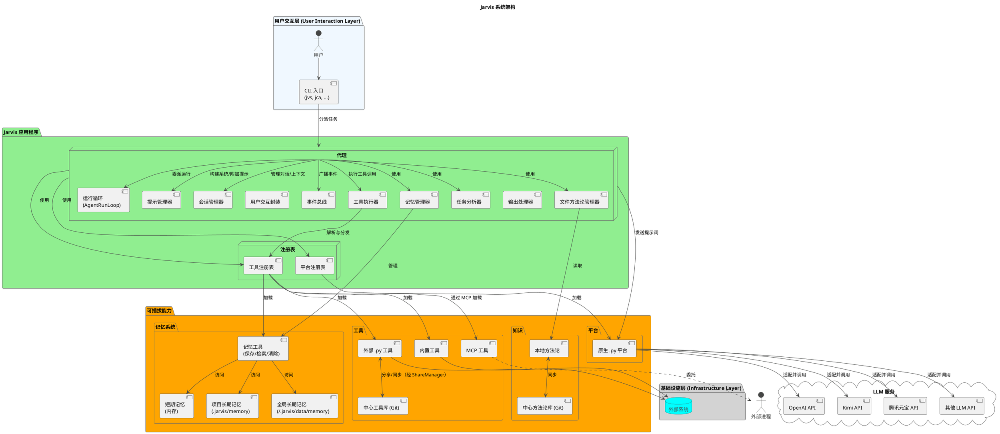
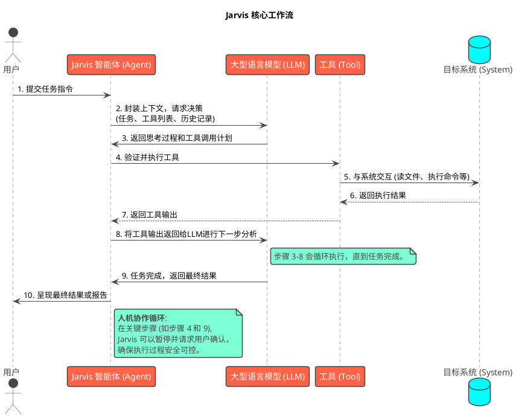

# 1. 项目介绍

## 1.1 Jarvis 是什么？

Jarvis 是一个功能强大的、可扩展的AI助手框架，旨在成为您的智能开发和系统交互伙伴。它深度集成了大型语言模型（LLM）的能力，并通过一个丰富的工具生态系统，将AI的分析、推理和执行能力应用于实际的开发任务和复杂的系统管理中。

与传统的AI聊天机器人不同，Jarvis被设计为一个“实干家”。它不仅仅能理解您的意图，更能自主地或在您的指导下，调用各种工具来完成任务，例如：

-   分析和修改代码库
-   执行系统命令和脚本
-   自动化Git工作流
-   与Web服务交互
-   管理和查询本地知识库

Jarvis的核心理念是**人机协作**，它充当人类专家与复杂系统之间的智能桥梁，将重复、繁琐的任务自动化，让开发者能够专注于更高层次的创造性工作。

## 1.2 核心特性

Jarvis 的设计围绕以下几个核心特性构建：

-   **🆓 零成本接入**：无缝集成腾讯元宝、Kimi等多个优质大型语言模型，在大多数情况下，您无需支付昂贵的API费用即可使用强大的AI能力。
-   **🛠️ 工具驱动**：内置一个涵盖代码开发、系统管理、Web交互等多个领域的工具集。AI可以根据任务需求，智能地选择和组合这些工具来达成目标。
-   **🔌 高度可扩展**：系统的每一部分都支持高度定制。您可以轻松添加自定义工具、集成新的大模型平台，或通过MCP协议接入外部服务，打造专属的AI助手。
-   **👥 深度人机协作**：Jarvis在执行任务的每个关键节点都支持用户介入。您可以审查AI的计划、确认高风险操作、甚至直接在虚拟终端中接管控制，确保最终结果始终符合预期。
-   **📈 智能进化与知识共享**：
      - **方法论系统**: Jarvis能够从与您的交互中学习，将成功的解决方案沉淀为“方法论”，并在未来处理相似任务时进行参考，使其越用越智能。
      - **中心方法论库**: 支持将本地方法论分享到团队的中心Git仓库。这促进了知识和最佳实践在团队成员间的共享与同步，让整个团队共同成长。

## 1.3 主要功能组件

Jarvis 提供了一系列命令行工具，每个工具都针对特定的应用场景进行了优化：

-   `jarvis` (`jvs`): 通用型 AI 代理，适用于开放式任务和系统交互。
-   `jarvis-code-agent` (`jca`): 专为代码开发任务设计的代理，精于代码分析与修改。
-   `jarvis-smart-shell` (`jss`): 智能 Shell，提供 AI 增强的命令行体验。
-   `jarvis-git-commit` (`jgc`): 自动化 Git 提交工具，能根据代码变更智能生成规范的提交信息。
-   `jarvis-code-review` (`jcr`): 启动一次由 AI 辅助的代码审查会话。
-   `jarvis-git-squash` (`jgs`): 辅助进行 Git 的交互式 rebase 以合并提交。
-   `jarvis-platform-manager` (`jpm`): AI 平台与模型管理工具，支持模型对话、API 服务等。
-   `jarvis-rag` (`jrg`): RAG（检索增强生成）工具，用于构建和查询本地知识库。
-   `jarvis-agent` (`ja`): 核心代理工具，支持更细粒度的自定义配置。
-   `jarvis-multi-agent` (`jma`): (实验性) 运行多代理协作任务。
-   `jarvis-tool` (`jt`): 直接调用和管理 Jarvis 内置及自定义工具。
-   `jarvis-methodology` (`jm`): 管理和查询已保存的方法论，用于知识复用。
-   `jarvis-memory-organizer` (`jmo`): 记忆管理工具，支持整理、合并、导入导出记忆。
-   `jarvis-sec` (`jsec`): 安全分析套件，对代码工程进行安全扫描和分析，支持启发式扫描和AI深度验证。
-   `jarvis-c2rust` (`jc2r`): C→Rust 迁移套件，将 C/C++ 代码智能迁移到 Rust，支持渐进式迁移和断点续跑。

这些组件共同构成了一个全面的AI助手生态，满足从日常开发到复杂系统运维的广泛需求。

## 1.4 目标用户

Jarvis 主要为以下用户群体设计：

-   **软件开发者**：希望通过AI提高编码效率、自动化代码审查、快速理解和修改现有代码库。
-   **系统管理员/DevOps工程师**：需要自动化部署、监控、故障排查等复杂系统管理任务。
-   **AI应用开发者和研究者**：寻求一个灵活、可扩展的框架来实验和构建基于LLM的智能体（Agent）应用。

无论您是希望将AI作为日常开发中的得力助手，还是想探索AI智能体的无限可能，Jarvis都为您提供了一个坚实的起点。

## 1.5 系统架构

Jarvis 的系统架构设计旨在实现模块化和高可扩展性。下图展示了其核心组件和它们之间的交互关系：

**架构说明:**

-   **用户交互层**: 用户通过一组专用的命令行工具（如 `jvs`, `jca`）与 Jarvis 交流，下达指令。
-   **Jarvis 核心框架**: 这是系统的大脑。
    -   **Agent (智能体)**: 接收用户指令，与LLM协作进行思考和规划，并调度工具来执行任务。
    -   **平台注册表**: 动态加载和管理所有可用的AI平台，是连接核心框架与AI能力的桥梁。
    -   **工具注册表**: 动态加载和管理所有可用的工具，是连接核心框架与工具能力的桥梁。
    -   **文件方法论管理器（FileMethodologyManager）**: 负责处理文件上传与本地方法论加载，结合方法论工具函数（load_methodology/upload_methodology）提供能力，使 Jarvis 能够在任务前加载经验、在历史超限时通过文件方式承载上下文。
    -   **记忆管理器**: 管理三层记忆系统（短期、项目长期、全局长期记忆），支持信息的持久化存储和灵活检索，实现跨任务和跨会话的知识复用。
    -   **模型上下文协议 (MCP)**: 通过支持 MCP，Jarvis 可以作为一个通用的“客户端”，安全、标准地与任何遵循该协议的外部工具或服务（“服务端”）集成。一个 MCP 服务可以被设计为任何功能的网关，例如访问代码库、执行操作系统命令、查询数据库或连接到任意 Web API。这使得扩展 Jarvis 的能力就像插入一个 USB 设备一样简单，极大地增强了其在复杂 IT 环境中的集成和扩展能力。
-   **能力生态系统**: 这是 Jarvis 功能的来源，主要由AI平台、工具和知识经验三部分构成。其中记忆系统提供了短期记忆（内存中的临时信息）、项目长期记忆（项目特定知识）和全局长期记忆（跨项目通用知识）的分层存储机制。
-   **基础设施层**: 位于架构的最底层，代表了内置工具所封装和提供的具体基础能力，如代码操作、文件系统访问等。这是 Jarvis 所有具体行为的最终实现点。

## 1.6 核心工作流

了解 Jarvis 如何处理一个任务请求，可以帮助您更好地与它协作。下面是一个典型的任务处理流程：

**流程说明:**

1.  **任务提交**: 用户通过命令行提出一个明确或开放式的任务。
2.  **决策请求**: Jarvis 智能体将任务、当前上下文（如工作目录、可用工具）和历史交互记录打包，发送给大型语言模型（LLM），请求分析和决策。
3.  **计划生成**: LLM 进行“思考”，分解任务，并以调用特定工具的形式，制定出第一步的执行计划。
4.  **工具执行**: 智能体接收到指令，调用相应的工具。在执行高风险操作前，它可能会暂停并请求用户批准。
5.  **系统交互**: 工具在目标系统上执行具体操作，例如读取文件、执行shell命令或调用API。
6.  **结果返回**: 工具的执行结果（成功、失败、输出数据）被捕获。
7.  **结果上报**: 结果返回给智能体。
8.  **迭代分析**: 智能体将执行结果再次发送给LLM，让其评估当前进展，并决定下一步是继续调用工具、修正计划还是任务已完成。这个“思考-执行-评估”的循环会持续进行。
9.  **任务完成**: 当LLM判断任务已经完成时，它会生成一个总结性的最终答复。
10. **结果呈现**: 智能体将最终结果或任务报告展示给用户。

这个工作流结合了LLM的强大规划能力和工具的精确执行能力，同时通过人机协作节点确保了整个过程的透明和可控。

## 1.7 Vibe Working: 一种更直觉的工作流

Jarvis 的核心理念与一种新兴的人机协作模式 **"Vibe Working"** (氛围式工作)不谋而合。这个概念源于AI研究者Andrej Karpathy，指的是利用大语言模型（LLM），将人类头脑中模糊、直觉性的想法（即"Vibe"）高效转化为具体的、结构化的成果。

这不再是传统的"指令-执行"模式，而是一种**对话式、迭代式**的共同创造过程。

-   **从一个"感觉"开始**: 传统的自动化需要精确的输入和规则。而使用 Jarvis，你可以从一个模糊的目标开始，比如 `jca "给我写个脚本，监控这个网站的变化"` 或者 `jca "重构 'user' 模块，让它看起来更清爽"`。你提供的是方向和"感觉"，而不是详细的规格书。

-   **迭代中逼近完美**: Jarvis (或其背后的LLM) 会提供一个初步的实现。这个版本可能不完美，但它是一个坚实的起点。接下来，你通过反馈来指导它，比如 `"这个地方的逻辑不对，应该先检查A再处理B"` 或者 `"变量名能再语义化一点吗？"`。通过这种快速的反馈循环，AI的产出将逐步逼近你的真实意图。

-   **人与AI的角色转变**:
    -   **你 (人类)**: 扮演**创意总监、品味判断者和方向引领者**。你负责提供愿景、经验和高层次的判断力，确保最终结果的质量和方向。
    -   **Jarvis (AI)**: 扮演**强大的执行伙伴和灵感催化剂**。它负责处理所有繁重、重复和技术性的细节，并能提供意想不到的解决方案，激发你的新想法。

Jarvis 正是为这种工作流而设计的工具。它通过无缝的命令行集成和强大的本地交互能力，将 "Vibe Working" 从一个抽象概念，变为了开发者触手可及的日常生产力工具，让你能更专注于**高价值的创造性思考**，而非琐碎的实现细节。

