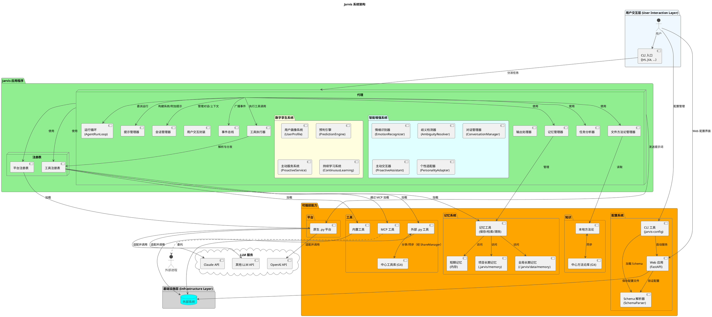
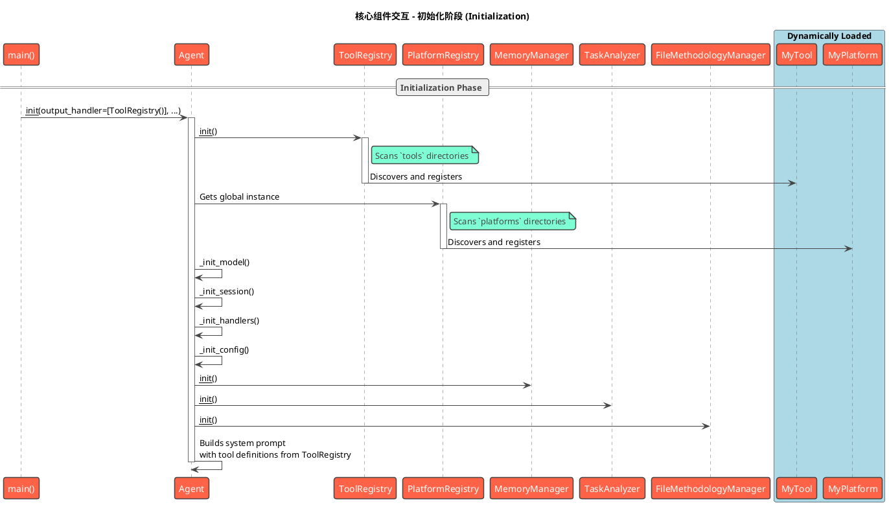
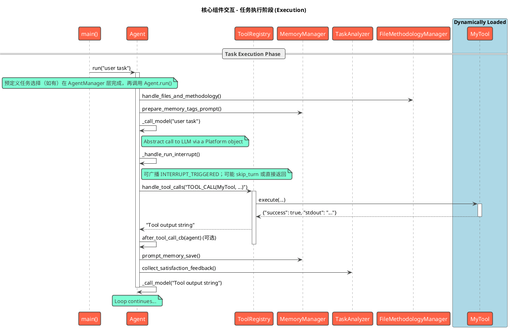

# 3. 核心概念与系统架构

本章将深入探讨 Jarvis 的核心概念，并解释它们如何组合成一个有机的、可扩展的系统。我们将首先独立介绍每一个核心概念，然后通过架构图和工作流来展示它们如何协同工作。

## 3.1 核心概念

要深入了解并有效使用 Jarvis，理解其背后的几个核心概念至关重要。本节将介绍构成 Jarvis 系统的八大基石：**代理（Agent）**、**工具(Tool)**、**平台(Platform)**、**模型(Model)**、**方法论（Methodology）**、**记忆系统（Memory System）**、**规则系统（Rules System）**和**配置系统（Configuration System）**。

### 3.1.1 代理 (Agent)

**代理(Agent)** 是 Jarvis 的"大脑"和执行中枢，一个高度灵活的**协调者和调度者**。它本身不包含复杂的业务逻辑，而是通过一个**主循环**来驱动整个工作流：获取能力、请求决策、委托执行、循环迭代。

Agent 的核心设计思想是**委托（Delegation）**。它将具体的执行逻辑（如工具调用）委托给不同的**输出处理器(Output Handler)**。这使得 Agent 的核心与具体能力完全解耦。例如，`ToolRegistry` 就是一个专门处理 `TOOL_CALL` 标签的输出处理器。

### 3.1.2 工具与工具注册表 (Tool & ToolRegistry)

**工具(Tool)** 是 Jarvis 的"双手"，是原子化的、功能单一的可执行单元。

**工具注册表(ToolRegistry)** 是所有工具的管理者。它负责发现、加载和执行工具，并通过三种独立的机制来集成它们：

1. **内置工具**: 加载项目自带的原生Python工具。
2. **外部Python工具**: 加载用户在指定目录（如 `~/.jarvis/tools`）下创建的Python工具。
3. **MCP工具**: 通过模型通信协议（MCP）与外部独立进程通信，以接入该进程提供的工具，这是实现高级扩展的关键技术。

### 3.1.3 平台与平台注册表 (Platform & PlatformRegistry)

**平台(Platform)** 是 Jarvis 与大语言模型（LLM）之间的**桥梁和适配器**。它负责对接不同的 LLM 服务提供商（例如 OpenAI、Claude 等），将 Agent 的请求转换为特定服务商的 API 调用，并将响应结果返回给 Agent。在 Jarvis 中，平台被抽象为一个统一的**接口**，屏蔽了不同 LLM 服务商 API 的差异。

**平台注册表(PlatformRegistry)** 负责加载所有可用的平台实现。它通过扫描目录中的 `.py` 文件来加载**原生Python平台**，确保 Agent 能以一致的方式与不同的 LLM 服务商交互。

### 3.1.4 模型 (Model)

**模型(Model)** 是指由**平台**提供的、执行具体思考和文本生成任务的**语言模型引擎**，例如 `gpt-4o`, `moonshot-v1-8k` 等。模型是 Jarvis 智能的核心来源。

平台和模型是**提供者**与**产品**的关系。Jarvis 的设计将两者清晰地分开，允许用户通过配置文件在同一平台下轻松切换不同的模型。

### 3.1.5 方法论与中心方法论库

**方法论 (Methodology)** 是 Jarvis 实现"智能进化"的核心机制。它是一套结构化的、用于指导代理解决问题的"思维框架"或"最佳实践"。它定义了代理在面对任务时应该"如何思考"，从而影响它发送给 LLM 的 Prompt 内容，以产生更优的决策。

**中心方法论库 (Central Methodology Repository)** 是一个基于 Git 的共享知识库。它允许用户和团队将个人沉淀的有效方法论分享到一个中心化的 Git 仓库中。通过简单的 `git pull/push`，团队成员之间可以轻松同步和分发这些宝贵的经验，加速整个团队解决问题的能力。这一设计不仅促进了知识的复用，也构建了一个持续学习和演进的集体智慧网络。

### 3.1.6 记忆系统 (Memory System)

**记忆系统 (Memory System)** 是 Jarvis 实现"知识积累"和"经验复用"的重要机制。它为 Agent 提供了持久化存储和检索信息的能力，使得系统能够在不同的任务和会话之间共享和复用知识。

记忆系统包含三种类型的记忆：

1. **短期记忆 (Short-term Memory)**: 存储在内存中的临时信息，主要用于当前任务的上下文保持。这些记忆在任务结束后会被清除。

2. **项目长期记忆 (Project Long-term Memory)**: 与特定项目相关的持久化信息，存储在项目目录的 `.jarvis/memory` 下。这些记忆包含了项目特定的知识、配置和经验。

3. **全局长期记忆 (Global Long-term Memory)**: 跨项目的通用信息，存储在用户数据目录的 `memory/global_long_term` 下。包括用户偏好、通用知识、最佳实践等。

记忆系统通过三个核心工具实现：

- **save_memory**: 保存信息到指定类型的记忆存储
- **retrieve_memory**: 根据标签或类型检索相关记忆
- **clear_memory**: 清理指定的记忆内容

每条记忆都包含唯一ID、标签列表、内容和时间戳，支持灵活的标签化检索。这种设计使得 Agent 能够快速定位和复用相关知识，提高任务执行的效率和准确性。
此外，若启用 force_save_memory，系统会在对话被总结清理或任务完成等关键节点（事件 BEFORE_HISTORY_CLEAR、TASK_COMPLETED）通过事件机制触发记忆保存提示或自动保存逻辑，确保关键信息不会遗漏。

### 3.1.7 规则系统 (Rules System)

**规则系统 (Rules System)** 是 Jarvis 实现"行为规范"和"知识复用"的重要机制。它通过加载和管理规则文件，指导 Agent 的代码生成和修改行为，确保代码风格一致、符合项目要求。

规则系统包含多种类型的规则：

1. **全局规则**: 存储在全局数据目录下的 `rule` 文件，适用于所有项目。

2. **项目规则**: 存储在项目 `.jarvis/rule` 文件，仅适用于当前项目。

3. **命名规则**: 从多个来源加载，包括：
   - **中心规则仓库**: 可配置的 Git 仓库，优先级最高，支持自动克隆和每日更新
   - **项目 `rules.yaml`**: 项目根目录 `.jarvis/rules.yaml` 文件
   - **项目 `rules/` 目录**: 项目根目录 `.jarvis/rules/` 目录下的独立规则文件
   - **全局 `rules.yaml`**: 全局数据目录下的 `rules.yaml` 文件
   - **配置的规则目录**: 用户在配置文件中指定的额外规则加载目录
   - **内置规则**: Jarvis 系统内置的规则，作为最低优先级后备

规则加载遵循严格的优先级顺序（中心规则仓库 > 项目 `rules/` 目录 > 项目 `rules.yaml` > 配置的规则目录 > 全局 `rules.yaml` > 内置规则），确保高优先级规则能够覆盖低优先级规则。

规则注入机制：

- **系统提示词注入**: 通过 `RulesManager.load_all_rules()` 加载的规则（包括全局、项目、`--rule-names` 指定的规则）会被合并成一个字符串，使用 `<rules>...</rules>` 标签包裹，注入到 CodeAgent 的系统提示词中。

- **用户输入动态注入**: 用户可以在其输入中使用 `'<rule:rule_name>'` 标记动态注入特定规则。`builtin_input_handler` 会拦截此标记，查找对应的规则内容，并将其替换为 `<rule>...</rule>` 标签包裹的格式，直接插入到用户输入中。

规则内容可以涵盖代码风格、技术栈使用、业务逻辑约束、性能优化建议等多个方面。这种设计使得团队可以共享统一的编码规范，个人可以积累和复用最佳实践，确保代码生成的一致性和质量。

### 3.1.8 配置系统 (Configuration System)

**配置系统 (Configuration System)** 是 Jarvis 实现"配置管理"和"用户友好配置"的重要机制。它通过基于 JSON Schema 的动态配置生成工具，为用户提供可视化的配置界面，简化了复杂配置文件的管理。

配置系统包含以下核心组件：

1. **Schema 解析器**：
   - 位于 `src/jarvis/jarvis_config/schema_parser.py`
   - 负责加载和解析 JSON Schema 文件（支持 Draft-07 规范）
   - 提供配置验证功能，确保用户输入符合 Schema 定义
   - 支持基本类型（string, number, integer, boolean, array, object）
   - 支持复杂约束（enum, default, minimum, maximum, minLength, maxLength, pattern, required）
   - 支持高级结构（oneOf, anyOf, 嵌套对象和数组）
   - 自动类型转换，将用户输入转换为正确的数据类型

2. **Web 应用**：
   - 位于 `src/jarvis/jarvis_config/web_app.py`
   - 基于 FastAPI 构建，提供 RESTful API 接口
   - 动态生成配置表单，支持多种字段类型（文本、数字、布尔值、枚举、数组、对象、字典）
   - 提供 Web UI 界面，采用 Zen-iOS Hybrid 风格设计
   - 支持配置的实时验证和错误提示
   - 支持配置的保存和加载（YAML/JSON 格式）
   - 支持配置文件的自动创建和目录管理

3. **CLI 工具**：
   - 位于 `src/jarvis/jarvis_config/cli.py`
   - 基于 typer 构建命令行接口
   - 提供便捷的命令行启动方式
   - 支持自定义 Schema 文件和输出文件路径
   - 支持自定义服务端口和浏览器自动打开

**核心功能**：

- **动态表单生成**：根据 JSON Schema 自动生成对应的配置表单，无需手动编写 HTML
- **实时验证**：在用户输入时进行实时验证，提供友好的错误提示
- **类型安全**：通过 Schema 定义确保配置数据的类型安全
- **可视化编辑**：提供直观的 Web 界面，支持嵌套对象、数组、字典等复杂结构的可视化编辑
- **配置持久化**：支持将配置保存为 YAML 或 JSON 格式
- **现有配置加载**：自动加载现有配置文件，并在表单中显示当前值
- **跨平台支持**：基于 Web 技术，支持各种操作系统和浏览器

**使用场景**：

- Jarvis 主配置文件（`~/.jarvis/config.yaml`）的可视化管理
- 项目特定配置文件的快速创建和编辑
- 配置模板的共享和复用
- 配置的版本控制和团队协作

**技术特点**：

- 基于 JSON Schema 标准，确保配置定义的规范性和可移植性
- 采用前后端分离架构，Web UI 与后端 API 独立开发和部署
- 使用 FastAPI 提供高性能的 Web 服务
- 支持 CORS，便于跨域访问
- 内置调试信息输出，便于问题排查

### 3.1.9 上下文压缩系统 (Context Compression System)

**上下文压缩系统 (Context Compression System)** 是 Jarvis 实现"长期运行"和"上下文管理"的核心机制。它通过多层次渐进式压缩策略，在保持关键信息的同时自动管理对话历史，确保 Agent 能够在长期运行中不会因上下文溢出而中断。

#### 核心设计理念

上下文压缩系统采用**渐进式压缩**的设计理念，优先使用轻量级压缩策略，避免一次性清空所有历史。系统会根据任务类型、上下文状态和剩余 token 数量，智能选择最适合的压缩策略。

#### 压缩策略层次

系统实现了多种压缩策略，按压缩强度从轻到重分为三个层次：

1. **轻量级压缩策略**：
   - **重要性评分压缩**：根据消息重要性评分，保留高分消息，压缩低分消息
   - **关键事件提取压缩**：提取关键事件（任务完成、错误修复、工具调用等），压缩其他内容
   - **增量摘要压缩**：将历史分成多个 chunk，压缩前面的 chunks，保留最后一个 chunk 的完整内容
   - **滑动窗口压缩**：保留最近的 N 轮对话，压缩更早的对话

2. **自适应压缩策略**：
   - **任务类型识别**：自动检测任务类型（代码任务、分析任务、对话任务、混合任务）
   - **策略动态选择**：根据任务类型自动选择最适合的压缩策略组合
   - **智能适配**：最大化保留任务相关的关键信息

3. **完整摘要压缩**（最后手段）：
   - **对话摘要生成**：使用 LLM 生成完整的对话摘要
   - **历史清空**：清空所有对话历史
   - **关键信息保留**：保留原始任务目标、用户固定内容、最近记忆、任务列表状态等

#### 触发机制

系统支持多种触发方式：

1. **Token 阈值触发**（主要方式）：
   - 阈值：剩余 token < 输入窗口的 25%
   - 检查时机：每次调用模型前
   - 自动执行：无需人工干预

2. **对话轮次阈值触发**：
   - 阈值：对话轮次达到配置值（默认 200 轮）
   - 定期清理：防止对话过长

3. **LLM 主动触发**：
   - 标记：LLM 输出 `!!!SUMMARY!!!` 标记
   - 智能决策：LLM 可以主动请求压缩

4. **用户手动触发**：
   - 方式：通过输入处理器触发
   - 灵活控制：用户可以根据需要手动触发

#### 关键信息保留机制

无论使用哪种压缩策略，以下信息始终被保留：

- **原始任务目标**（`original_user_input`）：第一次运行时的用户输入，确保长期运行时不丢失目标
- **用户固定内容**（`pin_content`）：用户通过 `<Pin>` 标记的内容，非交互模式下的完整需求
- **系统消息**：系统提示词，始终不压缩
- **最近记忆**（`recent_memories`）：最近 10 条记忆内容
- **任务列表状态**：任务列表的摘要信息和执行进度
- **Git diff 统计**（CodeAgent）：代码变更统计信息

#### 技术特点

- **渐进式压缩**：优先使用轻量级策略，避免一次性清空历史
- **智能适配**：根据任务类型自动选择最适合的策略
- **多层回退**：确保压缩成功，有完整的回退机制
- **自动触发**：无需人工干预，自动检测并执行
- **关键信息优先**：原始任务目标、固定内容等始终保留
- **容错机制**：压缩失败不影响主流程，自动回退到其他策略

#### 使用场景

- **长期运行任务**：需要多轮对话的复杂任务
- **大规模代码修改**：涉及多个文件的代码重构
- **多阶段任务执行**：需要分阶段完成的任务
- **上下文溢出预防**：防止因上下文过长导致的错误

#### 配置参数

系统支持通过环境变量配置压缩参数：

- `sliding_window_size`：滑动窗口大小（默认 9 条：用户/工具消息4条+助手消息5条，奇数以避免连续的同role消息）
- `importance_score_threshold`：重要性评分阈值（默认 3.0）
- `incremental_summary_chunk_size`：增量摘要 chunk 大小（默认 20 轮）
- `conversation_turn_threshold`：对话轮次阈值（默认 200 轮）

#### 相关文档

详细的实现文档和流程说明请参考：

- [上下文压缩策略文档](../../technical/implementation/context_compression_strategies.md)
- [上下文压缩流程文档](../../technical/implementation/context_compression_flow.md)

### 3.1.10 数字孪生系统 (Digital Twin System)

**数字孪生系统 (Digital Twin System)** 是 Jarvis 实现"完全理解用户"和"主动服务"的终极目标机制。它通过深度学习用户的行为模式、偏好和目标，构建一个数字化的自我延伸，无需显式指令即可主动提供精准帮助。

#### 核心设计理念

数字孪生系统采用**渐进式建模**的设计理念，从交互历史中提取用户的特征和行为模式，构建多维度的用户画像，并基于画像进行预判和主动服务。系统通过持续学习不断优化模型，实现对用户需求的精准预测和主动响应。

#### 四大核心能力

数字孪生系统包含四个层次的智能能力：

1. **用户画像深度建模**（阶段5.1）：
   - **交互历史分析器**：分析用户的时间模式、命令模式、问题模式
   - **偏好学习器**：学习用户的代码风格、技术栈偏好、交互风格
   - **目标追踪器**：追踪用户的短期、中期、长期目标
   - **用户画像聚合器**：整合多维度数据，构建完整的数字画像

2. **预判引擎**（阶段5.2）：
   - **上下文预测器**：预测用户下一步的问题和操作
   - **需求推理器**：推理用户的隐式需求、后续任务和根本原因
   - **时机判断器**：判断何时主动帮助、何时保持沉默、何时请求确认

3. **主动服务系统**（阶段5.3）：
   - **服务触发器**：基于关键词、模式、上下文触发主动服务
   - **服务编排器**：管理服务优先级和冲突解决
   - **服务执行器**：执行建议、提醒、信息提供、澄清等操作
   - **反馈学习器**：根据用户反馈调整触发阈值和策略

4. **持续学习系统**（阶段5.4）：
   - **知识获取器**：从交互、代码、错误中学习知识
   - **技能学习器**：学习工具使用模式、语言模式
   - **经验积累器**：记录、提取和应用经验教训
   - **自适应引擎**：基于反馈优化系统性能

#### 与传统Agent的区别

| 维度         | 传统Agent          | 数字孪生系统             |
| ------------ | ------------------ | ------------------------ |
| **交互方式** | 被动响应用户指令   | 主动预判并提供帮助       |
| **理解深度** | 理解当前任务       | 理解用户长期目标和偏好   |
| **学习能力** | 单次任务学习       | 持续积累经验和知识       |
| **个性化**   | 通用行为模式       | 高度个性化的行为适配     |
| **目标**     | 完成用户指定的任务 | 成为用户的数字化自我延伸 |

#### 启用方式

数字孪生系统通过配置项启用，并与智能增强系统协同工作：

```yaml
# ~/.jarvis/config.yaml
enable_autonomous: true
```

启用后，Jarvis将具备：

- **情绪识别**：自动识别用户情绪状态
- **歧义检测**：检测用户输入中的歧义
- **对话管理**：跟踪多轮对话上下文
- **主动交互**：分析上下文提供主动建议
- **用户画像**：深度学习和理解用户特征
- **预判能力**：预测用户需求并提前准备
- **主动服务**：在合适时机主动提供帮助
- **持续学习**：不断优化和改进自身能力

#### 技术特点

- **完整学习生命周期**：获取→学习→积累→适应
- **可扩展架构**：支持自定义知识来源、技能评估器、经验匹配器
- **智能适应**：基于反馈自动调整阈值和策略
- **AgentRunLoop集成**：通过`is_enable_autonomous()`配置启用
- **双轨制推理**：结合规则和LLM推理，提高准确性和效率

#### 使用场景

- **长期协作**：与用户建立长期的协作关系，越用越懂用户
- **复杂任务**：理解用户的长期目标，主动规划和执行复杂任务
- **个性化服务**：根据用户偏好提供个性化的服务和建议
- **主动预防**：预判可能的问题，提前提醒和预防

## 3.2 系统架构

本节在"核心概念"的基础上，深入探讨这些概念如何组合成一个有机的、可扩展的系统。

### 3.2.0 系统分层架构

Jarvis 系统采用分层架构设计，以通用 Agent 为核心基础，通过继承与组合的方式构建了 CodeAgent、MultiAgent 等增强系统，并在此基础上实现了 jarvis-sec（jsec）和 jarvis-c2rust（jc2r）两个专业应用系统。

#### 核心基础层：Agent（通用Agent）

**定位**：Jarvis 的核心执行实体，提供对话、工具执行、会话管理等基础能力。

**核心能力**：

- 对话与工具执行的统一入口
- 会话管理（SessionManager）、工具注册（ToolRegistry）、平台适配（PlatformRegistry）
- 事件总线（EventBus）、输入/输出处理链
- 支持非交互模式等场景

**扩展点**：

- 通过 OutputHandler 协议扩展输出处理能力（如 MultiAgent 的消息路由）
- 通过 ToolRegistry 扩展工具能力
- 通过事件总线实现旁路扩展

#### 功能增强层

**CodeAgent（代码Agent）**：

- **关系**：继承自 Agent，在通用 Agent 基础上叠加代码相关能力
- **增强能力**：
  - **代码结构分析**：通过 `ContextManager` 提供文件/函数/类层次结构分析，支持多语言（Python、Rust、Go、C/C++、JavaScript/TypeScript 等）的符号提取和依赖分析
  - **文件编辑工具**：
    - `edit_file`：基于 search/replace 的精确编辑
    - `edit_file_free`：基于新代码片段的自由编辑
    - `rewrite_file`：整文件重写
  - **变更影响分析**：通过 `ImpactManager` 分析依赖关系、调用链、接口变更，评估风险等级
  - **自动迭代修复**：基于构建错误和测试失败信息自动修复代码
  - **构建验证**：通过 `BuildValidationManager` 自动检测构建系统（Rust/Cargo、Python、Node.js、Java/Maven/Gradle、Go、CMake/Makefile 等）并验证构建
  - **静态检查**：通过 `LintManager` 集成多种静态分析工具（ruff、mypy、clippy、eslint 等），自动检测代码质量问题
  - **上下文推荐**：通过 `ContextRecommender` 智能推荐相关代码上下文，提高代码理解效率
  - **规则系统**：通过 `RulesManager` 加载和管理规则，指导代码生成和修改行为
  - **Git 自动管理**：通过 `GitManager` 自动管理 Git 仓库，支持检查点、错误恢复、提交确认
  - **任务列表管理**：通过 `TaskListManager` 实现复杂任务的模块化执行，支持任务依赖、状态跟踪、会话记忆增强
  - **代码审查与验证**：通过独立的 `ReviewAgent` 和 `VerificationAgent` 进行代码审查和任务完成验证，解决大模型幻觉问题
- **核心管理器组件**：
  - `ContextManager`：上下文管理器，维护符号表和依赖图
  - `ContextRecommender`：上下文推荐器，智能推荐相关代码
  - `RulesManager`：规则管理器，加载和管理规则
  - `GitManager`：Git 管理器，处理 Git 相关操作
  - `DiffManager`：差异管理器，处理代码差异分析
  - `ImpactManager`：影响分析管理器，分析代码修改的影响范围
  - `BuildValidationManager`：构建验证管理器，验证代码构建
  - `LintManager`：静态检查管理器，执行代码质量检查
  - `PostProcessManager`：后处理管理器，处理文件格式化等后处理操作
  - `LLMManager`：LLM 管理器，管理代码审查和验证相关的 LLM 调用
- **应用场景**：
  - 被 jarvis-c2rust 用于代码生成与修复
  - 独立使用：`jarvis-code-agent`（jca）命令行工具

**MultiAgent（多Agent系统）**：

- **关系**：组合多个 Agent 实例，通过消息通信机制实现多 Agent 协作
- **协作机制**：
  - 以 OutputHandler 形式接入每个 Agent 的输出处理链
  - 通过消息发送指令实现消息路由
  - 支持上下文传递（交接摘要）、历史管理（发送后清理）
  - 提供 YAML 配置与 CLI 入口，支持交互与非交互模式
- **应用场景**：
  - 复杂任务分工协作（如安全演进流水线）
  - 多角色协作（如代码审查、安全评估）

#### 专业应用层

**jarvis-sec（jsec：安全分析套件）**：

- **关系**：基于 Agent 实现安全分析能力
- **使用方式**：
  - **启发式扫描**：纯 Python 本地扫描，不依赖 Agent
  - **Agent 验证**：使用 Agent 进行逐条验证（只读工具：代码读取工具/脚本执行工具）
  - **报告聚合**：将 Agent 验证结果聚合为 JSON + Markdown 报告
- **工作流程**：

  ```
  直扫（direct_scan）→ 聚类（Cluster Agent）→ 分析（Analysis Agent）→
  验证（Verification Agent）→ 复核（Review Agent）→ 报告聚合
  ```

- **核心特性**：
  - 支持 C/C++ 和 Rust 语言的安全扫描
  - 基于正则表达式的快速启发式扫描
  - AI 深度分析，推导完整的漏洞触发路径
  - 多阶段验证流程，确保结果准确性
  - 支持断点续跑，适合大规模代码库

**jarvis-c2rust（jc2r：C→Rust 迁移套件）**：

- **关系**：同时使用 Agent 和 CodeAgent，实现完整的 C→Rust 迁移流水线
- **使用方式**：
  - **Agent 用于规划**：
    - 模块规划：使用 Agent 生成 crate 模块结构（JSON）
    - 签名规划：使用 Agent 选择目标模块与 Rust 函数签名
    - 代码审查：使用 Agent 审查逻辑一致性
  - **CodeAgent 用于生成与修复**：
    - 代码生成与修复：在单个函数生命周期内复用同一个 CodeAgent 实例
    - 强制使用记忆功能：代码生成 Agent 启用强制保存记忆参数
    - 依赖检查与实现：在实现或修复函数时，检查并补齐依赖函数的实现
    - 测试失败信息反馈：测试失败时获取完整的测试失败信息并传递给修复 Agent
    - 测试代码删除检测：基于事件订阅机制，确保测试代码不会被意外删除
- **工作流程**：

  ```
  扫描（scanner）→ 库替代（library_replacer）→ 模块规划（Agent）→
  转译（CodeAgent + Agent）→ 优化（optimizer + CodeAgent）
  ```

- **核心特性**：
  - 基于 libclang 的精确 AST 解析
  - 智能库替代评估，减少转译工作量
  - 渐进式迁移，支持断点续跑
  - 保守与可回退（构建检测与 git_guard）
  - 模块化设计，各阶段可独立使用

#### 智能增强层（阶段4：超人类智能）

**智能增强系统（Autonomous System）**：

- **关系**：在 Agent 和 CodeAgent 基础上叠加智能增强能力
- **定位**：实现"超人类智能"，通过情绪识别、歧义检测、主动交互等方式提升用户体验
- **核心能力**：
  - **情绪识别器**（EmotionRecognizer）：自动识别用户情绪状态，调整交互策略
  - **歧义检测器**（AmbiguityResolver）：检测用户输入中的歧义，主动澄清
  - **对话管理器**（ConversationManager）：跟踪多轮对话上下文，管理对话状态
  - **主动交互器**（ProactiveAssistant）：分析上下文提供主动建议
  - **个性适配器**（PersonalityAdapter）：根据用户偏好调整交互风格
- **启用方式**：通过 `enable_autonomous: true` 配置启用
- **技术特点**：
  - 双轨制推理：结合规则和LLM推理，提高准确性和效率
  - 组件化设计：每个能力组件独立实现，可灵活组合
  - 性能优化：支持批量推理和缓存机制

#### 数字孪生层（阶段5：完全理解用户）

**数字孪生系统（Digital Twin System）**：

- **关系**：在智能增强系统基础上叠加用户建模和主动服务能力
- **定位**：实现"完全理解用户"，成为用户的数字化自我延伸
- **核心能力**：
  - **用户画像系统**（UserProfile）：
    - **交互历史分析器**：分析用户的时间模式、命令模式、问题模式
    - **偏好学习器**：学习用户的代码风格、技术栈偏好、交互风格
    - **目标追踪器**：追踪用户的短期、中期、长期目标
    - **用户画像聚合器**：整合多维度数据，构建完整的数字画像
  - **预判引擎**（PredictionEngine）：
    - **上下文预测器**：预测用户下一步的问题和操作
    - **需求推理器**：推理用户的隐式需求、后续任务和根本原因
    - **时机判断器**：判断何时主动帮助、何时保持沉默、何时请求确认
  - **主动服务系统**（ProactiveService）：
    - **服务触发器**：基于关键词、模式、上下文触发主动服务
    - **服务编排器**：管理服务优先级和冲突解决
    - **服务执行器**：执行建议、提醒、信息提供、澄清等操作
    - **反馈学习器**：根据用户反馈调整触发阈值和策略
  - **持续学习系统**（ContinuousLearning）：
    - **知识获取器**：从交互、代码、错误中学习知识
    - **技能学习器**：学习工具使用模式、语言模式
    - **经验积累器**：记录、提取和应用经验教训
    - **自适应引擎**：基于反馈优化系统性能
- **启用方式**：通过 `enable_autonomous: true` 配置启用（与智能增强系统共享配置）
- **技术特点**：
  - 完整学习生命周期：获取→学习→积累→适应
  - 可扩展架构：支持自定义知识来源、技能评估器、经验匹配器
  - 智能适应：基于反馈自动调整阈值和策略
  - 持久化存储：用户画像和学习经验持久化存储

### 3.2.1 架构关系图

下图清晰地展示了 Jarvis 各核心组件之间的静态关系和依赖。
图中已包含 EventBus（事件总线）、PromptManager（提示管理器）、SessionManager（会话管理器）等配套组件，具体见 3.3 节。



#### 角色职责

- 代理（Agent）
  - 系统协调中心，负责初始化与组装各组件（EventBus、MemoryManager、TaskAnalyzer、FileMethodologyManager、PromptManager、SessionManager、输出处理器等）
  - 将主运行循环委派给 AgentRunLoop，聚焦高层编排与状态管理
  - 统一设置系统提示词（通过 PromptManager），并在首次运行时按需进行工具筛选与方法论/文件处理
  - 通过 ToolRegistry 调用工具，通过 PlatformRegistry 访问平台/模型
  - 使用事件常量广播关键事件（TASK_STARTED/BEFORE_MODEL_CALL/AFTER_MODEL_CALL/BEFORE_TOOL_CALL/AFTER_TOOL_CALL/BEFORE_HISTORY_CLEAR/AFTER_HISTORY_CLEAR/AFTER_SUMMARY/TASK_COMPLETED 等）

- 运行循环（AgentRunLoop）
  - 承载主循环逻辑：调用模型、解析并执行工具、处理中断、驱动下一步
  - 使用 LoopAction 表达跳过当前轮（skip_turn）、继续（continue）、完成（complete）
  - 使用 utils.join_prompts 安全拼接提示：仅拼接非空片段，并以两个换行分隔
  - 使用 utils.normalize_next_action 规范化下一步动作（兼容 Enum 与字符串）
  - 输入处理器控制：根据 run_input_handlers_next_turn 标志决定下一轮是否运行输入处理器，并在触发后清除该标志，避免重复执行
  - 处理自动完成：当开启 auto_complete 且检测到 ot('!!!COMPLETE!!!') 或回退至字面量 '!!!COMPLETE!!!' 时直接收尾
  - 在工具调用与模型调用等关键节点通过 EventBus 广播事件（使用事件常量，如 BEFORE_TOOL_CALL/AFTER_TOOL_CALL），并在工具调用后支持 after_tool_call_cb 回调；事件载荷：BEFORE_TOOL_CALL 包含 agent/current_response；AFTER_TOOL_CALL 包含 agent/current_response/need_return/tool_prompt
  - 失败兜底：主循环对异常进行捕获，使用 PrettyOutput 输出错误并返回 "Task failed: ..."

- 提示管理器（PromptManager）
  - 构建系统提示词（拼装系统指令与工具使用提示）
  - 构建默认附加提示（整合工具使用规范与记忆提示）
  - 仅做字符串拼装，不直接访问模型，保持与现有行为一致

- 会话管理器（SessionManager）
  - 管理 prompt、addon_prompt、conversation_length、用户数据
  - 提供 save/restore/clear*history 能力，持久化路径位于 .jarvis/saved_session*\*.json（文件名包含时间戳，格式：saved_session_YYYYMMDD_HHMMSS.json）
  - clear_history 重置模型状态但保留系统提示的约束环境
  - 支持非交互模式下的会话恢复
- 对话记录器（DialogueRecorder）
  - 自动记录所有用户与模型的交互历史，保存为 JSONL 格式
  - 会话文件存储在 `~/.jarvis/data/dialogues/` 目录
  - 支持自动清理旧会话，避免占用过多存储空间
  - 大模型可以读取会话文件了解完整的对话历史

- 事件总线（EventBus）
  - 提供 subscribe/emit/unsubscribe 的轻量同步事件机制
  - 回调异常隔离，避免影响主流程，便于旁路扩展能力（如记忆保存、任务分析）

- 工具执行器（ToolExecutor / execute_tool_call）
  - 解析模型响应，匹配可处理的输出处理器（默认为 ToolRegistry），强制单操作约束
  - 支持执行前确认（execute_tool_confirm），执行并返回结果或错误信息
  - 将“是否直接返回结果”与“下一步提示”统一为标准返回协议

- 配置（AgentConfig）
  - 使用数据类聚合初始化参数，负责解析默认值（use_methodology/use_analysis/execute_tool_confirm/force_save_memory/max_token_count 等）
  - 当存在 files 时默认禁用 use_methodology，确保行为合理
  - 解析结果回填到 Agent 保持向后兼容

- 用户交互封装（UserInteractionHandler）
  - 对多行输入函数做兼容封装（支持 func(tip, print_on_empty) 与 func(tip) 两种签名）
  - 对确认函数做统一封装，便于未来替换为 TUI/WebUI

- 工具注册表（ToolRegistry）
  - 统一发现、加载与执行工具：内置工具、外部 .py 工具、MCP 工具
  - 作为默认输出处理器接收工具调用请求并执行具体工具

- 平台注册表与平台（PlatformRegistry / BasePlatform）
  - 动态创建平台实例、设置模型名称与模型组、适配不同厂商 API
  - 提供 chat_until_success、set_system_prompt、upload_files/save/restore 等能力

- 记忆管理器（MemoryManager）
  - 准备记忆标签提示、在附加提示中注入记忆相关引导
  - 自动记忆保存：在开启 force_save_memory 时于 before_history_clear/task_completed 等事件触发保存逻辑
  - 与工具 save_memory/retrieve_memory/clear_memory 协作，沉淀与复用知识

- 文件与方法论管理器（FileMethodologyManager）
  - 根据平台能力选择文件上传模式或本地模式
  - 负责方法论的上传或本地加载，以及在上下文过长时以文件方式上传历史

- 任务分析器（TaskAnalyzer）
  - 在任务完成阶段基于事件旁路执行分析（如满意度收集、方法论沉淀），不阻塞主流程

- 输出处理器（Output Handler）
  - 一个可扩展的处理器链，默认包含 ToolRegistry；Agent 将模型响应委派给能处理的处理器，由处理器解析并执行（参见 OutputHandlerProtocol: name/can_handle/prompt/handle）

- Schema 解析器（SchemaParser）
  - 加载和解析 JSON Schema 文件（支持 Draft-07 规范）
  - 提供配置验证功能，确保用户输入符合 Schema 定义
  - 支持基本类型（string, number, integer, boolean, array, object）
  - 支持复杂约束（enum, default, minimum, maximum, minLength, maxLength, pattern, required）
  - 支持高级结构（oneOf, anyOf, 嵌套对象和数组）
  - 自动类型转换，将用户输入转换为正确的数据类型

- Web 应用（FastAPI）
  - 基于 FastAPI 构建，提供 RESTful API 接口
  - 动态生成配置表单，支持多种字段类型
  - 提供 Web UI 界面，采用 Zen-iOS Hybrid 风格设计
  - 支持配置的实时验证和错误提示
  - 支持配置的保存和加载（YAML/JSON 格式）
  - 支持配置文件的自动创建和目录管理

- CLI 工具（jarvis-config）
  - 基于 typer 构建命令行接口
  - 提供便捷的命令行启动方式
  - 支持自定义 Schema 文件和输出文件路径
  - 支持自定义服务端口和浏览器自动打开

### 3.2.2 核心架构原则

Jarvis 的架构遵循以下几个核心设计原则：

1. **代理作为协调中心 (Agent-Centric Coordination)**: 系统的核心是 **Agent**，但它是一个轻量级的**协调者**，其主要职责是驱动主循环，并将具体的任务委托给专门的处理器。

2. **通过注册表实现解耦 (Decoupling via Registries)**: **ToolRegistry** 和 **PlatformRegistry** 是实现系统可插拔性的关键。Agent 不直接与任何具体的工具或平台耦合，它只与注册表交互。

3. **基于委托的执行模式 (Delegation-Based Execution)**: Agent 接收到来自 LLM 的响应后，不会自己去解析，而是将响应传递给一个**输出处理器**列表。这种**委托机制**将"决策"与"执行"完全分离。

4. **将 LLM 作为可插拔的推理引擎 (LLM as a Pluggable Reasoning Engine)**: **Platform** 作为 Agent 与 LLM 之间的适配层，将不同 LLM 服务商的 API 差异完全封装起来。这使得 Agent 可以用统一的方式向任何 LLM "提问"（发送Prompt）并获得"回答"（决策文本），而无需关心底层是哪个服务商的模型。

5. **分层的记忆管理 (Hierarchical Memory Management)**: **记忆系统**采用三层架构（短期、项目长期、全局长期），通过标签化管理实现灵活的知识组织。记忆的存储和检索通过统一的工具接口实现，确保了系统的可扩展性和易用性。

6. **基于 Schema 的配置驱动 (Schema-Driven Configuration)**: **配置系统**采用 JSON Schema 标准定义配置结构，通过 Schema 解析器实现配置的动态生成和验证。这种设计确保了配置的类型安全和规范性，同时提供了可视化的配置界面，降低了用户的学习成本和配置错误的可能性。

### 3.2.3 端到端工作流：一次工具调用的生命周期

下面的流程描述了上述架构原则在一次典型的工具调用中是如何协同工作的：

1. **任务分派**: 用户通过 **CLI** 启动一个任务，CLI 将其分派给一个配置好的 **Agent**。

2. **决策请求**: `Agent` 的主循环启动。它向 `ToolRegistry` 请求所有可用工具的描述，然后将用户任务和这份工具清单组合成一个 Prompt，通过 `PlatformRegistry` 获取的**平台**，发送给**模型**(LLM)，请求下一步的行动决策。

3. **决策返回**: **模型**(LLM) 思考后，决定调用 `read_code` 工具，并返回一个包含 `TOOL_CALL` 指令的文本。

4. **委托执行**: `Agent` 接收到这段文本，并将其**委托**给能识别 `TOOL_CALL` 标签的 `ToolRegistry` 进行处理。同时，运行循环通过事件总线广播 BEFORE_TOOL_CALL（载荷：`agent`、`current_response`），以便旁路能力感知工具即将执行。

5. **工具执行**: `ToolRegistry` 解析出工具名称和参数，调用目标工具的 `execute` 方法并返回其执行结果。运行循环从工具调用接口接收标准返回 `(need_return, tool_prompt)`，用于统一后续流程控制与提示拼接。

6. **结果反馈与循环**: `Agent` 将工具结果整合进上下文：使用 `utils.join_prompts` 将上一轮提示与 `tool_prompt` 按双换行安全拼接；随后通过事件总线广播 AFTER_TOOL_CALL（载荷：`agent`、`current_response`、`need_return`、`tool_prompt`）。若 `need_return=True`，则直接返回当前 `session.prompt` 并结束；否则继续进入新一轮“思考-决策-委托”循环，直到任务最终完成。

## 3.3 核心组件详解

### 3.3.1 Jarvis Agent

`Jarvis Agent` 是系统的指挥中心，负责协调所有操作。它位于 `src/jarvis/jarvis_agent` 模块中，其核心是 `Agent` 类。

#### 主要职责

- **任务理解与规划**: Agent 接收用户输入，并与大型语言模型（LLM）协作，将高级任务分解为一系列具体的、可执行的步骤。
- **工具调用**: 根据规划，Agent 动态选择并调用合适的工具来执行每个步骤。它是模型与工具集之间的桥梁。
- **状态管理**: Agent 维护着整个任务的上下文，包括对话历史、工具执行结果以及任何中间产物。当对话历史过长时，它会通过上下文压缩系统自动进行渐进式压缩，优先使用轻量级策略（重要性评分、关键事件提取、增量摘要、滑动窗口），必要时使用完整摘要压缩，确保关键信息不丢失。
- **人机交互**: Agent 管理与用户的交互循环，接收指令，反馈结果，并根据用户干预调整执行路径。
- **记忆管理**: 通过 `MemoryManager` 管理短期、项目长期和全局长期记忆，实现知识的持久化和复用。
- **任务分析**: 通过 `TaskAnalyzer` 在任务完成后进行分析，提炼方法论和改进建议。
- **文件和方法论处理**: 通过 `FileMethodologyManager` 处理文件上传和方法论加载。

#### 关联组件与内部模块

- EventBus（事件总线）: 提供简单的发布/订阅机制（使用事件常量：BEFORE_MODEL_CALL/AFTER_MODEL_CALL、BEFORE_TOOL_CALL/AFTER_TOOL_CALL、BEFORE_HISTORY_CLEAR/AFTER_HISTORY_CLEAR、TASK_STARTED/TASK_COMPLETED 等，定义于 jarvis.jarvis_agent.events），以旁路方式集成能力，回调异常隔离不影响主流程。
- PromptManager（提示管理器）: 统一构建系统提示与默认附加提示，保持与现有行为一致，并集中注入工具使用规范和记忆提示。
- AgentConfig（配置聚合）: 将 Agent 初始化参数集中到数据类中，解析默认值（use_methodology/use_analysis/execute_tool_confirm/force_save_memory/max_token_count 等），保持向后兼容。
- UserInteractionHandler（用户交互封装）: 对多行输入与确认交互做轻量封装，便于未来替换为 TUI/WebUI。
- TaskManager（任务管理器）: 由 AgentManager 在进入 Agent.run 之前调用，用于加载与选择预定义任务（支持 fzf 选择与编号跳过），并可询问用户补充信息；当追加补充信息时使用 utils.join_prompts 进行提示拼接，保持上下文一致性。
- ToolExecutor（工具执行器）: 通过 `execute_tool_call` 统一解析与执行模型返回的工具调用，支持执行前确认和错误处理；标准返回协议：返回 (need_return, tool_prompt)，当 need_return 为 True 时运行循环直接返回当前 session.prompt，否则将 tool_prompt 使用 utils.join_prompts 拼接到上下文后继续。
- Utils（工具函数）: 提供 join_prompts/is_auto_complete/normalize_next_action 等统一实现：join_prompts 仅拼接非空片段并以两个换行分隔；is_auto_complete 基于 ot('!!!COMPLETE!!!') 检测，异常时回退到字面量 '!!!COMPLETE!!!'；normalize_next_action 将 Enum 映射为其字符串 value，其他类型返回空字符串。
- AgentRunLoop（运行循环）: 将主运行循环逻辑抽离为独立类，Agent.\_main_loop 仅做委派，便于演进与测试。在每次调用模型前检查剩余 token，如果低于阈值则触发上下文压缩（自适应压缩 → 重要性评分 → 关键事件提取 → 增量摘要 → 滑动窗口 → 完整摘要）。

#### 初始化流程

Agent 的初始化过程是高度可配置的，包含以下关键步骤：

1. **模型初始化** (`_init_model`):
   - 根据 `llm_group` 确定平台和模型
   - 通过 `PlatformRegistry` 创建平台实例
   - 设置模型名称和模型组

2. **会话初始化** (`_init_session`):
   - 创建 `SessionManager` 实例
   - 管理对话历史、用户数据和附加提示

3. **处理器初始化** (`_init_handlers`):
   - 设置输出处理器 (如 `ToolRegistry`)
   - 设置输入处理器 (如 `shell_input_handler`, `builtin_input_handler`)
   - 设置多行输入处理器

4. **配置初始化** (`_init_config`):
   - 设置方法论使用标志 (`use_methodology`)
   - 设置任务分析标志 (`use_analysis`)
   - 设置工具执行确认标志 (`execute_tool_confirm`)
   - 设置记忆强制保存标志 (`force_save_memory`)
   - 设置最大token数 (`max_token_count`)

5. **管理器与总线初始化**:
   - 创建 `EventBus` 实例（先于其他管理器，便于在构造过程中安全订阅事件）
   - 创建 `MemoryManager` 实例
   - 创建 `TaskAnalyzer` 实例
   - 创建 `FileMethodologyManager` 实例
   - 创建 `PromptManager` 实例
   - 设置系统提示词（通过 `PromptManager` 构建并设置到模型）
   - 输出启动统计信息（`show_agent_startup_stats` 展示方法论/工具/记忆等资源概览）

#### 主运行循环 (AgentRunLoop)

主运行循环由 `AgentRunLoop.run` 承载（`Agent._main_loop` 仅委派调用）。其工作流程如下，并在关键节点通过 EventBus 广播事件（如 BEFORE_MODEL_CALL/AFTER_MODEL_CALL、BEFORE_TOOL_CALL/AFTER_TOOL_CALL、BEFORE_HISTORY_CLEAR/AFTER_HISTORY_CLEAR、TASK_STARTED/TASK_COMPLETED 等），以旁路方式接入其他能力：

1. **首次运行处理**:
   - **系统提示词自动优化**（可选）: 如果启用了 `optimize_system_prompt` 参数，系统会在首次运行时根据用户输入自动优化系统提示词。优化过程使用 LLM 分析用户需求，在保持原有核心功能和架构不变的前提下，有针对性地增强或调整相关部分的描述，使提示词更加贴合具体任务场景。
   - 通过 `FileMethodologyManager` 处理文件上传和方法论加载
   - 准备记忆标签提示
   - 预定义任务选择在 AgentManager 层进行（如有），Agent 首轮不负责加载
   - **工具按场景筛选**（自动）: 当可用工具数量超过阈值时（默认30个，可通过配置调整），系统会自动使用临时模型实例筛选与当前任务最相关的工具。筛选机制仅作用于用户自定义工具，内置工具始终保留。筛选完成后，系统会重新构建系统提示词，仅包含筛选后的工具列表，从而降低工具集合规模、提升决策效率和减少 token 消耗。

2. **模型调用** (`_call_model`):
   - 处理输入处理器链
   - 管理对话长度，必要时进行总结
   - 调用模型并获取响应
   - **Git diff 集成**: 对于 CodeAgent 类型，在总结时会自动获取并集成 Git diff 信息到摘要中，帮助模型了解代码变更情况
     - 缓存策略：在总结触发时获取 git diff 并缓存，避免重复计算
     - Token 限制：diff 内容限制在输入窗口的 10%，超出时进行智能截断
     - 格式：将 git diff 格式化为代码块添加到摘要中

3. **工具执行** (`_call_tools`):
   - 通过 `execute_tool_call` 执行工具
   - 处理工具执行结果
   - 执行工具调用后回调

4. **中断处理** (`_handle_run_interrupt`):
   - 处理用户中断请求
   - 获取用户补充信息
   - 决定是否继续工具调用
   - 使用 `LoopAction` 标识跳过当前轮次或继续执行（continue/complete），并在检测到待执行工具时征询用户确认

5. **任务完成处理** (`_complete_task`):
   - 收集满意度反馈
   - 进行任务分析 (如果启用)
   - 生成任务总结

6. **循环控制**:
   - 根据用户输入决定继续或完成任务
   - 自动完成检测: 若开启 `auto_complete` 且模型响应中包含 `!!!COMPLETE!!!` 标记，则直接进入任务完成流程

### 3.3.2 CodeAgent 核心组件详解

`CodeAgent` 在继承 `Agent` 的基础上，通过多个专门的管理器组件实现了强大的代码分析和修改能力。本节详细介绍这些核心组件。

#### 3.3.2.1 上下文管理器 (ContextManager)

**职责**：维护项目的代码上下文信息，包括符号表和依赖图。

**核心功能**：

- **符号表构建**：自动扫描项目文件，提取函数、类、变量、导入等符号，构建双重索引的符号表
- **依赖图维护**：维护文件间的导入依赖关系，支持查找依赖和被依赖文件
- **多语言支持**：支持 Python、Rust、Go、C/C++、JavaScript/TypeScript、Java 等多种语言
- **实时更新**：在文件被修改后，自动更新符号表和依赖图，确保分析的准确性
- **缓存机制**：内部维护文件内容缓存，根据文件修改时间自动刷新，避免重复读取和分析

**使用场景**：

- 代码编辑时的上下文感知（自动获取当前作用域、使用的符号、相关文件）
- 影响分析（查找符号引用、依赖链分析）
- 上下文推荐（基于符号表进行智能推荐）

#### 3.3.2.2 上下文推荐器 (ContextRecommender)

**职责**：智能推荐与任务相关的代码上下文。

**核心功能**：

- **关键词提取**：使用 LLM 分析任务意图，生成相关关键词
- **符号模糊查找**：基于关键词在符号表中进行大小写不敏感的模糊查找
- **LLM 智能筛选**：使用 LLM 基于语义理解挑选最相关的符号
- **上下文注入**：在任务启动时触发，将推荐的上下文信息注入到增强的任务描述中
- **独立 LLM 实例**：每次调用都创建新的 LLM 实例，避免上下文累积，并使用 cheap 模型进行成本优化

**使用场景**：

- 任务启动时的上下文推荐
- 大型项目导航
- 代码理解任务

#### 3.3.2.3 规则管理器 (RulesManager)

**职责**：加载和管理规则，指导代码生成和修改行为。

**核心功能**：

- **多源规则加载**：
  - 全局规则：存储在全局数据目录下的 `rule` 文件
  - 项目规则：存储在项目 `.jarvis/rule` 文件
  - 命名规则：从中心规则仓库、项目 `rules.yaml`、项目 `rules/` 目录、全局 `rules.yaml`、配置的规则目录、内置规则等多个来源加载
- **规则加载优先级**：遵循严格的优先级顺序（中心规则仓库 > 项目 `rules/` 目录 > 项目 `rules.yaml` > 配置的规则目录 > 全局 `rules.yaml` > 内置规则）
- **规则注入机制**：
  - 系统提示词注入：通过 `get_rules_prompt()` 方法，将合并后的规则内容使用 `<rules>...</rules>` 标签包裹，注入到 CodeAgent 的系统提示词中
  - 用户输入动态注入：用户可以在其输入中使用 `'<rule:rule_name>'` 标记动态注入特定规则
- **中心规则仓库**：支持配置一个 Git 仓库作为中心规则库，实现规则的集中管理和团队共享

**使用场景**：

- 代码生成规范指导
- 项目特定规则管理
- 团队知识共享

#### 3.3.2.4 Git 管理器 (GitManager)

**职责**：自动管理 Git 仓库，支持检查点、错误恢复、提交确认。

**核心功能**：

- **Git 仓库自动初始化**：检测当前目录是否为 Git 仓库，如果不是则提示初始化
- **初始状态记录**：记录当前的 Git commit hash 作为 `start_commit`，用于后续的变更追踪和回滚
- **自动提交检查点**：在 CodeAgent 执行过程中检测未提交的修改，提示用户确认是否提交
- **错误恢复机制**：
  - 重置到初始状态：`git reset --hard {start_commit}` 和 `git clean -fd`
  - 单文件恢复：恢复单个文件到其 HEAD 状态
  - 批量恢复：恢复所有未提交的修改到 HEAD 状态
- **Git 配置管理**：检查 `user.name` 和 `user.email` 是否已配置，自动配置换行符设置
- **`.gitignore` 自动管理**：检查并更新 `.gitignore` 文件，确保 `.jarvis` 目录被忽略

**使用场景**：

- 代码生成任务的状态管理
- 错误恢复
- 实验性修改的回滚

#### 3.3.2.5 Git 工作树管理器 (WorktreeManager)

**职责**：管理 Git 工作树（worktree）的创建、合并和清理操作，为 CodeAgent 提供隔离的开发环境。

**核心功能**：

- **工作树创建**：自动生成唯一命名的 worktree 分支（格式：`jarvis-{project_name}-{timestamp}-{random_suffix}`），并在该分支上创建 git worktree
- **配置链接**：自动将原仓库的 `.jarvis` 目录软链接到 worktree 中，确保配置和数据的一致性
- **安全验证**：在创建软链接时验证路径安全性，防止目录穿越攻击
- **智能合并**：使用 rebase 策略将 worktree 分支变基到原分支，然后通过 fast-forward 合并，保持线性历史
- **自动清理**：任务完成后自动清理 worktree 目录和对应的分支
- **冲突处理**：在合并过程中检测和处理冲突，提供用户友好的冲突解决指导

**使用场景**：

- 代码任务的隔离开发：在独立的分支上进行代码修改，避免与主分支冲突
- 并行任务执行：多个任务可以同时在不同的 worktree 中运行，互不影响
- 安全试验：在隔离环境中尝试高风险的代码修改
- 团队协作：确保主分支的稳定性，同时支持多个开发者并行工作

#### 3.3.2.6 影响分析管理器 (ImpactManager)

**职责**：分析代码修改的影响范围，包括依赖链和接口变更。

**核心功能**：

- **Git Diff 解析**：将 `git diff` 的输出解析为结构化的编辑操作列表
- **符号影响分析**：
  - 识别在编辑区域内被修改或新增的函数、类、变量等符号
  - 查找这些受影响符号在整个项目中的所有引用位置
  - 查找在同一文件中依赖于被修改符号的其他符号
- **依赖链分析**：通过 `ContextManager` 的依赖图，计算被修改文件的传递闭包，识别所有直接和间接依赖该文件的其他文件
- **接口变更检测**：
  - 解析编辑前后的文件内容，比较函数签名、类定义等接口元素
  - 识别接口变更类型（签名修改、参数变化、符号新增或删除）
- **测试文件发现**：自动发现与被修改文件相关的测试文件
- **风险等级评估**：根据接口变更数量、引用数量、影响文件数量等因素，评估本次代码修改的风险等级（低、中、高）
- **修复建议生成**：根据影响分析结果，生成针对性的修复建议

**使用场景**：

- 代码修改后的影响分析
- 接口变更检测
- 重构任务的风险评估

#### 3.3.2.6 构建验证管理器 (BuildValidationManager)

**职责**：自动检测构建系统并验证代码构建。

**核心功能**：

- **构建系统自动检测**：使用 LLM 检测项目的构建系统（Rust/Cargo、Python、Node.js、Java/Maven/Gradle、Go、C/C++/CMake/Makefile 等）
- **构建验证**：执行构建命令并捕获错误，提供详细的构建失败信息
- **配置管理**：支持项目级配置（`.jarvis/build_validation_config.yaml`），允许禁用构建验证
- **兜底验证器**：当构建验证被禁用时，使用 `FallbackBuildValidator` 进行基础静态检查
- **增量验证**：基于修改的文件进行增量验证，提高验证效率

**使用场景**：

- 代码修改后自动验证构建
- 构建失败时提供错误信息和修复提示
- 特殊环境（如容器）中的构建验证

#### 3.3.2.7 静态检查管理器 (LintManager)

**职责**：集成多种静态分析工具，自动检测代码质量问题。

**核心功能**：

- **多语言支持**：支持 Python（ruff、mypy、pylint、flake8、black）、Rust（cargo clippy、rustfmt）、Go（go vet、golint）、C/C++（clang-tidy、cppcheck）、JavaScript/TypeScript（eslint、tsc）、Java（pmd、checkstyle）等多种语言和工具
- **工具自动选择**：根据文件类型自动选择适当的 lint 工具
- **配置管理**：支持从 `{get_data_dir()}/lint_tools.yaml` 加载自定义配置
- **执行策略**：
  - 按工具分组批量执行
  - 区分项目级工具（如 cargo clippy）和文件级工具（如 ruff）
  - 项目级工具每个项目只执行一次
  - 30秒超时限制
- **配置文件查找**：自动查找配置文件（如 .eslintrc.js、.eslintrc.json 等）

**使用场景**：

- 代码修改后自动执行静态检查
- 代码质量保证
- 代码风格统一

#### 3.3.2.8 差异管理器 (DiffManager)

**职责**：处理代码差异分析和展示。

**核心功能**：

- **差异计算**：计算文件修改前后的差异
- **差异展示**：格式化展示代码差异，支持多种展示策略
- **差异预览**：在代码修改前提供差异预览

**使用场景**：

- 代码修改的差异展示
- 代码审查
- 变更追踪

#### 3.3.2.9 后处理管理器 (PostProcessManager)

**职责**：处理文件格式化等后处理操作。

**核心功能**：

- **文件格式化**：在文件修改后自动执行格式化操作
- **其他后处理操作**：根据需要执行其他后处理操作

**使用场景**：

- 代码修改后的格式化
- 代码风格统一

#### 3.3.2.10 LLM 管理器 (LLMManager)

**职责**：管理代码审查和验证相关的 LLM 调用。

**核心功能**：

- **代码审查 Agent 管理**：创建和管理独立的 `ReviewAgent` 进行代码审查
- **任务验证 Agent 管理**：创建和管理独立的 `VerificationAgent` 进行任务完成验证
- **LLM 调用优化**：优化 LLM 调用，提高效率和准确性

**使用场景**：

- 代码审查
- 任务完成验证
- 多 Agent 协作

#### 3.3.2.11 任务列表管理器 (TaskListManager)

**职责**：实现复杂任务的模块化执行，支持任务依赖、状态跟踪、会话记忆增强、批量并行执行。

**核心功能**：

- **任务列表创建与管理**：使用 `add_tasks` 操作创建任务列表并同时添加多个任务
- **任务执行**：根据任务类型（code_agent/agent/main）自动创建对应的子Agent执行任务
- **状态自动管理**：执行开始时自动更新为running，完成时自动更新为completed/failed
- **依赖关系处理**：支持任务间依赖关系，自动按依赖顺序执行
- **批量并行执行**：在 tmux 环境中支持批量执行多个独立的 sub 类型任务，自动创建独立面板并监控执行状态
- **任务列表持久化**：支持任务列表的保存和恢复，会话恢复时自动恢复任务列表状态
- **会话记忆增强**：任务信息持久化到磁盘，版本快照机制，自动背景信息注入
- **权限隔离**：主 Agent 有全访问权限，子-agents 有受限访问权限，任务列表隔离

**使用场景**：

- 复杂功能开发
- 大规模重构
- 多阶段部署
- 并行任务执行（需要 tmux 环境）

### 3.3.3 工具注册表 (Tool Registry) 详解

`ToolRegistry` (位于 `src/jarvis/jarvis_tools/registry.py`) 是 Jarvis 工具驱动架构的基石。它是一个动态的工具加载器和执行器，负责管理 Agent 可用的所有工具。

#### 动态工具加载

`ToolRegistry` 在初始化时会自动扫描并加载来自多个源的工具：

- **内置工具**: 位于 `src/jarvis/jarvis_tools/` 目录下的核心工具。
- **外部工具**: 用户可以在 `~/.jarvis/tools/` 目录下添加自定义的 Python 工具脚本。
- **MCP 工具**: 通过模型上下文协议（MCP）集成的外部应用或服务。这些工具通过 `~/.jarvis/mcp/` 目录或 `mcp` 配置中的 YAML 配置进行定义。

这种分层加载机制使得核心功能保持稳定，同时为用户提供了极大的灵活性来扩展 Jarvis 的能力。

#### 工具加载概览

ToolRegistry 支持从多来源加载工具（内置、外部 .py、MCP），统一管理与执行，确保使用体验一致。具体的命名约定与配置细节请参考“高级主题”或开发者文档。

#### 工具执行

当 Agent 决定使用一个工具时，`ToolRegistry` 会：

1. 解析模型生成的工具调用请求。
2. 查找已注册的同名工具。
3. 验证并传递参数。
4. 调用工具的 `execute` 方法。
5. 捕获并格式化 `stdout` 和 `stderr`，然后返回给 Agent。

#### 调用与兼容性概览

ToolRegistry 提供统一的工具调用接口并兼容历史实现，确保在不同版本/场景下稳定运行。更详细的协议版本说明与兼容策略请参考“高级主题”或开发者文档。

#### 鲁棒性增强：缺失结束标签的自动补全

- 解析时严格要求工具调用标签必须位于行首：仅当 ot("TOOL_CALL") 和 ct("TOOL_CALL") 都在行首时才匹配为一个完整的调用块。
- 若检测到行首存在起始标签但缺失结束标签，Registry 会尝试在内容末尾自动补全一个行首结束标签后再次解析：
  - 如果补全后 YAML 解析成功，则继续执行该调用，并在工具执行结果前附加一段友好提示，提醒后续调用需包含完整的开始与结束标签。
  - 如果补全后仍解析失败，则返回包含工具系统使用规范（tool_system_guide）的错误信息，指导修正格式。
- 该机制提升了对模型偶发格式缺失的容错能力，但不会放宽对并发多次调用的单次执行约束（检测到多个调用块仍会报错并拒绝执行）。

#### 大输出处理：自动上传或智能截断

- 当工具输出过大可能导致上下文溢出时（基于 is_context_overflow，结合当前 llm_group），Registry 进行以下处理：
  1. 若当前平台支持文件上传（upload_files）：
     - 生成当前对话的关键信息总结（generate_summary），随后清理历史（clear_history）以释放上下文。
     - 将工具输出写入临时文件并上传。
     - 返回一段包含“对话总结 + 本次工具调用的 name/arguments/want（YAML 形式）”的提示，引导模型在新的上下文基础上继续任务。
  2. 若平台不支持上传：
     - 对输出进行智能截断，仅保留前 30 行与后 30 行，中间以“...内容太长，已截取前后30行...”标识，最大限度保留关键信息。
- 上述处理对调用方透明，无需额外配置即可获得稳定的长输出处理体验。

#### 执行记录与统计

- 每次工具执行都会通过 StatsManager 计数，供 CLI 显示工具使用统计（如 jarvis_tools.cli 的 stat 命令）。
- 同时以用户数据的形式记录执行的工具：
  - **last_executed_tool**：本轮最后一次执行的工具名
  - **executed_tools**：本轮累计执行的工具名列表
- 这些信息可被记忆系统与分析模块用于更精确的旁路逻辑与提示优化。

### 3.3.4 平台注册表 (Platform Registry) 详解

`PlatformRegistry` (位于 `src/jarvis/jarvis_platform/registry.py`) 负责管理与不同大型语言模型（LLM）平台的交互。它使得 Jarvis 可以无缝切换和使用多个 AI 提供商。

#### 平台抽象

所有平台都必须继承自 `BasePlatform` 类，并实现一套标准接口，如 `chat`, `set_model_name`, `upload_files` 等。这种设计将特定平台的实现细节与 Agent 的核心逻辑解耦。

#### 动态平台加载

与 `ToolRegistry` 类似，`PlatformRegistry` 也会动态加载平台实现：

- **内置平台**: 位于 `src/jarvis/jarvis_platform/` 目录下的官方支持平台。
- **外部平台**: 用户可以在 `~/.jarvis/models/` 目录下添加自定义的平台适配器。

这使得社区可以方便地为 Jarvis 贡献对新 LLM 平台的支持。

### 3.3.5 记忆系统概览

记忆系统为 Agent 提供短期、项目长期、全局长期三层记忆，用于在多轮对话与不同任务之间复用知识，提升决策的连贯性与效率。主要能力：

- 保存：在关键节点将有价值的信息持久化，便于后续复用
- 检索：按类型与标签快速筛选并获取相关记忆
- 清理：按需清空或整理指定范围的记忆

默认行为：

- 在任务开始、上下文清理前、任务完成等时机提示保存关键信息，尽可能减少遗漏
- 记忆以标签组织，便于后续精确检索

具体的使用方法与命令示例，请参考第 4 章“使用指南”的记忆系统部分。

### 3.3.6 任务分析方法论 (Task Analysis Methodology)

**任务分析**由 `TaskAnalyzer` 类实现，位于 `src/jarvis/jarvis_agent/task_analyzer.py`。它提供了以下核心功能：

1. **任务分析** (`analysis_task`):
   - 准备分析提示 (基于 `TASK_ANALYSIS_PROMPT`)
   - 处理分析循环
   - 执行工具调用 (如方法论保存)

2. **满意度反馈收集** (`collect_satisfaction_feedback`):
   - 收集用户对任务完成的满意度
   - 记录用户反馈

3. **分析循环处理** (`_process_analysis_loop`):
   - 调用模型进行分析
   - 处理工具调用
   - 管理分析状态

任务分析在以下场景触发：

- 任务完成时 (如果启用 `use_analysis`)
- 用户明确请求分析时

### 3.3.7 文件和方法论管理 (File & Methodology Management)

**文件和方法论管理**由 `FileMethodologyManager` 类实现，位于 `src/jarvis/jarvis_agent/file_methodology_manager.py`。它提供了以下核心功能：

1. **文件和方法论处理** (`handle_files_and_methodology`):
   - 根据平台能力选择处理模式
   - 支持文件上传模式 (`_handle_file_upload_mode`)
   - 支持本地模式 (`_handle_local_mode`)

2. **方法论上传** (`_handle_methodology_upload`):
   - 上传方法论文件
   - 处理上传失败回退

3. **本地方法论加载** (`_load_local_methodology`):
   - 加载本地方法论
   - 集成记忆标签提示

4. **历史处理** (`handle_history_with_file_upload`):
   - 使用临时文件上传历史对话
   - 管理上下文长度

### 3.3.8 配置系统详解

**配置系统** 是 Jarvis 提供的可视化配置管理工具，位于 `src/jarvis/jarvis_config` 模块中。它由三个核心组件组成：Schema 解析器（SchemaParser）、Web 应用（FastAPI）和 CLI 工具（jarvis-config）。

#### 3.3.8.1 Schema 解析器 (SchemaParser)

**职责**：加载和解析 JSON Schema 文件，提供配置验证和类型转换功能。

**核心功能**：

- **Schema 加载**：从文件系统加载 JSON Schema 文件（支持 Draft-07 规范）
- **Schema 查询**：提供便捷的 API 查询 Schema 的元数据（标题、描述、属性、类型、枚举值等）
- **配置验证**：验证用户输入的配置是否符合 Schema 定义，包括类型检查、约束验证、必填字段检查等
- **类型转换**：自动将用户输入转换为正确的数据类型（字符串转数字、布尔值等）
- **复杂结构支持**：支持嵌套对象、数组、字典等复杂结构的验证和转换

**支持的 Schema 特性**：

- 基本类型：string, number, integer, boolean, array, object
- 约束：enum, default, minimum, maximum, exclusiveMinimum, exclusiveMaximum, minLength, maxLength, pattern, required
- 复杂结构：oneOf, anyOf, 嵌套对象和数组
- 格式验证：uri, email, date-time 等

**使用场景**：

- Jarvis 主配置文件的验证
- 用户自定义配置文件的 Schema 定义
- 配置文件的类型安全保证

#### 3.3.8.2 Web 应用 (FastAPI)

**职责**：提供基于 Web 的配置管理界面和 RESTful API。

**核心功能**：

- **动态表单生成**：根据 JSON Schema 自动生成对应的配置表单
- **实时验证**：在用户输入时进行实时验证，提供友好的错误提示
- **配置保存**：支持将配置保存为 YAML 或 JSON 格式
- **配置加载**：自动加载现有配置文件，并在表单中显示当前值
- **Web UI 界面**：提供直观的 Web 界面，采用 Zen-iOS Hybrid 风格设计
- **API 接口**：提供 RESTful API 供其他应用调用

**支持的字段类型**：

- 基本类型：文本输入、数字输入、布尔开关
- 选择类型：下拉选择框（枚举值）
- 多行文本：文本区域
- 数组类型：动态添加/删除数组项
- 对象类型：嵌套对象表单
- 字典类型：动态添加/删除键值对

**技术特点**：

- 基于 FastAPI 构建，提供高性能的 Web 服务
- 前后端分离架构，Web UI 与后端 API 独立开发和部署
- 支持 CORS，便于跨域访问
- 内置调试信息输出，便于问题排查
- 响应式设计，支持各种屏幕尺寸

**使用场景**：

- Jarvis 主配置文件的可视化管理
- 项目特定配置文件的快速创建和编辑
- 配置模板的共享和复用
- 配置的版本控制和团队协作

#### 3.3.8.3 CLI 工具 (jarvis-config)

**职责**：提供命令行接口，方便用户快速启动配置工具。

**核心功能**：

- **快速启动**：一行命令启动 Web 配置界面
- **自定义配置**：支持指定自定义 Schema 文件和输出文件路径
- **端口配置**：支持自定义服务端口
- **浏览器自动打开**：启动后自动打开浏览器访问配置界面
- **友好的命令行界面**：基于 typer 构建，提供清晰的命令行帮助

**命令示例**：

```bash
# 使用默认配置启动
jarvis-config

# 指定自定义 Schema 文件和输出文件
jarvis-config --schema custom.json --output custom.yaml

# 指定端口并禁用浏览器自动打开
jarvis-config --port 3000 --no-browser

# 使用短选项
jarvis-config -s schema.json -o output.yaml -p 8080
```

**技术特点**：

- 基于 typer 构建，提供友好的命令行交互
- 自动检测和加载默认配置文件
- 支持多种输出格式（YAML/JSON）
- 丰富的错误提示和帮助信息

**使用场景**：

- 快速启动配置工具
- 批量配置管理
- 自动化脚本集成

#### 3.3.8.4 配置系统工作流程

配置系统的典型工作流程如下：

1. **用户启动**：用户通过 CLI 工具（`jarvis-config`）启动配置工具
2. **Schema 加载**：Schema 解析器加载指定的 JSON Schema 文件
3. **Web 服务启动**：FastAPI 应用启动，监听指定端口
4. **用户访问**：用户通过浏览器访问 Web 界面
5. **表单生成**：Web 应用根据 Schema 动态生成配置表单
6. **配置编辑**：用户在 Web 界面中编辑配置
7. **实时验证**：Schema 解析器实时验证用户输入
8. **配置保存**：用户保存配置，Web 应用将配置写入文件
9. **服务关闭**：配置保存后，Web 服务自动关闭

#### 3.3.8.5 配置系统与其他组件的集成

配置系统与其他 Jarvis 组件的集成关系：

- **与 Agent 的集成**：Agent 在初始化时读取配置文件，配置系统的输出作为 Agent 的输入
- **与平台注册表的集成**：配置文件中定义的 LLM 平台和模型配置被平台注册表加载
- **与工具注册表的集成**：配置文件中定义的工具配置被工具注册表加载
- **与记忆系统的集成**：配置文件中定义的记忆配置指导记忆系统的行为
- **与规则系统的集成**：配置文件中定义的规则配置指导规则系统的加载

### 3.3.9 Tmux 任务派发系统

Jarvis 提供了基于 tmux 的任务派发系统，允许将任务派发到新的 tmux 窗格中并行执行。这一功能极大地提升了多任务处理能力，特别是在代码开发场景中。

#### 核心组件

**TmuxWrapper (`src/jarvis/jarvis_utils/tmux_wrapper.py`)**:

- **职责**：提供 tmux 自动启动、任务派发到 tmux 窗格、批量任务并行执行等核心功能
- **核心功能**：
  - `dispatch_to_tmux_window`：将任务派发到新的 tmux 窗格
  - `check_and_launch_tmux`：检测并启动 tmux 会话
  - `_find_jarvis_session`：查找 Jarvis 创建的 tmux 会话
  - `_dispatch_to_existing_jarvis_session`：将任务派发到现有 Jarvis 会话
  - `create_tmux_pane`：创建新的 tmux 面板用于并行任务执行
  - `wait_for_pane_completion`：监控面板执行状态，等待任务完成
  - `get_pane_output`：获取面板输出内容
  - `close_pane`：关闭面板并清理资源

#### 设计原则

1. **自动检测与降级**：系统会自动检测是否安装了 tmux 以及当前是否在 tmux 环境中运行，如果不在 tmux 环境中，会尝试查找已有的 Jarvis 会话作为降级方案

2. **安全派发**：使用 `shlex.quote` 安全转义命令参数，防止 shell 注入攻击

3. **并行执行**：通过 `split-window -h` 水平分割创建新窗格，支持任务并行执行

4. **布局优化**：自动切换到 `tiled` 布局，优化多窗格显示效果

5. **会话管理**：使用 `jarvis-{uuid}` 格式命名会话，避免冲突

#### 工作流程

```
任务派发 → 检测tmux环境 → 派发到新窗格/降级到现有会话 → 自动布局优化
```

1. **任务启动**：当用户使用 `--dispatch` 参数启动任务时
2. **环境检测**：`dispatch_to_tmux_window` 函数检测当前是否在 tmux 环境中
3. **窗格创建**：
   - 如果在 tmux 环境中，使用 `split-window -h` 创建新窗格
   - 如果不在 tmux 环境中，使用 `_dispatch_to_existing_jarvis_session` 查找或创建 Jarvis 会话
4. **命令执行**：在新窗格中执行原命令
5. **布局优化**：自动切换到 `tiled` 布局以优化显示

#### 使用场景

1. **并行任务处理**：同时执行多个独立的开发任务
2. **批量任务执行**：通过任务列表管理器批量执行多个独立的 sub 类型任务，每个任务在独立的 tmux 面板中运行
3. **代码修改与监控**：一边执行代码修改，一边监控输出
4. **多项目协作**：在不同窗格中处理多个项目任务

#### 相关命令

- `jvs --dispatch --task "..."`：将通用代理任务派发到 tmux
- `jca --dispatch --task "..."`：将代码代理任务派发到 tmux
- `jvsd "..."`：使用 Jarvis Agent Dispatcher，专门用于任务派发
- `jcad "..."`：使用 Jarvis Code Agent Dispatcher，代码代理专用派发工具

#### 相关组件

- **任务列表管理器 (`task_list_manager`)**：在 tmux 环境中支持 `execute_batch_tasks` 批量执行多个子任务
- **命令行接口**：`jvsd_cli.py` 和 `jcad_cli.py` 提供便捷的任务派发命令行工具

### 3.3.10 提示词自动优化系统 (Prompt Optimization System)

**提示词自动优化系统** 是 Jarvis 实现"智能适配"和"任务定制"的重要机制。它通过分析用户需求，自动优化系统提示词，使 Agent 能够更好地理解和执行特定任务。

#### 核心设计理念

提示词自动优化系统采用**需求驱动优化**的设计理念，在保持原有系统提示词核心功能和架构不变的前提下，根据用户的具体任务需求，有针对性地增强或调整相关部分的描述，使提示词更加贴合任务场景。

#### 工作流程

1. **触发时机**：
   - 在 Agent 首次运行时（`_first_run` 阶段）
   - 需要启用 `optimize_system_prompt` 参数（通过 `--optimize-system-prompt` 或 `optimize_system_prompt=True`）
   - 仅在首次运行时执行一次，避免重复优化

2. **优化过程**：
   - 获取当前系统提示词和用户输入
   - 使用 LLM（通过 `PlatformRegistry().get_normal_platform()` 获取）分析用户需求
   - 构建优化提示词，要求 LLM 在保持核心功能不变的前提下，针对用户需求增强相关部分
   - 解析优化后的提示词并更新系统提示

3. **优化原则**：
   - 保持原有系统提示词的核心功能和架构不变
   - 根据用户需求，有针对性地增强或调整相关部分的描述
   - 确保优化后的提示词更加贴合用户的具体任务场景
   - 保持提示词的结构清晰、逻辑完整
   - 如果用户需求涉及特定领域（如代码开发、数据分析等），可以适当强调相关的最佳实践和注意事项

#### 使用场景

- **特定领域任务**：当任务涉及特定领域（如代码开发、数据分析、安全审计等）时，优化后的提示词会强调相关的最佳实践
- **复杂任务定制**：对于复杂的多阶段任务，优化后的提示词能够更好地指导 Agent 的执行策略
- **任务场景适配**：根据不同的任务场景（如代码生成、代码审查、问题诊断等），自动调整提示词的重点

#### 技术特点

- **智能分析**：使用 LLM 分析用户需求，理解任务意图和场景
- **保持兼容**：优化过程保持原有核心功能不变，确保向后兼容
- **容错机制**：优化失败时自动回退到原始系统提示词，不影响任务执行
- **透明化**：优化过程对用户透明，提供友好的提示信息

#### 配置与使用

**命令行使用**：

```bash
# 启用系统提示词自动优化
jvs --optimize-system-prompt --task "你的任务描述"
jca --optimize-system-prompt --task "你的任务描述"
```

**代码使用**：

```python
from jarvis.jarvis_agent import Agent

agent = Agent(
    optimize_system_prompt=True,  # 启用自动优化
    # ... 其他参数
)
result = agent.run("你的任务描述")
```

#### 实现位置

- **核心模块**：`src/jarvis/jarvis_agent/prompt_optimizer.py`
- **集成点**：`src/jarvis/jarvis_agent/__init__.py` 的 `optimize_system_prompt()` 方法
- **触发点**：`Agent._first_run()` 方法中

### 3.3.11 工具按场景筛选系统 (Tool Filtering System)

**工具按场景筛选系统** 是 Jarvis 实现"智能工具管理"和"降低决策复杂度"的重要机制。当可用工具数量超过阈值时，系统会自动使用 AI 筛选与当前任务最相关的工具，从而降低工具集合规模、提升决策效率和减少 token 消耗。

#### 核心设计理念

工具按场景筛选系统采用**智能筛选**的设计理念，在工具数量过多时，自动识别与当前任务最相关的工具子集，避免 Agent 在大量不相关工具中做出选择，从而提升决策效率和准确性。

#### 工作流程

1. **触发条件**：
   - 可用工具总数超过阈值（默认 30 个，可通过配置调整）
   - 在 Agent 首次运行时（`_first_run` 阶段）自动触发
   - 仅筛选用户自定义工具，内置工具始终保留

2. **筛选过程**：
   - 获取所有用户自定义工具（排除内置工具）
   - 构建工具清单（编号 + 名称 + 描述）
   - 使用临时模型实例（避免污染历史记录）分析用户任务
   - 请求模型返回最相关工具的编号列表
   - 解析编号并映射为工具名称
   - 合并内置工具和筛选出的用户自定义工具
   - 更新 `ToolRegistry` 的工具列表
   - 重新构建系统提示词（仅包含筛选后的工具）

3. **事件通知**：
   - 筛选开始：广播 `BEFORE_TOOL_FILTER` 事件（包含工具总数、阈值等信息）
   - 筛选完成：广播 `TOOL_FILTERED` 事件（包含选中工具列表、统计信息等）

#### 筛选策略

- **仅筛选用户自定义工具**：内置工具（如 `read_code`、`edit_file` 等）始终保留，确保核心功能可用
- **智能选择**：使用 LLM 分析任务意图，选择最相关的工具子集
- **容错机制**：如果筛选失败或未选出任何工具，系统会保持所有工具不变，确保任务可以继续执行
- **临时模型**：使用独立的临时模型实例进行筛选，避免污染主对话历史

#### 使用场景

- **大量工具环境**：当用户安装了大量自定义工具或 MCP 工具时，自动筛选相关工具
- **特定任务执行**：针对特定领域的任务（如代码开发、数据分析等），自动选择相关工具
- **降低决策复杂度**：减少 Agent 需要在大量工具中做出选择的复杂度

#### 技术特点

- **智能识别**：使用 LLM 分析任务意图，智能识别相关工具
- **保护核心功能**：内置工具始终保留，确保核心功能可用
- **透明化**：筛选过程对用户透明，提供友好的提示信息
- **事件驱动**：通过事件总线通知其他组件，支持旁路扩展
- **容错机制**：筛选失败时自动回退，不影响任务执行

#### 配置参数

- **阈值配置**：通过 `tool_filter_threshold` 配置项设置触发筛选的工具数量阈值（默认 30）
- **工具组配置**：通过 `tool_group` 配置项指定工具组，实现不同场景的工具集合

#### 实现位置

- **核心方法**：`src/jarvis/jarvis_agent/__init__.py` 的 `_filter_tools_if_needed()` 方法
- **触发点**：`Agent._first_run()` 方法中
- **事件定义**：`src/jarvis/jarvis_agent/events.py` 中的 `BEFORE_TOOL_FILTER` 和 `TOOL_FILTERED` 事件

### 3.3.12 上下文压缩系统详解

**上下文压缩系统** 是 Jarvis Agent 实现长期运行的核心机制，位于 `src/jarvis/jarvis_agent/__init__.py` 和 `src/jarvis/jarvis_agent/run_loop.py` 中。

#### 核心组件

1. **AgentRunLoop（运行循环）**：
   - **职责**：在每次调用模型前检查剩余 token，触发压缩策略
   - **阈值管理**：计算并维护 token 阈值（输入窗口的 25%）
   - **压缩触发**：根据剩余 token 和对话轮次决定是否触发压缩

2. **压缩策略实现**（位于 `Agent` 类）：
   - **`_importance_scoring_compression()`**：重要性评分压缩
   - **`_key_event_extraction_compression()`**：关键事件提取压缩
   - **`_incremental_summarization_compression()`**：增量摘要压缩
   - **`_sliding_window_compression()`**：滑动窗口压缩
   - **`_adaptive_compression()`**：自适应压缩（根据任务类型选择策略）
   - **`_summarize_and_clear_history()`**：完整摘要压缩（最后手段）

3. **任务类型识别**：
   - **`_detect_task_type()`**：自动检测任务类型
   - **支持类型**：代码任务、分析任务、对话任务、混合任务、未知类型

#### 工作流程

1. **Token 检查**：
   - 每次调用模型前检查剩余 token（通过 `AgentRunLoop.run()` 方法）
   - 如果低于阈值（输入窗口的 25%），触发压缩流程
   - 同时检查对话轮次是否达到阈值（默认 200 轮）

2. **自适应压缩**（主要策略，优先使用滑动窗口）：
   - **任务类型识别**：自动检测任务类型（代码任务、分析任务、对话任务、混合任务、未知类型）
   - **策略动态选择**：根据任务类型自动选择最适合的压缩策略组合
   - **代码任务**：滑动窗口（优先） → 关键事件提取 → 增量摘要
   - **分析任务**：滑动窗口（优先） → 重要性评分 → 增量摘要
   - **对话任务**：滑动窗口（优先） → 重要性评分 → 增量摘要
   - **混合任务**：滑动窗口（优先） → 增量摘要 → 重要性评分
   - **未知类型**：滑动窗口（优先） → 重要性评分 → 增量摘要

3. **回退机制**（优先使用滑动窗口）：
   - 如果自适应压缩失败或压缩后仍不足，按固定顺序尝试其他策略
   - **回退顺序**：滑动窗口 → 重要性评分 → 关键事件提取 → 增量摘要
   - 确保压缩成功，有完整的回退机制
   - 每次压缩后都会检查剩余 token，如果仍不足则继续尝试下一个策略

4. **完整摘要压缩**（最后手段）：
   - 如果所有渐进式压缩都失败或仍不足
   - 使用 LLM 生成完整的对话摘要
   - 清空所有对话历史
   - 保留关键信息（原始任务目标、用户固定内容、最近记忆、任务列表状态、Git diff 统计等）

#### 压缩策略详解

**重要性评分压缩**：

- 根据消息角色、关键词、工具调用等计算重要性评分
- 保留高分消息（评分 >= 阈值），压缩低分消息
- 保留最近 5 条低分消息作为上下文

**关键事件提取压缩**：

- 识别关键事件（任务完成、错误修复、工具调用、用户标记等）
- 完整保留关键事件消息，压缩非关键事件
- 保留最近 5 条非关键消息作为上下文

**增量摘要压缩**：

- 将历史分成多个 chunk（默认每个 20 轮）
- 压缩前面的 chunks 为摘要
- 保留最后一个 chunk 的完整内容

**滑动窗口压缩**（优先策略）：

- **实现位置**：`Agent._sliding_window_compression()`
- **窗口大小**：默认保留 9 条消息（用户/工具消息 4 条 + 助手消息 5 条，奇数以避免连续的同 role 消息）
- **压缩方式**：保留最近的窗口内消息，将更早的对话压缩为摘要
- **触发条件**：消息数量超过窗口大小的 2 倍时执行
- **优点**：保持最近上下文的完整性，压缩强度适中，适合大多数场景
- **配置**：通过环境变量 `sliding_window_size` 设置窗口大小

**自适应压缩**（主要策略）：

- **实现位置**：`Agent._adaptive_compression()` 和 `Agent._detect_task_type()`
- **任务类型识别**：
  - **代码任务（code）**：Agent 类型为 CodeAgent，或对话中包含代码相关工具调用（edit_file、read_code、execute_script 等）
  - **分析任务（analysis）**：对话中包含分析相关工具调用（search、rg、fd、grep、retrieve_memory 等）
  - **对话任务（conversation）**：主要是短的用户输入和响应，问答式交互
  - **混合任务（mixed）**：包含多种类型的工具调用
  - **未知类型**：无法明确识别的任务类型
- **策略动态选择**：根据任务类型自动选择最适合的压缩策略组合，优先使用滑动窗口压缩
- **优点**：最大化保留任务相关的关键信息，智能适配不同任务场景
- **回退机制**：如果自适应压缩失败，自动回退到固定策略顺序

#### 关键信息保留

无论使用哪种压缩策略，以下信息始终被保留：

- **原始任务目标**：第一次运行时的用户输入，确保长期运行时不丢失目标
- **用户固定内容**：用户通过 `<Pin>` 标记的内容
- **系统消息**：系统提示词，始终不压缩
- **最近记忆**：最近 10 条记忆内容
- **任务列表状态**：任务列表的摘要信息和执行进度
- **Git diff 统计**（CodeAgent）：代码变更统计信息

#### 配置参数

系统支持通过环境变量配置压缩参数：

- `sliding_window_size`：滑动窗口大小（默认 9 条：用户/工具消息4条+助手消息5条，奇数以避免连续的同role消息）
- `importance_score_threshold`：重要性评分阈值（默认 3.0）
- `incremental_summary_chunk_size`：增量摘要 chunk 大小（默认 20 轮）
- `conversation_turn_threshold`：对话轮次阈值（默认 200 轮）

#### 使用场景

- **长期运行任务**：需要多轮对话的复杂任务
- **大规模代码修改**：涉及多个文件的代码重构
- **多阶段任务执行**：需要分阶段完成的任务
- **上下文溢出预防**：防止因上下文过长导致的错误

#### 技术特点

- **渐进式压缩**：优先使用轻量级策略，避免一次性清空历史
- **智能适配**：根据任务类型自动选择最适合的策略
- **多层回退**：确保压缩成功，有完整的回退机制
- **自动触发**：无需人工干预，自动检测并执行
- **关键信息优先**：原始任务目标、固定内容等始终保留
- **容错机制**：压缩失败不影响主流程，自动回退到其他策略

#### 相关文档

详细的实现文档和流程说明请参考：

- [上下文压缩策略文档](../../technical/implementation/context_compression_strategies.md)
- [上下文压缩流程文档](../../technical/implementation/context_compression_flow.md)

### 3.3.13 执行流程时序图

下面的时序图展示了核心组件在**初始化**和**任务执行**两个阶段中的交互流程：

#### 初始化阶段 (Initialization Phase)



#### 任务执行阶段 (Task Execution Phase)



### 3.3.14 数字孪生系统 (Digital Twin System)

**数字孪生系统** 是 Jarvis 实现"完全理解用户"和"主动服务"的终极目标机制。本节详细说明数字孪生系统的五大核心组件：用户画像系统、预判引擎、主动服务系统、持续学习系统和智能增强系统。

#### 用户画像系统 (UserProfile)

**定位**：深度理解和建模用户的行为模式、偏好和目标，构建多维度的数字画像。

**核心组件**：

1. **交互历史分析器** (InteractionHistoryAnalyzer)：
   - **功能**：分析用户的时间模式、命令模式、问题模式
   - **实现**：`jarvis_digital_twin/user_profile/interaction_history_analyzer.py`
   - **关键方法**：
     - `analyze_time_patterns()`：分析用户的活跃时间模式
     - `analyze_command_patterns()`：分析用户的命令使用模式
     - `analyze_question_patterns()`：分析用户的问题类型和频率

2. **偏好学习器** (PreferenceLearner)：
   - **功能**：学习用户的代码风格、技术栈偏好、交互风格
   - **实现**：`jarvis_digital_twin/user_profile/preference_learner.py`
   - **关键方法**：
     - `learn_coding_style()`：学习用户的代码风格偏好
     - `learn_tech_stack_preference()`：学习用户的技术栈偏好
     - `learn_interaction_style()`：学习用户的交互风格偏好

3. **目标追踪器** (GoalTracker)：
   - **功能**：追踪用户的短期、中期、长期目标
   - **实现**：`jarvis_digital_twin/user_profile/goal_tracker.py`
   - **关键方法**：
     - `track_short_term_goals()`：追踪用户的短期目标（当前会话）
     - `track_medium_term_goals()`：追踪用户的中期目标（跨会话）
     - `track_long_term_goals()`：追踪用户的长期目标（项目级别）

4. **用户画像聚合器** (UserProfileAggregator)：
   - **功能**：整合多维度数据，构建完整的数字画像
   - **实现**：`jarvis_digital_twin/user_profile/user_profile_aggregator.py`
   - **关键方法**：
     - `aggregate_profile()`：聚合多维度数据生成用户画像
     - `update_profile()`：增量更新用户画像
     - `get_profile_summary()`：获取用户画像摘要

#### 预判引擎 (PredictionEngine)

**定位**：基于用户画像和当前上下文，预测用户下一步的需求和行为。

**核心组件**：

1. **上下文预测器** (ContextPredictor)：
   - **功能**：预测用户下一步的问题和操作
   - **实现**：`jarvis_digital_twin/prediction/context_predictor.py`
   - **关键方法**：
     - `predict_next_question()`：预测用户的下一个问题
     - `predict_next_action()`：预测用户的下一步操作
     - `predict_task_continuation()`：预测任务是否继续

2. **需求推理器** (NeedInferrer)：
   - **功能**：推理用户的隐式需求、后续任务和根本原因
   - **实现**：`jarvis_digital_twin/prediction/need_inferrer.py`
   - **关键方法**：
     - `infer_implicit_needs()`：推理用户的隐式需求
     - `infer_subsequent_tasks()`：推理用户的后续任务
     - `infer_root_cause()`：推理问题的根本原因

3. **时机判断器** (TimingJudger)：
   - **功能**：判断何时主动帮助、何时保持沉默、何时请求确认
   - **实现**：`jarvis_digital_twin/preduction/timing_judger.py`
   - **关键方法**：
     - `should_proactively_help()`：判断是否应该主动帮助
     - `should_remain_silent()`：判断是否应该保持沉默
     - `should_request_confirmation()`：判断是否应该请求确认

#### 主动服务系统 (ProactiveService)

**定位**：在合适的时机主动提供帮助、建议和提醒。

**核心组件**：

1. **服务触发器** (ServiceTrigger)：
   - **功能**：基于关键词、模式、上下文触发主动服务
   - **实现**：`jarvis_digital_twin/proactive_service/service_trigger.py`
   - **关键方法**：
     - `trigger_by_keyword()`：基于关键词触发服务
     - `trigger_by_pattern()`：基于模式触发服务
     - `trigger_by_context()`：基于上下文触发服务

2. **服务编排器** (ServiceOrchestrator)：
   - **功能**：管理服务优先级和冲突解决
   - **实现**：`jarvis_digital_twin/proactive_service/service_orchestrator.py`
   - **关键方法**：
     - `prioritize_services()`：对服务进行优先级排序
     - `resolve_conflicts()`：解决服务冲突
     - `orchestrate_services()`：编排服务执行顺序

3. **服务执行器** (ServiceExecutor)：
   - **功能**：执行建议、提醒、信息提供、澄清等操作
   - **实现**：`jarvis_digital_twin/proactive_service/service_executor.py`
   - **关键方法**：
     - `execute_suggestion()`：执行建议服务
     - `execute_reminder()`：执行提醒服务
     - `execute_information()`：执行信息提供服务

4. **反馈学习器** (FeedbackLearner)：
   - **功能**：根据用户反馈调整触发阈值和策略
   - **实现**：`jarvis_digital_twin/proactive_service/feedback_learner.py`
   - **关键方法**：
     - `learn_from_feedback()`：从用户反馈中学习
     - `adjust_thresholds()`：调整触发阈值
     - `adjust_strategies()`：调整服务策略

#### 持续学习系统 (ContinuousLearning)

**定位**：从交互、代码、错误中持续学习知识和经验，不断优化自身能力。

**核心组件**：

1. **知识获取器** (KnowledgeAcquirer)：
   - **功能**：从交互、代码、错误中学习知识
   - **实现**：`jarvis_digital_twin/continuous_learning/knowledge_acquirer.py`
   - **关键方法**：
     - `acquire_from_interaction()`：从交互中获取知识
     - `acquire_from_code()`：从代码中获取知识
     - `acquire_from_errors()`：从错误中获取知识

2. **技能学习器** (SkillLearner)：
   - **功能**：学习工具使用模式、语言模式
   - **实现**：`jarvis_digital_twin/continuous_learning/skill_learner.py`
   - **关键方法**：
     - `learn_tool_usage()`：学习工具使用模式
     - `learn_language_patterns()`：学习语言模式
     - `assess_skill_level()`：评估技能水平

3. **经验积累器** (ExperienceAccumulator)：
   - **功能**：记录、提取和应用经验教训
   - **实现**：`jarvis_digital_twin/continuous_learning/experience_accumulator.py`
   - **关键方法**：
     - `record_experience()`：记录经验
     - `extract_lessons()`：提取经验教训
     - `apply_experience()`：应用经验

4. **自适应引擎** (AdaptiveEngine)：
   - **功能**：基于反馈优化系统性能
   - **实现**：`jarvis_digital_twin/continuous_learning/adaptive_engine.py`
   - **关键方法**：
     - `optimize_performance()`：优化系统性能
     - `tune_parameters()`：调整系统参数
     - `adapt_to_user()`：适应于用户

#### 智能增强系统 (Autonomous System)

**定位**：在 Agent 和 CodeAgent 基础上叠加智能增强能力，实现"超人类智能"。

**核心组件**：

1. **情绪识别器** (EmotionRecognizer)：
   - **功能**：自动识别用户情绪状态，调整交互策略
   - **实现**：`jarvis_autonomous/empathy/emotion_recognizer.py`
   - **关键方法**：
     - `recognize_emotion()`：识别用户情绪
     - `adjust_interaction_style()`：调整交互风格

2. **歧义检测器** (AmbiguityResolver)：
   - **功能**：检测用户输入中的歧义，主动澄清
   - **实现**：`jarvis_autonomous/interaction/ambiguity_resolver.py`
   - **关键方法**：
     - `detect_ambiguity()`：检测歧义
     - `resolve_ambiguity()`：解决歧义

3. **对话管理器** (ConversationManager)：
   - **功能**：跟踪多轮对话上下文，管理对话状态
   - **实现**：`jarvis_autonomous/interaction/conversation_manager.py`
   - **关键方法**：
     - `track_context()`：跟踪对话上下文
     - `manage_state()`：管理对话状态

4. **主动交互器** (ProactiveAssistant)：
   - **功能**：分析上下文提供主动建议
   - **实现**：`jarvis_autonomous/interaction/proactive_assistant.py`
   - **关键方法**：
     - `analyze_context()`：分析上下文
     - `provide_suggestions()`：提供主动建议

5. **个性适配器** (PersonalityAdapter)：
   - **功能**：根据用户偏好调整交互风格
   - **实现**：`jarvis_autonomous/empathy/personality_adapter.py`
   - **关键方法**：
     - `adapt_to_personality()`：适应于用户个性
     - `adjust_response_style()`：调整响应风格

#### 启用和配置

数字孪生系统通过配置项启用，并与智能增强系统协同工作：

```yaml
# ~/.jarvis/config.yaml
enable_autonomous: true
```

#### 技术特点

- **完整学习生命周期**：获取→学习→积累→适应
- **可扩展架构**：支持自定义知识来源、技能评估器、经验匹配器
- **智能适应**：基于反馈自动调整阈值和策略
- **持久化存储**：用户画像和学习经验持久化存储
- **双轨制推理**：结合规则和LLM推理，提高准确性和效率
- **AgentRunLoop集成**：通过`is_enable_autonomous()`配置启用

#### 使用场景

- **长期协作**：与用户建立长期的协作关系，越用越懂用户
- **复杂任务**：理解用户的长期目标，主动规划和执行复杂任务
- **个性化服务**：根据用户偏好提供个性化的服务和建议
- **主动预防**：预判可能的问题，提前提醒和预防
- **智能学习**：从每次交互中学习，持续改进服务质量
