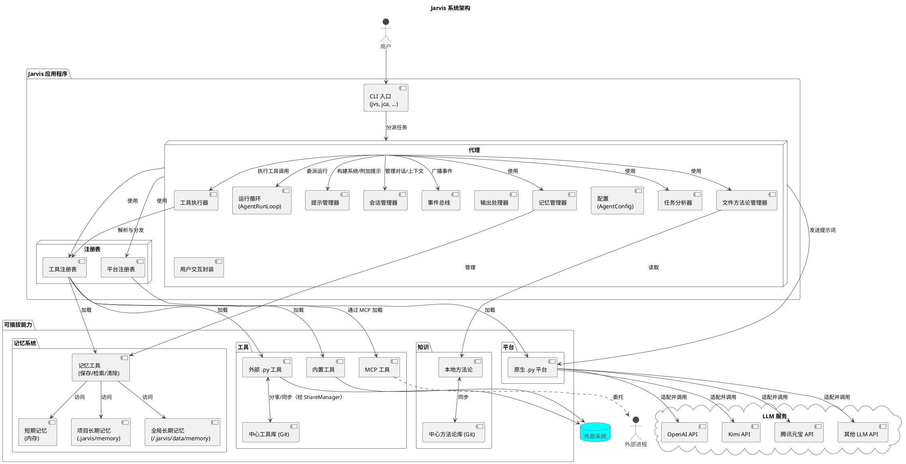
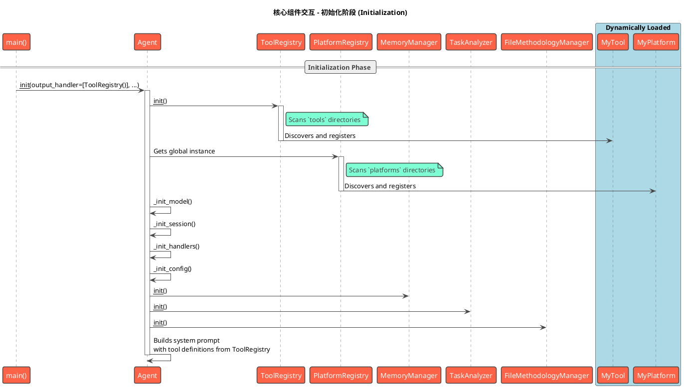
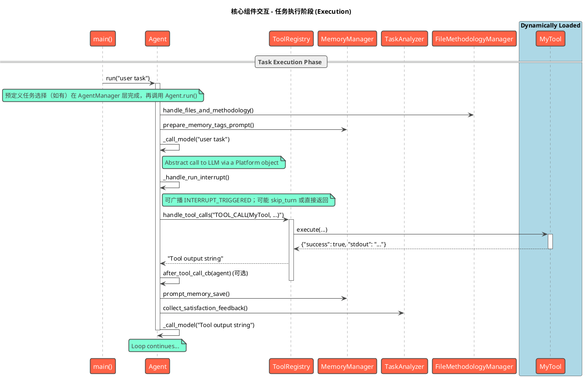

# 3. 核心概念与系统架构

本章将深入探讨 Jarvis 的核心概念，并解释它们如何组合成一个有机的、可扩展的系统。我们将首先独立介绍每一个核心概念，然后通过架构图和工作流来展示它们如何协同工作。

## 3.1 核心概念

要深入了解并有效使用 Jarvis，理解其背后的几个核心概念至关重要。本节将介绍构成 Jarvis 系统的五大基石：**代理（Agent）**、**工具(Tool)**、**平台(Platform)**、**模型(Model)**和**方法论（Methodology）**。

### 3.1.1 代理 (Agent)

**代理(Agent)** 是 Jarvis 的"大脑"和执行中枢，一个高度灵活的**协调者和调度者**。它本身不包含复杂的业务逻辑，而是通过一个**主循环**来驱动整个工作流：获取能力、请求决策、委托执行、循环迭代。

Agent 的核心设计思想是**委托（Delegation）**。它将具体的执行逻辑（如工具调用）委托给不同的**输出处理器(Output Handler)**。这使得 Agent 的核心与具体能力完全解耦。例如，`ToolRegistry` 就是一个专门处理 `TOOL_CALL` 标签的输出处理器。

### 3.1.2 工具与工具注册表 (Tool & ToolRegistry)

**工具(Tool)** 是 Jarvis 的"双手"，是原子化的、功能单一的可执行单元。

**工具注册表(ToolRegistry)** 是所有工具的管理者。它负责发现、加载和执行工具，并通过三种独立的机制来集成它们：
1.  **内置工具**: 加载项目自带的原生Python工具。
2.  **外部Python工具**: 加载用户在指定目录（如 `~/.jarvis/tools`）下创建的Python工具。
3.  **MCP工具**: 通过模型通信协议（MCP）与外部独立进程通信，以接入该进程提供的工具，这是实现高级扩展的关键技术。

### 3.1.3 平台与平台注册表 (Platform & PlatformRegistry)

**平台(Platform)** 是 Jarvis 与大语言模型（LLM）之间的**桥梁和适配器**。它负责对接不同的 LLM 服务提供商（例如 OpenAI、Kimi、腾讯元宝等），将 Agent 的请求转换为特定服务商的 API 调用，并将响应结果返回给 Agent。在 Jarvis 中，平台被抽象为一个统一的**接口**，屏蔽了不同 LLM 服务商 API 的差异。

**平台注册表(PlatformRegistry)** 负责加载所有可用的平台实现。它通过扫描目录中的 `.py` 文件来加载**原生Python平台**，确保 Agent 能以一致的方式与不同的 LLM 服务商交互。

### 3.1.4 模型 (Model)

**模型(Model)** 是指由**平台**提供的、执行具体思考和文本生成任务的**语言模型引擎**，例如 `gpt-4o`, `moonshot-v1-8k` 等。模型是 Jarvis 智能的核心来源。

平台和模型是**提供者**与**产品**的关系。Jarvis 的设计将两者清晰地分开，允许用户通过配置文件在同一平台下轻松切换不同的模型。

### 3.1.5 方法论与中心方法论库

**方法论 (Methodology)** 是 Jarvis 实现"智能进化"的核心机制。它是一套结构化的、用于指导代理解决问题的"思维框架"或"最佳实践"。它定义了代理在面对任务时应该"如何思考"，从而影响它发送给 LLM 的 Prompt 内容，以产生更优的决策。

**中心方法论库 (Central Methodology Repository)** 是一个基于 Git 的共享知识库。它允许用户和团队将个人沉淀的有效方法论分享到一个中心化的 Git 仓库中。通过简单的 `git pull/push`，团队成员之间可以轻松同步和分发这些宝贵的经验，加速整个团队解决问题的能力。这一设计不仅促进了知识的复用，也构建了一个持续学习和演进的集体智慧网络。

### 3.1.6 记忆系统 (Memory System)

**记忆系统 (Memory System)** 是 Jarvis 实现"知识积累"和"经验复用"的重要机制。它为 Agent 提供了持久化存储和检索信息的能力，使得系统能够在不同的任务和会话之间共享和复用知识。

记忆系统包含三种类型的记忆：

1. **短期记忆 (Short-term Memory)**: 存储在内存中的临时信息，主要用于当前任务的上下文保持。这些记忆在任务结束后会被清除。

2. **项目长期记忆 (Project Long-term Memory)**: 与特定项目相关的持久化信息，存储在项目目录的 `.jarvis/memory` 下。这些记忆包含了项目特定的知识、配置和经验。

3. **全局长期记忆 (Global Long-term Memory)**: 跨项目的通用信息，存储在用户数据目录的 `memory/global_long_term` 下。包括用户偏好、通用知识、最佳实践等。

记忆系统通过三个核心工具实现：
- **save_memory**: 保存信息到指定类型的记忆存储
- **retrieve_memory**: 根据标签或类型检索相关记忆
- **clear_memory**: 清理指定的记忆内容

每条记忆都包含唯一ID、标签列表、内容和时间戳，支持灵活的标签化检索。这种设计使得 Agent 能够快速定位和复用相关知识，提高任务执行的效率和准确性。
此外，若启用 force_save_memory，系统会在对话被总结清理或任务完成等关键节点（事件 BEFORE_HISTORY_CLEAR、TASK_COMPLETED）通过事件机制触发记忆保存提示或自动保存逻辑，确保关键信息不会遗漏。

## 3.2 系统架构

本节在"核心概念"的基础上，深入探讨这些概念如何组合成一个有机的、可扩展的系统。

### 3.2.1 架构关系图

下图清晰地展示了 Jarvis 各核心组件之间的静态关系和依赖。
图中已包含 EventBus（事件总线）、PromptManager（提示管理器）、SessionManager（会话管理器）等配套组件，具体见 3.3 节。



#### 角色职责

- 代理（Agent）
  - 系统协调中心，负责初始化与组装各组件（EventBus、MemoryManager、TaskAnalyzer、FileMethodologyManager、PromptManager、SessionManager、输出处理器等）
  - 将主运行循环委派给 AgentRunLoop，聚焦高层编排与状态管理
  - 统一设置系统提示词（通过 PromptManager），并在首次运行时按需进行工具筛选与方法论/文件处理
  - 通过 ToolRegistry 调用工具，通过 PlatformRegistry 访问平台/模型
  - 使用事件常量广播关键事件（TASK_STARTED/BEFORE_MODEL_CALL/AFTER_MODEL_CALL/BEFORE_TOOL_CALL/AFTER_TOOL_CALL/BEFORE_HISTORY_CLEAR/AFTER_HISTORY_CLEAR/AFTER_SUMMARY/TASK_COMPLETED 等）

- 运行循环（AgentRunLoop）
  - 承载主循环逻辑：调用模型、解析并执行工具、处理中断、驱动下一步
  - 使用 LoopAction 表达跳过当前轮（skip_turn）、继续（continue）、完成（complete）
  - 使用 utils.join_prompts 安全拼接提示：仅拼接非空片段，并以两个换行分隔
  - 使用 utils.normalize_next_action 规范化下一步动作（兼容 Enum 与字符串）
  - 输入处理器控制：根据 run_input_handlers_next_turn 标志决定下一轮是否运行输入处理器，并在触发后清除该标志，避免重复执行
  - 处理自动完成：当开启 auto_complete 且检测到 ot('!!!COMPLETE!!!') 或回退至字面量 '!!!COMPLETE!!!' 时直接收尾
  - 在工具调用与模型调用等关键节点通过 EventBus 广播事件（使用事件常量，如 BEFORE_TOOL_CALL/AFTER_TOOL_CALL），并在工具调用后支持 after_tool_call_cb 回调；事件载荷：BEFORE_TOOL_CALL 包含 agent/current_response；AFTER_TOOL_CALL 包含 agent/current_response/need_return/tool_prompt
  - 失败兜底：主循环对异常进行捕获，使用 PrettyOutput 输出错误并返回 "Task failed: ..."

- 提示管理器（PromptManager）
  - 构建系统提示词（拼装系统指令与工具使用提示）
  - 构建默认附加提示（整合工具使用规范与记忆提示）
  - 仅做字符串拼装，不直接访问模型，保持与现有行为一致

- 会话管理器（SessionManager）
  - 管理 prompt、addon_prompt、conversation_length、用户数据
  - 提供 save/restore/clear_history 能力，持久化路径位于 .jarvis/saved_session_*.json
  - clear_history 重置模型状态但保留系统提示的约束环境

- 事件总线（EventBus）
  - 提供 subscribe/emit/unsubscribe 的轻量同步事件机制
  - 回调异常隔离，避免影响主流程，便于旁路扩展能力（如记忆保存、任务分析）

- 工具执行器（ToolExecutor / execute_tool_call）
  - 解析模型响应，匹配可处理的输出处理器（默认为 ToolRegistry），强制单操作约束
  - 支持执行前确认（execute_tool_confirm），执行并返回结果或错误信息
  - 将“是否直接返回结果”与“下一步提示”统一为标准返回协议

- 配置（AgentConfig）
  - 使用数据类聚合初始化参数，负责解析默认值（use_methodology/use_analysis/execute_tool_confirm/force_save_memory/max_token_count 等）
  - 当存在 files 时默认禁用 use_methodology，确保行为合理
  - 解析结果回填到 Agent 保持向后兼容

- 用户交互封装（UserInteractionHandler）
  - 对多行输入函数做兼容封装（支持 func(tip, print_on_empty) 与 func(tip) 两种签名）
  - 对确认函数做统一封装，便于未来替换为 TUI/WebUI

- 工具注册表（ToolRegistry）
  - 统一发现、加载与执行工具：内置工具、外部 .py 工具、MCP 工具
  - 作为默认输出处理器接收工具调用请求并执行具体工具

- 平台注册表与平台（PlatformRegistry / BasePlatform）
  - 动态创建平台实例、设置模型名称与模型组、适配不同厂商 API
  - 提供 chat_until_success、set_system_prompt、upload_files/save/restore 等能力

- 记忆管理器（MemoryManager）
  - 准备记忆标签提示、在附加提示中注入记忆相关引导
  - 自动记忆保存：在开启 force_save_memory 时于 before_history_clear/task_completed 等事件触发保存逻辑
  - 与工具 save_memory/retrieve_memory/clear_memory 协作，沉淀与复用知识

- 文件与方法论管理器（FileMethodologyManager）
  - 根据平台能力选择文件上传模式或本地模式
  - 负责方法论的上传或本地加载，以及在上下文过长时以文件方式上传历史

- 任务分析器（TaskAnalyzer）
  - 在任务完成阶段基于事件旁路执行分析（如满意度收集、方法论沉淀），不阻塞主流程

- 输出处理器（Output Handler）
  - 一个可扩展的处理器链，默认包含 ToolRegistry；Agent 将模型响应委派给能处理的处理器，由处理器解析并执行（参见 OutputHandlerProtocol: name/can_handle/prompt/handle）

### 3.2.2 核心架构原则

Jarvis 的架构遵循以下几个核心设计原则：

1.  **代理作为协调中心 (Agent-Centric Coordination)**: 系统的核心是 **Agent**，但它是一个轻量级的**协调者**，其主要职责是驱动主循环，并将具体的任务委托给专门的处理器。

2.  **通过注册表实现解耦 (Decoupling via Registries)**: **ToolRegistry** 和 **PlatformRegistry** 是实现系统可插拔性的关键。Agent 不直接与任何具体的工具或平台耦合，它只与注册表交互。

3.  **基于委托的执行模式 (Delegation-Based Execution)**: Agent 接收到来自 LLM 的响应后，不会自己去解析，而是将响应传递给一个**输出处理器**列表。这种**委托机制**将"决策"与"执行"完全分离。

4.  **将 LLM 作为可插拔的推理引擎 (LLM as a Pluggable Reasoning Engine)**: **Platform** 作为 Agent 与 LLM 之间的适配层，将不同 LLM 服务商的 API 差异完全封装起来。这使得 Agent 可以用统一的方式向任何 LLM "提问"（发送Prompt）并获得"回答"（决策文本），而无需关心底层是哪个服务商的模型。

5.  **分层的记忆管理 (Hierarchical Memory Management)**: **记忆系统**采用三层架构（短期、项目长期、全局长期），通过标签化管理实现灵活的知识组织。记忆的存储和检索通过统一的工具接口实现，确保了系统的可扩展性和易用性。

### 3.2.3 端到端工作流：一次工具调用的生命周期

下面的流程描述了上述架构原则在一次典型的工具调用中是如何协同工作的：

1.  **任务分派**: 用户通过 **CLI** 启动一个任务，CLI 将其分派给一个配置好的 **Agent**。

2.  **决策请求**: `Agent` 的主循环启动。它向 `ToolRegistry` 请求所有可用工具的描述，然后将用户任务和这份工具清单组合成一个 Prompt，通过 `PlatformRegistry` 获取的**平台**，发送给**模型**(LLM)，请求下一步的行动决策。

3.  **决策返回**: **模型**(LLM) 思考后，决定调用 `read_code` 工具，并返回一个包含 `TOOL_CALL` 指令的文本。

4.  **委托执行**: `Agent` 接收到这段文本，并将其**委托**给能识别 `TOOL_CALL` 标签的 `ToolRegistry` 进行处理。同时，运行循环通过事件总线广播 BEFORE_TOOL_CALL（载荷：`agent`、`current_response`），以便旁路能力感知工具即将执行。

5.  **工具执行**: `ToolRegistry` 解析出工具名称和参数，调用目标工具的 `execute` 方法并返回其执行结果。运行循环从工具调用接口接收标准返回 `(need_return, tool_prompt)`，用于统一后续流程控制与提示拼接。

6.  **结果反馈与循环**: `Agent` 将工具结果整合进上下文：使用 `utils.join_prompts` 将上一轮提示与 `tool_prompt` 按双换行安全拼接；随后通过事件总线广播 AFTER_TOOL_CALL（载荷：`agent`、`current_response`、`need_return`、`tool_prompt`）。若 `need_return=True`，则直接返回当前 `session.prompt` 并结束；否则继续进入新一轮“思考-决策-委托”循环，直到任务最终完成。

## 3.3 核心组件详解

### 3.3.1 Jarvis Agent

`Jarvis Agent` 是系统的指挥中心，负责协调所有操作。它位于 `src/jarvis/jarvis_agent` 模块中，其核心是 `Agent` 类。

#### 主要职责

- **任务理解与规划**: Agent 接收用户输入，并与大型语言模型（LLM）协作，将高级任务分解为一系列具体的、可执行的步骤。
- **工具调用**: 根据规划，Agent 动态选择并调用合适的工具来执行每个步骤。它是模型与工具集之间的桥梁。
- **状态管理**: Agent 维护着整个任务的上下文，包括对话历史、工具执行结果以及任何中间产物。当对话历史过长时，它会自动进行总结以管理上下文长度。
- **人机交互**: Agent 管理与用户的交互循环，接收指令，反馈结果，并根据用户干预调整执行路径。
- **记忆管理**: 通过 `MemoryManager` 管理短期、项目长期和全局长期记忆，实现知识的持久化和复用。
- **任务分析**: 通过 `TaskAnalyzer` 在任务完成后进行分析，提炼方法论和改进建议。
- **文件和方法论处理**: 通过 `FileMethodologyManager` 处理文件上传和方法论加载。

#### 关联组件与内部模块
- EventBus（事件总线）: 提供简单的发布/订阅机制（使用事件常量：BEFORE_MODEL_CALL/AFTER_MODEL_CALL、BEFORE_TOOL_CALL/AFTER_TOOL_CALL、BEFORE_HISTORY_CLEAR/AFTER_HISTORY_CLEAR、TASK_STARTED/TASK_COMPLETED 等，定义于 jarvis.jarvis_agent.events），以旁路方式集成能力，回调异常隔离不影响主流程。
- PromptManager（提示管理器）: 统一构建系统提示与默认附加提示，保持与现有行为一致，并集中注入工具使用规范和记忆提示。
- AgentConfig（配置聚合）: 将 Agent 初始化参数集中到数据类中，解析默认值（use_methodology/use_analysis/execute_tool_confirm/force_save_memory/max_token_count 等），保持向后兼容。
- UserInteractionHandler（用户交互封装）: 对多行输入与确认交互做轻量封装，便于未来替换为 TUI/WebUI。
- TaskManager（任务管理器）: 由 AgentManager 在进入 Agent.run 之前调用，用于加载与选择预定义任务（支持 fzf 选择与编号跳过），并可询问用户补充信息；当追加补充信息时使用 utils.join_prompts 进行提示拼接，保持上下文一致性。
- ToolExecutor（工具执行器）: 通过 `execute_tool_call` 统一解析与执行模型返回的工具调用，支持执行前确认和错误处理；标准返回协议：返回 (need_return, tool_prompt)，当 need_return 为 True 时运行循环直接返回当前 session.prompt，否则将 tool_prompt 使用 utils.join_prompts 拼接到上下文后继续。
- Utils（工具函数）: 提供 join_prompts/is_auto_complete/normalize_next_action 等统一实现：join_prompts 仅拼接非空片段并以两个换行分隔；is_auto_complete 基于 ot('!!!COMPLETE!!!') 检测，异常时回退到字面量 '!!!COMPLETE!!!'；normalize_next_action 将 Enum 映射为其字符串 value，其他类型返回空字符串。
- AgentRunLoop（运行循环）: 将主运行循环逻辑抽离为独立类，Agent._main_loop 仅做委派，便于演进与测试。

#### 初始化流程

Agent 的初始化过程是高度可配置的，包含以下关键步骤：

1. **模型初始化** (`_init_model`):
   - 根据 `model_group` 确定平台和模型
   - 通过 `PlatformRegistry` 创建平台实例
   - 设置模型名称和模型组

2. **会话初始化** (`_init_session`):
   - 创建 `SessionManager` 实例
   - 管理对话历史、用户数据和附加提示

3. **处理器初始化** (`_init_handlers`):
   - 设置输出处理器 (如 `ToolRegistry`)
   - 设置输入处理器 (如 `shell_input_handler`, `builtin_input_handler`)
   - 设置多行输入处理器

4. **配置初始化** (`_init_config`):
   - 设置方法论使用标志 (`use_methodology`)
   - 设置任务分析标志 (`use_analysis`)
   - 设置工具执行确认标志 (`execute_tool_confirm`)
   - 设置记忆强制保存标志 (`force_save_memory`)
   - 设置最大token数 (`max_token_count`)

5. **管理器与总线初始化**:
   - 创建 `EventBus` 实例（先于其他管理器，便于在构造过程中安全订阅事件）
   - 创建 `MemoryManager` 实例
   - 创建 `TaskAnalyzer` 实例
   - 创建 `FileMethodologyManager` 实例
   - 创建 `PromptManager` 实例
   - 设置系统提示词（通过 `PromptManager` 构建并设置到模型）
   - 输出启动统计信息（`show_agent_startup_stats` 展示方法论/工具/记忆等资源概览）

#### 主运行循环 (AgentRunLoop)

主运行循环由 `AgentRunLoop.run` 承载（`Agent._main_loop` 仅委派调用）。其工作流程如下，并在关键节点通过 EventBus 广播事件（如 BEFORE_MODEL_CALL/AFTER_MODEL_CALL、BEFORE_TOOL_CALL/AFTER_TOOL_CALL、BEFORE_HISTORY_CLEAR/AFTER_HISTORY_CLEAR、TASK_STARTED/TASK_COMPLETED 等），以旁路方式接入其他能力：

1. **首次运行处理**:
   - 通过 `FileMethodologyManager` 处理文件上传和方法论加载
   - 准备记忆标签提示
   - 预定义任务选择在 AgentManager 层进行（如有），Agent 首轮不负责加载
   - 工具筛选（按需）: 当可用工具数量超过阈值时（由配置项阈值控制），使用临时模型筛选相关工具并更新系统提示词，以降低工具集合规模、提升决策效率

2. **模型调用** (`_call_model`):
   - 处理输入处理器链
   - 管理对话长度，必要时进行总结
   - 调用模型并获取响应

3. **工具执行** (`_call_tools`):
   - 通过 `execute_tool_call` 执行工具
   - 处理工具执行结果
   - 执行工具调用后回调

4. **中断处理** (`_handle_run_interrupt`):
   - 处理用户中断请求
   - 获取用户补充信息
   - 决定是否继续工具调用
   - 使用 `LoopAction` 标识跳过当前轮次或继续执行（continue/complete），并在检测到待执行工具时征询用户确认

5. **任务完成处理** (`_complete_task`):
   - 收集满意度反馈
   - 进行任务分析 (如果启用)
   - 生成任务总结

6. **循环控制**:
   - 根据用户输入决定继续或完成任务
   - 自动完成检测: 若开启 `auto_complete` 且模型响应中包含 `!!!COMPLETE!!!` 标记，则直接进入任务完成流程

### 3.3.2 工具注册表 (Tool Registry) 详解

`ToolRegistry` (位于 `src/jarvis/jarvis_tools/registry.py`) 是 Jarvis 工具驱动架构的基石。它是一个动态的工具加载器和执行器，负责管理 Agent 可用的所有工具。

#### 动态工具加载

`ToolRegistry` 在初始化时会自动扫描并加载来自多个源的工具：

- **内置工具**: 位于 `src/jarvis/jarvis_tools/` 目录下的核心工具。
- **外部工具**: 用户可以在 `~/.jarvis/tools/` 目录下添加自定义的 Python 工具脚本。
- **MCP 工具**: 通过模型上下文协议（MCP）集成的外部应用或服务。这些工具通过 `~/.jarvis/mcp/` 或 `JARVIS_MCP` 环境变量中的 YAML 配置文件进行定义。

这种分层加载机制使得核心功能保持稳定，同时为用户提供了极大的灵活性来扩展 Jarvis 的能力。

MCP 工具配置与命名约定
- 配置优先：ToolRegistry 优先通过配置加载 MCP 工具（get_mcp_config，建议使用 JARVIS_MCP 配置方式）；从数据目录 mcp 目录扫描 YAML 的方式仅作为回退，并在运行时给出“未来版本将废弃”的警告提示。
- 客户端类型：
  - stdio：需要提供 command
  - sse：需要提供 base_url
  - streamable：需要提供 base_url
- 注册命名约定：
  - 基于配置中的 name，工具将被注册为 name.tool_call.{工具名}
  - 同时会注册资源工具：
    - name.resource.get_resource_list（列出 MCP 服务器的资源）
    - name.resource.get_resource（按 uri 获取资源，参数包含 uri）


#### 工具执行

当 Agent 决定使用一个工具时，`ToolRegistry` 会：
1. 解析模型生成的工具调用请求。
2. 查找已注册的同名工具。
3. 验证并传递参数。
4. 调用工具的 `execute` 方法。
5. 捕获并格式化 `stdout` 和 `stderr`，然后返回给 Agent。

#### 协议版本与调用
- ToolRegistry 在执行工具时支持协议版本分发：
  - v2.0：工具函数签名形如 func(arguments, agent)，Agent 与参数分离传递
  - v1.0：为兼容旧实现，将 agent 注入到 arguments 中再调用 execute
- 若函数签名不匹配，将回退到旧方式（向参数注入 agent）以保证兼容性


### 3.3.3 平台注册表 (Platform Registry) 详解

`PlatformRegistry` (位于 `src/jarvis/jarvis_platform/registry.py`) 负责管理与不同大型语言模型（LLM）平台的交互。它使得 Jarvis 可以无缝切换和使用多个 AI 提供商。

#### 平台抽象

所有平台都必须继承自 `BasePlatform` 类，并实现一套标准接口，如 `chat`, `set_model_name`, `upload_files` 等。这种设计将特定平台的实现细节与 Agent 的核心逻辑解耦。

#### 动态平台加载

与 `ToolRegistry` 类似，`PlatformRegistry` 也会动态加载平台实现：

- **内置平台**: 位于 `src/jarvis/jarvis_platform/` 目录下的官方支持平台。
- **外部平台**: 用户可以在 `~/.jarvis/models/` 目录下添加自定义的平台适配器。

这使得社区可以方便地为 Jarvis 贡献对新 LLM 平台的支持。

### 3.3.4 记忆系统实现 (Memory System Implementation)

**记忆系统**由 `MemoryManager` 类实现，位于 `src/jarvis/jarvis_agent/memory_manager.py`。它提供了以下核心功能：

1. **记忆提示准备** (`prepare_memory_tags_prompt`):
   - 检查是否有 `save_memory` 工具
   - 格式化所有可用的记忆标签
   - 生成记忆提示文本

2. **自动记忆保存** (`prompt_memory_save`):
   - 让模型自动判断并保存值得记忆的信息
   - 处理记忆保存工具调用

3. **记忆提示集成** (`add_memory_prompts_to_addon`):
   - 在附加提示中添加记忆相关提示
   - 支持 `save_memory` 和 `retrieve_memory` 工具

记忆系统与 Agent 深度集成，在以下关键点发挥作用：
- 任务开始时：提供记忆标签提示，并重置记忆处理去重标记（订阅事件：TASK_STARTED）
- 任务中断时：提示保存重要信息
- 任务完成时：自动分析并保存有价值的信息（订阅事件：TASK_COMPLETED）
- 上下文过长时：提示保存关键信息（在清理历史前兜底处理，订阅事件：BEFORE_HISTORY_CLEAR）

### 3.3.5 任务分析方法论 (Task Analysis Methodology)

**任务分析**由 `TaskAnalyzer` 类实现，位于 `src/jarvis/jarvis_agent/task_analyzer.py`。它提供了以下核心功能：

1. **任务分析** (`analysis_task`):
   - 准备分析提示 (基于 `TASK_ANALYSIS_PROMPT`)
   - 处理分析循环
   - 执行工具调用 (如方法论保存)

2. **满意度反馈收集** (`collect_satisfaction_feedback`):
   - 收集用户对任务完成的满意度
   - 记录用户反馈

3. **分析循环处理** (`_process_analysis_loop`):
   - 调用模型进行分析
   - 处理工具调用
   - 管理分析状态

任务分析在以下场景触发：
- 任务完成时 (如果启用 `use_analysis`)
- 用户明确请求分析时

### 3.3.6 文件和方法论管理 (File & Methodology Management)

**文件和方法论管理**由 `FileMethodologyManager` 类实现，位于 `src/jarvis/jarvis_agent/file_methodology_manager.py`。它提供了以下核心功能：

1. **文件和方法论处理** (`handle_files_and_methodology`):
   - 根据平台能力选择处理模式
   - 支持文件上传模式 (`_handle_file_upload_mode`)
   - 支持本地模式 (`_handle_local_mode`)

2. **方法论上传** (`_handle_methodology_upload`):
   - 上传方法论文件
   - 处理上传失败回退

3. **本地方法论加载** (`_load_local_methodology`):
   - 加载本地方法论
   - 集成记忆标签提示

4. **历史处理** (`handle_history_with_file_upload`):
   - 使用临时文件上传历史对话
   - 管理上下文长度

### 3.3.7 执行流程时序图

下面的时序图展示了核心组件在**初始化**和**任务执行**两个阶段中的交互流程：

#### 初始化阶段 (Initialization Phase)



#### 任务执行阶段 (Task Execution Phase)



### 3.3.8 事件常量与载荷一览

为便于扩展与旁路集成，Agent 在关键节点通过事件总线广播事件（常量定义于 `jarvis.jarvis_agent.events`）：
- BEFORE_TOOL_CALL
  - 载荷：agent, current_response
  - 时机：执行工具前（在解析工具并调用前）
- AFTER_TOOL_CALL
  - 载荷：agent, current_response, need_return, tool_prompt
  - 时机：工具执行完成后（回调与提示拼接流程中）
- BEFORE_MODEL_CALL
  - 载荷：agent, message
  - 时机：模型调用前
- AFTER_MODEL_CALL
  - 载荷：agent, message, response
  - 时机：模型调用后
- BEFORE_ADDON_PROMPT
  - 载荷：agent, need_complete, current_message, has_session_addon
  - 时机：添加附加提示前
- AFTER_ADDON_PROMPT
  - 载荷：agent, need_complete, addon_text, final_message
  - 时机：添加附加提示后
- BEFORE_SUMMARY
  - 载荷：agent, prompt, auto_completed, need_summary
  - 时机：生成总结前
- AFTER_SUMMARY
  - 载荷：agent, summary
  - 时机：生成总结后
- BEFORE_TOOL_FILTER
  - 载荷：agent, task, total_tools, threshold
  - 时机：当工具数量超过阈值时开始AI筛选前
- TOOL_FILTERED
  - 载荷：agent, task, selected_tools, total_tools, threshold
  - 时机：AI筛选完成后（可能为空）
- INTERRUPT_TRIGGERED
  - 载荷：agent, current_response, user_input
  - 时机：交互期间用户中断触发
- TASK_STARTED
  - 用途：记忆系统在新任务开始时重置去重标记
- BEFORE_HISTORY_CLEAR
  - 用途：当启用 force_save_memory 时，记忆系统在清理历史前兜底尝试保存
- AFTER_HISTORY_CLEAR
  - 载荷：agent
  - 时机：清理历史后
- TASK_COMPLETED
  - 用途：当启用 force_save_memory 时，记忆系统在任务完成时兜底尝试保存

说明：
- 事件回调异常被隔离，避免影响主流程。
- 订阅与发射接口位于 Agent 的事件总线组件（EventBus）上，遵循 subscribe/emit/unsubscribe 轻量同步机制。

### 3.3.9 utils 使用示例

- join_prompts：仅拼接非空片段，并以两个换行分隔
```python
from jarvis.jarvis_agent.utils import join_prompts
join_prompts(["", "A", "", "B"])  # "A\n\nB"
```

- is_auto_complete：基于 ot('!!!COMPLETE!!!') 检测，异常时回退到字面量
```python
from jarvis.jarvis_agent.utils import is_auto_complete
from jarvis.jarvis_utils.tag import ot

is_auto_complete(f"... {ot('!!!COMPLETE!!!')}")  # True
is_auto_complete("... !!!COMPLETE!!!")          # True (fallback)
```

- normalize_next_action：将 Enum 映射为其字符串 value，字符串原样返回，其他返回空字符串
```python
from enum import Enum
from jarvis.jarvis_agent.utils import normalize_next_action

class LoopAction(Enum):
    CONTINUE = "continue"
    COMPLETE = "complete"

normalize_next_action(LoopAction.CONTINUE)  # "continue"
normalize_next_action("complete")           # "complete"
normalize_next_action(123)                  # ""
```

### 3.3.10 自定义输出处理器最小示例（OutputHandlerProtocol）

输出处理器需要实现 `OutputHandlerProtocol`（参见 `src/jarvis/jarvis_agent/protocols.py`），用于扩展 ToolRegistry 之外的处理能力：
```python
from typing import Any, Tuple
from jarvis.jarvis_agent.protocols import OutputHandlerProtocol

class MyHandler(OutputHandlerProtocol):
    def name(self) -> str:
        return "MyHandler"

    def can_handle(self, response: str) -> bool:
        return response.strip().startswith("MY_TAG:")

    def prompt(self) -> str:
        return "Handles MY_TAG responses and produces a result."

    def handle(self, response: str, agent: Any) -> Tuple[bool, Any]:
        # 解析并执行
        result = f"Handled: {response}"
        # True 表示本轮可直接返回；False 表示继续后续循环
        return False, result
```
将其加入 Agent 的输出处理器链后，Agent 会将模型响应委派给第一个可处理的处理器。

### 3.3.11 运行循环关键逻辑伪代码

```python
def run_loop(agent):
    run_input_handlers = True
    while True:
        if agent.run_input_handlers_next_turn:
            run_input_handlers = True
            agent.run_input_handlers_next_turn = False

        if agent.first:
            agent._first_run()

        current_response = agent._call_model(agent.session.prompt, True, run_input_handlers)
        agent.session.prompt = ""
        run_input_handlers = False

        interrupt = agent._handle_run_interrupt(current_response)
        if is_skip_turn(interrupt):  # Enum value == "skip_turn"
            continue
        if is_final_result(interrupt):
            return interrupt

        # BEFORE_TOOL_CALL
        agent.event_bus.emit(BEFORE_TOOL_CALL, agent=agent, current_response=current_response)

        need_return, tool_prompt = agent._call_tools(current_response)
        agent.session.prompt = join_prompts([agent.session.prompt, tool_prompt])

        if need_return:
            return agent.session.prompt

        if agent.after_tool_call_cb:
            agent.after_tool_call_cb(agent)

        # AFTER_TOOL_CALL
        agent.event_bus.emit(
            AFTER_TOOL_CALL,
            agent=agent,
            current_response=current_response,
            need_return=need_return,
            tool_prompt=tool_prompt,
        )

        if agent.session.prompt or agent.session.addon_prompt:
            continue

        if agent.auto_complete and is_auto_complete(current_response):
            return agent._complete_task(auto_completed=True)

        action = normalize_next_action(agent._get_next_user_action())
        if action == "continue":
            run_input_handlers = True
            continue
        if action == "complete":
            return agent._complete_task(auto_completed=False)
```

### 3.3.12 记忆系统使用小贴士

- save_memory 工具参数示例（选择合适的记忆类型与标签）：
```json
{
  "memories": [
    {
      "memory_type": "project_long_term",
      "tags": ["architecture", "jarvis_agent"],
      "content": "关键决策：运行循环采用事件常量与统一工具提示拼接策略。"
    }
  ]
}
```

- retrieve_memory 工具参数示例（按类型与标签检索，limit 可选）：
```json
{
  "memory_types": ["project_long_term", "global_long_term"],
  "tags": ["architecture"],
  "limit": 10
}
```

- 强制保存（force_save_memory）行为说明：
  - 记忆管理器订阅 TASK_STARTED 重置去重标记；
  - 在 BEFORE_HISTORY_CLEAR 与 TASK_COMPLETED 事件上兜底触发自动保存逻辑；
  - 使用内部标记与用户数据键（如 `__memory_save_prompted__`）避免同一任务内重复提示/处理；失败不影响主流程。

### 3.3.13 CLI 与 AgentManager 概览

- 高级 CLI（jarvis.py）
  - 功能总览：启动时打印命令与快捷方式表（print_commands_overview）
  - 便捷选项：
    - 配置编辑：--edit 调用 ConfigEditor 在本地编辑配置文件
    - 方法论/工具分享：--share-methodology / --share-tool 分别启动分享管理器流程
    - 交互式配置：--interactive-config 基于当前配置进行补全式设置并写回
  - 预加载与模式切换：
    - 预加载配置（preload_config_for_flags），仅为读取功能开关，不影响后续 init_env
    - Git 仓库检测（try_switch_to_jca_if_git_repo）：若检测到当前目录为 Git 仓库，提示是否切换到代码开发模式（jarvis-code-agent，jca）
    - 内置配置选择器（handle_builtin_config_selector）：在进入默认代理前列出 agent/multi_agent/roles 的内置配置，支持 fzf/编号选择与自动 exec 切换
  - 初始化与运行：
    - 初始化环境（init_env），输出欢迎与资源概览
    - 构造 AgentManager 并传入命令行覆盖项（model_group/tool_group/restore_session/disable_methodology_analysis）

- AgentManager（agent_manager.py）
  - initialize：
    - 注入工具组到配置（JARVIS_TOOL_GROUP）
    - 构造 Agent：system_prompt=origin_agent_system_prompt，输出处理器默认 [ToolRegistry()]，输入处理器 [shell_input_handler, builtin_input_handler]，按需启用 use_methodology/use_analysis
    - 可选恢复会话（restore_session），成功/失败都有提示
  - run_task：
    - 若提供命令行 task，直接运行并结束
    - 首次运行时尝试从 TaskManager 载入预定义任务并交互选择，可追加补充信息
    - 否则读取用户多行输入并运行

- 精简 CLI（main.py，jarvis-agent）
  - 从 -c/--agent-definition 读取 YAML 配置构造 Agent，-g 可覆盖模型组
  - 支持 -T 初始任务；否则提示用户输入任务
  - 额外注入一个附加提示，引导“先出行动计划再执行、必要时拆分子Agent”，保持体验一致
