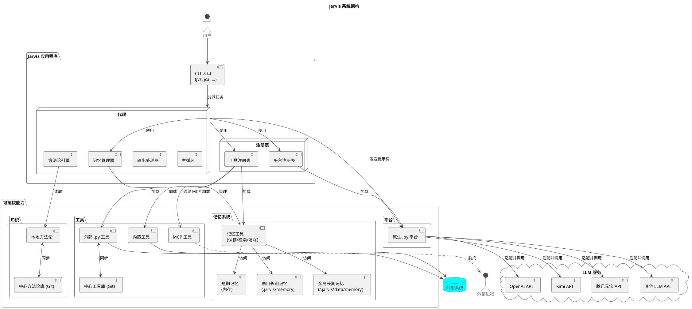

# 3. 核心概念与系统架构

本章将深入探讨 Jarvis 的核心概念，并解释它们如何组合成一个有机的、可扩展的系统。我们将首先独立介绍每一个核心概念，然后通过架构图和工作流来展示它们如何协同工作。

## 3.1 核心概念

要深入了解并有效使用 Jarvis，理解其背后的几个核心概念至关重要。本节将介绍构成 Jarvis 系统的五大基石：**代理（Agent）**、**工具(Tool)**、**平台(Platform)**、**模型(Model)**和**方法论（Methodology）**。

### 3.1.1 代理 (Agent)

**代理(Agent)** 是 Jarvis 的“大脑”和执行中枢，一个高度灵活的**协调者和调度者**。它本身不包含复杂的业务逻辑，而是通过一个**主循环**来驱动整个工作流：获取能力、请求决策、委托执行、循环迭代。

Agent 的核心设计思想是**委托（Delegation）**。它将具体的执行逻辑（如工具调用）委托给不同的**输出处理器(Output Handler)**。这使得 Agent 的核心与具体能力完全解耦。例如，`ToolRegistry` 就是一个专门处理 `TOOL_CALL` 标签的输出处理器。

### 3.1.2 工具与工具注册表 (Tool & ToolRegistry)

**工具(Tool)** 是 Jarvis 的“双手”，是原子化的、功能单一的可执行单元。

**工具注册表(ToolRegistry)** 是所有工具的管理者。它负责发现、加载和执行工具，并通过三种独立的机制来集成它们：
1.  **内置工具**: 加载项目自带的原生Python工具。
2.  **外部Python工具**: 加载用户在指定目录（如 `~/.jarvis/tools`）下创建的Python工具。
3.  **MCP工具**: 通过模型通信协议（MCP）与外部独立进程通信，以接入该进程提供的工具，这是实现高级扩展的关键技术。

### 3.1.3 平台与平台注册表 (Platform & PlatformRegistry)

**平台(Platform)** 是 Jarvis 与大语言模型（LLM）之间的**桥梁和适配器**。它负责对接不同的 LLM 服务提供商（例如 OpenAI、Kimi、腾讯元宝等），将 Agent 的请求转换为特定服务商的 API 调用，并将响应结果返回给 Agent。在 Jarvis 中，平台被抽象为一个统一的**接口**，屏蔽了不同 LLM 服务商 API 的差异。

**平台注册表(PlatformRegistry)** 负责加载所有可用的平台实现。它通过扫描目录中的 `.py` 文件来加载**原生Python平台**，确保 Agent 能以一致的方式与不同的 LLM 服务商交互。

### 3.1.4 模型 (Model)

**模型(Model)** 是指由**平台**提供的、执行具体思考和文本生成任务的**语言模型引擎**，例如 `gpt-4o`, `moonshot-v1-8k` 等。模型是 Jarvis 智能的核心来源。

平台和模型是**提供者**与**产品**的关系。Jarvis 的设计将两者清晰地分开，允许用户通过配置文件在同一平台下轻松切换不同的模型。

### 3.1.5 方法论与中心方法论库

**方法论 (Methodology)** 是 Jarvis 实现“智能进化”的核心机制。它是一套结构化的、用于指导代理解决问题的“思维框架”或“最佳实践”。它定义了代理在面对任务时应该“如何思考”，从而影响它发送给 LLM 的 Prompt 内容，以产生更优的决策。

**中心方法论库 (Central Methodology Repository)** 是一个基于 Git 的共享知识库。它允许用户和团队将个人沉淀的有效方法论分享到一个中心化的 Git 仓库中。通过简单的 `git pull/push`，团队成员之间可以轻松同步和分发这些宝贵的经验，加速整个团队解决问题的能力。这一设计不仅促进了知识的复用，也构建了一个持续学习和演进的集体智慧网络。

### 3.1.6 记忆系统 (Memory System)

**记忆系统 (Memory System)** 是 Jarvis 实现"知识积累"和"经验复用"的重要机制。它为 Agent 提供了持久化存储和检索信息的能力，使得系统能够在不同的任务和会话之间共享和复用知识。

记忆系统包含三种类型的记忆：

1. **短期记忆 (Short-term Memory)**: 存储在内存中的临时信息，主要用于当前任务的上下文保持。这些记忆在任务结束后会被清除。

2. **项目长期记忆 (Project Long-term Memory)**: 与特定项目相关的持久化信息，存储在项目目录的 `.jarvis/memory` 下。这些记忆包含了项目特定的知识、配置和经验。

3. **全局长期记忆 (Global Long-term Memory)**: 跨项目的通用信息，存储在用户数据目录的 `memory/global_long_term` 下。包括用户偏好、通用知识、最佳实践等。

记忆系统通过三个核心工具实现：
- **save_memory**: 保存信息到指定类型的记忆存储
- **retrieve_memory**: 根据标签或类型检索相关记忆
- **clear_memory**: 清理指定的记忆内容

每条记忆都包含唯一ID、标签列表、内容和时间戳，支持灵活的标签化检索。这种设计使得 Agent 能够快速定位和复用相关知识，提高任务执行的效率和准确性。

## 3.2 系统架构

本节在“核心概念”的基础上，深入探讨这些概念如何组合成一个有机的、可扩展的系统。

### 3.2.1 架构关系图

下图清晰地展示了 Jarvis 各核心组件之间的静态关系和依赖。

### 3.2.2 核心架构原则

Jarvis 的架构遵循以下几个核心设计原则：

1.  **代理作为协调中心 (Agent-Centric Coordination)**: 系统的核心是 **Agent**，但它是一个轻量级的**协调者**，其主要职责是驱动主循环，并将具体的任务委托给专门的处理器。

2.  **通过注册表实现解耦 (Decoupling via Registries)**: **ToolRegistry** 和 **PlatformRegistry** 是实现系统可插拔性的关键。Agent 不直接与任何具体的工具或平台耦合，它只与注册表交互。

3.  **基于委托的执行模式 (Delegation-Based Execution)**: Agent 接收到来自 LLM 的响应后，不会自己去解析，而是将响应传递给一个**输出处理器**列表。这种**委托机制**将“决策”与“执行”完全分离。

4.  **将 LLM 作为可插拔的推理引擎 (LLM as a Pluggable Reasoning Engine)**: **Platform** 作为 Agent 与 LLM 之间的适配层，将不同 LLM 服务商的 API 差异完全封装起来。这使得 Agent 可以用统一的方式向任何 LLM "提问"（发送Prompt）并获得"回答"（决策文本），而无需关心底层是哪个服务商的模型。

5.  **分层的记忆管理 (Hierarchical Memory Management)**: **记忆系统**采用三层架构（短期、项目长期、全局长期），通过标签化管理实现灵活的知识组织。记忆的存储和检索通过统一的工具接口实现，确保了系统的可扩展性和易用性。

### 3.2.3 端到端工作流：一次工具调用的生命周期

下面的流程描述了上述架构原则在一次典型的工具调用中是如何协同工作的：

1.  **任务分派**: 用户通过 **CLI** 启动一个任务，CLI 将其分派给一个配置好的 **Agent**。

2.  **决策请求**: `Agent` 的主循环启动。它向 `ToolRegistry` 请求所有可用工具的描述，然后将用户任务和这份工具清单组合成一个 Prompt，通过 `PlatformRegistry` 获取的**平台**，发送给**模型**(LLM)，请求下一步的行动决策。

3.  **决策返回**: **模型**(LLM) 思考后，决定调用 `read_code` 工具，并返回一个包含 `TOOL_CALL` 指令的文本。

4.  **委托执行**: `Agent` 接收到这段文本，并将其**委托**给能识别 `TOOL_CALL` 标签的 `ToolRegistry` 进行处理。

5.  **工具执行**: `ToolRegistry` 解析出工具名称和参数，调用 `read_code` 工具的 `execute` 方法，并返回其执行结果。

6.  **结果反馈与循环**: `ToolRegistry` 将工具的执行结果返回给 `Agent`。`Agent` 将这个结果作为新的上下文，再次进入第2步，开始一个新的“思考-决策-委托”循环，直到任务最终完成。

