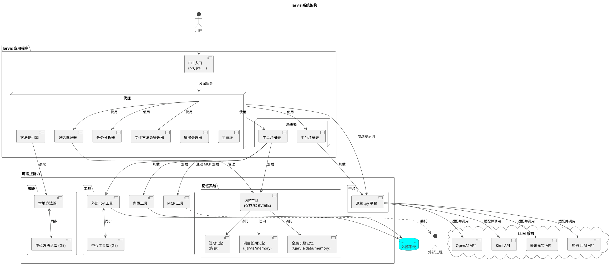
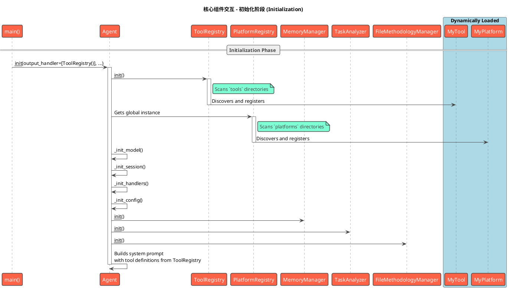
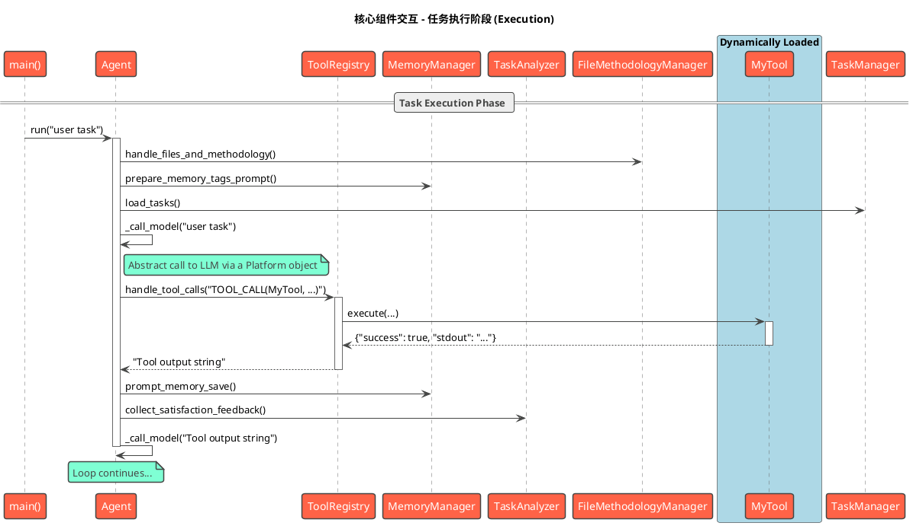

# 3. 核心概念与系统架构

本章将深入探讨 Jarvis 的核心概念，并解释它们如何组合成一个有机的、可扩展的系统。我们将首先独立介绍每一个核心概念，然后通过架构图和工作流来展示它们如何协同工作。

## 3.1 核心概念

要深入了解并有效使用 Jarvis，理解其背后的几个核心概念至关重要。本节将介绍构成 Jarvis 系统的五大基石：**代理（Agent）**、**工具(Tool)**、**平台(Platform)**、**模型(Model)**和**方法论（Methodology）**。

### 3.1.1 代理 (Agent)

**代理(Agent)** 是 Jarvis 的"大脑"和执行中枢，一个高度灵活的**协调者和调度者**。它本身不包含复杂的业务逻辑，而是通过一个**主循环**来驱动整个工作流：获取能力、请求决策、委托执行、循环迭代。

Agent 的核心设计思想是**委托（Delegation）**。它将具体的执行逻辑（如工具调用）委托给不同的**输出处理器(Output Handler)**。这使得 Agent 的核心与具体能力完全解耦。例如，`ToolRegistry` 就是一个专门处理 `TOOL_CALL` 标签的输出处理器。

### 3.1.2 工具与工具注册表 (Tool & ToolRegistry)

**工具(Tool)** 是 Jarvis 的"双手"，是原子化的、功能单一的可执行单元。

**工具注册表(ToolRegistry)** 是所有工具的管理者。它负责发现、加载和执行工具，并通过三种独立的机制来集成它们：
1.  **内置工具**: 加载项目自带的原生Python工具。
2.  **外部Python工具**: 加载用户在指定目录（如 `~/.jarvis/tools`）下创建的Python工具。
3.  **MCP工具**: 通过模型通信协议（MCP）与外部独立进程通信，以接入该进程提供的工具，这是实现高级扩展的关键技术。

### 3.1.3 平台与平台注册表 (Platform & PlatformRegistry)

**平台(Platform)** 是 Jarvis 与大语言模型（LLM）之间的**桥梁和适配器**。它负责对接不同的 LLM 服务提供商（例如 OpenAI、Kimi、腾讯元宝等），将 Agent 的请求转换为特定服务商的 API 调用，并将响应结果返回给 Agent。在 Jarvis 中，平台被抽象为一个统一的**接口**，屏蔽了不同 LLM 服务商 API 的差异。

**平台注册表(PlatformRegistry)** 负责加载所有可用的平台实现。它通过扫描目录中的 `.py` 文件来加载**原生Python平台**，确保 Agent 能以一致的方式与不同的 LLM 服务商交互。

### 3.1.4 模型 (Model)

**模型(Model)** 是指由**平台**提供的、执行具体思考和文本生成任务的**语言模型引擎**，例如 `gpt-4o`, `moonshot-v1-8k` 等。模型是 Jarvis 智能的核心来源。

平台和模型是**提供者**与**产品**的关系。Jarvis 的设计将两者清晰地分开，允许用户通过配置文件在同一平台下轻松切换不同的模型。

### 3.1.5 方法论与中心方法论库

**方法论 (Methodology)** 是 Jarvis 实现"智能进化"的核心机制。它是一套结构化的、用于指导代理解决问题的"思维框架"或"最佳实践"。它定义了代理在面对任务时应该"如何思考"，从而影响它发送给 LLM 的 Prompt 内容，以产生更优的决策。

**中心方法论库 (Central Methodology Repository)** 是一个基于 Git 的共享知识库。它允许用户和团队将个人沉淀的有效方法论分享到一个中心化的 Git 仓库中。通过简单的 `git pull/push`，团队成员之间可以轻松同步和分发这些宝贵的经验，加速整个团队解决问题的能力。这一设计不仅促进了知识的复用，也构建了一个持续学习和演进的集体智慧网络。

### 3.1.6 记忆系统 (Memory System)

**记忆系统 (Memory System)** 是 Jarvis 实现"知识积累"和"经验复用"的重要机制。它为 Agent 提供了持久化存储和检索信息的能力，使得系统能够在不同的任务和会话之间共享和复用知识。

记忆系统包含三种类型的记忆：

1. **短期记忆 (Short-term Memory)**: 存储在内存中的临时信息，主要用于当前任务的上下文保持。这些记忆在任务结束后会被清除。

2. **项目长期记忆 (Project Long-term Memory)**: 与特定项目相关的持久化信息，存储在项目目录的 `.jarvis/memory` 下。这些记忆包含了项目特定的知识、配置和经验。

3. **全局长期记忆 (Global Long-term Memory)**: 跨项目的通用信息，存储在用户数据目录的 `memory/global_long_term` 下。包括用户偏好、通用知识、最佳实践等。

记忆系统通过三个核心工具实现：
- **save_memory**: 保存信息到指定类型的记忆存储
- **retrieve_memory**: 根据标签或类型检索相关记忆
- **clear_memory**: 清理指定的记忆内容

每条记忆都包含唯一ID、标签列表、内容和时间戳，支持灵活的标签化检索。这种设计使得 Agent 能够快速定位和复用相关知识，提高任务执行的效率和准确性。

## 3.2 系统架构

本节在"核心概念"的基础上，深入探讨这些概念如何组合成一个有机的、可扩展的系统。

### 3.2.1 架构关系图

下图清晰地展示了 Jarvis 各核心组件之间的静态关系和依赖。

### 3.2.2 核心架构原则

Jarvis 的架构遵循以下几个核心设计原则：

1.  **代理作为协调中心 (Agent-Centric Coordination)**: 系统的核心是 **Agent**，但它是一个轻量级的**协调者**，其主要职责是驱动主循环，并将具体的任务委托给专门的处理器。

2.  **通过注册表实现解耦 (Decoupling via Registries)**: **ToolRegistry** 和 **PlatformRegistry** 是实现系统可插拔性的关键。Agent 不直接与任何具体的工具或平台耦合，它只与注册表交互。

3.  **基于委托的执行模式 (Delegation-Based Execution)**: Agent 接收到来自 LLM 的响应后，不会自己去解析，而是将响应传递给一个**输出处理器**列表。这种**委托机制**将"决策"与"执行"完全分离。

4.  **将 LLM 作为可插拔的推理引擎 (LLM as a Pluggable Reasoning Engine)**: **Platform** 作为 Agent 与 LLM 之间的适配层，将不同 LLM 服务商的 API 差异完全封装起来。这使得 Agent 可以用统一的方式向任何 LLM "提问"（发送Prompt）并获得"回答"（决策文本），而无需关心底层是哪个服务商的模型。

5.  **分层的记忆管理 (Hierarchical Memory Management)**: **记忆系统**采用三层架构（短期、项目长期、全局长期），通过标签化管理实现灵活的知识组织。记忆的存储和检索通过统一的工具接口实现，确保了系统的可扩展性和易用性。

### 3.2.3 端到端工作流：一次工具调用的生命周期

下面的流程描述了上述架构原则在一次典型的工具调用中是如何协同工作的：

1.  **任务分派**: 用户通过 **CLI** 启动一个任务，CLI 将其分派给一个配置好的 **Agent**。

2.  **决策请求**: `Agent` 的主循环启动。它向 `ToolRegistry` 请求所有可用工具的描述，然后将用户任务和这份工具清单组合成一个 Prompt，通过 `PlatformRegistry` 获取的**平台**，发送给**模型**(LLM)，请求下一步的行动决策。

3.  **决策返回**: **模型**(LLM) 思考后，决定调用 `read_code` 工具，并返回一个包含 `TOOL_CALL` 指令的文本。

4.  **委托执行**: `Agent` 接收到这段文本，并将其**委托**给能识别 `TOOL_CALL` 标签的 `ToolRegistry` 进行处理。

5.  **工具执行**: `ToolRegistry` 解析出工具名称和参数，调用 `read_code` 工具的 `execute` 方法，并返回其执行结果。

6.  **结果反馈与循环**: `ToolRegistry` 将工具的执行结果返回给 `Agent`。`Agent` 将这个结果作为新的上下文，再次进入第2步，开始一个新的"思考-决策-委托"循环，直到任务最终完成。

## 3.3 核心组件详解

### 3.3.1 Jarvis Agent

`Jarvis Agent` 是系统的指挥中心，负责协调所有操作。它位于 `src/jarvis/jarvis_agent` 模块中，其核心是 `Agent` 类。

#### 主要职责

- **任务理解与规划**: Agent 接收用户输入，并与大型语言模型（LLM）协作，将高级任务分解为一系列具体的、可执行的步骤。
- **工具调用**: 根据规划，Agent 动态选择并调用合适的工具来执行每个步骤。它是模型与工具集之间的桥梁。
- **状态管理**: Agent 维护着整个任务的上下文，包括对话历史、工具执行结果以及任何中间产物。当对话历史过长时，它会自动进行总结以管理上下文长度。
- **人机交互**: Agent 管理与用户的交互循环，接收指令，反馈结果，并根据用户干预调整执行路径。
- **记忆管理**: 通过 `MemoryManager` 管理短期、项目长期和全局长期记忆，实现知识的持久化和复用。
- **任务分析**: 通过 `TaskAnalyzer` 在任务完成后进行分析，提炼方法论和改进建议。
- **文件和方法论处理**: 通过 `FileMethodologyManager` 处理文件上传和方法论加载。

#### 初始化流程

Agent 的初始化过程是高度可配置的，包含以下关键步骤：

1. **模型初始化** (`_init_model`):
   - 根据 `llm_type` (normal/thinking) 和 `model_group` 确定平台和模型
   - 通过 `PlatformRegistry` 创建平台实例
   - 设置模型名称和模型组

2. **会话初始化** (`_init_session`):
   - 创建 `SessionManager` 实例
   - 管理对话历史、用户数据和附加提示

3. **处理器初始化** (`_init_handlers`):
   - 设置输出处理器 (如 `ToolRegistry`)
   - 设置输入处理器 (如 `shell_input_handler`, `builtin_input_handler`)
   - 设置多行输入处理器

4. **配置初始化** (`_init_config`):
   - 设置方法论使用标志 (`use_methodology`)
   - 设置任务分析标志 (`use_analysis`)
   - 设置工具执行确认标志 (`execute_tool_confirm`)
   - 设置记忆强制保存标志 (`force_save_memory`)
   - 设置最大token数 (`max_token_count`)

5. **管理器初始化**:
   - 创建 `MemoryManager` 实例
   - 创建 `TaskAnalyzer` 实例
   - 创建 `FileMethodologyManager` 实例

#### 主运行循环 (`_main_loop`)

`_main_loop` 方法是 Agent 的主执行引擎。其工作流程如下：

1. **首次运行处理**:
   - 通过 `FileMethodologyManager` 处理文件上传和方法论加载
   - 准备记忆标签提示
   - 加载预定义任务 (通过 `TaskManager`)

2. **模型调用** (`_call_model`):
   - 处理输入处理器链
   - 管理对话长度，必要时进行总结
   - 调用模型并获取响应

3. **工具执行** (`_call_tools`):
   - 通过 `execute_tool_call` 执行工具
   - 处理工具执行结果
   - 执行工具调用后回调

4. **中断处理** (`_handle_run_interrupt`):
   - 处理用户中断请求
   - 获取用户补充信息
   - 决定是否继续工具调用

5. **任务完成处理** (`_complete_task`):
   - 收集满意度反馈
   - 进行任务分析 (如果启用)
   - 生成任务总结

6. **循环控制**:
   - 根据用户输入决定继续或完成任务

### 3.3.2 工具注册表 (Tool Registry) 详解

`ToolRegistry` (位于 `src/jarvis/jarvis_tools/registry.py`) 是 Jarvis 工具驱动架构的基石。它是一个动态的工具加载器和执行器，负责管理 Agent 可用的所有工具。

#### 动态工具加载

`ToolRegistry` 在初始化时会自动扫描并加载来自多个源的工具：

- **内置工具**: 位于 `src/jarvis/jarvis_tools/` 目录下的核心工具。
- **外部工具**: 用户可以在 `~/.jarvis/tools/` 目录下添加自定义的 Python 工具脚本。
- **MCP 工具**: 通过模型上下文协议（MCP）集成的外部应用或服务。这些工具通过 `~/.jarvis/mcp/` 或 `JARVIS_MCP` 环境变量中的 YAML 配置文件进行定义。

这种分层加载机制使得核心功能保持稳定，同时为用户提供了极大的灵活性来扩展 Jarvis 的能力。

#### 工具执行

当 Agent 决定使用一个工具时，`ToolRegistry` 会：
1. 解析模型生成的工具调用请求。
2. 查找已注册的同名工具。
3. 验证并传递参数。
4. 调用工具的 `execute` 方法。
5. 捕获并格式化 `stdout` 和 `stderr`，然后返回给 Agent。

### 3.3.3 平台注册表 (Platform Registry) 详解

`PlatformRegistry` (位于 `src/jarvis/jarvis_platform/registry.py`) 负责管理与不同大型语言模型（LLM）平台的交互。它使得 Jarvis 可以无缝切换和使用多个 AI 提供商。

#### 平台抽象

所有平台都必须继承自 `BasePlatform` 类，并实现一套标准接口，如 `chat`, `set_model_name`, `upload_files` 等。这种设计将特定平台的实现细节与 Agent 的核心逻辑解耦。

#### 动态平台加载

与 `ToolRegistry` 类似，`PlatformRegistry` 也会动态加载平台实现：

- **内置平台**: 位于 `src/jarvis/jarvis_platform/` 目录下的官方支持平台。
- **外部平台**: 用户可以在 `~/.jarvis/models/` 目录下添加自定义的平台适配器。

这使得社区可以方便地为 Jarvis 贡献对新 LLM 平台的支持。

### 3.3.4 记忆系统实现 (Memory System Implementation)

**记忆系统**由 `MemoryManager` 类实现，位于 `src/jarvis/jarvis_agent/memory_manager.py`。它提供了以下核心功能：

1. **记忆提示准备** (`prepare_memory_tags_prompt`):
   - 检查是否有 `save_memory` 工具
   - 格式化所有可用的记忆标签
   - 生成记忆提示文本

2. **自动记忆保存** (`prompt_memory_save`):
   - 让模型自动判断并保存值得记忆的信息
   - 处理记忆保存工具调用

3. **记忆提示集成** (`add_memory_prompts_to_addon`):
   - 在附加提示中添加记忆相关提示
   - 支持 `save_memory` 和 `retrieve_memory` 工具

记忆系统与 Agent 深度集成，在以下关键点发挥作用：
- 任务开始时：提供记忆标签提示
- 任务中断时：提示保存重要信息
- 任务完成时：自动分析并保存有价值的信息
- 上下文过长时：提示保存关键信息

### 3.3.5 任务分析方法论 (Task Analysis Methodology)

**任务分析**由 `TaskAnalyzer` 类实现，位于 `src/jarvis/jarvis_agent/task_analyzer.py`。它提供了以下核心功能：

1. **任务分析** (`analysis_task`):
   - 准备分析提示 (基于 `TASK_ANALYSIS_PROMPT`)
   - 处理分析循环
   - 执行工具调用 (如方法论保存)

2. **满意度反馈收集** (`collect_satisfaction_feedback`):
   - 收集用户对任务完成的满意度
   - 记录用户反馈

3. **分析循环处理** (`_process_analysis_loop`):
   - 调用模型进行分析
   - 处理工具调用
   - 管理分析状态

任务分析在以下场景触发：
- 任务完成时 (如果启用 `use_analysis`)
- 用户明确请求分析时

### 3.3.6 文件和方法论管理 (File & Methodology Management)

**文件和方法论管理**由 `FileMethodologyManager` 类实现，位于 `src/jarvis/jarvis_agent/file_methodology_manager.py`。它提供了以下核心功能：

1. **文件和方法论处理** (`handle_files_and_methodology`):
   - 根据平台能力选择处理模式
   - 支持文件上传模式 (`_handle_file_upload_mode`)
   - 支持本地模式 (`_handle_local_mode`)

2. **方法论上传** (`_handle_methodology_upload`):
   - 上传方法论文件
   - 处理上传失败回退

3. **本地方法论加载** (`_load_local_methodology`):
   - 加载本地方法论
   - 集成记忆标签提示

4. **历史处理** (`handle_history_with_file_upload`):
   - 使用临时文件上传历史对话
   - 管理上下文长度

### 3.3.7 执行流程时序图

下面的时序图展示了核心组件在**初始化**和**任务执行**两个阶段中的交互流程：

#### 初始化阶段 (Initialization Phase)

#### 任务执行阶段 (Task Execution Phase)

