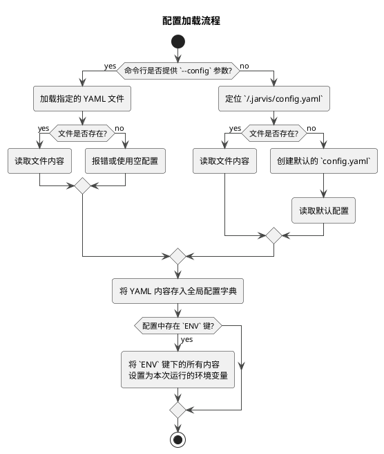
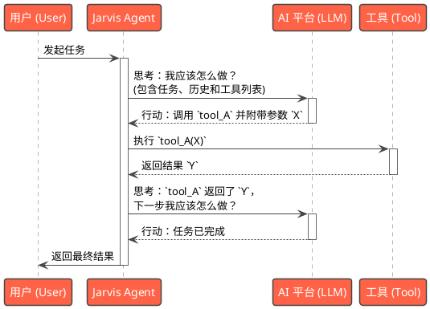
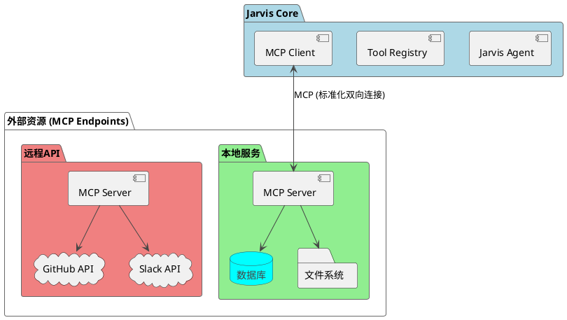
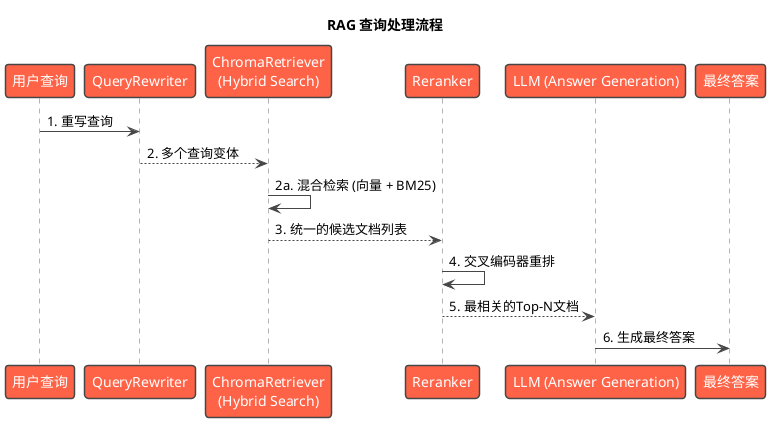
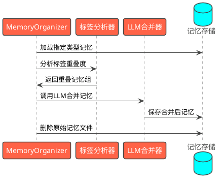
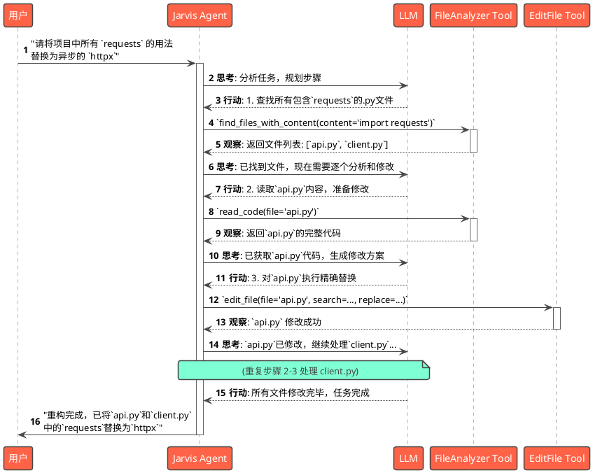

# 6. 高级主题
本章面向希望深度定制和挖掘 Jarvis 潜力的用户，将介绍一些高级配置和功能。
## 6.1 LLM与RAG组配置
在不同的任务场景下，您可能希望使用不同的AI模型组合。例如，使用一个强大的模型进行复杂的代码生成（“思考”模型），同时使用一个快速、经济的模型处理常规对话（“普通”模型）。**LLM组**功能就是为此设计的。
### 配置方法
在您的全局配置文件 `~/.jarvis/config.yaml` 中，您可以定义 `JARVIS_LLM_GROUPS` 列表，并用 `JARVIS_LLM_GROUP` 来选择当前激活的组。
```yaml
# 1. 定义可用的LLM组
JARVIS_LLM_GROUPS:
  # LLM组一：使用强大的模型组合
  - power_group:
      JARVIS_PLATFORM: "kimi"
      JARVIS_MODEL: "moonshot-v1-128k"

      JARVIS_MAX_INPUT_TOKEN_COUNT: 1280

  # LLM组二：使用快速经济的模型组合
  - speed_group:
      JARVIS_PLATFORM: "ollama"
      JARVIS_MODEL: "llama3"
      # 如果不指定思考模型, 将自动使用常规模型

# 2. 选择要激活的LLM组
JARVIS_LLM_GROUP: power_group
```
### LLM组配置优先级
Jarvis 按以下顺序（从高到低）应用模型配置：
1.  **命令行参数**: 直接传递的参数，会覆盖所有其他设置。
2.  **LLM组配置**: 由 `JARVIS_LLM_GROUP` 选中的配置。
3.  **代码默认值**: 如果以上均未配置，则使用系统内置的默认模型。

---

### RAG 组配置

与模型组类似，Jarvis 也支持对 RAG (检索增强生成) 功能进行分组配置。这在需要针对不同类型的知识库（例如，代码库 vs. 中文文档）使用不同嵌入和重排策略时非常有用。

#### 配置方法

在 `~/.jarvis/config.yaml` 中，您可以定义 `JARVIS_RAG_GROUPS` 列表，并用 `JARVIS_RAG_GROUP` 来选择当前激活的组。

```yaml
# 1. 定义可用的 RAG 配置组
JARVIS_RAG_GROUPS:
  # 默认的文本RAG组
  - text: # "text" 是组名
      embedding_model: BAAI/bge-m3
      rerank_model: BAAI/bge-reranker-v2-m3
      use_bm25: true
      use_rerank: true
  # 默认的代码RAG组
  - code: # "code" 是组名
      embedding_model: Qodo/Qodo-Embed-1-1.5B
      use_bm25: false
      use_rerank: false

# 2. 选择要激活的 RAG 组
JARVIS_RAG_GROUP: code_search
```

#### RAG 配置优先级

RAG 配置的加载顺序与模型组类似：
1.  **顶层 `JARVIS_RAG` 配置**: 在 `JARVIS_RAG` 键下直接设置的 `embedding_model`, `use_bm25` 等，优先级最高，会覆盖所有组配置。
2.  **RAG 组配置**: 由 `JARVIS_RAG_GROUP` 选中的配置。
3.  **代码默认值**: 如果以上均未配置，则使用系统内置的默认 RAG 设置。

---

## 6.2 快捷指令

为了提升交互效率，Jarvis 支持两种快捷指令机制：**元命令**和**输入替换映射**。它们都在输入被发送给 AI 模型之前由 `input_handler` 处理。

### 元命令 (Meta-Commands)

元命令是硬编码在 `builtin_input_handler` 中的特殊指令，用于执行系统级操作，通常会中断正常的AI交互流程。

**使用格式**: 在交互界面输入 `'<命令名>'`，例如 `'<Clear>'`。

| 元命令             | 功能描述                               |
| ------------------ | -------------------------------------- |
| `'<Summary>'`      | 让AI总结当前会话内容，并清空历史记录。 |
| `'<Clear>'`        | 强制清空当前会话，开始一个全新的对话。 |
| `'<ToolUsage>'`    | 显示所有已加载的可用工具及其使用方法。 |
| `'<ReloadConfig>'` | 重新加载 `~/.jarvis/config.yaml` 文件。 |
| `'<SaveSession>'`  | 保存当前会话状态到文件并立即退出程序。 |

### 输入替换映射 (Replace Map)

这种机制允许您定义一些短标签，当输入这些标签时，系统会自动将其替换为更长的、预设好的模板字符串，然后再交给AI处理。这非常适合固化一些常用的高频指令。

**使用格式**: 在交互界面输入 `'<标签名>'`，例如 `'<Web>'`。

#### 内置替换指令

| 标签                 | 功能描述                                               |
| -------------------- | ------------------------------------------------------ |
| `'<Web>'`            | 触发网页搜索，并提示AI使用 `search_web` 工具。         |
| `'<FindRelatedFiles>'` | 指示AI在当前目录查找与后续描述相关的文件。           |
| `'<Dev>'`            | 指示AI调用 `create_code_agent` 来处理一个开发需求。      |
| `'<Fix>'`            | 指示AI修复后续描述中提到的问题。                       |
| `'<Check>'`          | 指示AI使用静态分析工具检查代码。                       |

#### 自定义替换指令

您可以在配置文件 `~/.jarvis/config.yaml` 中通过 `JARVIS_REPLACE_MAP` 定义自己的快捷指令。

```yaml
# ~/.jarvis/config.yaml
JARVIS_REPLACE_MAP:
  my_check: # 定义一个名为 'my_check' 的快捷指令
    template: "请使用pylint对src目录下的所有python文件进行代码质量检查，并报告问题"
    description: "运行自定义的pylint检查"
    append: false # false表示替换用户输入, true表示追加到用户输入
```

配置后，当您在 `jvs` 中输入 `'<my_check>'` 时，它会被自动替换为 `template` 中的长指令。

---

## 6.3 自定义代理 (`jarvis-agent` / `ja`)

虽然 `jvs` (Jarvis) 和 `jca` (Code Agent) 等预置代理能满足大部分需求，但有时您可能需要一个具有特定“人设”、特定工具集和特定行为模式的代理。`jarvis-agent` (`ja`) 就是用于创建和运行这种高度自定义代理的工具。

### 代理定义文件

自定义代理的核心是一个 YAML 格式的定义文件。

```yaml
# my_db_admin_agent.yaml

# 代理的名称
name: "数据库管理员"

# 系统提示词，定义了代理的身份和行为准则
system_prompt: |
  你是一个专业的数据库管理员(DBA)。
  你的职责是帮助用户管理数据库。
  你只能使用提供的 `sql_query` 和 `db_schema` 工具。
  在执行任何写操作（INSERT, UPDATE, DELETE）之前，必须向用户请求确认。

# 限定此代理可用的工具列表 (可选)
# 如果不指定, 代理将可以使用所有已加载的工具
use_tools:
  - "sql_query"
  - "db_schema"

# 任务结束后是否需要生成总结
need_summary: true

# (可选) 在关键节点是否强制提示用户保存记忆。
# 默认行为由全局配置 `JARVIS_FORCE_SAVE_MEMORY` (默认为 true) 控制。
# 您可以在这里覆盖该设置：
#   - true: 在对话历史过长或任务完成时，会自动触发记忆保存提示。
#   - false: 不会自动提示，适用于不需要频繁保存记忆或希望手动控制的场景。
force_save_memory: false # 示例：此代理将不会自动提示保存记忆
```

### 使用方法

您可以使用 `-c` 或 `--agent-definition` 参数来加载您的代理定义文件。

```bash
# 使用自定义的DBA代理，并分配一个初始任务
ja -c my_db_admin_agent.yaml -t "查询 users 表中有多少条记录"
```

通过这种方式，您可以创建出各种各样专注于特定领域的专家代理，如“文档撰写专家”、“k8s运维专家”或“安全分析专家”，极大地扩展了 Jarvis 的应用场景。

---

## 6.4 多代理协作系统 (`jma`)

除了单个的自定义代理，Jarvis 还提供了一个更强大的范式：**多代理协作系统**。您可以定义一个由多个具有不同角色和能力的 `Agent` 组成的团队，让它们通过对话和协作来共同完成一个复杂的任务。

### 核心机制

-   **团队定义**: 您在一个 YAML 文件中定义整个团队，包括每个代理的角色、能力（可使用的工具）和系统提示。
-   **主代理 (Entry Point)**: 您需要指定一个“主代理”（通常是项目经理或协调者角色），它将首先接收用户的初始任务。
-   **基于消息的通信**: 代理之间不直接调用彼此。它们通过生成一个特殊的 `<SEND_MESSAGE>` 输出来进行通信。
-   **协调器**: 一个名为 `MultiAgent` 的隐形协调器负责拦截这些消息，并将其路由给目标代理，从而驱动整个团队的协作流程。

### 定义多代理系统 (YAML 文件)

多代理系统的核心是一个定义文件，它包含两个顶级键：`main_agent` 和 `agents` 列表。

下面是一个“软件开发团队”的示例 `dev_team.yaml`：

```yaml
# dev_team.yaml

# 1. 指定团队的入口 Agent
main_agent: "项目经理"

# 2. 定义团队中的所有 Agent
agents:
  - name: "项目经理"
    system_prompt: |
      你是一个项目经理，负责理解和拆解用户需求。
      你的任务是：
      1. 将用户需求分解为程序员和测试工程师可以执行的具体任务。
      2. 将任务分配给“程序员”。
      3. 接收程序员的完成报告，并将其转交给“测试工程师”进行测试。
      4. 收集测试结果，并向用户报告最终结果。
      你不能编写或测试代码，只能与其他代理沟通。
    use_tools: [] # 项目经理通常不需要直接使用工具

  - name: "程序员"
    system_prompt: |
      你是一名程序员。你会接收来自“项目经理”的任务。
      你的任务是：
      1. 根据任务需求编写代码。
      2. 使用你可用的工具（如 write_file, execute_script）来完成编码。
      3. 完成后，向“项目经理”报告你已完成任务，并提供代码路径或相关产出。
      你只与“项目经理”沟通。
    use_tools:
      - "write_file"
      - "execute_script"
      - "read_code"

  - name: "测试工程师"
    system_prompt: |
      你是一名测试工程师。你会接收来自“项目经理”的测试任务。
      你的任务是：
      1. 根据任务和代码，编写测试脚本。
      2. 执行测试并记录结果。
      3. 向“项目经理”报告详细的测试结果（成功或失败，以及失败原因）。
      你只与“项目经理”沟通。
    use_tools:
      - "execute_script"
      - "read_code"
```

### 使用方法

使用 `jma` (Jarvis Multi-Agent) 命令和 `-c` 参数来启动您的多代理团队。

```bash
# 启动 "dev_team" 并给出一个初始任务
jma -c dev_team.yaml -i "请用python写一个快速排序算法，并进行测试"
```

当命令执行后：
1.  用户输入 "请用python写一个快速排序算法..." 会首先被发送给 **项目经理**。
2.  **项目经理** 会分析需求，然后向 **程序员** 发送一条消息，如：“请编写一个快速排序的Python实现”。
3.  **程序员** 接收到消息，编写代码，然后向 **项目经理** 回复：“代码已完成，位于 quick_sort.py”。
4.  **项目经理** 接收到回复，再向 **测试工程师** 发送消息：“请测试 quick_sort.py 的功能和正确性”。
5.  **测试工程师** 执行测试，并将结果（如 “测试通过”）报告给 **项目经理**。
6.  最后，**项目经理** 总结所有工作，并向用户报告最终结果。

通过这种方式，您可以构建出高度结构化和专业化的自动化工作流，以解决远超单个 Agent 能力范围的复杂问题。

---

## 6.5 聊天角色预设 (`jpm role`)

与 `ja` (自定义代理) 和 `jma` (多代理系统) 专注于执行复杂任务不同，有时您可能只是想快速与一个具有特定“人设”和知识领域的 AI 进行纯粹的对话。`jpm role` 功能就是为此设计的。

它允许您预先定义一组“聊天角色”，每个角色绑定了特定的模型和系统提示词，从而可以一键“扮演”不同领域的专家进行对话。

### 角色定义文件 (`roles.yaml`)

您需要在 `~/.jarvis/` 目录下创建一个 `roles.yaml` 文件（或通过 `jpm role -c` 指定其他路径），并在其中定义您的角色列表。

文件结构如下：

```yaml
# ~/.jarvis/roles.yaml

roles:
  - name: "Python 资深开发者"
    description: "专注于Python编程、代码优化和架构设计的专家。"
    platform: "deepseek"
    model: "deepseek-coder"
    system_prompt: |
      你是一位拥有20年经验的Python资深开发者和架构师。
      你能解答关于Python的任何问题，从基础语法到高级并发编程、异步IO、元类以及性能调优。
      你的回答应该精准、深入，并附带高质量的代码示例。

  - name: "英语翻译与润色专家"
    description: "精通中英互译，擅长提供地道、专业的翻译和润色建议。"
    platform: "kimi"
    model: "moonshot-v1-128k"
    system_prompt: |
      You are a professional English-Chinese translator and editor.
      Your task is to provide accurate, natural, and context-aware translations.
      When asked to polish text, you should explain your changes and offer alternative phrasings.

  - name: "Golang 并发编程大师"
    description: "深入理解Go语言的并发模型和底层原理。"
    platform: "ollama"
    model: "gemma2"
    system_prompt: |
      你是一位Golang并发编程大师。你对goroutine、channel、select以及sync包了如指掌。
      你的任务是帮助用户理解和解决复杂的Go并发问题，并提供健壮、高效的并发代码范例。
```

### 使用方法

1.  **启动角色选择**: 直接运行 `jpm role` 命令。

    ```bash
    jpm role
    ```

2.  **选择角色**: 程序会列出 `roles.yaml` 中定义的所有角色，您可以输入编号进行选择。

    ```
    可用角色
    1. Python 资深开发者 - 专注于Python编程、代码优化和架构设计的专家。
    2. 英语翻译与润色专家 - 精通中英互译，擅长提供地道、专业的翻译和润色建议。
    3. Golang 并发编程大师 - 深入理解Go语言的并发模型和底层原理。

    请选择角色(输入编号): 1
    ```

3.  **开始对话**: 选择后，Jarvis会加载该角色的模型和系统提示词，然后您就可以直接开始与这位“专家”对话了。

`jpm role` 是一个轻量级但非常实用的功能，它让您无需每次都手动设置系统提示和模型，就能在不同的专家角色之间轻松切换。

---

## 6.6 方法论共享与扩展

除了即时定义的任务和代理，Jarvis 还支持一个更高级的概念：**方法论 (Methodology)**。方法论是一种可复用的、结构化的高级问题解决方案，它可以被沉淀下来、共享给团队，并在合适的场景下被 AI 自动调用，从而极大地提升了解决特定类型问题的效率和质量。

### 什么是方法论？

简单来说，方法论是一个针对特定“问题类型”的“操作手册”或“最佳实践指南”。当用户输入的需求与某个方法论的“问题类型”匹配时，AI 就会优先参考这个指南来规划其行动步骤。

### 方法论的格式

方法论以简单的 JSON 文件形式存在，每个文件定义一个方法论。

**核心字段**:
- `problem_type`: (字符串) 对该方法论所解决的问题类型的简明描述。这是 AI 用来匹配用户需求的关键。
- `content`: (字符串) 方法论的具体内容，即详细的步骤、原则和建议。

**示例: `code_review_methodology.json`**
```json
{
  "problem_type": "代码审查与重构",
  "content": "在进行代码审查或重构时，请遵循以下步骤：\n1. **理解业务背景**: 首先，使用 read_code 和与用户的对话来充分理解相关代码的业务逻辑和目标。\n2. **静态分析**: 运行静态代码分析工具（如 pylint, go vet）来发现潜在的低级错误和不规范的写法。\n3. **可读性优先**: 检查代码的可读性，包括命名是否清晰、注释是否充分、函数和类的职责是否单一。\n4. **识别坏味道**: 寻找常见的代码坏味道，例如超长函数、重复代码、过深的嵌套等。\n5. **提出具体建议**: 不要只说“代码需要优化”，而是要提出具体的、可执行的修改建议，并解释为什么这样修改会更好。\n6. **小步提交**: 如果进行重构，建议将大的改动分解为一系列小步的、独立的修改，并为每一步生成清晰的提交信息。"
}
```

### 加载与共享

Jarvis 会从以下位置自动加载所有 `.json` 格式的方法论文件：

1.  **用户方法论目录**: `~/.jarvis/methodologies/` (推荐存放您个人方法论的地方)
2.  **外部方法论目录**: 由 `JARVIS_METHODOLOGY_DIRS` 配置指定的目录列表。

**通过 Git 共享方法论**:

`JARVIS_METHODOLOGY_DIRS` 的设计初衷就是为了方便团队协作和知识共享。您可以：

1.  创建一个 Git 仓库，专门用于存放团队的最佳实践和方法论 (`.json` 文件)。
2.  团队成员将此仓库克隆到本地。
3.  设置配置 `JARVIS_METHODOLOGY_DIRS` 指向该仓库的本地路径。

```bash
# 例如，将团队的方法论仓库克隆到 ~/git/team-methodologies
git clone https://github.com/your-org/team-methodologies.git ~/git/team-methodologies

# 在 ~/.jarvis/config.yaml 中设置
JARVIS_METHODOLOGY_DIRS: "~/git/team-methodologies"
```

配置完成后，Jarvis 启动时会自动从该 Git 仓库加载所有方法论。更棒的是，Jarvis 内置了**每日自动更新**机制，会自动拉取最新的方法论，确保整个团队的知识库保持同步。

通过这种方式，您可以将团队的智慧结晶沉淀为可执行的“数字资产”，让 AI 助手能够持续学习和成长，成为团队中越来越得力的专家。

---


## 6.7 中心方法论库

除了本地和团队共享的方法论目录，Jarvis 还支持**中心方法论库**的概念。这是一个集中式的、由社区或组织维护的方法论仓库，可以作为最佳实践的权威来源。

### 配置中心方法论库

通过设置 `JARVIS_CENTRAL_METHODOLOGY_REPO` 配置指定 Git 仓库地址：

```yaml
# ~/.jarvis/config.yaml
JARVIS_CENTRAL_METHODOLOGY_REPO: "https://github.com/your-org/jarvis-methodologies.git"
```

### 工作机制

1. **自动克隆**: 首次运行时，Jarvis 会自动将中心方法论库克隆到本地（`~/.jarvis/central_methodology_repo/`）
2. **每日更新**: Jarvis 内置了自动更新机制，每天首次启动时会自动拉取最新的方法论
3. **优先级最高**: 中心方法论库的优先级高于本地和团队方法论，确保使用最新的最佳实践

### 分享方法论到中心库

如果您开发了优秀的方法论，可以通过以下命令分享到中心库：

```bash
# 分享本地方法论到中心库
jvs --share-methodology
```

该命令会：
1. 列出所有本地的方法论文件
2. 允许您选择要分享的方法论
3. 自动检测重复内容，避免冗余
4. 将选中的方法论复制到中心库并推送

### 使用场景

- **组织标准化**: 大型组织可以维护统一的方法论库，确保所有团队遵循相同的最佳实践
- **社区协作**: 开源社区可以共同维护和改进方法论，形成集体智慧
- **知识传承**: 将专家经验固化为方法论，新成员可以快速学习和应用

---

## 6.8 中心工具库

与中心方法论库类似，Jarvis 也支持**中心工具库**，允许团队或社区共享自定义工具，扩展 Jarvis 的能力边界。

### 配置中心工具库

通过设置 `JARVIS_CENTRAL_TOOL_REPO` 配置指定：

```yaml
# ~/.jarvis/config.yaml
JARVIS_CENTRAL_TOOL_REPO: "https://github.com/your-org/jarvis-tools.git"
```

### 工作机制

1. **自动克隆**: 配置后，Jarvis 会自动将中心工具库克隆到本地（`~/.jarvis/central_tool_repo/`）
2. **每日更新**: 与方法论库一样，工具库也会每日自动更新
3. **工具加载顺序**:
   - 内置工具（最低优先级）
   - 本地工具（`~/.jarvis/tools/`）
   - 外部配置目录的工具
   - 中心工具库（最高优先级）
4. **覆盖机制**: 同名工具会被后加载的版本覆盖，中心库的工具具有最高优先级

### 分享工具到中心库

您可以将本地开发的工具分享到中心库：

```bash
# 分享本地工具到中心库
jvs --share-tool
```

**注意事项**：
- 工具分享使用**移动**而非复制，原文件会被删除
- 只能分享数据目录下 `tools/` 目录中的工具
- 系统会自动检测并排除已存在的工具

### 工具开发规范

中心工具库中的工具应遵循以下规范：

1. **清晰的文档**: 每个工具都应包含详细的功能描述和参数说明
2. **错误处理**: 妥善处理各种异常情况，提供有意义的错误信息
3. **依赖管理**: 明确声明外部依赖，避免运行时错误
4. **命名规范**: 使用描述性的工具名称，避免与现有工具冲突

### 使用场景

- **领域专用工具**: 为特定领域（如数据库管理、云服务操作）开发专用工具集
- **企业内部工具**: 集成企业内部系统和API，扩展Jarvis的企业应用能力
- **效率工具**: 将常用的复杂操作封装为简单工具，提升团队效率
- **标准化操作**: 确保团队使用统一的工具版本和实现

### 最佳实践

1. **版本控制**: 使用Git标签管理工具版本，便于回滚和追踪
2. **测试覆盖**: 为工具编写单元测试，确保稳定性
3. **向后兼容**: 更新工具时保持API兼容，避免破坏现有使用
4. **安全审查**: 定期审查工具代码，确保没有安全隐患

---
## 6.9 工具组配置

在不同的任务场景下，您可能需要启用或禁用特定的工具集。例如，在处理敏感数据时禁用网络相关工具，或在特定项目中只使用某些专用工具。**工具组（Tool Group）**功能允许您预定义不同的工具配置集，并在需要时快速切换。

### 配置方法

在您的全局配置文件 `~/.jarvis/config.yaml` 中，您可以定义 `JARVIS_TOOL_GROUPS` 列表，并用 `JARVIS_TOOL_GROUP` 来选择当前激活的组。

```yaml
# 1. 定义可用的工具组
JARVIS_TOOL_GROUPS:
  # 工具组一：仅使用本地开发工具
  - local_dev:
      use:
        - execute_script
        - read_code
        - rewrite_file
        - save_memory
        - retrieve_memory
      dont_use:
        - search_web  # 禁用网络搜索

  # 工具组二：数据分析工具集
  - data_analysis:
      use:
        - execute_script
        - read_code
        - search_web
      dont_use:
        - rewrite_file  # 禁止修改文件
        - save_memory   # 禁止保存记忆

  # 工具组三：安全模式（最小工具集）
  - safe_mode:
      use:
        - read_code
        - ask_user
      dont_use: []  # 其他所有工具都将被禁用

# 2. 选择要激活的工具组
JARVIS_TOOL_GROUP: local_dev
```

### 工具组配置说明

每个工具组可以包含两个配置项：

- **`use`**: 明确指定要启用的工具列表。如果指定了此列表，只有列表中的工具会被加载。
- **`dont_use`**: 明确指定要禁用的工具列表。这些工具即使在 `use` 列表中也会被排除。

### 工具组配置优先级

工具组的配置按以下优先级生效：

1. **命令行参数**: 使用 `--tool-group` 参数指定的工具组
2. **配置**: `JARVIS_TOOL_GROUP` 配置
3. **配置文件**: 配置文件中的 `JARVIS_TOOL_GROUP` 设置
4. **默认行为**: 如果未指定工具组，则加载所有可用工具

### 使用示例

1. **通过命令行参数切换工具组**：
   ```bash
   # 使用安全模式工具组运行
   jvs --tool-group safe_mode -t "分析这个代码文件"

   # 使用数据分析工具组
   ja --tool-group data_analysis -t "搜索并分析最新的机器学习趋势"
   ```

2. **通过配置设置**：
   ```bash
   # 临时切换到安全模式
   JARVIS_TOOL_GROUP: safe_mode
   jvs
   ```

3. **动态切换工具组**：
   您也可以在运行时通过修改配置文件并使用 `'<ReloadConfig>'` 元命令来切换工具组。

### 实用场景

1. **开发环境隔离**: 为不同项目配置不同的工具集，避免误操作
2. **安全合规**: 在处理敏感数据时限制工具使用范围
3. **性能优化**: 减少不必要的工具加载，提升启动速度
4. **权限控制**: 为不同用户或场景提供不同级别的工具访问权限


## 6.10 工具调用后回调扩展（after_tool_call_cb）

为了在每次工具执行后插入自定义逻辑（如日志记录、统计、二次处理等），Jarvis 增强了 after_tool_call_cb 的能力：
- 支持多个回调：Agent.after_tool_call_cb 从单一回调升级为回调列表，依次执行
- 动态注册：可从配置的目录中扫描 .py 文件并按约定动态加载回调，无需改动核心代码

### 6.10.1 使用方式概览
- 代码注册：在运行时调用 set_after_tool_call_cb(cb) 注册回调（自动去重）
- 配置注册：在配置文件中指定 JARVIS_AFTER_TOOL_CALL_CB_DIRS，Agent 启动时自动扫描并注册

```yaml
# ~/.jarvis/config.yaml
JARVIS_AFTER_TOOL_CALL_CB_DIRS:
  - "~/jarvis_callbacks"
  - "$WORKSPACE/custom_cbs"
```

路径支持 ~ 展开与环境变量展开。

### 6.10.2 动态注册的约定
系统会扫描 JARVIS_AFTER_TOOL_CALL_CB_DIRS 指定目录下的所有 .py 文件（忽略 __init__.py），并按以下约定依次尝试注册：
1) 模块级可调用对象
- 名称：after_tool_call_cb
- 签名：(agent: Agent) -> None

2) 工厂函数 get_after_tool_call_cb()
- 返回单个回调或回调列表
- 签名：() -> Callable 或 List[Callable]

3) 工厂函数 register_after_tool_call_cb()
- 返回单个回调或回调列表
- 签名：() -> Callable 或 List[Callable]

注意：
- 为了避免污染 sys.path，导入过程仅临时插入文件所在目录，并在完成后移除
- 相同回调不会重复添加

### 6.10.3 执行时机与顺序
- 执行时机：每次工具调用完成后，在事件 AFTER_TOOL_CALL 广播前后，回调会被依次触发
- 执行顺序：按扫描顺序（目录与文件迭代顺序）以及模块中发现的先后顺序进行
- 失败隔离：单个回调异常不会中断主流程（异常被捕获并忽略）

### 6.10.4 代码示例
最简单的模块级回调（文件名例如 my_cb.py）：
```python
# my_cb.py
def after_tool_call_cb(agent):
    # 读取最后一次执行的工具名（ToolRegistry 会记录）
    last_tool = agent.get_user_data("__last_executed_tool__")
    from jarvis.jarvis_utils.output import PrettyOutput, OutputType
    PrettyOutput.print(f"工具执行完成: {last_tool}", OutputType.INFO)
```

使用工厂函数返回多个回调：
```python
# multi_cb.py
def _log_cb(agent):
    from jarvis.jarvis_utils.output import PrettyOutput, OutputType
    PrettyOutput.print("执行日志回调", OutputType.INFO)

def _metrics_cb(agent):
    # 自定义统计逻辑
    pass

def get_after_tool_call_cb():
    # 可以返回列表
    return [_log_cb, _metrics_cb]
```

或者手动注册（在自定义代码中）：
```python
# 在拿到 agent 实例后
def my_cb(agent):
    print("after tool call!")

agent.set_after_tool_call_cb(my_cb)
```

### 6.10.5 与现有事件系统的关系
- after_tool_call_cb 是一个轻量的钩子，适合注入本地逻辑
- 如果需要更通用的事件订阅，请优先考虑使用 EventBus（BEFORE_TOOL_CALL、AFTER_TOOL_CALL 等）

## 6.11 配置系统详解

Jarvis 的配置系统 (`src/jarvis/jarvis_utils/config.py`) 设计得非常直接，以保证配置来源的单一性和可预测性。

### 6.10.1 配置加载机制

Jarvis 在运行时只从**一个** YAML 文件加载所有配置。确定该文件的规则如下：

1. **命令行指定 (最高优先级)**: 用户可以在启动命令时通过 `--config <path/to/your_config.yaml>` 参数，显式指定本次运行所使用的配置文件。
2. **默认用户配置**: 如果没有通过命令行指定，系统会自动查找并加载位于用户主目录下的 `~/.jarvis/config.yaml` 文件。



所有从该文件加载的配置项都存储在一个全局字典中，并在程序运行时通过 `config.py` 中的 `get_*` 函数进行访问。这种设计避免了多层配置覆盖带来的复杂性和不确定性。

### 6.10.2 关键配置项参考

以下是 `config.yaml` 文件中支持的主要配置项及其说明：

| 配置项 (Key) | 描述 | 默认值 |
|---|---|---|
| `JARVIS_LLM_GROUP` | 当前激活的模型组名称。 | `null` |
| `JARVIS_LLM_GROUPS` | 预定义的模型配置组列表。 | `[]` |
| `JARVIS_PLATFORM` | 默认使用的 AI 平台名称。 | `yuanbao` |
| `JARVIS_MODEL` | 默认使用的模型名称。 | `deep_seek_v3` |

| `JARVIS_DATA_PATH` | 存储自定义工具、平台、方法论等数据的目录。 | `~/.jarvis` |
| `JARVIS_EXECUTE_TOOL_CONFIRM` | 在执行任何工具前是否需要用户二次确认。 | `false` |
| `JARVIS_CONFIRM_BEFORE_APPLY_PATCH` | 在应用代码补丁前是否需要用户二次确认。 | `false` |
| `JARVIS_USE_METHODOLOGY` | 是否启用方法论引擎（启动时加载、任务后分析）。 | `true` |
| `JARVIS_USE_ANALYSIS` | 任务结束后是否进行分析以提炼新工具或方法论。 | `true` |
| `JARVIS_METHODOLOGY_DIRS` | 额外的方法论加载目录列表。 | `[]` |
| `JARVIS_CENTRAL_METHODOLOGY_REPO` | 中心方法论Git仓库地址，用于团队共享方法论。 | `""` |
| `JARVIS_PRINT_PROMPT` | 是否在控制台打印发送给 LLM 的完整提示，用于调试。 | `false` |
| `JARVIS_MAX_INPUT_TOKEN_COUNT` | 单次输入给模型的最大 Token 数量。 | `32000` |
| `JARVIS_GIT_COMMIT_PROMPT` | `jgc` 命令生成 Git Commit Message 时使用的自定义模板。 | `""` |
| `JARVIS_REPLACE_MAP` | 定义在交互中使用的自定义快捷命令替换规则。 | `{}` |
| `JARVIS_MCP` | 一个列表，用于定义所有模型上下文协议（MCP）的端点配置。 | `[]` |
| `JARVIS_RAG_GROUP` | 当前激活的 RAG 配置组名称。 | `null` |
| `JARVIS_RAG_GROUPS` | 预定义的 RAG 配置组列表。 | 见默认配置 |
| `JARVIS_RAG` | RAG框架的顶层配置，会覆盖组配置。 | `{}` |
| `ENV` | 一个字典，用于为 Jarvis 运行环境设置临时的环境变量。 | `{}` |

### 6.10.3 补丁格式控制（JARVIS_PATCH_FORMAT）
为提升代码修改工具在不同模型能力下的稳定性与灵活性，Jarvis 支持通过 JARVIS_PATCH_FORMAT 配置补丁处理模式：

- all（默认）: 同时支持 SEARCH 与 SEARCH_START/SEARCH_END 两种模式。综合兼顾稳定与灵活，推荐大多数场景使用。
- search: 仅允许精确片段匹配（SEARCH）。该模式对模型要求更低，命中更确定，适合能力较弱的模型或需要严格控制改动范围的场景。
- search_range: 仅允许范围匹配（SEARCH_START/SEARCH_END）。该模式更灵活，适合能力较强的模型，可在代码块内部进行细粒度修改而无需整段完全匹配。

配置方式：
```yaml
# ~/.jarvis/config.yaml
JARVIS_PATCH_FORMAT: all   # 可选: all | search | search_range
```

交互式配置：
- 首次启动引导或使用内置的交互式配置流程时，系统会询问该选项并给出说明，便于按需选择。

注意：
- 该配置影响 edit_file/edit_file_handler 的补丁应用策略，请结合模型能力与项目风险偏好选择。

## 6.12 数据流与"思考-行动"循环

Jarvis 的核心是一个被称为"思考-行动"（Thought-Action）的循环，它驱动着整个任务执行过程。



1. **思考 (Thought)**: Agent 将当前任务、对话历史和可用工具列表打包成一个提示，发送给 LLM。
2. **行动 (Action)**: LLM 返回一个结构化的响应，其中包含要调用的工具名称和所需参数。
3. **观察 (Observation)**: Agent 解析响应，调用指定的工具，并捕获其输出。
4. **循环**: 工具的输出（观察结果）被添加到对话历史中，然后循环回到第一步，开始新的"思考"过程。

这个循环不断重复，直到 LLM 判断任务已经完成。

## 6.13 模型上下文协议 (MCP)：AI 应用的 USB-C

Jarvis 的极致扩展性，很大程度上得益于对**模型上下文协议（Model Context Protocol, MCP）** 的支持。MCP 是一个由 Anthropic 等公司倡导的开放协议，旨在标准化应用程序向大语言模型（LLM）提供上下文信息的方式。您可以将其形象地理解为 **"AI 应用的 USB-C 端口"**。

### 6.12.1
设计思想

正如 USB-C 提供了一个标准化的物理接口来连接各种外设，MCP 提供了一个标准化的软件接口，让 AI 模型可以安全、高效地连接到各种外部数据源和工具。无论是本地的文件系统、数据库，还是远程的 GitHub API、Slack 服务，都可以通过 MCP 这个"通用插座"为 Jarvis 提供能力，从而极大地简化了集成的复杂性。

### 6.12.2 架构图



### 6.12.3 核心优势

- **简化开发**: 开发者无需为每一种新工具或数据源编写定制的集成代码。只需让其服务遵循 MCP 规范，Jarvis 就能自动发现并使用它。
- **安全合规**: MCP 在设计上考虑了安全问题，为模型和外部工具之间的数据交换提供了一个安全可控的通道。
- **实时与双向**: 协议支持实时、双向的通信，使得 Jarvis 不仅能调用工具，还能订阅来自外部服务的事件和更新。
- **去中心化**: 推动了 AI 应用的标准化和去中心化，任何遵循协议的服务都可以成为生态系统的一部分。

### 6.12.4 工作流程

1. **服务发现**: Jarvis 启动时，`ToolRegistry` 会根据配置（`JARVIS_MCP`）连接到指定的 MCP 端点（Endpoint）。
2. **能力声明**: MCP 端点会根据协议，向 Jarvis 声明它能提供的所有能力（即"工具"），包括每个工具的名称、功能描述和参数模式（Schema）。
3. **动态注册**: `ToolRegistry` 接收这些声明，并将它们动态注册为 Jarvis 内部可用的工具。对于 `Agent` 而言，这些来自外部的工具与 Python 内置工具在使用上毫无差别。
4. **标准化调用**: 当 `Agent` 决定调用一个 MCP 工具时，`MCP Client` 会将请求按照协议规范打包，发送给对应的 MCP 端点。端点执行相应操作后，再将结果按规范格式返回。

通过拥抱 MCP，Jarvis 打破了自身能力的边界，使其能够轻松、安全地融入任何现有的 IT 环境，并利用无穷无尽的外部数据和服务来完成更复杂的任务。

## 6.14 RAG 实现方案：增强的检索与生成

为了在与项目代码、文档等本地知识库交互时提供更精准、更具上下文感知能力的回答，Jarvis 实现了一套先进的检索增强生成（Retrieval-Augmented Generation, RAG）管线。该管线位于 `src/jarvis/jarvis_rag/` 模块下，其设计目标是最大化召回率和精确率。

### 6.13.1 架构图



### 6.13.2 核心流程详解

1. **查询重写 (Query Rewriting)**:
   - **组件**: `QueryRewriter`
   - **目的**: 克服用户查询与文档语料库之间可能存在的"词汇鸿沟"。
   - **实现**: 当用户提出一个问题时，该问题首先被送入 `QueryRewriter`。它利用一个 LLM 将原始查询从不同角度改写成多个语义上相似但表述多样的查询变体。例如，将"如何用 aiohttp 上传文件？"改写为"aiohttp 文件上传示例"、"异步 HTTP POST 文件"等。这一步显著提高了找到相关文档的可能性。

2. **文档检索 (Document Retrieval)**:
   - **组件**: `ChromaRetriever`
   - **目的**: 实现高效的语义检索，获得高相关度的文档。
   - **实现**: `ChromaRetriever` 接收所有查询变体，并对每个变体执行**混合检索**：
     - **混合检索 (Hybrid Search)**: Jarvis 结合了两种互补的检索策略来最大化召回率：
       - **向量检索 (Dense Retrieval)**: 使用 `ChromaDB` 和强大的嵌入模型（如 BGE 系列）进行语义搜索。这种方式能够理解查询背后的深层意图，从而找到那些在内容上高度相关、但可能不包含完全相同关键词的文档。
       - **关键字检索 (Sparse Retrieval)**: 使用 `BM25` 算法，这是一种经典的、基于关键字匹配的统计方法。它非常擅长找到那些精确包含用户查询中特定术语或罕见词的文档。
     - **结果融合**: 两种检索方法的结果通过 **倒数排序融合 (Reciprocal Rank Fusion, RRF)** 算法进行智能合并。RRF 综合考虑了文档在两种不同排名列表中的位置，给出一个统一的相关性分数，从而选出最全面的候选文档集。

3. **重排 (Reranking)**:
   - **组件**: `Reranker`
   - **目的**: 在高召回率的基础上，进一步提升结果的精确率。
   - **实现**: 经过向量检索得到的候选文档列表，虽然相关性较高，但排序可能不是最优的。`Reranker` 使用一个更强大的、计算成本更高的 **交叉编码器 (Cross-Encoder)** 模型（如 `BAAI/bge-reranker-v2-m3`）。与在检索阶段独立编码查询和文档的双编码器不同，交叉编码器会同时处理"查询-文档"对，从而能更精确地判断文档与原始查询的真实相关性。它会对候选列表进行重新打分和排序，筛选出最相关的 Top-N 个文档。

4. **答案生成 (Answer Generation)**:
   - **组件**: `JarvisRAGPipeline` 与 `LLMInterface`
   - **目的**: 基于最相关的上下文生成高质量的答案。
   - **实现**: `JarvisRAGPipeline` 将经过重排后的最优文档作为上下文，连同用户的原始查询，构建成一个最终的提示（Prompt）。这个提示被发送给管线中配置的 `self.llm` 实例（默认为 `ToolAgent_LLM`，但可由用户在初始化时指定）。LLM 在被明确告知要参考所提供上下文的基础上，生成一个全面、准确且有据可查的答案。

通过这一套"查询重写 -> 混合检索 -> 精准重排 -> 答案生成"的链式流程，Jarvis 的 RAG 系统能够在复杂的代码库和技术文档中，为用户提供高质量的问答体验。

## 6.15 记忆整理机制与实现原理

在长期使用 Jarvis 过程中，系统会积累大量记忆，其中包含重复或高度相似的内容。为了优化存储效率并提升检索质量，Jarvis 提供了专门的记忆整理工具 `jarvis-memory-organizer`，用于自动识别和合并具有相似标签的记忆。

### 6.14.1 核心设计思想

记忆整理的核心思想是：**通过标签相似度分析，将重复或相关的记忆合并为单一、全面的记忆**。这一过程基于以下原则：

- **标签驱动**：以标签作为记忆相似性的主要判断依据
- **智能合并**：使用大语言模型(LLM)进行语义整合，确保信息完整性
- **渐进处理**：从高度重叠到轻度重叠，逐步清理冗余
- **安全可控**：提供dry-run模式，允许用户预览操作结果

### 6.14.2 实现架构



### 6.14.3 算法流程详解

1. **数据加载阶段**
   - 扫描项目级(`.jarvis/memory/`)和全局级(`~/.jarvis/memory/`)记忆目录
   - 加载所有JSON格式的记忆文件
   - 构建标签到记忆的倒排索引

2. **相似性检测**
   - 使用组合数学计算所有记忆对的标签重叠度
   - 采用贪心算法扩展记忆组，确保组内每对记忆都有≥min_overlap的重叠标签
   - 按重叠度从高到低排序处理，优先处理高度相关的记忆

3. **智能合并**
   - 将待合并记忆按时间倒序排列（最新优先）
   - 使用特定prompt指导LLM进行内容整合：
     - 识别共同主题和关键信息
     - 保留最新记忆中的关键细节
     - 生成新的、更精准的标签集合
   - 输出结构化YAML格式的合并结果

4. **原子化操作**
   - 创建新记忆文件（带merged_前缀）
   - 删除原始记忆文件
   - 记录合并来源，保持数据可追溯性

### 6.14.4 使用示例

```bash
# 整理项目长期记忆，要求至少3个重叠标签
jarvis-memory-organizer organize --type project_long_term --min-overlap 3

# 模拟运行，预览将要进行的合并
jarvis-memory-organizer organize --type global_long_term --dry-run

# 导出特定类型的记忆到文件
jarvis-memory-organizer export memories.json --type project_long_term

# 从文件导入记忆
jarvis-memory-organizer import backups/memories.json --overwrite
```

### 6.14.5 性能优化策略

- **渐进式处理**：从5个标签重叠开始，逐步降低到用户指定的最小值
- **去重机制**：使用有序元组确保同一组记忆只处理一次
- **错误隔离**：单组合并失败不影响其他组的处理
- **内存优化**：流式处理大模型响应，避免内存溢出

## 6.16 典型应用场景

为了更直观地理解 Jarvis 的工作模式，让我们来看一个具体的应用场景：**自动化代码重构**。

**目标**：用户希望将一个 Python 项目中所有使用 `requests` 库的地方，替换为使用 `httpx` 库，并改为异步调用。

### 工作流程图



### 步骤分解

1. **任务发起**: 用户向 Jarvis 提出一个高级、模糊的需求。
2. **初步规划**: `Agent` 将用户的需求和自身的工具能力（特别是文件分析和编辑工具）发送给 `LLM`。LLM 理解到这是一个多步骤的代码修改任务，制定出第一个具体行动：找出所有相关文件。
3. **文件发现**: `Agent` 调用 `FileAnalyzer` 工具（一个假设的组合工具或 `execute_script` 的包装）来扫描项目，找到所有导入了 `requests` 库的 Python 文件。观察结果是一个文件列表。
4. **迭代处理**: `Agent` 将文件列表作为新的上下文，再次请求 `LLM` 进行规划。LLM 决定逐个文件处理，并指示 `Agent` 先读取第一个文件的内容。
5. **代码分析与生成补丁**: `Agent` 获取到文件内容后，交由 `LLM` 进行深度分析。LLM 此时的核心任务是生成一个精确的、可用于查找和替换的"补丁"（Search & Replace）。这是将自然语言需求转化为机器可执行操作的关键一步。
6. **精确执行**: `Agent` 调用 `EditFile` 工具，使用 LLM 生成的"补丁"来修改文件。由于 `EditFile` 工具的确定性，代码修改是精确且可靠的。
7. **循环与完成**: `Agent` 将修改成功的结果作为上下文，继续向 `LLM` 请求下一步。LLM 会指示它处理列表中的下一个文件。当所有文件都处理完毕后，LLM 会发出任务完成的指令。
8. **结果汇报**: `Agent` 向用户报告任务已成功完成。

这个场景完美体现了 Jarvis 的设计哲学：LLM 负责"出主意、定策略"，而可靠的工具负责"干脏活、干细活"，两者结合，高效且可靠地完成了复杂的开发任务。
