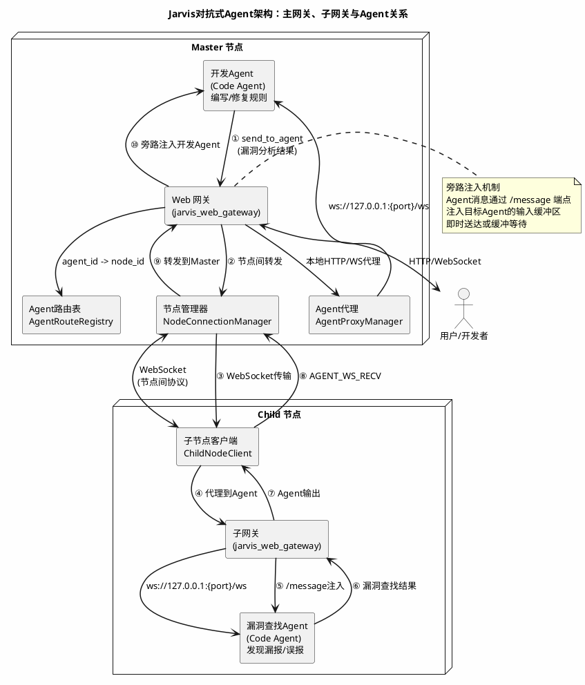

# 对抗式Agent技术在专家系统优化上的应用

**摘要**：本文提出对抗式Agent方法论，通过两个角色对立的Agent进行对抗迭代，将大语言模型的泛化能力逐步沉淀到专家系统的确定性规则中，实现两种范式的优势融合。以Jarvis平台上的安全扫描模块jsec为案例，展示了2天内59条C/C++检测规则从正则驱动到数据库驱动架构的对抗式进化过程，最终实现87个漏洞样本全检测、66个安全样本0误报。该方法的核心特点是逐步将模型的不确定能力沉淀为专家系统的确定规则，可推广至故障定位、专家运维等专家系统与Agent混合场景。

## 1. 引言

在软件工程和系统安全领域，一个长期存在的矛盾是：**确定性系统缺乏泛化能力，而具备泛化能力的系统又缺乏确定性**。

传统的专家系统基于预定义的规则运行，输出结果确定、执行效率高，但只能处理规则覆盖范围内的已知场景。一旦遇到规则未覆盖的新模式，系统便无能为力。而近年来兴起的大语言模型（LLM）和Agent技术则展现出强大的泛化能力，能够处理开放域问题，但其输出具有不确定性——同样的输入可能产生不同的结果，且推理过程难以保证严格正确。

这一矛盾是否可以被化解？本文提出一种**对抗式Agent**的方法论：通过两个角色对立的Agent进行对抗迭代，将大模型的泛化能力逐步沉淀到专家系统的确定性规则中，从而实现两种范式的优势融合。

本文将以Jarvis AI助手平台中的安全扫描模块（jsec）为实际案例，展示对抗式Agent在C/C++静态检查规则优化中的完整应用过程。

---

## 2. 专家系统

### 2.1 什么是专家系统

专家系统是一种模拟人类专家决策过程的计算机系统。其核心思想是将领域专家的知识编码为一系列规则，系统根据这些规则对输入数据进行推理和判断。

一个典型的专家系统包含以下组件：

- **知识库**：存储领域知识，通常以「IF-THEN」规则的形式表达
- **推理引擎**：根据知识库中的规则对输入数据进行模式匹配和逻辑推理
- **工作记忆**：存储当前问题的已知事实和推理中间结果

### 2.2 专家系统的优势

专家系统具有两个显著优势：

**确定性**：给定相同的输入，专家系统始终产生相同的输出。规则是显式编码的，推理路径可追溯、可审计。这在安全扫描、合规检查等对结果可靠性要求极高的场景中至关重要。

**高效性**：规则匹配的计算复杂度可控，通常为线性或多项式级别。一个包含数百条规则的专家系统可以在毫秒级完成对数千行代码的扫描，远超人类专家的手动审查速度。

### 2.3 专家系统的典型应用

在软件工程领域，专家系统被广泛应用于以下场景：

| 应用领域     | 代表工具                              | 规则类型                 |
| ------------ | ------------------------------------- | ------------------------ |
| 静态代码检查 | Coverity, Clang Static Analyzer, jsec | 漏洞模式匹配、数据流分析 |
| 故障定位     | Nagios, Zabbix规则引擎                | 阈值告警、模式识别       |
| 编码规范     | SonarQube, ESLint                     | 代码风格、最佳实践       |
| 安全合规     | Checkmarx, Fortify                    | CWE规则集                |

### 2.4 专家系统的根本局限

专家系统的核心局限在于：**规则只能覆盖已知模式，无法泛化到未见过的新场景**。

具体表现为：

- **漏报（False Negative）**：当漏洞模式未被规则覆盖时，系统无法检测到该漏洞。例如，一个只检查`malloc`返回值的规则，无法发现`calloc`或`realloc`的同类问题。
- **误报（False Positive）**：当规则过于宽泛时，可能将安全代码标记为漏洞。例如，检测未检查返回值的规则可能误报已经通过`if`条件保护过的代码。
- **维护成本**：每条新规则都需要领域专家手动编写和调试，规则间可能存在冲突或冗余。
- **适应性差**：面对新的编程范式、新的API或新的攻击手法，规则库需要大量更新。

这些局限的本质是：专家系统的知识是**静态的**，而真实世界的问题是**动态的**。规则编写者无法预见所有可能的代码模式和漏洞变体。

---

## 3. Agent技术

### 3.1 什么是Agent

Agent（智能体）是一种能够自主感知环境、做出决策并执行动作以实现目标的软件实体。与传统的程序不同，Agent具备以下核心特征：

- **自主性**：无需人类逐步指令，能够根据目标自主规划行动步骤
- **感知能力**：能够通过工具和接口获取环境信息
- **推理能力**：基于大语言模型进行逻辑推理、模式识别和决策
- **行动能力**：通过工具调用对环境施加影响（修改代码、执行命令、发送消息等）
- **记忆能力**：维护上下文和历史信息，支持长期学习和经验积累

### 3.2 Agent的核心架构

现代Agent系统通常基于**ReAct（Reasoning + Acting）**范式构建，其工作循环为：

```
观察(Observation) → 思考(Reasoning) → 行动(Action) → 观察 → ...
```

具体而言，Agent在每一轮迭代中：

1. **观察**：接收用户输入、工具返回结果或其他Agent发来的消息
2. **思考**：大语言模型根据当前上下文进行推理，决定下一步行动
3. **行动**：调用工具（代码编辑、脚本执行、网络搜索等）或向其他Agent发送消息
4. **反思**：根据行动结果评估进展，调整策略

### 3.3 Agent的优势

Agent技术的核心优势在于**泛化能力**：

- **开放域处理**：无需为每种场景预定义规则，Agent能够根据上下文自主推理出解决方案
- **跨领域迁移**：同一Agent框架可以应用于代码审查、安全分析、文档编写等不同任务
- **自适应学习**：通过记忆机制和经验积累，Agent可以在交互中不断改进表现
- **工具组合**：Agent能够根据任务需要灵活组合多种工具，形成复杂的工作流

### 3.4 Agent的不足

然而，Agent技术也存在显著的局限性：

- **不确定性**：大语言模型的输出具有随机性，同样的输入可能产生不同的推理路径和结论。在安全扫描等需要严格确定性的场景中，这种不确定性是不可接受的。
- **性能开销**：每次推理都需要调用大语言模型，单次推理耗时通常在秒级甚至分钟级，远高于规则匹配的毫秒级响应。
- **可靠性问题**：Agent可能产生幻觉（Hallucination），编造不存在的函数调用或错误的推理结论，需要额外的验证机制。
- **可审计性差**：Agent的推理过程是隐式的，难以像专家系统规则那样进行逐条审查和形式化验证。

### 3.5 两种范式的对比

| 维度     | 专家系统                 | Agent技术                |
| -------- | ------------------------ | ------------------------ |
| 确定性   | 高（规则驱动，输出确定） | 低（模型推理，输出随机） |
| 效率     | 高（毫秒级规则匹配）     | 低（秒级模型推理）       |
| 泛化能力 | 无（仅覆盖已知模式）     | 强（可处理开放域问题）   |
| 可审计性 | 高（规则可逐条审查）     | 低（推理过程隐式）       |
| 维护成本 | 高（需专家手动编写规则） | 低（自适应学习）         |
| 可靠性   | 高（规则逻辑明确）       | 中（存在幻觉风险）       |

正是这种互补性，为对抗式Agent方法论的提出奠定了基础。

---

## 4. 对抗式Agent原理

### 4.1 核心思想

对抗式Agent的核心思想是：**利用Agent的泛化能力来发现专家系统的漏洞，再将发现的知识沉淀为确定性规则**。

这一方法借鉴了生成对抗网络（GAN）的思想，但将对抗从连续空间中的梯度博弈，转化为离散空间中的规则博弈：

- **生成器（Generator）** → **开发Agent**：负责构建和改进专家系统的规则
- **判别器（Discriminator）** → **漏洞查找Agent**：负责发现专家系统的漏报和误报

与GAN不同的是，对抗式Agent的博弈结果不是纳什均衡，而是**规则的持续增强**——每一轮对抗都使规则库更加完善，漏洞查找的难度逐渐增大。

### 4.2 工作流程

对抗式Agent的完整工作流程如下：

```
┌─────────────────────────────────────────────────────────┐
│                    对抗式Agent迭代循环                      │
├─────────────────────────────────────────────────────────┤
│                                                         │
│  1. 开发Agent编写第一版专家系统规则                         │
│                    ↓                                    │
│  2. 漏洞查找Agent分析规则，生成绕过案例                      │
│     - 阅读源码或不阅读源码                                 │
│     - 构造可绕过规则的代码样本                               │
│     - 形成误报、漏报或错误结论                              │
│                    ↓                                    │
│  3. 将分析结果发送给开发Agent                               │
│                    ↓                                    │
│  4. 开发Agent根据反馈修复规则                               │
│     - 补充漏报检测逻辑                                     │
│     - 增加误报过滤条件                                     │
│     - 重构规则架构以支持更复杂的分析                          │
│                    ↓                                    │
│  5. 回到步骤2，进入下一轮迭代                               │
│                                                         │
│  终止条件：漏洞查找Agent无法再发现新的漏报/误报               │
└─────────────────────────────────────────────────────────┘
```

### 4.3 关键机制

#### 4.3.1 漏洞查找策略

漏洞查找Agent可以采用两种策略：

- **白盒策略**：阅读专家系统的源码，理解规则的检测逻辑，然后针对性地构造绕过案例。这种方式效率高，但要求Agent具备代码理解能力。
- **黑盒策略**：不阅读源码，仅通过输入不同代码样本并观察输出来探测规则的边界。这种方式更接近真实攻击者的行为，但效率较低。

在实践中，两种策略通常结合使用：白盒策略用于快速定位规则逻辑漏洞，黑盒策略用于发现规则未覆盖的未知模式。

#### 4.3.2 知识沉淀

对抗迭代的关键产出不是Agent的推理过程，而是**沉淀到规则中的确定性知识**。每一轮迭代中：

1. 漏洞查找Agent发现一个新的漏洞模式（如：`sscanf`的格式串在第2参数而非第1参数）
2. 开发Agent将这一模式编码为新的检测规则或对现有规则的补充
3. 新规则成为专家系统知识库的一部分，以确定性的方式永久覆盖该漏洞模式

这个过程实现了**从非确定性到确定性的知识转化**：Agent的泛化推理（不确定）→ 规则的显式编码（确定）。

#### 4.3.3 收敛性

对抗式Agent的迭代具有天然的收敛性：

- 随着规则库的完善，漏洞查找Agent发现新漏洞的难度逐渐增大
- 当规则覆盖了所有已知漏洞模式后，漏洞查找Agent只能发现越来越边缘的边界情况
- 最终，迭代收敛到一种「足够好」的状态——规则库覆盖了绝大多数实际场景中的漏洞模式

这种收敛性保证了对抗式Agent方法在实践中是可行的，不会陷入无限循环。

---

## 5. Jarvis平台的多Agent对抗机制

### 5.1 Jarvis平台概述

Jarvis是一个本地运行、开箱即用的AI开发助手平台，其核心能力之一是**多Agent协调通信**。Jarvis的Web网关（jarvis_web_gateway）充当Agent之间的通信枢纽，支持Agent的创建、销毁、消息路由和跨节点代理。

在对抗式Agent的场景中，Jarvis提供了关键的基础设施：

- **Agent生命周期管理**：动态创建和销毁开发Agent与漏洞查找Agent
- **跨Agent消息传递**：通过旁路注入机制实现Agent间的实时通信
- **分布式节点支持**：Master/Child节点架构，Agent可运行在不同物理节点上
- **会话与状态管理**：维护Agent的执行上下文，支持断线重连和状态恢复

### 5.2 主网关与节点架构

Jarvis采用**Master/Child节点模式**实现分布式部署。以下PlantUML图展示了对抗式Agent场景中，主网关、子网关与各Agent之间的关系：



### 5.3 旁路注入机制

Jarvis的Agent间通信采用**旁路注入（Bypass Injection）**机制，这是实现对抗式Agent的关键技术。

#### 5.3.1 消息注入流程

当一个Agent需要向另一个Agent发送消息时：

1. **发送方**调用`send_to_agent`工具，指定目标Agent ID和消息内容
2. **Web网关**接收请求，通过Agent路由表确定目标Agent所在节点
3. **网关代理**将消息转发到目标Agent的`/message`端点
4. **目标Agent**的`/message`端点处理消息：
   - 如果Agent正在等待输入（`input_inject_callback`可用），消息**即时注入**到输入流
   - 否则，消息存入**输入缓冲区**（`input_buffer`），等待下一轮循环消费
5. 消息以`Agent {sender_id} 发来消息：{content}`的格式出现在目标Agent的提示词上下文中

#### 5.3.2 关键代码实现

Agent端的`/message`端点实现（`jarvis.py:1436`）：

```python
@custom_app.post("/message")
async def receive_message(request: dict):
    sender_id = request.get("sender_id")
    content = request.get("content")

    # 构建消息格式：Agent xxxx 发来消息：yyyyy
    if sender_id:
        message = f"Agent {sender_id} 发来消息：{content}"
    else:
        message = f"Agent 发来消息：{content}"

    # 如果Agent正在等待输入，直接注入到输入流实现即时送达
    if jglobals.input_inject_callback is not None:
        jglobals.input_inject_callback(message)
        delivered = "instant"
    else:
        # 否则存入缓冲区，等待下一轮循环消费
        jglobals.input_buffer.append(message)
        delivered = "buffered"
```

#### 5.3.3 旁路注入的优势

旁路注入机制具有以下优势：

- **非侵入性**：消息注入不影响Agent的正常执行流程，Agent无需主动轮询消息
- **即时性**：当Agent处于等待输入状态时，消息可以即时送达，无需等待当前推理完成
- **可靠性**：缓冲机制确保消息不会丢失，即使Agent正在执行长时间推理
- **透明性**：对Agent而言，来自其他Agent的消息与用户输入在形式上无差别，无需特殊处理

### 5.4 对抗式Agent在Jarvis中的工作模式

在Jarvis平台上，对抗式Agent的具体工作模式为：

1. **创建两个Agent**：通过Web网关的`create_agent`接口，分别创建开发Agent和漏洞查找Agent
2. **开发Agent初始化**：开发Agent接收任务描述，开始编写第一版专家系统规则
3. **漏洞查找Agent启动**：开发Agent完成初版后，通过`send_to_agent`通知漏洞查找Agent开始分析
4. **对抗迭代**：
   - 漏洞查找Agent阅读规则源码，构造绕过案例，将分析结果通过`send_to_agent`发送给开发Agent
   - 开发Agent接收消息，修复规则，运行测试验证
   - 开发Agent将修复结果发送给漏洞查找Agent，进入下一轮
5. **收敛判定**：当漏洞查找Agent连续多轮无法发现新的漏报/误报时，迭代终止

### 5.5 跨节点对抗

Jarvis的Master/Child架构使得对抗式Agent可以跨物理节点运行：

- **开发Agent**运行在Master节点，直接访问代码仓库
- **漏洞查找Agent**运行在Child节点，模拟外部攻击者的视角
- 节点间通过WebSocket长连接通信，消息经过`NodeConnectionManager`路由
- 跨节点代理采用**SEND/RECV轮询模式**，确保消息可靠传递

这种跨节点部署不仅提供了计算资源的隔离，更重要的是模拟了真实的安全评估场景——攻击者与防御者处于不同的环境，拥有不同的信息视角。

### 5.6 节点间协议消息类型

Jarvis定义了完整的节点间协议，支撑对抗式Agent的跨节点通信：

| 类别          | 消息类型                              | 说明                        |
| ------------- | ------------------------------------- | --------------------------- |
| 认证          | NODE_AUTH / NODE_AUTH_RESULT          | 子节点认证，Master返回token |
| 心跳          | NODE_HEARTBEAT                        | 子节点心跳保活              |
| Agent管理     | AGENT_CREATE_REQUEST/RESPONSE         | 跨节点创建Agent             |
| HTTP代理      | AGENT_HTTP_REQUEST/RESPONSE           | 跨节点HTTP代理              |
| WebSocket代理 | AGENT_WS_OPEN/SEND/RECV/CLOSE         | 跨节点WebSocket代理         |
| 终端          | NODE_TERMINAL_REQUEST/RESPONSE/OUTPUT | 远程终端会话                |

其中，**AGENT_WS_SEND_REQUEST**和**AGENT_WS_RECV_REQUEST**是对抗式Agent跨节点通信的核心消息类型，分别用于发送Agent消息和接收Agent响应。

---

## 6. 实际案例：jsec静态检查规则的对抗式进化

### 6.1 jsec概述

jsec（Jarvis Security Scanner）是Jarvis平台中的C/C++安全漏洞静态扫描模块，其核心是一个基于tree-sitter的规则引擎，包含C检查器（c_checker）和Rust检查器（rust_checker）。

jsec本质上是一个**专家系统**：每条检测规则以Python函数的形式实现，通过tree-sitter解析的AST节点和数据库查询进行模式匹配。规则的输出是确定性的——给定相同的代码，始终产生相同的扫描结果。

### 6.2 规则统计

截至进化完成，jsec的C/C++检查器包含以下规则：

| 规则类别     | 规则数量 | 示例规则                                                                     |
| ------------ | -------- | ---------------------------------------------------------------------------- |
| 内存安全     | 15       | malloc_no_null_check, uaf_suspect, double_free, memory_leak                  |
| 整数/缓冲区  | 9        | integer_overflow, alloc_size_overflow, scanf_no_width, strncpy_no_nullterm   |
| 并发安全     | 12       | deadlock_patterns, data_race_suspect, thread_leak_no_join, cond_wait_no_loop |
| 输入/注入    | 10       | format_string, command_execution, sql_injection, signal_handler_unsafe       |
| API/编码实践 | 17       | weak_crypto, rand_insecure, atoi_family, reinterpret_cast_unsafe             |
| **合计**     | **59**   |                                                                              |

此外，Rust检查器包含18条规则，覆盖Rust特有的安全模式。

### 6.3 测试数据集

jsec的测试数据集采用**positive/negative**配对设计：

- **Positive样本**（87个）：包含应被检测到的漏洞代码，用于验证规则的**漏报率**
- **Negative样本**（66个）：包含安全代码，用于验证规则的**误报率**

这种配对设计天然契合对抗式Agent的思路：positive样本对应漏洞查找Agent发现的漏报，negative样本对应漏洞查找Agent发现的误报。

### 6.4 规则覆盖的CWE类别

jsec的规则覆盖了以下CWE（Common Weakness Enumeration）类别：

| CWE ID  | 漏洞类型       | 对应规则                                  |
| ------- | -------------- | ----------------------------------------- |
| CWE-119 | 缓冲区溢出     | buffer_overflow, boundary_funcs           |
| CWE-190 | 整数溢出       | integer_overflow, alloc_size_overflow     |
| CWE-416 | 释放后使用     | uaf_suspect                               |
| CWE-415 | 双重释放       | double_free                               |
| CWE-476 | 空指针解引用   | possible_null_deref, malloc_no_null_check |
| CWE-327 | 弱加密         | weak_crypto                               |
| CWE-330 | 随机数不安全   | rand_insecure                             |
| CWE-367 | TOCTOU竞态     | toctou_race                               |
| CWE-457 | 未初始化变量   | uninitialized_var                         |
| CWE-665 | 缺少虚析构     | missing_virtual_dtor                      |
| CWE-733 | 编译器安全检查 | compiler_security_check                   |
| CWE-787 | 越界写入       | vector_string_bounds_check                |

### 6.5 对抗式Agent的联网知识获取

在jsec的对抗式进化过程中，两个Agent都充分利用了互联网作为知识源：

**漏洞查找Agent的联网行为**：

- 通过`search_web`和`read_webpage`工具搜索MITRE CWE数据库，获取CWE的正式定义、漏洞模式描述和示例代码
- 查阅CVE数据库中的真实漏洞案例，抽象出通用的漏洞模式
- 搜索安全研究博客和论文，了解最新的绕过技术和攻击手法
- 将搜索到的CWE定义与jsec现有规则对比，发现未覆盖的漏洞类别

**规则生成Agent的联网行为**：

- 搜索开源静态分析工具（如CodeQL、Semgrep、Cppcheck）的规则实现，学习检测方案
- 查阅OWASP、SEI CERT C等安全编码标准的推荐检测方法
- 搜索学术论文中的静态分析算法，如数据流分析、污点分析的实现方案
- 将搜索到的检测方案与jsec的tree-sitter + database架构适配，生成可执行的规则代码

这种联网知识获取机制使得对抗式Agent不再局限于训练数据中的知识，而是能够实时获取最新的安全研究成果，持续丰富规则库。例如，CWE-327（弱加密）、CWE-457（未初始化变量）、CWE-733（编译器安全检查）等规则都是在Agent联网搜索CWE定义后新增的。

### 6.6 测试用例驱动的回归安全

对抗式进化中的一个关键设计是：**所有发现的漏洞都被抽象为测试用例**。这一机制确保了在修复漏洞时不破坏已有功能：

- **Positive测试用例**：漏洞查找Agent发现的每个漏报，都会生成一个对应的positive测试文件，包含应被检测到的漏洞代码。修复规则后，必须确保这些positive用例仍然被正确检测。
- **Negative测试用例**：漏洞查找Agent发现的每个误报，都会生成一个对应的negative测试文件，包含不应被报告的安全代码。修复规则后，必须确保这些negative用例不再被误报。
- **pytest集成**：所有测试用例通过pytest框架自动执行，每次规则修改后自动运行全量测试，确保修复不引入回归问题。

这种"发现即测试"的模式，使得jsec的规则库在快速迭代中始终保持质量：87个positive样本和66个negative样本构成了完整的回归测试套件，任何规则修改都必须通过全部测试才能合入。

---

## 7. 进化成果

### 7.1 进化时间线

jsec的C/C++检查器在约**2天**（2026年6月26日-6月28日）内完成了对抗式进化，共经历13次提交迭代：

| 时间          | 阶段 | 关键进展                                                 |
| ------------- | ---- | -------------------------------------------------------- |
| 6月26日 13:18 | P1   | 增强启发式扫描能力，实现数据流分析                       |
| 6月26日 14:11 | P2   | 修复跨函数内存安全检测的误报问题                         |
| 6月26日 15:23 | P3   | 增强变量名提取机制以优化误报过滤                         |
| 6月26日 16:14 | P4   | 实现项目级数据库与跨文件分析支持                         |
| 6月27日 00:33 | P5   | 集成项目级数据库支持跨文件分析                           |
| 6月27日 02:29 | P6   | 实现跨文件UAF检测功能                                    |
| 6月27日 16:34 | P7   | 重构跨文件检测架构并实现内置数据流分析器                 |
| 6月27日 17:52 | P8   | 完成架构重构并增强数据流分析能力                         |
| 6月27日 18:22 | P9   | 为8个无db规则添加database参数                            |
| 6月27日 18:34 | P10  | 重构内存安全规则以支持数据库驱动分析                     |
| 6月28日 00:45 | P11  | 重构c_checker架构为database驱动模式并修复13类漏报漏洞    |
| 6月28日 17:07 | P12  | 修复negative误报，2个negative文件0误报 + 8个pytest全通过 |
| 6月28日 17:34 | P13  | 重构C/C++代码检查器架构并扩展CWE规则覆盖                 |

### 7.2 架构演进

对抗式进化不仅增加了规则数量，更重要的是推动了**架构层面的根本性演进**：

#### 从正则驱动到数据库驱动

进化前，c_checker的规则主要依赖正则表达式进行模式匹配，存在以下问题：

- 正则难以表达跨函数、跨文件的数据流关系
- 正则匹配容易产生误报（如将条件保护的代码误判为漏洞）
- 规则间缺乏共享的语义信息

进化后，c_checker重构为**database驱动**架构：

- 通过`DataCollector`将AST信息收集到SQLite数据库
- 规则通过SQL查询进行数据流分析，支持跨函数、跨文件检测
- 所有正则回退逻辑被移除，完全依赖数据库查询
- 规则间共享数据库中的语义信息（如变量类型、函数调用关系）

值得注意的是，**AST污点分析和数据流分析能力并非预先设计，而是在对抗过程中自然产生的**。当漏洞查找Agent构造出跨函数的UAF（释放后使用）绕过案例时，正则匹配完全无法应对——它无法追踪一个指针在函数A中被释放、在函数B中被使用的跨函数数据流。正是这种对抗压力，迫使规则生成Agent实现了基于数据库的数据流追踪和污点传播分析。类似地，当漏洞查找Agent发现条件保护的代码被误报时，规则生成Agent不得不实现更精确的AST路径分析来区分真实漏洞与安全代码。每一次对抗突破都推动了分析能力的升级，从简单的模式匹配逐步演进为完整的程序分析框架。

#### 关键架构变更

```python
# 进化前：正则匹配模式
def _rule_malloc_no_null_check(self, content, ...):
    matches = RE_MALLOC.findall(content)  # 正则匹配
    for match in matches:
        # 简单的字符串搜索判断是否有NULL检查
        if f"if ({var}" not in content:
            yield vulnerability

# 进化后：数据库驱动模式
def _rule_malloc_no_null_check(self, db, db_file_path, ...):
    cursor = db.execute(
        "SELECT * FROM calls WHERE func_name IN ('malloc','calloc','realloc')"
    )
    for row in cursor:
        # 通过数据库查询判断是否有条件保护
        if not self._is_condition_protected(db, row['var'], row['line']):
            yield vulnerability
```

### 7.3 漏报修复统计

在2天的对抗式进化中，共修复了以下类型的漏报：

| 漏洞类型                 | 修复内容                             | 新增/修改规则                      |
| ------------------------ | ------------------------------------ | ---------------------------------- |
| sscanf/fscanf格式串      | 修复第2参数格式串检测                | 修改\_rule_scanf_no_width          |
| signal handler不安全函数 | 检测handler中非async-signal-safe函数 | 新增\_rule_signal_handler_unsafe   |
| 权限操作未检查           | 检测setuid/setgid/chown等            | 扩展\_rule_unchecked_io            |
| 网络IO未检查             | 检测recv/send/connect等              | 扩展\_rule_unchecked_io            |
| 弱加密算法               | 检测DES/RC4/MD5/SHA1                 | 新增\_rule_weak_crypto             |
| 未初始化变量             | 检测条件分支内赋值外部使用           | 新增\_rule_uninitialized_var       |
| 有符号转无符号           | 检测(size_t)显式转换                 | 新增\_rule_signed_to_unsigned      |
| 除零错误                 | 检测除数变量无零检查                 | 新增\_rule_divide_by_zero          |
| 编译器安全检查           | 检测指针NULL检查未声明volatile       | 新增\_rule_compiler_security_check |

### 7.4 误报修复统计

同时修复了以下类型的误报：

| 误报类型     | 修复内容                              | 影响规则                                                 |
| ------------ | ------------------------------------- | -------------------------------------------------------- |
| 条件保护误报 | if(fd>=0)保护的代码不再误报           | \_rule_unchecked_io, \_rule_function_return_ptr_no_check |
| 值检查误报   | >=0/>-1/!=-1等值检查不再误报          | \_rule_unchecked_io                                      |
| 显式NULL终止 | dest[N-1]='\0'不再误报为strncpy未终止 | \_rule_strncpy_no_nullterm                               |
| 溢出检查过滤 | INT_MAX/SIZE_MAX检查不再误报          | \_rule_alloc_size_overflow                               |

### 7.5 最终验证结果

进化完成后的验证结果：

- **pytest测试**：33个测试全部通过
- **Positive检测**：87个漏洞样本全部正确检测
- **Negative误报**：66个安全样本0误报
- **代码规模**：c_checker.py从初始版本增长至7099行
- **规则总数**：59个检测规则（C/C++）+ 18个检测规则（Rust）

---

## 8. 结论与展望

### 8.1 研究结论

本文探讨了对抗式Agent技术在专家系统优化中的应用，并以Jarvis平台上的jsec静态检查器为案例，验证了该方法的有效性。主要结论如下：

1. **对抗式Agent能有效发现专家系统的知识盲区**。漏洞查找Agent通过阅读规则源码、构造绕过案例和联网搜索CWE定义，系统性地发现了jsec初版规则中的漏报和误报，这些盲区在传统开发流程中往往需要数周甚至数月才能被发现。

2. **旁路注入机制是对抗式Agent的技术基础**。Jarvis的`/message`端点允许Agent之间直接通信，无需修改Agent的核心推理逻辑。这种设计使得任何Jarvis Agent都可以无缝参与对抗式协作，降低了技术门槛。

3. **跨节点对抗提供了更真实的评估视角**。Master/Child架构使得攻击方和防御方运行在不同的物理节点上，模拟了真实的安全评估场景，避免了同节点运行时的信息泄露和资源竞争。

4. **对抗式进化推动了架构演进**。jsec从正则驱动到数据库驱动的架构重构，并非预先设计，而是在对抗过程中自然演化的结果——当正则匹配无法满足跨函数、跨文件检测需求时，架构重构成为必然选择。

5. **联网知识获取使Agent具备持续进化能力**。通过搜索CWE数据库、开源工具规则和安全研究文献，Agent能够获取最新的安全知识，持续丰富规则库，突破了传统专家系统知识获取的瓶颈。

### 8.2 方法论总结

对抗式Agent优化专家系统的核心方法论可以概括为：

```
知识编码 → 对抗测试 → 漏洞发现 → 规则修复 → 回归验证 → 迭代
```

这一循环与传统的专家系统开发流程（需求分析→规则编写→测试→部署）的根本区别在于：**对抗是持续的、自动化的、双向的**。漏洞查找Agent和规则生成Agent在每一轮迭代中都同时进化，形成类似GAN（生成对抗网络）的动态平衡。

### 8.3 展望

对抗式Agent技术为专家系统的知识获取和质量保证提供了一种新的范式。其核心特点是**逐步将模型的不确定能力沉淀为专家系统的确定规则**——LLM的推理具有不确定性和不可复现性，而专家系统的规则输出是确定性的。通过对抗式迭代，LLM在探索中发现的知识被编码为确定性规则，实现了从不确定性到确定性的知识沉淀。

#### 技术方向

1. **自动化收敛判定**：基于测试覆盖率、规则复杂度、漏报/误报率变化趋势等指标，实现自动化的迭代终止判定
2. **多Agent对抗**：引入多个漏洞查找Agent，从不同攻击视角（如内存安全、逻辑漏洞、密码学弱点）同时进行对抗
3. **规则质量评估**：建立规则质量评分体系，自动评估LLM生成规则的准确性、完整性和可维护性
4. **人机协同**：在对抗循环中引入人类专家的审查节点，结合LLM的效率和人类专家的判断力

#### 应用领域

这种方法可应用于更多专家系统与Agent混合的场景：

- **自助故障定位系统**：故障查找Agent模拟各类故障场景，规则生成Agent将故障模式编码为确定性诊断规则，逐步构建完整的故障知识库
- **专家运维系统**：运维Agent探索异常模式，规则生成Agent将运维经验沉淀为自动化巡检规则，实现从人工经验到自动化的转化
- **安全合规审计系统**：合规Agent解读法规条文，规则生成Agent将合规要求编码为可自动执行的检查规则
- **代码审查系统**：审查Agent发现代码异味和反模式，规则生成Agent将审查经验沉淀为自动化检查规则

这些系统的共同特征是：Agent负责探索和发现（不确定），专家系统负责执行和判定（确定），对抗式迭代则是连接两者的桥梁。
