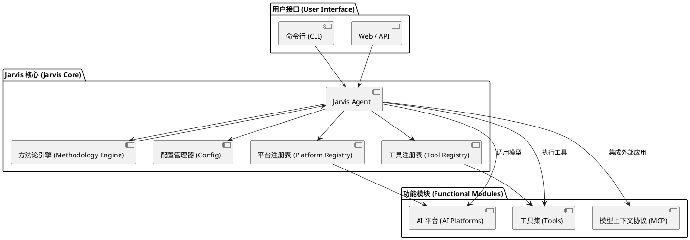
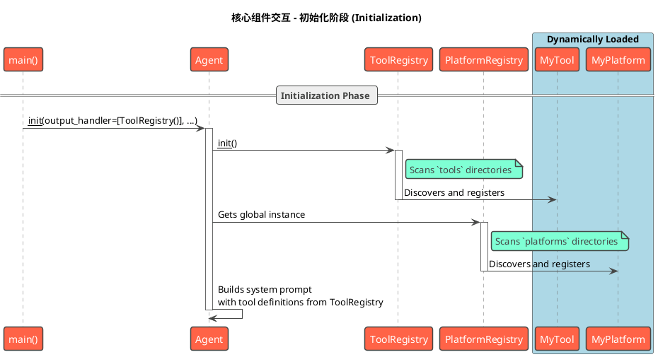
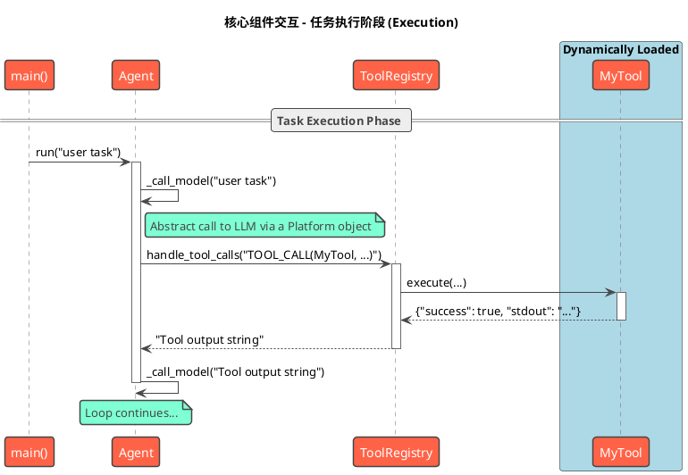
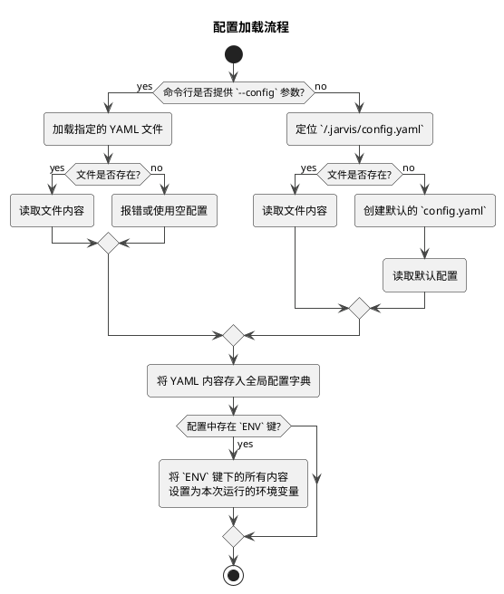
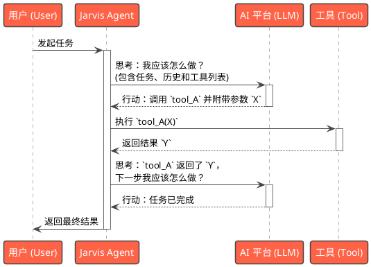
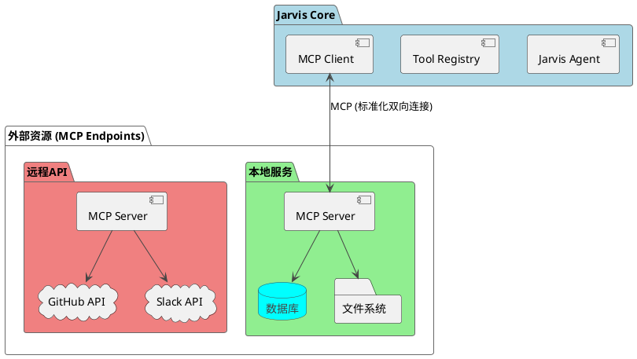
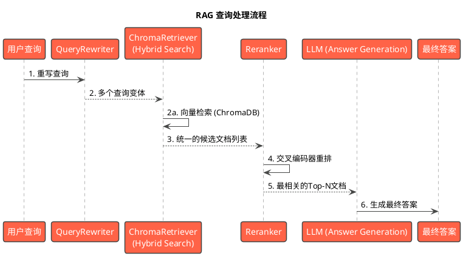
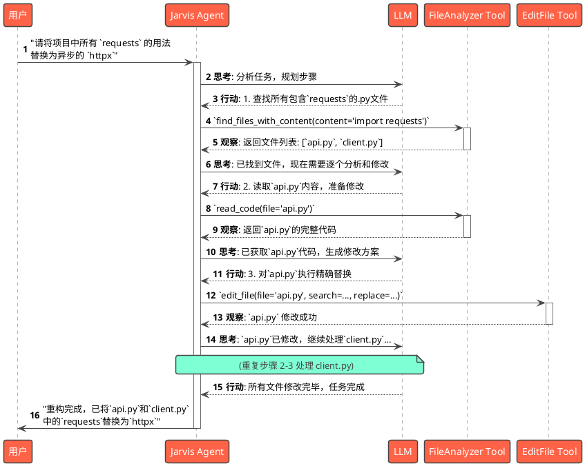

# Jarvis 技术文档

## 1. 引言

Jarvis 是一个高度可扩展、工具驱动的AI助手，旨在成为开发人员和系统管理员的智能伙伴。它通过将复杂的任务分解为由专业工具执行的离散步骤来工作，并由大型语言模型（LLM）进行协调。

### 1.1. 设计哲学

Jarvis 的设计理念根植于一个核心观察：大型语言模型（LLM）虽然在自然语言理解、推理和规划方面表现出色，但在执行精确、有状态、需要高可靠性的任务时，其表现尚不稳定且难以预测。为了结合两者的优势，Jarvis 的核心设计哲学建立在以下三大支柱之上：

*   **工具驱动 (Tool-Driven)**: 我们相信，专业的任务应该由专业的工具来完成。Jarvis 将 LLM 的角色从一个“万能的执行者”转变为一个“聪明的协调者”。对于代码修改、文件操作、脚本执行等任务，Jarvis 不依赖于模型直接生成结果，而是调用经过严格测试、行为确定的工具来执行。
    *   **优势**:
        *   **可靠性**: 工具的执行是可预测和可重复的，从根本上避免了 LLM 在执行具体任务时可能出现的“幻觉”。
        *   **精确性**: 工具可以提供机器级别的精度，例如，`edit_file` 工具可以精确地修改文件中的某一行代码。
        *   **可测试性**: 每个工具都是一个独立的单元，可以进行独立的单元测试和集成测试，确保了整个系统的稳定性。

*   **人机协作 (Human-in-the-Loop)**: Jarvis 不是一个追求完全自主的“黑盒”系统，而是一个旨在增强人类能力的协作伙伴。我们认为，在可预见的未来，最强大的系统是人与 AI 的结合。
    *   **优势**:
        *   **安全性**: 对于高风险操作（如修改生产代码、执行删除命令），Jarvis 可以配置为在执行前请求用户确认，将最终决策权交还给用户。
        *   **纠错与指导**: 当 AI 的规划偏离预期或陷入困境时，用户可以随时中断任务，提供明确的指令或修正方案，引导 AI 回到正确的轨道。
        *   **处理未知**: 面对全新的或高度复杂的任务，AI 可以利用人类的经验和直觉，共同探索解决方案，而不是在不确定性中盲目尝试。

*   **高度可扩展 (Extensible)**: 任何一个强大的平台，其生命力都在于它的生态和可扩展性。Jarvis 从设计之初就将扩展性放在了核心位置。
    *   **优势**:
        *   **功能无限增长**: 通过添加新的工具、平台和方法论，社区的每一个成员都可以为 Jarvis 贡献新的能力。
        *   **技术栈无关**: 模型上下文协议（Model Context Protocol, MCP）是一个开放标准，它允许用任何编程语言编写的服务，只要遵循该协议，就能作为工具或数据源无缝、安全地集成到 Jarvis 中。
        *   **面向未来**: 随着新的 AI 模型和技术不断涌现，Jarvis 的插件化设计使其可以快速适配和集成，而无需重构核心逻辑。

### 1.2. 高层架构

下图展示了 Jarvis 系统的高层架构，描绘了其核心组件以及它们之间的交互关系。



## 2. 核心组件

Jarvis 的强大功能源于其模块化的设计，主要由以下几个核心组件构成。在深入了解每个组件之前，以下两张时序图分别展示了**初始化**和**任务执行**两个阶段中核心组件的交互流程，重点突出了关键类和方法调用。

#### 初始化阶段 (Initialization Phase)



#### 任务执行阶段 (Task Execution Phase)



### 2.1. Jarvis Agent

`Jarvis Agent` 是系统的指挥中心，负责协调所有操作。它位于 `src/jarvis/jarvis_agent` 模块中，其核心是 `Agent` 类。

#### 2.1.1. 主要职责

- **任务理解与规划**: Agent 接收用户输入，并与大型语言模型（LLM）协作，将高级任务分解为一系列具体的、可执行的步骤。
- **工具调用**: 根据规划，Agent 动态选择并调用合适的工具来执行每个步骤。它是模型与工具集之间的桥梁。
- **状态管理**: Agent 维护着整个任务的上下文，包括对话历史、工具执行结果以及任何中间产物。当对话历史过长时，它会自动进行总结以管理上下文长度。
- **人机交互**: Agent 管理与用户的交互循环，接收指令，反馈结果，并根据用户干预调整执行路径。

#### 2.1.2. 初始化 (`__init__`)

Agent 的初始化过程是高度可配置的，允许用户根据需求定制其行为。关键初始化参数包括：

- `system_prompt`: 定义 Agent 角色的系统提示词，是指导 LLM 行为的基础。
- `platform` 和 `model_name`: 指定用于推理的 AI 平台（如 Yuanbao, Kimi）和具体模型。
- `output_handler`: 定义 Agent 可以使用的工具集。默认情况下，它会加载 `ToolRegistry` 中的所有可用工具。
- `input_handler`: 在将用户输入发送给模型之前，对其进行预处理的处理器链。

在初始化阶段，Agent 会构建一个包含所有可用工具详细信息的动态提示，并将其与系统提示词结合，发送给 LLM。这使得模型能够“知道”它有哪些工具以及如何使用它们。

#### 2.1.3. 主运行循环 (`run`)

`run` 方法是 Agent 的主执行引擎。其工作流程如下：

1.  **首次运行处理**: 在第一次交互时，Agent 会执行 `_first_run` 方法，加载与任务相关的方法论（如果启用），或上传用户提供的文件。
2.  **模型调用**: Agent 将当前的用户输入和对话历史发送给 `_call_model` 方法。该方法负责与 LLM 进行通信，并包含重试逻辑以确保稳定性。
3.  **工具执行**: 模型返回的响应通常包含一个工具调用。`_call_tools` 方法解析此响应，找到对应的工具并执行它。为了安全，可以配置在执行前需要用户确认。
4.  **状态更新**: 工具的执行结果会被捕获，并作为下一次模型调用的输入，形成一个闭环。
5.  **循环与终止**: 这个“思考-行动”循环会一直持续，直到任务完成或用户选择终止。任务完成后，Agent 会调用 `_complete_task` 方法，该方法可以生成任务总结，并进行任务分析以提炼新的方法论或工具。

这个循环体现了 Jarvis 的核心理念：将复杂的任务自动化，同时保留用户在关键节点进行干预的能力。

### 2.2. 工具注册表 (Tool Registry)

`ToolRegistry` (位于 `src/jarvis/jarvis_tools/registry.py`) 是 Jarvis 工具驱动架构的基石。它是一个动态的工具加载器和执行器，负责管理 Agent 可用的所有工具。

#### 2.2.1. 动态工具加载

`ToolRegistry` 在初始化时会自动扫描并加载来自多个源的工具：

- **内置工具**: 位于 `src/jarvis/jarvis_tools/` 目录下的核心工具。
- **外部工具**: 用户可以在 `~/.jarvis/tools/` 目录下添加自定义的 Python 工具脚本。
- **MCP 工具**: 通过多进程通信协议（MCP）集成的外部应用或服务。这些工具通过 `~/.jarvis/mcp/` 或 `JARVIS_MCP` 环境变量中的 YAML 配置文件进行定义。

这种分层加载机制使得核心功能保持稳定，同时为用户提供了极大的灵活性来扩展 Jarvis 的能力。

#### 2.2.2. 工具执行

当 Agent 决定使用一个工具时，`ToolRegistry` 会：
1.  解析模型生成的工具调用请求。
2.  查找已注册的同名工具。
3.  验证并传递参数。
4.  调用工具的 `execute` 方法。
5.  捕获并格式化 `stdout` 和 `stderr`，然后返回给 Agent。

### 2.3. 平台注册表 (Platform Registry)

`PlatformRegistry` (位于 `src/jarvis/jarvis_platform/registry.py`) 负责管理与不同大型语言模型（LLM）平台的交互。它使得 Jarvis 可以无缝切换和使用多个 AI 提供商。

#### 2.3.1. 平台抽象

所有平台都必须继承自 `BasePlatform` 类，并实现一套标准接口，如 `chat`, `set_model_name`, `upload_files` 等。这种设计将特定平台的实现细节与 Agent 的核心逻辑解耦。

#### 2.3.2. 动态平台加载

与 `ToolRegistry` 类似，`PlatformRegistry` 也会动态加载平台实现：

- **内置平台**: 位于 `src/jarvis/jarvis_platform/` 目录下的官方支持平台。
- **外部平台**: 用户可以在 `~/.jarvis/models/` 目录下添加自定义的平台适配器。

这使得社区可以方便地为 Jarvis 贡献对新 LLM 平台的支持。

## 3. 架构设计

### 3.1. 配置系统

Jarvis 的配置系统 (`src/jarvis/jarvis_utils/config.py`) 设计得非常直接，以保证配置来源的单一性和可预测性。

#### 3.1.1. 配置加载机制

Jarvis 在运行时只从**一个** YAML 文件加载所有配置。确定该文件的规则如下：

1.  **命令行指定 (最高优先级)**: 用户可以在启动命令时通过 `--config <path/to/your_config.yaml>` 参数，显式指定本次运行所使用的配置文件。
2.  **默认用户配置**: 如果没有通过命令行指定，系统会自动查找并加载位于用户主目录下的 `~/.jarvis/config.yaml` 文件。



所有从该文件加载的配置项都存储在一个全局字典中，并在程序运行时通过 `config.py` 中的 `get_*` 函数进行访问。这种设计避免了多层配置覆盖带来的复杂性和不确定性。

#### 3.1.2. 模型组配置

为了提供更大的灵活性，Jarvis 支持**模型组**的概念。用户可以预先定义多套模型配置组合，并通过一个简单的设置快速切换。

**工作机制**:

1.  **定义组**: 在 `config.yaml` 中，通过 `JARVIS_MODEL_GROUPS` 列表定义模型组。每个组是一个单键字典，键是组名，值是该组的具体配置。
2.  **选择组**: 通过 `JARVIS_MODEL_GROUP` 键指定当前要激活的组名。
3.  **配置覆盖**: 系统在解析配置时，遵循明确的优先级顺序：
    1.  **独立配置 (最高)**: 单独设置的 `JARVIS_PLATFORM`, `JARVIS_MODEL` 等总会覆盖所有其他设置。
    2.  **模型组配置**: 如果未设置独立配置，则采用 `JARVIS_MODEL_GROUP` 指定的组内配置。
    3.  **默认值 (最低)**: 如果两者都未提供，则使用代码中的硬编码默认值。

**示例**:

```yaml
# 1. 定义模型组
JARVIS_MODEL_GROUPS:
  - kimi:
      JARVIS_PLATFORM: kimi
      JARVIS_MODEL: k1.5
      JARVIS_THINKING_PLATFORM: kimi
      JARVIS_THINKING_MODEL: k1.5-thinking
      JARVIS_MAX_TOKEN_COUNT: 8192
  - ai8:
      JARVIS_PLATFORM: ai8
      JARVIS_MODEL: gemini-2.5-pro

# 2. 选择要使用的模型组
JARVIS_MODEL_GROUP: kimi

# 3. (可选) 独立配置会覆盖组配置
# 如果取消下面这行的注释，即使 JARVIS_MODEL_GROUP 是 'kimi', 常规模型也会使用 'gpt-4o'
# JARVIS_MODEL: gpt-4o
```

#### 3.1.3. 关键配置项

以下是 `config.yaml` 文件中支持的主要配置项及其说明：

| 配置项 (Key) | 描述 | 默认值 |
|---|---|---|
| `JARVIS_MODEL_GROUP` | 当前激活的模型组名称。 | `null` |
| `JARVIS_MODEL_GROUPS` | 预定义的模型配置组列表。 | `[]` |
| `JARVIS_PLATFORM` | 默认使用的 AI 平台名称。 | `yuanbao` |
| `JARVIS_MODEL` | 默认使用的模型名称。 | `deep_seek_v3` |
| `JARVIS_THINKING_PLATFORM` | 用于内部思考、规划等任务的 AI 平台。 | 同 `JARVIS_PLATFORM` |
| `JARVIS_THINKING_MODEL` | 用于内部思考任务的模型。 | `deep_seek` |
| `JARVIS_DATA_PATH` | 存储自定义工具、平台、方法论等数据的目录。 | `~/.jarvis` |
| `JARVIS_EXECUTE_TOOL_CONFIRM` | 在执行任何工具前是否需要用户二次确认。 | `false` |
| `JARVIS_CONFIRM_BEFORE_APPLY_PATCH` | 在应用代码补丁前是否需要用户二次确认。 | `false` |
| `JARVIS_USE_METHODOLOGY` | 是否启用方法论引擎（启动时加载、任务后分析）。 | `true` |
| `JARVIS_USE_ANALYSIS` | 任务结束后是否进行分析以提炼新工具或方法论。 | `true` |
| `JARVIS_PRINT_PROMPT` | 是否在控制台打印发送给 LLM 的完整提示，用于调试。 | `false` |
| `JARVIS_MAX_TOKEN_COUNT` | Agent 对话历史的上下文总长度阈值 (可被模型组覆盖)。 | `960000` |
| `JARVIS_MAX_INPUT_TOKEN_COUNT` | 单次输入给模型的最大 Token 数量 (可被模型组覆盖)。 | `32000` |
| `JARVIS_MAX_BIG_CONTENT_SIZE`| 判断内容是否为“大内容”的 Token 阈值，超过则可能触发特殊处理（如存入文件）(可被模型组覆盖)。| `160000` |
| `JARVIS_GIT_COMMIT_PROMPT` | `jgc` 命令生成 Git Commit Message 时使用的自定义模板。 | `""` |
| `JARVIS_REPLACE_MAP` | 定义在交互中使用的自定义快捷命令替换规则。 | `{}` |
| `JARVIS_MCP` | 一个列表，用于定义所有模型上下文协议（MCP）的端点配置。 | `[]` |
| `JARVIS_RAG` | RAG框架的配置。 | `{"embedding_model": "BAAI/bge-base-zh-v1.5"}` |
| `ENV` | 一个字典，用于为 Jarvis 运行环境设置临时的环境变量。 | `{}` |

### 3.2. 数据流与“思考-行动”循环

Jarvis 的核心是一个被称为“思考-行动”（Thought-Action）的循环，它驱动着整个任务执行过程。



1.  **思考 (Thought)**: Agent 将当前任务、对话历史和可用工具列表打包成一个提示，发送给 LLM。
2.  **行动 (Action)**: LLM 返回一个结构化的响应，其中包含要调用的工具名称和所需参数。
3.  **观察 (Observation)**: Agent 解析响应，调用指定的工具，并捕获其输出。
4.  **循环**: 工具的输出（观察结果）被添加到对话历史中，然后循环回到第一步，开始新的“思考”过程。

这个循环不断重复，直到 LLM 判断任务已经完成。

### 3.3. 方法论引擎：通过情境学习实现知识复用

Jarvis 不仅仅是一个任务执行器，它还是一个能够通过“实战”积累经验并不断进化的系统。其核心的学习机制就是**方法论引擎**，它通过一种简单而强大的“完全情境学习（Full-Context Learning）”模式来实现知识的沉淀与复用。

- **设计思想**: 许多开发任务在本质上是相似的，其解决方案具有可复用性。例如，“修复一个 Python 内存泄漏”或“为一个新服务创建 Dockerfile”这类任务，其解决步骤和所用工具往往遵循一个固定的模式。方法论引擎旨在捕获、存储和复用这些成功的解决方案模式，让 Jarvis 在面对新问题时，能够“借鉴”过往的成功经验。

- **工作流程**:
    1.  **知识注入 (任务开始时)**:
        -   当一个新任务启动时 (`_first_run` 方法)，方法论引擎会扫描并加载 `~/.jarvis/methodologies/` 目录下的**所有** `*.json` 方法论文件。
        -   它将所有方法论的**全部内容**，连同所有可用工具的描述和用户的初始任务，打包成一个巨大的、结构化的提示（Prompt）。
        -   这个提示明确地指示大语言模型：“**请参考以下我提供的全部历史经验（方法论），为当前的新任务规划详细的执行步骤。**”
        -   这种“填鸭式”的知识注入，让模型在当前对话的上下文窗口中，能够看到所有积累的知识，从而进行有效的类比和推理。
    2.  **知识生成 (任务结束时)**:
        -   当一个任务成功完成后 (`_analysis_task` 方法)，`Agent` 会进入一个“复盘”阶段。
        -   它会请求模型回顾整个任务的解决流程，并评估其是否具有提炼为通用方法论的价值。
        -   如果模型认为该流程值得沉淀，它会生成一个结构化的方法论，并调用一个名为 `methodology` 的内部工具。
        -   该工具接收 `problem_type` (问题类型) 和 `content` (方法论内容) 作为参数，并负责将这套新经验以 `JSON` 格式写入到 `~/.jarvis/methodologies/` 目录下的一个新文件中。

- **优势**:
    - **越用越聪明**: 每次成功的任务复盘，都可能为知识库增加一条新的方法论，使得 Jarvis 在处理未来相似任务时，规划更精准、效率更高。
    - **实现简单且透明**: 该机制不依赖于复杂的向量数据库或检索算法，其工作方式（将所有知识放入上下文）非常直观和透明，便于理解和调试。
    - **降低探索成本**: 通过直接提供相关的历史经验，极大地减少了模型在解决新问题时需要进行的“探索性”尝试，从而节省了时间与 Token 成本。

### 3.4. 模型上下文协议 (MCP)：AI 应用的 USB-C

Jarvis 的极致扩展性，很大程度上得益于对**模型上下文协议（Model Context Protocol, MCP）** 的支持。MCP 是一个由 Anthropic 等公司倡导的开放协议，旨在标准化应用程序向大语言模型（LLM）提供上下文信息的方式。您可以将其形象地理解为 **“AI 应用的 USB-C 端口”**。

- **设计思想**: 正如 USB-C 提供了一个标准化的物理接口来连接各种外设，MCP 提供了一个标准化的软件接口，让 AI 模型可以安全、高效地连接到各种外部数据源和工具。无论是本地的文件系统、数据库，还是远程的 GitHub API、Slack 服务，都可以通过 MCP 这个“通用插座”为 Jarvis 提供能力，从而极大地简化了集成的复杂性。

- **架构图**:



- **核心优势**:
    - **简化开发**: 开发者无需为每一种新工具或数据源编写定制的集成代码。只需让其服务遵循 MCP 规范，Jarvis 就能自动发现并使用它。
    - **安全合规**: MCP 在设计上考虑了安全问题，为模型和外部工具之间的数据交换提供了一个安全可控的通道。
    - **实时与双向**: 协议支持实时、双向的通信，使得 Jarvis 不仅能调用工具，还能订阅来自外部服务的事件和更新。
    - **去中心化**: 推动了 AI 应用的标准化和去中心化，任何遵循协议的服务都可以成为生态系统的一部分。

- **工作流程**:
    1.  **服务发现**: Jarvis 启动时，`ToolRegistry` 会根据配置（`JARVIS_MCP`）连接到指定的 MCP 端点（Endpoint）。
    2.  **能力声明**: MCP 端点会根据协议，向 Jarvis 声明它能提供的所有能力（即“工具”），包括每个工具的名称、功能描述和参数模式（Schema）。
    3.  **动态注册**: `ToolRegistry` 接收这些声明，并将它们动态注册为 Jarvis 内部可用的工具。对于 `Agent` 而言，这些来自外部的工具与 Python 内置工具在使用上毫无差别。
    4.  **标准化调用**: 当 `Agent` 决定调用一个 MCP 工具时，`MCP Client` 会将请求按照协议规范打包，发送给对应的 MCP 端点。端点执行相应操作后，再将结果按规范格式返回。

通过拥抱 MCP，Jarvis 打破了自身能力的边界，使其能够轻松、安全地融入任何现有的 IT 环境，并利用无穷无尽的外部数据和服务来完成更复杂的任务。

### 3.5. RAG 实现方案：增强的检索与生成

为了在与项目代码、文档等本地知识库交互时提供更精准、更具上下文感知能力的回答，Jarvis 实现了一套先进的检索增强生成（Retrieval-Augmented Generation, RAG）管线。该管线位于 `src/jarvis/jarvis_rag/` 模块下，其设计目标是最大化召回率和精确率。

**架构图**:


**核心流程详解**:

1.  **查询重写 (Query Rewriting)**:
    -   **组件**: `QueryRewriter`
    -   **目的**: 克服用户查询与文档语料库之间可能存在的“词汇鸿沟”。
    -   **实现**: 当用户提出一个问题时，该问题首先被送入 `QueryRewriter`。它利用一个 LLM 将原始查询从不同角度改写成多个语义上相似但表述多样的查询变体。例如，将“如何用 aiohttp 上传文件？”改写为“aiohttp 文件上传示例”、“异步 HTTP POST 文件”等。这一步显著提高了找到相关文档的可能性。

2.  **文档检索 (Document Retrieval)**:
    -   **组件**: `ChromaRetriever`
    -   **目的**: 实现高效的语义检索，获得高相关度的文档。
    -   **实现**: `ChromaRetriever` 接收所有查询变体，并对每个变体执行**向量检索**：
        -   **向量检索 (Dense Retrieval)**: 使用 `ChromaDB` 和强大的嵌入模型（如 BGE 系列）进行语义搜索。这种方式能够理解查询背后的深层意图，从而找到那些在内容上高度相关、但可能不包含完全相同关键词的文档。

3.  **重排 (Reranking)**:
    -   **组件**: `Reranker`
    -   **目的**: 在高召回率的基础上，进一步提升结果的精确率。
    -   **实现**: 经过向量检索得到的候选文档列表，虽然相关性较高，但排序可能不是最优的。`Reranker` 使用一个更强大的、计算成本更高的 **交叉编码器 (Cross-Encoder)** 模型（如 `BAAI/bge-reranker-base`）。与在检索阶段独立编码查询和文档的双编码器不同，交叉编码器会同时处理“查询-文档”对，从而能更精确地判断文档与原始查询的真实相关性。它会对候选列表进行重新打分和排序，筛选出最相关的 Top-N 个文档。

4.  **答案生成 (Answer Generation)**:
    -   **组件**: `JarvisRAGPipeline` 与 `LLMInterface`
    -   **目的**: 基于最相关的上下文生成高质量的答案。
    -   **实现**: `JarvisRAGPipeline` 将经过重排后的最优文档作为上下文，连同用户的原始查询，构建成一个最终的提示（Prompt）。这个提示被发送给管线中配置的 `self.llm` 实例（默认为 `ToolAgent_LLM`，但可由用户在初始化时指定）。LLM 在被明确告知要参考所提供上下文的基础上，生成一个全面、准确且有据可查的答案。

通过这一套“查询重写 -> 向量检索 -> 精准重排 -> 答案生成”的链式流程，Jarvis 的 RAG 系统能够在复杂的代码库和技术文档中，为用户提供高质量的问答体验。

## 4. 典型应用场景 (Typical Use Cases)

为了更直观地理解 Jarvis 的工作模式，让我们来看一个具体的应用场景：**自动化代码重构**。

**目标**：用户希望将一个 Python 项目中所有使用 `requests` 库的地方，替换为使用 `httpx` 库，并改为异步调用。

**工作流程图**:


**步骤分解**:

1.  **任务发起**: 用户向 Jarvis 提出一个高级、模糊的需求。
2.  **初步规划**: `Agent` 将用户的需求和自身的工具能力（特别是文件分析和编辑工具）发送给 `LLM`。LLM 理解到这是一个多步骤的代码修改任务，制定出第一个具体行动：找出所有相关文件。
3.  **文件发现**: `Agent` 调用 `FileAnalyzer` 工具（一个假设的组合工具或 `execute_script` 的包装）来扫描项目，找到所有导入了 `requests` 库的 Python 文件。观察结果是一个文件列表。
4.  **迭代处理**: `Agent` 将文件列表作为新的上下文，再次请求 `LLM` 进行规划。LLM 决定逐个文件处理，并指示 `Agent` 先读取第一个文件的内容。
5.  **代码分析与生成补丁**: `Agent` 获取到文件内容后，交由 `LLM` 进行深度分析。LLM 此时的核心任务是生成一个精确的、可用于查找和替换的“补丁”（Search & Replace）。这是将自然语言需求转化为机器可执行操作的关键一步。
6.  **精确执行**: `Agent` 调用 `EditFile` 工具，使用 LLM 生成的“补丁”来修改文件。由于 `EditFile` 工具的确定性，代码修改是精确且可靠的。
7.  **循环与完成**: `Agent` 将修改成功的结果作为上下文，继续向 `LLM` 请求下一步。LLM 会指示它处理列表中的下一个文件。当所有文件都处理完毕后，LLM 会发出任务完成的指令。
8.  **结果汇报**: `Agent` 向用户报告任务已成功完成。

这个场景完美体现了 Jarvis 的设计哲学：LLM 负责“出主意、定策略”，而可靠的工具负责“干脏活、干细活”，两者结合，高效且可靠地完成了复杂的开发任务。

## 5. 用户指南 (User Guide)

本指南旨在帮助您快速上手并有效利用 Jarvis 提供的各种命令行工具。

### 首次运行配置 (First-Time Configuration)

在您第一次运行任何 `jarvis` 命令之前，需要进行一次简单的配置，以连接到 AI 大模型平台。

1.  **生成配置文件**:
    首次运行任何 jarvis 命令（例如 `jarvis` 或 `jpm info`），系统会自动在您的用户主目录下创建 `~/.jarvis/` 文件夹，以及一个默认的配置文件 `config.yaml`。

2.  **编辑配置文件**:
    打开 `~/.jarvis/config.yaml` 文件。您会看到类似如下的结构：

    ```yaml
    # yaml-language-server: $schema=...
    JARVIS_PLATFORM: yuanbao
    JARVIS_MODEL: deep_seek_v3
    # ... 其他配置 ...
    ENV:
      YUANBAO_COOKIES: ''
      KIMI_API_KEY: ''
      TONGYI_COOKIES: ''
    ```

3.  **填入凭证**:
    Jarvis 默认推荐使用腾讯元宝平台，因为它免费且功能强大。您需要填入其凭证：
    -   登录腾讯元宝网页版。
    -   打开浏览器开发者工具（通常按 F12），切换到“网络(Network)”标签页。
    -   找到任意一个发往 `yuanbao.tencent.com` 的请求，在请求头(Request Headers)中找到 `Cookie` 字段，并复制其**完整**的值。
    -   将复制的 Cookie 字符串粘贴到 `YUANBAO_COOKIES: ''` 的引号中。

配置完成后，文件应如下所示：
```yaml
# ...
ENV:
  YUANBAO_COOKIES: '复制到此处的长长的Cookie字符串...'
  KIMI_API_KEY: ''
  TONGYI_COOKIES: ''
```
> 如果您希望使用其他平台（如 Kimi、通义或 OpenAI），请相应地填入它们的 `API_KEY` 或 `COOKIES`。

保存文件后，Jarvis 便已配置完成，可以正常使用了。

### 命令概览

| 命令 | 快捷方式 | 功能描述 |
|---|---|---|
| `jarvis` | `jvs` | 通用型 AI 代理，适用于开放式任务和系统交互。 |
| `jarvis-code-agent` | `jca` | 专为代码开发任务设计的代理，精于代码分析与修改。 |
| `jarvis-git-commit` | `jgc` | 自动化 Git 提交工具，能根据代码变更智能生成提交信息。 |
| `jarvis-platform-manager` | `jpm` | AI 平台与模型管理工具，支持对话、API 服务等。 |
| `jarvis-code-review` | `jcr` | 启动一次由 AI 辅助的代码审查会话。 |
| `jarvis-git-squash` | `jgs` | 辅助进行 Git 的交互式 rebase，以合并提交。 |
| `jarvis-multi-agent` | `jma` | （实验性）运行多代理协作任务。 |
| `jarvis-agent` | `ja` | 启动一个可高度自定义配置的基础代理。 |
| `jarvis-tool` | `jt` | 使用工具功能 |
| `jarvis-git-details` | `jgd` | 使用git details功能 |
| `jarvis-methodology` | `jm` | 使用方法论功能 |
| `jarvis-rag` | `jrg` | 使用RAG功能 |

### 重点命令详解

#### 1. 通用代理 (`jarvis`)
这是最常用的入口点，启动一个全能的 AI 助手。
- **核心功能**: 任务分析、工具调用、人机交互、方法论应用。
- **适用场景**: 当你不确定需要哪个专业工具时，或者你的任务比较宽泛，需要组合多种能力（如“分析项目结构，然后写一份报告，并部署到服务器”）时，使用此命令。
- **示例**:
```bash
# 启动交互式会话
jarvis

# 直接执行任务
jarvis -t "分析当前目录下的项目结构，并用 plantuml 生成架构图"
```

#### 2. 代码代理 (`jarvis-code-agent` 或 `jca`)
专为软件开发场景优化，是程序员的得力助手。
- **核心功能**: 代码理解、自动修改、问题修复、git 集成。
- **适用场景**: 适用于目标明确的开发任务，如“修复一个 bug”、“添加一个新功能”、“重构一个模块”或“为一个函数编写单元测试”。
- **示例**:
```bash
# 启动交互式代码任务
jca

# 直接提出修改需求
jca -r "将 src/utils.py 中的 requests 调用全部替换为 httpx"
```

#### 3. 智能 Git 提交 (`jarvis-git-commit` 或 `jgc`)
解决“git commit message 写什么”的世纪难题。
- **核心功能**: 自动分析 `git diff`，遵循 Conventional Commits 规范生成高质量的提交信息。
- **适用场景**: 在你完成了一些代码修改，执行 `git add .` 之后，用 `jgc` 代替 `git commit`。
- **示例**:
  ```bash
  # 暂存所有更改
  git add .
  
  # 自动生成并提交
  jgc
  ```

#### 4. 平台管理器 (`jarvis-platform-manager` 或 `jpm`)
管理和调试底层 AI 模型能力的强大工具。
- **核心功能**: 查看支持的平台和模型、直接与模型聊天、提供 OpenAI 兼容的 API 服务。
- **适用场景**: 当你想测试某个特定模型的能力，或者想将 Jarvis 的模型能力通过 API 暴露给其他应用时使用。
- **示例**:
```bash
# 查看所有可用的平台和模型
jpm info

# 与指定的模型直接对话
jpm chat -p kimi -m k1.5

# 启动一个本地 API 服务
jpm service -p yuanbao -m deep_seek_v3
```

## 6. 开发者指南

### 6.1. 环境设置

为了进行开发，建议从源码安装 Jarvis：

```bash
git clone https://github.com/skyfireitdiy/Jarvis
cd Jarvis
pip3 install -e .
```

这会以可编辑模式安装项目，你的代码更改会立即生效。

### 6.2. 创建自定义工具

为 Jarvis 添加新功能的最直接方式是创建自定义工具。

1.  在 `~/.jarvis/tools/` 目录下创建一个新的 Python 文件，例如 `my_tool.py`。
2.  在该文件中，定义一个类，类名与文件名（模块名）相同。
3.  该类必须包含 `name`, `description`, `parameters` 属性和 `execute` 方法。

```python
# ~/.jarvis/tools/my_tool.py
from typing import Dict, Any

class my_tool:
    name = "my_tool"
    description = "这是一个自定义工具的示例。"
    parameters = {
        "type": "object",
        "properties": {
            "message": {
                "type": "string",
                "description": "要打印的消息。"
            }
        },
        "required": ["message"]
    }
    
    def execute(self, args: Dict[str, Any]) -> Dict[str, Any]:
        try:
            message = args.get("message", "默认消息")
            result = f"工具执行成功: {message}"
            return {
                "success": True,
                "stdout": result,
                "stderr": ""
            }
        except Exception as e:
            return {
                "success": False,
                "stdout": "",
                "stderr": str(e)
            }
```

Jarvis 会在启动时自动发现并加载这个工具。

### 6.3. 添加新平台

要集成一个新的 LLM 平台：

1.  在 `~/.jarvis/models/` 目录下创建一个新的 Python 文件。
2.  定义一个继承自 `jarvis.jarvis_platform.base.BasePlatform` 的类。
3.  实现所有必需的方法，如 `chat`, `name`, `set_model_name` 等。

### 6.4. 贡献代码

我们欢迎社区的贡献。请遵循以下标准流程：

1.  Fork 主仓库。
2.  创建一个新的特性分支 (`git checkout -b feature/AmazingFeature`)。
3.  提交你的更改 (`git commit -m 'feat(scope): Add some AmazingFeature'`)。
4.  将你的分支推送到你的 Fork (`git push origin feature/AmazingFeature`)。
5.  在主仓库上开启一个 Pull Request。
