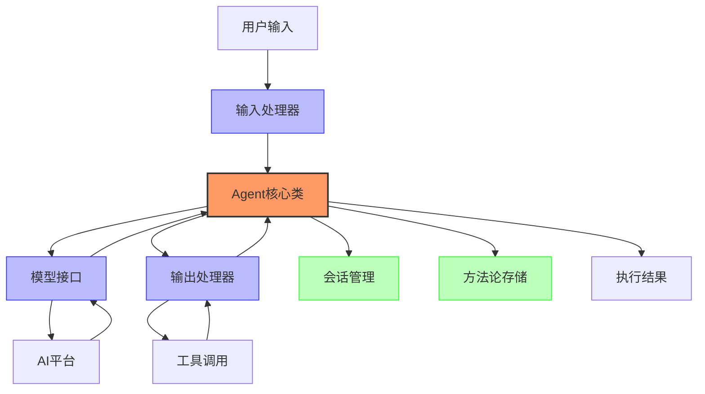
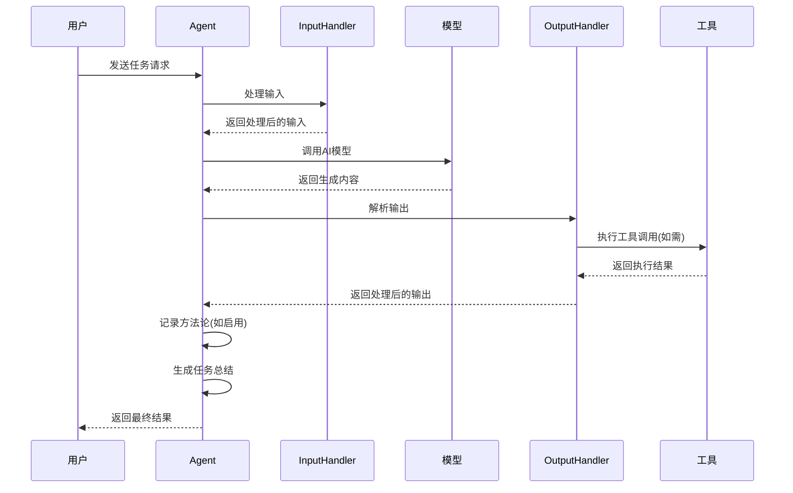

# 🤖 Jarvis Agent - 智能体定义框架

<div align="center">
  
  
  *构建和定义自定义AI智能体的框架*
  
  
  
  
</div>

## 🌈 魔法简介
Jarvis Agent 是一个强大的智能体构建框架，让开发者能够快速定义、配置和部署自定义AI智能体。它提供了灵活的接口用于智能体设计，包括系统提示词配置、输入/输出处理、模型选择等核心功能，使创建专业领域智能体变得简单而高效。

## ✨ 核心特性
- **智能体定义** - 快速创建自定义AI智能体及其行为模式
- **灵活模型集成** - 支持多种AI平台和模型的无缝接入
- **输入/输出处理** - 自定义输入解析和输出格式化逻辑
- **工具调用框架** - 为智能体提供强大的工具使用能力
- **上下文管理** - 智能维护长对话历史和状态
- **方法论存储** - 记录和重用有价值的解决方案

## 🚀 使用方法
```python
from jarvis.jarvis_agent import Agent

# 创建自定义智能体
my_agent = Agent(
    system_prompt="您是专门解决数据分析问题的助手",
    name="DataAnalyst",
    platform="openai",
    model_name="gpt-4"
)

# 运行智能体处理任务
result = my_agent.run("分析这个CSV文件并找出关键趋势: ./data.csv")
```

## 💻 命令行接口
也可以通过命令行直接使用基本智能体：
```bash
jarvis-agent -c <配置文件路径> [-t <初始任务>]
```

### 📋 必要参数
- `-c, --config <配置文件路径>` - 指定YAML配置文件路径（必需）

### 📋 可选参数
- `-t, --task <初始任务>` - 指定初始执行任务

### 📝 配置文件示例
```yaml
platform: "openai"        # 使用的AI平台
model: "gpt-4"            # 使用的模型
name: "TaskAssistant"     # 智能体名称
description: "任务助手"    # 智能体描述
system_prompt: |          # 系统提示词
  您是一个专注于任务规划和执行的助手。
  请根据用户需求提供详细的任务步骤。
```

## 🔮 智能体工作原理



Jarvis Agent 架构的核心组件：

1. **Agent类** - 智能体的主类，负责协调各个组件
2. **输入处理器** - 负责解析和处理用户输入
3. **模型接口** - 与各种AI平台和模型交互
4. **输出处理器** - 处理AI生成的响应并执行相应操作
5. **会话管理** - 维护对话历史和状态
6. **方法论记录** - 记录和管理问题解决方法

## 💼 典型应用

### 💻 自定义智能体开发
- **领域专家智能体** - 创建特定领域的专业知识智能体
- **工作流自动化** - 构建自动执行特定工作流的智能体
- **对话系统** - 开发具有特定人格和能力的对话智能体
- **工具使用代理** - 设计能够使用特定工具集的智能体

### 🔍 系统集成
- **服务整合** - 将智能体集成到现有服务中
- **API开发** - 将智能体能力包装为API服务
- **自动化流程** - 在自动化流程中嵌入智能体
- **定制解决方案** - 为特定业务需求创建智能解决方案


## 💎 Agent执行流程



---

<div align="center">
  <p><i>Jarvis Agent - 构建下一代智能体的框架</i></p>
</div> 