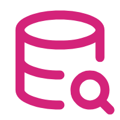

# 📚 Jarvis Codebase - 智能代码库管理

<div align="center">
  
  
  *您的代码库知识管家*
  
  
  
</div>

## 🌟 魔法简介
Jarvis Codebase 是一个革命性的代码库管理工具，它使用先进的向量搜索技术和语义理解能力，帮助您快速导航和理解复杂的代码库。它可以构建代码库的智能索引，支持基于自然语言的代码搜索和问答，让您与代码的交互变得前所未有的简单和高效。

## ✨ 核心特性
- **智能索引构建** - 自动分析代码结构和语义关系
- **语义代码搜索** - 使用自然语言查询相关代码片段
- **交互式代码问答** - 直接询问关于代码库的问题
- **知识图谱生成** - 自动构建代码组件之间的关系
- **文档自动导出** - 一键生成有洞察力的代码库文档

## 💫 适用场景
- **快速代码定位** - 在大型项目中迅速找到相关代码
- **新项目熟悉** - 快速了解陌生代码库的结构和逻辑
- **代码探索分析** - 深入理解复杂代码的工作原理
- **知识库构建** - 生成团队共享的代码知识库
- **架构理解** - 洞察代码库的整体结构和组件关系

## 🚀 使用方法
```bash
jarvis-codebase <command> [options]
```

### 📋 可用命令

#### 🔨 生成索引
```bash
jarvis-codebase generate [--force]
```
为当前目录的代码库生成智能索引。使用 `--force` 参数可强制重建已存在的索引。

#### 🔍 搜索代码
```bash
jarvis-codebase search <查询文本> [--top-k <结果数量>]
```
使用自然语言查询相关代码文件，返回最匹配的结果。

#### 💬 代码问答
```bash
jarvis-codebase ask <问题> [--top-k <相关文件数量>]
```
向代码库提问，获取基于代码分析的详细回答。

#### 📊 导出文档
```bash
jarvis-codebase export [--format <格式>] [--output <文件路径>]
```
导出代码库的结构和洞察报告，支持多种格式。

## 🔮 工作原理
<div align="center">
  
</div>

Jarvis Codebase 使用先进的向量嵌入技术，为每个代码文件和函数创建语义表示，构建一个可搜索的知识库：

1. **代码解析** - 解析源代码，提取文件、类、函数等结构
2. **向量化处理** - 将代码片段转换为高维向量表示
3. **索引构建** - 使用 FAISS 创建高效的向量索引
4. **语义搜索** - 将查询转换为向量并找到最相似的代码片段
5. **上下文增强** - 分析代码间的关系，提供更全面的答案

## 💎 使用示例

### 索引生成
首次使用时，需要为代码库生成索引：
```bash
# 进入项目根目录
cd ~/projects/my-awesome-app

# 生成索引
jarvis-codebase generate
```
```
🔍 正在扫描代码库...
📝 处理 237 个文件...
🔢 生成向量表示...
📊 构建索引...
✅ 索引创建成功！代码库已就绪。
```

### 代码搜索
使用自然语言查找相关代码：
```bash
jarvis-codebase search "用户身份验证流程"
```
```
找到 5 个相关文件:

1. src/auth/authentication.py (匹配度: 94%)
   - 主要负责用户身份验证的核心逻辑
   - 包含登录、注册和密码重置功能

2. src/auth/middleware.py (匹配度: 87%)
   - 实现身份验证中间件
   - 处理请求验证和会话管理

[其他结果...]
```

### 代码问答
向代码库提问：
```bash
jarvis-codebase ask "系统如何处理用户密码重置请求？"
```
```
📝 回答：

系统通过以下流程处理密码重置请求：

1. 用户请求密码重置时，系统会调用 `src/auth/password_reset.py` 中的 
   `initiate_reset` 函数，该函数：
   - 验证用户邮箱是否存在
   - 生成唯一的重置令牌
   - 设置令牌过期时间（24小时）
   - 发送包含重置链接的邮件

2. 用户点击链接后，系统验证令牌（在 `validate_reset_token` 函数中）并
   允许用户设置新密码。

3. 新密码通过 `src/utils/password_utils.py` 中的 
   `hash_password` 函数进行哈希处理后存储。

参考的主要文件：
- src/auth/password_reset.py
- src/auth/authentication.py
- src/utils/password_utils.py
```

## 💡 专家提示
- **定期更新索引** - 代码库有重大变更后重新生成索引
- **精确查询** - 使用具体、明确的查询语言获得更精确的结果
- **结合上下文** - 查询特定功能时提及相关模块名称
- **交互式探索** - 使用问答功能逐步深入了解复杂逻辑
- **导出文档** - 为新团队成员生成代码库导览文档

## 🔄 与其他工具集成
- 可与 **jarvis-code-agent** 配合使用，实现"询问并修改"工作流
- 结合 **jarvis-code-review** 进行更深入的代码质量分析
- 与 **jarvis-rag** 集成，同时检索代码和文档

---

<div align="center">
  <p><i>Jarvis Codebase - 让代码不再是谜团</i></p>
</div>

