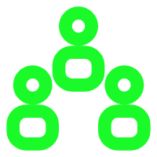

# 🌟 Jarvis Multi-Agent - 多智能体协作框架

<div align="center">
  
  
  *构建定制化智能协作系统*
  
  
  
</div>

## 🔮 魔法简介
Jarvis Multi-Agent 是一个强大的多智能体协作框架，允许您设计和构建自己的智能体团队。通过简单的配置，您可以定义各种专业角色、指定它们的能力和工具，并让它们协同工作解决复杂问题。这个框架为构建定制化AI协作系统提供了灵活而强大的基础。

## ✨ 核心特性
- **灵活的智能体定义** - 自由配置多种角色的专业智能体
- **结构化消息传递** - 智能体之间标准化的通信机制
- **中央协调系统** - 统一管理消息路由和任务分配
- **可扩展工具集成** - 为不同智能体分配专属工具
- **配置驱动架构** - 通过YAML配置文件定义整个系统

## 🏗️ 框架架构
### 核心组件
1. **MultiAgent类** - 框架的核心，管理智能体实例和消息路由
2. **智能体配置** - 定义各智能体的角色、能力和工具
3. **消息传递机制** - 智能体间标准化的通信协议
4. **工具集成接口** - 连接各种外部工具和服务

### 消息流转
```
用户输入 → 主智能体 → 消息路由 → 专业智能体 → 处理结果 → 消息路由 → 返回结果
```

## 🚀 使用方式
```bash
jarvis-multi-agent --config <配置文件路径> [--input <输入文本>]
```

### 🔧 配置文件结构 (YAML)
```yaml
# 多智能体系统配置示例
main_agent: "主智能体名称"  # 设置系统入口智能体
agents:
  - name: "Agent1"  # 智能体名称
    description: "智能体1的描述"  # 角色描述
    system_prompt: "详细的系统提示..."  # 智能体的系统提示
    platform: "平台名称"  # 使用的LLM平台
    model: "模型名称"  # 使用的模型
    
  - name: "Agent2"
    description: "智能体2的描述"
    system_prompt: "详细的系统提示..."
    platform: "平台名称"
    model: "模型名称"
    # 可以为每个智能体配置专用的输出处理器和工具
```

## 💎 应用场景
- **定制化专家团队** - 根据特定领域需求构建专业团队
- **智能协作流程** - 设计多步骤、多角色的复杂工作流
- **跨域问题解决** - 组合不同领域专家共同解决问题
- **自动化系统构建** - 创建能自主协作的智能系统
- **研究和教育** - 探索多智能体协作模式和效果

## 🔍 框架应用示例
### 构建软件开发团队
```yaml
main_agent: "PM"
agents:
  - name: "PM"
    description: "项目经理"
    system_prompt: "你是项目管理专家..."
    # 配置详情...
  
  - name: "DEV"
    description: "开发工程师"
    system_prompt: "你是编程专家..."
    # 配置详情...
  
  - name: "QA"
    description: "质量保证"
    system_prompt: "你是测试专家..."
    # 配置详情...
```

### 智能体间消息传递
智能体可以使用标准化格式相互发送消息：
```
<send_message>
to: 目标智能体
content: |
  # 消息主题
  
  ## 详细内容
  消息正文和具体任务...
</send_message>
```

## 🔮 开发指南
### 创建自定义智能体团队
1. **定义角色** - 确定需要哪些专业角色
2. **编写系统提示** - 为每个角色创建详细的指导提示
3. **配置工具访问** - 分配每个智能体可使用的工具
4. **设计工作流** - 规划智能体间的协作模式
5. **创建配置文件** - 将上述内容整合为YAML配置

### 高级功能开发
- **自定义输出处理器** - 创建特殊的响应处理逻辑
- **工具链集成** - 连接外部API和服务
- **状态管理** - 实现跨会话的状态保存和恢复
- **分析和监控** - 添加智能体行为的跟踪和分析

## 💫 最佳实践
- **明确角色边界** - 每个智能体应有清晰的职责范围
- **优化系统提示** - 精心设计提示以获得最佳性能
- **消息结构化** - 使用标准化格式提高通信效率
- **渐进式复杂度** - 从简单配置开始，逐步增加复杂性
- **持续优化** - 基于实际表现调整配置和提示

---

<div align="center">
  <p><i>Jarvis Multi-Agent - 构建您的专属智能协作系统</i></p>
</div> 