# Agent 系统架构设计

本文档围绕 Jarvis 的核心执行实体 Agent，基于源码与现有文档进行结构化设计说明，覆盖模块组成、职责与接口、与外部系统/环境的交互、模块间交互流程、参数说明与典型执行过程。目标读者为本项目开发者与高级用户。

- 代码参考：
  - src/jarvis/jarvis_agent/__init__.py（Agent 主实现）
  - docs/jarvis_book/3.核心概念与架构.md（整体架构与工作流）
- 相关核心组件：EventBus、MemoryManager、TaskAnalyzer、FileMethodologyManager、PromptManager、SessionManager、ToolRegistry、AgentRunLoop、TaskPlanner、PlatformRegistry/BasePlatform、工具执行器 execute_tool_call、输入处理器链 builtin_input_handler/shell_input_handler/file_context_handler、EditFileHandler/RewriteFileHandler 等


## 1. 设计目标与总体思路

- 轻协调、强委托：Agent 保持轻量化，侧重编排，将核心逻辑委托至独立组件（运行循环、工具注册表、平台适配层等）。
- 高解耦、可插拔：通过 Registry（ToolRegistry/PlatformRegistry）与事件总线（EventBus）实现能力可插拔与旁路扩展。
- 稳健运行：针对模型空响应、上下文超长、工具输出过大、异常回调等场景提供防御性处理。
- 易扩展与可观测：关键节点统一事件广播，支持 after_tool_call 回调动态注入；启动时输出资源统计，便于观测。
- 多场景友好：支持非交互模式、子 Agent 递归规划执行、文件上传/本地两种方法论与历史处理模式、工具筛选降噪等。


## 2. 模块组成（PlantUML）

下图展示 Agent 内部与其周边模块的静态组成与依赖关系，聚焦 Agent 直接协作的组件。

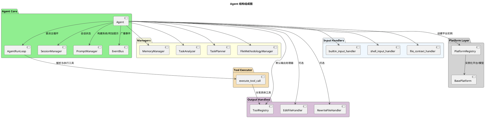


## 3. 模块功能说明

可视化与聚焦约定
- 图用于阐明“职责边界与关键交互”，不复述实现细节。
- 图型选择：组件图呈现边界与依赖；时序图呈现关键互动链路；活动图呈现决策路径或分流策略；必要时用状态图呈现状态与转换。
- 聚焦点：强调“职责/参与方/时机/约束与失败回退”，避免细节过载。
- 输出风格：每节先给“读者应带走的要点”，图用于支撑这些要点。

模块图型与聚焦清单
- Agent（协调中枢）
  - 图型：组件图（与 EventBus/Prompt/Session/Managers/Handlers 的关系）+ 精简时序图（初始化→委派→完成）
  - 聚焦：委派与事件广播边界；非交互/多 Agent/自动完成策略；工具筛选触发条件与系统提示重设时机
- AgentRunLoop（主循环）
  - 图型：活动图（循环判定、自动摘要阈值、工具调用与中断分支）
  - 聚焦：进入/跳出循环条件；auto_summary_rounds 触发；need_return 的短路返回
- ToolRegistry（工具注册与执行）
  - 图型：时序图（Agent→ToolRegistry→具体工具→返回）
  - 聚焦：单响应一次调用约束；格式容错；长输出分流策略
- execute_tool_call（统一入口）
  - 图型：时序图（选择处理器→可选确认→处理器执行→标准返回）
  - 聚焦：返回协议（need_return/tool_prompt）；多处理器冲突拒绝策略
- SessionManager（会话）
  - 图型：状态图（Active↔Persisted(file)；Clear 重置）或活动图（save/restore/clear）
  - 聚焦：清理历史后“保留系统提示约束”；保存/恢复文件命名与作用域
- PromptManager（提示）
  - 图型：数据流/组件图（system_prompt=系统规则+工具提示；addon_prompt=工具规范+记忆引导+完成标记）
  - 聚焦：拼装来源与回退策略（无 PromptManager 时的兼容）
- EventBus（事件）
  - 图型：时序图（emit→多订阅者回调→异常隔离）
  - 聚焦：关键事件节点与“旁路增强不影响主流程”的承诺
- MemoryManager（记忆）
  - 图型：活动图（TASK_STARTED/BEFORE_HISTORY_CLEAR/TASK_COMPLETED→是否 force_save_memory→prompt_memory_save）
  - 聚焦：强制保存门控；标签提示注入位置；工具存在性检查
- TaskPlanner（规划）
  - 图型：活动图（需拆分?/深度限制→子 Agent 执行→结果汇总写回）
  - 聚焦：不拆分条件；深度与步数上限；写回块 <PLAN>/<SUB_TASK_RESULTS>/<RESULT_SUMMARY>
- FileMethodologyManager（文件/方法论）
  - 图型：决策活动图（upload 模式 vs 本地模式；历史转移流程）
  - 聚焦：提示写回 session 的语义；上传失败回退到本地策略
- PlatformRegistry（平台）
  - 图型：组件+流程（目录扫描→校验→注册→创建/普通平台获取）
  - 聚焦：用户目录与内置目录合并策略；必需方法校验
- 输入处理器链 & 用户交互封装
  - 图型：管线式活动图（按序处理，遇 need_return 提前返回；多行输入签名兼容）
  - 聚焦：提前返回对主循环的影响；交互层可替换性（CLI→TUI/WebUI）
- EditFileHandler/RewriteFileHandler（文件写入）
  - 图型：活动图（PATCH 单点/区间校验→原子写入；REWRITE 整文件回滚）
  - 聚焦：唯一匹配/区间合法性；原子写与回滚保障

读者使用建议
- 先读“模块职责要点”，再看“对应图”，如需实现细节再去源码。文档图用于建立“概念模型”，不替代源码阅读。

- Agent（核心协调者）
  - 初始化并组装组件（EventBus/Managers/Handlers/Platform/Session）
  - 设置系统提示，首轮按需进行工具筛选与文件/方法论处理
  - 将主运行循环委派给 AgentRunLoop
  - 在关键节点广播事件（TASK_STARTED、BEFORE/AFTER_MODEL_CALL、BEFORE/AFTER_HISTORY_CLEAR、BEFORE/AFTER_ADDON_PROMPT、BEFORE/AFTER_SUMMARY、BEFORE_TOOL_FILTER、TOOL_FILTERED、AFTER_TOOL_CALL、INTERRUPT_TRIGGERED）
- AgentRunLoop（主循环执行体）
  - 驱动“模型思考 → 工具执行 → 结果拼接/中断处理 → 下一轮”的迭代
  - 统一处理工具返回协议与异常兜底，支持自动完成
- SessionManager（会话状态）
  - 管理 prompt、附加提示、会话长度计数、用户数据；负责保存/恢复/清理历史
- PromptManager（提示管理）
  - 构建系统提示（系统规则 + 工具使用提示），构建默认附加提示（工具规范 + 记忆提示）
- EventBus（事件总线）
  - 提供 subscribe/emit/unsubscribe；同步回调异常隔离，不影响主流程
- ToolRegistry（工具注册表，默认输出处理器）
  - 发现/加载/执行工具（内置、外部 .py、MCP）；解析 TOOL_CALL，执行并返回标准化结果
- EditFileHandler/RewriteFileHandler
  - 文件编辑/重写能力；可通过 disable_file_edit 禁用
- MemoryManager（记忆管理）
  - 记忆标签提示注入；关键事件驱动下进行记忆整理/保存；与 save/retrieve/clear_memory 工具协作
- TaskAnalyzer（任务分析）
  - 任务完成阶段旁路分析与满意度收集；必要时沉淀方法论
- TaskPlanner（任务规划）
  - 递归任务拆分与子任务调度；将 <PLAN>/<SUB_TASK_RESULTS>/<RESULT_SUMMARY> 写回父 Agent 上下文
- FileMethodologyManager（文件与方法论）
  - 基于平台能力选择“文件上传模式”或“本地模式”；加载/上传方法论；上下文溢出时以文件方式转移历史
- PlatformRegistry/BasePlatform（平台/模型）
  - 屏蔽不同 LLM 服务商差异；Agent 通过统一接口 chat_until_success/set_system_prompt/upload_files 等进行交互
- 工具执行器 execute_tool_call
  - 解析模型响应中的工具调用，仅允许单次调用；执行前确认、执行后回调、长输出处理（上传或智能截断）等

### 3.1 Agent 设计

#### 内部实现结构（PlantUML）
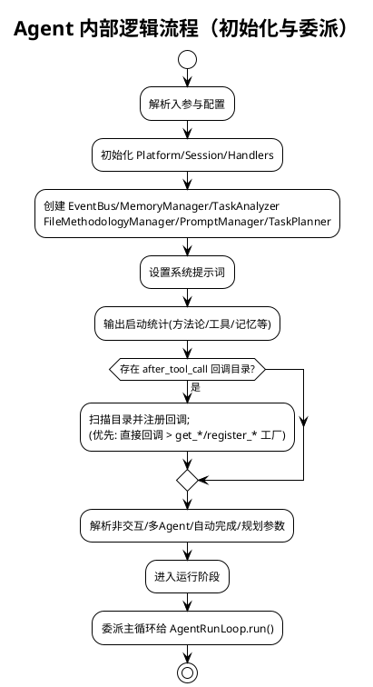

- 职责与定位：
  - 轻量协调者：初始化组件、构建系统/附加提示、委派主循环、广播事件
  - 通过 Registry 与事件总线实现可插拔能力与旁路扩展
- 核心方法：
  - __init__: 解析参数与配置；初始化 Platform/Session/Handlers/Managers/Prompt；设置系统提示；统计资源；加载 after_tool_call 回调
  - run/_main_loop: 进入主循环，委派 AgentRunLoop
  - _call_model/_invoke_model: 输入处理、附加提示拼接、上下文计数与模型调用（含 BEFORE/AFTER_MODEL_CALL 事件）
  - _call_tools: 工具执行委派至 execute_tool_call
  - _complete_task: 处理总结与任务完成事件，触发记忆/分析旁路
  - _filter_tools_if_needed: 工具超过阈值时使用临时模型筛选并重设系统提示
  - _summarize_and_clear_history: 上下文过长的摘要/文件上传分流与历史清理
- 关键参数影响行为：auto_complete、need_summary、use_methodology、use_analysis、execute_tool_confirm、force_save_memory、non_interactive、in_multi_agent、plan/plan_max_depth/plan_depth、disable_file_edit、use_tools/files 等
- 小型结构图：
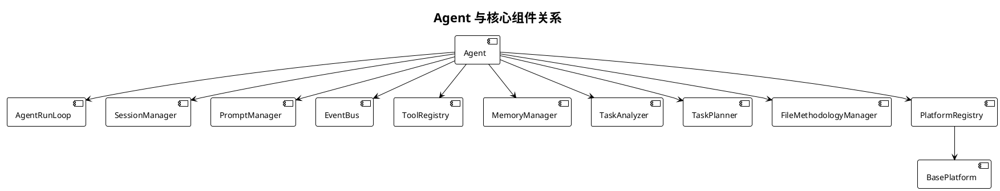

#### 历史清理与摘要分流（Agent）
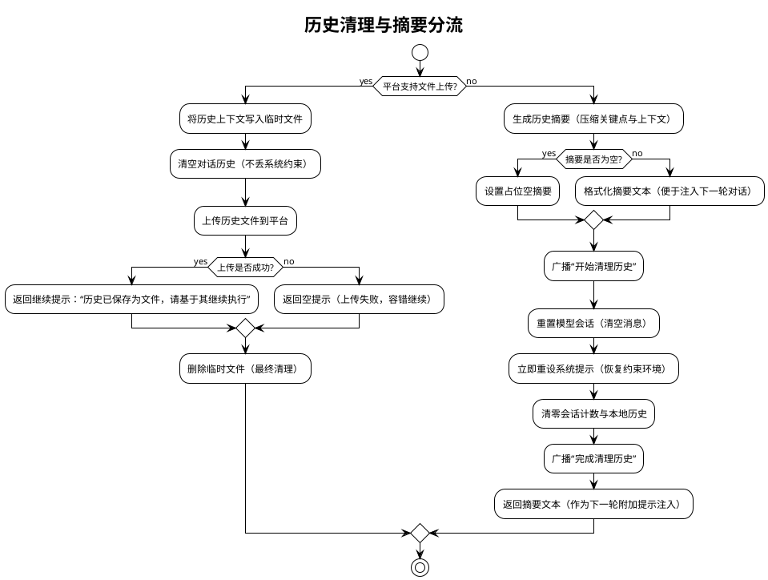

图示说明
- 分流依据：根据平台是否支持文件上传选择路径；支持时将历史写为文件上传；不支持则生成摘要
- 关键约束：清理历史后必须重设系统提示，避免丢失行为规范与工具约束
- 失败回退：上传失败返回空提示；摘要为空则使用占位文本；流程不中断

#### 工具筛选流程（Agent._filter_tools_if_needed）
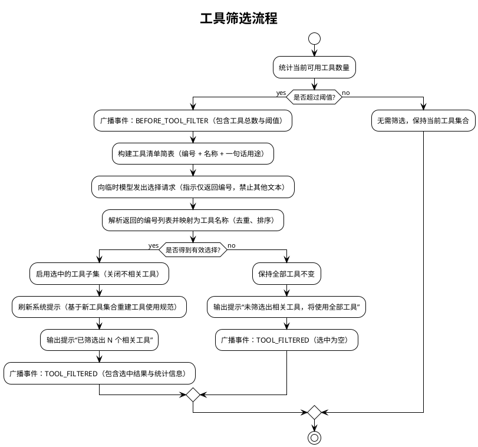

图示说明
- 触发条件：仅当可用工具数量超过阈值时进行筛选；否则保持原集合
- 选择方式：向临时模型请求“只返回编号”，再映射为工具名；启用子集后需刷新系统提示以降低决策复杂度
- 容错路径：未选出任何工具时维持原集合并继续任务

### 3.2 AgentRunLoop 设计
- 职责：承载主运行循环；控制迭代、工具执行、拼接提示、处理中断与完成
- 核心流程：
  - 首轮初始化（由 Agent._first_run 触发）后循环执行：
    1) _call_model → 获取响应
    2) execute_tool_call → 执行工具（若识别到 TOOL_CALL）
    3) join_prompts → 拼接工具结果
    4) _handle_run_interrupt → 处理用户中断（INTERRUPT_TRIGGERED）
    5) 自动完成检测（!!!COMPLETE!!!）→ _complete_task
- 事件：在工具与模型调用关键节点广播 BEFORE/AFTER_TOOL_CALL、BEFORE/AFTER_MODEL_CALL
- 返回协议：当工具返回 need_return=True，立即返回当前上下文；否则继续循环

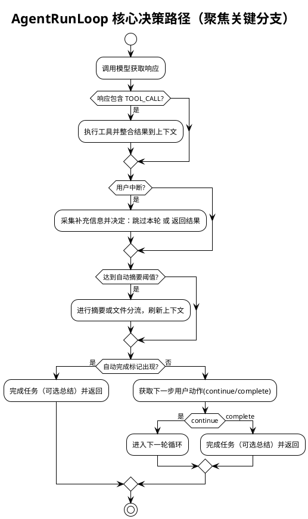

### 3.3 SessionManager 设计

读者要点
- 会话语义：清理历史仅重置对话与计数，但保留并立即重新应用系统提示，确保约束持续生效
- 保存/恢复作用域：基于平台名与模型名生成唯一文件名，避免跨平台/模型污染；恢复后自动删除文件
- 使用场景：长对话需释放上下文时的重置；跨运行的会话持久化与恢复
- 风险与约束：清理后必须重新设置系统提示；恢复失败或文件缺失时应平稳回退，不影响主流程

#### 内部逻辑结构（PlantUML）
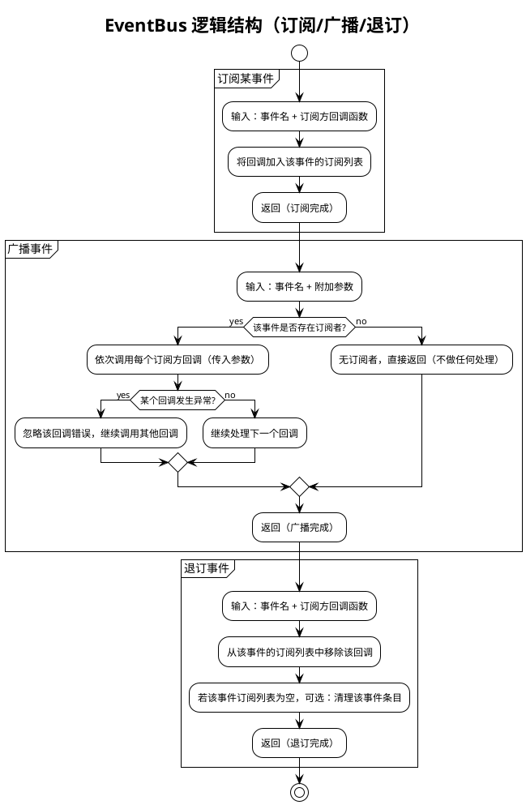

图示说明
- 目的：以“事件名”为索引，支持外部模块在关键节点进行旁路扩展（统计、记忆、分析等），不干扰主流程
- 异常处理：广播过程中单个订阅回调失败被忽略并继续执行其他订阅者，保证主流程稳定
- 边界：EventBus 不做业务判断与流程控制，仅负责调用订阅者；是否保存记忆/执行分析由订阅者自行决定
- 使用建议：为每类关键节点定义清晰事件名（如 BEFORE_MODEL_CALL、AFTER_TOOL_CALL 等），订阅者内部做好容错与幂等

- API：subscribe(callback)、emit(event, **kwargs)、unsubscribe(callback)
- 特性：同步广播、回调异常隔离，便于旁路扩展（记忆保存、任务分析、统计）

#### 事件总线全局事件流（总览图）
下图以通俗步骤展示“任务启动 → 模型/工具 → 历史清理 → 总结 → 完成”的全链路广播与响应，弱化内部术语，便于整体理解。

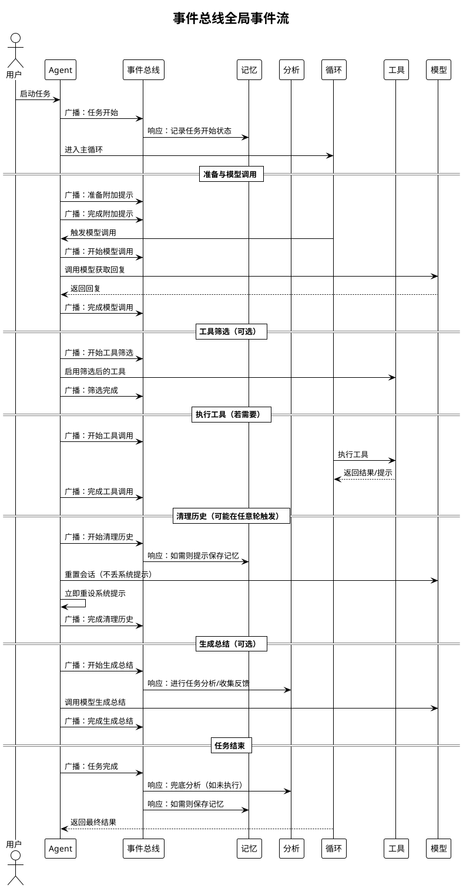

图示说明
- 图使用“广播/响应/调用/返回”等通俗术语；不展示内部函数名与具体实现
- “可选”表示仅在特定条件触发（如工具筛选、生成总结）
- 实际事件名在代码中对应 TASK_STARTED、BEFORE/AFTER_MODEL_CALL、BEFORE/AFTER_TOOL_CALL、BEFORE/AFTER_HISTORY_CLEAR、BEFORE/AFTER_SUMMARY 等；图强调流程含义，避免细节干扰

### 3.6 ToolRegistry 设计
- 角色：默认输出处理器，解析并执行 TOOL_CALL
- 加载来源：内置工具、外部 .py 工具、MCP 工具（外部进程）
- 执行协议：
  - 单步约束：一次响应仅允许一个调用块，检测到多个则拒绝执行
  - 结束标签容错：缺失结束标签时尝试自动补全并提示规范
  - 大输出处理：平台支持时上传文件并清理历史；否则智能截断（前后各 30 行）
  - 统计与记录：执行计数与最近执行工具记录（__last_executed_tool__/__executed_tools__）
- 微结构图：
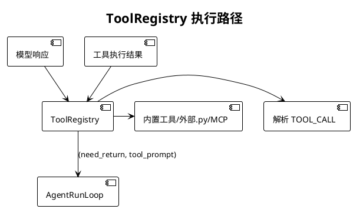

#### 关键交互时序（PlantUML）
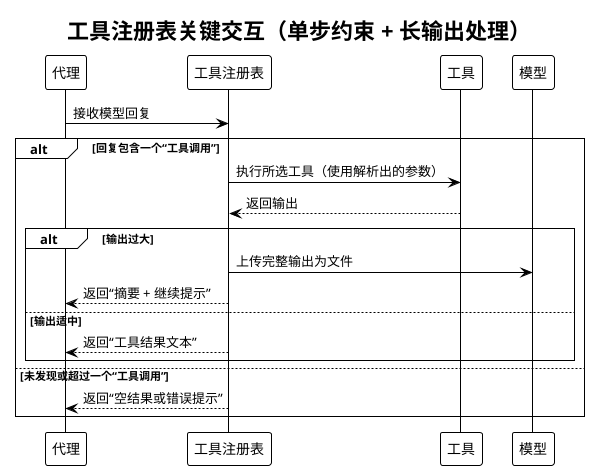

图示说明
- 单步约束：每次回复仅允许一个工具调用；多个调用直接拒绝并提示规范
- 长输出处理：优先按平台能力上传文件并提供简短摘要；不支持上传时进行智能截断（保留头/尾片段）
- 返回约定：统一返回“是否需立即结束本轮 + 文本提示”，主循环据此决定直接返回或继续迭代

### 3.7 EditFileHandler / RewriteFileHandler 设计

读者要点
- 用途：在单步响应中进行最小必要变更（PATCH）或整文件替换（REWRITE）
- 安全约束：PATCH 强制唯一匹配（SEARCH 仅一次命中）；区间替换需合法起止标记；REWRITE 采用原子写并可回滚
- 选择策略：优先 PATCH（影响最小），仅在大范围重构或整文件生成时使用 REWRITE
- 结果呈现：返回成功与差异摘要；失败时明确说明原因（未命中、多处命中、区间非法等）

关键决策路径（活动图）
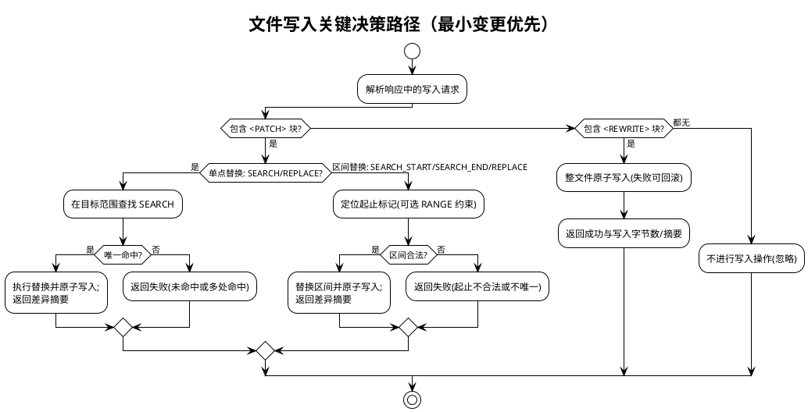

### 3.8 MemoryManager 设计

#### 内部逻辑结构（PlantUML）
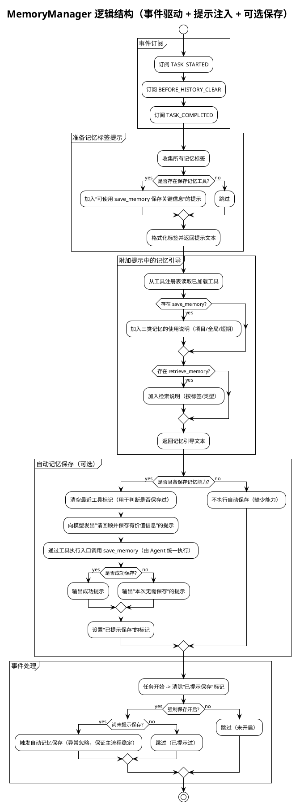

图示说明
- 事件驱动：在任务开始、历史清理前、任务完成后按需触发“提示或执行记忆保存”，不阻塞主流程
- 提示注入：将记忆标签与工具使用说明拼入每轮附加提示，促进模型主动使用记忆工具
- 能力门控：仅在存在 save_memory/retrieve_memory 工具时提供对应指引与自动保存；否则安全跳过
- 强制保存：force_save_memory 开启且尚未提示时，在 BEFORE_HISTORY_CLEAR 或 TASK_COMPLETED 触发一次自动保存
- 容错：自动保存调用异常被忽略，不影响任务输出与流程推进；状态标记避免重复提示

#### 记忆类型与存储策略
- 短期记忆（short_term）
  - 存储位置：进程内存（jarvis_utils.globals.add_short_term_memory / get_short_term_memories）
  - 生命周期：仅在当前任务/进程内有效，不落盘；适合临时上下文、当前步骤的中间信息
  - 检索方式：retrieve_memory memory_types=["short_term"]，可按标签过滤
- 项目长期记忆（project_long_term）
  - 存储位置：当前项目目录 .jarvis/memory 下，JSON 文件按条目存储
  - 适用内容：项目相关的约定、配置、实现细节、架构决策等
  - 作用域：当前仓库/目录；随项目版本控制与协作共享更方便
- 全局长期记忆（global_long_term）
  - 存储位置：数据目录 get_data_dir()/memory/global_long_term 下，JSON 文件按条目存储
  - 适用内容：通用方法论、常用命令、用户偏好、跨项目知识与最佳实践
  - 作用域：同一用户在本机的所有项目/任务通用

数据模型（统一结构）
- 字段：id、type（memory_type）、tags、content、created_at、updated_at（可选）、merged_from（整理后可选）
- 命名与ID：save_memory 按微秒级时间戳生成唯一 ID（例如 20251101_072947_388226）

#### 记忆整理（MemoryOrganizer）
- 目标：合并标签高度重叠的长期记忆，消除冗余、提升可检索性
- 适用类型：project_long_term、global_long_term（不处理 short_term）
- 合并策略：
  - 基于标签重叠度（min_overlap ≥ 2），按重叠数量从高到低分组
  - 调用 LLM 将同组记忆合并为一个综合记忆（最近时间权重更高）
  - 生成 YAML 格式的 <merged_memory>，包含 content 与 tags；解析后写为新记忆，并删除原始条目
- 使用方法（CLI）：
  - 整理（模拟运行）：jarvis-memory-organizer organize --type project_long_term --dry-run
  - 整理（指定重叠数）：jarvis-memory-organizer organize --type global_long_term --min-overlap 3
  - 导出：jarvis-memory-organizer export output.json -t project_long_term -t global_long_term --tag API
  - 导入：jarvis-memory-organizer import memories.json --overwrite
- 平台选择：统一使用 normal 平台与模型（PlatformRegistry.get_global_platform_registry），支持通过 -g/--llm-group 覆盖模型组
- 数据安全与回滚：
  - 新记忆创建后再删除旧记忆文件，失败日志汇总输出
  - 导出/导入支持类型校验、标签过滤、覆盖策略；异常明确告警且不中断其他记录

#### 典型使用场景
- 在任务完成前自动提示保存本次关键经验（force_save_memory 开启）
- 在复杂项目中将架构决策与约定沉淀为 project_long_term，跨项目方法论沉淀为 global_long_term
- 在对话中临时缓存当前轮上下文与关键结论为 short_term，便于下一步工具调用
- 定期使用 MemoryOrganizer 合并重复/冗余的长期记忆，保持知识库整洁与高质

### 3.9 TaskAnalyzer 设计

读者要点
- 触发时机：生成总结前（BEFORE_SUMMARY）优先触发；若无总结需求，则在 TASK_COMPLETED 兜底触发
- 目标产出：基于任务过程沉淀方法论/改进建议，并收集“是否满意”的反馈
- 对主流程影响：旁路执行；回调异常或失败不影响任务完成；完成后设置去重标记避免重复分析

关键交互（PlantUML）
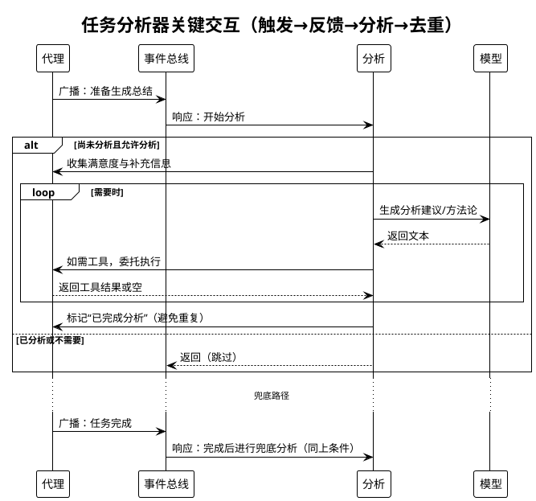

图示说明
- 触发：生成总结前优先；无总结需求时在任务完成阶段兜底触发一次
- 产出：方法论与改进建议；同时收集满意度反馈
- 去重：设置“已完成分析”标记，避免重复分析
- 容错：分析过程中模型或工具出错忽略返回，不影响任务完成

输出与约束
- 输出：方法论/改进建议（写入会话上下文，由上层继续整合），满意度反馈记录
- 约束：仅在 use_analysis 启用时执行；触发一次后设置去重标记
- 容错：模型/工具异常不影响主流程；中断时优先采集用户补充信息再继续分析

### 3.10 TaskPlanner 设计
- 职责：复杂任务拆分与子任务调度，控制递归深度（plan_max_depth/plan_depth）
- 产出：<PLAN>（YAML 列表）、<SUB_TASK_RESULTS>、<RESULT_SUMMARY> 合并回父 Agent 上下文
- 子 Agent 构造：通过 _build_child_agent_params 继承父 Agent 能力与配置，默认非交互自动完成

#### 内部逻辑流程（PlantUML）
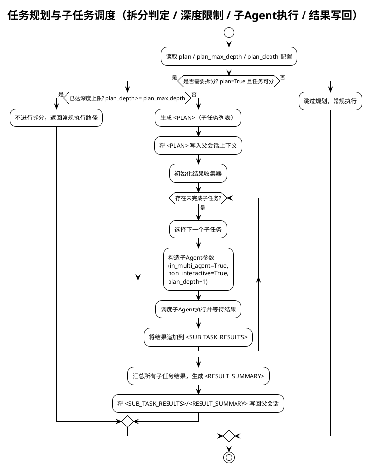

图示说明
- 触发条件：仅在 plan=True 且任务可拆分时进入规划路径
- 深度限制：plan_depth >= plan_max_depth 时不再递归拆分
- 子 Agent：默认非交互自动完成，继承父 Agent 能力与配置
- 写回约定：将 <PLAN>/<SUB_TASK_RESULTS>/<RESULT_SUMMARY> 写回父会话，便于后续模型使用
- 容错：单个子任务失败不阻断整体流程，按需记录并继续其他子任务

### 3.11 FileMethodologyManager 设计
- 模式选择：
  - 文件上传模式：平台支持 upload_files 时，方法论与历史以文件上传
  - 本地模式：不支持上传时，加载本地方法论库并管理上下文
- 历史处理：handle_history_with_file_upload 在上下文溢出时转移历史并返回继续提示

#### 内部逻辑流程（PlantUML）
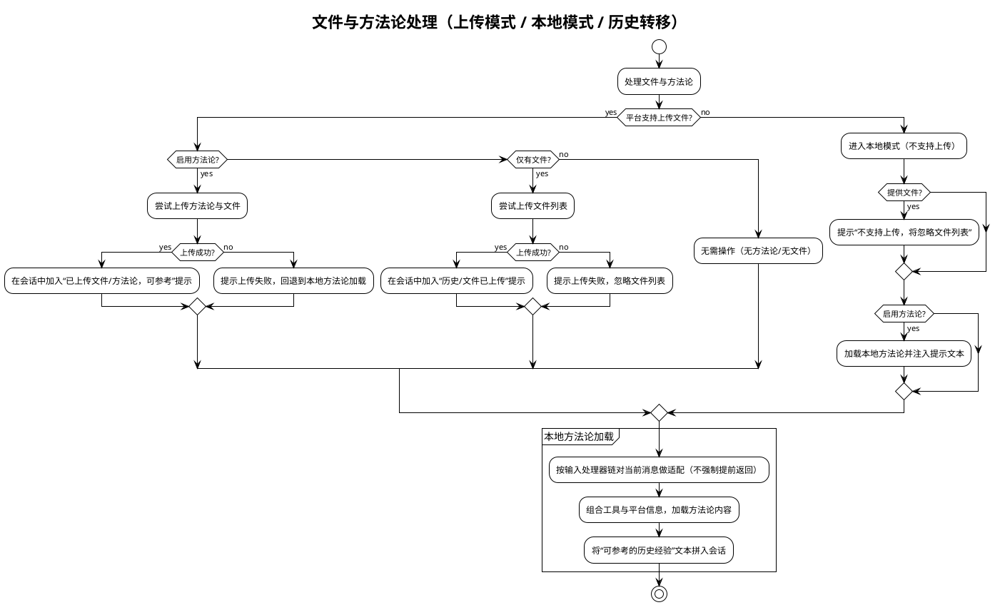

图示说明
- 模式选择：优先“上传模式”（平台支持时），否则“本地模式”加载方法论与经验
- 提示注入：成功上传或成功加载后，将“可参考经验/已上传文件”文本拼入会话，便于引用
- 失败回退：上传失败不阻断流程；方法论加载失败时回退为常规对话
- 输入处理器：本地方法论加载前对当前消息做轻量适配（如从文件/终端输入抽取上下文），不强制提前返回
- 无操作路径：既不启用方法论也无文件时，本轮不处理，保持最小影响

#### 历史转移（上下文过长）流程
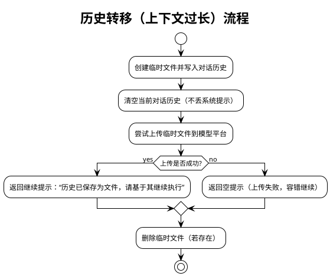

### 3.12 PlatformRegistry / BasePlatform 设计
- PlatformRegistry：动态创建平台实例，选择“普通平台/模型”，兼容不同厂商
- BasePlatform：统一接口（chat_until_success、set_system_prompt、upload_files、reset、set_model_name/group、name/platform_name）
- 行为：Agent 通过该层以统一方式与不同 LLM 平台交互，并按平台能力决定是否支持文件上传等增强特性

读者要点
- 边界与职责：统一发现与注册平台实现；向上提供“创建平台实例/获取普通平台”的简化接口
- 能力归一：通过 BasePlatform 接口屏蔽不同厂商差异（聊天/系统提示/文件上传等）
- 生命周期：启动时加载用户目录与内置目录的实现；运行时按名称创建实例或返回“普通平台”
- 失败回退：未找到平台或创建失败时进行明确告警并返回 None，不阻断上层流程

可视化（组件 + 关键流程）
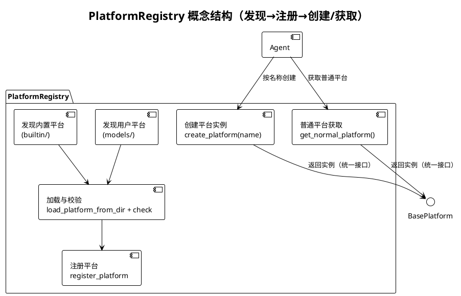

### 3.13 工具执行器 execute_tool_call 设计

#### 内部逻辑流程（PlantUML）
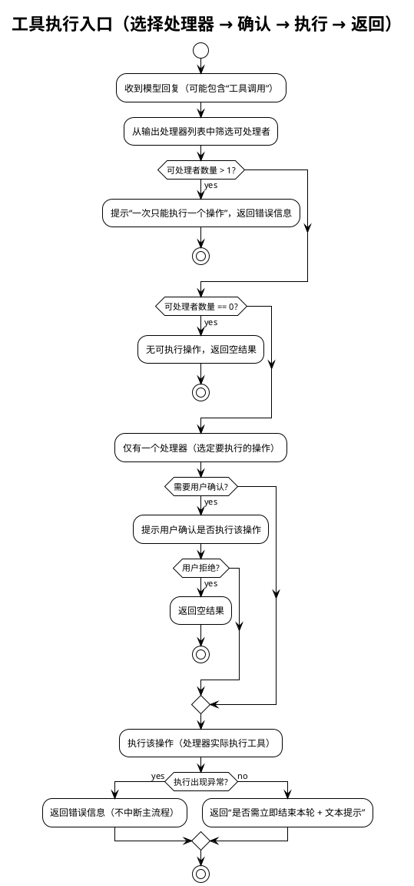

图示说明
- 入口职责：统一选择并执行一个合适的输出处理器（如工具、文件写入等），返回标准结果
- 约束与容错：一次仅执行一个操作；执行前可选确认；异常不影响主循环稳定推进
- 返回约定：统一返回“是否立即结束本轮 + 文本提示”，主循环据此决定直接返回或继续迭代

- 职责：统一解析模型响应中的 TOOL_CALL，执行业务处理并返回标准协议
- 协议：返回 (need_return: bool, tool_prompt: str)；need_return=True 时由运行循环直接返回结果
- 策略：执行前确认（execute_tool_confirm）；after_tool_call 回调（由 EventBus 与动态注入目录触发）；长输出与格式容错见 ToolRegistry 章节

### 3.14 输入处理器链与用户交互封装

#### 内部逻辑流程（PlantUML）
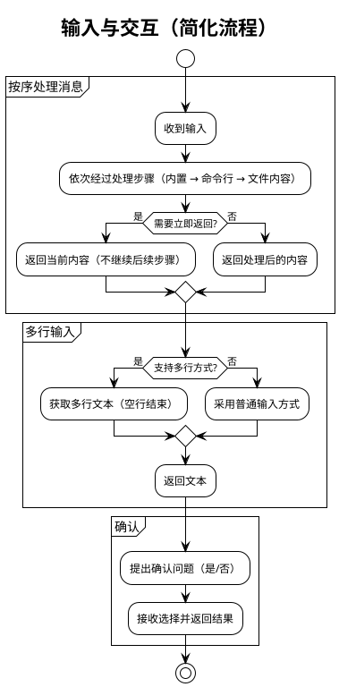

- 输入处理器：builtin_input_handler、shell_input_handler、file_context_handler（按序处理，返回 need_return 标志控制是否提前返回）
- UserInteractionHandler：
  - 多行输入：兼容函数签名 func(tip, print_on_empty) 与 func(tip)
  - 确认交互：封装 confirm 回调，便于替换为 TUI/GUI/WebUI

#### 用户交互封装（UserInteractionHandler）内部逻辑结构
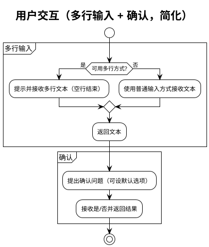

- 目标：抽象用户交互（多行输入与确认），便于未来替换为 TUI/WebUI
- 兼容策略：优先使用带 print_on_empty 的多参签名，失败时回退为单参签名；confirm 委派保持一致行为

### 3.15 事件与回调扩展
- 事件常量：TASK_STARTED/COMPLETED、BEFORE/AFTER_MODEL_CALL、BEFORE/AFTER_HISTORY_CLEAR、BEFORE/AFTER_SUMMARY、BEFORE_TOOL_FILTER/TOOL_FILTERED、AFTER_TOOL_CALL、INTERRUPT_TRIGGERED、BEFORE/AFTER_ADDON_PROMPT
- 动态回调：扫描 JARVIS_AFTER_TOOL_CALL_CB_DIRS；支持 after_tool_call_cb、get_after_tool_call_cb()、register_after_tool_call_cb() 三种导出形式；回调包装隔离异常


## 4. 与外部系统/环境的交互

- LLM 平台与模型
  - 通过 PlatformRegistry 动态创建 BasePlatform 实例，统一设置模型名称/组；Agent 使用 chat_until_success/set_system_prompt 调用
  - 支持文件上传：当模型支持 upload_files，历史与大输出以文件上传方式释放/节省上下文
- 工具生态
  - ToolRegistry 加载内置工具、外部 .py 工具与 MCP 工具；MCP 工具通过外部进程提供能力，支持跨应用集成
- 文件与方法论仓库
  - 加载本地方法论库；可与中心方法论库通过 Git 同步，实现团队共享最佳实践
- 记忆系统
  - 三层记忆：短期（内存）、项目长期（.jarvis/memory）、全局长期（~/.jarvis/data/memory/global_long_term）
  - 通过 save_memory/retrieve_memory/clear_memory 工具使用
- CLI 与环境变量/配置
  - 通过 CLI 运行任务；支持 JARVIS_NON_INTERACTIVE 等环境变量控制非交互模式
  - 通过 jarvis_utils.config 获取默认配置（如计划开关、筛选阈值、after_tool_call 回调扫描目录等）
- 动态回调注入
  - 读取 JARVIS_AFTER_TOOL_CALL_CB_DIRS 指定目录下的 Python 文件，动态注册 after_tool_call 回调（三种导出方式优先级约定），用于旁路增强工具调用后处理
- 可观测性
  - show_agent_startup_stats 启动统计：输出方法论数量、工具可用数/总数、全局/项目记忆数量、工作目录等


## 5. 模块间交互流程（PlantUML）

下图展示一次典型端到端执行过程的时序，涵盖初始化、首轮处理、模型调用、工具执行与收尾。

```plantuml
@startuml
!theme vibrant
title 端到端执行流程（简化）

actor 用户 as User
participant "代理" as Agent
participant "循环" as Loop
participant "平台" as Platform
participant "工具" as Tools
participant "记忆" as Mem
participant "规划" as Planner
participant "方法论" as Fm

User -> Agent : 启动任务
Agent -> Agent : 初始化与准备（平台/工具/方法论/记忆）
Agent -> Planner : 规划任务 [可选]
Agent -> Fm : 处理文件与方法论 [可选]
Agent -> Loop : 进入循环

Loop -> Agent : 准备提示与输入
Agent -> Platform : 调用模型
Platform --> Agent : 返回回复

alt 回复包含工具调用
  Agent -> Tools : 执行工具
  Tools --> Agent : 返回结果/提示
end

alt 上下文过长
  Agent -> Platform : 重置会话（保留规则）
  Agent -> Agent : 立即重设系统提示
end

alt 任务完成
  Agent -> Mem : 保存/整理记忆 [按需]
  Agent -> Agent : 生成总结 [可选]
  Agent --> User : 输出结果
else 继续迭代
  Loop --> Loop : 下一轮
end
@enduml
```


## 6. 参数与配置说明

以下参数来自 Agent.__init__。默认值或行为参考 jarvis_utils.config 与内部回退逻辑。除特别标注外，布尔型参数可通过入参覆盖配置默认值。

- system_prompt: 系统提示词，定义 Agent 行为准则（必要）
- name: Agent 名称，默认 "Jarvis"，用于全局登记与交互提示
- description: Agent 描述信息
- model_group: 模型组标识，用于按组选择平台与模型（get_normal_platform_name/get_normal_model_name）
- summary_prompt: 任务总结提示词；为空时回退 DEFAULT_SUMMARY_PROMPT 或 SUMMARY_REQUEST_PROMPT
- auto_complete: 自动完成开关；非交互模式默认开启；多智能体模式下仅在显式 True 时开启
- output_handler: 输出处理器列表；默认 [ToolRegistry,(EditFileHandler),(RewriteFileHandler)]（括号内可禁用）
- use_tools: 指定允许使用的工具名白名单；为空时加载默认集合；当工具过多时 Agent 首轮可触发 AI 筛选并动态缩减
- execute_tool_confirm: 执行工具前是否进行用户确认（可由配置 is_execute_tool_confirm 决定）
- need_summary: 是否在完成阶段生成总结
- auto_summary_rounds: 自动摘要轮次上限（由 AgentRunLoop 读取并决定触发时机）
- multiline_inputer: 多行输入函数；由 UserInteractionHandler 进行向后兼容封装
- use_methodology: 是否启用方法论引导；默认从配置读取（is_use_methodology）
- use_analysis: 是否启用任务完成后的分析（TaskAnalyzer）；默认从配置读取（is_use_analysis）
- force_save_memory: 是否在关键节点强制提示/执行记忆保存；默认从配置读取（is_force_save_memory）
- disable_file_edit: 禁用文件编辑相关输出处理器（EditFileHandler/RewriteFileHandler）
- files: 需要处理或上传的文件列表（触发 FileMethodologyManager 处理）
- confirm_callback: 确认回调，签名 (tip: str, default: bool) -> bool；默认 CLI user_confirm
- non_interactive: 非交互模式（最高优先级）；若显式提供会同步到环境变量 JARVIS_NON_INTERACTIVE
- in_multi_agent: 多智能体运行标志；用于控制自动完成（子 Agent 默认非交互自动完成）
- plan: 是否启用任务规划与子任务拆分（默认从配置 is_plan_enabled）
- plan_max_depth: 规划最大深度（默认 get_plan_max_depth，异常回退 2）
- plan_depth: 当前规划深度（父 +1 传递至子；默认 0）
- agent_type: "normal" 或 "code"；"code" 时构造 CodeAgent（转发构造参数）

行为与默认策略补充
- 非交互与自动完成：
  - 非交互模式（或子 Agent）默认自动完成为 true；多智能体模式时除非显式 True 否则不自动完成
- 工具筛选：
  - 可用工具数超过阈值（get_tool_filter_threshold）时，使用临时模型产生选择编号，更新 ToolRegistry.use_tools，并重置系统提示
- 大输出处理：
  - 平台支持上传：生成摘要并清理历史后，上传大输出文件，返回“摘要 + 调用上下文”提示继续
  - 平台不支持：智能截断前 30/后 30 行，中间以占位提示
- 历史与上下文：
  - conversation_length 由 get_context_token_count 计数；超过阈值时走摘要或文件上传流程（FileMethodologyManager 处理）
- 动态回调：
  - 扫描 JARVIS_AFTER_TOOL_CALL_CB_DIRS，支持 after_tool_call_cb、get_after_tool_call_cb()、register_after_tool_call_cb() 三种导出形式；注入 AFTER_TOOL_CALL 回调


## 7. 典型执行过程（端到端）

以“分析代码并修改某个函数”为例（伪场景）：
1. CLI 将用户需求交给 Agent.run
2. Agent 初始化与启动统计：加载 Platform 与 ToolRegistry；设置系统提示；输出方法论/工具/记忆统计信息
3. 首轮处理：
   - FileMethodologyManager：若平台支持上传，尝试上传 files 与方法论；否则本地加载
   - MemoryManager：准备记忆标签提示并注入上下文
   - 工具筛选（可选）：当工具过多时用临时模型筛选相关工具子集，更新系统提示
4. 进入 AgentRunLoop：
   - 生成 addon prompt（包含工具使用规则、记忆提示、是否需要 !!!COMPLETE!!! 标记）
   - 调用 BasePlatform.chat_until_success 获取响应
   - 若响应包含 TOOL_CALL，交由 ToolRegistry 解析并执行对应工具（如 read_code 或 patch）
   - 工具输出拼接回上下文（utils.join_prompts），广播 AFTER_TOOL_CALL；need_return=True 时直接返回结果
   - 若用户中断（INTERRUPT_TRIGGERED），采集补充输入，决定是否继续或跳过当前轮
   - 检查自动完成：检测到 !!!COMPLETE!!! 或 ot('!!!COMPLETE!!!') 标记进入收尾
5. 收尾：
   - 通过事件驱动执行 TaskAnalyzer 分析、MemoryManager 记忆保存（受 force_save_memory 控制）
   - need_summary=True 时生成总结
   - 返回最终结果至 CLI

```plantuml
@startuml
!theme vibrant
title 典型执行过程（代码分析与修改，简化）

actor 用户 as User
participant "界面" as UI
participant "代理" as Agent
participant "循环" as Loop
participant "平台" as Platform
participant "工具" as Tools
participant "文件修改器" as Writer
participant "记忆" as Mem
participant "事件总线" as Bus

User -> UI : 描述需求
UI -> Agent : 发送任务
Agent -> Bus : 广播：任务开始
Agent -> Agent : 首轮准备（工具筛选/文件与方法论/记忆标签）[可选]
Agent -> Loop : 进入主循环

Loop -> Agent : 生成提示并准备输入
Agent -> Platform : 调用模型
Platform --> Agent : 返回回复（可能包含工具调用）

alt 需要工具
  Agent -> Tools : 执行工具
  Tools --> Agent : 返回结果/提示
end

alt 需要修改文件
  Agent -> Writer : 应用变更
  Writer --> Agent : 返回修改结果
end

Agent -> Bus : 广播：步骤完成

alt 检测到完成
  Agent -> Agent : 生成总结 [可选]
  Agent -> Mem : 保存/整理记忆 [按需]
  Agent -> Bus : 广播：任务完成
  Agent --> UI : 输出结果
else 继续迭代
  Loop --> Loop : 下一轮
end
@enduml
```

该过程对长输出、上下文长度与外部失败具备防御性回退策略，保证流程可持续推进。


## 8. 可靠性与容错设计

- 模型空响应回退为空串并告警，避免 None/空字符串导致逻辑断流
- 摘要与完成阶段同样进行空响应防御
- 事件回调异常隔离，避免影响主流程
- 工具调用格式容错：ToolRegistry 对缺失结束标签的 TOOL_CALL 尝试自动补全并提示规范
- 长输出安全处理：优先文件上传，其次智能截断，抑制上下文溢出
- 规划失败或无需拆分不影响主流程，主循环按常规路径继续
- 历史清理后自动重置系统提示，保持约束环境持续生效


## 9. 扩展与二次开发建议

- 工具扩展：在内置路径或 ~/.jarvis/tools 下新增 .py 工具；跨进程/应用集成优先采用 MCP 工具
- 平台扩展：在 jarvis_platform 下新增 BasePlatform 子类，通过 PlatformRegistry 自动发现
- 旁路增强：通过 JARVIS_AFTER_TOOL_CALL_CB_DIRS 注入 AFTER_TOOL_CALL 回调，实现统计/审计等旁路能力
- 方法论共享：建立中心方法论库（Git），团队同步沉淀最佳实践，提升协作效率
- 子 Agent：利用 TaskPlanner 与 _build_child_agent_params 继承父 Agent 能力，构建递归执行的子任务体系
- UI 替换：UserInteractionHandler 与 OutputHandlerProtocol 的抽象便于替换为 TUI/GUI/WebUI