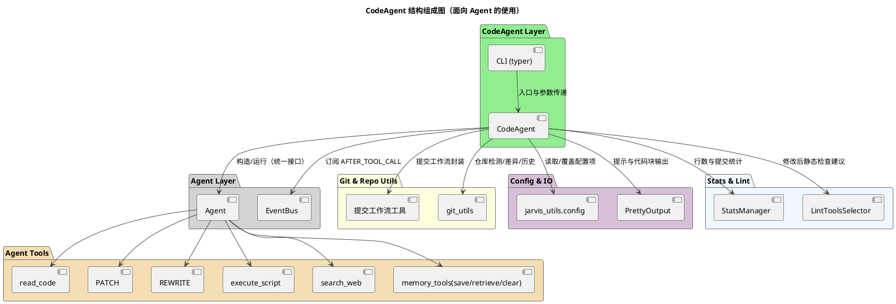
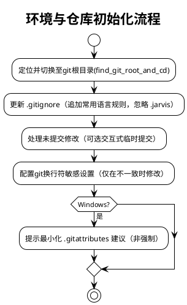
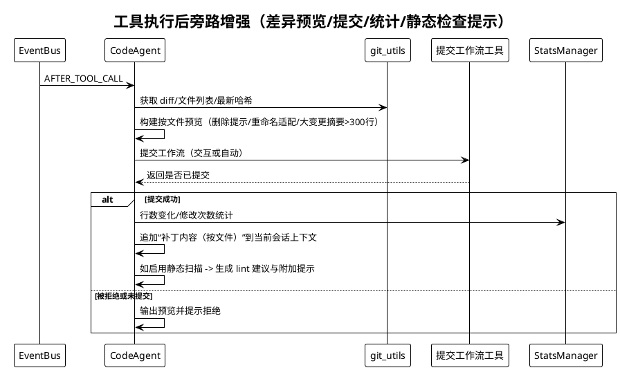
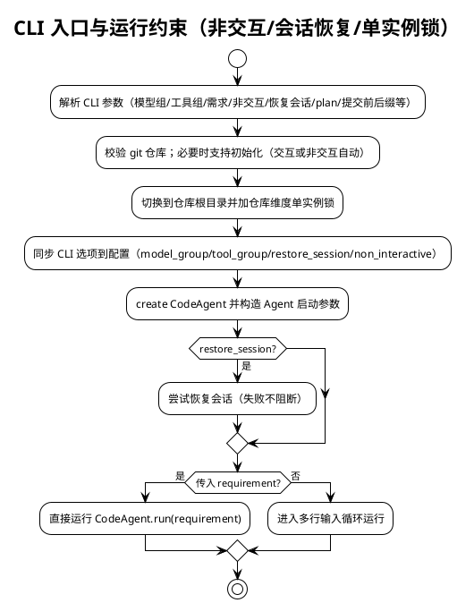
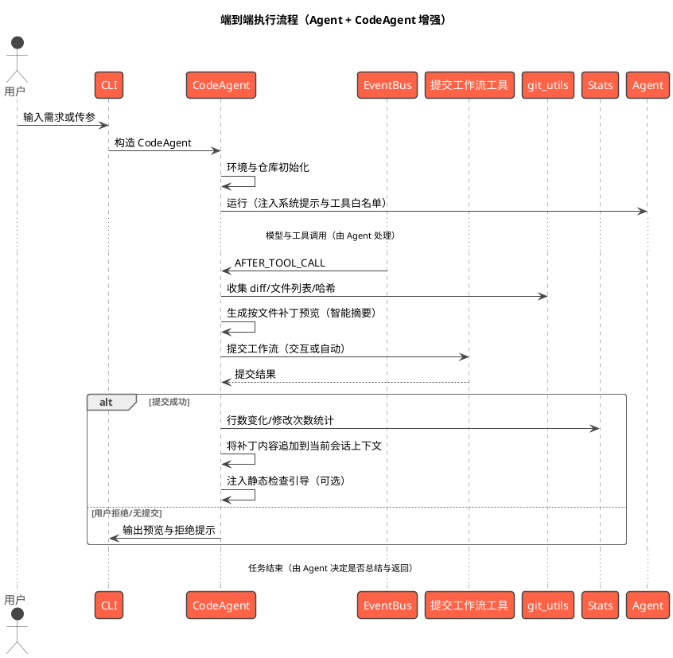

# CodeAgent 系统架构设计

本文档不展开 Agent 的内部实现，聚焦 CodeAgent 如何使用 Agent，并在此基础上为“代码工程”场景提供的增强能力与流程封装。内容基于源码进行结构化说明，覆盖模块组成、职责与接口、关键交互流程、CLI 入口与参数说明、可靠性与扩展建议。

- 代码参考：
  - src/jarvis/jarvis_code_agent/code_agent.py（CodeAgent 主实现与 CLI）
- 关联组件与工具：Git 提交工作流工具、工具注册生态（由 Agent 承载）、事件系统（AFTER_TOOL_CALL）、StatsManager、lint 工具建议、配置系统（jarvis_utils.config）、输出交互（PrettyOutput）

## 1. 设计目标与总体思路

- 使用 Agent：通过统一接口调用 Agent，文档不描述其内部结构与实现细节。
- 场景聚焦：围绕“代码分析与修改”的端到端流程，提供仓库管理、补丁预览、提交确认与统计、静态检查引导等增值能力。
- 最小侵入：仅通过启动参数注入系统提示与工具白名单、订阅 AFTER_TOOL_CALL 事件，不改变 Agent 的行为边界。
- 稳健与可观测：强调 git 配置/仓库状态检查、换行符策略、错误回退；对代码行增删与提交进行统计记录；大变更摘要化预览，避免上下文膨胀。

## 2. 模块组成（PlantUML）

下图展示 CodeAgent 与其协作组件的静态组成与依赖关系，Agent 作为运行与工具执行的统一入口，不展开内部细节。

关键点
- CodeAgent 通过“启动参数 + 工具白名单 + 事件订阅”使用 Agent；工具执行与对话循环由 Agent 承载。
- AFTER_TOOL_CALL 用于在工具执行后进行旁路增强（展示 diff、提交、统计、静态扫描引导）。
- Git 工具链与配置/输出/统计等均为 CodeAgent 外层增强能力。

## 3. CodeAgent 核心功能与与 Agent 的使用边界

读者要点
- 与 Agent 的交互仅限：
  - 启动参数：注入系统提示、工具白名单、自动完成/总结/规划/非交互等行为开关。
  - 事件订阅：订阅 AFTER_TOOL_CALL 事件进行旁路增强。
  - 运行入口：agent.run(input) 启动任务。
  - 追加提示：在必要时追加附加提示（如静态扫描引导）。
  - 会话写入：在确定结果后将补充文本追加至当前会话上下文。

- CodeAgent 的外层增强能力（独立于 Agent 实现）：
  - 环境与仓库管理：发现仓库根、更新 .gitignore、处理未提交修改、统一换行符敏感策略（含 Windows 建议）。
  - 提交工作流：自动/交互式 commit、提交历史展示与接受/重置。
  - 差异与预览：按文件输出 diff，针对删除/重命名/大变更进行适配与摘要化处理。
  - 统计与提示：记录代码行增删、修改次数；根据文件类型生成 lint 建议与静态扫描引导。
  - CLI 入口：非交互约束、单实例锁（按仓库维度）、会话恢复、参数同步配置。

### 3.1 系统提示与工具白名单

- 系统提示：注入“代码工程师工作准则与流程规范”，并按顺序拼接全局规则（数据目录 rules）与项目规则（.jarvis/rules）为单一 <rules> 区块。
- 工具白名单（最小可用集）：
  - execute_script、search_web、ask_user、read_code、save_memory、retrieve_memory、clear_memory、sub_code_agent
  - 支持通过 append_tools 追加工具名，自动去重后传入 Agent。
- 行为开关：
  - 默认禁用：方法论引导与完成后分析（聚焦代码改造）
  - auto_complete 关闭（由 CodeAgent 控制交互流程）
  - 规划开关 plan：默认从配置读取，可由 CLI 覆盖

### 3.2 环境与仓库初始化

说明
- 保守策略：仅在必要时变更 git 配置；Windows 平台提供 .gitattributes 建议，以避免 CRLF/LF 差异导致的大 diff。
- 未提交修改处理：支持确认大量新增文件的添加并引导修改 .gitignore；失败不阻断流程。

### 3.3 工具执行后旁路增强（差异/提交/统计/静态检查）

说明
- 差异预览策略：
  - 删除文件：不展示 diff，仅输出删除提示（附带删除行数若可用）。
  - 大变更（新增+删除 > 300 行）：仅输出统计行数，避免上下文过长。
  - 其它文件：输出该文件的 diff 代码块（文本无法获取时给出友好提示）。
- 统计记录：
  - 插入/删除行数（基于 shortstat）
  - 修改次数（code_modifications）
  - 可扩展提交计数（如生成/接受的提交数）
- 静态检查提示：
  - 根据文件类型选择 lint 工具并生成建议文本
  - 当启用静态分析时，追加“集中扫描与一次性修复”的附加提示

### 3.4 CLI 入口与运行约束

约束与行为
- 非交互模式：必须通过 --requirement 传入任务；多行输入不可用；执行脚本超时受限（由平台环境约束）。
- 单实例锁：按仓库维度加锁（基于 repo_root 的 md5），避免跨仓库互斥。
- 会话恢复：从存档文件恢复；失败不影响继续运行。

### 3.5 核心工具能力（Agent 工具调用）

- 代码读取：read_code
  - 用途：读取源代码文件并按需添加行号，便于精确分析与定位修改点。
  - 最佳实践：遵循“先读后写”，优先按范围读取（start_line/end_line）以避免上下文膨胀。

- 文件修改与重写：PATCH / REWRITE
  - PATCH（推荐）：进行最小必要变更，支持
    - 单点替换：SEARCH / REPLACE（要求唯一命中）
    - 区间替换：SEARCH_START / SEARCH_END / REPLACE（可选 RANGE 约束，区间合法且唯一）
    - 原子写入与失败回滚；未命中、多处命中或区间不合法需明确失败原因。
  - REWRITE：整文件重写，适用于大范围生成或重构，支持原子写与回滚。
  - 建议：优先使用 PATCH，仅在确需整文件重写时使用 REWRITE。

- 命令执行（静态检测等）：execute_script
  - 用途：执行 shell/脚本命令，用于 lint、静态分析、单元测试、构建等工程化操作。
  - 约束：非交互环境有超时限制；避免输出过长，建议配合 rg/grep 等做过滤；不支持交互式命令。
  - 提示：集中在所有修改完成后统一进行静态检查，一次性调用相关工具，避免多次分散调用。

- Web 搜索：search_web
  - 用途：检索外部信息（API/错误/最佳实践/安全建议），辅助方案设计与问题定位。
  - 最佳实践：明确查询上下文与预期结果；对关键结论进行复核，并按需写入记忆或备注。

- 用户交互：ask_user
  - 场景：信息不足或关键决策需确认时使用；尽量提出最少且关键的问题以减少打断。

- 记忆工具：save_memory / retrieve_memory / clear_memory
  - 用途：沉淀项目约定、架构决策、常用命令与方法论；支持按类型与标签检索与清理。
  - 建议：在任务完成或历史清理前根据需要进行保存与整理。

说明
- 上述能力均通过 Agent 的工具调用接口执行；CodeAgent 通过工具白名单进行启用与收敛，并在 AFTER_TOOL_CALL 事件中进行旁路增强（差异预览、提交与统计、静态检查引导）。

## 4. 端到端执行流程（PlantUML）

下图展示一次典型“代码分析与修改”的端到端流程，不展开 Agent 内部细节。

说明
- CodeAgent 不介入模型/工具的调用细节，均由 Agent 处理。
- AFTER_TOOL_CALL 作为主要旁路增强点，承载仓库提交、预览与统计、静态检查提示。

## 5. 参数与配置说明（外层）

- 启动参数（传给 Agent 的外层注入）
  - system_prompt：注入“代码工程师工作准则与流程规范”，并拼接 <rules>（全局/项目规则）
  - use_tools：工具白名单（支持追加、去重）
  - auto_complete：默认关闭
  - need_summary：是否在完成阶段生成总结（代码场景通常关闭或由 CLI 控制）
  - non_interactive：非交互模式（最高优先级）
  - plan：任务规划与子任务拆分开关
- CLI 入口（typer）
  - -g/--llm-group：覆盖模型组
  - -G/--tool-group：覆盖工具组
  - -f/--config：配置文件路径
  - -r/--requirement：任务内容（非交互必须）
  - --append-tools：追加工具白名单
  - --restore-session：恢复会话状态
  - --prefix/--suffix：提交信息前后缀
  - -n/--non-interactive：非交互模式
  - --plan/--no-plan：规划开关
- 配置项与行为
  - 非交互、模型组、工具组、规划、静态分析、补丁确认等通过配置读取，可被 CLI 覆盖
  - git 校验模式（strict/warn）控制未配置用户名/邮箱时的处理方式

## 6. 可靠性与容错设计（外层）

- Git 配置检查：user.name / user.email 未设置时严格模式退出；warn 模式提示并继续。
- 非仓库场景：支持初始化新仓库；失败明确告警并退出。
- 换行符策略：仅在与目标设置不一致时修改；Windows 提供 .gitattributes 建议（非强制）。
- 差异容错：HEAD 不存在时以临时索引方式统计未跟踪文件；重命名/复制以新路径记录；无法获取 diff 时给出友好提示。
- 大输出抑制：单文件新增+删除 > 300 行时采用统计摘要，防止上下文过长。
- 提交失败与拒绝：不阻断主流程；输出预览与建议；会话继续。
- 统计容错：shortstat 获取失败时忽略，不影响最终输出。

## 7. 扩展与二次开发建议

- 工具扩展：通过 --append-tools 追加白名单；在内置或用户目录新增工具（具体加载由 Agent 处理）。
- 事件增强：除 AFTER_TOOL_CALL 外的扩展由 Agent 支持；CodeAgent 保持单事件订阅策略以控制复杂度。
- lint 建议：扩展 get_lint_tools 映射；基于配置开关进行自动引导与集中修复流程提示。
- 提交策略：自定义提交工作流（提交信息模板、分组或批量提交）。
- 统计集成：扩展指标（语言分布、文件修改热度）以增强可观测性。
- 配置策略：引入项目级配置（.jarvis/config）以调节阈值（如大变更 > 300 行）与行为开关。

## 8. 典型使用场景（面向代码工程）

- 小粒度修改：工具生成补丁后，自动预览 diff 并辅以提交；必要时注入静态扫描提示。
- 批量重构：多文件大变更时按文件摘要化展示；提交后生成聚合静态检查引导。
- 非交互流水线：CI 场景以 --non-interactive + --requirement 运行，受限时间内完成工具执行与提交。
- 会话恢复与断点续跑：通过 --restore-session 恢复上下文，继续在 AFTER_TOOL_CALL 旁路进行增强。

## 9. 总结

- CodeAgent 专注于“代码工程”场景的外围增强：环境与仓库管理、提交工作流、差异预览与统计、静态检查引导。
- 通过“启动参数 + 事件订阅”的最小侵入方式使用 Agent，避免对底层实现的耦合与依赖。
- 借助 CLI 与配置体系，兼顾交互与非交互场景，提供稳定可控、可扩展的工程化实践路径。