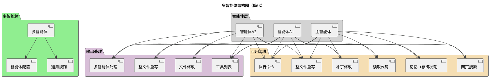
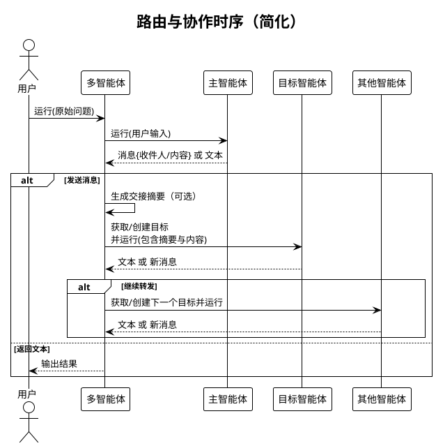
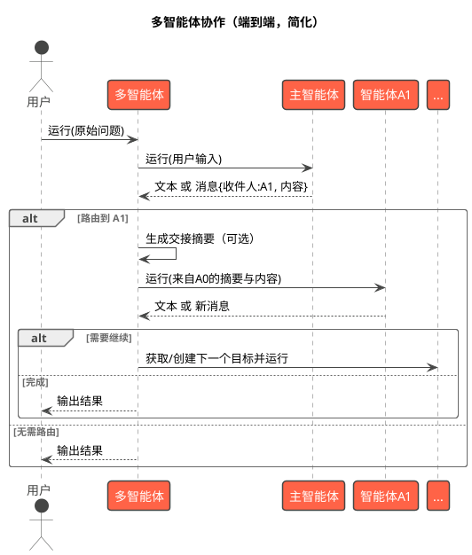

# MultiAgent 系统架构设计

本文档围绕多智能体协作组件 MultiAgent，基于源码进行结构化设计说明，聚焦“如何在多个 Agent 之间进行消息路由与协作”，并说明与 Agent 的集成方式、消息协议、运行流程、容错机制与配置参数。本文不展开 Agent 的内部实现细节。

- 代码参考：
  - src/jarvis/jarvis_multi_agent/__init__.py（MultiAgent 主实现）
- 相关组件与工具：
  - Agent（对话与工具执行的统一入口）
  - OutputHandler（输出处理器协议；MultiAgent 为其实现之一）
  - ToolRegistry、EditFileHandler、RewriteFileHandler（工具与文件变更处理）
  - PrettyOutput（统一输出）
  - YAML（SEND_MESSAGE 解析）


## 1. 设计目标与总体思路

- 面向协作的消息路由：提供跨 Agent 的消息发送能力与基本的校验、修复建议，降低多智能体协作的格式/路由错误率。
- 低耦合集成：以 OutputHandler 形式接入 Agent 输出处理链，与 ToolRegistry/编辑器保持并列关系，不改变 Agent 的主循环逻辑。
- 一致的交互体验：统一的 SEND_MESSAGE 消息格式与提示，约束“每轮仅发送一个消息”，并提供明确的错误定位与修复指引。
- 可读与可追溯：发送前可选生成“交接摘要”，携带上下文关键信息；支持“发送后清理历史”以降低单体上下文压力。
- 安全稳健：对字段缺失、类型不符、目标不存在、YAML 解析失败、多消息块等进行诊断与容错，明确反馈并不中断整体流程。


## 2. 结构组成（PlantUML）

下图展示 MultiAgent 与其协作组件的静态组成与依赖关系。MultiAgent 以 OutputHandler 的形式加入各个 Agent 的输出处理列表中，并负责在 Agent 之间路由消息。



关键点
- MultiAgent 以 OutputHandler 形式存在于每个受管 Agent 的输出处理器链中，负责识别并处理 SEND_MESSAGE 指令。
- 消息总线角色：MultiAgent 作为 OutputHandler 注入每个智能体，相当于为其接入“消息总线”，使其具备与其他智能体通信的能力；在转发过程中携带并控制部分上下文（如交接摘要），并可按配置进行历史清理，实现“上下文的部分转移与控制”。
- 每个 Agent 仍通过 ToolRegistry/编辑器等执行代码工程所需的核心工具能力（read_code、PATCH/REWRITE、execute_script、search_web、memory 工具等）。
- MultiAgent 仅负责消息路由与必要的补充（如交接摘要），不干预工具执行流程。


## 3. 消息协议与处理逻辑

### 3.1 交互原则与格式（面向模型提示）

- 单一操作原则：每轮仅发送一个消息或进行一个工具调用，避免并发歧义。
- 完整性与明确性：消息需包含目标 to 与内容 content，表达清晰、携带必要上下文。
- 上下文保留：在 content 中包含必要背景、资源、期望结果，便于接收方继续工作。

建议的消息格式（示例）：
```
<SEND_MESSAGE>
to: 目标Agent名称
content: |2
  # 消息主题
  ## 背景信息
  [提供必要的上下文与背景]
  ## 具体需求
  [明确表达期望完成的任务]
  ## 相关资源
  [列出相关文档、数据或工具]
  ## 期望结果
  [描述期望的输出格式和内容]
  ## 下一步计划
  [描述下一步的计划和行动]
</SEND_MESSAGE>
```

或反馈结果形式：
```
<SEND_MESSAGE>
to: 目标Agent名称
content: |2
  # 任务结果
  [用于反馈的简要结果/结论/产出链接]
</SEND_MESSAGE>
```


### 3.2 OutputHandler 行为（can_handle/handle）

- can_handle(response)：
  - 规则：只要检测到起始标签 <SEND_MESSAGE> 即认为可处理。
- handle(response, agent)：
  - 流程：
    - 优先尝试解析出单个 SEND_MESSAGE 块（严格 YAML 解析）。
    - 字段校验：必须包含 to（str）、content（str，建议多行 |2）；缺失或空白时返回明确错误与修复建议。
    - 目标校验：to 必须存在于 agents_config 的 name 集合；否则返回“可用智能体列表”与修复建议。
    - 多块检测：若检测到多个 SEND_MESSAGE 块，返回“一次仅允许一个块”的错误提示。
    - YAML 异常：提供常见错误修复建议（缩进、引号、冒号等）。
  - 返回：
    - 成功：True, {"to": "...", "content": "..."}
    - 失败：False, "错误原因与修复指导"

说明
- 解析前会进行换行规范化；若发现缺少结束标签，会自动在尾部补齐后再尝试解析（尽量给出可操作反馈）。
- 即使 can_handle 判断“可处理”，handle 仍可能因格式/字段错误而返回失败信息（帮助模型自修）。


## 4. Agent 构造与配置继承

MultiAgent 负责按需延迟构造参与协作的各个 Agent，核心策略如下：

- 受控构造：当首次需要某个目标智能体时，通过其配置创建 Agent：
  - output_handler = [ToolRegistry(), EditFileHandler(), RewriteFileHandler(), MultiAgent]
- 运行形态约束：
  - in_multi_agent=True（标记多智能体运行环境）
  - 非主智能体：统一设置 auto_complete=False，避免并行时误触发自动完成
- 系统提示拼接（可选）：
  - common_system_prompt：若配置则拼接到该 Agent 的 system_prompt 前部
  - original_question：对非主智能体，将“原始问题”作为附加段落拼入 system_prompt 末尾，明确共同目标
- 命名与检索：agents_config_map 按 name 建立索引，便于路由目标校验与构造


## 5. 运行与路由流程

### 5.1 顶层运行与回环（run）

- 初始化：记录 original_question，获取 main_agent 实例并以用户输入启动。
- 循环路由：
  - 若 Agent.run 返回字符串（最终输出），流程结束。
  - 若返回字典（来自 MultiAgent.handle 的 {"to", "content"}），则进行路由：
    - 生成交接摘要（可选）：summary_on_send=True 时，基于当前会话上下文直接模型调用生成“交接摘要”（不通过 OutputHandler 以避免循环）。
    - 构造对接收方的输入：
      - from: 上一发送者
      - summary_of_sender_work: 交接摘要（可为空）
      - content: 发送内容
    - 获取/创建目标 Agent，并调用其 run(prompt)。
    - 若发送方配置 clear_after_send_message=True，发送后清理其历史以控长。
  - 当返回值不为 str 也不为 dict 时，输出警告并中止循环（防御性处理）。

### 5.2 时序图（PlantUML）



说明
- 交接摘要通过直接模型调用完成，不走 Agent 输出处理器链，避免递归。
- 每次仅处理一个 SEND_MESSAGE，保证路由串行、语义清晰。


## 6. 核心工具能力（Agent 工具调用）

多智能体协作以 Agent 为执行单元，核心开发与工程能力通过 Agent 的工具调用完成：

- 代码读取：read_code
  - 用途：读取源代码文件、带行号，便于精准分析与定位。
  - 最佳实践：先读后写，按范围读取避免上下文膨胀。

- 文件修改与重写：PATCH / REWRITE
  - PATCH（推荐）：最小必要变更
    - 单点替换：SEARCH / REPLACE（要求唯一命中）
    - 区间替换：SEARCH_START / SEARCH_END / REPLACE（可选 RANGE，区间唯一且合法）
    - 原子写与失败回滚；未命中、多处命中、区间不合法需明确失败原因
  - REWRITE：整文件重写（大范围生成/重构），原子写与回滚
  - 建议：优先 PATCH，仅在确需时使用 REWRITE

- 命令执行（静态检测等）：execute_script
  - 用途：执行 lint/静态分析/测试/构建等脚本
  - 约束：非交互模式下有超时；避免超长输出，配合 rg/grep 做过滤
  - 建议：修改完成后集中进行一次性静态检查，避免分散多次调用

- Web 搜索：search_web
  - 用途：检索 API/错误/最佳实践/安全建议等外部信息，辅助决策
  - 最佳实践：明确查询目标，重要结论做二次验证，可结合记忆工具沉淀

- 用户交互：ask_user
  - 场景：信息不足或关键决策需确认；尽量提最少且关键的问题

- 记忆工具：save_memory / retrieve_memory / clear_memory
  - 用途：沉淀项目约定、架构决策、常用命令、方法论；支持按类型/标签检索与清理
  - 建议：在任务完成或历史清理前按需保存与整理

提示
- MultiAgent 不改变 Agent 的工具调用协议，仅在消息路由完成后继续由目标 Agent 决定是否调用工具与如何处理结果。


## 7. 参数与配置说明

- MultiAgent(agents_config: List[Dict], main_agent_name: str, common_system_prompt: str="")

- agents_config（每个 Agent 的配置，示例字段）：
  - name: 智能体名称（必填，唯一）
  - description: 说明（可选，用于生成“可用智能体资源”提示）
  - system_prompt: 该 Agent 的系统提示（可与 common_system_prompt 组合）
  - in_multi_agent: True（MultiAgent 运行时默认加上）
  - auto_complete: False（非主智能体默认关闭）
  - summary_on_send: bool（发送前是否生成交接摘要，默认 True）
  - clear_after_send_message: bool（发送后是否清理发送方历史）
  - 其他与 Agent 兼容的构造参数均可按需设置

- main_agent_name：主智能体名称（首次入口）
- common_system_prompt：可选公共系统提示，自动拼接至各 Agent 的 system_prompt 前部（若存在）


## 8. 可靠性与容错设计

- 标签与 YAML 解析：
  - 缺失结束标签：自动补齐后再解析，仍失败则给出修复建议与示例
  - YAML 格式错误：返回具体错误原因与验证建议（缩进、引号、冒号等）
- 字段与类型校验：
  - 缺失/空白字段（to/content）：明确列出缺失项与修复示例
  - 类型错误：返回需要的类型及修复示例
- 目标校验：
  - 不存在的目标：返回可用智能体列表与修复建议
- 多块检测：
  - 一次仅允许一个 SEND_MESSAGE，多个块时提示“合并或分多轮发送”
- 运行时稳健性：
  - 生成交接摘要失败：忽略并继续发送（摘要置空）
  - 返回类型异常：记录警告并结束循环（防御性收束）
  - 可选清理：发送后按配置清理发送方历史，控制上下文增长


## 9. 典型执行流程（端到端，PlantUML）



特点
- 路由串行清晰；每轮仅处理一个 SEND_MESSAGE。
- 交接摘要（可选）提升跨 Agent 协作的上下文传递质量。
- 工具与文件编辑等核心能力由各 Agent 通过自身工具执行完成（read_code、PATCH/REWRITE、execute_script、search_web、memory 工具等）。


## 10. 扩展与二次开发建议

- 自定义路由策略：
  - 目前策略为显式 to 指定目标；可在上层为“没有明确 to 的情况”注入一个调度器智能体负责仲裁。
- 交接摘要模板：
  - 可替换或扩展摘要提示模板，以适配不同团队的交接规范（如引入风险等级/合规点/性能指标等）。
- 发送后策略：
  - clear_after_send_message 针对历史控制有效；也可扩展为“按 token/轮次阈值”触发清理。
- 错误教育与自修：
  - 当前提供格式与字段级修复建议；可扩展为“给出修复后完整块”，提升自修成功率。
- 可观测性：
  - 结合日志与统计对跨 Agent 的消息数量、平均跳数、失败原因等指标进行记录与可视化。


## 11. 总结

- MultiAgent 以 OutputHandler 方式接入 Agent，负责识别与路由 SEND_MESSAGE，实现多智能体间的明确协作。
- 保持与 Agent 的工具生态解耦：代码读取、修改/重写、命令执行（静态检测）、Web 搜索与记忆工具等仍通过各 Agent 的工具调用完成。
- 通过格式约束、字段校验、目标检索、摘要生成与历史清理等机制，提供稳定、可解释、可扩展的多智能体协作能力。