# jarvis-c2rust 系统架构设计

本文档基于源码 src/jarvis/jarvis_c2rust 下的实现，对“C→Rust 迁移套件（jarvis-c2rust）”进行结构化架构说明，覆盖模块组成、模块关系、工作流程、以及各模块内部设计。面向本项目开发者和使用者。

参考风格：与本仓库现有架构文档一致，使用 PlantUML 以通俗术语呈现角色与流程，强调职责边界与可回退策略。

- 主要源码模块：
  - cli.py（Typer 命令行入口）
  - scanner.py（libclang 驱动的 C/C++ 函数与类型扫描 + 引用图）
  - collector.py（头文件函数名采集）
  - library_replacer.py（基于 LLM 的库替代评估与剪枝）
  - llm_module_agent.py（LLM 驱动的 Rust crate 结构规划与落盘）
  - transpiler.py（函数级转译器与构建修复循环）
  - optimizer.py（Rust 代码保守优化器）

- 核心数据目录与产物（默认路径）：
  - <project_root>/.jarvis/c2rust/
    - symbols.jsonl / symbols_raw.jsonl（函数与类型统一符号表）
    - translation_order.jsonl（转译顺序）
    - library_replacements.jsonl（库替代映射）
    - roots.txt（collect 阶段采集的根函数名）
    - progress.json / symbol_map.jsonl 等（迭代过程记录）

## 1. 设计目标与总体思路

- 渐进式迁移流水线：从“扫描数据基线”出发，逐步执行“库替代评估 → 模块规划 → 转译 → 优化”的流水线。
- 明确产物与断点续跑：每阶段产物写入 .jarvis/c2rust，形成可复现与可继续的中间结果；转译与优化阶段支持 resume。
- 保守与可回退：转译与优化过程具备构建检测与回退策略（如 git_guard），尽可能保证最终 crate 可构建。
- 模块化与可替换：扫描、评估、规划、转译、优化模块边界清晰，可独立使用或替换。

## 2. 模块组成（PlantUML）

下图从“命令行与流水线”视角呈现模块静态组成与依赖关系。

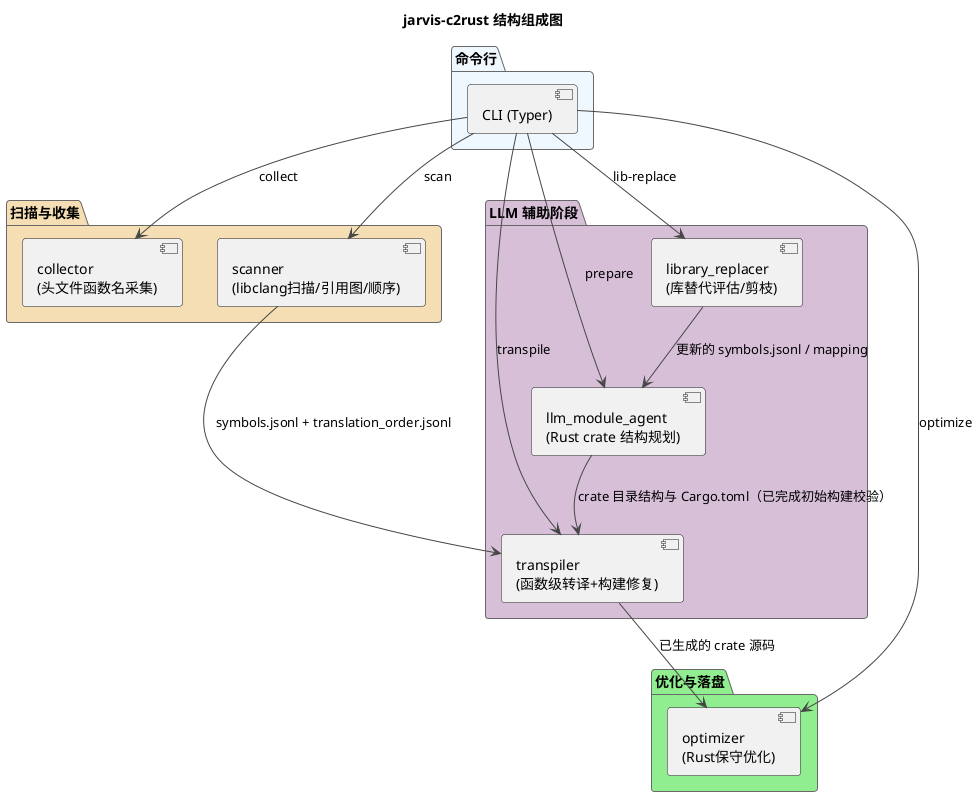

要点
- CLI 提供分组式子命令与一键 run 流水线，统一 orchestrate。
- 数据产物在各阶段生成并复用，形成稳定的“迁移上下文”。

## 3. 核心产物与文件约定

- 统一符号表（JSONL）
  - symbols.jsonl：经过筛选/剪枝/替代后的主输入
  - symbols_raw.jsonl：原始扫描数据（作为回退与比对依据）
- 转译顺序
  - translation_order.jsonl：由 scanner.compute_translation_order_jsonl 计算；按引用关系排序函数转译顺序
- roots.txt
  - collect 输出的根函数名列表（每行一个），作为库替代评估的入口集合
- 库替代映射
  - library_replacements.jsonl：LLM 评估生成的库替代与剪枝结果
- 进度与映射
  - progress.json：转译或优化阶段的断点续跑记录
  - symbol_map.jsonl：符号名映射（转译过程中的辅助）

## 4. 命令与工作流程

命令行子命令（CLI）
- scan：执行 C/C++ 扫描，输出 symbols.jsonl / DOT 图（可生成 PNG）、子图等
- prepare：调用 LLM 规划 crate 结构并直接落盘（需扫描后已有 symbols.jsonl）
- transpile：按 translation_order.jsonl 逐函数转译并进行构建修复（支持 --resume、--max-retries、--only）
- lib-replace：对指定根列表进行库替代评估与剪枝（LLM-only 子树评估）
- collect：从头文件采集函数名，写入 roots.txt
- optimize：对生成的 crate 执行保守优化（unsafe 清理、结构与可见性优化、文档补充、cargo check）
- run：一键流水线（collect → scan → lib-replace → prepare → transpile → optimize）

典型流水线（PlantUML）
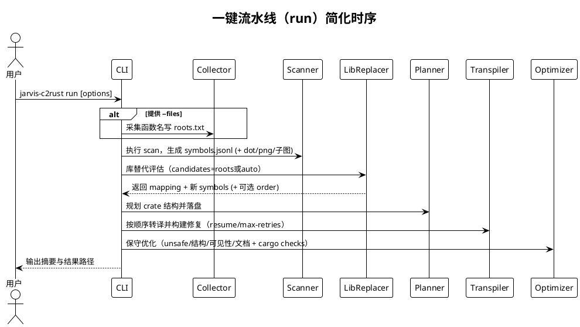

## 5. 模块内部设计

### 5.1 scanner（扫描与引用图）

职责
- 使用 libclang 扫描 C/C++ 文件，收集函数信息（名称、参数、调用关系、语言等）与类型信息。
- 生成统一数据（symbols.jsonl 或数据库形式）、引用图 DOT/PNG、根函数识别与转译顺序计算。
- 提供 run_scan 一体化入口。

关键接口（源码参考）
- find_compile_commands / load_compile_commands：编译参数发现与加载
- iter_source_files / scan_file / scan_directory：文件遍历与扫描
- generate_dot_from_db：生成引用关系 DOT 文件（可渲染 PNG）
- find_root_function_ids：识别根函数（引用图中的无入边或策略定义的入口）
- compute_translation_order_jsonl：根据引用关系生成函数转译顺序
- export_root_subgraphs_to_dir：导出每个根函数的引用子图

流程（PlantUML）
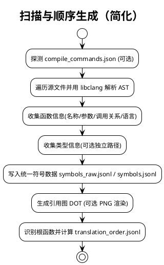

边界与容错
- 若 compile_commands.json 不存在，回退为基本解析参数；对复杂宏/编译选项场景保持告警。
- DOT 生成与 PNG 渲染为可选；顺序缺失时可按“调用深度/文件顺序”回退策略。

### 5.2 collector（头文件函数名采集）

职责
- 从指定头文件（.h/.hh/.hpp/.hxx）解析函数声明并生成唯一函数名列表，写入指定输出文件（如 roots.txt）。

关键接口
- collect_function_names(files, out_path, compile_commands_root?)

流程
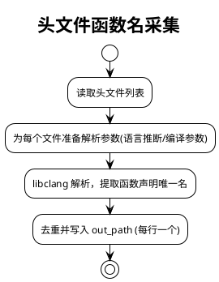

边界
- 非头文件后缀将被跳过；解析失败记录告警但不阻断其他文件。

### 5.3 library_replacer（库替代评估）

系统核心：在扫描得到的函数依赖图上，按“根函数子树”进行评估，若整个子树可由一个或多个成熟 Rust 库整体替代，则以库占位替代该根的引用并剪除其子孙函数；保留类型记录不受影响。支持禁用库约束与断点续跑。

职责（精细拆解）
- 数据读取与图构建：
  - 读取 symbols.jsonl（统一符号表）；建立 id→记录、名称/限定名→id 索引
  - 仅针对函数类别构建调用边（id→id），形成邻接表
  - 识别根函数（无入边）；若无根，则回退为全量函数集合
- 根选择与评估顺序：
  - 默认从所有根函数开始，采用近似“父先子后”的顺序（广度遍历）
  - 支持 candidates（名称或限定名列表）：仅评估这些根，并限定作用域为其可达子树；不可达函数将直接删除（类型保留）
- 子树摘要与样本构建：
  - 对待评估根，收集其子树节点摘要（名称 | 签名），限制总条数
  - 提取部分代表性节点源码片段（根及最多两个直接子节点），限制行数
  - 构建子树边列表（caller -> callee）；边少时生成 DOT 文本辅助判断
- LLM 评估与解析：
  - 使用 PlatformRegistry 的普通平台与模型组（可选 llm_group），统一 system_prompt
  - 输出要求为 
 块内的 <yaml>，或容忍 yaml 代码块/JSON；解析字段：replaceable、libraries、library（主库）、apis/api、confidence、notes
  - 禁用库约束：若建议命中 disabled_libraries（大小写归一），强制判定不可替代，并在备注中追加告警
- 入口函数保护：
  - 默认跳过 main，不进行库替代（改为深入评估其子节点）
  - 支持通过环境变量配置多个入口名：JARVIS_C2RUST_DELAY_ENTRY_SYMBOLS / JARVIS_C2RUST_DELAY_ENTRIES / C2RUST_DELAY_ENTRIES（逗号/空白/分号分隔）
- 剪枝与映射生成：
  - 可替代时：仅剪除子孙函数（根保留），将根的 ref 设置为库占位（lib::<library>，支持多库），并写入 lib_replacement 元数据（libraries/library/apis/api/confidence/notes/mode/updated_at）
  - 不可替代时：递归评估其子节点
  - 选中替代根的概要按 JSONL 写出到 library_replacements.jsonl
- 输出文件与别名：
  - 新符号表：symbols_library_pruned.jsonl（兼容输出 symbols_prune.jsonl），保留别名 symbols.jsonl 指向新表以统一后续流程
  - 转译顺序：translation_order_prune.jsonl（基于剪枝表计算），并复制为通用别名 translation_order.jsonl
- 断点续跑与原子写：
  - 断点文件：library_replacer_checkpoint.json（eval_counter/processed_roots/pruned_dynamic/selected_roots/timestamp/key）
  - 匹配关键键（symbols + library_name + llm_group + candidates + disabled_libraries + max_funcs）才恢复
  - 定期保存（checkpoint_interval），完成后可选清理（clear_checkpoint_on_done）；落盘使用原子写避免损坏
- 限流与稳健性：
  - max_funcs 用于限制评估根数量（调试/限流）
  - LLM 不可用或失败时，视为不可替代并继续评估子节点；解析失败容忍并警告

内部关系
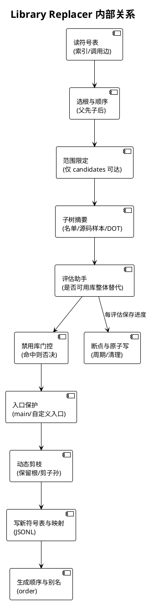

评估与剪枝流程（细化）
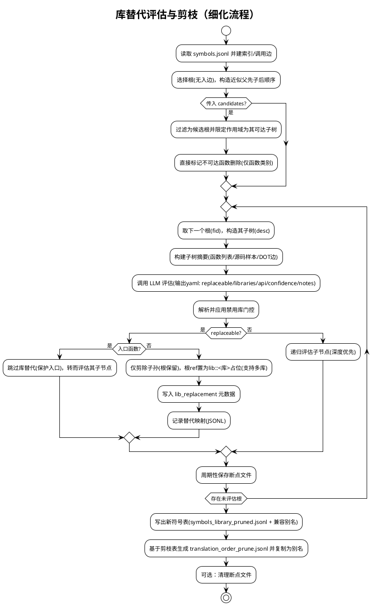

参数与行为要点（与 CLI lib-replace 对应）
- db_path：符号表路径或其所在目录（自动解析至 .jarvis/c2rust/symbols.jsonl）
- library_name：指定库名（如 std/regex），评估时优先该库；解析结果支持多库组合
- llm_group：指定评估模型组；平台不可用时回退为“不可替代”
- candidates：仅评估这些根；作用域限制为其可达子树，不可达函数直接删除（类型保留）
- disabled_libraries：禁用库名列表（大小写不敏感），命中则强制不可替代
- resume / checkpoint_interval / clear_checkpoint_on_done：断点续跑相关配置
- max_funcs：评估根数量上限（限流/调试）
- out_symbols_path / out_mapping_path：输出路径（默认落在 .jarvis/c2rust）

边界与策略
- 类型记录：任何剪枝不影响类型记录；仅函数类别参与剪枝
- 库占位：以 lib::<name> 表示库引用，占位符在后续转译与优化阶段作为上下文提示
- 入口保护：main 默认保护（可配置），确保后续转译仍能生成入口实现
- 解析容错：支持 <yaml>、代码块 yaml 与 JSON；解析失败则不可替代并继续
- 原子写与报告：断点/输出文件使用原子写；在完成时输出统计摘要（选中替代根数/剪除函数数/新符号表与顺序路径）
### 5.4 llm_module_agent（crate 规划与落盘）

职责
- 以 LLM 为核心，基于引用子图与实体元信息规划 crate 模块结构（YAML），并将结构应用到磁盘。
- 确保 Cargo.toml 存在，模块声明完整（pub mod），并创建必要的目录与文件占位。
- 在创建初始工程结构后，执行构建校验（cargo check）并进行必要的最小修复/占位补全，确保初始工程可构建通过。

关键类型与函数（源码参考）
- _FnMeta / _GraphLoader：函数元信息与子图加载
- plan_crate_yaml_text / plan_crate_yaml_llm：生成 YAML 结构文本
- entries_to_yaml / _parse_project_yaml_entries*：YAML 与内部结构互转
- _ensure_pub_mod_declarations / _apply_entries_with_mods：确保模块声明与写盘
- _resolve_created_dir / _ensure_cargo_toml：目录定位与 Cargo.toml 保障
- execute_llm_plan(apply=True, llm_group=...)

组件关系（PlantUML）
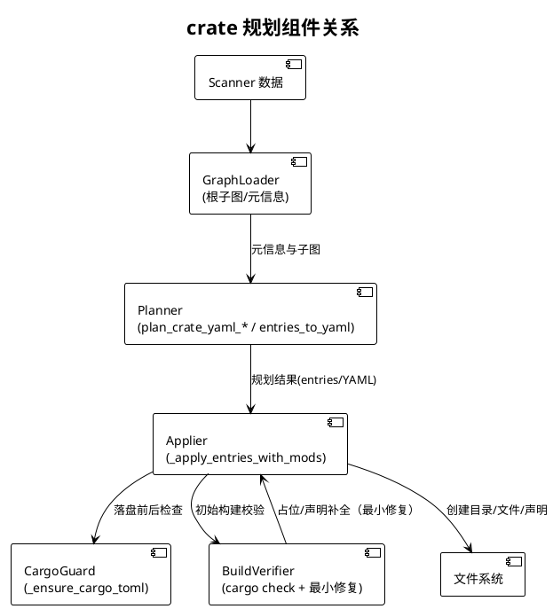

流程
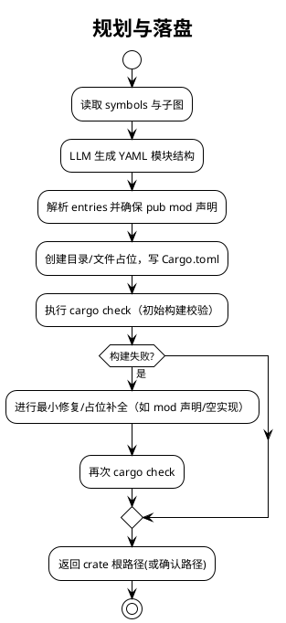

边界与容错
- YAML 解析失败时尝试 fallback 解析；声明缺失时进行自动补全。
- 写盘过程中异常提供告警并尽量保持幂等。

### 5.5 transpiler（转译与构建修复）

系统核心：Transpiler 负责按扫描顺序逐函数完成“模块与签名规划 → 代码生成 → 构建校验与最小修复 → 审查与类型边界复核 → 映射记录与占位清理”的完整闭环。

职责（精细拆解）
- 顺序与索引：
  - 确保并加载 translation_order.jsonl（_ensure_order_file/_iter_order_steps）
  - 构建自包含索引（id → FnRecord、name/qname → id）（_load_order_index）
- 模块与签名规划（Agent）：
  - 基于 C 源片段、调用者上下文（已转译/未转译）、crate 目录树，调用 Agent 选择目标模块文件与 Rust 函数签名（_plan_module_and_signature）
  - 对规划结果进行严格校验与至多 plan_max_retries 次重试，失败回退至兜底模块与启发式签名
- 进度记录：
  - 更新 progress.json 当前项（id/name/qname/file/位置/module/rust_signature/signature_hint/metrics）（_update_progress_current）
  - 支持 resume：跳过已完成函数（symbol_map.has_rec；progress['converted']）
- 上下文与复用：
  - 构建当前函数的上下文头部（全量/精简），在复用 Repair/Review 等 Agent 时拼接（_reset_function_context/_compose_prompt_with_context/_refresh_compact_context）
- 代码生成（CodeAgent）：
  - 在目标模块生成或更新实现，遵循“最小变更、禁止 todo!/unimplemented!、必要时补齐依赖实现”的约束（_codeagent_generate_impl）
  - 静态存在性校验，缺失则触发一次最小修复补齐实现（_ensure_impl_present）
- 模块可见性与声明链：
  - 确保 src/lib.rs 顶层 pub mod，补齐从目标模块文件向上的 mod.rs 声明链（_ensure_top_level_pub_mod/_ensure_mod_rs_decl/_ensure_mod_chain_for_module）
- 最小单元测试：
  - 为目标函数生成 #[cfg(test)] 的 smoke 测试（占位参数、unsafe 包裹），用于后续 cargo test 验证（_ensure_minimal_tests）
- 签名一致性检查与修复：
  - 基于 C 的 params/return_type 检查 Rust 签名的一致性（参数个数、指针可变性、ptr+len 组合、返回指针可变性）（_check_signature_consistency）
  - 按问题列表执行“仅签名层面”的最小修复（sig-fix），并记录 metrics（_infer_rust_signature_hint）
- 构建校验与最小修复（核心闭环）：
  - cargo check → 若失败：错误分类（missing_import/type_mismatch/visibility/borrow_checker/dependency_missing/module_not_found），提示最小修复并继续循环（_classify_rust_error/_cargo_build_loop）
  - 通过 check 后执行 cargo test → 若失败：同样分类与最小修复，直到通过或达上限（max_retries）
  - 每轮记录 build_attempts、impl_verified、last_build_error 等度量
- 审查与类型边界复核：
  - Review Agent 审查“关键逻辑一致性”，OK 则进入二次审查；否则最小优化并回到构建闭环（_review_and_optimize）
  - TypeBoundary Review Agent 聚焦指针可变性、空指针检查、边界检查与 unsafe SAFETY 注释，若不通过则最小修复（_type_boundary_review_and_fix）
- 映射与占位清理：
  - 记录 C→Rust 符号映射到 JSONL（支持同名/重载），更新 progress['converted']（_mark_converted，_SymbolMapJsonl）
  - 清理 crate 源码中对当前符号的 todo!("sym")/unimplemented!("sym") 占位，替换为真实调用并回归测试（_resolve_pending_todos_for_symbol）
- 初始工程自洽：
  - 在未执行 prepare 的情况下，兜底确保最小 Cargo.toml 与 src/lib.rs 存在（transpile开头的初始化逻辑）

组件关系（Transpiler 子系统）
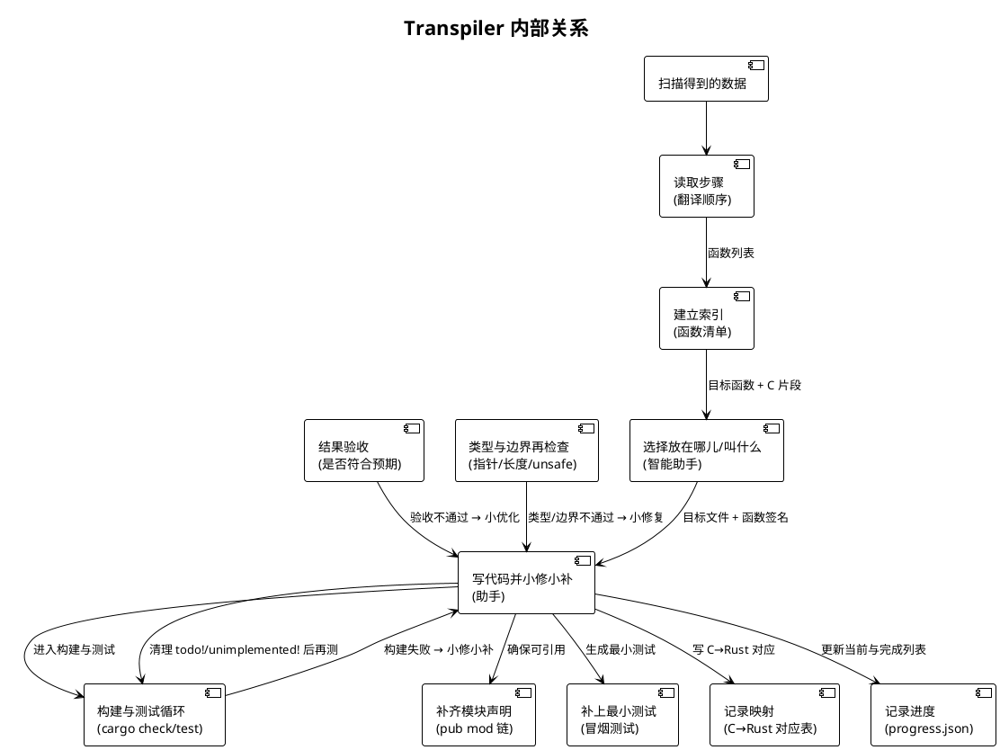

核心流程
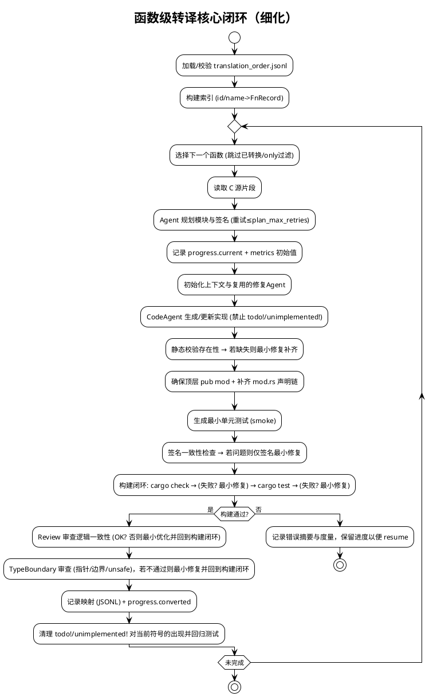

边界与策略（与源码一致）
- 数据与顺序：
  - translation_order.jsonl 必须存在且包含有效步骤，若为空/无效则基于 symbols.jsonl 重新计算，一直校验通过为止
  - 仅支持新格式（每行含 ids/items），旧格式忽略
- 规划与生成：
  - 模块路径必须位于 crate/src/ 下，禁止指向 src/main.rs，文件后缀为 .rs 或 mod.rs
  - 签名需包含 fn 名称，参数个数与顺序对齐 C，指针可变性按 const/*const、非 const/*mut 区分（启发式映射）
- 构建闭环：
  - 先 cargo check（更快），通过后再 cargo test；失败时按分类标签进行聚焦修复，最多迭代 max_retries 次
  - 每轮修复均保持最小改动：修正声明/依赖、补齐未实现被调函数、精确 use 导入、避免通配，必要时更新 Cargo.toml
- 审查与复核：
  - Review 仅判断关键逻辑一致；TypeBoundary 仅关注指针可变性/空指针检查/边界检查/unsafe SAFETY
  - 审查失败不阻塞主流程，通过最小修复回到构建闭环，直到通过或达上限
- 进度与映射：
  - progress.json 持续更新 current/metrics 与 converted 集合，支持断点续跑
  - SymbolMap JSONL 每函数写入一条映射（带源位置），支持同名函数/重载区分
- 占位清理：
  - 针对 todo!("symbol")/unimplemented!("symbol") 的出现文件逐一最小修复为真实调用，并回归测试
- 兜底初始化：
  - 在未运行 prepare 时，兜底生成最小 Cargo.toml 与 src/lib.rs，以确保后续流程可运行
### 5.6 optimizer（保守优化器）

系统核心：对已生成的 Rust crate 进行“保守、可回退”的质量提升，分步执行并在每步后用构建测试验证（本模块统一使用 cargo test 作为验证手段）。失败时尝试最小修复；如仍失败且开启 git_guard，则自动回滚到步骤前快照。

职责（精细拆解）
- 文件选择与进度管理：
  - 依据 include/exclude、max_files、resume 从 crate 中挑选本批次要处理的 .rs 文件
  - 使用 .jarvis/c2rust/optimize_progress.json 记录 processed 列表，支持断点续跑与重置
- 快照与回滚（git_guard）：
  - 每个优化步骤前记录当前 HEAD 快照；步骤后若构建仍失败且无法修复，自动 reset --hard 回快照
- 1) unsafe 清理（最小化）：
  - 逐处尝试移除 unsafe { ... }（仅去掉 unsafe 关键字）
  - 立即运行 cargo test 验证；失败则回滚该处，并在 unsafe 前添加 “/// SAFETY: ... 原因摘要”
- 2) 重复代码提示/最小消除：
  - 以“签名 + 主体文本”粗粒度比对重复函数；为后出现者添加 “/// TODO: duplicate of ...”
  - 在 CodeAgent 阶段允许最小化抽取公共辅助函数（易于安全完成时）
- 3) 可见性最小化：
  - 尝试将 pub fn 降为 pub(crate) fn，变更后运行 cargo test 验证，失败则回滚
- 4) 文档补充：
  - 文件头部无模块文档时补 “//! ...”；无函数文档时在函数前补 “/// ...”
- 5) CodeAgent 整体优化（可选）：
  - 对本批次文件执行一次保守整体优化（unsafe 范围缩小并补 SAFETY、重复消除、可见性最小化、文档补齐）
  - 要求仅输出补丁；自检用 cargo test；失败则触发本地最小修复循环

关键数据与度量
- 报告：.jarvis/c2rust/optimize_report.json（files_scanned、unsafe_removed/annotated、duplicates_tagged、visibility_downgraded、docs_added、cargo_checks、errors）
- 进度：.jarvis/c2rust/optimize_progress.json（processed 文件列表，posix 相对路径）
- 验证预算：max_checks 限制 cargo test 次数；超出预算将提前停止修复

内部关系
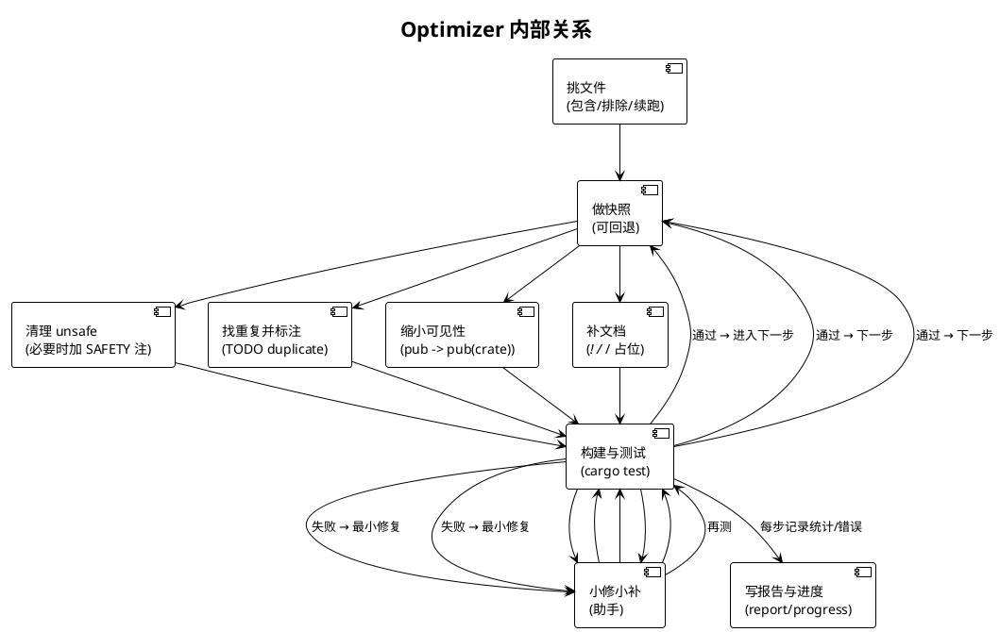

优化主流程（分步校验 + 可回滚）
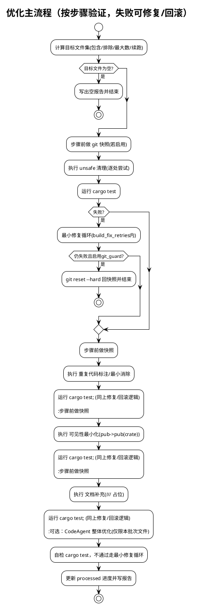

参数与行为要点（与 CLI optimize 对应）
- crate_dir：自动检测（当前目录/Cargo.toml/同级 <cwd>_rs/目录下首个 Cargo.toml）
- enable_*：四类优化步骤开关（unsafe/structure/visibility/doc）
- max_checks：限制 cargo test 次数预算；为 0 表示不限
- dry_run：仅统计潜在修改，不写盘；仍统计 files_scanned 及可能的计数增量
- include/exclude/max_files：大项目分批优化；路径相对 crate 根，支持通配
- resume/reset_progress：跳过已处理文件/清空 processed 并重跑
- build_fix_retries：构建失败时的最小修复重试次数（CodeAgent）
- git_guard：步骤失败后自动回滚到步骤前快照

边界与策略
- 验证统一使用 cargo test（而非 cargo check），确保最小测试也能通过；预算超限则提前终止修复
- 所有文本改动均以最小修改为目标；失败立即回滚本处修改（或整步回滚）
- CodeAgent 修改严格限制在本批次文件范围内（除非确有必要），避免扩大影响面
- 对公开 API 保持保守：可见性仅在不破坏外部使用时缩小；跨 crate 接口必须保留为 pub
### 5.7 CLI（命令行协调者）

职责
- 使用 Typer 暴露子命令：scan / prepare / transpile / lib-replace / collect / run / optimize。
- 在 run 中统一 orchestrate 并处理约束（如 --files 与 --root-list-syms 的互斥/必选关系）。

关键行为
- init_env：初始化运行环境与欢迎提示
- 懒加载：避免未使用模块的硬依赖
- 错误与摘要：统一输出错误告警与阶段性摘要（mapping/order/优化统计等）

## 6. 模块间交互流程（端到端）

典型“先收集根→扫描→库替代→规划→转译→优化”的端到端时序。

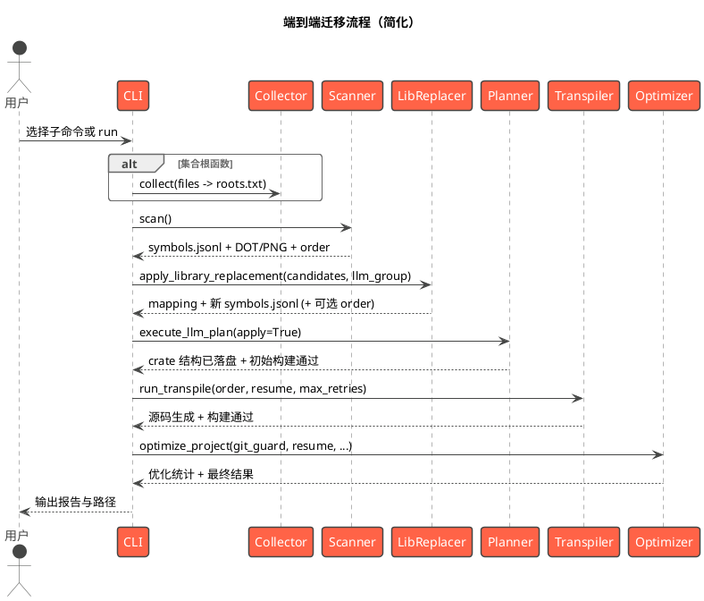

要点
- 每一阶段产物作为下一阶段输入，失败时提供可回退策略（告警并保留当前产物，避免污染）。
- run 对参数进行约束与默认处理，提升整体可用性与确定性。

## 7. 配置与参数说明（概览）

CLI 子命令主要参数（源码为准）
- scan
  - --dot / --only-dot：生成/仅生成 DOT
  - --subgraphs-dir / --only-subgraphs：导出根函数子图
  - 默认 png=True（CLI scan 中）
- prepare
  - -g/--llm-group：指定规划所用模型组
- transpile
  - -g/--llm-group、--only、-m/--max-retries、--resume/--no-resume
- lib-replace
  - -g/--llm-group、--root-list-file、--root-list-syms、--disabled-libs
- collect
  - files（头文件列表）、-o/--out、--cc-root（可选）
- run
  - --files / -o / -g / --root-list-syms / --disabled-libs / -m / --resume
  - 约束：提供 --files 时，lib-replace 固定读取 collect 的 out；未提供 --files 时必须提供 --root-list-syms
- optimize
  - --crate-dir、--unsafe/--no-unsafe、--structure/--no-structure、--visibility/--no-visibility、--doc/--no-doc
  - -m/--max-checks、--dry-run、--include/--exclude、-n/--max-files、--resume/--no-resume、--reset-progress
  - -r/--build-fix-retries、--git-guard/--no-git-guard

## 8. 可靠性与容错设计

- 产物稳定与断点续跑：阶段产物集中在 .jarvis/c2rust，便于中断后继续（resume/进度文件）。
- 构建失败修复：转译与优化阶段提供最小修复循环（次数可控），失败时清晰告警并回退。
- git 保护（optimizer）：启用 git_guard 时在修复耗尽后自动 reset 到快照，避免破坏仓库状态。
- 懒加载与独立运行：CLI 避免不必要依赖；各模块可独立运行与调试。
- 参数约束与提示：run 对参数提供约束提示，减少误用；lib-replace 对根集合来源进行校验与去重。

## 9. 扩展与二次开发建议

- 规则与扫描扩展：在 scanner 中扩展类型与函数信息采集策略（宏处理、更多语言支持），完善顺序计算与根识别。
- 评估策略扩展：library_replacer 中引入更多库策略与禁用集；对剪枝策略进行更精细控制（保留/替代的条件）。
- 结构规划增强：llm_module_agent 引入更多约束（命名规范、模块边界规则），增强 YAML 校验与可视化。
- 转译器增强：transpiler 中扩展语义映射与构建修复启发式，优化符号映射与跨文件依赖处理。
- 优化器细化：optimizer 中对 unsafe 清理与可见性优化提供更细粒度规则，增强重复代码检测与文档生成策略。
- CLI 生态：新增 analyze/export 等子命令，将各阶段摘要与统计导出为独立报告或图形化展示。

附：参考源码关键入口
- scanner.run_scan / compute_translation_order_jsonl / generate_dot_from_db / export_root_subgraphs_to_dir
- collector.collect_function_names
- library_replacer.apply_library_replacement
- llm_module_agent.execute_llm_plan / plan_crate_yaml_text / apply_project_structure_from_yaml
- transpiler.run_transpile
- optimizer.optimize_project
- cli 子命令：scan / prepare / transpile / lib-replace / collect / run / optimize