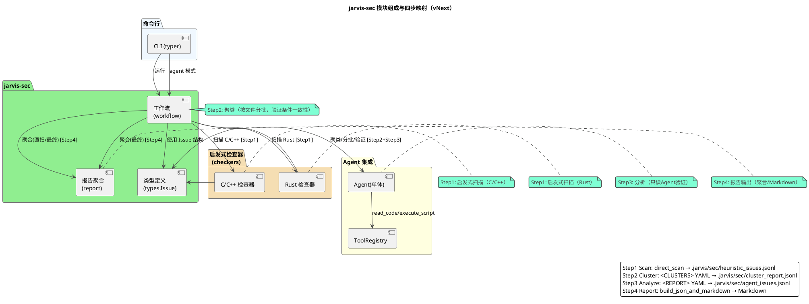
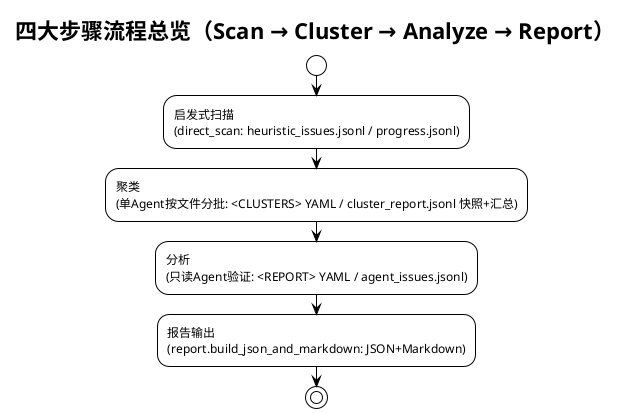
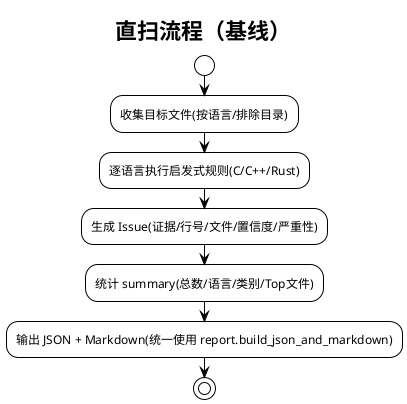
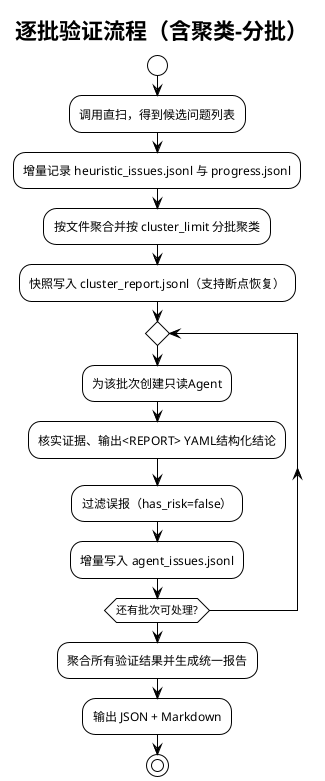

# jarvis-sec 系统架构设计（vNext 首版）

jarvis-sec 是面向 C/C++ 与 Rust 的安全分析套件。系统以“启发式扫描 → 聚类 → 分析 → 报告输出”四步闭环为核心路径，支持只读的单 Agent 验证与可回溯的 JSONL 产物，提供可离线复现的直扫基线。

适用范围
- 语言：C/C++、Rust（可扩展）
- 问题类别：缓冲区/字符串、内存管理、错误处理、并发与同步、FFI 边界、权限与敏感信息、命令执行、输入校验等
- 输出：统一 JSON + Markdown；中间与进度采用 JSONL 增量产物
- 约束：只读分析（Agent 仅可使用 read_code 和 execute_script）；不改动工作区


## 0. 快速概览（非技术）

- 它是什么：jarvis-sec 是一个“看代码找安全问题”的小助手，支持 C/C++ 与 Rust。输出一份易读的 Markdown 报告，告诉你哪类问题、在哪些文件、风险大概多高，并给出修复建议。
- 它怎么工作（类比体检的四步）：
  1) 启发式扫描：先粗筛，把“疑似问题点”找出来；
  2) 聚类：把同一文件里“看起来要验证的条件差不多”的问题归成几组；
  3) 分析：逐组核实，判断哪些真有风险，哪些是误报，并写清楚触发条件与后果；
  4) 报告：把核实过的结果统一汇总，生成易读的报告。
- 你会得到什么：
  - 一份 Markdown 报告（默认 report.md），含总览（问题数量、按语言/类别分布、Top 风险文件）与逐条问题说明（证据、触发路径、后果、建议）。
- 如何使用（最短路径）：
  - python -m jarvis.jarvis_sec.cli agent -p ./你的代码目录 -o ./report.md
- 何时适用：
  - 代码规模较大、需要快速发现常见安全隐患；希望“先看到重点，再逐步治理”。
- 何时不适用：
  - 需要形式化验证或全自动修复；或者完全依赖运行期才能暴露的问题（本工具主要做静态分析）。
- 安全与隐私：
  - 只读分析，不会修改你的代码；每次分析后自动检查并还原潜在改动。
- 成本与时长：
  - 和代码量相关；可用 --cluster-limit 控制每批次核实的规模，在速度与效果间折中。
- 常见问题：
  - “会不会很多误报？”→ 报告只统计“确认有风险”的条目；误报会被标注或直接过滤。
  - “中断了能接着跑吗？”→ 支持，过程中的信息会存成 JSONL 文件，继续执行即可。
  - “能离线用吗？”→ 可以。基础扫描不依赖外部服务。

---

## 1. 核心特性总览

- 单 Agent 聚类分批验证
  - 对同一文件内的候选按“验证条件一致性”聚类，按 cluster_limit 分批交由一个 Agent 验证
  - 以批次控成本，提高稳定性与可控性

- JSONL 产物与断点续扫
  - heuristic_issues.jsonl：直扫候选增量快照
  - progress.jsonl：阶段事件与任务状态流（task_status/batch_status/cluster_status 等）
  - cluster_report.jsonl：聚类结果快照与汇总（支持恢复）
  - agent_issues.jsonl：经 Agent 确认的真实问题增量输出
  - 默认开启断点续扫，运行中断可恢复继续

- 误报治理与确定性
  - 仅 has_risk=true 的条目被计为确认问题；误报可明确标记或不输出
  - 验证输出必须位于 <REPORT>…</REPORT> 的 YAML 数组；聚类输出必须位于 <CLUSTERS>…</CLUSTERS> 的 YAML 数组

- 工作区保护
  - 每次 Agent 执行后检测工作区是否变更，如有变更自动 git checkout -- . 恢复

- 直扫基线可离线复现
  - 纯 Python + 正则启发式，不依赖外部 LLM
  - 统一由报告聚合模块渲染，作为稳定“基线能力”


## 2. 模块组成（PlantUML）



要点
- 直扫路径独立可用，提供离线可复现结果；在此基础上进行“聚类 → 分批 → 验证 → 聚合”
- 两条路径的结构化输出一致，统一由报告聚合模块呈现


## 3. 核心流程

四大步骤概览
- 启发式扫描（direct_scan）：枚举目标文件并执行 C/C++/Rust 启发式规则，生成 candidates；增量写入 .jarvis/sec/heuristic_issues.jsonl，并记录 progress.jsonl（pre_scan_start/pre_scan_done/heuristic_report_written）。
- 聚类（单 Agent 按文件分批）：按文件聚合候选，基于 cluster_limit 进行“验证条件一致性”聚类，输出 <CLUSTERS> 包裹的 YAML；生成 cluster_batches 并快照/汇总写入 .jarvis/sec/cluster_report.jsonl（cluster_status/cluster_report_snapshot/cluster_report_written）。
- 分析（验证）：为每个聚类批次创建只读 Agent，输出 <REPORT> 包裹的 YAML；仅 has_risk=true 的条目增量写入 .jarvis/sec/agent_issues.jsonl；记录 batch_status/task_status，并执行工作区保护（自动 git checkout -- .）。
- 报告输出（聚合）：统一使用 report.build_json_and_markdown 对已确认问题进行聚合评分并渲染 Markdown（含 summary/score/top_risk_files）。



A) 直扫基线（direct_scan）
- 功能：对 C/C++/Rust 文件进行启发式检出，返回结构化 issues 与 summary
- 特点：
  - 纯 Python + 正则启发式（不依赖外部 LLM）
  - 返回统一结构（issues + summary），统一由 report.build_json_and_markdown 渲染为 Markdown



B) 聚类-分批-验证（单 Agent 关键路径）
- 入口：jarvis.jarvis_sec.run_security_analysis(entry_path, ...)
- 步骤：
  1) 启发式直扫，增量写入 heuristic_issues.jsonl，并记录 progress.jsonl
  2) 按文件聚合候选，基于 cluster_limit 分批进行“验证条件一致性”聚类（<CLUSTERS> 包裹的 YAML）
     - 产物：cluster_report.jsonl（快照式写入 + 汇总写入，支持失败后恢复继续）
  3) 针对每个聚类批次，创建单个 Agent 执行只读验证与摘要提取（<REPORT> 包裹的 YAML）
     - 仅 has_risk=true 的条目被确认，增量写入 agent_issues.jsonl
  4) 最终聚合（report.build_json_and_markdown）生成统一 JSON + Markdown



### 阶段设计（Scan / Cluster / Analyze / Report）

- 阶段一：启发式扫描（Scan）
  - 输入与入口：
    - entry_path、languages（可选）、exclude_dirs（可选）
    - 工作流：workflow.direct_scan；在 agent 模式中由 run_security_analysis 先调用并持久化候选
  - 关键策略与实现：
    - 文件枚举：_iter_source_files 枚举 c/cpp/h/hpp/rs，排除 .git/build/out/target/third_party/vendor
    - 启发式规则：checkers.c_checker / checkers.rust_checker 返回统一 Issue 结构
    - 汇总：统计 by_language/by_category/top_risk_files，输出 {"summary","issues"}
    - 产物：在 run_security_analysis 中增量写入 .jarvis/sec/heuristic_issues.jsonl；记录 progress 事件（pre_scan_start/pre_scan_done/heuristic_report_written）
  - 约束与边界：
    - 纯 Python + 正则，不依赖外部 LLM；只读分析
    - Issue 字段完整且描述/建议可用于后续验证提示
  - 性能与容错：
    - 扫描与规则匹配走本地实现；异常不阻塞流程（进度文件失败不影响主流程）

- 阶段二：聚类（Cluster）
  - 输入与入口：
    - 来自阶段一的 candidates，经 compact 后分配全局 gid（1..N），按文件分组
    - run_security_analysis 中每个文件创建聚类 Agent，按 cluster_limit 分批处理
  - 关键策略与实现：
    - 输出约束：聚类结果仅在 <CLUSTERS>…</CLUSTERS> 中输出 YAML 数组，元素含 verification 与 gids
    - 解析与合并：严格解析 YAML，按 gids 将候选合并为批次（cluster_batches）；为每项补充 verify
    - 产物：快照 + 汇总写入 .jarvis/sec/cluster_report.jsonl；记录 progress（cluster_status/cluster_report_snapshot/cluster_report_written）
  - 断点与复用：
    - 若存在既有 cluster_report.jsonl，按 (file, batch_index) 复用聚类结果，跳过 Agent 运行
    - 若聚类失败或为空，回退为“按文件一次处理”的批次集合
  - 约束与边界：
    - 单 Agent、只读工具（read_code/execute_script）；禁止写操作
    - cluster_limit 用于控制每批最大候选数（默认 50）

- 阶段三：分析（Analyze）
  - 输入与入口：
    - 来自阶段二的批次（batch），每个元素含 gid 与 verify；为该批次创建只读 Agent 验证
  - 关键策略与实现：
    - 输出约束：验证结果仅在 <REPORT>…</REPORT> 中输出 YAML 数组
      - 字段：gid、has_risk、preconditions、trigger_path、consequences、suggestions
    - 摘要捕获与重试：订阅 AFTER_SUMMARY 事件获取摘要，解析失败最多重试 2 次
    - 校验与过滤：严格校验 gid 与 has_risk 布尔值；仅保留 has_risk=true 的条目
    - 合并与写入：将验证理由合并回原候选，增量写入 .jarvis/sec/agent_issues.jsonl
  - 工作区保护与审计：
    - 在每次 Agent 执行后检测工作区变更，必要时自动 git checkout -- . 恢复；将恢复信息注入 meta 记录
    - 记录 batch_status / task_status 进度事件（含 parse_fail/issues_count）
  - 约束与边界：
    - 只读工具；避免无关扩展与大范围遍历（共享上下文、相邻告警联合分析）

- 阶段四：报告输出（Report）
  - 输入与入口：
    - 已确认问题（has_risk=true）的增量集合 + 可选 meta 审计信息
    - 报告聚合：report.build_json_and_markdown（内部 aggregate_issues → format_markdown_report）
  - 关键策略与实现：
    - 归一化：补齐字段、生成稳定 id（C/R + sha1[:6]）、计算 score = confidence × severity_weight
    - 概览：summary 中统计 by_language/by_category/top_risk_files，并保留 scanned_root/scanned_files
    - 渲染：统一 Markdown（# 安全问题分析报告（聚合）），详细问题含证据/理由/评分
  - CLI 输出与容错：
    - CLI 写入最终 Markdown（必要时兼容旧直扫标题）；若 Agent 无输出或异常，自动回退到直扫基线（fast）

设计动机
- 隔离性：每个批次独立上下文，便于定位与复现
- 可恢复：多处 JSONL 快照与 progress 日志，支持断点续扫
- 成本可控：按批次控制 LLM 调用规模（cluster_limit）
- 确定性：统一的结构化约束与“误报显式标识”机制


## 4. 数据模型与中间产物

Issue（types.Issue）
- 字段：language、category、pattern、file、line、evidence、description、suggestion、confidence、severity
- 说明：
  - confidence ∈ [0,1]
  - severity ∈ {high, medium, low}（默认 medium）
  - 直扫阶段主要使用 description/suggestion
  - 经 Agent 确认的问题会补充 preconditions/trigger_path/consequences/suggestions（写入增量产物时与候选合并）

统一聚合 JSON（report.aggregate_issues）
- summary
  - total, by_language, by_category, top_risk_files
  - scanned_root, scanned_files（可选）
- issues（每项字段归一化并补充 score）
  - 基于 file/line/category/pattern 生成稳定 id（C/R + sha1 哈希前 6 位）
  - score = confidence × severity_weight

JSONL 产物（默认目录：<entry_path>/.jarvis/sec）
- heuristic_issues.jsonl
  - 直扫候选快照，1 行 1 记录
  - 示例字段：{"language","category","pattern","file","line","evidence","confidence","severity", ...}
- cluster_report.jsonl
  - 聚类结果快照与最终汇总，支持断点恢复
  - 示例：{"file":"path/to/foo.c","verification":"长度检查需满足","gids":[1,3,5],"count":3,"batch_index":1}
- agent_issues.jsonl
  - 经 Agent 确认的真实问题增量输出，1 行 1 issue
  - 示例（合并直扫与 Agent 结论）：{"gid":3,"language":"c/cpp","file":"...","line":123,"pattern":"strcpy",...,"has_risk":true,"preconditions":"...","trigger_path":"...","consequences":"...","suggestions":"..."}
- progress.jsonl
  - 事件流日志，用于审计与断点续扫
  - 常见事件：pre_scan_start/pre_scan_done/heuristic_report_written/cluster_status/cluster_report_snapshot/cluster_report_written/batch_status/task_status
  - 示例：{"event":"cluster_status","status":"done","file":"foo.c","batch_index":1,"clusters_count":3,"timestamp":"...Z"}

Markdown 报告
- 直扫与最终统一由 report.build_json_and_markdown 渲染
  - 标题：# 安全问题分析报告（聚合）
  - CLI 对历史直扫标题做兼容处理（保留旧格式）


## 5. 核心 API 与调用关系

入口 API
- jarvis.jarvis_sec.workflow.direct_scan(entry_path, languages=None, exclude_dirs=None) -> Dict
  - 启发式直扫，返回 {"summary": {...}, "issues": [...]}
- jarvis.jarvis_sec.workflow.run_security_analysis_fast(entry_path, ...) -> str
  - 一键运行直扫并统一聚合为 Markdown（不经 LLM 验证）
- jarvis.jarvis_sec.run_security_analysis(entry_path, languages=None, llm_group=None, report_file=None, cluster_limit=50) -> str
  - 关键路径：直扫 → 聚类分批 → 单 Agent 验证 → 聚合输出（返回 Markdown）
  - JSONL 产物路径默认 <entry_path>/.jarvis/sec
- jarvis.jarvis_sec.workflow.run_with_agent(...) -> str
  - 包装器：内部直接调用 run_security_analysis

报告聚合
- jarvis.jarvis_sec.report.aggregate_issues(issues, scanned_root=None, scanned_files=None) -> Dict
- jarvis.jarvis_sec.report.format_markdown_report(report_json) -> str
- jarvis.jarvis_sec.report.build_json_and_markdown(issues, scanned_root=None, scanned_files=None, meta=None) -> str


## 6. CLI 使用

命令
- Agent 模式（推荐，包含聚类-分批-验证）
  - python -m jarvis.jarvis_sec.cli agent --path ./target_project

常用参数
- --path/-p: 待分析的根目录（必选）
- --llm-group/-g: 本次运行使用的模型组（不修改全局配置）
- --output/-o: 最终 Markdown 报告输出路径（默认 ./report.md）
- --cluster-limit/-c: 聚类每批最多处理的告警数（默认 50）

容错与回退
- Agent 流程异常或无输出时，CLI 自动回退到直扫基线（fast）


## 7. 误报治理与确定性设计

- 明确误报标识
  - 仅 has_risk=true 的条目写入 agent_issues.jsonl；误报可省略或设置 has_risk=false
- 结构化摘要强约束
  - 聚类输出：仅在 <CLUSTERS>…</CLUSTERS> 包裹的 YAML 数组
  - 验证输出：仅在 <REPORT>…</REPORT> 包裹的 YAML 数组，包含 gid 与四元组理由
- 断点续扫
  - heuristic_issues.jsonl / cluster_report.jsonl / progress.jsonl 三方面保障阶段性恢复
- 工作区保护
  - 每次 Agent 执行后自动恢复潜在工作区变更（git checkout -- .）


## 8. 工程实践与性能策略

- 文件枚举与排除
  - 默认扩展：c, cpp, h, hpp, rs
  - 默认排除目录：.git, build, out, target, third_party, vendor
- 扫描实现
  - 当前直扫与规则匹配为纯 Python/正则实现（checkers.c_checker / checkers.rust_checker）
  - 保留 rg 探测与搜索工具函数以便后续优化，但直扫默认不依赖 rg
- 批次控制
  - cluster_limit 控制每批最多候选数，典型值 50
- 报告评分
  - 基于 confidence 与 severity 权重计算 score；Top 风险文件按累计分排序，稳定且可解释


## 9. 扩展与维护建议

- 规则扩展
  - 在 checkers.c_checker / checkers.rust_checker 中新增或优化规则，输出 types.Issue
  - 利用上下文窗口与模式过滤减少误报
- 语言扩展
  - 按语言新增检查器模块（保持相同 Issue 结构）
- 报告定制
  - 在 report 模块调整分类顺序、权重与渲染格式
- 运行策略
  - 结合 progress.jsonl 审计各阶段表现，定位瓶颈与误差来源
  - 适当调整 cluster_limit 以平衡速度与效果


## 10. 附录：结构化提示词约束（节选）

聚类摘要模板（仅输出 <CLUSTERS> 包裹的 YAML）
```
<CLUSTERS>
- verification: "对该聚类的验证条件描述（简洁明确，可直接用于后续Agent验证）"
  gids: [1, 3, 5]
</CLUSTERS>
```

验证摘要模板（仅输出 <REPORT> 包裹的 YAML）
```
<REPORT>
- gid: 1
  has_risk: true
  preconditions: "输入字符串 src 的长度大于等于 dst 的缓冲区大小"
  trigger_path: "函数 foobar 调用 strcpy 时，其输入 src 来自于未经校验的网络数据包，可导致缓冲区溢出"
  consequences: "缓冲区溢出，可能引发程序崩溃或任意代码执行"
  suggestions: "使用 strncpy_s 或其他安全的字符串复制函数"
</REPORT>
```

注意
- 不要在摘要中包含 file/line/pattern 等位置信息；系统在写入 JSONL 时会结合原始候选信息
- 若确认本批次全部为误报或无问题，请返回空数组 []


## 参考实现位置索引

- 工作流（直扫/聚类/验证/聚合）
  - src/jarvis/jarvis_sec/__init__.py：run_security_analysis（聚类-分批-验证-聚合关键路径）
  - src/jarvis/jarvis_sec/workflow.py：direct_scan / run_security_analysis_fast / run_with_agent
- 报告聚合
  - src/jarvis/jarvis_sec/report.py：aggregate_issues / format_markdown_report / build_json_and_markdown
- 类型定义
  - src/jarvis/jarvis_sec/types.py：Issue
- 启发式检查器
  - src/jarvis/jarvis_sec/checkers/c_checker.py
  - src/jarvis/jarvis_sec/checkers/rust_checker.py
- CLI
  - src/jarvis/jarvis_sec/cli.py

版本对齐（近期变更）
- 分离 C/C++/Rust 检查器至独立模块
- 聚类报告改为 JSONL（cluster_report.jsonl）
- 日志输出汉化
- 支持 LLM 明确标识误报（has_risk）
- 启发式扫描与聚类/验证流程的断点续扫支持
- 直扫/最终报告统一使用 report.build_json_and_markdown 渲染