# jarvis-sec 系统架构设计

本文档基于源码目录 src/jarvis/jarvis_sec 下的实现，对"Jarvis安全分析套件（jarvis-sec）"进行结构化架构说明，覆盖模块组成、模块关系、工作流程、以及各模块内部设计。面向本项目开发者与使用者。

参考风格：与本仓库现有架构文档一致，使用 PlantUML 以通俗术语呈现角色与流程，强调职责边界与可回退策略。

- 主要源码模块：
  - cli.py（Typer 命令行入口）
  - __init__.py（单Agent编排：直扫 → 聚类 → 验证 → 聚合）
  - workflow.py（直扫基线、快速模式输出、Markdown 格式化）
  - report.py（统一报告聚合器：JSON + Markdown）
  - checkers/（语言检查规则集合）
    - c_checker.py（C/C++ 启发式规则）
    - rust_checker.py（Rust 启发式规则）
  - types.py（问题数据结构：Issue）

- 核心数据目录与产物（默认路径）：
  - <project_root>/.jarvis/sec/
    - heuristic_issues.jsonl（直扫候选问题）
    - cluster_report.jsonl（聚类快照）
    - agent_issues.jsonl（验证确认问题）
    - progress.jsonl（进度日志）

## 1. 设计目标与总体思路

系统采用"四阶段流水线"设计：启发式扫描 → 聚类 → 分析 → 报告。

### 四阶段概述

1. **启发式扫描阶段**：在不依赖外部服务的前提下，通过纯 Python + 启发式检查器提供"可复现、可离线"的安全问题直扫基线（direct_scan）。输出候选问题列表（heuristic_issues.jsonl）。
2. **聚类阶段**：将候选问题按文件分组，使用单Agent对每个文件内的告警进行"验证条件一致性"聚类，生成聚类批次（cluster_report.jsonl）。
3. **分析阶段**：将每个聚类批次交由单Agent执行"只读验证"，确认是否存在真实安全风险，输出验证确认问题（agent_issues.jsonl）。
4. **报告阶段**：通过报告聚合器将所有确认问题聚合为 JSON + Markdown 报告，包含统计概览与详细条目。

### 核心设计原则

- 只读与安全：Agent 仅使用 read_code/execute_script 两类只读工具，不修改仓库；如检测到工作区变更则自动恢复（git checkout -- .）。
- JSONL 产物与断点续扫：各阶段产物集中在 .jarvis/sec，并通过 JSONL 与轻量进度日志支持断点续扫与中途观察。
- 简洁集成：提供 direct_scan（直扫一键输出）与 run_security_analysis（完整四阶段流水线）两类入口。

## 2. 模块组成（PlantUML）

下图从"四阶段流水线"视角呈现模块静态组成与依赖关系。

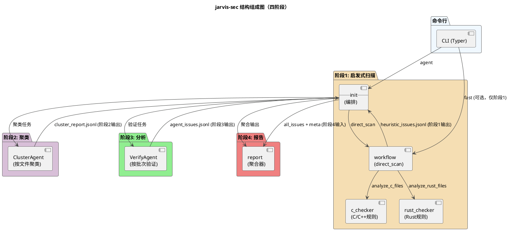

四阶段流程图（简化）
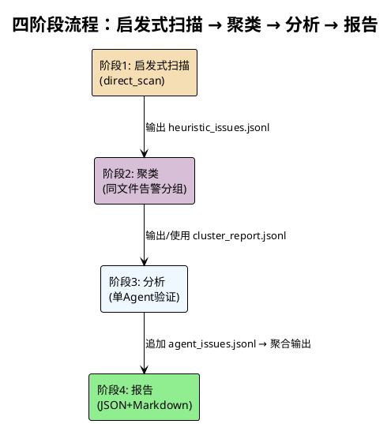

要点
- 四阶段依次执行：启发式扫描 → 聚类 → 分析 → 报告，每阶段产物作为下一阶段输入。
- CLI 提供 agent 子命令（完整四阶段）与 fast 模式（仅阶段1，可选）。
- 数据产物在各阶段生成并复用，形成稳定的"分析上下文"。
- Agent 仅使用只读工具，确保分析过程不修改仓库状态。

## 3. 核心产物与文件约定

按四阶段分类：

### 阶段1：启发式扫描产物
- heuristic_issues.jsonl：direct_scan 的结构化输出（issues），用于断点恢复与后续聚类/验证。

### 阶段2：聚类产物
- cluster_report.jsonl：按文件/批次写入聚类结果（verification, gids, count, batch_index），支持断点复建。

### 阶段3：分析产物
- agent_issues.jsonl：单Agent验证后将"确认存在风险"的问题增量写入（每行一个 issue）。

### 阶段4：报告产物
- 最终输出（字符串）：通过报告聚合器将 issues 聚合，返回"JSON + Markdown"文本（字符串，包含统计与详细条目）。

### 进度与元数据
- progress.jsonl：记录各阶段事件（pre_scan、batch_selection、cluster_status、batch_status、task_status），便于 resume 与中途观察。

## 4. 命令与工作流程

命令行子命令（CLI）
- agent：执行完整四阶段流水线（启发式扫描 → 聚类 → 分析 → 报告），输出最终报告
  - --path/-p：待分析的根目录（必选）
  - --llm-group/-g：使用的模型组（可选）
  - --output/-o：最终Markdown报告输出路径（默认 ./report.md）
  - --cluster-limit/-c：聚类每批最多处理的告警数（默认 50）

四阶段流水线（PlantUML）
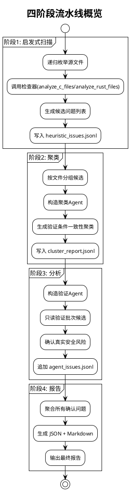

典型流水线（PlantUML）
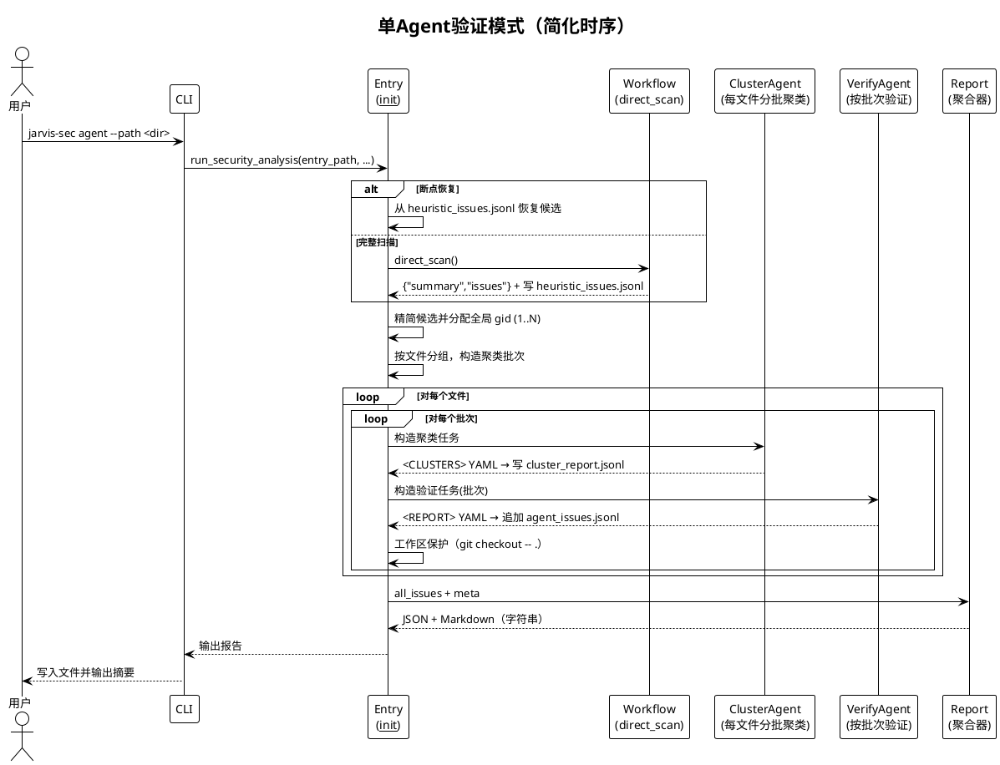

## 5. 模块内部设计

按四阶段组织模块内部设计：

### 5.1 阶段1：启发式扫描（workflow.direct_scan）

职责
- 递归枚举源文件（默认扩展：c, cpp, h, hpp, rs；排除目录：.git/build/out/target/third_party/vendor）。
- 按语言分组并调用检查器（analyze_c_files / analyze_rust_files），收集 Issue。
- 汇总统计（by_language/by_category/top_risk_files/scanned_files/scanned_root），返回结构化 JSON。

关键接口（源码参考）
- _iter_source_files：递归枚举源文件，支持扩展名过滤与目录排除
- _try_rg_search：使用 ripgrep 辅助搜索（可选，若不可用则回退）
- direct_scan：主入口，调用检查器并汇总统计

流程（PlantUML）
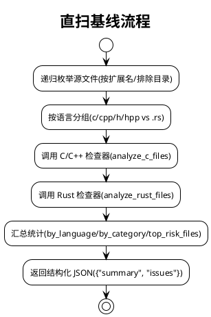

边界与容错
- 文件读取失败时跳过并继续；排除目录可配置；检查器返回空列表不影响汇总。
- 若 ripgrep 不可用，回退为纯 Python 扫描（不影响功能）。

### 5.2 阶段2：聚类（__init__ 中的聚类逻辑）

职责：将候选问题按文件分组，使用单Agent对每个文件内的告警进行"验证条件一致性"聚类。

职责（精细拆解）
- 候选精简与全局编号：
  - 将候选精简为 compact_candidates（language/category/pattern/file/line/evidence/confidence/severity），为每条分配全局 gid（1..N）。
- 按文件分组：
  - 将候选按文件分组，每个文件内按 cluster_limit 分批（默认 50）。
- 构造聚类 Agent：
  - 以"验证条件一致性"为准聚合相近告警。
  - 摘要输出格式：仅在 <CLUSTERS>...</CLUSTERS> 内输出 YAML 数组：
    - verification: 字符串（本簇验证条件）
    - gids: 整数数组（属于该簇的全局编号）
- 断点恢复：
  - 支持断点恢复：若 cluster_report.jsonl 存在，优先复用已有聚类结果。
- 写入聚类快照：
  - 写入 cluster_status（running/done）与 cluster_report_snapshot/cluster_report_written 事件，快照 .jarvis/sec/cluster_report.jsonl。

关键接口（源码参考）
- _parse_clusters_from_text：解析 <CLUSTERS> YAML 内容
- _write_cluster_report_snapshot：写入聚类快照到 cluster_report.jsonl

流程（PlantUML）
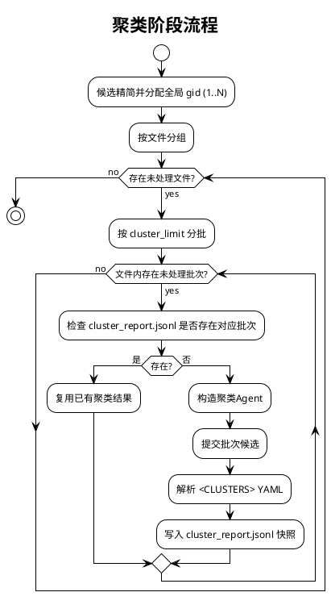

边界与容错
- 聚类摘要解析失败时重试（至多 2 次）；失败批次仍标记进度并继续。
- 聚类快照写入失败不阻断主流程，只打印或记录事件。

### 5.3 阶段3：分析（__init__ 中的验证逻辑）

职责：将每个聚类批次交由单Agent执行"只读验证"，确认是否存在真实安全风险。

职责（精细拆解）
- 构造验证批次：
  - 基于聚类结果构造验证批次（每个批次包含同一验证条件的候选）。
- 构造验证 Agent：
  - 工具限制：read_code/execute_script；禁止写操作。
  - 摘要输出格式：仅在 <REPORT>...</REPORT> 内输出 YAML 数组，每个元素：
    - gid: int（全局编号，>=1）
    - has_risk: bool
    - preconditions/trigger_path/consequences/suggestions: string（当 has_risk=true 时四字段必须非空）
- 解析与校验：
  - 解析严格校验字段与类型；成功则将"确认风险"的条目增量写入 .jarvis/sec/agent_issues.jsonl。
  - 支持重试：摘要解析失败或关键字段缺失时，最多重试 2 次。
- 工作区保护：
  - 每次运行 Agent 后检测 git 工作区是否有变更；如有通过 git checkout -- . 恢复，记录 meta（workspace_restore）。
- 进度追踪：
  - 记录 batch_status 与 task_status 事件，并将每个候选标记为已处理。
  - 基于进度文件跳过已完成的候选（通过 candidate_signature 匹配）。

关键接口（源码参考）
- _try_parse_summary_report：解析 <REPORT> YAML 内容
- _build_summary_prompt：构建验证摘要提示词
- _git_restore_if_dirty：工作区保护（git checkout -- .）

流程（PlantUML）
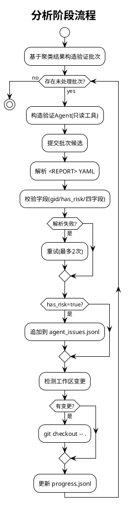

边界与容错
- 验证摘要解析失败时重试（至多 2 次）；失败批次仍标记进度并继续。
- 严禁 Agent 写操作；通过工具白名单（read_code/execute_script）与只读约束保证安全。
- 工作区保护：若检测到文件被修改，立即恢复，确保分析只读。

### 5.4 阶段4：报告（report 模块）

职责：通过报告聚合器将所有确认问题聚合为 JSON + Markdown 报告。

职责（精细拆解）
- 数据归一化：
  - _normalize_issue：归一化字段并补充缺省值（language/category/pattern/file/line/evidence/...）
  - _make_issue_id：基于文件/行/类别/模式哈希生成稳定 ID（C/R 前缀）
- 评分计算：
  - score = confidence * severity_weight（high:3.0, medium:2.0, low:1.0）
- 统计汇总：
  - summary.total：总问题数
  - summary.by_language：按语言统计（c/cpp, rust）
  - summary.by_category：按类别统计（unsafe_api, buffer_overflow, memory_mgmt, ...）
  - summary.top_risk_files：按累计分排序的前 10 个风险文件
- 报告生成：
  - aggregate_issues：聚合问题列表并生成 JSON 报告（summary + issues）
  - format_markdown_report：将聚合后的 JSON 报告渲染为 Markdown
  - build_json_and_markdown：一次性生成报告文本（仅 Markdown）

关键接口（源码参考）
- aggregate_issues：聚合问题列表并生成 JSON 报告
- format_markdown_report：将聚合后的 JSON 报告渲染为 Markdown
- build_json_and_markdown：一次性生成报告文本

流程（PlantUML）
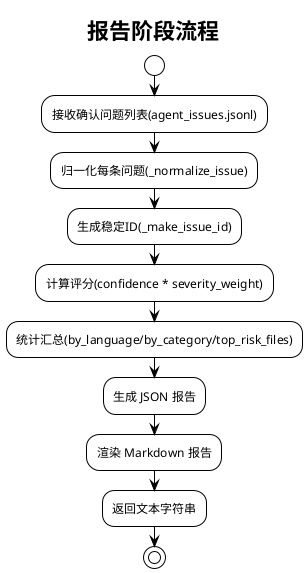

边界与容错
- 接受 Issue/dict 两种形态；缺失字段使用缺省值；评分四舍五入到 2 位小数。
- Markdown 渲染失败时返回空字符串；JSON 序列化失败抛出异常。

### 5.5 checkers/c_checker（C/C++ 启发式规则）

说明：本模块属于阶段1（启发式扫描）的检查器实现。

职责
- 针对 .c/.cpp/.h/.hpp 文件识别基础安全问题，输出 Issue 列表，字段包含 language/category/pattern/file/line/evidence/description/suggestion/confidence/severity。
- 支持多种规则类别：unsafe_api、buffer_overflow、memory_mgmt、error_handling、unsafe_usage、concurrency、thread_safety、input_validation、crypto、resource_leak、network_api、insecure_permissions 等。

关键规则（正则/启发式）
- unsafe_api：strcpy/strcat/gets/sprintf/vsprintf 等不安全字符串 API
- boundary_funcs：memcpy/memmove/strncpy/strncat 等边界操作，需确认长度来源
- realloc_assign_back：realloc 直接覆盖原指针，可能导致内存泄漏
- malloc_no_null_check：内存分配后未见 NULL 检查
- uaf_suspect：use-after-free 线索（free 后解引用使用）
- unchecked_io：I/O/系统调用可能未检查返回值
- format_string：格式化字符串参数不是字面量
- insecure_tmpfile：tmpnam/tempnam/mktemp 不安全临时文件 API
- command_execution：system/popen/exec* 命令执行，参数非字面量
- scanf_no_width：scanf 使用 %s 但未指定最大宽度
- possible_null_deref：指针解引用附近未见 NULL 检查
- uninitialized_ptr_use：野指针使用（声明后未初始化即解引用）
- deadlock_patterns：双重加锁、锁顺序反转、缺失解锁
- double_free_and_free_non_heap：重复释放、释放非堆内存
- 其他：atoi_family、rand_insecure、strtok_nonreentrant、open_permissive_perms、alloca_unbounded、vla_usage、pthread_returns_unchecked、cond_wait_no_loop、thread_leak_no_join、inet_legacy、time_apis_not_threadsafe、getenv_unchecked 等

实现要点（准确性优化）
- 注释移除：_remove_comments_preserve_strings 移除注释（保留字符串/字符字面量），避免注释中的 API 命中导致误报。
- 字符串掩蔽：_mask_strings_preserve_len 将字符串字面量内容替换为空格，避免将字符串中的片段（如 "system("）当作代码。
- 条件编译跳过：_strip_if0_blocks 跳过 #if 0 ... #endif 块。
- 上下文检测：_has_null_check_around、_has_len_bound_around 等辅助函数检测邻近上下文，降低误报。
- 置信度调整：基于上下文线索（NULL 检查、边界检查、SAFETY 注释、测试上下文等）动态调整置信度。

流程（PlantUML）
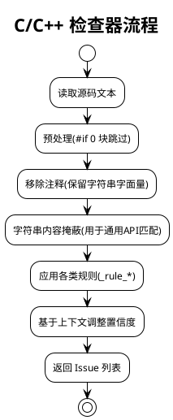

边界与容错
- 文件读取失败时返回空列表；正则匹配失败不影响其他规则；置信度始终落在 [0.4, 0.95] 区间。
- 头文件声明行（typedef/extern）跳过，避免将函数原型误报为调用。

### 5.6 checkers/rust_checker（Rust 启发式规则）

说明：本模块属于阶段1（启发式扫描）的检查器实现。

职责
- 针对 .rs 文件识别基础安全问题，输出 Issue 列表，字段包含 language/category/pattern/file/line/evidence/description/suggestion/confidence/severity。

关键规则（正则/启发式）
- unsafe：存在不安全代码块/标识（检测 SAFETY 注释与测试上下文降低置信度）
- raw_pointer：出现原始指针（*mut/*const）
- mem::transmute：不安全类型转换
- mem::forget：跳过 Drop 导致资源泄漏风险
- MaybeUninit/assume_init：初始化与读取顺序问题
- unwrap/expect：错误处理不充分，可能 panic
- extern "C"：FFI 边界风险（指针有效性/对齐/生命周期/线程安全）
- unsafe impl Send/Sync：并发内存模型风险
- ignored_result：let _ = ... 或 .ok() 等可能忽略错误

实现要点
- 邻域窗口与 SAFETY 注释检测：_window/_has_safety_comment_around 检测邻近 SAFETY 注释（支持中英文），降低置信度。
- 测试上下文检测：_in_test_context 检测 #[test]/cfg(test)/mod tests，适度降低严重度。
- 置信度到严重性映射：_severity_from_confidence（>=0.8→high, >=0.6→medium, <0.6→low）。

流程（PlantUML）
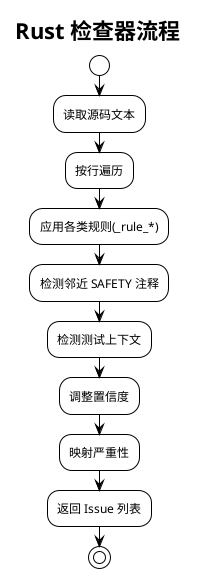

边界与容错
- 文件读取失败时返回空列表；规则匹配失败不影响其他规则；置信度始终落在合理区间。
- 避免对 unsafe impl 重复上报（由专门规则处理）。

### 5.7 cli（命令行协调者）

职责
- 使用 Typer 暴露子命令：agent（单Agent验证模式）。
- 提供参数解析与错误处理，统一输出错误告警与阶段性摘要。

关键行为
- init_env：初始化运行环境与欢迎提示
- 懒加载：避免未使用模块的硬依赖
- 错误与摘要：统一输出错误告警与阶段性摘要
- 回退策略：Agent 无输出时回退到直扫基线（fast 模式）

参数说明
- --path/-p：待分析的根目录（必选）
- --llm-group/-g：使用的模型组（可选，仅对本次运行生效）
- --output/-o：最终Markdown报告输出路径（默认 ./report.md）
- --cluster-limit/-c：聚类每批最多处理的告警数（默认 50）

边界与容错
- 环境初始化失败不应阻塞 CLI 基础功能；报告写入失败打印错误但不中断流程。
- Agent 分析过程出错时回退到直扫基线，确保至少输出基础结果。

## 6. 模块间交互流程（端到端）

典型"直扫 → 聚类 → 验证 → 聚合"的端到端时序。

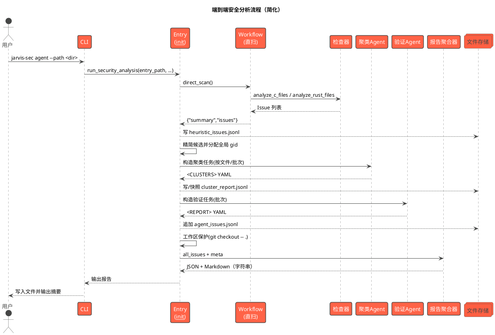

要点
- 每一阶段产物作为下一阶段输入，失败时提供容忍与继续策略；产物集中在 .jarvis/sec 便于断点续扫。
- Agent 全程只读；检测到工作区变更立即回退，保证"分析不破坏仓库状态"。
- 支持断点续扫：基于 progress.jsonl 和已有 JSONL 文件恢复状态，跳过已处理批次。

## 7. 配置与参数说明（概览）

CLI 子命令主要参数（源码为准）
- agent
  - --path/-p：待分析的根目录（必选）
  - --llm-group/-g：使用的模型组（可选，仅对本次运行生效）
  - --output/-o：最终Markdown报告输出路径（默认 ./report.md）
  - --cluster-limit/-c：聚类每批最多处理的告警数（默认 50）

工作流参数
- languages：限定扫描的语言扩展（默认 ["c", "cpp", "h", "hpp", "rs"]）
- exclude_dirs：排除目录列表（默认 [".git", "build", "out", "target", "third_party", "vendor"]）
- report_file：增量报告文件路径（可选，默认 .jarvis/sec/agent_issues.jsonl）
- cluster_limit：聚类每批最多处理的告警数（默认 50）

## 8. 可靠性与容错设计

- 产物稳定与断点续扫：直扫与聚类/验证结果以 JSONL 持久化；progress.jsonl 记录关键事件，便于中断后继续。
- 构建安全与回退：Agent 执行后如检测到文件被修改，则立即执行 git checkout -- . 恢复，保证只读分析。
- 摘要解析容错：聚类与验证摘要严格限定在标记内（<CLUSTERS>/<REPORT>），采用 YAML 安全解析并进行字段校验；失败时重试（最多 2 次）与告警。
- 工具白名单：Agent 仅能使用 read_code 与 execute_script，避免 rm/mv/cp/echo>、sed -i、git、patch、chmod/chown 等写操作。
- 目录与语言过滤：默认排除多类构建/第三方目录，降低误报与扫描耗时。
- 检查器容错：文件读取失败、正则匹配失败、解析异常等不影响主流程，返回空列表或跳过该文件。
- 进度追踪：通过 progress.jsonl 记录每批次状态，支持断点续扫与跳过已完成候选。

## 9. 扩展与二次开发建议

- 规则扩展：在 checkers 中扩展 C/C++ 与 Rust 规则库（缓冲区操作、整数溢出、跨语言 FFI 边界）与置信度模型。
- 聚类策略增强：优化"验证条件一致性"聚类提示词，使簇内条件更可执行；引入局部上下文读取策略以减少误聚。
- 验证提示词细化：根据类别生成专用验证模板（指针边界、长度/对齐、错误传播），提升确认质量。
- 报告聚合增强：在 report 中扩展评分维度与审阅视图（文件粒度统计、按验证条件聚合）。
- 断点与原子写：为快照与增量报告引入原子写与校验，提升长任务可靠性。
- 多语言支持：扩展检查器支持更多语言（Java、Python、Go 等）的安全问题检测。
- 置信度模型优化：基于历史验证结果调整规则置信度，减少误报率。
- 并行化：支持多文件/多批次的并行处理，提升大规模代码库的分析效率。

## 附：参考源码关键入口

- __init__.run_security_analysis：单Agent编排（直扫 → 聚类 → 验证 → 聚合）、只读工具与工作区保护
- workflow.direct_scan：直扫基线、快速模式输出
- workflow._iter_source_files：递归枚举源文件
- checkers.c_checker.analyze_files / analyze_c_cpp_file / analyze_c_cpp_text：C/C++ 检查器入口
- checkers.rust_checker.analyze_rust_files / analyze_rust_file / analyze_rust_text：Rust 检查器入口
- report.aggregate_issues / format_markdown_report / build_json_and_markdown：报告聚合器
- cli.agent：命令行入口（Typer 子命令）
