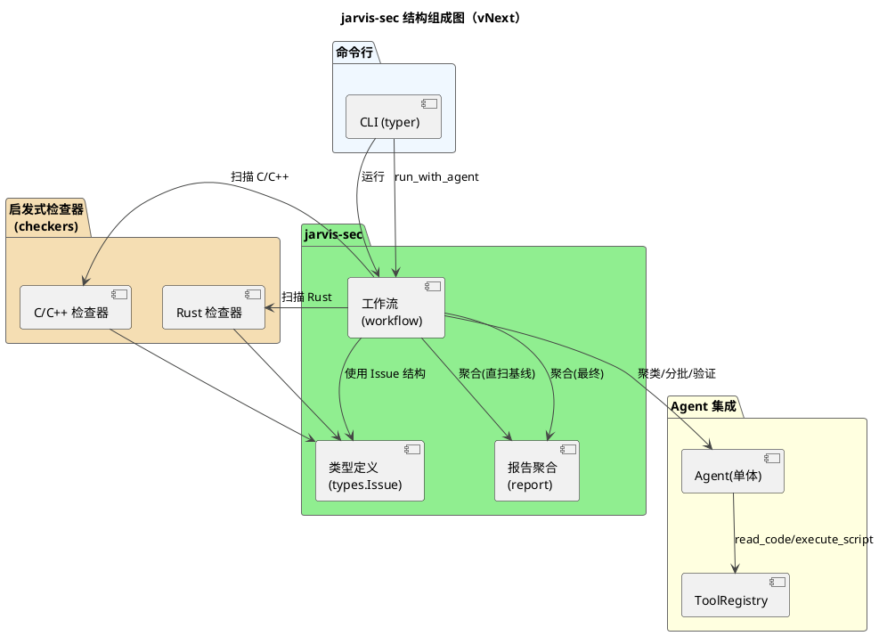
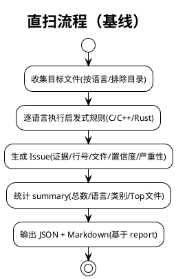
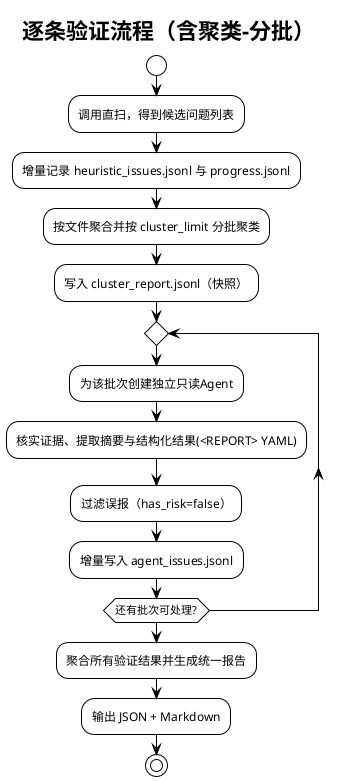

# jarvis-sec 系统架构设计（vNext）

本文档基于最新源码实现，对“jarvis-sec 安全分析套件”的整体设计进行结构化说明。当前系统采用“启发式直扫 + 单Agent聚类分批验证 + 统一聚合”的关键路径，并提供可离线复现的直扫基线与可回溯的 JSONL 产物。

适用范围
- 编程语言：C/C++、Rust（可扩展）
- 问题类别：缓冲区/字符串、内存管理、错误处理、并发与同步、FFI 边界、权限与敏感信息、不安全随机/时间/网络等
- 输出：统一 JSON 结构与 Markdown 报告；进度/中间结果采用 JSONL 增量产物

说明
- 不展开 Agent 的内部实现，仅描述 jarvis-sec 如何使用 Agent
- 仅使用只读工具（read_code, execute_script），严禁对工作区写操作
- 已移除 MultiAgent 编排，当前采用“单Agent逐批验证”的设计


## 1. 关键变化一览

- 单Agent聚类分批验证
  - 对同一文件内的启发式候选进行“验证条件一致性”聚类，并按 cluster_limit 分批提交给一个 Agent 验证
  - 降低长列表逐条验证的成本，提高鲁棒性与可控性

- JSONL 产物与断点续扫
  - heuristic_issues.jsonl：直扫候选增量快照
  - progress.jsonl：阶段事件与任务状态流
  - cluster_report.jsonl：聚类结果快照（可恢复）
  - agent_issues.jsonl：经 Agent 确认的真实问题增量输出
  - 默认开启断点续扫，运行中断后可基于以上文件恢复继续

- 明确误报标识
  - Agent 输出中仅当 has_risk 为 true 才被计为确认问题
  - 允许对误报进行明确标记（has_risk=false 或不输出）

- 工作区保护
  - 每次 Agent 执行后检测工作区是否被修改，如有变更则自动 git checkout -- . 恢复

- 直扫基线可离线复现
  - 纯 Python + 正则/命令行辅助（优先使用 rg 以加速），不依赖外部 LLM
  - 可作为评测的稳定“基线能力”


## 2. 模块组成（PlantUML）



要点
- 直扫路径独立可用，提供离线可复现结果；在此基础上进行“聚类-分批-验证-聚合”
- 报告聚合对两条路径的结构化结果保持一致，便于统一呈现与评测


## 3. 核心流程

A) 直扫基线（direct_scan）
- 功能：基于规则库对 C/C++/Rust 文件进行启发式检出，返回结构化 issues 与 summary
- 特点：
  - 纯 Python + 正则/命令行辅助（优先使用 ripgrep 加速）
  - 返回统一结构（issues + summary），可直接转 Markdown



B) 聚类-分批-验证（单Agent关键路径）
- 入口：jarvis_sec.run_security_analysis(entry_path, ...)
- 步骤：
  1) 启发式直扫，增量写入 heuristic_issues.jsonl，并记录 progress.jsonl
  2) 按文件聚合候选，基于 cluster_limit 分批进行“验证条件一致性”聚类
     - 产物：cluster_report.jsonl（快照式写入，支持失败后恢复继续）
  3) 针对每个聚类批次，创建单个 Agent 执行只读验证与摘要提取
     - 输出 YAML（<REPORT>...</REPORT>）结构化结论
     - 仅 has_risk=true 的条目被确认，增量写入 agent_issues.jsonl
  4) 最终聚合（report.build_json_and_markdown）生成统一 JSON + Markdown



设计动机
- 隔离性：每个批次独立上下文，便于定位与复现
- 可恢复：多处 JSONL 快照与 progress 日志，支持断点续扫
- 成本可控：按批次控制 LLM 调用规模（cluster_limit）
- 确定性：统一的结构化摘要约束与“误报显式标识”机制


## 4. 数据模型与中间产物

Issue 结构（types.Issue）
- 字段：language、category、pattern、file、line、evidence、description、suggestion、confidence、severity
- 说明：
  - confidence 为 [0,1]
  - severity 为 high/medium/low（默认 medium）
  - 直扫阶段主要使用 description/suggestion
  - 经 Agent 确认的问题会补充 preconditions/trigger_path/consequences/suggestions（见下）

聚合后的统一 JSON（report.aggregate_issues）
- summary
  - total, by_language, by_category, top_risk_files
  - scanned_root, scanned_files（可选）
- issues（每项字段归一化并补充 score）
  - 基于 file/line/category/pattern 生成稳定 id（C/R+哈希）
  - score = confidence * severity_weight

JSONL 产物（默认目录：<entry_path>/.jarvis/sec）
- heuristic_issues.jsonl
  - 启发式直扫的候选快照，1 行 1 记录
  - 字段示例：{"language","category","pattern","file","line","evidence","confidence","severity", ...}
  - 注：该阶段不包含 gid（全局编号在内存中为候选分配，用于聚类/验证）
- cluster_report.jsonl
  - 聚类结果快照，支持断点恢复与复用
  - 记录示例：
    - {"file":"path/to/foo.c","verification":"长度检查需满足","gids":[1,3,5],"count":3,"batch_index":1}
- agent_issues.jsonl
  - 经 Agent 确认的真实问题增量输出，1 行 1 issue
  - 记录示例（合并直扫与 Agent 结论）：
    - {"gid":3,"language":"c/cpp","file":"...","line":123,"pattern":"strcpy",...,"has_risk":true,"preconditions":"...","trigger_path":"...","consequences":"...","suggestions":"..."}
- progress.jsonl
  - 事件流日志，便于审计与断点续扫
  - 事件类型（部分）：pre_scan_start/pre_scan_done/heuristic_report_written/cluster_status/cluster_report_snapshot/cluster_report_written/batch_status/task_status
  - 示例：
    - {"event":"cluster_status","status":"done","file":"foo.c","batch_index":1,"clusters_count":3,"timestamp":"...Z"}

Markdown 报告
- 直扫基线：workflow.format_markdown_report（标题：# OpenHarmony 安全问题分析报告（直扫基线））
- 聚合最终：report.build_json_and_markdown → report.format_markdown_report（标题：# 安全问题分析报告（聚合））


## 5. 核心 API 与调用关系

入口 API
- jarvis.jarvis_sec.workflow.direct_scan(entry_path, languages=None, exclude_dirs=None) -> Dict
  - 启发式直扫，返回 {"summary": {...}, "issues": [...]}
- jarvis.jarvis_sec.workflow.run_security_analysis_fast(entry_path, ...) -> str
  - 一键运行直扫并聚合为 Markdown（不经 LLM 验证）
- jarvis.jarvis_sec.run_security_analysis(entry_path, languages=None, llm_group=None, report_file=None, cluster_limit=50) -> str
  - 关键路径：直扫 → 聚类分批 → 单Agent验证 → 聚合输出（返回 Markdown）
  - JSONL 产物路径默认位于 <entry_path>/.jarvis/sec
- jarvis.jarvis_sec.workflow.run_with_agent(...) -> str
  - wrapper，内部直接调用 run_security_analysis

报告聚合
- jarvis.jarvis_sec.report.aggregate_issues(issues, scanned_root=None, scanned_files=None) -> Dict
- jarvis.jarvis_sec.report.format_markdown_report(report_json) -> str
- jarvis.jarvis_sec.report.build_json_and_markdown(issues, scanned_root=None, scanned_files=None, meta=None) -> str

类型定义
- jarvis.jarvis_sec.types.Issue（dataclass）：启发式直扫的统一结构


## 6. CLI 使用

命令
- Agent 模式（推荐，包含聚类-分批-验证）
  - python -m jarvis.jarvis_sec.cli agent --path ./target_project
- 常用参数
  - --path/-p: 待分析的根目录（必选）
  - --llm-group/-g: 本次运行使用的模型组（不修改全局配置）
  - --output/-o: 最终 Markdown 报告输出路径（默认 ./report.md）
  - --cluster-limit/-c: 聚类每批最多处理的告警数（默认 50）

容错与回退
- Agent 流程异常或无输出时，CLI 自动回退到直扫基线（fast）


## 7. 误报治理与确定性设计

- 明确误报标识
  - Agent 摘要中仅当 has_risk=true 的条目才写入 agent_issues.jsonl
  - 误报可省略或设置 has_risk=false
- 结构化摘要强约束
  - 聚类输出：要求在 <CLUSTERS>...</CLUSTERS> 包裹的 YAML 数组
  - 验证输出：要求在 <REPORT>...</REPORT> 包裹的 YAML 数组，包含 gid 与四元组理由
- 断点续扫
  - heuristic_issues.jsonl / cluster_report.jsonl / progress.jsonl 三方面保障阶段性恢复
- 工作区保护
  - 每次 Agent 执行后自动恢复潜在的工作区变更（git checkout -- .）


## 8. 性能与工程实践

- 文件枚举与排除
  - 默认语言扩展：c, cpp, h, hpp, rs
  - 默认排除目录：.git, build, out, target, third_party, vendor
- 搜索与加速
  - 优先使用 rg -n 进行快速匹配（自动探测可用性），失败回退纯 Python
  - rg 命令分批（默认 200 文件）避免命令行过长
- 批次控制
  - cluster_limit 控制每批最多候选数，典型值 50
- 报告评分
  - 基于 confidence 与 severity 的权重计算 score，Top 风险文件按累计分排序（更稳定）


## 9. 扩展与维护建议

- 规则扩展
  - 在 checkers.c_checker / checkers.rust_checker 中新增或优化规则，输出 types.Issue
  - 可通过上下文窗口与模式过滤减少误报（参考现有实现的误报治理策略）
- 语言扩展
  - 按语言新增检查器模块（保持相同 Issue 结构）
- 报告定制
  - 可在 report 模块调整分类顺序、权重与渲染格式
- 运行策略
  - 结合 progress.jsonl 审计各阶段表现，定位瓶颈与误差来源
  - 适当调整 cluster_limit 以平衡速度与效果


## 10. 附录：结构化提示词约束（节选）

聚类摘要模板（只输出 <CLUSTERS> 包裹的 YAML）
```
<CLUSTERS>
- verification: "对该聚类的验证条件描述（简洁明确，可直接用于后续Agent验证）"
  gids: [1, 3, 5]
</CLUSTERS>
```

验证摘要模板（只输出 <REPORT> 包裹的 YAML）
```
<REPORT>
- gid: 1
  has_risk: true
  preconditions: "输入字符串 src 的长度大于等于 dst 的缓冲区大小"
  trigger_path: "函数 foobar 调用 strcpy 时，其输入 src 来自于未经校验的网络数据包，可导致缓冲区溢出"
  consequences: "缓冲区溢出，可能引发程序崩溃或任意代码执行"
  suggestions: "使用 strncpy_s 或其他安全的字符串复制函数"
</REPORT>
```

注意
- 不要在摘要中包含 file/line/pattern 等位置信息；系统会在写入 JSONL 时结合原始候选信息
- 若确认本批次全部为误报或无问题，请返回空数组 []


## 参考实现位置索引

- 关键工作流（直扫/聚类/验证/聚合）
  - src/jarvis/jarvis_sec/__init__.py: run_security_analysis（聚类-分批-验证-聚合关键路径）
  - src/jarvis/jarvis_sec/workflow.py: direct_scan / run_security_analysis_fast / run_with_agent
- 报告聚合
  - src/jarvis/jarvis_sec/report.py: aggregate_issues / format_markdown_report / build_json_and_markdown
- 类型定义
  - src/jarvis/jarvis_sec/types.py: Issue
- 启发式检查器
  - src/jarvis/jarvis_sec/checkers/c_checker.py
  - src/jarvis/jarvis_sec/checkers/rust_checker.py
- CLI
  - src/jarvis/jarvis_sec/cli.py

本设计与实现已对齐以下近期变更
- 分离 C++/Rust 检查器逻辑至独立模块
- 聚类报告改为 JSONL（cluster_report.jsonl）
- 日志输出汉化
- 支持 LLM 明确标识误报（has_risk）
- 启发式扫描与聚类/验证流程的断点续扫支持