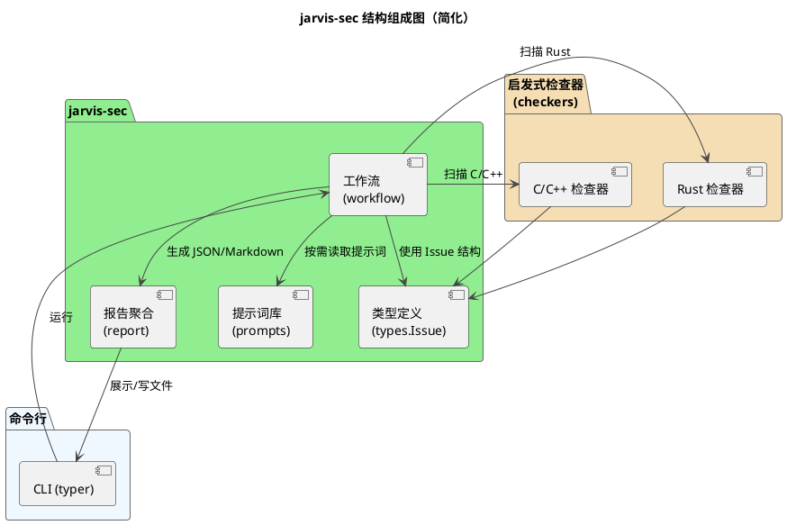
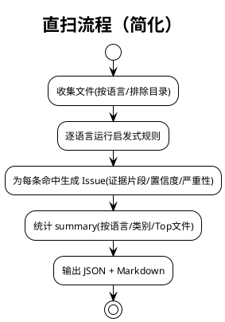

# jarvis-sec 系统架构设计

本文档基于源码，对“jarvis-sec 安全分析套件”的整体设计进行结构化说明，聚焦两条能力路径：
- 直扫基线（direct_scan）：纯 Python + 正则/命令行辅助，离线可复现，快速提供结构化结果与 Markdown 报告
- 单Agent逐条验证（当前关键路径）：对直扫候选逐条创建独立 Agent 验证与摘要提取，最终统一聚合输出；支持并发或串行执行


说明
- 本文不展开 Agent 的内部实现，仅描述 jarvis-sec 如何使用 Agent
- 风格与其他架构文档保持一致，PlantUML 用通俗术语表达


- 代码参考
  - 工作流与入口：src/jarvis/jarvis_sec/workflow.py、src/jarvis/jarvis_sec/__init__.py、src/jarvis/jarvis_sec/cli.py
  - 启发式检查器：src/jarvis/jarvis_sec/checkers/c_checker.py、src/jarvis/jarvis_sec/checkers/rust_checker.py
  - 报告聚合：src/jarvis/jarvis_sec/report.py
  - 类型定义：src/jarvis/jarvis_sec/types.py


## 1. 设计目标与总体思路

- 可复现与可离线：提供一条完全不依赖外部服务的直扫路径（direct_scan），作为稳定的“基线能力”
- 渐进增强：在具备模型运行条件时，采用“直扫 + 逐条验证 + 聚合”的路径，提升问题质量与可解释性
- 安全聚焦：阶段目标覆盖内存管理、缓冲区操作、错误处理为主的基础问题；随规则库演进逐步覆盖并发、FFI、权限与敏感信息等

- 结果统一：统一结构化输出（JSON）与阅读友好的 Markdown 报告，便于评测、审阅与归档


## 2. 模块组成（PlantUML）

下图展示 jarvis-sec 的核心模块与相互关系，包含两条能力路径：直扫路径与多智能体路径。



要点
- 直扫路径独立可用，提供离线可复现的结果；在此基础上进行“逐条验证与聚合”

- 报告聚合对两条路径的结构化结果保持一致，便于统一呈现与评测


## 3. 能力与范围

目前覆盖的语言与类别（随规则库演进）
- 语言：C/C++、Rust（已实现）；后续可扩展到 Go、Python、Java 等
- 典型类别（示例，不限于此）
  - 缓冲区/字符串：不安全 API（strcpy/strcat/sprintf/gets 等）、strncpy 无结尾风险、scanf 未限宽、格式化字符串问题
  - 内存管理：malloc/free/realloc 不匹配、双重释放、未初始化使用、可能的空指针解引用
  - 错误处理：返回值未检查、错误路径资源泄漏、errno 未处理
  - 并发与同步：死锁模式、线程泄漏、条件变量等待未置于循环
  - FFI/跨语言：extern "C"、不安全接口边界
  - 权限与敏感信息：过宽权限、硬编码凭据/密钥（规则初步）
  - 其他：不安全随机、时间与网络 API 风险
- 输出结构统一：issues 列表 + summary 聚合（total/by_language/by_category/top_risk_files）


## 4. 直扫基线（direct_scan）

直扫基线由 workflow.direct_scan 提供，特点：
- 纯 Python + 正则/命令行辅助（优先使用 ripgrep 加速，自动探测 _rg_available）
- 基于规则库检出安全疑点，返回结构化 issues，附带“证据片段/行号/文件路径”
- 生成 summary：统计总量、语言与类别分布、Top 风险文件等
- 可直接转 Markdown（workflow.format_markdown_report），便于阅读与归档

直扫流程（PlantUML）


说明
- C/C++ 与 Rust 分别由 checkers.c_checker / checkers.rust_checker 提供规则
- 使用 ripgrep（如可用）快速定位候选，再读取上下文窗口计算置信度与严重性
- 置信度 [0,1]；严重性分 high/medium/low（由命中规则与上下文线索推断）


## 5. 验证流程（单Agent逐条）

验证流程说明
- 流程：先直扫得到候选 → 对每个候选构建独立 Agent 按只读工具进行证据核实与摘要提取 → 聚合生成 JSON + Markdown。
- 入口：jarvis_sec.run_security_analysis（内部完成直扫、逐条验证与聚合）。
@startuml
!theme plain
title 逐条验证流程（简化）

start
:调用直扫，得到候选问题列表;
:逐条创建独立 Agent 执行只读验证（read_code/execute_script）;
:提取每条验证的摘要与结构化结果;
:聚合所有验证结果并生成统一报告;
:输出 JSON + Markdown;
stop
@enduml
```


当前实现与“关键路径”澄清
- 代码核对：在 run_security_analysis 中，针对每个候选是“逐条创建并运行单 Agent”完成验证与摘要解析。证据：src/jarvis/jarvis_sec/__init__.py 第451-489行（Agent(**kwargs)，output_handler=[ToolRegistry]，use_tools=["read_code","execute_script"]）。
- 选择原因（当前版本）：隔离性（每条候选独立上下文，便于定位与复现）、可恢复（progress.jsonl 支持断点续扫）、可控成本（按条计费/超时控制）、确定性更强（统一 SUMMARY 报告提取）。

## 6. 核心工具能力（验证流程中使用）

在验证流程中，Agent 借助工具完成“检索/分析/验证/复核”，推荐能力与规范如下：
- 读取代码：read_code
  - 用途：读取目标文件（可带行号与范围），作为分析证据
  - 建议：先读后写，按需指定范围避免膨胀
- 命令执行（静态检测等）：execute_script
  - 用途：执行 rg/grep 等命令检索证据、运行构建或本地分析脚本
  - 约束：非交互模式有超时限制；输出建议过滤（rg/grep）
  - 建议：在一个脚本中收敛多个命令，附上“可复现步骤”
- 网页搜索：search_web
  - 用途：查阅 API/最佳实践/CVE/安全建议
  - 建议：明确查询目标并复核关键结论
- 文件修改（如需修复 PoC）：PATCH / REWRITE
  - PATCH：唯一命中、区间合法、原子写入、失败回滚；优先使用
  - REWRITE：整文件重写，仅在确需时使用
- 记忆工具：save_memory / retrieve_memory / clear_memory
  - 用途：沉淀通用方法与项目约定，便于后续复用和检索


## 7. 数据模型与报告结构

统一的 Issue 结构（types.Issue）
- 字段：language、category、pattern、file、line、evidence、description、suggestion、confidence、severity
- 说明：confidence 为 [0,1]，severity 为 high/medium/low

统一的报告结构（JSON）
- issues: List[Issue or Dict]
- summary:
  - total: 总数
  - by_language: {"c/cpp": N, "rust": M, ...}
  - by_category: {"buffer_overflow": x, "unsafe_api": y, "memory_mgmt": z, ...}
  - top_risk_files: ["path1", "path2", ...]
- Markdown：report.format_markdown_report / workflow.format_markdown_report 负责将 JSON 转为可读报告（包含统计与改进建议片段）


## 8. 入口与参数

- 直扫一键输出
  - workflow.run_security_analysis_fast(entry_path, languages=None, exclude_dirs=None) -> str
  - 返回 Markdown 字符串（内部已组织 JSON + Markdown）
- 直扫原子能力
  - workflow.direct_scan(entry_path, languages=None, exclude_dirs=None) -> Dict
  - workflow.format_markdown_report(result_json: Dict) -> str
- 逐条验证运行
  - jarvis_sec.run_security_analysis(entry_path, languages=None, exclude_dirs=None, ...) -> str
  - 内部包含：直扫 -> 多 Agent 验证/补充 -> 聚合输出
- CLI（Typer）
  - python -m jarvis.jarvis_sec.cli agent --path ./target_project
  - 可选：--output 指定 Markdown 输出路径
- 语言与目录控制
  - languages: ["c/cpp", "rust"]（可扩展）
  - exclude_dirs: 排除目录列表（如第三方依赖、生成目录等）


## 9. 可靠性与容错设计

- 离线基线：直扫路径不依赖外部服务，保证“随时可跑、结果可复现”
- ripgrep 自适应：优先使用 rg 加速，缺失时自动回退到 Python 逻辑
- 解析防御：消息块/结构严格校验，缺字段/格式问题给出明确修复建议
- 上下文控制：消息转发时附带摘要，并可按配置清理历史，控制上下文长度
- 输出稳健：统一 JSON 结构，Markdown 转换兜底；聚合模块容错缺字段
- 回退策略：当验证流程出错或无输出时，CLI 可回退到直扫基线（run_security_analysis_fast）


## 10. 典型流程

A) 仅用直扫（快速评估）
1) CLI 调用 run_security_analysis_fast
2) workflow.direct_scan 收集与分析 -> issues + summary
3) 报告模块生成 JSON + Markdown
4) 输出 Markdown 至终端或文件


## 11. 扩展与二次开发建议

- 规则库演进：为更多语言与类别补充规则；将已有规则按“命中权重/上下文线索”抽象为可配置项
- 检出质量提升：引入“多行/函数级/跨文件”的上下文特征，减少误报；按仓库/模块维度引入基线阈值
- 多智能体模板：将 Planner/Collector/Analyzer/Aggregator 的提示词参数化，便于快速适配不同团队规范
- 报告增强：增加“逐类建议与修复参考链接”，支持“按模块/风险等级”筛选与导出
- CI 集成：提供最小依赖的直扫检查步骤；结合阈值进行“失败/警告”门控
- 数据沉淀：利用记忆工具沉淀“常见缺陷模式/修复清单”，形成组织级知识库


## 12. 总结

- 当前提供“离线直扫基线”与“单Agent逐条验证”两条路径：前者保证随时可用与可复现，后者提供更深入的验证与解释
- 通过只读工具链（read_code/execute_script）完成证据核实与摘要提取，最后统一聚合输出
- 统一的数据模型与报告结构，便于结果评测、审阅与归档；随规则库与提示词演进，能力可持续增强