# 初赛技术报告（基于 Jarvis-Agent 的 jsec 与 jc2r 实现）

## 目录
- a. 系统架构设计
- b. 核心算法与策略
- c. 功能实现说明
- d. 测试方案设计

## 系统架构设计

本次安全分析与代码生成工具是基于Jarvis的通用Agent、代码生成Agent（CodeAgent）和多Agent实现的。

三者的关系如下：

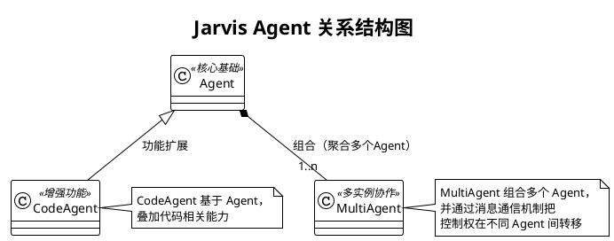

接下来依此对每个模块进行详细说明。


### Agent 系统架构设计

本文档围绕 Jarvis 的核心执行实体 Agent，基于源码与现有文档进行结构化设计说明，覆盖模块组成、职责与接口、与外部系统/环境的交互、模块间交互流程、参数说明与典型执行过程。目标读者为本项目开发者与高级用户。


- 相关核心组件：EventBus、MemoryManager、TaskAnalyzer、FileMethodologyManager、PromptManager、SessionManager、ToolRegistry、AgentRunLoop、TaskPlanner、PlatformRegistry/BasePlatform、工具执行器 execute_tool_call、输入处理器链 builtin_input_handler/shell_input_handler/file_context_handler、EditFileHandler/RewriteFileHandler 等


#### 1. 设计目标与总体思路

- 轻协调、强委托：Agent 保持轻量化，侧重编排，将核心逻辑委托至独立组件（运行循环、工具注册表、平台适配层等）。
- 高解耦、可插拔：通过 Registry（ToolRegistry/PlatformRegistry）与事件总线（EventBus）实现能力可插拔与旁路扩展。
- 稳健运行：针对模型空响应、上下文超长、工具输出过大、异常回调等场景提供防御性处理。
- 易扩展与可观测：关键节点统一事件广播，支持 after_tool_call 回调动态注入；启动时输出资源统计，便于观测。
- 多场景友好：支持非交互模式、子 Agent 递归规划执行、文件上传/本地两种方法论与历史处理模式、工具筛选降噪等。


#### 2. 模块组成

下图展示 Agent 内部与其周边模块的静态组成与依赖关系，聚焦 Agent 直接协作的组件。

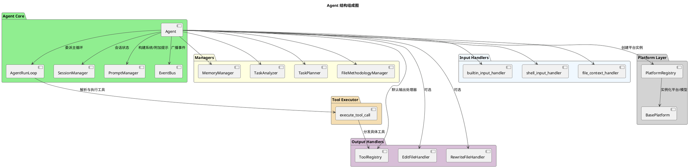


#### 3. 模块功能说明

##### 模块图型与聚焦清单
- Agent（协调中枢）
  - 图型：组件图（与 EventBus/Prompt/Session/Managers/Handlers 的关系）+ 精简时序图（初始化→委派→完成）
  - 聚焦：委派与事件广播边界；非交互/多 Agent/自动完成策略；工具筛选触发条件与系统提示重设时机
- AgentRunLoop（主循环）
  - 图型：活动图（循环判定、自动摘要阈值、工具调用与中断分支）
  - 聚焦：进入/跳出循环条件；auto_summary_rounds 触发；need_return 的短路返回
- ToolRegistry（工具注册与执行）
  - 图型：时序图（Agent→ToolRegistry→具体工具→返回）
  - 聚焦：单响应一次调用约束；格式容错；长输出分流策略
- execute_tool_call（统一入口）
  - 图型：时序图（选择处理器→可选确认→处理器执行→标准返回）
  - 聚焦：返回协议（need_return/tool_prompt）；多处理器冲突拒绝策略
- SessionManager（会话）
  - 图型：状态图（Active↔Persisted(file)；Clear 重置）或活动图（save/restore/clear）
  - 聚焦：清理历史后“保留系统提示约束”；保存/恢复文件命名与作用域
- PromptManager（提示）
  - 图型：数据流/组件图（system_prompt=系统规则+工具提示；addon_prompt=工具规范+记忆引导+完成标记）
  - 聚焦：拼装来源与回退策略（无 PromptManager 时的兼容）
- EventBus（事件）
  - 图型：时序图（emit→多订阅者回调→异常隔离）
  - 聚焦：关键事件节点与“旁路增强不影响主流程”的承诺
- MemoryManager（记忆）
  - 图型：活动图（TASK_STARTED/BEFORE_HISTORY_CLEAR/TASK_COMPLETED→是否 force_save_memory→prompt_memory_save）
  - 聚焦：强制保存门控；标签提示注入位置；工具存在性检查
- TaskPlanner（规划）
  - 图型：活动图（需拆分?/深度限制→子 Agent 执行→结果汇总写回）
  - 聚焦：不拆分条件；深度与步数上限；写回块 <PLAN>/<SUB_TASK_RESULTS>/<RESULT_SUMMARY>
- FileMethodologyManager（文件/方法论）
  - 图型：决策活动图（upload 模式 vs 本地模式；历史转移流程）
  - 聚焦：提示写回 session 的语义；上传失败回退到本地策略
- PlatformRegistry（平台）
  - 图型：组件+流程（目录扫描→校验→注册→创建/普通平台获取）
  - 聚焦：用户目录与内置目录合并策略；必需方法校验
- 输入处理器链 & 用户交互封装
  - 图型：管线式活动图（按序处理，遇 need_return 提前返回；多行输入签名兼容）
  - 聚焦：提前返回对主循环的影响；交互层可替换性（CLI→TUI/WebUI）
- EditFileHandler/RewriteFileHandler（文件写入）
  - 图型：活动图（PATCH 单点/区间校验→原子写入；REWRITE 整文件回滚）
  - 聚焦：唯一匹配/区间合法性；原子写与回滚保障

##### 读者使用建议
- 先读“模块职责要点”，再看“对应图”，如需实现细节再去源码。文档图用于建立“概念模型”，不替代源码阅读。

- Agent（核心协调者）
  - 初始化并组装组件（EventBus/Managers/Handlers/Platform/Session）
  - 设置系统提示，首轮按需进行工具筛选与文件/方法论处理
  - 将主运行循环委派给 AgentRunLoop
  - 在关键节点广播事件（TASK_STARTED、BEFORE/AFTER_MODEL_CALL、BEFORE/AFTER_HISTORY_CLEAR、BEFORE/AFTER_ADDON_PROMPT、BEFORE/AFTER_SUMMARY、BEFORE_TOOL_FILTER、TOOL_FILTERED、AFTER_TOOL_CALL、INTERRUPT_TRIGGERED）
- AgentRunLoop（主循环执行体）
  - 驱动“模型思考 → 工具执行 → 结果拼接/中断处理 → 下一轮”的迭代
  - 统一处理工具返回协议与异常兜底，支持自动完成
- SessionManager（会话状态）
  - 管理 prompt、附加提示、会话长度计数、用户数据；负责保存/恢复/清理历史
- PromptManager（提示管理）
  - 构建系统提示（系统规则 + 工具使用提示），构建默认附加提示（工具规范 + 记忆提示）
- EventBus（事件总线）
  - 提供 subscribe/emit/unsubscribe；同步回调异常隔离，不影响主流程
- ToolRegistry（工具注册表，默认输出处理器）
  - 发现/加载/执行工具（内置、外部 .py、MCP）；解析 TOOL_CALL，执行并返回标准化结果
- EditFileHandler/RewriteFileHandler
  - 文件编辑/重写能力；可通过 disable_file_edit 禁用
- MemoryManager（记忆管理）
  - 记忆标签提示注入；关键事件驱动下进行记忆整理/保存；与 save/retrieve/clear_memory 工具协作
- TaskAnalyzer（任务分析）
  - 任务完成阶段旁路分析与满意度收集；必要时沉淀方法论
- TaskPlanner（任务规划）
  - 递归任务拆分与子任务调度；将 <PLAN>/<SUB_TASK_RESULTS>/<RESULT_SUMMARY> 写回父 Agent 上下文
- FileMethodologyManager（文件与方法论）
  - 基于平台能力选择“文件上传模式”或“本地模式”；加载/上传方法论；上下文溢出时以文件方式转移历史
- PlatformRegistry/BasePlatform（平台/模型）
  - 屏蔽不同 LLM 服务商差异；Agent 通过统一接口 chat_until_success/set_system_prompt/upload_files 等进行交互
- 工具执行器 execute_tool_call
  - 解析模型响应中的工具调用，仅允许单次调用；执行前确认、执行后回调、长输出处理（上传或智能截断）等

##### 3.1 Agent 设计

- 内部实现结构（PlantUML）
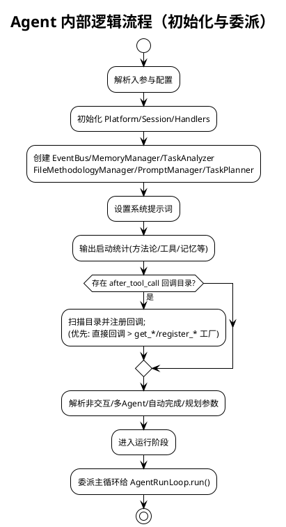

- 职责与定位：
  - 轻量协调者：初始化组件、构建系统/附加提示、委派主循环、广播事件
  - 通过 Registry 与事件总线实现可插拔能力与旁路扩展
- 核心方法：
  - __init__: 解析参数与配置；初始化 Platform/Session/Handlers/Managers/Prompt；设置系统提示；统计资源；加载 after_tool_call 回调
  - run/_main_loop: 进入主循环，委派 AgentRunLoop
  - _call_model/_invoke_model: 输入处理、附加提示拼接、上下文计数与模型调用（含 BEFORE/AFTER_MODEL_CALL 事件）
  - _call_tools: 工具执行委派至 execute_tool_call
  - _complete_task: 处理总结与任务完成事件，触发记忆/分析旁路
  - _filter_tools_if_needed: 工具超过阈值时使用临时模型筛选并重设系统提示
  - _summarize_and_clear_history: 上下文过长的摘要/文件上传分流与历史清理
- 关键参数影响行为：auto_complete、need_summary、use_methodology、use_analysis、execute_tool_confirm、force_save_memory、non_interactive、in_multi_agent、plan/plan_max_depth/plan_depth、disable_file_edit、use_tools/files 等
- 小型结构图：
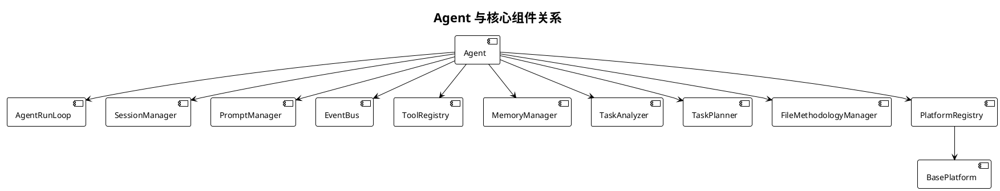

- 历史清理与摘要分流（Agent）
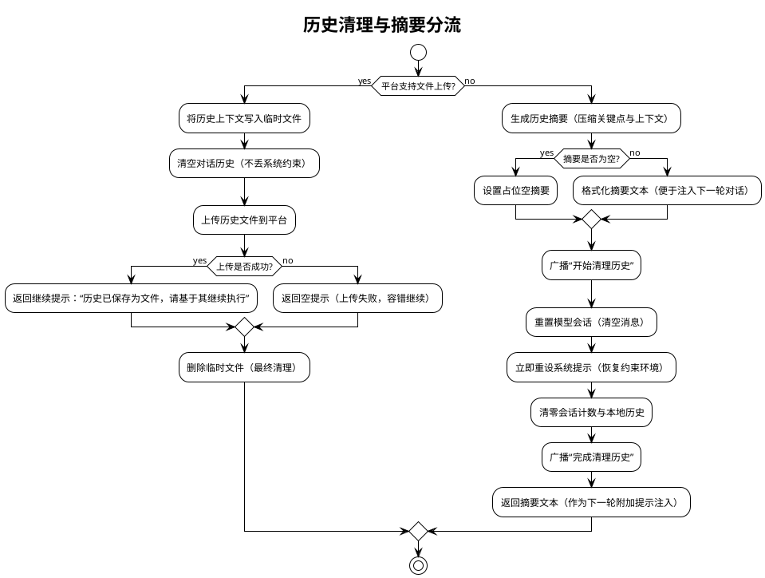

图示说明
- 分流依据：根据平台是否支持文件上传选择路径；支持时将历史写为文件上传；不支持则生成摘要
- 关键约束：清理历史后必须重设系统提示，避免丢失行为规范与工具约束
- 失败回退：上传失败返回空提示；摘要为空则使用占位文本；流程不中断

- 工具筛选流程（Agent._filter_tools_if_needed）

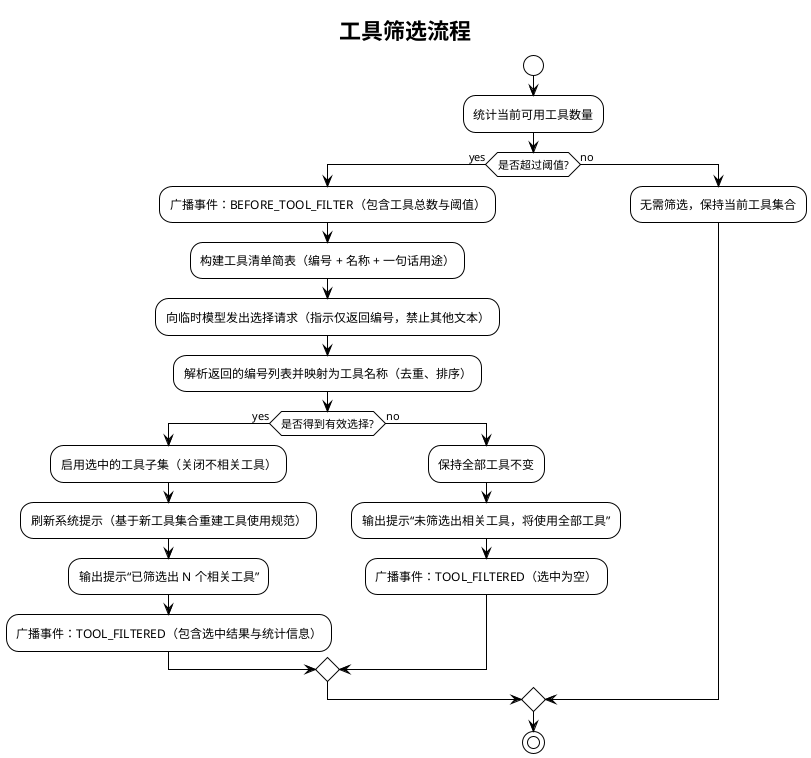

图示说明
- 触发条件：仅当可用工具数量超过阈值时进行筛选；否则保持原集合
- 选择方式：向临时模型请求“只返回编号”，再映射为工具名；启用子集后需刷新系统提示以降低决策复杂度
- 容错路径：未选出任何工具时维持原集合并继续任务

##### 3.2 AgentRunLoop 设计
- 职责：承载主运行循环；控制迭代、工具执行、拼接提示、处理中断与完成
- 核心流程：
  - 首轮初始化（由 Agent._first_run 触发）后循环执行：
    1) _call_model → 获取响应
    2) execute_tool_call → 执行工具（若识别到 TOOL_CALL）
    3) join_prompts → 拼接工具结果
    4) _handle_run_interrupt → 处理用户中断（INTERRUPT_TRIGGERED）
    5) 自动完成检测（!!!COMPLETE!!!）→ _complete_task
- 事件：在工具与模型调用关键节点广播 BEFORE/AFTER_TOOL_CALL、BEFORE/AFTER_MODEL_CALL
- 返回协议：当工具返回 need_return=True，立即返回当前上下文；否则继续循环

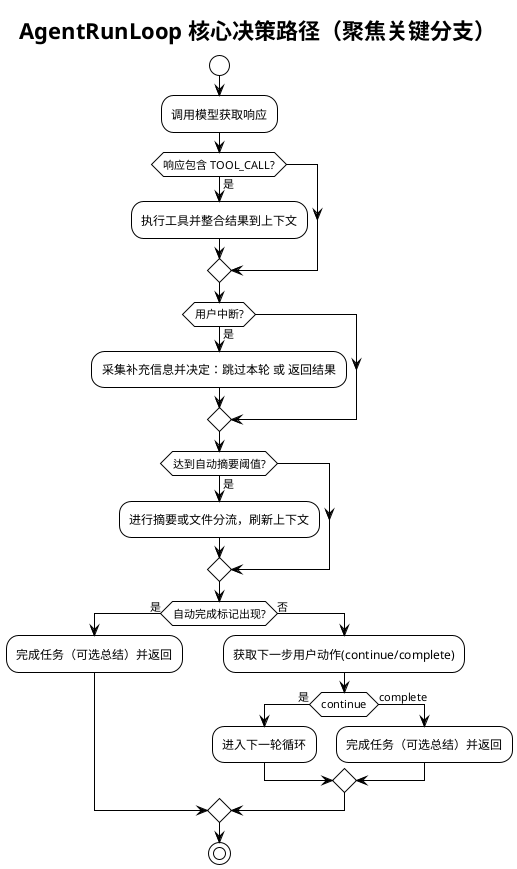

##### 3.3 SessionManager 设计

读者要点
- 会话语义：清理历史仅重置对话与计数，但保留并立即重新应用系统提示，确保约束持续生效
- 保存/恢复作用域：基于平台名与模型名生成唯一文件名，避免跨平台/模型污染；恢复后自动删除文件
- 使用场景：长对话需释放上下文时的重置；跨运行的会话持久化与恢复
- 风险与约束：清理后必须重新设置系统提示；恢复失败或文件缺失时应平稳回退，不影响主流程

- 内部逻辑结构（PlantUML）
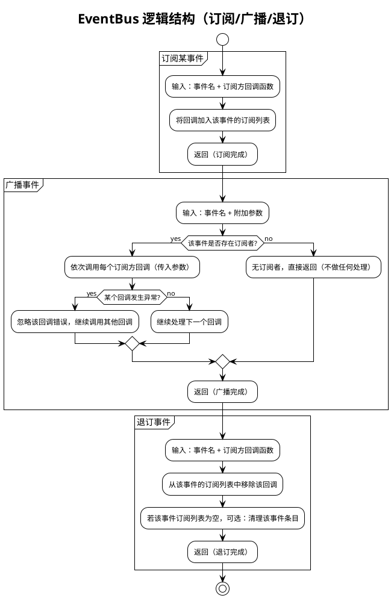

图示说明
- 目的：以“事件名”为索引，支持外部模块在关键节点进行旁路扩展（统计、记忆、分析等），不干扰主流程
- 异常处理：广播过程中单个订阅回调失败被忽略并继续执行其他订阅者，保证主流程稳定
- 边界：EventBus 不做业务判断与流程控制，仅负责调用订阅者；是否保存记忆/执行分析由订阅者自行决定
- 使用建议：为每类关键节点定义清晰事件名（如 BEFORE_MODEL_CALL、AFTER_TOOL_CALL 等），订阅者内部做好容错与幂等

- API：subscribe(callback)、emit(event, **kwargs)、unsubscribe(callback)
- 特性：同步广播、回调异常隔离，便于旁路扩展（记忆保存、任务分析、统计）

- 事件总线全局事件流（总览图）
下图以通俗步骤展示“任务启动 → 模型/工具 → 历史清理 → 总结 → 完成”的全链路广播与响应，弱化内部术语，便于整体理解。

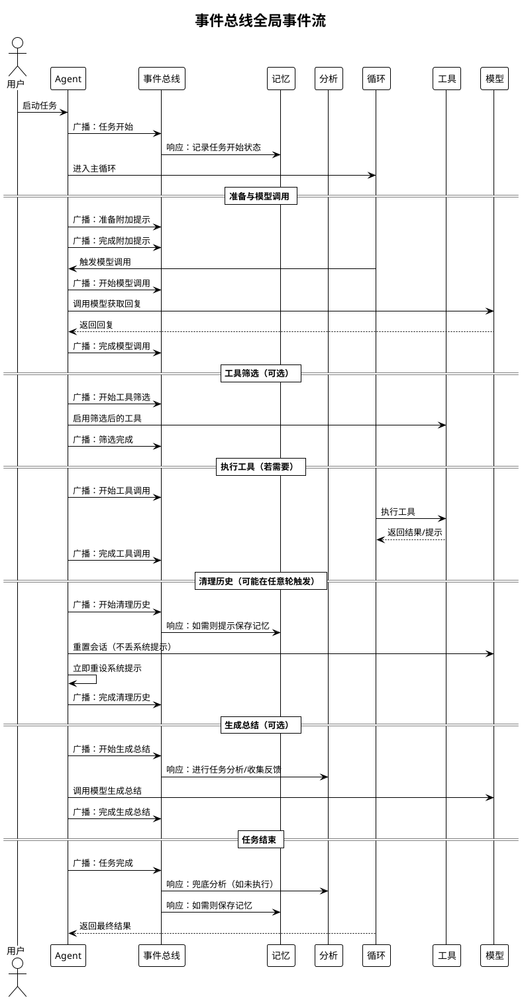

图示说明
- 图使用“广播/响应/调用/返回”等通俗术语；不展示内部函数名与具体实现
- “可选”表示仅在特定条件触发（如工具筛选、生成总结）
- 实际事件名在代码中对应 TASK_STARTED、BEFORE/AFTER_MODEL_CALL、BEFORE/AFTER_TOOL_CALL、BEFORE/AFTER_HISTORY_CLEAR、BEFORE/AFTER_SUMMARY 等；图强调流程含义，避免细节干扰

##### 3.6 ToolRegistry 设计
- 角色：默认输出处理器，解析并执行 TOOL_CALL
- 加载来源：内置工具、外部 .py 工具、MCP 工具（外部进程）
- 执行协议：
  - 单步约束：一次响应仅允许一个调用块，检测到多个则拒绝执行
  - 结束标签容错：缺失结束标签时尝试自动补全并提示规范
  - 大输出处理：平台支持时上传文件并清理历史；否则智能截断（前后各 30 行）
  - 统计与记录：执行计数与最近执行工具记录（__last_executed_tool__/__executed_tools__）
- 微结构图：
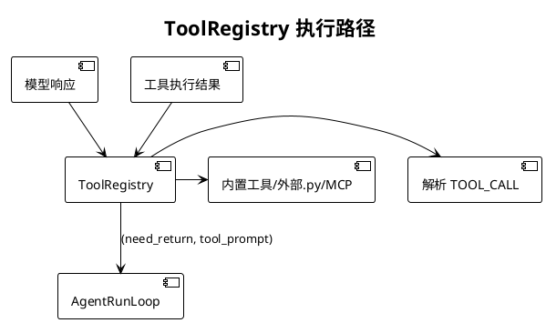

- 关键交互时序（PlantUML）
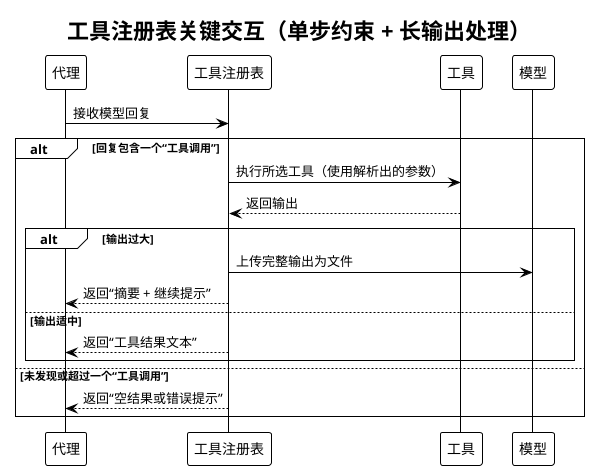

图示说明
- 单步约束：每次回复仅允许一个工具调用；多个调用直接拒绝并提示规范
- 长输出处理：优先按平台能力上传文件并提供简短摘要；不支持上传时进行智能截断（保留头/尾片段）
- 返回约定：统一返回“是否需立即结束本轮 + 文本提示”，主循环据此决定直接返回或继续迭代

##### 3.7 EditFileHandler / RewriteFileHandler 设计

读者要点
- 用途：在单步响应中进行最小必要变更（PATCH）或整文件替换（REWRITE）
- 安全约束：PATCH 强制唯一匹配（SEARCH 仅一次命中）；区间替换需合法起止标记；REWRITE 采用原子写并可回滚
- 选择策略：优先 PATCH（影响最小），仅在大范围重构或整文件生成时使用 REWRITE
- 结果呈现：返回成功与差异摘要；失败时明确说明原因（未命中、多处命中、区间非法等）

关键决策路径（活动图）
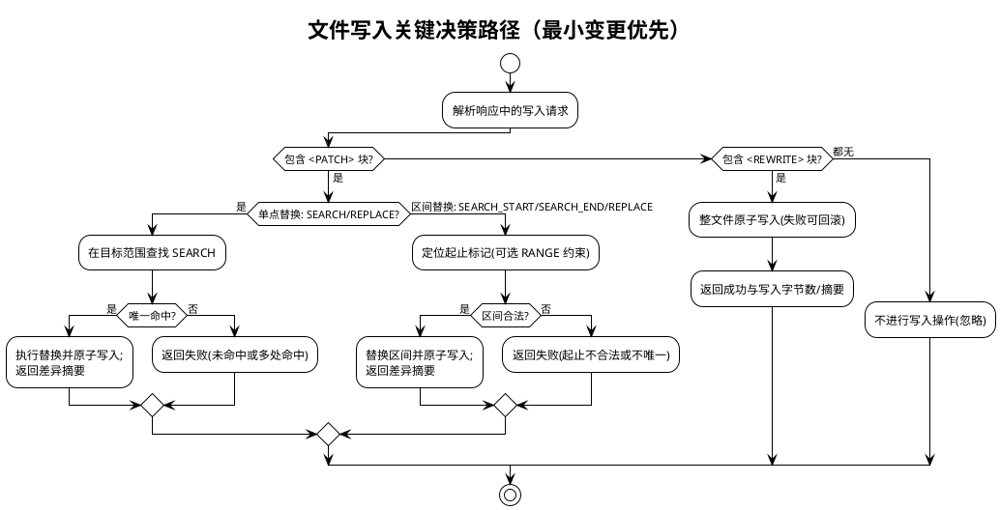

##### 3.8 MemoryManager 设计

- 内部逻辑结构（PlantUML）
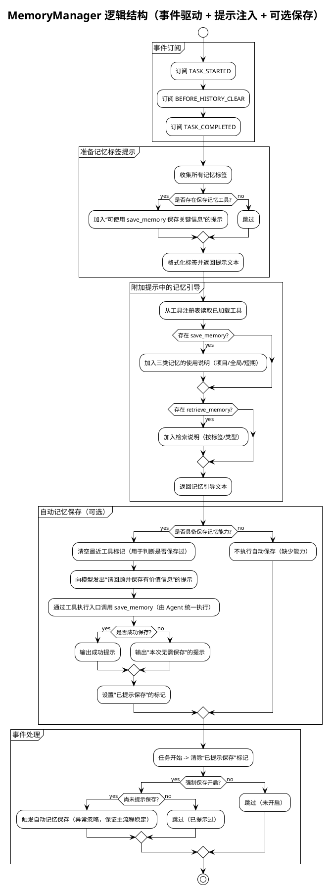

图示说明
- 事件驱动：在任务开始、历史清理前、任务完成后按需触发“提示或执行记忆保存”，不阻塞主流程
- 提示注入：将记忆标签与工具使用说明拼入每轮附加提示，促进模型主动使用记忆工具
- 能力门控：仅在存在 save_memory/retrieve_memory 工具时提供对应指引与自动保存；否则安全跳过
- 强制保存：force_save_memory 开启且尚未提示时，在 BEFORE_HISTORY_CLEAR 或 TASK_COMPLETED 触发一次自动保存
- 容错：自动保存调用异常被忽略，不影响任务输出与流程推进；状态标记避免重复提示

- 记忆类型与存储策略
- 短期记忆（short_term）
  - 存储位置：进程内存（jarvis_utils.globals.add_short_term_memory / get_short_term_memories）
  - 生命周期：仅在当前任务/进程内有效，不落盘；适合临时上下文、当前步骤的中间信息
  - 检索方式：retrieve_memory memory_types=["short_term"]，可按标签过滤
- 项目长期记忆（project_long_term）
  - 存储位置：当前项目目录 .jarvis/memory 下，JSON 文件按条目存储
  - 适用内容：项目相关的约定、配置、实现细节、架构决策等
  - 作用域：当前仓库/目录；随项目版本控制与协作共享更方便
- 全局长期记忆（global_long_term）
  - 存储位置：数据目录 get_data_dir()/memory/global_long_term 下，JSON 文件按条目存储
  - 适用内容：通用方法论、常用命令、用户偏好、跨项目知识与最佳实践
  - 作用域：同一用户在本机的所有项目/任务通用

数据模型（统一结构）
- 字段：id、type（memory_type）、tags、content、created_at、updated_at（可选）、merged_from（整理后可选）
- 命名与ID：save_memory 按微秒级时间戳生成唯一 ID（例如 20251101_072947_388226）

- 记忆整理（MemoryOrganizer）
- 目标：合并标签高度重叠的长期记忆，消除冗余、提升可检索性
- 适用类型：project_long_term、global_long_term（不处理 short_term）
- 合并策略：
  - 基于标签重叠度（min_overlap ≥ 2），按重叠数量从高到低分组
  - 调用 LLM 将同组记忆合并为一个综合记忆（最近时间权重更高）
  - 生成 YAML 格式的 <merged_memory>，包含 content 与 tags；解析后写为新记忆，并删除原始条目
- 使用方法（CLI）：
  - 整理（模拟运行）：jarvis-memory-organizer organize --type project_long_term --dry-run
  - 整理（指定重叠数）：jarvis-memory-organizer organize --type global_long_term --min-overlap 3
  - 导出：jarvis-memory-organizer export output.json -t project_long_term -t global_long_term --tag API
  - 导入：jarvis-memory-organizer import memories.json --overwrite
- 平台选择：统一使用 normal 平台与模型（PlatformRegistry.get_global_platform_registry），支持通过 -g/--llm-group 覆盖模型组
- 数据安全与回滚：
  - 新记忆创建后再删除旧记忆文件，失败日志汇总输出
  - 导出/导入支持类型校验、标签过滤、覆盖策略；异常明确告警且不中断其他记录

- 典型使用场景
- 在任务完成前自动提示保存本次关键经验（force_save_memory 开启）
- 在复杂项目中将架构决策与约定沉淀为 project_long_term，跨项目方法论沉淀为 global_long_term
- 在对话中临时缓存当前轮上下文与关键结论为 short_term，便于下一步工具调用
- 定期使用 MemoryOrganizer 合并重复/冗余的长期记忆，保持知识库整洁与高质

##### 3.9 TaskAnalyzer 设计

读者要点
- 触发时机：生成总结前（BEFORE_SUMMARY）优先触发；若无总结需求，则在 TASK_COMPLETED 兜底触发
- 目标产出：基于任务过程沉淀方法论/改进建议，并收集“是否满意”的反馈
- 对主流程影响：旁路执行；回调异常或失败不影响任务完成；完成后设置去重标记避免重复分析

关键交互（PlantUML）
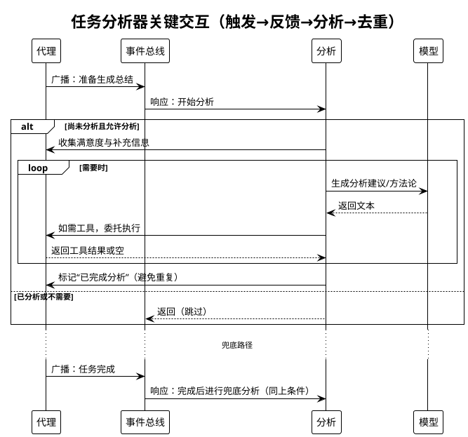

图示说明
- 触发：生成总结前优先；无总结需求时在任务完成阶段兜底触发一次
- 产出：方法论与改进建议；同时收集满意度反馈
- 去重：设置“已完成分析”标记，避免重复分析
- 容错：分析过程中模型或工具出错忽略返回，不影响任务完成

输出与约束
- 输出：方法论/改进建议（写入会话上下文，由上层继续整合），满意度反馈记录
- 约束：仅在 use_analysis 启用时执行；触发一次后设置去重标记
- 容错：模型/工具异常不影响主流程；中断时优先采集用户补充信息再继续分析

##### 3.10 TaskPlanner 设计
- 职责：复杂任务拆分与子任务调度，控制递归深度（plan_max_depth/plan_depth）
- 产出：<PLAN>（YAML 列表）、<SUB_TASK_RESULTS>、<RESULT_SUMMARY> 合并回父 Agent 上下文
- 子 Agent 构造：通过 _build_child_agent_params 继承父 Agent 能力与配置，默认非交互自动完成

- 内部逻辑流程（PlantUML）
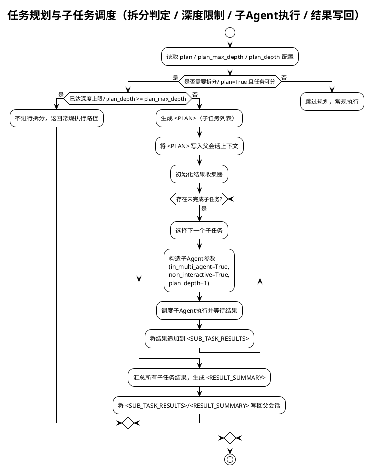

图示说明
- 触发条件：仅在 plan=True 且任务可拆分时进入规划路径
- 深度限制：plan_depth >= plan_max_depth 时不再递归拆分
- 子 Agent：默认非交互自动完成，继承父 Agent 能力与配置
- 写回约定：将 <PLAN>/<SUB_TASK_RESULTS>/<RESULT_SUMMARY> 写回父会话，便于后续模型使用
- 容错：单个子任务失败不阻断整体流程，按需记录并继续其他子任务

##### 3.11 FileMethodologyManager 设计
- 模式选择：
  - 文件上传模式：平台支持 upload_files 时，方法论与历史以文件上传
  - 本地模式：不支持上传时，加载本地方法论库并管理上下文
- 历史处理：handle_history_with_file_upload 在上下文溢出时转移历史并返回继续提示

- 内部逻辑流程（PlantUML）
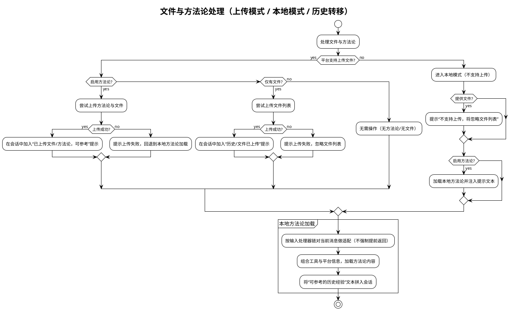

图示说明
- 模式选择：优先“上传模式”（平台支持时），否则“本地模式”加载方法论与经验
- 提示注入：成功上传或成功加载后，将“可参考经验/已上传文件”文本拼入会话，便于引用
- 失败回退：上传失败不阻断流程；方法论加载失败时回退为常规对话
- 输入处理器：本地方法论加载前对当前消息做轻量适配（如从文件/终端输入抽取上下文），不强制提前返回
- 无操作路径：既不启用方法论也无文件时，本轮不处理，保持最小影响

- 历史转移（上下文过长）流程
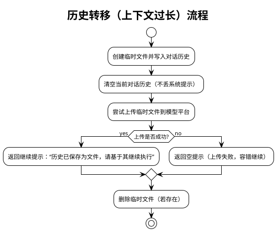

##### 3.12 PlatformRegistry / BasePlatform 设计
- PlatformRegistry：动态创建平台实例，选择“普通平台/模型”，兼容不同厂商
- BasePlatform：统一接口（chat_until_success、set_system_prompt、upload_files、reset、set_model_name/group、name/platform_name）
- 行为：Agent 通过该层以统一方式与不同 LLM 平台交互，并按平台能力决定是否支持文件上传等增强特性

读者要点
- 边界与职责：统一发现与注册平台实现；向上提供“创建平台实例/获取普通平台”的简化接口
- 能力归一：通过 BasePlatform 接口屏蔽不同厂商差异（聊天/系统提示/文件上传等）
- 生命周期：启动时加载用户目录与内置目录的实现；运行时按名称创建实例或返回“普通平台”
- 失败回退：未找到平台或创建失败时进行明确告警并返回 None，不阻断上层流程

可视化（组件 + 关键流程）
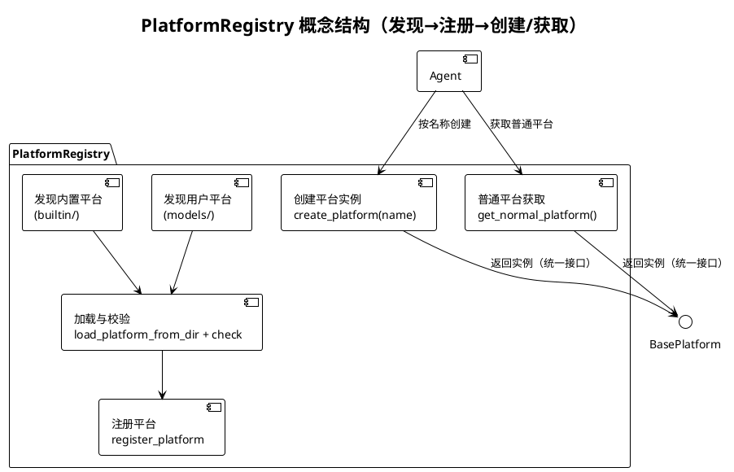

##### 3.13 工具执行器 execute_tool_call 设计

- 内部逻辑流程（PlantUML）
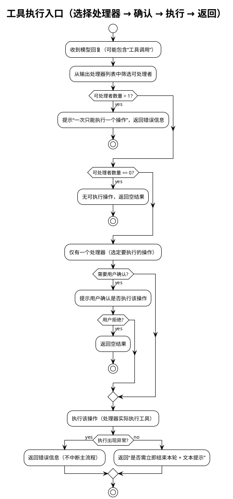

图示说明
- 入口职责：统一选择并执行一个合适的输出处理器（如工具、文件写入等），返回标准结果
- 约束与容错：一次仅执行一个操作；执行前可选确认；异常不影响主循环稳定推进
- 返回约定：统一返回“是否立即结束本轮 + 文本提示”，主循环据此决定直接返回或继续迭代

- 职责：统一解析模型响应中的 TOOL_CALL，执行业务处理并返回标准协议
- 协议：返回 (need_return: bool, tool_prompt: str)；need_return=True 时由运行循环直接返回结果
- 策略：执行前确认（execute_tool_confirm）；after_tool_call 回调（由 EventBus 与动态注入目录触发）；长输出与格式容错见 ToolRegistry 章节

##### 3.14 输入处理器链与用户交互封装

- 内部逻辑流程（PlantUML）
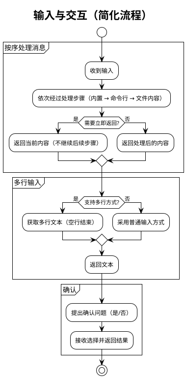

- 输入处理器：builtin_input_handler、shell_input_handler、file_context_handler（按序处理，返回 need_return 标志控制是否提前返回）
- UserInteractionHandler：
  - 多行输入：兼容函数签名 func(tip, print_on_empty) 与 func(tip)
  - 确认交互：封装 confirm 回调，便于替换为 TUI/GUI/WebUI

- 用户交互封装（UserInteractionHandler）内部逻辑结构
```plantuml
@startuml
!theme plain
title 用户交互（多行输入 + 确认，简化）

start
partition "多行输入" {
  if (可用多行方式?) then (是)
    :提示并接收多行文本（空行结束）;
  else (否)
    :使用普通输入方式接收文本;
  endif
  :返回文本;
}

partition "确认" {
  :提出确认问题（可设默认选项）;
  :接收是/否并返回结果;
}
stop
@enduml
```

- 目标：抽象用户交互（多行输入与确认），便于未来替换为 TUI/WebUI
- 兼容策略：优先使用带 print_on_empty 的多参签名，失败时回退为单参签名；confirm 委派保持一致行为

##### 3.15 事件与回调扩展
- 事件常量：TASK_STARTED/COMPLETED、BEFORE/AFTER_MODEL_CALL、BEFORE/AFTER_HISTORY_CLEAR、BEFORE/AFTER_SUMMARY、BEFORE_TOOL_FILTER/TOOL_FILTERED、AFTER_TOOL_CALL、INTERRUPT_TRIGGERED、BEFORE/AFTER_ADDON_PROMPT
- 动态回调：扫描 JARVIS_AFTER_TOOL_CALL_CB_DIRS；支持 after_tool_call_cb、get_after_tool_call_cb()、register_after_tool_call_cb() 三种导出形式；回调包装隔离异常


#### 4. 与外部系统/环境的交互

- LLM 平台与模型
  - 通过 PlatformRegistry 动态创建 BasePlatform 实例，统一设置模型名称/组；Agent 使用 chat_until_success/set_system_prompt 调用
  - 支持文件上传：当模型支持 upload_files，历史与大输出以文件上传方式释放/节省上下文
- 工具生态
  - ToolRegistry 加载内置工具、外部 .py 工具与 MCP 工具；MCP 工具通过外部进程提供能力，支持跨应用集成
- 文件与方法论仓库
  - 加载本地方法论库；可与中心方法论库通过 Git 同步，实现团队共享最佳实践
- 记忆系统
  - 三层记忆：短期（内存）、项目长期（.jarvis/memory）、全局长期（~/.jarvis/data/memory/global_long_term）
  - 通过 save_memory/retrieve_memory/clear_memory 工具使用
- CLI 与环境变量/配置
  - 通过 CLI 运行任务；支持 JARVIS_NON_INTERACTIVE 等环境变量控制非交互模式
  - 通过 jarvis_utils.config 获取默认配置（如计划开关、筛选阈值、after_tool_call 回调扫描目录等）
- 动态回调注入
  - 读取 JARVIS_AFTER_TOOL_CALL_CB_DIRS 指定目录下的 Python 文件，动态注册 after_tool_call 回调（三种导出方式优先级约定），用于旁路增强工具调用后处理
- 可观测性
  - show_agent_startup_stats 启动统计：输出方法论数量、工具可用数/总数、全局/项目记忆数量、工作目录等


#### 5. 模块间交互流程（PlantUML）

下图展示一次典型端到端执行过程的时序，涵盖初始化、首轮处理、模型调用、工具执行与收尾。

```plantuml
@startuml
!theme vibrant
title 端到端执行流程（简化）

actor 用户 as User
participant "代理" as Agent
participant "循环" as Loop
participant "平台" as Platform
participant "工具" as Tools
participant "记忆" as Mem
participant "规划" as Planner
participant "方法论" as Fm

User -> Agent : 启动任务
Agent -> Agent : 初始化与准备（平台/工具/方法论/记忆）
Agent -> Planner : 规划任务 [可选]
Agent -> Fm : 处理文件与方法论 [可选]
Agent -> Loop : 进入循环

Loop -> Agent : 准备提示与输入
Agent -> Platform : 调用模型
Platform --> Agent : 返回回复

alt 回复包含工具调用
  Agent -> Tools : 执行工具
  Tools --> Agent : 返回结果/提示
end

alt 上下文过长
  Agent -> Platform : 重置会话（保留规则）
  Agent -> Agent : 立即重设系统提示
end

alt 任务完成
  Agent -> Mem : 保存/整理记忆 [按需]
  Agent -> Agent : 生成总结 [可选]
  Agent --> User : 输出结果
else 继续迭代
  Loop --> Loop : 下一轮
end
@enduml
```


#### 6. 参数与配置说明

以下参数来自 Agent.__init__。默认值或行为参考 jarvis_utils.config 与内部回退逻辑。除特别标注外，布尔型参数可通过入参覆盖配置默认值。

- system_prompt: 系统提示词，定义 Agent 行为准则（必要）
- name: Agent 名称，默认 "Jarvis"，用于全局登记与交互提示
- description: Agent 描述信息
- model_group: 模型组标识，用于按组选择平台与模型（get_normal_platform_name/get_normal_model_name）
- summary_prompt: 任务总结提示词；为空时回退 DEFAULT_SUMMARY_PROMPT 或 SUMMARY_REQUEST_PROMPT
- auto_complete: 自动完成开关；非交互模式默认开启；多智能体模式下仅在显式 True 时开启
- output_handler: 输出处理器列表；默认 [ToolRegistry,(EditFileHandler),(RewriteFileHandler)]（括号内可禁用）
- use_tools: 指定允许使用的工具名白名单；为空时加载默认集合；当工具过多时 Agent 首轮可触发 AI 筛选并动态缩减
- execute_tool_confirm: 执行工具前是否进行用户确认（可由配置 is_execute_tool_confirm 决定）
- need_summary: 是否在完成阶段生成总结
- auto_summary_rounds: 自动摘要轮次上限（由 AgentRunLoop 读取并决定触发时机）
- multiline_inputer: 多行输入函数；由 UserInteractionHandler 进行向后兼容封装
- use_methodology: 是否启用方法论引导；默认从配置读取（is_use_methodology）
- use_analysis: 是否启用任务完成后的分析（TaskAnalyzer）；默认从配置读取（is_use_analysis）
- force_save_memory: 是否在关键节点强制提示/执行记忆保存；默认从配置读取（is_force_save_memory）
- disable_file_edit: 禁用文件编辑相关输出处理器（EditFileHandler/RewriteFileHandler）
- files: 需要处理或上传的文件列表（触发 FileMethodologyManager 处理）
- confirm_callback: 确认回调，签名 (tip: str, default: bool) -> bool；默认 CLI user_confirm
- non_interactive: 非交互模式（最高优先级）；若显式提供会同步到环境变量 JARVIS_NON_INTERACTIVE
- in_multi_agent: 多智能体运行标志；用于控制自动完成（子 Agent 默认非交互自动完成）
- plan: 是否启用任务规划与子任务拆分（默认从配置 is_plan_enabled）
- plan_max_depth: 规划最大深度（默认 get_plan_max_depth，异常回退 2）
- plan_depth: 当前规划深度（父 +1 传递至子；默认 0）
- agent_type: "normal" 或 "code"；"code" 时构造 CodeAgent（转发构造参数）

行为与默认策略补充
- 非交互与自动完成：
  - 非交互模式（或子 Agent）默认自动完成为 true；多智能体模式时除非显式 True 否则不自动完成
- 工具筛选：
  - 可用工具数超过阈值（get_tool_filter_threshold）时，使用临时模型产生选择编号，更新 ToolRegistry.use_tools，并重置系统提示
- 大输出处理：
  - 平台支持上传：生成摘要并清理历史后，上传大输出文件，返回“摘要 + 调用上下文”提示继续
  - 平台不支持：智能截断前 30/后 30 行，中间以占位提示
- 历史与上下文：
  - conversation_length 由 get_context_token_count 计数；超过阈值时走摘要或文件上传流程（FileMethodologyManager 处理）
- 动态回调：
  - 扫描 JARVIS_AFTER_TOOL_CALL_CB_DIRS，支持 after_tool_call_cb、get_after_tool_call_cb()、register_after_tool_call_cb() 三种导出形式；注入 AFTER_TOOL_CALL 回调


#### 7. 典型执行过程（端到端）

以“分析代码并修改某个函数”为例（伪场景）：
1. CLI 将用户需求交给 Agent.run
2. Agent 初始化与启动统计：加载 Platform 与 ToolRegistry；设置系统提示；输出方法论/工具/记忆统计信息
3. 首轮处理：
   - FileMethodologyManager：若平台支持上传，尝试上传 files 与方法论；否则本地加载
   - MemoryManager：准备记忆标签提示并注入上下文
   - 工具筛选（可选）：当工具过多时用临时模型筛选相关工具子集，更新系统提示
4. 进入 AgentRunLoop：
   - 生成 addon prompt（包含工具使用规则、记忆提示、是否需要 !!!COMPLETE!!! 标记）
   - 调用 BasePlatform.chat_until_success 获取响应
   - 若响应包含 TOOL_CALL，交由 ToolRegistry 解析并执行对应工具（如 read_code 或 patch）
   - 工具输出拼接回上下文（utils.join_prompts），广播 AFTER_TOOL_CALL；need_return=True 时直接返回结果
   - 若用户中断（INTERRUPT_TRIGGERED），采集补充输入，决定是否继续或跳过当前轮
   - 检查自动完成：检测到 !!!COMPLETE!!! 或 ot('!!!COMPLETE!!!') 标记进入收尾
5. 收尾：
   - 通过事件驱动执行 TaskAnalyzer 分析、MemoryManager 记忆保存（受 force_save_memory 控制）
   - need_summary=True 时生成总结
   - 返回最终结果至 CLI

```plantuml
@startuml
!theme vibrant
title 典型执行过程（代码分析与修改，简化）

actor 用户 as User
participant "界面" as UI
participant "代理" as Agent
participant "循环" as Loop
participant "平台" as Platform
participant "工具" as Tools
participant "文件修改器" as Writer
participant "记忆" as Mem
participant "事件总线" as Bus

User -> UI : 描述需求
UI -> Agent : 发送任务
Agent -> Bus : 广播：任务开始
Agent -> Agent : 首轮准备（工具筛选/文件与方法论/记忆标签）[可选]
Agent -> Loop : 进入主循环

Loop -> Agent : 生成提示并准备输入
Agent -> Platform : 调用模型
Platform --> Agent : 返回回复（可能包含工具调用）

alt 需要工具
  Agent -> Tools : 执行工具
  Tools --> Agent : 返回结果/提示
end

alt 需要修改文件
  Agent -> Writer : 应用变更
  Writer --> Agent : 返回修改结果
end

Agent -> Bus : 广播：步骤完成

alt 检测到完成
  Agent -> Agent : 生成总结 [可选]
  Agent -> Mem : 保存/整理记忆 [按需]
  Agent -> Bus : 广播：任务完成
  Agent --> UI : 输出结果
else 继续迭代
  Loop --> Loop : 下一轮
end
@enduml
```

该过程对长输出、上下文长度与外部失败具备防御性回退策略，保证流程可持续推进。


#### 8. 可靠性与容错设计

- 模型空响应回退为空串并告警，避免 None/空字符串导致逻辑断流
- 摘要与完成阶段同样进行空响应防御
- 事件回调异常隔离，避免影响主流程
- 工具调用格式容错：ToolRegistry 对缺失结束标签的 TOOL_CALL 尝试自动补全并提示规范
- 长输出安全处理：优先文件上传，其次智能截断，抑制上下文溢出
- 规划失败或无需拆分不影响主流程，主循环按常规路径继续
- 历史清理后自动重置系统提示，保持约束环境持续生效


#### 9. 扩展与二次开发建议

- 工具扩展：在内置路径或 ~/.jarvis/tools 下新增 .py 工具；跨进程/应用集成优先采用 MCP 工具
- 平台扩展：在 jarvis_platform 下新增 BasePlatform 子类，通过 PlatformRegistry 自动发现
- 旁路增强：通过 JARVIS_AFTER_TOOL_CALL_CB_DIRS 注入 AFTER_TOOL_CALL 回调，实现统计/审计等旁路能力
- 方法论共享：建立中心方法论库（Git），团队同步沉淀最佳实践，提升协作效率
- 子 Agent：利用 TaskPlanner 与 _build_child_agent_params 继承父 Agent 能力，构建递归执行的子任务体系
- UI 替换：UserInteractionHandler 与 OutputHandlerProtocol 的抽象便于替换为 TUI/GUI/WebUI

### CodeAgent 系统架构设计

本章节不展开 Agent 的内部实现，聚焦 CodeAgent 如何使用 Agent，并在此基础上为“代码工程”场景提供的增强能力与流程封装。内容基于源码进行结构化说明，覆盖模块组成、职责与接口、关键交互流程、CLI 入口与参数说明、可靠性与扩展建议。

- 关联组件与工具：Git 提交工作流工具、工具注册生态（由 Agent 承载）、事件系统（AFTER_TOOL_CALL）、StatsManager、lint 工具建议、配置系统（jarvis_utils.config）、输出交互（PrettyOutput）


#### 1. 设计目标与总体思路

- 使用 Agent：通过统一接口调用 Agent，文档不描述其内部结构与实现细节。
- 场景聚焦：围绕“代码分析与修改”的端到端流程，提供仓库管理、补丁预览、提交确认与统计、静态检查引导等增值能力。
- 最小侵入：仅通过启动参数注入系统提示与工具白名单、订阅 AFTER_TOOL_CALL 事件，不改变 Agent 的行为边界。
- 稳健与可观测：强调 git 配置/仓库状态检查、换行符策略、错误回退；对代码行增删与提交进行统计记录；大变更摘要化预览，避免上下文膨胀。


#### 2. 模块组成（PlantUML）

下图展示 CodeAgent 与其协作组件的静态组成与依赖关系，Agent 作为运行与工具执行的统一入口，不展开内部细节。

```plantuml
@startuml
!theme vibrant
title CodeAgent 结构组成图（面向 Agent 的使用）

package "CodeAgent Layer" #LightGreen {
  component "CodeAgent" as CodeAgent
  component "CLI (typer)" as CLI
}

package "Agent Layer" #LightGray {
  component "Agent" as AgentNode
  component "EventBus" as EventBus
}

package "Agent Tools" #Wheat {
  component "read_code" as ToolReadCode
  component "PATCH" as ToolPatch
  component "REWRITE" as ToolRewrite
  component "execute_script" as ToolExecuteScript
  component "search_web" as ToolSearchWeb
  component "memory_tools(save/retrieve/clear)" as ToolMemory
}

package "Git & Repo Utils" #LightYellow {
  component "提交工作流工具" as GitCommitTool
  component "git_utils" as GitUtils
}

package "Config & IO" #Thistle {
  component "jarvis_utils.config" as Config
  component "PrettyOutput" as Output
}

package "Stats & Lint" #AliceBlue {
  component "StatsManager" as Stats
  component "LintToolsSelector" as Lint
}

CodeAgent --> AgentNode : 构造/运行（统一接口）
CodeAgent --> EventBus : 订阅 AFTER_TOOL_CALL

AgentNode --> ToolReadCode
AgentNode --> ToolPatch
AgentNode --> ToolRewrite
AgentNode --> ToolExecuteScript
AgentNode --> ToolSearchWeb
AgentNode --> ToolMemory

CodeAgent --> GitUtils : 仓库检测/差异/历史
CodeAgent --> GitCommitTool : 提交工作流封装
CodeAgent --> Config : 读取/覆盖配置项
CodeAgent --> Output : 提示与代码块输出
CodeAgent --> Stats : 行数与提交统计
CodeAgent --> Lint : 修改后静态检查建议
CLI --> CodeAgent : 入口与参数传递
@enduml
```

关键点
- CodeAgent 通过“启动参数 + 工具白名单 + 事件订阅”使用 Agent；工具执行与对话循环由 Agent 承载。
- AFTER_TOOL_CALL 用于在工具执行后进行旁路增强（展示 diff、提交、统计、静态扫描引导）。
- Git 工具链与配置/输出/统计等均为 CodeAgent 外层增强能力。


#### 3. CodeAgent 核心功能与与 Agent 的使用边界

读者要点
- 与 Agent 的交互仅限：
  - 启动参数：注入系统提示、工具白名单、自动完成/总结/规划/非交互等行为开关。
  - 事件订阅：订阅 AFTER_TOOL_CALL 事件进行旁路增强。
  - 运行入口：agent.run(input) 启动任务。
  - 追加提示：在必要时追加附加提示（如静态扫描引导）。
  - 会话写入：在确定结果后将补充文本追加至当前会话上下文。

- CodeAgent 的外层增强能力（独立于 Agent 实现）：
  - 环境与仓库管理：发现仓库根、更新 .gitignore、处理未提交修改、统一换行符敏感策略（含 Windows 建议）。
  - 提交工作流：自动/交互式 commit、提交历史展示与接受/重置。
  - 差异与预览：按文件输出 diff，针对删除/重命名/大变更进行适配与摘要化处理。
  - 统计与提示：记录代码行增删、修改次数；根据文件类型生成 lint 建议与静态扫描引导。
  - CLI 入口：非交互约束、单实例锁（按仓库维度）、会话恢复、参数同步配置。


##### 3.1 系统提示与工具白名单

- 系统提示：注入“代码工程师工作准则与流程规范”，并按顺序拼接全局规则（数据目录 rules）与项目规则（.jarvis/rules）为单一 <rules> 区块。
- 工具白名单（最小可用集）：
  - execute_script、search_web、ask_user、read_code、save_memory、retrieve_memory、clear_memory、sub_code_agent
  - 支持通过 append_tools 追加工具名，自动去重后传入 Agent。
- 行为开关：
  - 默认禁用：方法论引导与完成后分析（聚焦代码改造）
  - auto_complete 关闭（由 CodeAgent 控制交互流程）
  - 规划开关 plan：默认从配置读取，可由 CLI 覆盖


##### 3.2 环境与仓库初始化

```plantuml
@startuml
!theme plain
title 环境与仓库初始化流程

start
:定位并切换至git根目录(find_git_root_and_cd);
:更新 .gitignore（追加常用语言规则，忽略 .jarvis）;
:处理未提交修改（可选交互式临时提交）;
:配置git换行符敏感设置（仅在不一致时修改）;
if (Windows?) then (是)
  :提示最小化 .gitattributes 建议（非强制）;
endif
stop
@enduml
```

说明
- 保守策略：仅在必要时变更 git 配置；Windows 平台提供 .gitattributes 建议，以避免 CRLF/LF 差异导致的大 diff。
- 未提交修改处理：支持确认大量新增文件的添加并引导修改 .gitignore；失败不阻断流程。


##### 3.3 工具执行后旁路增强（差异/提交/统计/静态检查）

```plantuml
@startuml
!theme plain
title 工具执行后旁路增强（差异预览/提交/统计/静态检查提示）

participant "EventBus" as Bus
participant "CodeAgent" as CA
participant "git_utils" as Git
participant "提交工作流工具" as GCT
participant "StatsManager" as Stats

Bus -> CA: AFTER_TOOL_CALL

CA -> Git: 获取 diff/文件列表/最新哈希
CA -> CA: 构建按文件预览（删除提示/重命名适配/大变更摘要>300行）
CA -> GCT: 提交工作流（交互或自动）
GCT --> CA: 返回是否已提交

alt 提交成功
  CA -> Stats: 行数变化/修改次数统计
  CA -> CA: 追加“补丁内容（按文件）”到当前会话上下文
  CA -> CA: 如启用静态扫描 -> 生成 lint 建议与附加提示
else 被拒绝或未提交
  CA -> CA: 输出预览并提示拒绝
end
@enduml
```

说明
- 差异预览策略：
  - 删除文件：不展示 diff，仅输出删除提示（附带删除行数若可用）。
  - 大变更（新增+删除 > 300 行）：仅输出统计行数，避免上下文过长。
  - 其它文件：输出该文件的 diff 代码块（文本无法获取时给出友好提示）。
- 统计记录：
  - 插入/删除行数（基于 shortstat）
  - 修改次数（code_modifications）
  - 可扩展提交计数（如生成/接受的提交数）
- 静态检查提示：
  - 根据文件类型选择 lint 工具并生成建议文本
  - 当启用静态分析时，追加“集中扫描与一次性修复”的附加提示


##### 3.4 CLI 入口与运行约束

```plantuml
@startuml
!theme plain
title CLI 入口与运行约束（非交互/会话恢复/单实例锁）

start
:解析 CLI 参数（模型组/工具组/需求/非交互/恢复会话/plan/提交前后缀等）;
:校验 git 仓库；必要时支持初始化（交互或非交互自动）;
:切换到仓库根目录并加仓库维度单实例锁;
:同步 CLI 选项到配置（model_group/tool_group/restore_session/non_interactive）;
:create CodeAgent 并构造 Agent 启动参数;
if (restore_session?) then (是)
  :尝试恢复会话（失败不阻断）;
endif
if (传入 requirement?) then (是)
  :直接运行 CodeAgent.run(requirement);
else (否)
  :进入多行输入循环运行;
endif
stop
@enduml
```

约束与行为
- 非交互模式：必须通过 --requirement 传入任务；多行输入不可用；执行脚本超时受限（由平台环境约束）。
- 单实例锁：按仓库维度加锁（基于 repo_root 的 md5），避免跨仓库互斥。
- 会话恢复：从存档文件恢复；失败不影响继续运行。


##### 3.5 核心工具能力（Agent 工具调用）

- 代码读取：read_code
  - 用途：读取源代码文件并按需添加行号，便于精确分析与定位修改点。
  - 最佳实践：遵循“先读后写”，优先按范围读取（start_line/end_line）以避免上下文膨胀。

- 文件修改与重写：PATCH / REWRITE
  - PATCH（推荐）：进行最小必要变更，支持
    - 单点替换：SEARCH / REPLACE（要求唯一命中）
    - 区间替换：SEARCH_START / SEARCH_END / REPLACE（可选 RANGE 约束，区间合法且唯一）
    - 原子写入与失败回滚；未命中、多处命中或区间不合法需明确失败原因。
  - REWRITE：整文件重写，适用于大范围生成或重构，支持原子写与回滚。
  - 建议：优先使用 PATCH，仅在确需整文件重写时使用 REWRITE。

- 命令执行（静态检测等）：execute_script
  - 用途：执行 shell/脚本命令，用于 lint、静态分析、单元测试、构建等工程化操作。
  - 约束：非交互环境有超时限制；避免输出过长，建议配合 rg/grep 等做过滤；不支持交互式命令。
  - 提示：集中在所有修改完成后统一进行静态检查，一次性调用相关工具，避免多次分散调用。

- Web 搜索：search_web
  - 用途：检索外部信息（API/错误/最佳实践/安全建议），辅助方案设计与问题定位。
  - 最佳实践：明确查询上下文与预期结果；对关键结论进行复核，并按需写入记忆或备注。

- 用户交互：ask_user
  - 场景：信息不足或关键决策需确认时使用；尽量提出最少且关键的问题以减少打断。

- 记忆工具：save_memory / retrieve_memory / clear_memory
  - 用途：沉淀项目约定、架构决策、常用命令与方法论；支持按类型与标签检索与清理。
  - 建议：在任务完成或历史清理前根据需要进行保存与整理。

说明
- 上述能力均通过 Agent 的工具调用接口执行；CodeAgent 通过工具白名单进行启用与收敛，并在 AFTER_TOOL_CALL 事件中进行旁路增强（差异预览、提交与统计、静态检查引导）。

#### 4. 端到端执行流程（PlantUML）

下图展示一次典型“代码分析与修改”的端到端流程，不展开 Agent 内部细节。

```plantuml
@startuml
!theme vibrant
title 端到端执行流程（Agent + CodeAgent 增强）

actor 用户 as User
participant "CLI" as CLI
participant "CodeAgent" as CA
participant "EventBus" as Bus
participant "提交工作流工具" as GCT
participant "git_utils" as Git
participant "Stats" as Stats

User -> CLI : 输入需求或传参
CLI -> CA : 构造 CodeAgent
CA -> CA : 环境与仓库初始化
CA -> Agent : 运行（注入系统提示与工具白名单）
... 模型与工具调用（由 Agent 处理） ...
Bus -> CA : AFTER_TOOL_CALL

CA -> Git : 收集 diff/文件列表/哈希
CA -> CA : 生成按文件补丁预览（智能摘要）
CA -> GCT : 提交工作流（交互或自动）
GCT --> CA : 提交结果

alt 提交成功
  CA -> Stats : 行数变化/修改次数统计
  CA -> CA : 将补丁内容追加到当前会话上下文
  CA -> CA : 注入静态检查引导（可选）
else 用户拒绝/无提交
  CA -> CLI : 输出预览与拒绝提示
end

... 任务结束（由 Agent 决定是否总结与返回） ...
@enduml
```

说明
- CodeAgent 不介入模型/工具的调用细节，均由 Agent 处理。
- AFTER_TOOL_CALL 作为主要旁路增强点，承载仓库提交、预览与统计、静态检查提示。


#### 5. 参数与配置说明（外层）

- 启动参数（传给 Agent 的外层注入）
  - system_prompt：注入“代码工程师工作准则与流程规范”，并拼接 <rules>（全局/项目规则）
  - use_tools：工具白名单（支持追加、去重）
  - auto_complete：自动完成任务，默认关闭
  - need_summary：是否在完成阶段生成总结（代码场景通常关闭或由 CLI 控制）
  - non_interactive：非交互模式（最高优先级）
  - plan：任务规划与子任务拆分开关
- CLI 入口（typer）
  - -g/--llm-group：覆盖模型组
  - -G/--tool-group：覆盖工具组
  - -f/--config：配置文件路径
  - -r/--requirement：任务内容（非交互必须）
  - --append-tools：追加工具白名单
  - --restore-session：恢复会话状态
  - --prefix/--suffix：提交信息前后缀
  - -n/--non-interactive：非交互模式
  - --plan/--no-plan：规划开关
- 配置项与行为
  - 非交互、模型组、工具组、规划、静态分析、补丁确认等通过配置读取，可被 CLI 覆盖
  - git 校验模式（strict/warn）控制未配置用户名/邮箱时的处理方式


#### 6. 可靠性与容错设计（外层）

- Git 配置检查：user.name / user.email 未设置时严格模式退出；warn 模式提示并继续。
- 非仓库场景：支持初始化新仓库；失败明确告警并退出。
- 换行符策略：仅在与目标设置不一致时修改；Windows 提供 .gitattributes 建议（非强制）。
- 差异容错：HEAD 不存在时以临时索引方式统计未跟踪文件；重命名/复制以新路径记录；无法获取 diff 时给出友好提示。
- 大输出抑制：单文件新增+删除 > 300 行时采用统计摘要，防止上下文过长。
- 提交失败与拒绝：不阻断主流程；输出预览与建议；会话继续。
- 统计容错：shortstat 获取失败时忽略，不影响最终输出。


#### 7. 扩展与二次开发建议

- 工具扩展：通过 --append-tools 追加白名单；在内置或用户目录新增工具（具体加载由 Agent 处理）。
- 事件增强：除 AFTER_TOOL_CALL 外的扩展由 Agent 支持；CodeAgent 保持单事件订阅策略以控制复杂度。
- lint 建议：扩展 get_lint_tools 映射；基于配置开关进行自动引导与集中修复流程提示。
- 提交策略：自定义提交工作流（提交信息模板、分组或批量提交）。
- 统计集成：扩展指标（语言分布、文件修改热度）以增强可观测性。
- 配置策略：引入项目级配置（.jarvis/config）以调节阈值（如大变更 > 300 行）与行为开关。


#### 8. 典型使用场景（面向代码工程）

- 小粒度修改：工具生成补丁后，自动预览 diff 并辅以提交；必要时注入静态扫描提示。
- 批量重构：多文件大变更时按文件摘要化展示；提交后生成聚合静态检查引导。
- 非交互流水线：CI 场景以 --non-interactive + --requirement 运行，受限时间内完成工具执行与提交。
- 会话恢复与断点续跑：通过 --restore-session 恢复上下文，继续在 AFTER_TOOL_CALL 旁路进行增强。


#### 9. 总结

- CodeAgent 专注于“代码工程”场景的外围增强：环境与仓库管理、提交工作流、差异预览与统计、静态检查引导。
- 通过“启动参数 + 事件订阅”的最小侵入方式使用 Agent，避免对底层实现的耦合与依赖。
- 借助 CLI 与配置体系，兼顾交互与非交互场景，提供稳定可控、可扩展的工程化实践路径。

### MultiAgent 系统架构设计

本章节围绕多智能体协作组件 MultiAgent，基于源码进行结构化设计说明，聚焦“如何在多个 Agent 之间进行消息路由与协作”，并说明与 Agent 的集成方式、消息协议、运行流程、容错机制与配置参数。本章节不展开 Agent 的内部实现细节。

- 相关组件与工具：
  - Agent（对话与工具执行的统一入口）
  - OutputHandler（输出处理器协议；MultiAgent 为其实现之一）
  - ToolRegistry、EditFileHandler、RewriteFileHandler（工具与文件变更处理）
  - PrettyOutput（统一输出）
  - YAML（SEND_MESSAGE 解析）


#### 1. 设计目标与总体思路

- 面向协作的消息路由：提供跨 Agent 的消息发送能力与基本的校验、修复建议，降低多智能体协作的格式/路由错误率。
- 低耦合集成：以 OutputHandler 形式接入 Agent 输出处理链，与 ToolRegistry/编辑器保持并列关系，不改变 Agent 的主循环逻辑。
- 一致的交互体验：统一的 SEND_MESSAGE 消息格式与提示，约束“每轮仅发送一个消息”，并提供明确的错误定位与修复指引。
- 可读与可追溯：发送前可选生成“交接摘要”，携带上下文关键信息；支持“发送后清理历史”以降低单体上下文压力。
- 安全稳健：对字段缺失、类型不符、目标不存在、YAML 解析失败、多消息块等进行诊断与容错，明确反馈并不中断整体流程。


#### 2. 结构组成（PlantUML）

下图展示 MultiAgent 与其协作组件的静态组成与依赖关系。MultiAgent 以 OutputHandler 的形式加入各个 Agent 的输出处理列表中，并负责在 Agent 之间路由消息。

```plantuml
@startuml
!theme vibrant
title 多智能体结构图（简化）

package "多智能体" #LightGreen {
  component "多智能体" as MultiAgent
  component "智能体配置" as AgentsCfg
  component "通用规则" as CommonSP
}

package "智能体层" #LightGray {
  component "主智能体" as AgentMain
  component "智能体A1" as AgentA1
  component "智能体A2" as AgentA2
}

package "输出处理" #Thistle {
  component "工具列表" as ToolRegistry
  component "文件修改" as EditHandler
  component "整文件重写" as RewriteHandler
  component "多智能体处理" as MAHandler
}

package "可用工具" #Wheat {
  component "读取代码" as ToolReadCode
  component "补丁修改" as ToolPatch
  component "整文件重写" as ToolRewrite
  component "执行命令" as ToolExec
  component "网页搜索" as ToolSearch
  component "记忆（存/取/清）" as ToolMemory
}

MultiAgent --> AgentsCfg
MultiAgent --> CommonSP

AgentMain --> ToolRegistry
AgentMain --> EditHandler
AgentMain --> RewriteHandler
AgentMain --> MAHandler

AgentA1 --> ToolRegistry
AgentA1 --> EditHandler
AgentA1 --> RewriteHandler
AgentA1 --> MAHandler

AgentA2 --> ToolRegistry
AgentA2 --> EditHandler
AgentA2 --> RewriteHandler
AgentA2 --> MAHandler

' 智能体可调用以下工具完成开发与协作
AgentMain --> ToolReadCode
AgentMain --> ToolPatch
AgentMain --> ToolRewrite
AgentMain --> ToolExec
AgentMain --> ToolSearch
AgentMain --> ToolMemory

AgentA1 --> ToolReadCode
AgentA1 --> ToolPatch
AgentA1 --> ToolRewrite
AgentA1 --> ToolExec
AgentA1 --> ToolSearch
AgentA1 --> ToolMemory

AgentA2 --> ToolReadCode
AgentA2 --> ToolPatch
AgentA2 --> ToolRewrite
AgentA2 --> ToolExec
AgentA2 --> ToolSearch
AgentA2 --> ToolMemory
@enduml
```

关键点
- MultiAgent 以 OutputHandler 形式存在于每个受管 Agent 的输出处理器链中，负责识别并处理 SEND_MESSAGE 指令。
- 消息总线角色：MultiAgent 作为 OutputHandler 注入每个智能体，相当于为其接入“消息总线”，使其具备与其他智能体通信的能力；在转发过程中携带并控制部分上下文（如交接摘要），并可按配置进行历史清理，实现“上下文的部分转移与控制”。
- 每个 Agent 仍通过 ToolRegistry/编辑器等执行代码工程所需的核心工具能力（read_code、PATCH/REWRITE、execute_script、search_web、memory 工具等）。
- MultiAgent 仅负责消息路由与必要的补充（如交接摘要），不干预工具执行流程。


#### 3. 消息协议与处理逻辑

##### 3.1 交互原则与格式（面向模型提示）

- 单一操作原则：每轮仅发送一个消息或进行一个工具调用，避免并发歧义。
- 完整性与明确性：消息需包含目标 to 与内容 content，表达清晰、携带必要上下文。
- 上下文保留：在 content 中包含必要背景、资源、期望结果，便于接收方继续工作。

建议的消息格式（示例）：
```
<SEND_MESSAGE>
to: 目标Agent名称
content: |2
  # 消息主题
  ## 背景信息
  [提供必要的上下文与背景]
  ## 具体需求
  [明确表达期望完成的任务]
  ## 相关资源
  [列出相关文档、数据或工具]
  ## 期望结果
  [描述期望的输出格式和内容]
  ## 下一步计划
  [描述下一步的计划和行动]
</SEND_MESSAGE>
```

或反馈结果形式：
```
<SEND_MESSAGE>
to: 目标Agent名称
content: |2
  # 任务结果
  [用于反馈的简要结果/结论/产出链接]
</SEND_MESSAGE>
```


##### 3.2 OutputHandler 行为（can_handle/handle）

- can_handle(response)：
  - 规则：只要检测到起始标签 <SEND_MESSAGE> 即认为可处理。
- handle(response, agent)：
  - 流程：
    - 优先尝试解析出单个 SEND_MESSAGE 块（严格 YAML 解析）。
    - 字段校验：必须包含 to（str）、content（str，建议多行 |2）；缺失或空白时返回明确错误与修复建议。
    - 目标校验：to 必须存在于 agents_config 的 name 集合；否则返回“可用智能体列表”与修复建议。
    - 多块检测：若检测到多个 SEND_MESSAGE 块，返回“一次仅允许一个块”的错误提示。
    - YAML 异常：提供常见错误修复建议（缩进、引号、冒号等）。
  - 返回：
    - 成功：True, {"to": "...", "content": "..."}
    - 失败：False, "错误原因与修复指导"

说明
- 解析前会进行换行规范化；若发现缺少结束标签，会自动在尾部补齐后再尝试解析（尽量给出可操作反馈）。
- 即使 can_handle 判断“可处理”，handle 仍可能因格式/字段错误而返回失败信息（帮助模型自修）。


#### 4. Agent 构造与配置继承

MultiAgent 负责按需延迟构造参与协作的各个 Agent，核心策略如下：

- 受控构造：当首次需要某个目标智能体时，通过其配置创建 Agent：
  - output_handler = [ToolRegistry(), EditFileHandler(), RewriteFileHandler(), MultiAgent]
- 运行形态约束：
  - in_multi_agent=True（标记多智能体运行环境）
  - 非主智能体：统一设置 auto_complete=False，避免并行时误触发自动完成
- 系统提示拼接（可选）：
  - common_system_prompt：若配置则拼接到该 Agent 的 system_prompt 前部
  - original_question：对非主智能体，将“原始问题”作为附加段落拼入 system_prompt 末尾，明确共同目标
- 命名与检索：agents_config_map 按 name 建立索引，便于路由目标校验与构造


#### 5. 运行与路由流程

##### 5.1 顶层运行与回环（run）

- 初始化：记录 original_question，获取 main_agent 实例并以用户输入启动。
- 循环路由：
  - 若 Agent.run 返回字符串（最终输出），流程结束。
  - 若返回字典（来自 MultiAgent.handle 的 {"to", "content"}），则进行路由：
    - 生成交接摘要（可选）：summary_on_send=True 时，基于当前会话上下文直接模型调用生成“交接摘要”（不通过 OutputHandler 以避免循环）。
    - 构造对接收方的输入：
      - from: 上一发送者
      - summary_of_sender_work: 交接摘要（可为空）
      - content: 发送内容
    - 获取/创建目标 Agent，并调用其 run(prompt)。
    - 若发送方配置 clear_after_send_message=True，发送后清理其历史以控长。
  - 当返回值不为 str 也不为 dict 时，输出警告并中止循环（防御性处理）。

##### 5.2 时序图（PlantUML）

```plantuml
@startuml
!theme plain
title 路由与协作时序（简化）

actor 用户 as User
participant "多智能体" as MA
participant "主智能体" as A0
participant "目标智能体" as Ai
participant "其他智能体" as Aj

User -> MA : 运行(原始问题)
MA -> A0 : 运行(用户输入)
A0 --> MA : 消息{收件人/内容} 或 文本

alt 发送消息
  MA -> MA : 生成交接摘要（可选）
  MA -> Ai : 获取/创建目标\n并运行(包含摘要与内容)
  Ai --> MA : 文本 或 新消息
  alt 继续转发
    MA -> Aj : 获取/创建下一个目标并运行
    Aj --> MA : 文本 或 新消息
  end
else 返回文本
  MA --> User : 输出结果
end
@enduml
```

说明
- 交接摘要通过直接模型调用完成，不走 Agent 输出处理器链，避免递归。
- 每次仅处理一个 SEND_MESSAGE，保证路由串行、语义清晰。


#### 6. 核心工具能力（Agent 工具调用）

多智能体协作以 Agent 为执行单元，核心开发与工程能力通过 Agent 的工具调用完成：

- 代码读取：read_code
  - 用途：读取源代码文件、带行号，便于精准分析与定位。
  - 最佳实践：先读后写，按范围读取避免上下文膨胀。

- 文件修改与重写：PATCH / REWRITE
  - PATCH（推荐）：最小必要变更
    - 单点替换：SEARCH / REPLACE（要求唯一命中）
    - 区间替换：SEARCH_START / SEARCH_END / REPLACE（可选 RANGE，区间唯一且合法）
    - 原子写与失败回滚；未命中、多处命中、区间不合法需明确失败原因
  - REWRITE：整文件重写（大范围生成/重构），原子写与回滚
  - 建议：优先 PATCH，仅在确需时使用 REWRITE

- 命令执行（静态检测等）：execute_script
  - 用途：执行 lint/静态分析/测试/构建等脚本
  - 约束：非交互模式下有超时；避免超长输出，配合 rg/grep 做过滤
  - 建议：修改完成后集中进行一次性静态检查，避免分散多次调用

- Web 搜索：search_web
  - 用途：检索 API/错误/最佳实践/安全建议等外部信息，辅助决策
  - 最佳实践：明确查询目标，重要结论做二次验证，可结合记忆工具沉淀

- 用户交互：ask_user
  - 场景：信息不足或关键决策需确认；尽量提最少且关键的问题

- 记忆工具：save_memory / retrieve_memory / clear_memory
  - 用途：沉淀项目约定、架构决策、常用命令、方法论；支持按类型/标签检索与清理
  - 建议：在任务完成或历史清理前按需保存与整理

提示
- MultiAgent 不改变 Agent 的工具调用协议，仅在消息路由完成后继续由目标 Agent 决定是否调用工具与如何处理结果。


#### 7. 参数与配置说明

- MultiAgent(agents_config: List[Dict], main_agent_name: str, common_system_prompt: str="")

- agents_config（每个 Agent 的配置，示例字段）：
  - name: 智能体名称（必填，唯一）
  - description: 说明（可选，用于生成“可用智能体资源”提示）
  - system_prompt: 该 Agent 的系统提示（可与 common_system_prompt 组合）
  - in_multi_agent: True（MultiAgent 运行时默认加上）
  - auto_complete: False（非主智能体默认关闭）
  - summary_on_send: bool（发送前是否生成交接摘要，默认 True）
  - clear_after_send_message: bool（发送后是否清理发送方历史）
  - 其他与 Agent 兼容的构造参数均可按需设置

- main_agent_name：主智能体名称（首次入口）
- common_system_prompt：可选公共系统提示，自动拼接至各 Agent 的 system_prompt 前部（若存在）


#### 8. 可靠性与容错设计

- 标签与 YAML 解析：
  - 缺失结束标签：自动补齐后再解析，仍失败则给出修复建议与示例
  - YAML 格式错误：返回具体错误原因与验证建议（缩进、引号、冒号等）
- 字段与类型校验：
  - 缺失/空白字段（to/content）：明确列出缺失项与修复示例
  - 类型错误：返回需要的类型及修复示例
- 目标校验：
  - 不存在的目标：返回可用智能体列表与修复建议
- 多块检测：
  - 一次仅允许一个 SEND_MESSAGE，多个块时提示“合并或分多轮发送”
- 运行时稳健性：
  - 生成交接摘要失败：忽略并继续发送（摘要置空）
  - 返回类型异常：记录警告并结束循环（防御性收束）
  - 可选清理：发送后按配置清理发送方历史，控制上下文增长


#### 9. 典型执行流程（端到端，PlantUML）

```plantuml
@startuml
!theme vibrant
title 多智能体协作（端到端，简化）

actor 用户 as User
participant "多智能体" as MA
participant "主智能体" as A0
participant "智能体A1" as A1

User -> MA : 运行(原始问题)
MA -> A0 : 运行(用户输入)
A0 --> MA : 文本 或 消息{收件人:A1, 内容}

alt 路由到 A1
  MA -> MA : 生成交接摘要（可选）
  MA -> A1 : 运行(来自A0的摘要与内容)
  A1 --> MA : 文本 或 新消息
  alt 需要继续
    MA -> ... : 获取/创建下一个目标并运行
  else 完成
    MA --> User : 输出结果
  end
else 无需路由
  MA --> User : 输出结果
end
@enduml
```

特点
- 路由串行清晰；每轮仅处理一个 SEND_MESSAGE。
- 交接摘要（可选）提升跨 Agent 协作的上下文传递质量。
- 工具与文件编辑等核心能力由各 Agent 通过自身工具执行完成（read_code、PATCH/REWRITE、execute_script、search_web、memory 工具等）。


#### 10. 扩展与二次开发建议

- 自定义路由策略：
  - 目前策略为显式 to 指定目标；可在上层为“没有明确 to 的情况”注入一个调度器智能体负责仲裁。
- 交接摘要模板：
  - 可替换或扩展摘要提示模板，以适配不同团队的交接规范（如引入风险等级/合规点/性能指标等）。
- 发送后策略：
  - clear_after_send_message 针对历史控制有效；也可扩展为“按 token/轮次阈值”触发清理。
- 错误教育与自修：
  - 当前提供格式与字段级修复建议；可扩展为“给出修复后完整块”，提升自修成功率。
- 可观测性：
  - 结合日志与统计对跨 Agent 的消息数量、平均跳数、失败原因等指标进行记录与可视化。


#### 11. 总结

- MultiAgent 以 OutputHandler 方式接入 Agent，负责识别与路由 SEND_MESSAGE，实现多智能体间的明确协作。
- 保持与 Agent 的工具生态解耦：代码读取、修改/重写、命令执行（静态检测）、Web 搜索与记忆工具等仍通过各 Agent 的工具调用完成。
- 通过格式约束、字段校验、目标检索、摘要生成与历史清理等机制，提供稳定、可解释、可扩展的多智能体协作能力。

### jarvis-sec 系统架构设计

本章节基于源码，对“jarvis-sec 安全分析套件”的整体设计进行结构化说明，聚焦两条能力路径：
- 直扫基线（direct_scan）：纯 Python + 正则/命令行辅助，离线可复现，快速提供结构化结果与 Markdown 报告
- 单Agent逐条验证（当前关键路径）：对直扫候选逐条创建独立 Agent 验证与摘要提取，最终统一聚合输出；支持并发或串行执行


说明
- 本文不展开 Agent 的内部实现，仅描述 jarvis-sec 如何使用 Agent
- 风格与其他架构文档保持一致，PlantUML 用通俗术语表达


#### 1. 设计目标与总体思路

- 可复现与可离线：提供一条完全不依赖外部服务的直扫路径（direct_scan），作为稳定的“基线能力”
- 渐进增强：在具备模型运行条件时，采用“直扫 + 逐条验证 + 聚合”的路径，提升问题质量与可解释性
- 安全聚焦：阶段目标覆盖内存管理、缓冲区操作、错误处理为主的基础问题；随规则库演进逐步覆盖并发、FFI、权限与敏感信息等

- 结果统一：统一结构化输出（JSON）与阅读友好的 Markdown 报告，便于评测、审阅与归档


#### 2. 模块组成（PlantUML）

下图展示 jarvis-sec 的核心模块与相互关系，包含两条能力路径：直扫路径与多智能体路径。

```plantuml
@startuml
!theme vibrant
title jarvis-sec 结构组成图（简化）

package "jarvis-sec" #LightGreen {
  component "工作流\n(workflow)" as Workflow
  component "报告聚合\n(report)" as Report
  component "提示词库\n(prompts)" as Prompts
  component "类型定义\n(types.Issue)" as Types
}

package "启发式检查器\n(checkers)" #Wheat {
  component "C/C++ 检查器" as CChecker
  component "Rust 检查器" as RustChecker
}


package "命令行" #AliceBlue {
  component "CLI (typer)" as CLI
}

' 直扫路径
CLI --> Workflow : 运行
Workflow --> CChecker : 扫描 C/C++
Workflow --> RustChecker : 扫描 Rust
Workflow --> Report : 生成 JSON/Markdown
Report --> CLI : 展示/写文件


' 依赖
Workflow --> Prompts : 按需读取提示词
Workflow --> Types : 使用 Issue 结构
CChecker --> Types
RustChecker --> Types
@enduml
```

要点
- 直扫路径独立可用，提供离线可复现的结果；在此基础上进行“逐条验证与聚合”

- 报告聚合对两条路径的结构化结果保持一致，便于统一呈现与评测


#### 3. 能力与范围

目前覆盖的语言与类别（随规则库演进）
- 语言：C/C++、Rust（已实现）；后续可扩展到 Go、Python、Java 等
- 典型类别（示例，不限于此）
  - 缓冲区/字符串：不安全 API（strcpy/strcat/sprintf/gets 等）、strncpy 无结尾风险、scanf 未限宽、格式化字符串问题
  - 内存管理：malloc/free/realloc 不匹配、双重释放、未初始化使用、可能的空指针解引用
  - 错误处理：返回值未检查、错误路径资源泄漏、errno 未处理
  - 并发与同步：死锁模式、线程泄漏、条件变量等待未置于循环
  - FFI/跨语言：extern "C"、不安全接口边界
  - 权限与敏感信息：过宽权限、硬编码凭据/密钥（规则初步）
  - 其他：不安全随机、时间与网络 API 风险
- 输出结构统一：issues 列表 + summary 聚合（total/by_language/by_category/top_risk_files）


#### 4. 直扫基线（direct_scan）

直扫基线由 workflow.direct_scan 提供，特点：
- 纯 Python + 正则/命令行辅助（优先使用 ripgrep 加速，自动探测 _rg_available）
- 基于规则库检出安全疑点，返回结构化 issues，附带“证据片段/行号/文件路径”
- 生成 summary：统计总量、语言与类别分布、Top 风险文件等
- 可直接转 Markdown（workflow.format_markdown_report），便于阅读与归档

直扫流程（PlantUML）
```plantuml
@startuml
!theme plain
title 直扫流程（简化）

start
:收集文件(按语言/排除目录);
:逐语言运行启发式规则;
:为每条命中生成 Issue(证据片段/置信度/严重性);
:统计 summary(按语言/类别/Top文件);
:输出 JSON + Markdown;
stop
@enduml
```

说明
- C/C++ 与 Rust 分别由 checkers.c_checker / checkers.rust_checker 提供规则
- 使用 ripgrep（如可用）快速定位候选，再读取上下文窗口计算置信度与严重性
- 置信度 [0,1]；严重性分 high/medium/low（由命中规则与上下文线索推断）


#### 5. 验证流程（单Agent逐条）

验证流程说明
- 流程：先直扫得到候选 → 对每个候选构建独立 Agent 按只读工具进行证据核实与摘要提取 → 聚合生成 JSON + Markdown。
- 入口：jarvis_sec.run_security_analysis（内部完成直扫、逐条验证与聚合）。

```plantuml
@startuml
!theme plain
title 逐条验证流程（简化）

start
:调用直扫，得到候选问题列表;
:逐条创建独立 Agent 执行只读验证（read_code/execute_script）;
:提取每条验证的摘要与结构化结果;
:聚合所有验证结果并生成统一报告;
:输出 JSON + Markdown;
stop
@enduml
```


当前实现与“关键路径”澄清
- 代码核对：在 run_security_analysis 中，针对每个候选是“逐条创建并运行单 Agent”完成验证与摘要解析。
- 选择原因（当前版本）：隔离性（每条候选独立上下文，便于定位与复现）、可恢复（progress.jsonl 支持断点续扫）、可控成本（按条计费/超时控制）、确定性更强（统一 SUMMARY 报告提取）。

#### 6. 核心工具能力（验证流程中使用）

在验证流程中，Agent 借助工具完成“检索/分析/验证/复核”，推荐能力与规范如下：
- 读取代码：read_code
  - 用途：读取目标文件（可带行号与范围），作为分析证据
  - 建议：先读后写，按需指定范围避免膨胀
- 命令执行（静态检测等）：execute_script
  - 用途：执行 rg/grep 等命令检索证据、运行构建或本地分析脚本
  - 约束：非交互模式有超时限制；输出建议过滤（rg/grep）
  - 建议：在一个脚本中收敛多个命令，附上“可复现步骤”


#### 7. 数据模型与报告结构

统一的 Issue 结构（types.Issue）
- 字段：language、category、pattern、file、line、evidence、description、suggestion、confidence、severity
- 说明：confidence 为 [0,1]，severity 为 high/medium/low

统一的报告结构（JSON）
- issues: List[Issue or Dict]
- summary:
  - total: 总数
  - by_language: {"c/cpp": N, "rust": M, ...}
  - by_category: {"buffer_overflow": x, "unsafe_api": y, "memory_mgmt": z, ...}
  - top_risk_files: ["path1", "path2", ...]
- Markdown：report.format_markdown_report / workflow.format_markdown_report 负责将 JSON 转为可读报告（包含统计与改进建议片段）

