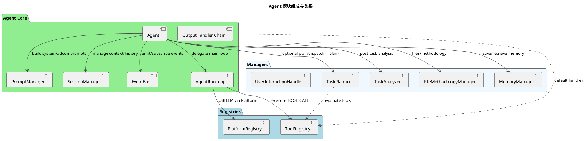
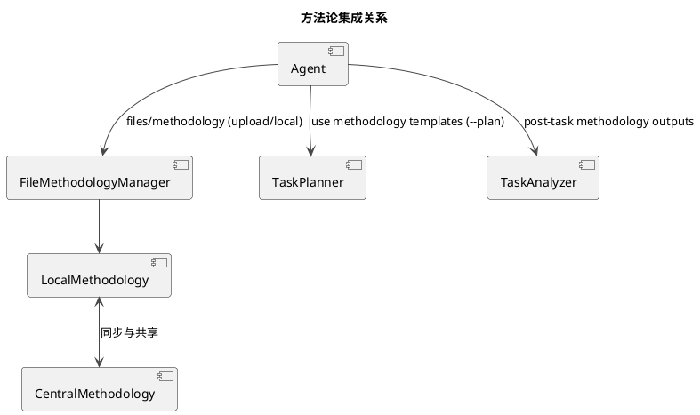
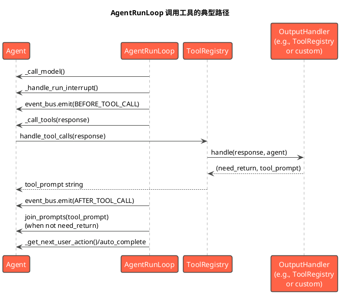
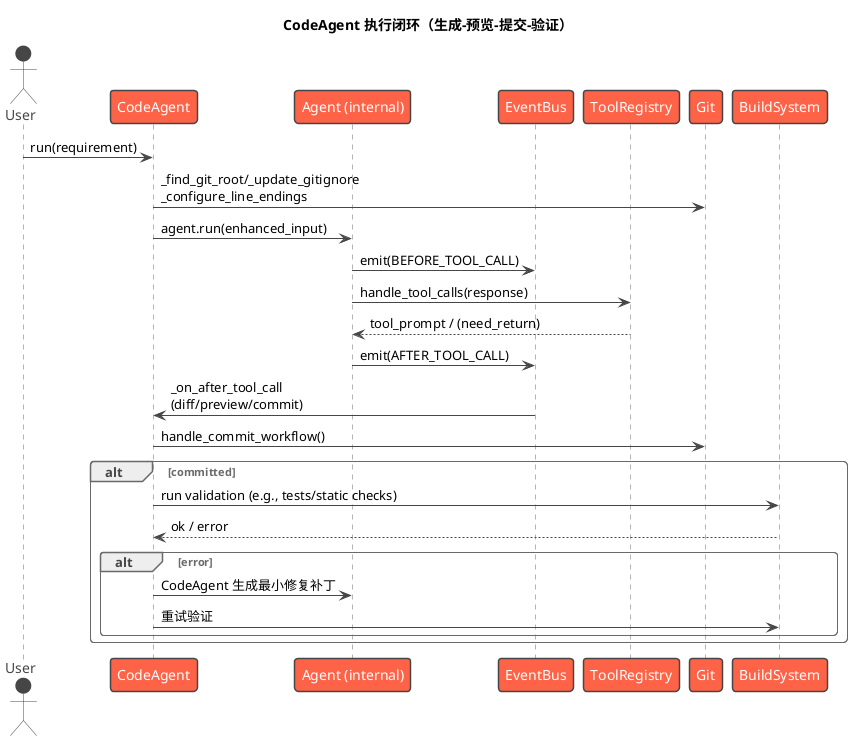

# 初赛技术报告（基于 Jarvis-Agent 的 jsec 与 jc2r 实现）

## 目录
- a. 系统架构设计
- b. 核心算法与策略
- c. 功能实现说明
- d. 测试方案设计

## 系统架构设计
### Agent 整体架构与核心模块
- 安全分析（jsec）
  - CLI: src/jarvis/jarvis_sec/cli.py
    - 子命令 agent：优先尝试多Agent分析（run_with_multi_agent），失败或无输出时回退直扫基线（run_security_analysis_fast）
  - Workflow: src/jarvis/jarvis_sec/workflow.py
    - direct_scan: 基于启发式规则扫描 C/C++ 与 Rust 源码（模块化 checkers）
    - run_with_multi_agent: 调用 jarvis.jarvis_sec.run_security_analysis（延迟导入）进行逐条候选多Agent分析，最后聚合
    - run_security_analysis_fast: 调用 report.build_json_and_markdown 输出统一 JSON + Markdown 报告
  - Checkers: src/jarvis/jarvis_sec/checkers/
    - c_checker.py：C/C++ 启发式规则（不安全 API、内存管理、边界长度、I/O 返回值检查、线程与锁、格式化字符串、命令执行、权限、随机源、安全时间接口等）
    - rust_checker.py：Rust 启发式规则（unsafe、原始指针、transmute、MaybeUninit、unwrap/expect、extern "C"、unsafe impl、忽略错误等）
    - types.py：Issue 结构定义（language/category/pattern/file/line/evidence/description/suggestion/confidence/severity）
  - 报告聚合: src/jarvis/jarvis_sec/report.py
    - aggregate_issues: 归一化+评分（severity 权重*confidence）
    - format_markdown_report: 渲染统一 Markdown
    - build_json_and_markdown: 返回“JSON文本 + Markdown文本”合并输出

- 代码迁移（jc2r）
  - CLI: src/jarvis/jarvis_c2rust/cli.py
    - scan：libclang 扫描并可选生成引用图 DOT/PNG 与每个根函数子图
    - prepare：基于 LLM 生成 crate 结构并应用到磁盘（llm_module_agent）
    - transpile：按 translation_order.jsonl 转译函数，迭代构建/修复并生成最小单测
    - lib-replace：基于 LLM 的库替代评估与剪枝，生成新的符号表与转译顺序
    - run：流水线（collect -> scan -> lib-replace -> prepare -> transpile -> optimize）
    - optimize：对生成 Rust 工程做保守优化（unsafe 清理、重复结构处理、可见性、文档）
  - 扫描与图谱: src/jarvis/jarvis_c2rust/scanner.py
    - 使用 clang.cindex 生成统一符号表 symbols.jsonl（函数/类型统一记录，字段含范围、调用 ref 等）
    - Tarjan SCC + 反向 DAG 拓扑（叶先序）产出 translation_order.jsonl
    - 导出全局 DOT 和每个根函数子图 DOT
  - LLM 模块规划: src/jarvis/jarvis_c2rust/llm_module_agent.py
    - 基于 translation_order.jsonl 聚合 root 上下文，调用 Agent 生成 crate 目录 YAML（强校验：src/lib.rs 必须，main/ bin 入口按规则约束）
    - 可 apply 到磁盘并用 CodeAgent 进行最小补齐与 cargo 构建循环
  - 库替代剪枝: src/jarvis/jarvis_c2rust/library_replacer.py
    - 仅依赖 scanner 工具函数，按根进行“LLM 子树可替代性”评估（可禁用库），将可替代子树剪除并给根打上 lib::<name> ref，占位替代
    - 生成 symbols_library_pruned.jsonl、library_replacements.jsonl、translation_order_prune.jsonl 并别名为统一路径
    - 断点续跑与原子写，入口函数保护（main）
  - 转译器: src/jarvis/jarvis_c2rust/transpiler.py
    - 主流程：按 order 逐函数：
      1) LLM 规划模块与签名（强格式 
<yaml>）
      2) CodeAgent 生成实现，确保存在后追加最小可编译单测
      3) cargo test 循环修复（最小改动）
      4) LLM 审查与类型/边界二次审查（必要时微修）
      5) 记录映射 JSONL（symbol_map.jsonl）、进度 progress.json
      6) 若之前放置了 todo!("符号") 占位，消解并重测
    - 多项保底：缺少 Cargo.toml/lib.rs 自动补齐、mod 链路与顶层 pub mod 补齐
  - 优化器: src/jarvis/jarvis_c2rust/optimizer.py
    - unsafe 清理（失败回滚并补注 /// SAFETY）
    - 重复函数检测与标记
    - pub 降级为 pub(crate)（失败回滚）
    - 文档补充（//!、///）
    - 每步后 cargo test 校验；失败进入最小修复循环（CodeAgent）
    - Git Guard：快照与失败回滚（可选）

### 代码理解引擎、安全分析模块、决策引擎、代码生成器
- 代码理解引擎
  - jsec：纯 Python 启发式（正则+邻域上下文），支持注释剥离与字符串掩蔽（降低误报），统一 Issue 数据结构
  - jc2r：libclang AST 扫描构建统一符号表（函数/类型），再进行 SCC/DAG 分析与顺序规划
- 安全分析模块
  - jsec checkers：C/C++ 与 Rust 启发式规则（详见 b. 核心算法）；workflow 统一聚合与 Markdown 报告
  - jc2r 辅助：转译器的类型/边界二次审查与优化器的 unsafe 清理策略
- 决策引擎
  - jsec：直扫 -> 多Agent验证回退机制；report 模块统一评分与 Top 风险定位
  - jc2r：
    - 库替代剪枝（LLM）决定是否以标准库/第三方库替换整子树
    - 函数模块归属与签名（LLM）决策
    - 构建/修复循环（cargo test）驱动最小改动策略
    - 审查器（LLM）仅关注关键逻辑一致性，出现问题时最小修复
- 代码生成器
  - CodeAgent 用于生成与补丁落盘（Rust 实现/签名修正/测试/构建修复/优化），遵循“最小变更”与“仅输出补丁”约束
  - llm_module_agent 应用目录结构并协同 CodeAgent 完成 crate 初始化

### 模块接口与数据流
- jsec 数据流
  - 输入：项目根目录
  - 直扫（direct_scan）→ issues（Issue[]）→ report.build_json_and_markdown → 输出 JSON + Markdown
  - 多Agent：direct_scan 候选 → 逐条 Agent 验证 → report 聚合
- jc2r 数据流
  - scan：源代码 -> symbols.jsonl（统一记录函数/类型/位置/引用）+ meta.json
  - order：symbols.jsonl -> translation_order.jsonl（items 含完整记录）
  - lib-replace（可选）：order/symbols -> 剪枝 symbols + 替代映射 + 新 order
  - prepare（可选）：translation_order.jsonl -> LLM YAML -> 应用到 crate（目录/Cargo.toml）
  - transpile：order -> 每函数规划签名/模块 -> 生成实现/单测 -> 构建/修复 -> 审查/微修 -> 映射/进度
  - optimize（可选）：对 crate 做保守优化

### AI 模型选型与集成架构
- 通过 jarvis_agent.Agent 与 CodeAgent 统一封装模型平台（jarvis_platform），可在 CLI 透传 llm_group
- 使用非交互（non_interactive）与强格式 summary（
<yaml>）保证稳定性
- LLM 参与点：
  - 模块规划（签名/模块归属）
  - 库替代剪枝（子树可替代性评估，支持禁用库）
  - 目录规划（crate 结构，入口规则强校验）
  - 代码审查与最小化优化（关键逻辑、类型与边界二次审查）
  - 构建修复循环（最小补丁）

### Agent 架构设计详解（基于源码）
- Agent 模块组成与关系（模块清单与职责）
  - Agent（协调中心）：组装并管理 AgentRunLoop、PromptManager、SessionManager、EventBus、OutputHandler 链，协同 MemoryManager/TaskPlanner/TaskAnalyzer/FileMethodologyManager。
  - AgentRunLoop（运行循环）：承载主循环，驱动“模型调用→工具执行→中断处理→完成处理”，在关键节点发事件（BEFORE/AFTER_MODEL_CALL、BEFORE/AFTER_TOOL_CALL 等）。
  - OutputHandler Chain（输出处理器链）：默认包含 ToolRegistry，负责解析并执行模型返回的 TOOL_CALL；可扩展其他处理器。
  - ToolRegistry（工具注册表）：统一发现/加载/执行工具（内置/外部 .py/MCP），提供 execute_tool_call 标准协议 (need_return, tool_prompt)。
  - PlatformRegistry（平台注册表）：管理平台/模型适配，统一 chat_until_success、set_system_prompt、upload_files 等。
  - PromptManager（提示管理器）：构建系统提示与默认附加提示，集中注入工具使用规范与记忆提示。
  - SessionManager（会话管理器）：管理 prompt/addon_prompt/历史与持久化（saved_session.json）。
  - EventBus（事件总线）：轻量发布/订阅，旁路集成能力；回调异常隔离不影响主流程。
  - MemoryManager（记忆管理器）：准备记忆标签提示、在关键节点保存/检索；与 save/retrieve/clear_memory 工具协作。
  - TaskPlanner（任务规划器，可选）：在启用 --plan 时进行任务拆分与子Agent调度，写回 <PLAN>/<SUB_TASK_RESULTS>/<RESULT_SUMMARY>。
  - TaskAnalyzer（任务分析器）：任务完成阶段的旁路分析与满意度收集，不阻塞主流程。
  - FileMethodologyManager（文件/方法论管理）：文件上传/本地模式选择，方法论加载，历史上传。
  - UserInteractionHandler（交互封装）：封装多行输入与确认逻辑，便于替换为 TUI/WebUI。

- Agent 模块关系图（PlantUML）

- 实现细节补充（源码锚点）
  - 运行循环（src/jarvis/jarvis_agent/run_loop.py）
    - 会话轮次与自动总结：conversation_rounds、JARVIS_TOOL_REMINDER_ROUNDS 提示工具规范；auto_summary_rounds 触发 _summarize_and_clear_history 并将摘要回灌 addon_prompt，维持上下文连续。
    - 首轮初始化与中断分支：ag.first → _first_run；_handle_run_interrupt 返回 Enum(skip_turn)/最终结果（结束）。
    - 工具调用事件：BEFORE_TOOL_CALL/AFTER_TOOL_CALL 事件广播；_call_tools 统一委派工具执行并返回 (need_return, tool_prompt)；join_prompts 安全拼接上下文。
    - 自动完成与下一步：is_auto_complete 检测 ot('!!!COMPLETE!!!')；normalize_next_action 统一 continue/complete 分支。
  - 工具执行协议（src/jarvis/jarvis_agent/tool_executor.py）
    - 唯一处理器约束：agent.output_handler 过滤 can_handle(response)；命中>1 报错“只能一次执行一个操作”；命中0 直接返回空串。
    - 执行前确认：agent.execute_tool_confirm 为 True 时 user_confirm 交互确认；否则直接执行。
    - 标准返回：handler.handle → (need_return, tool_prompt)；need_return=True 则立即返回结构化结果（如 SEND_MESSAGE），否则继续拼接 tool_prompt（字符串）。
  - 提示管理（src/jarvis/jarvis_agent/prompt_manager.py）
    - build_system_prompt：拼装 agent.system_prompt + get_tool_usage_prompt。
    - build_default_addon_prompt：结构化 <system_prompt> 片段，含完成策略提示、输出处理器名称、memory_manager 注入的记忆提示（save/retrieve/clear）。
  - 输出处理器接口（src/jarvis/jarvis_agent/output_handler.py, protocols.py）
    - OutputHandler 抽象类与 OutputHandlerProtocol（name/can_handle/prompt/handle）统一约束，实现“决策与执行”分离；ToolRegistry 既是注册表也是默认处理器。
  - 任务管理（src/jarvis/jarvis_agent/agent_manager.py, task_manager.py）
    - AgentManager.initialize/run_task：创建 Agent、可恢复会话、支持预定义任务加载与选择（data_dir/pre-command 与 .jarvis/pre-command）。
    - TaskManager.select_task：rich 表格与 fzf 选择、补充信息 join_prompts 回灌任务描述，降低“空白输入”的上手成本。
  - 事件总线（src/jarvis/jarvis_agent/event_bus.py）
    - subscribe/emit/unsubscribe 同步机制，异常隔离提升主流程鲁棒性；广泛用于 BEFORE/AFTER_TOOL_CALL、BEFORE/AFTER_MODEL_CALL、BEFORE/AFTER_HISTORY_CLEAR 等节点。

- 设计权衡与好处（进一步说明）
  - 单一职责与轻耦合：Agent 仅协调与装配；AgentRunLoop 专注运行；OutputHandler/ToolRegistry 专注“解析+执行”；PromptManager 专注“提示拼装”，便于测试与演进。
  - 可扩展处理器与注册表：通过 Protocol 抽象输出处理器，ToolRegistry 支持内置/外部.py/MCP 多源工具，易于接入新能力与热插拔。
  - 可靠容错与用户可控：事件总线异常隔离；工具唯一命中与执行前确认减少误操作；自动总结避免上下文膨胀。
  - 可观察性与旁路生态：事件流可承载统计、满意度收集、记忆保存、构建/提交钩子（在 CodeAgent 中）等旁路能力，提升系统可运维性。
  - 平台可移植性：PlatformRegistry 抽象平台与模型，统一 chat_until_success/set_system_prompt/upload_files 等能力，屏蔽厂商差异。
  - 统一工具调用协议：标准返回 (need_return, tool_prompt) 与 join_prompts 规则，让上层主循环与下游模块在“低熵通信”下稳健协作。

- 关键关系说明
  - 委派与解耦：Agent 仅做协调与装配，核心运行逻辑委派给 AgentRunLoop；工具与平台通过注册表解耦，输出处理器屏蔽解析与执行细节，降低耦合、提高可替换性与测试友好性。
  - 事件驱动：在模型/工具调用前后广播事件，旁路能力（如记忆保存、任务分析、构建统计）通过订阅集成，不污染主路径；回调异常隔离，增强鲁棒性。
  - 强约束输出：分析型任务启用 need_summary 与强 summary_prompt（
 YAML/纯文本），结合本地严格校验与自动重试，显著降低“幻觉/格式不一致”，提升集成确定性。
  - 代码改造耦合：CodeAgent 复用通用 Agent（含事件总线），并在 AFTER_TOOL_CALL 阶段钩住差异预览/提交工作流/静态检查建议，实现“生成-审查-提交”的闭环；工程规则通过系统提示统一约束最小变更。
  - 方法论集成：在 Agent 初始化后、首轮运行前通过 FileMethodologyManager 选择“上传/本地”模式，将方法论与记忆标签提示注入系统提示；启用 --plan 时，TaskPlanner 按方法论模板进行任务拆分与子Agent调度；任务完成阶段，TaskAnalyzer 旁路沉淀方法论与改进建议。收益：统一思维框架、可复用/可审计的流程产物、团队知识沉淀与持续改进。

- 设计思想与收益
  - 以“协调者”简化核心：Agent 自身不执行具体业务，只驱动主循环并委派执行，使核心轻量、易测试、易扩展。
  - 注册表实现“可插拔”：ToolRegistry/PlatformRegistry 将具体实现抽象化，支持内置/外部 .py/MCP 工具与不同平台的并存与热插拔，降低供应商锁定与集成复杂度。
  - 事件总线构建“旁路生态”：以发布/订阅方式扩展非主路径能力（记忆保存、满意度收集、统计），避免核心侵入、提升模块协同与调试可见性。
  - 严格的输出契约：强格式 
 与本地校验重试，保证跨模块边界的“低熵”通信，利于流水线自动化与评测重现。
  - 分层记忆与方法论融合：短期/项目长期/全局长期记忆配合方法论、规划器与分析器，提供“上下文连续+思维框架一致”的执行体验，提升稳定性与可维护性。
  - 工程可操作性优先：CodeAgent 将工程规则注入系统提示，统一“最小变更、补丁输出、构建验证”的实践，使自动代码改造具备可回退、可审计的工程属性。

- 方法论集成关系图（PlantUML）

## 运行循环与工具协议（基于源码）
- 运行循环要点（run_loop.py）
  - 轮次与提示管理：
    - conversation_rounds 计数，每到 JARVIS_TOOL_REMINDER_ROUNDS（默认20）自动将 get_tool_usage_prompt 追加到 addon_prompt，提醒工具使用规范。
    - auto_summary_rounds 触发自动总结：优先取 agent.auto_summary_rounds，否则用全局 get_auto_summary_rounds；达到阈值后调用 _summarize_and_clear_history() 并将摘要再拼回 addon_prompt 以保持上下文连续。
  - 首次运行与中断：
    - 首轮 ag.first 时执行 ag._first_run() 做初始化准备。
    - ag._handle_run_interrupt(current_response) 支持 skip_turn（继续下一轮）或直接返回最终结果（任务结束）。
  - 工具调用与事件：
    - BEFORE_TOOL_CALL：发射事件（payload 含 agent/current_response）后调用 ag._call_tools()。
    - _call_tools 内委派 execute_tool_call：解析并执行唯一的输出处理器（见下文）；返回 (need_return, tool_prompt)。
    - AFTER_TOOL_CALL：发射事件（payload 含 agent/current_response/need_return/tool_prompt）。
    - 若 need_return=True（例如 SEND_MESSAGE 工具），直接返回 tool_prompt 作为上层结果；否则将 tool_prompt（字符串）与 session.prompt 使用 join_prompts 安全拼接。
  - 自动完成与下一步：
    - auto_complete 且 is_auto_complete(current_response)（ot('!!!COMPLETE!!!') 或字面量）→ 先 _complete_task，再根据 need_summary 决定返回值。
    - _get_next_user_action + normalize_next_action：continue → 运行输入处理器并进入下一轮；complete → _complete_task。

- 工具执行协议（execute_tool_call 与 OutputHandler）
  - 扫描 agent.output_handler 列表，收集 can_handle(response) 为 True 的处理器；要求唯一命中，否则报错“一次只能执行一个操作”并拒绝执行。
  - 执行前确认：若 agent.execute_tool_confirm 为 True，则调用 user_confirm("需要执行X确认执行？")；否则直接执行。
  - 调用 handler.handle(response, agent) → 返回 Tuple[bool, Any]：
    - bool need_return：是否立即返回结果给上层（典型：SEND_MESSAGE 将结构化结果直接返回）
    - Any tool_prompt：供继续交互的字符串提示（通常为格式化输出）；非字符串会在拼接时被安全忽略
  - OutputHandlerProtocol（protocols.py）定义统一接口：name/can_handle/prompt/handle；ToolRegistry 实现该协议，既是注册表也是默认输出处理器。

- 提示构建与附加提示（prompt_manager.py）
  - 系统提示：build_system_prompt() 将 agent.system_prompt 与 get_tool_usage_prompt 拼装，作为统一 system_prompt 注入模型。
  - 默认附加提示：build_default_addon_prompt(need_complete) 生成结构化 <system_prompt> 片段，包含：
    - 完成策略（若需要则提示输出 ot('!!!COMPLETE!!!')）
    - 操作列表：来自 output_handlers 的处理器名称
    - 记忆提示：调用 memory_manager.add_memory_prompts_to_addon 注入 save/retrieve/clear 建议
  - 作用：集中化、可复用的提示构建，不直接触达模型，保持“拼装字符串”的单一职责。

- 预定义任务工作流（agent_manager.py + task_manager.py）
  - AgentManager.initialize()：创建 Agent 并支持恢复会话（--restore-session）。
  - AgentManager.run_task()：
    - CLI 传入的 task_content 优先执行；
    - 非交互且未启用“跳过预定义任务”时，TaskManager.load_tasks() 从 data_dir/pre-command 与 .jarvis/pre-command 读取 YAML（键为任务名、值为描述）；
    - 通过 rich table 与 fzf 供用户选择，支持“补充信息”并用 join_prompts 拼回任务描述，随后调用 agent.run。
  - 价值：降低“空白输入”的上手成本，支持带模板的“任务快速起步”。

- 事件总线（event_bus.py）
  - 接口：subscribe(event, callback) / emit(event, **payload) / unsubscribe(event, callback)
  - 设计：同步广播、回调异常隔离（吞异常），最大化主流程稳定性；便于旁路集成（如任务分析、统计、记忆保存、CodeAgent 的构建/提交钩子）。

- 运行时序（工具调用路径，PlantUML）

### CodeAgent 模块关系与时序（基于源码）
- 执行闭环（生成→预览→提交→验证）时序

- 设计亮点
  - 事件钩子：通过订阅 AFTER_TOOL_CALL，实现与通用 Agent 的“松耦合集成”，无需侵入 Agent 主循环。
  - 工程规则内化：系统提示统一约束“最小变更/补丁输出/禁用通配/unsafe 最小化 + SAFETY 注释/最小单测”，输出可审计、可回退。
  - 验证闭环：以统一验收（如测试/静态检查）为标准；失败进入最小修复循环，结合差异预览与提交工作流形成端到端可观测链路。
  - Git 安全网：强制 git 准入与 .gitignore/换行规则落地；提交前 shortstat 统计与大批量新增文件确认，降低误操作风险。

- 角色与定位
  - 通用 Agent（jarvis_agent.Agent）
    - 统一封装大模型平台与工具调用，支持 system_prompt/user_prompt/summary_prompt 的三段式交互，支持会话恢复与事件总线（event_bus）。
    - 在 jc2r 与 jsec 中被不同场景复用：规划/审查/评估等“分析型”任务通过该 Agent 执行（need_summary=True、强 summary 格式约束）。
  - CodeAgent（jarvis_code_agent.code_agent.CodeAgent）
    - 面向“代码修改落盘”的工程型 Agent，组合一个内部的 Agent 实例并对其进行代码工程规则增强，负责生成补丁、预览 diff、提交工作流、与构建/静态检查的集成。
    - CLI 入口 jarvis-code-agent；在 jc2r 的 transpiler/optimizer 中作为实现与修复执行体。

- 初始化与系统提示注入（CodeAgent.__init__）
  - 基础工具白名单（use_tools）：
    - execute_script, search_web, ask_user, read_code, save_memory, retrieve_memory, clear_memory, sub_code_agent（可附加 append_tools）。
    - 工具通过 ToolRegistry 管理；子任务可通过 sub_code_agent 派生子 CodeAgent（隔离上下文/并行）。
  - 系统提示词（system_prompt）：
    - 注入代码工程规则块 <code_engineer_guide> 与 <say_to_llm>（角色定位/核心原则/工作流程/工具使用/编辑规范/子任务托管），确保“先读后写、最小变更、补丁输出”的行为约束。
    - 规则合并：先读取数据目录的全局 rules，再读取项目 .jarvis/rules，拼接为 <rules> 注入，实现“组织级与项目级”叠加约束。
  - 运行模式：
    - need_summary 可选；plan 标志继承配置（is_plan_enabled）；禁用方法论与分析（use_methodology=False/use_analysis=False）；支持 non_interactive。
  - 事件订阅：
    - 订阅 AFTER_TOOL_CALL（event_bus），在工具调用后执行差异预览、提交工作流与静态检查提示（详见“变更回路与提交工作流”）。

- 环境准备与输入增强（CodeAgent.run）
  - Git 准入与仓库准备：
    - _check_git_config：严格模式校验 user.name/user.email（JARVIS_GIT_CHECK_MODE=warn 时降级为告警）。
    - _find_git_root_and_cd：切换到 Git 根；_update_gitignore：创建/追加常用忽略规则（含 .jarvis、语言模板）。
    - _configure_line_ending_settings：设置 core.autocrlf=false/core.safecrlf=false/core.whitespace=cr-at-eol；Windows 场景提示 .gitattributes 建议（可交互落盘）。
  - 变更保护与会话：
    - 单实例互斥锁（code_agent.lock）；支持从 .jarvis/saved_session.json 恢复会话（restore_session）。
  - 任务上下文增强：
    - 读取项目统计 get_loc_stats 与最近提交 get_recent_commits_with_files；将“项目概况 + 修改规范 + 任务描述”合并为增强输入传递给 Agent.run。

- 变更回路与提交工作流（事件回调 _on_after_tool_call）
  - 差异获取与按文件预览：
    - 全量 diff 打印（rich 代码块），随后构建“每文件预览”。未跟踪文件通过临时 git add -N 纳入 numstat/diff。
    - 删除文件：仅提示删除（不强制显示 diff）；大变更（>300 行）仅显示“新增/删除行数”摘要，避免输出过长。
    - 其它变更：展示单文件 diff（git diff [HEAD] -- <file>），无法展示时以提示代替。
  - 提交工作流（handle_commit_workflow）：
    - 用户确认后提交，统计 code_lines_inserted/code_lines_deleted（jarvis_stats）；commit 接受/拒绝分支路径均有提示与回退选项（支持软重置到起始提交）。
    - 修改被拒绝：仍输出“补丁预览（按文件）”供再次迭代。
  - 静态检查建议与工具集成：
    - 根据 get_lint_tools(file) 给出文件级 lint 建议；当 is_enable_static_analysis() 时附加自检提示，避免零散多次调用。
  - 记忆与附加提示：
    - 用户接受提交后可选择保存记忆（force_save_memory 时提示）；用户也可输入自定义附加提示追加到会话。

- Git 快照与安全防护（交互增强）
  - 首次运行与提交：
    - 当目录非 Git 仓库时，可交互初始化（git init），确保所有修改在版本控制下进行。
  - 未提交变更守护：
    - 提交前统计 shortstat 并记录到 jarvis_stats；新增文件批量添加时与 .gitignore 交互确认，避免误提交噪声文件。

- Agent 三段式交互与强格式产出（通用）
  - system_prompt：注入角色/原则/工具/规则（CodeAgent 注入工程规则；分析型 Agent 注入任务场景规则）。
  - user_prompt：上下文与任务（在 jc2r 中包含函数源码片段/依赖上下文/crate 目录树等；在 CodeAgent 中包含项目概况与改动规范）。
  - summary_prompt：强格式约束产出：
    - 规划/签名：
<yaml>，必须包含 module 与 rust_signature（路径位于 crate/src，禁止 main.rs）；本地校验失败会携原因重试。
    - 关键逻辑审查：仅允许 OK 或若干 [logic] 行；找不到实现必须输出 [logic] function not found。
    - 类型/边界审查：
<yaml> 包含 ok 与 issues（指针可变性/空指针/边界/unsafe 注释），不通过则触发一次最小修复补丁。
  - 工具使用策略：
    - execute_script 用于 cargo build/test 与外部命令；read_code 精准读取上下文；retrieve/save/clear_memory 管理会话记忆；sub_code_agent 派生子 CodeAgent 执行分支任务。

- Orchestrator 与运行模式
  - 通用 CLI（jarvis.jarvis_agent.jarvis）：
    - 提供 model_group/tool_group 与配置透传、内置配置选择器（agent/multi_agent/roles），支持 Web 模式（WebSocket I/O 重定向）。
    - 通过 AgentManager 初始化并运行任务；非交互模式下要求显式传入 --task。
  - CodeAgent CLI（jarvis.jarvis_code_agent.code_agent.cli）：
    - 非交互模式要求 --requirement；启动时 init_env 并获取单实例锁；若非 Git 仓库可交互初始化。
    - 允许 restore_session；每轮输入通过 get_multiline_input 交互推进；run() 内负责完整的环境准备与变更回路。

- 与 jc2r/jsec 的耦合点（关键）
  - jc2r：
    - Transpiler 使用“分析型 Agent”进行模块与签名规划/关键逻辑审查/类型与边界审查；使用 CodeAgent 生成实现与最小修复；AFTER_TOOL_CALL 负责提交与预览。
    - Optimizer 复用 CodeAgent 进行整体最小优化（unsafe 清理/可见性/文档/重复处理）的补丁生成与构建验证。
  - jsec：
    - 多Agent模式由 workflow.run_with_multi_agent 触发通用 Agent 对直扫候选逐条核验；最终统一用 report 聚合评分与渲染。

- 典型端到端序列（代码改造）
  1) CodeAgent 初始化 → 注入规则与工具 → 订阅 AFTER_TOOL_CALL
  2) 环境准备（git 根查找/.gitignore/换行设置/提交守护）→ 输入增强（代码统计+提交历史）
  3) Agent.run 执行工具与补丁 → AFTER_TOOL_CALL：diff 预览/提交工作流/静态检查建议
  4) 用户确认与记忆保存（可选）→ 循环迭代直至构建通过并提交

- 典型端到端序列（分析与规划）
  1) 构造上下文（源码片段/符号表/目录树等）→ 分析型 Agent 输出强格式 

  2) 本地严格校验与自动重试 → 不通过时携原因重试
  3) 产出供 CodeAgent 消化：模块路径/签名/修复点 → 进入代码改造序列

## 核心算法与策略
1) 代码安全问题检测算法（jsec）
- C/C++ 检测（c_checker.py）
  - 输入预处理：
    - 剥离注释保留字符串（_remove_comments_preserve_strings）
    - 字符串掩蔽（_mask_strings_preserve_len）降低“字符串命中”误报
    - 条件编译 #if 0 剥离（_strip_if0_blocks）
  - 代表性规则（部分）：
    - 不安全 API：strcpy/strcat/gets/sprintf/vsprintf，建议使用长度受限 API
    - 边界操作：memcpy/memmove/strncpy/strncat（结合 strlen/sizeof(*ptr) 提升置信度）
    - 内存管理：realloc 覆盖/分配后未判空/use-after-free 线索/野指针/空指针解引用
    - I/O 返回值：open/read/fread 等未检查返回值
    - 字符串格式化：printf 家族/fprintf 格式串非字面量（带 wrapper/literal 回看降低误报）
    - 命令执行：system/exec* 传入非字面量（回看变量字面量赋值降低误报）
    - scanf 宽度：%s 未限制最大宽度
    - 分配大小溢出：malloc 乘法未显式 sizeof
    - 线程与锁：双重加锁/缺失解锁/锁顺序反转/pthread 返回值未检查/cond_wait 非 while
    - 旧接口与权限：inet_addr/inet_aton、时间非线程安全（*_r 替代）、open 0666/0777
    - 其他：alloca/VLA、strtok 非重入、rand 用于敏感上下文、free 非堆/double free、getenv 未校验
  - 置信度/严重性：
    - 按命中模式与局部上下文加权，映射为 high/medium/low
- Rust 检测（rust_checker.py）
  - unsafe/原始指针/transmute/MaybeUninit+assume_init
  - unwrap/expect/忽略错误（let _ = …；.ok() 等）
  - extern "C"/unsafe impl Send/Sync
  - 上下文抑制：SAFETY 注释/#[test] 测试上下文降低置信度
- 报告聚合（report.py）
  - 归一化 Issue，稳定 ID（sha1(file:line:cat:pat)）
  - 评分：confidence*severity_weight；Top 风险文件按累计分排序
  - 统一 Markdown：概览（语言/类别/Top 文件）+ 详细条目（证据/建议/评分）

2) C/C++ → Rust 转换策略与决策树（jc2r）
- 图谱与顺序
  - libclang 扫描生成 symbols.jsonl（函数/类型统一记录）
  - Tarjan SCC + 反向 DAG 拓扑：叶先序，保持“先依赖后入口”的稳定顺序
  - order.jsonl 每步 items 含完整符号记录（纯自包含）
- 决策与生成
  - 库替代剪枝（可选）：LLM 子树评估（禁用库约束、入口保护），将可替代子树剪除并对根 ref 标记 lib::<name>
  - 模块与签名：LLM 生成 
<yaml> 严格格式（module 位于 crate/src，禁止 main.rs），本地对签名进行“形参个数/指针可变性/ptr+len”一致性检查并最小修正
  - 生成实现：CodeAgent 以最小变更生成函数实现与同文件最小单测（占位参数、避免 panic!/todo!）
  - 构建循环：cargo test 持续修复（最小改动，严格作用域）
  - 审查：LLM 审查仅关注关键逻辑一致；不通过则微修并构建验证
  - 二次审查（类型/边界）：指针可变性、空指针/必要边界、unsafe 范围与 SAFETY 注释，必要时最小修复
  - 依赖 todo! 消解：当被调函数转译完成，自动替换 todo!("符号") 为真实调用并验证
  - 记录：progress.json（当前/度量）、symbol_map.jsonl（位置区分，支持重载）
- 工程结构（prepare）
  - LLM 生成 crate 目录 YAML（严格入口规则：有 main → src/bin/<crate>.rs；否则仅 lib），强制解析与重试
  - 应用后 CodeAgent 完成 mod/pub mod 补齐与 cargo 构建初始化

3) unsafe 使用决策机制
- 优先安全实现；必须 unsafe 时：
  - 转译器约束“unsafe 最小作用域 + SAFETY 注释说明”并在二次审查阶段验证
  - 优化器尝试移除多余 unsafe；构建失败回滚并自动注入“/// SAFETY: 原因摘要”
  - 对 extern "C" 与原始指针约束：严格参数校验与封装

4) 渐进式演进路径
- “替代优先，逐步转译”
  1) 扫描与可视化 → 2) 库替代剪枝（可选）→ 3) 目录规划 → 4) 按顺序函数转译（可构建/可测）→ 5) 保守优化
- 断点续跑与最小变更保证可回退与稳定推进
- 关键产物可回放：symbols.jsonl/order.jsonl/symbol_map.jsonl/progress.json

## 功能实现说明
1) bzip2 代码分析能力（计划与可落地性）
- 适配方式：将 bzip2 源码放置为扫描根目录，jsec 直扫与多Agent模式均可运行
- 规则覆盖（典型命中点）：
  - 字符串/缓冲：strcpy/strncpy/memcpy/memmove 使用处的长度边界；读写窗口/缓冲复用
  - I/O：fopen/read/fread/fwrite 返回值检查缺失
  - 格式化：fprintf/printf 使用非字面量格式串
  - 内存管理：realloc 覆盖、分配后未判空、UAF 线索、VLA/alloca
  - 线程与锁（如存在并发路径）：pthread 锁顺序/解锁缺失/返回值未检查
- 报告输出：基线直扫生成统一 JSON + Markdown（包含 Top 文件/类别统计与详细证据）

2) OpenHarmony 库改进方案（以 c_utils/hilog 为例）
- 目标：日志接口安全化与向 Rust 迁移
- 方案 A（C 侧安全化）：
  - jsec 驱动的规则清理：格式串统一字面量/包装字面量（gettext/tr 等）；禁止 sprintf/vsprintf，统一 snprintf/vsnprintf
  - 统一错误返回处理与权限收紧（日志文件/管道）
- 方案 B（Rust 迁移封装）：
  - jc2r library_replacer：对自定义日志子树进行 LLM 评估，若可替代则映射为 Rust log/env_logger/tracing 等库组合（禁用不合规库）
  - 为 hilog 的关键入口提供 safe wrapper（FFI 内部封装 unsafe，外暴露安全 API），并在转译器二次审查中验证指针/边界
- 渐进式落地：
  - 从替代性最高的日志路径先行（printf/fprintf 族），逐步引入 Rust 端封装并替换调用点
  - 对无法替代路径保留 C 端，先做格式/边界加固

3) 预期指标（目标）
- 检出率（jsec 阶段一）：≥60%（workflow 目标）
- 准确性：通过注释剥离/字符串掩蔽/邻域判定降低误报（格式串/命令执行/内存管理规则已包含误报抑制逻辑）
- 性能：纯 Python 规则 + rg 加速（可用时）满足常见中型仓库分钟级直扫
- 转译产出：函数级“可构建/可测试”占位实现与最小单测，流水线单次构建可通过率随项目迭代逐步提升

## 测试方案设计
1) 单元测试（至少覆盖 5 个核心功能）
- jsec
  - workflow._iter_source_files：扩展名与排除目录过滤（.git/build/out/target/third_party/vendor）
  - c_checker.analyze_c_cpp_text：
    - 不安全 API：strcpy（期望 unsafe_api，高置信度）
    - realloc 覆盖（pattern=realloc_overwrite）
    - scanf %s 未限宽（pattern=scanf_%s_no_width）
    - 死锁检测：双重加锁/缺失解锁（样例片段校验）
  - rust_checker.analyze_rust_text：
    - unsafe/原始指针/transmute/unwrap/extern "C"/unsafe impl（各至少一例）
  - report.aggregate_issues：
    - 评分（confidence*weight）、Top 风险文件排序稳定性
- jc2r
  - scanner.compute_translation_order_jsonl：构造小图（含环/SCC）验证顺序叶先原则（入口 main 延迟）
  - transpiler._extract_json_from_summary：对合法/非法 SUMMARY 输入鲁棒解析
  - optimizer._opt_unsafe_cleanup：在小型 crate 上注入“可移除 unsafe”与“需要保留 unsafe”两类用例，验证移除/回滚与 SAFETY 注释注入

2) bzip2 测试案例设计（至少 3 个函数）
- 目标函数（示例）：
  - BZ2_bzDecompress：检查 I/O/边界与内存管理规则命中（jsec），jc2r 扫描/顺序生成 items
  - BZ2_bzCompress：同类规则命中；在 jc2r 转译中验证 ptr+len 一致性检查提示与签名修正
  - BZ2_crc32Table 或 CRC 相关函数：验证 rand/权限/格式化规则不误报，Rust 端转译生成可编译占位与最小单测
- 步骤：
  - 将 bzip2 源码放置为扫描根；执行 jsec agent 与 jc2r scan + transpile（仅挑选 3 个函数作为 --only 或 root-list）
  - 校验 jsec 报告必含上述类别中的至少一项命中
  - jc2r 对 3 个函数生成 Rust 实现+最小单测并 cargo test 通过

3) 集成测试与验证
- jsec 集成：
  - 命令：jsec agent -p ./target_project -o ./out/report.md
  - 断言：report.md 非空，JSON 段含 by_language/by_category/summary.top_risk_files，Markdown 段含“详细问题”
- jc2r 集成（不走替代简化路径）：
  - 命令：jarvis-c2rust run --root-list-syms "<fnA>,<fnB>" -g <llm_group> --max-retries 3 --resume
  - 断言：
    - .jarvis/c2rust 下 symbols.jsonl/translation_order.jsonl 生成
    - crate 目录存在且 cargo test 通过
    - progress.json/symbol_map.jsonl 写入并包含处理记录
- jc2r 集成（包含库替代）：
  - scan → lib-replace（指定禁用库集）→ prepare → transpile → optimize
  - 断言：symbols_library_pruned.jsonl 与 library_replacements.jsonl 生成，translation_order.jsonl 更新；构建通过

（以下留空项将在材料完善后补充）
- 真实测量的检出率与性能数据：［暂缺，后续补充实测数据与对照组］
- bzip2 与 OpenHarmony 代码库的实际运行截图与关键命中样例：［暂缺，后续补充附录］