# 技术报告（基于 Jarvis-Agent 的 jsec 与 jc2r 实现）

## 目录

- a. 系统架构设计
- b. 核心算法与策略
- c. 功能实现说明
- d. 测试方案设计

## 系统架构设计

Jarvis 系统采用分层架构设计，以通用 Agent 为核心基础，通过继承与组合的方式构建了 CodeAgent、MultiAgent 等增强系统，并在此基础上实现了 jarvis-sec（jsec）和 jarvis-c2rust（jc2r）两个专业应用系统。

### 系统关系总览

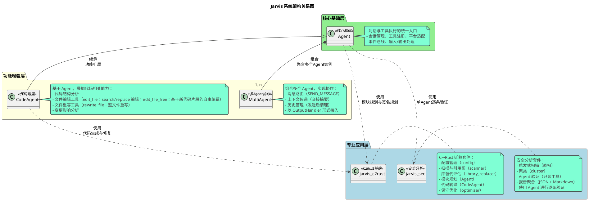

### 系统关系说明

#### 1. 核心基础层：Agent（通用Agent）

**定位**：Jarvis 的核心执行实体，提供对话、工具执行、会话管理等基础能力。

**核心能力**：

- 对话与工具执行的统一入口
- 会话管理（SessionManager）、工具注册（ToolRegistry）、平台适配（PlatformRegistry）
- 事件总线（EventBus）、输入/输出处理链
- 支持非交互模式等场景

**扩展点**：

- 通过 OutputHandler 协议扩展输出处理能力（如 MultiAgent 的消息路由）
- 通过 ToolRegistry 扩展工具能力
- 通过事件总线实现旁路扩展

#### 2. 功能增强层

##### 2.1 CodeAgent（代码Agent）

**关系**：继承自 Agent，在通用 Agent 基础上叠加代码相关能力。

**增强能力**：

- 代码结构分析（文件/函数/类层次结构）
- 文件编辑工具（edit_file / edit_file_free）
- 文件重写工具（rewrite_file：整文件重写）
- 变更影响分析（依赖关系、调用链分析）
- 自动迭代修复（基于构建错误）

**应用场景**：

- 被 jarvis-c2rust 用于代码生成与修复（代码生成实现方法）
- 独立使用：`jarvis-code-agent`（jca）命令行工具

##### 2.2 MultiAgent（多Agent系统）

**关系**：组合多个 Agent 实例，通过消息通信机制实现多 Agent 协作。

**协作机制**：

- 以 OutputHandler 形式接入每个 Agent 的输出处理链
- 通过消息发送指令实现消息路由
- 支持上下文传递（交接摘要）、历史管理（发送后清理）
- 提供 YAML 配置与 CLI 入口，支持交互与非交互模式

**应用场景**：

- 复杂任务分工协作（如安全演进流水线）
- 多角色协作（如代码审查、安全评估）

#### 3. 专业应用层

##### 3.1 jarvis-sec（jsec：安全分析套件）

**关系**：基于 Agent 实现安全分析能力。

**使用方式**：

- **启发式扫描**：纯 Python 本地扫描，不依赖 Agent
- **Agent 验证**：使用 Agent 进行逐条验证（只读工具：代码读取工具/脚本执行工具）
- **报告聚合**：将 Agent 验证结果聚合为 JSON + Markdown 报告

**工作流程**：

```
直扫（direct_scan）→ 聚类（Cluster Agent）→ 分析（Analysis Agent）→ 
验证（Verification Agent）→ 复核（Review Agent）→ 报告聚合
```

##### 3.2 jarvis-c2rust（jc2r：C→Rust 迁移套件）

**关系**：同时使用 Agent 和 CodeAgent，实现完整的 C→Rust 迁移流水线。

**使用方式**：

- **Agent 用于规划**：
  - 模块规划（模块规划模块）：使用 Agent 生成 crate 模块结构（JSON）
  - 签名规划（签名规划方法）：使用 Agent 选择目标模块与 Rust 函数签名
  - 代码审查（代码审查方法）：使用 Agent 审查逻辑一致性
- **CodeAgent 用于生成与修复（分离使用）**：
  - 代码生成 Agent：在单个函数生命周期内复用同一个 CodeAgent 实例，用于代码生成任务（代码生成实现方法）
  - 修复 Agent：每次修复时重新创建 CodeAgent 实例，不复用，用于修复构建错误和测试失败（构建循环方法）
  - 修复 Agent 上下文增强：修复 Agent 的上下文中自动包含原 C 实现代码，帮助 Agent 更好地理解原始实现意图，提高修复准确性
  - 强制使用记忆功能：代码生成Agent启用强制保存记忆参数，要求在完成函数实现后使用记忆保存工具记录关键信息
  - 依赖检查与实现：在实现或修复函数时，要求检查当前函数及其所有依赖函数是否已实现，对于未实现的依赖函数需一并补齐等价的Rust实现
  - 测试失败信息反馈：测试失败时获取完整的测试失败信息并通过专门的标签传递给修复Agent
  - 测试代码删除检测：基于事件订阅机制（工具调用前事件和工具调用后事件），在每次工具调用后立即检测测试代码是否被错误删除，若检测到问题则立即回退，确保测试代码不会被意外删除（工具调用前回调方法、工具调用后回调方法，优化器模块中同样实现）

**工作流程**：

```
扫描（scanner）→ 库替代（library_replacer）→ 模块规划（Agent）→ 
转译（CodeAgent + Agent）→ 优化（optimizer + CodeAgent）
```

**特点**：

- 渐进式迁移（支持断点续跑）
- 保守与可回退（构建检测与 git_guard）
- 模块化设计（各阶段可独立使用）

### 系统依赖关系总结

1. **继承关系**：CodeAgent 继承自 Agent，扩展代码相关能力
2. **组合关系**：MultiAgent 组合多个 Agent 实例，实现协作
3. **使用关系**：
   - jarvis-sec 使用 Agent 进行安全分析
   - jarvis-c2rust 使用 Agent 进行规划，使用 CodeAgent 进行代码生成与修复
4. **工具共享**：所有系统共享工具注册表，使用统一的工具接口（代码读取工具、文件编辑工具/文件重写工具、脚本执行工具等）

### 设计原则

- **分层清晰**：核心基础 → 功能增强 → 专业应用的清晰分层
- **高内聚低耦合**：各系统通过标准接口（Agent/CodeAgent API）交互，保持模块边界清晰
- **可扩展性**：通过继承（CodeAgent）和组合（MultiAgent）实现能力扩展
- **可复用性**：专业应用系统复用通用 Agent 和 CodeAgent 的能力，避免重复实现

接下来依此对每个模块进行详细说明。

### Agent 系统架构设计

本文档围绕 Jarvis 的核心执行实体 Agent，基于源码与现有文档进行结构化设计说明，覆盖模块组成、职责与接口、与外部系统/环境的交互、模块间交互流程、参数说明与典型执行过程。目标读者为本项目开发者与高级用户。

- 相关核心组件：EventBus、MemoryManager、TaskAnalyzer、FileMethodologyManager、PromptManager、SessionManager、ToolRegistry、AgentRunLoop、PlatformRegistry/BasePlatform、工具执行器 execute_tool_call、输入处理器链 builtin_input_handler/shell_input_handler/file_context_handler、文件编辑工具 edit_file/rewrite_file 等

#### 1. 设计目标与总体思路

- 轻协调、强委托：Agent 保持轻量化，侧重编排，将核心逻辑委托至独立组件（运行循环、工具注册表、平台适配层等）。
- 高解耦、可插拔：通过 Registry（ToolRegistry/PlatformRegistry）与事件总线（EventBus）实现能力可插拔与旁路扩展。
- 稳健运行：针对模型空响应、上下文超长、工具输出过大、异常回调等场景提供防御性处理。
- 易扩展与可观测：关键节点统一事件广播，支持 after_tool_call 回调动态注入；启动时输出资源统计，便于观测。
- 多场景友好：支持非交互模式、文件上传/本地两种方法论与历史处理模式、工具筛选降噪等。

#### 2. 模块组成

下图展示 Agent 内部与其周边模块的静态组成与依赖关系，聚焦 Agent 直接协作的组件。

```plantuml
@startuml
!theme vibrant
title Agent 结构组成图

package "Agent Core" #LightGreen {
  component "Agent" as Agent
  component "AgentRunLoop" as AgentRunLoop
  component "SessionManager" as SessionManager
  component "PromptManager" as PromptManager
  component "EventBus" as EventBus
  component "events" as Events
}

package "Managers" #LightYellow {
  component "MemoryManager" as MemoryManager
  component "TaskAnalyzer" as TaskAnalyzer
  component "FileMethodologyManager" as FileMethodologyManager
  component "AgentManager" as AgentManager
  component "TaskManager" as TaskManager
}

package "Tool Execution" #Wheat {
  component "execute_tool_call" as ExecTool
  component "ToolRegistry" as ToolRegistry
}

package "Input Handlers" #AliceBlue {
  component "builtin_input_handler" as builtin_input_handler
  component "shell_input_handler" as shell_input_handler
  component "file_context_handler" as file_context_handler
  component "UserInteractionHandler" as UserInteractionHandler
}

package "Output Handlers" #Thistle {
  component "OutputHandlerProtocol" as OutputHandlerProtocol
  component "WebOutputSink" as WebOutputSink
}

package "Web Support" #Lavender {
  component "WebServer" as WebServer
  component "WebBridge" as WebBridge
  component "StdioRedirect" as StdioRedirect
}

package "Share Management" #PeachPuff {
  component "ShareManager" as ShareManager
  component "MethodologyShareManager" as MethodologyShareManager
  component "ToolShareManager" as ToolShareManager
}

package "Utilities" #LightCyan {
  component "prompts" as Prompts
  component "prompt_builder" as PromptBuilder
  component "protocols" as Protocols
  component "utils" as Utils
  component "config_editor" as ConfigEditor
  component "language_support_info" as LanguageSupport
}

package "Platform Layer" #LightGray {
  component "PlatformRegistry" as PlatformRegistry
  component "BasePlatform" as BasePlatform
}

package "Entry Points" #MistyRose {
  component "jarvis" as JarvisEntry
  component "main" as MainEntry
}

Agent --> AgentRunLoop : 委派主循环
Agent --> SessionManager : 会话状态
Agent --> PromptManager : 构建系统/附加提示
Agent --> EventBus : 广播事件
EventBus --> Events : 事件定义

Agent --> MemoryManager
Agent --> TaskAnalyzer
Agent --> FileMethodologyManager
AgentManager --> Agent : 创建与管理
AgentManager --> TaskManager : 任务选择

AgentRunLoop --> ExecTool : 解析与执行工具
ExecTool --> ToolRegistry : 分发具体工具
Agent --> ToolRegistry : 默认输出处理器

Agent --> builtin_input_handler
Agent --> shell_input_handler
Agent --> file_context_handler
Agent --> UserInteractionHandler : 交互封装

WebServer --> WebBridge : WebSocket桥接
WebServer --> WebOutputSink : 输出广播
WebServer --> StdioRedirect : 标准流重定向

ShareManager <|-- MethodologyShareManager
ShareManager <|-- ToolShareManager

PromptManager --> PromptBuilder : 提示构建
PromptManager --> Prompts : 提示模板

Agent --> PlatformRegistry : 创建平台实例
PlatformRegistry --> BasePlatform : 实例化平台/模型

JarvisEntry --> AgentManager : 主入口
MainEntry --> Agent : 代理入口
@enduml
```

#### 3. 模块功能说明

##### 3.1 模块分类与职责

通用Agent模块按功能划分为以下类别：

**3.1.1 核心模块（Agent Core）**

- **Agent**（协调中枢）
  - 图型：组件图（与 EventBus/Prompt/Session/Managers/Handlers 的关系）+ 精简时序图（初始化→委派→完成）
  - 聚焦：委派与事件广播边界；非交互/多 Agent/自动完成策略；工具筛选触发条件与系统提示重设时机
  - 源码位置：Agent模块
- **AgentRunLoop**（主循环）
  - 图型：活动图（循环判定、自动摘要阈值、工具调用与中断分支）
  - 聚焦：进入/跳出循环条件；基于token数量的自动摘要触发；need_return 的短路返回；工具提醒轮次机制
  - 源码位置：AgentRunLoop模块
- **SessionManager**（会话管理）
  - 图型：状态图（Active↔Persisted(file)；Clear 重置）或活动图（save/restore/clear）
  - 聚焦：清理历史后"保留系统提示约束"；保存/恢复文件命名与作用域；user_data 存储
  - 源码位置：SessionManager模块
- **PromptManager**（提示管理）
  - 图型：数据流/组件图（system_prompt=系统规则+工具提示；addon_prompt=工具规范+记忆引导+完成标记+主动总结标记说明）
  - 聚焦：拼装来源与回退策略（无 PromptManager 时的兼容）
  - 源码位置：PromptManager模块
- **EventBus**（事件总线）
  - 图型：时序图（emit→多订阅者回调→异常隔离）
  - 聚焦：关键事件节点与"旁路增强不影响主流程"的承诺；同步广播机制
  - 源码位置：EventBus模块
- **events**（事件定义）
  - 职责：定义所有事件常量（TASK_STARTED、BEFORE_SUMMARY、AFTER_TOOL_CALL 等）
  - 源码位置：事件定义模块

**3.1.2 管理器模块（Managers）**

- **MemoryManager**（记忆管理）
  - 图型：活动图（TASK_STARTED/BEFORE_HISTORY_CLEAR/TASK_COMPLETED→是否 force_save_memory→prompt_memory_save）
  - 聚焦：强制保存门控；标签提示注入位置；工具存在性检查；事件驱动的自动保存
  - 源码位置：MemoryManager模块
- **TaskAnalyzer**（任务分析）
  - 图型：活动图（BEFORE_SUMMARY/TASK_COMPLETED→满意度收集→分析循环→方法论沉淀）
  - 聚焦：旁路分析与去重机制；满意度反馈收集；方法论生成
  - 源码位置：TaskAnalyzer模块
- **FileMethodologyManager**（文件与方法论管理）
  - 图型：决策活动图（upload 模式 vs 本地模式；历史转移流程）
  - 聚焦：提示写回 session 的语义；上传失败回退到本地策略
  - 源码位置：FileMethodologyManager模块
- **AgentManager**（Agent 生命周期管理）
  - 图型：工厂模式活动图（初始化→恢复会话→任务执行）
  - 聚焦：Agent 构造与配置注入；会话恢复；预定义任务加载；非交互模式下的任务处理
  - 源码位置：AgentManager模块
- **TaskManager**（任务管理）
  - 职责：加载和选择预定义任务（从 `.jarvis/pre-command` 或数据目录的 `pre-command` 文件）
  - 聚焦：任务加载、选择界面、补充信息收集
  - 源码位置：TaskManager模块

**3.1.3 工具执行模块（Tool Execution）**

- **execute_tool_call**（工具执行统一入口）
  - 图型：时序图（选择处理器→可选确认→处理器执行→标准返回）
  - 聚焦：返回协议（need_return/tool_prompt）；多处理器冲突拒绝策略；执行前确认机制
  - 源码位置：工具执行器模块
- **ToolRegistry**（工具注册表）
  - 图型：时序图（Agent→ToolRegistry→具体工具→返回）
  - 聚焦：单响应一次调用约束；格式容错；长输出分流策略
  - 说明：ToolRegistry 位于 `jarvis_tools` 模块，作为 Agent 的默认输出处理器

**3.1.4 输入处理模块（Input Handlers）**

- **builtin_input_handler**（内置输入处理器）
  - 职责：处理内置命令（如提示命令、清除命令等）
  - 源码位置：内置输入处理器模块
- **shell_input_handler**（Shell 输入处理器）
  - 职责：处理 Shell 命令（以 `!` 开头）
  - 源码位置：Shell输入处理器模块
- **file_context_handler**（文件上下文处理器）
  - 职责：处理文件引用（如 `@file.txt`），自动加载文件内容到上下文
  - 源码位置：文件上下文处理器模块
- **UserInteractionHandler**（用户交互封装）
  - 图型：管线式活动图（按序处理，遇 need_return 提前返回；多行输入签名兼容）
  - 聚焦：提前返回对主循环的影响；交互层可替换性（CLI→TUI/WebUI）；多行输入与确认回调封装
  - 源码位置：UserInteractionHandler模块

**3.1.5 输出处理模块（Output Handlers）**

- **OutputHandlerProtocol**（输出处理器协议）
  - 职责：定义输出处理器的接口协议
  - 源码位置：OutputHandlerProtocol模块
- **WebOutputSink**（Web 输出接收器）
  - 职责：将输出事件广播到 Web 前端
  - 源码位置：WebOutputSink模块

**3.1.6 Web 支持模块（Web Support）**

- **WebServer**（Web 服务器）
  - 职责：基于 FastAPI 提供 Web 服务，支持 WebSocket 通信和终端交互
  - 聚焦：WebSocket 路由（`/ws`、`/stdio`）、HTML 页面、标准流重定向集成
  - 源码位置：WebServer模块
- **WebBridge**（WebSocket 桥接）
  - 职责：提供线程安全的 WebSocket 交互桥，处理多行输入和确认请求
  - 聚焦：阻塞式输入/确认请求、事件约定、客户端管理
  - 源码位置：WebBridge模块
- **StdioRedirect**（标准流重定向）
  - 职责：将标准输出/错误重定向到 WebSocket 通道
  - 聚焦：工具直接打印输出的捕获与转发
  - 源码位置：StdioRedirect模块

**3.1.7 分享管理模块（Share Management）**

- **ShareManager**（分享管理器基类）
  - 职责：提供工具和方法论分享的通用逻辑（Git 仓库管理、资源选择等）
  - 源码位置：ShareManager模块
- **MethodologyShareManager**（方法论分享管理器）
  - 职责：管理方法论的分享流程
  - 源码位置：MethodologyShareManager模块
- **ToolShareManager**（工具分享管理器）
  - 职责：管理工具的分享流程
  - 源码位置：ToolShareManager模块

**3.1.8 辅助模块（Utilities）**

- **prompts**（提示词定义）
  - 职责：定义默认提示词模板（DEFAULT_SUMMARY_PROMPT、SUMMARY_REQUEST_PROMPT 等）
  - 源码位置：提示词定义模块
- **prompt_builder**（提示词构建器）
  - 职责：构建工具使用提示（action_prompt）
  - 源码位置：提示词构建器模块
- **protocols**（协议定义）
  - 职责：定义接口协议（OutputHandlerProtocol 等）
  - 源码位置：协议定义模块
- **utils**（工具函数）
  - 职责：提供通用工具函数（如提示拼接函数）
  - 源码位置：工具函数模块
- **config_editor**（配置编辑器）
  - 职责：提供配置文件编辑功能
  - 源码位置：ConfigEditor模块
- **language_support_info**（语言支持信息）
  - 职责：提供编程语言支持信息（文件扩展名映射、语言特性等）
  - 源码位置：语言支持信息模块
- **language_extractors**（语言提取器）
  - 职责：提供不同编程语言的代码提取功能（目录结构）
  - 源码位置：`src/jarvis/jarvis_agent/language_extractors/`

**3.1.9 平台层（Platform Layer）**

- **PlatformRegistry**（平台注册表）
  - 图型：组件+流程（目录扫描→校验→注册→创建/普通平台获取/廉价平台获取/智能平台获取）
  - 聚焦：用户目录与内置目录合并策略；必需方法校验；多平台场景化选择
  - 说明：PlatformRegistry 位于 `jarvis_platform` 模块
  - 多平台支持：
    - 获取普通平台方法：获取普通平台，用于一般任务
    - 获取廉价平台方法：获取廉价平台，用于简单任务（查询重写、关键词提取、相关性评估等）
    - 获取智能平台方法：获取智能平台，用于复杂任务（代码生成、代码转换等）
- **BasePlatform**（平台基类）
  - 说明：BasePlatform 位于 `jarvis_platform` 模块，提供统一的 LLM 平台接口

**3.1.10 入口模块（Entry Points）**

- **jarvis**（主入口）
  - 职责：主命令的入口点，提供完整的 CLI 接口和 Web 模式支持
  - 聚焦：命令行参数解析、配置管理、AgentManager 初始化、Web 服务启动
  - 源码位置：主入口模块
- **main**（代理入口）
  - 职责：`jarvis-agent` 命令的入口点，提供简化的 Agent 启动接口
  - 聚焦：Agent 定义文件加载、Agent 实例化、任务执行
  - 源码位置：代理入口模块

##### 3.2 模块职责要点

**核心模块（Agent Core）**

- **Agent**（核心协调者）
  - 初始化并组装组件（EventBus/Managers/Handlers/Platform/Session），初始化顺序：EventBus → Managers → PromptManager → 系统提示设置
  - 设置系统提示，首轮按需进行工具筛选与文件/方法论处理
  - 将主运行循环委派给 AgentRunLoop
  - 在关键节点广播事件（TASK_STARTED、BEFORE/AFTER_MODEL_CALL、BEFORE/AFTER_HISTORY_CLEAR、BEFORE/AFTER_ADDON_PROMPT、BEFORE/AFTER_SUMMARY、BEFORE_TOOL_FILTER、TOOL_FILTERED、AFTER_TOOL_CALL、INTERRUPT_TRIGGERED）
  - 动态加载 after_tool_call 回调：扫描 JARVIS_AFTER_TOOL_CALL_CB_DIRS，支持三种导出形式（直接回调、get_*工厂、register_* 工厂）
- **AgentRunLoop**（主循环执行体）
  - 驱动"模型思考 → 工具执行 → 结果拼接/中断处理 → 下一轮"的迭代
  - 统一处理工具返回协议与异常兜底，支持自动完成
  - 工具提醒机制：每工具提醒轮次间隔轮（默认20）注入工具使用提示
  - 自动摘要token控制：当对话累计token超过输入窗口的80%时触发摘要与历史清理，重置对话长度计数
- **SessionManager**（会话状态）
  - 管理 prompt、附加提示、会话长度计数、用户数据；负责保存/恢复/清理历史
- **PromptManager**（提示管理）
  - 构建系统提示（系统规则 + 工具使用提示），构建默认附加提示（工具规范 + 记忆提示）
- **EventBus**（事件总线）
  - 提供 subscribe/emit/unsubscribe；同步回调异常隔离，不影响主流程

**管理器模块（Managers）**

- **AgentManager**（Agent 工厂与生命周期管理）
  - 负责 Agent 的构造、配置注入、会话恢复
  - 处理预定义任务加载（非交互模式跳过）
  - 支持任务内容直接传入（命令行参数）或交互式输入
- **TaskManager**（任务管理）
  - 从 `.jarvis/pre-command` 或数据目录的 `pre-command` 文件加载预定义任务
  - 提供任务选择界面（支持 fzf 和手动输入）
  - 支持为任务添加补充信息
- **MemoryManager**（记忆管理）
  - 记忆标签提示注入；关键事件驱动下进行记忆整理/保存；与 save/retrieve/clear_memory 工具协作
- **TaskAnalyzer**（任务分析）
  - 任务完成阶段旁路分析与满意度收集；必要时沉淀方法论
- **FileMethodologyManager**（文件与方法论）
  - 基于平台能力选择"文件上传模式"或"本地模式"；加载/上传方法论；上下文溢出时以文件方式转移历史

**工具执行模块（Tool Execution）**

- **execute_tool_call**（工具执行统一入口）
  - 解析模型响应中的工具调用，仅允许单次调用；执行前确认、执行后回调、长输出处理（上传或智能截断）等
  - 多处理器冲突检测：当多个输出处理器同时可处理响应时，返回错误提示，要求模型明确选择
  - 执行确认机制：通过工具执行确认参数控制是否在执行前进行用户确认
- **ToolRegistry**（工具注册表，默认输出处理器）
  - 发现/加载/执行工具（内置、外部 .py、MCP）；解析 TOOL_CALL，执行并返回标准化结果
  - 文件编辑/重写能力（通过 edit_file 和 rewrite_file 工具提供）

**输入处理模块（Input Handlers）**

- **输入处理器链**（builtin_input_handler/shell_input_handler/file_context_handler）
  - 按序处理用户输入，遇 need_return 提前返回
  - 内置输入处理器：处理内置命令（如提示命令、清除命令等）
  - shell_input_handler：处理 Shell 命令（以 `!` 开头）
  - file_context_handler：处理文件引用（如 `@file.txt`），自动加载文件内容到上下文
- **UserInteractionHandler**（用户交互封装）
  - 封装多行输入与确认回调，便于未来替换为 TUI/WebUI
  - 多行输入兼容性：优先使用带空行打印参数的签名，失败时回退为单参数签名
  - 确认回调委派：保持与原有用户确认方法一致的行为

**输出处理模块（Output Handlers）**

- **OutputHandlerProtocol**（输出处理器协议）
  - 定义输出处理器的标准接口，支持扩展自定义输出处理逻辑
- **WebOutputSink**（Web 输出接收器）
  - 在 Web 模式下将输出事件广播到前端

**Web 支持模块（Web Support）**

- **WebServer**（Web 服务器）
  - 基于 FastAPI 提供 Web 服务，支持 WebSocket 通信（`/ws`、`/stdio`）和终端交互
  - 集成标准流重定向，捕获工具直接打印的输出
- **WebBridge**（WebSocket 桥接）
  - 提供线程安全的 WebSocket 交互桥，处理多行输入和确认请求的阻塞式等待
- **StdioRedirect**（标准流重定向）
  - 将标准输出/错误重定向到 WebSocket 通道，实现工具输出的实时转发

**分享管理模块（Share Management）**

- **ShareManager**（分享管理器基类）
  - 提供工具和方法论分享的通用逻辑（Git 仓库管理、资源选择、提交推送等）
- **MethodologyShareManager/ToolShareManager**（具体分享管理器）
  - 分别管理方法论和工具的分享流程，继承自 ShareManager

**平台层（Platform Layer）**

- **PlatformRegistry/BasePlatform**（平台/模型）
  - 屏蔽不同 LLM 服务商差异；Agent 通过统一接口 chat_until_success/set_system_prompt/upload_files 等进行交互

**入口模块（Entry Points）**

- **jarvis**（主入口）
  - 主命令的入口点，提供完整的 CLI 接口（配置管理、数据备份/恢复、Web 模式等）
- **main**（代理入口）
  - `jarvis-agent` 命令的入口点，提供简化的 Agent 启动接口，支持 Agent 定义文件加载

##### 3.3 读者使用建议

- 先读"模块职责要点"，再看"对应图"，如需实现细节再去源码。文档图用于建立"概念模型"，不替代源码阅读。
- 按模块分类阅读：核心模块 → 管理器模块 → 工具执行模块 → 输入/输出处理模块 → Web 支持模块 → 其他辅助模块
- 重点关注模块间的依赖关系：Agent 作为协调中枢，通过 EventBus 实现解耦，通过 Registry 实现可插拔能力

##### 3.4 Agent 设计

- 内部实现结构（PlantUML）

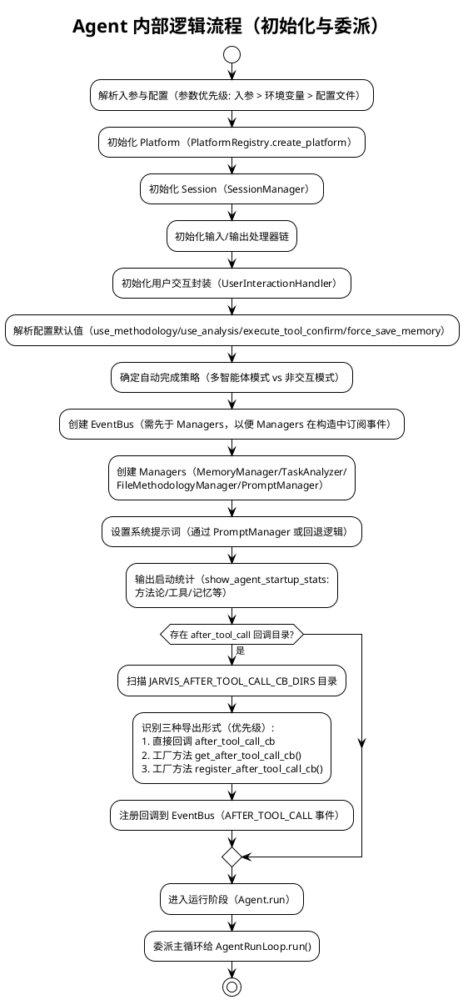

- 职责与定位：
  - 轻量协调者：初始化组件、构建系统/附加提示、委派主循环、广播事件
  - 通过 Registry 与事件总线实现可插拔能力与旁路扩展
- 核心方法：
  - **init**: 解析参数与配置；初始化 Platform/Session/Handlers/Managers/Prompt；设置系统提示；统计资源；加载 after_tool_call 回调
  - run/_main_loop: 进入主循环，委派 AgentRunLoop
  - _call_model/_invoke_model: 输入处理、附加提示拼接、上下文计数与模型调用（含 BEFORE/AFTER_MODEL_CALL 事件）
  - _call_tools: 工具执行委派至 execute_tool_call
  - _complete_task: 处理总结与任务完成事件，触发记忆/分析旁路
  - _filter_tools_if_needed: 工具超过阈值时使用临时模型筛选并重设系统提示
  - _summarize_and_clear_history: 上下文过长的摘要/文件上传分流与历史清理
- 关键参数影响行为：auto_complete、need_summary、use_methodology、use_analysis、execute_tool_confirm、force_save_memory、non_interactive、in_multi_agent、use_tools/files 等
- 小型结构图：

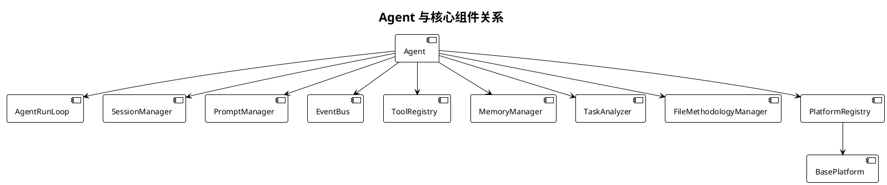

- 历史清理与摘要分流（Agent）

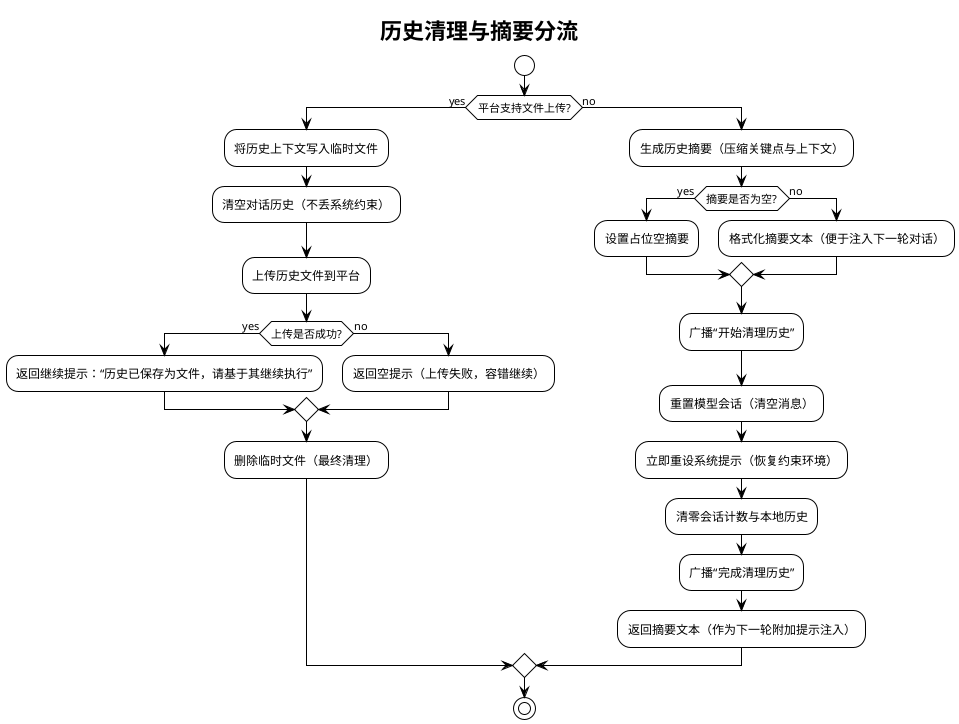

图示说明

- 分流依据：根据平台是否支持文件上传选择路径；支持时将历史写为文件上传；不支持则生成摘要
- 关键约束：清理历史后必须重设系统提示，避免丢失行为规范与工具约束
- 失败回退：上传失败返回空提示；摘要为空则使用占位文本；流程不中断

- 工具筛选流程（Agent._filter_tools_if_needed）

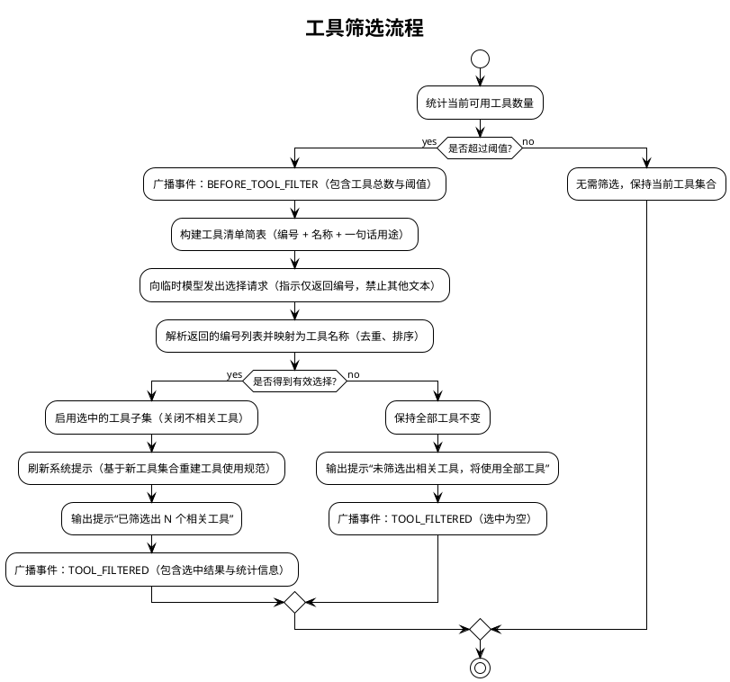

图示说明

- 触发条件：仅当可用工具数量超过阈值时进行筛选；否则保持原集合
- 选择方式：向临时模型请求“只返回编号”，再映射为工具名；启用子集后需刷新系统提示以降低决策复杂度
- 容错路径：未选出任何工具时维持原集合并继续任务

##### 3.5 AgentRunLoop 设计

- 职责：承载主运行循环；控制迭代、工具执行、拼接提示、处理中断与完成
- 核心流程：
  - 首轮初始化（由 Agent._first_run 触发）后循环执行：
    1) 轮次计数递增（conversation_rounds，用于工具提醒）
    2) 工具提醒机制：每工具提醒轮次间隔轮（默认20）注入工具使用提示
    3) 自动摘要检查：当对话累计token超过输入窗口的80%时触发摘要与历史清理，重置对话长度计数
    4) 更新输入处理器标志（run_input_handlers_next_turn）
    5) 首次运行处理（Agent._first_run：工具筛选、文件/方法论处理）
    6) _call_model → 获取响应（含输入处理器链处理）
    7) 检查响应中的 <!!!SUMMARY!!!> 标记：如果检测到该标记，触发摘要与历史清理，移除标记后继续处理响应
    8) _handle_run_interrupt → 处理用户中断（INTERRUPT_TRIGGERED）
    8) execute_tool_call → 执行工具（若识别到 TOOL_CALL）
    9) join_prompts → 拼接工具结果到 session.prompt
    10) 自动完成检测（!!!COMPLETE!!!）→ _complete_task
    11) 获取下一步用户动作（continue/complete）→ 继续或完成
- 事件：在工具与模型调用关键节点广播 BEFORE/AFTER_TOOL_CALL
- 返回协议：当工具返回 need_return=True，立即返回当前上下文；否则继续循环
- 关键参数：
  - `conversation_rounds`：当前对话轮次计数（用于工具提醒）
  - `tool_reminder_rounds`：工具提醒轮次间隔（环境变量 JARVIS_TOOL_REMINDER_ROUNDS，默认20）
  - `summary_token_threshold`：自动摘要触发阈值（输入窗口的80%，基于token数量）
- 主动总结机制：
  - 模型可以在响应中输出 `<!!!SUMMARY!!!>` 标记来主动触发总结
  - 系统检测到标记后：移除标记、触发 `_summarize_and_clear_history()`、重置计数器、将摘要注入下一轮的附加提示
  - 适用于部分任务已完成、之前的上下文价值不大的场景，允许模型主动清理历史以开始新的任务阶段

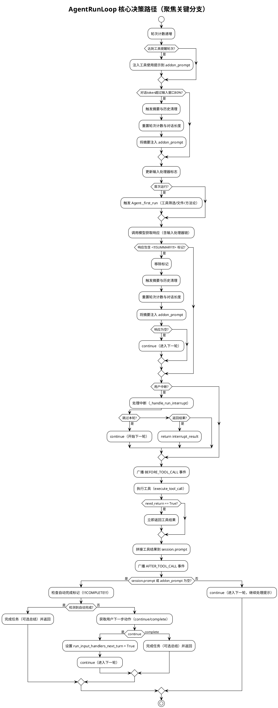

##### 3.6 SessionManager 设计

读者要点

- 会话语义：清理历史仅重置对话与计数，但保留并立即重新应用系统提示，确保约束持续生效
- 保存/恢复作用域：基于平台名与模型名生成唯一文件名（格式：`saved_session_{agent_name}_{platform_name}_{model_name}.json`），避免跨平台/模型污染；恢复后自动删除文件
- 使用场景：长对话需释放上下文时的重置；跨运行的会话持久化与恢复
- 风险与约束：清理后必须重新设置系统提示；恢复失败或文件缺失时应平稳回退，不影响主流程
- 数据存储：当前提示字段（当前提示）、附加提示字段（附加提示）、会话长度计数字段（会话长度计数）、用户自定义数据字段（用户自定义数据字典）

- 内部逻辑结构（PlantUML）

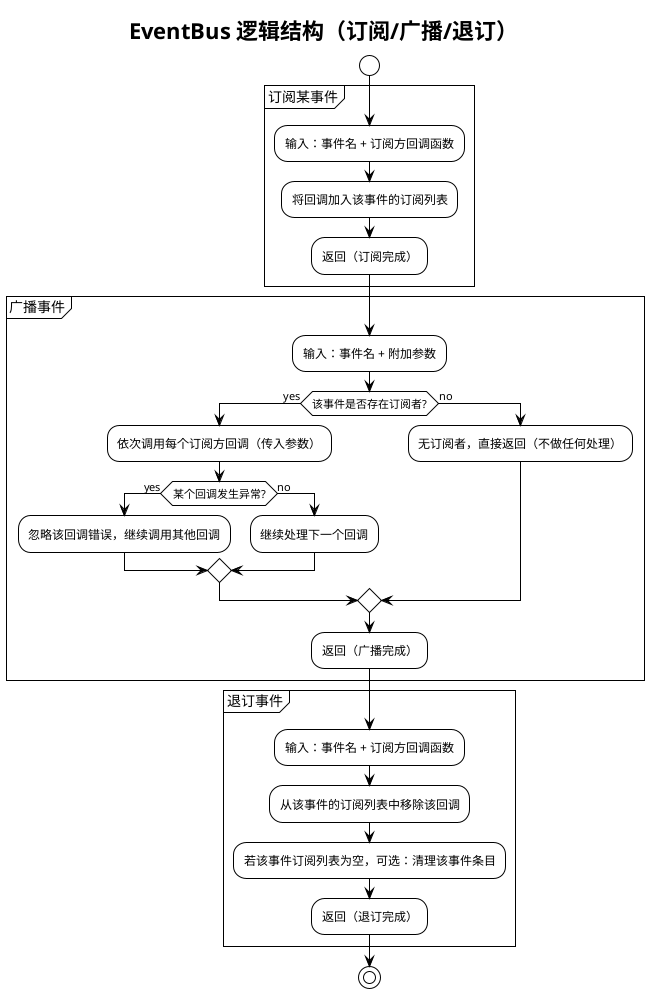

图示说明

- 目的：以“事件名”为索引，支持外部模块在关键节点进行旁路扩展（统计、记忆、分析等），不干扰主流程
- 异常处理：广播过程中单个订阅回调失败被忽略并继续执行其他订阅者，保证主流程稳定
- 边界：EventBus 不做业务判断与流程控制，仅负责调用订阅者；是否保存记忆/执行分析由订阅者自行决定
- 使用建议：为每类关键节点定义清晰事件名（如 BEFORE_MODEL_CALL、AFTER_TOOL_CALL 等），订阅者内部做好容错与幂等

- API：subscribe(callback)、emit(event, **kwargs)、unsubscribe(callback)
- 特性：同步广播、回调异常隔离，便于旁路扩展（记忆保存、任务分析、统计）

- 事件总线全局事件流（总览图）
下图以通俗步骤展示“任务启动 → 模型/工具 → 历史清理 → 总结 → 完成”的全链路广播与响应，弱化内部术语，便于整体理解。

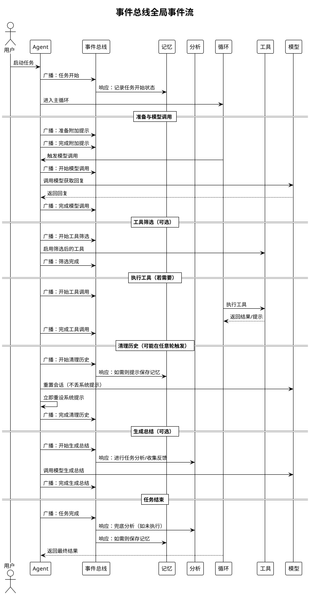

图示说明

- 图使用“广播/响应/调用/返回”等通俗术语；不展示内部函数名与具体实现
- “可选”表示仅在特定条件触发（如工具筛选、生成总结）
- 实际事件名在代码中对应 TASK_STARTED、BEFORE/AFTER_MODEL_CALL、BEFORE/AFTER_TOOL_CALL、BEFORE/AFTER_HISTORY_CLEAR、BEFORE/AFTER_SUMMARY 等；图强调流程含义，避免细节干扰

##### 3.7 execute_tool_call 设计

- 职责：统一解析模型响应中的工具调用，选择并执行合适的输出处理器，返回标准协议
- 核心流程：
  1) 遍历 Agent 的输出处理器列表，筛选可处理响应的处理器（can_handle）
  2) 多处理器冲突检测：若多个处理器同时可处理，返回错误提示，要求模型明确选择
  3) 无处理器匹配：返回空结果，继续循环
  4) 执行前确认：若工具执行确认参数为 True，进行用户确认；用户拒绝则返回空结果
  5) 执行处理器：调用处理器处理方法
  6) 返回标准协议：`(need_return: bool, tool_prompt: Any)`
- 返回协议：
  - `need_return=True`：工具要求立即结束本轮，直接返回结果给用户（如 MultiAgent 的 SEND_MESSAGE）
  - `need_return=False`：工具结果将拼接回上下文，继续下一轮循环
  - 工具提示字段：工具执行结果文本或返回对象
- 异常处理：工具执行异常被捕获并返回错误信息，不影响主循环稳定

##### 3.8 ToolRegistry 设计

- 角色：默认输出处理器，解析并执行 TOOL_CALL
- 加载来源：内置工具、外部 .py 工具、MCP 工具（外部进程）
- 执行协议：
  - 单步约束：一次响应仅允许一个调用块，检测到多个则拒绝执行
  - 结束标签容错：缺失结束标签时尝试自动补全并提示规范
  - 大输出处理：平台支持时上传文件并清理历史；否则智能截断（前后各 30 行）
  - 统计与记录：执行计数与最近执行工具记录（**last_executed_tool**/**executed_tools**）
- 微结构图：

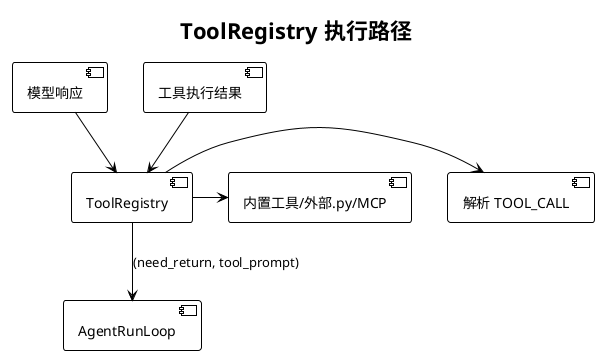

- 关键交互时序（PlantUML）

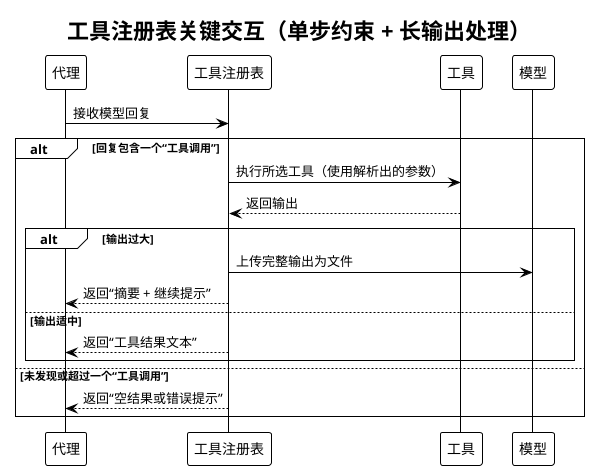

图示说明

- 单步约束：每次回复仅允许一个工具调用；多个调用直接拒绝并提示规范
- 长输出处理：优先按平台能力上传文件并提供简短摘要；不支持上传时进行智能截断（保留头/尾片段）
- 返回约定：统一返回“是否需立即结束本轮 + 文本提示”，主循环据此决定直接返回或继续迭代

##### 3.9 文件编辑工具（edit_file / edit_file_free / rewrite_file）设计

读者要点

- 用途：通过工具调用进行最小必要变更（edit_file / edit_file_free）或整文件替换（rewrite_file）
- 编辑模式：
  - edit_file：基于 search/replace 的普通文本编辑（使用精确字符串匹配）
    - **重要**：search 必须提供足够的上下文来唯一定位目标位置，避免匹配到错误的位置
    - **多处匹配智能确认**：当 search 文本存在多处匹配时，自动生成预览并要求 Agent 确认是否继续
    - **移除 count 参数**：不再支持通过 count 参数控制替换次数，改为通过多处匹配检测和确认机制
  - edit_file_free：仅提供新代码片段，由工具自动进行模糊匹配和插入/替换
- 安全约束：
  - 编辑工具：支持原子写入和失败回滚
  - rewrite_file 采用原子写并可回滚
- 选择策略：优先使用 edit_file 或 edit_file_free，仅在大范围重构或整文件生成时使用 rewrite_file
- 结果呈现：返回成功与差异摘要；失败时明确说明原因（包括详细的错误提示和修复建议）

关键决策路径（活动图）

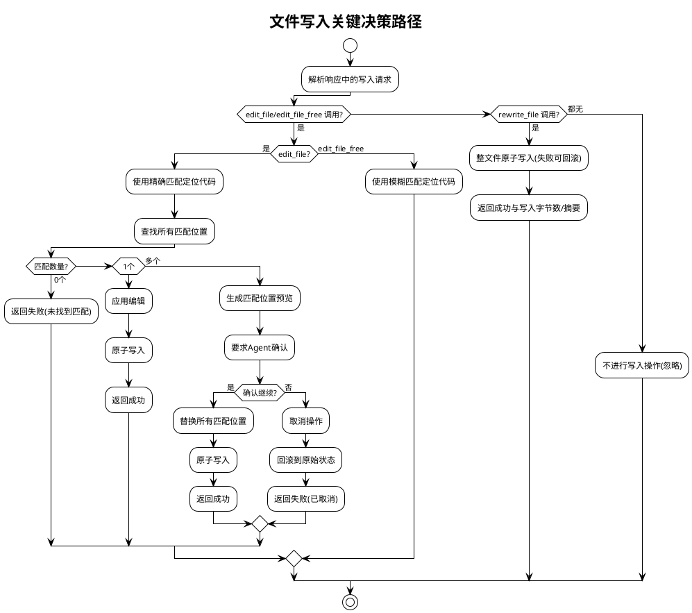

##### 3.10 UserInteractionHandler 设计

- 职责：封装用户交互接口（多行输入与确认），便于未来替换为 TUI/WebUI
- 设计目标：抽象用户交互层，保持向后兼容，支持不同 UI 实现
- 核心方法：
  - 多行输入方法（提示字符串，空行打印标志）返回字符串：多行输入封装
    - 优先使用带空行打印参数的签名
    - 失败时回退为单参数签名（多行输入器方法）
  - 确认方法（提示字符串，默认值）返回布尔值：确认回调委派
    - 直接调用传入的确认回调，保持行为一致
- 初始化时机：在 Agent 初始化输入/输出处理器后创建，将 Agent 的确认回调指向封装后的方法

##### 3.11 MemoryManager 设计

- 内部逻辑结构（PlantUML）

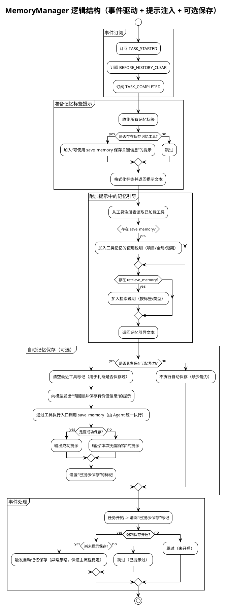

图示说明

- 事件驱动：在任务开始、历史清理前、任务完成后按需触发“提示或执行记忆保存”，不阻塞主流程
- 提示注入：将记忆标签与工具使用说明拼入每轮附加提示，促进模型主动使用记忆工具
- 能力门控：仅在存在 save_memory/retrieve_memory 工具时提供对应指引与自动保存；否则安全跳过
- 强制保存：force_save_memory 开启且尚未提示时，在 BEFORE_HISTORY_CLEAR 或 TASK_COMPLETED 触发一次自动保存
- 容错：自动保存调用异常被忽略，不影响任务输出与流程推进；状态标记避免重复提示

- 记忆类型与存储策略
- 短期记忆（short_term）
  - 存储位置：进程内存（jarvis_utils.globals.add_short_term_memory / get_short_term_memories）
  - 生命周期：仅在当前任务/进程内有效，不落盘；适合临时上下文、当前步骤的中间信息
  - 检索方式：retrieve_memory memory_types=["short_term"]，可按标签过滤
- 项目长期记忆（project_long_term）
  - 存储位置：当前项目目录 .jarvis/memory 下，JSON 文件按条目存储
  - 适用内容：项目相关的约定、配置、实现细节、架构决策等
  - 作用域：当前仓库/目录；随项目版本控制与协作共享更方便
- 全局长期记忆（global_long_term）
  - 存储位置：数据目录 get_data_dir()/memory/global_long_term 下，JSON 文件按条目存储
  - 适用内容：通用方法论、常用命令、用户偏好、跨项目知识与最佳实践
  - 作用域：同一用户在本机的所有项目/任务通用

数据模型（统一结构）

- 字段：id、type（memory_type）、tags、content、created_at、updated_at（可选）、merged_from（整理后可选）
- 命名与ID：save_memory 按微秒级时间戳生成唯一 ID（例如 20251101_072947_388226）

- 记忆整理（MemoryOrganizer）
- 目标：合并标签高度重叠的长期记忆，消除冗余、提升可检索性
- 适用类型：project_long_term、global_long_term（不处理 short_term）
- 合并策略：
  - 基于标签重叠度（min_overlap ≥ 2），按重叠数量从高到低分组
  - 调用 LLM 将同组记忆合并为一个综合记忆（最近时间权重更高）
  - 生成 JSON 格式的 <merged_memory>，包含 content 与 tags；解析后写为新记忆，并删除原始条目
- 使用方法（CLI）：
  - 整理（模拟运行）：jarvis-memory-organizer organize --type project_long_term --dry-run
  - 整理（指定重叠数）：jarvis-memory-organizer organize --type global_long_term --min-overlap 3
  - 导出：jarvis-memory-organizer export output.json -t project_long_term -t global_long_term --tag API
  - 导入：jarvis-memory-organizer import memories.json --overwrite
- 平台选择：统一使用 normal 平台与模型（PlatformRegistry.get_global_platform_registry），支持通过 -g/--llm-group 覆盖模型组
- 数据安全与回滚：
  - 新记忆创建后再删除旧记忆文件，失败日志汇总输出
  - 导出/导入支持类型校验、标签过滤、覆盖策略；异常明确告警且不中断其他记录

- 典型使用场景
- 在任务完成前自动提示保存本次关键经验（force_save_memory 开启）
- 在复杂项目中将架构决策与约定沉淀为 project_long_term，跨项目方法论沉淀为 global_long_term
- 在对话中临时缓存当前轮上下文与关键结论为 short_term，便于下一步工具调用
- 定期使用 MemoryOrganizer 合并重复/冗余的长期记忆，保持知识库整洁与高质

##### 3.12 TaskAnalyzer 设计

读者要点

- 触发时机：生成总结前（BEFORE_SUMMARY）优先触发；若无总结需求，则在 TASK_COMPLETED 兜底触发
- 目标产出：基于任务过程沉淀方法论/改进建议，并收集"是否满意"的反馈
- 对主流程影响：旁路执行；回调异常或失败不影响任务完成；完成后设置去重标记避免重复分析
- 核心方法：
  - 任务分析方法（满意度反馈字符串）：执行任务分析循环
    - 构建分析提示（任务分析提示模板 + 满意度反馈）
    - 循环处理模型调用与工具执行（支持工具调用以完成分析任务）
    - 处理用户中断（采集补充信息后继续或退出）
  - 收集满意度反馈方法（自动完成标志）返回字符串：收集用户满意度
    - 仅在非自动完成且启用分析时收集
    - 询问用户是否满意，不满意时收集详细反馈
- 去重机制：通过分析完成标记和任务分析完成用户数据避免重复分析

关键交互（PlantUML）

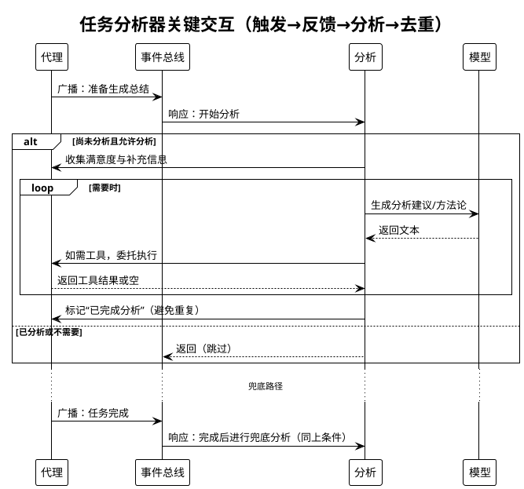

图示说明

- 触发：生成总结前优先；无总结需求时在任务完成阶段兜底触发一次
- 产出：方法论与改进建议；同时收集满意度反馈
- 去重：设置“已完成分析”标记，避免重复分析
- 容错：分析过程中模型或工具出错忽略返回，不影响任务完成

输出与约束

- 输出：方法论/改进建议（写入会话上下文，由上层继续整合），满意度反馈记录
- 约束：仅在 use_analysis 启用时执行；触发一次后设置去重标记
- 容错：模型/工具异常不影响主流程；中断时优先采集用户补充信息再继续分析

##### 3.13 FileMethodologyManager 设计

- 模式选择：
  - 文件上传模式：平台支持 upload_files 时，方法论与历史以文件上传
  - 本地模式：不支持上传时，加载本地方法论库并管理上下文
- 历史处理：handle_history_with_file_upload 在上下文溢出时转移历史并返回继续提示

- 内部逻辑流程（PlantUML）

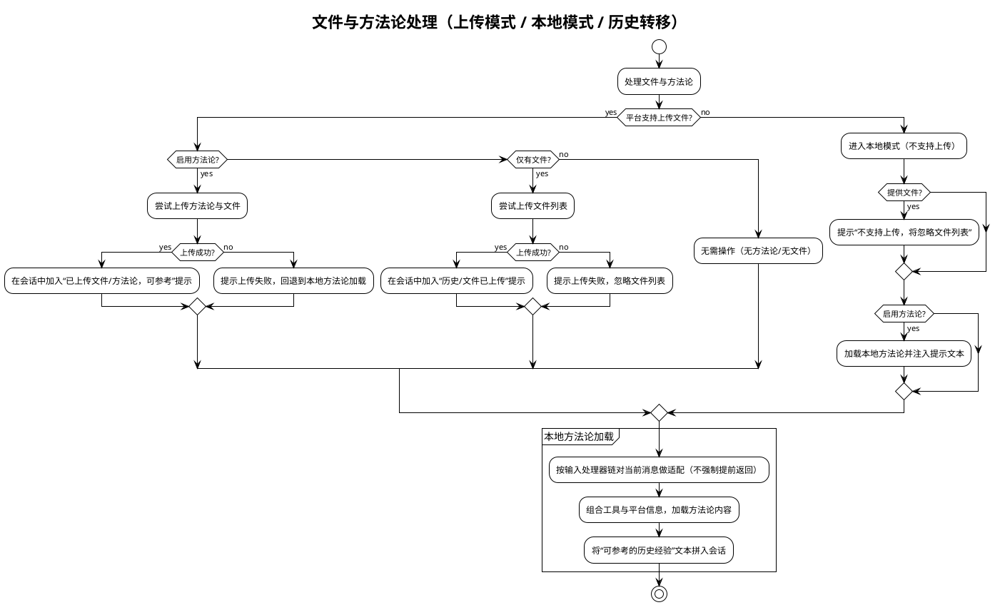

图示说明

- 模式选择：优先“上传模式”（平台支持时），否则“本地模式”加载方法论与经验
- 提示注入：成功上传或成功加载后，将“可参考经验/已上传文件”文本拼入会话，便于引用
- 失败回退：上传失败不阻断流程；方法论加载失败时回退为常规对话
- 输入处理器：本地方法论加载前对当前消息做轻量适配（如从文件/终端输入抽取上下文），不强制提前返回
- 无操作路径：既不启用方法论也无文件时，本轮不处理，保持最小影响

- 历史转移（上下文过长）流程

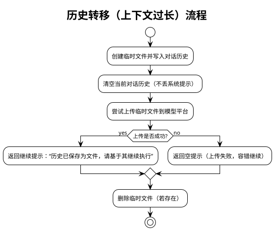

##### 3.14 PlatformRegistry / BasePlatform 设计

- PlatformRegistry：动态创建平台实例，选择“普通平台/模型”，兼容不同厂商
- BasePlatform：统一接口（chat_until_success、set_system_prompt、upload_files、reset、set_model_name/group、name/platform_name）
- 行为：Agent 通过该层以统一方式与不同 LLM 平台交互，并按平台能力决定是否支持文件上传等增强特性

读者要点

- 边界与职责：统一发现与注册平台实现；向上提供“创建平台实例/获取普通平台”的简化接口
- 能力归一：通过 BasePlatform 接口屏蔽不同厂商差异（聊天/系统提示/文件上传等）
- 生命周期：启动时加载用户目录与内置目录的实现；运行时按名称创建实例或返回“普通平台”
- 失败回退：未找到平台或创建失败时进行明确告警并返回 None，不阻断上层流程

可视化（组件 + 关键流程）

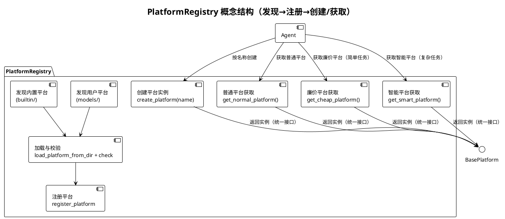

**PlatformRegistry 多平台支持说明**：

- **get_normal_platform()**：获取普通平台，用于一般任务场景
- **get_cheap_platform()**：获取廉价平台，用于对模型能力要求一般的任务（如查询重写、关键词提取、相关性评估、网页读取等）
- **get_smart_platform()**：获取智能平台，用于复杂任务场景（如代码生成、代码转换等）

平台选择策略：

- 系统根据任务场景自动选择合适的平台
- 如果未配置对应的平台（JARVIS_CHEAP_PLATFORM/JARVIS_SMART_PLATFORM），则回退到 JARVIS_PLATFORM 的值
- 支持在模型组（JARVIS_LLM_GROUPS）中为每个组单独配置 cheap/smart 平台和模型

##### 3.15 输入处理器链与用户交互封装

- 内部逻辑流程（PlantUML）

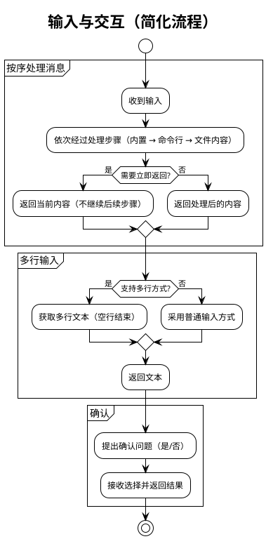

- 输入处理器：builtin_input_handler、shell_input_handler、file_context_handler（按序处理，返回 need_return 标志控制是否提前返回）
- UserInteractionHandler：
  - 多行输入：兼容函数签名 func(tip, print_on_empty) 与 func(tip)
  - 确认交互：封装 confirm 回调，便于替换为 TUI/GUI/WebUI

- 用户交互封装（UserInteractionHandler）内部逻辑结构

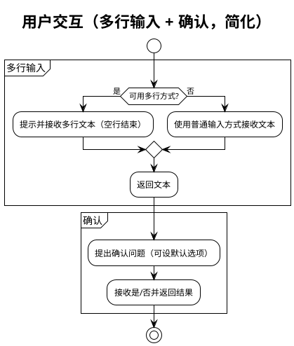

- 目标：抽象用户交互（多行输入与确认），便于未来替换为 TUI/WebUI
- 兼容策略：优先使用带 print_on_empty 的多参签名，失败时回退为单参签名；confirm 委派保持一致行为

##### 3.16 事件与回调扩展

- 事件常量：TASK_STARTED/COMPLETED、BEFORE/AFTER_MODEL_CALL、BEFORE/AFTER_HISTORY_CLEAR、BEFORE/AFTER_SUMMARY、BEFORE_TOOL_FILTER/TOOL_FILTERED、AFTER_TOOL_CALL、INTERRUPT_TRIGGERED、BEFORE/AFTER_ADDON_PROMPT
- 动态回调：扫描 JARVIS_AFTER_TOOL_CALL_CB_DIRS；支持 after_tool_call_cb、get_after_tool_call_cb()、register_after_tool_call_cb() 三种导出形式；回调包装隔离异常

#### 4. 与外部系统/环境的交互

- LLM 平台与模型
  - 通过 PlatformRegistry 动态创建 BasePlatform 实例，统一设置模型名称/组；Agent 使用 chat_until_success/set_system_prompt 调用
  - 支持文件上传：当模型支持 upload_files，历史与大输出以文件上传方式释放/节省上下文
- 工具生态
  - ToolRegistry 加载内置工具、外部 .py 工具与 MCP 工具；MCP 工具通过外部进程提供能力，支持跨应用集成
- 文件与方法论仓库
  - 加载本地方法论库；可与中心方法论库通过 Git 同步，实现团队共享最佳实践
- 记忆系统
  - 三层记忆：短期（内存）、项目长期（.jarvis/memory）、全局长期（~/.jarvis/data/memory/global_long_term）
  - 通过 save_memory/retrieve_memory/clear_memory 工具使用
- CLI 与环境变量/配置
  - 通过 CLI 运行任务；支持 JARVIS_NON_INTERACTIVE 等环境变量控制非交互模式
  - 通过 jarvis_utils.config 获取默认配置（如计划开关、筛选阈值、after_tool_call 回调扫描目录等）
- 动态回调注入
  - 读取 JARVIS_AFTER_TOOL_CALL_CB_DIRS 指定目录下的 Python 文件，动态注册 after_tool_call 回调（三种导出方式优先级约定），用于旁路增强工具调用后处理
- 可观测性
  - show_agent_startup_stats 启动统计：输出方法论数量、工具可用数/总数、全局/项目记忆数量、工作目录等

#### 5. 模块间交互流程（PlantUML）

下图展示一次典型端到端执行过程的时序，涵盖初始化、首轮处理、模型调用、工具执行与收尾。

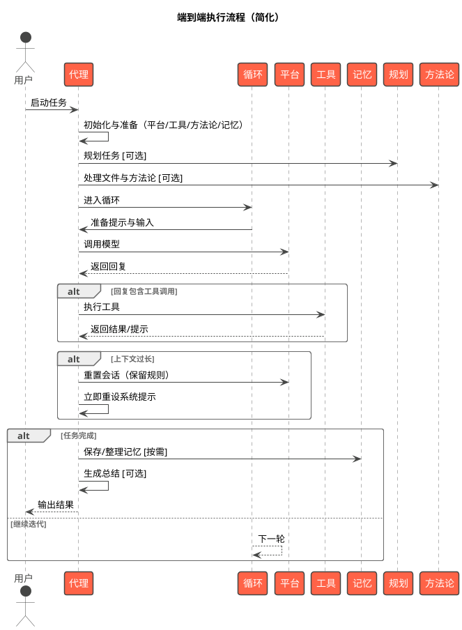

#### 6. 参数与配置说明

以下参数来自 Agent.**init**。默认值或行为参考 jarvis_utils.config 与内部回退逻辑。除特别标注外，布尔型参数可通过入参覆盖配置默认值。

- system_prompt: 系统提示词，定义 Agent 行为准则（必要）
- name: Agent 名称，默认 "Jarvis"，用于全局登记与交互提示
- description: Agent 描述信息
- model_group: 模型组标识，用于按组选择平台与模型（get_normal_platform_name/get_normal_model_name/get_cheap_platform_name/get_smart_platform_name）
- summary_prompt: 任务总结提示词；为空时回退 DEFAULT_SUMMARY_PROMPT 或 SUMMARY_REQUEST_PROMPT
- auto_complete: 自动完成开关；非交互模式默认开启；多智能体模式下仅在显式 True 时开启
- output_handler: 输出处理器列表；默认 [ToolRegistry]（包含 edit_file/rewrite_file 等工具）
- use_tools: 指定允许使用的工具名白名单；为空时加载默认集合；当工具过多时 Agent 首轮可触发 AI 筛选并动态缩减
- execute_tool_confirm: 执行工具前是否进行用户确认（可由配置 is_execute_tool_confirm 决定）
- need_summary: 是否在完成阶段生成总结
- multiline_inputer: 多行输入函数；由 UserInteractionHandler 进行向后兼容封装
- use_methodology: 是否启用方法论引导；默认从配置读取（is_use_methodology）
- use_analysis: 是否启用任务完成后的分析（TaskAnalyzer）；默认从配置读取（is_use_analysis）
- force_save_memory: 是否在关键节点强制提示/执行记忆保存；默认从配置读取（is_force_save_memory）
- files: 需要处理或上传的文件列表（触发 FileMethodologyManager 处理）
- confirm_callback: 确认回调，签名 (tip: str, default: bool) -> bool；默认 CLI user_confirm
- non_interactive: 非交互模式（最高优先级）；若显式提供会同步到环境变量 JARVIS_NON_INTERACTIVE
- in_multi_agent: 多智能体运行标志；用于控制自动完成（子 Agent 默认非交互自动完成）
- agent_type: "normal" 或 "code"；"code" 时构造 CodeAgent（转发构造参数）

行为与默认策略补充

- 非交互与自动完成：
  - 非交互模式（或子 Agent）默认自动完成为 true；多智能体模式时除非显式 True 否则不自动完成
- 工具筛选：
  - 可用工具数超过阈值（get_tool_filter_threshold）时，使用临时模型产生选择编号，更新 ToolRegistry.use_tools，并重置系统提示
- 多平台场景化选择：
  - 系统根据任务场景自动选择合适的LLM平台：
    - **cheap平台**：用于对模型能力要求一般的任务（查询重写、关键词提取、相关性评估、网页读取等）
    - **normal平台**：用于一般任务场景（默认）
    - **smart平台**：用于复杂任务场景（代码生成、代码转换等）
  - 配置项：JARVIS_CHEAP_PLATFORM、JARVIS_CHEAP_MODEL、JARVIS_SMART_PLATFORM、JARVIS_SMART_MODEL
  - 如果未配置对应的平台/模型，则回退到 JARVIS_PLATFORM/JARVIS_MODEL 的值
  - 支持在模型组（JARVIS_LLM_GROUPS）中为每个组单独配置
- 主动总结标记：
  - 模型可以在响应中输出 `<!!!SUMMARY!!!>` 标记来主动触发总结并清空历史
  - 适用于部分任务已完成、之前的上下文价值不大的场景
  - 系统检测到标记后会：移除标记、触发总结、清空历史、重置计数器、将摘要注入下一轮的附加提示
- 大输出处理：
  - 平台支持上传：生成摘要并清理历史后，上传大输出文件，返回“摘要 + 调用上下文”提示继续
  - 平台不支持：智能截断前 30/后 30 行，中间以占位提示
- 历史与上下文：
  - conversation_length 由 get_context_token_count 计数；超过阈值时走摘要或文件上传流程（FileMethodologyManager 处理）
- 动态回调：
  - 扫描 JARVIS_AFTER_TOOL_CALL_CB_DIRS，支持 after_tool_call_cb、get_after_tool_call_cb()、register_after_tool_call_cb() 三种导出形式；注入 AFTER_TOOL_CALL 回调

#### 7. 典型执行过程（端到端）

以“分析代码并修改某个函数”为例（伪场景）：

1. CLI 将用户需求交给 Agent.run
2. Agent 初始化与启动统计：加载 Platform 与 ToolRegistry；设置系统提示；输出方法论/工具/记忆统计信息
3. 首轮处理：
   - FileMethodologyManager：若平台支持上传，尝试上传 files 与方法论；否则本地加载
   - MemoryManager：准备记忆标签提示并注入上下文
   - 工具筛选（可选）：当工具过多时用临时模型筛选相关工具子集，更新系统提示
4. 进入 AgentRunLoop：
   - 生成 addon prompt（包含工具使用规则、记忆提示、是否需要 !!!COMPLETE!!! 标记、主动总结标记 <!!!SUMMARY!!!> 说明）
   - 调用 BasePlatform.chat_until_success 获取响应
   - 检查响应中的 <!!!SUMMARY!!!> 标记：如果检测到，触发总结并清空历史，移除标记后继续处理
   - 若响应包含 TOOL_CALL，交由 ToolRegistry 解析并执行对应工具（如 read_code 或 edit_file）
   - 工具输出拼接回上下文（utils.join_prompts），广播 AFTER_TOOL_CALL；need_return=True 时直接返回结果
   - 若用户中断（INTERRUPT_TRIGGERED），采集补充输入，决定是否继续或跳过当前轮
   - 检查自动完成：检测到 !!!COMPLETE!!! 或 ot('!!!COMPLETE!!!') 标记进入收尾
5. 收尾：
   - 通过事件驱动执行 TaskAnalyzer 分析、MemoryManager 记忆保存（受 force_save_memory 控制）
   - need_summary=True 时生成总结
   - 返回最终结果至 CLI

```plantuml
@startuml
!theme vibrant
title 典型执行过程（代码分析与修改，简化）

actor 用户 as User
participant "界面" as UI
participant "代理" as Agent
participant "循环" as Loop
participant "平台" as Platform
participant "工具" as Tools
participant "文件修改器" as Writer
participant "记忆" as Mem
participant "事件总线" as Bus

User -> UI : 描述需求
UI -> Agent : 发送任务
Agent -> Bus : 广播：任务开始
Agent -> Agent : 首轮准备（工具筛选/文件与方法论/记忆标签）[可选]
Agent -> Loop : 进入主循环

Loop -> Agent : 生成提示并准备输入
Agent -> Platform : 调用模型
Platform --> Agent : 返回回复（可能包含工具调用）

alt 需要工具
  Agent -> Tools : 执行工具
  Tools --> Agent : 返回结果/提示
end

alt 需要修改文件
  Agent -> Writer : 应用变更
  Writer --> Agent : 返回修改结果
end

Agent -> Bus : 广播：步骤完成

alt 检测到完成
  Agent -> Agent : 生成总结 [可选]
  Agent -> Mem : 保存/整理记忆 [按需]
  Agent -> Bus : 广播：任务完成
  Agent --> UI : 输出结果
else 继续迭代
  Loop --> Loop : 下一轮
end
@enduml
```

该过程对长输出、上下文长度与外部失败具备防御性回退策略，保证流程可持续推进。

#### 8. 可靠性与容错设计

- 模型空响应回退为空串并告警，避免 None/空字符串导致逻辑断流
- 摘要与完成阶段同样进行空响应防御
- 事件回调异常隔离，避免影响主流程
- 工具调用格式容错：ToolRegistry 对缺失结束标签的 TOOL_CALL 尝试自动补全并提示规范
- 长输出安全处理：优先文件上传，其次智能截断，抑制上下文溢出
- 历史清理后自动重置系统提示，保持约束环境持续生效

#### 9. 扩展与二次开发建议

- 工具扩展：在内置路径或 ~/.jarvis/tools 下新增 .py 工具；跨进程/应用集成优先采用 MCP 工具
- 平台扩展：在 jarvis_platform 下新增 BasePlatform 子类，通过 PlatformRegistry 自动发现
- 旁路增强：通过 JARVIS_AFTER_TOOL_CALL_CB_DIRS 注入 AFTER_TOOL_CALL 回调，实现统计/审计等旁路能力
- 方法论共享：建立中心方法论库（Git），团队同步沉淀最佳实践，提升协作效率
- 子 Agent：利用 _build_child_agent_params 继承父 Agent 能力，构建递归执行的子任务体系
- UI 替换：UserInteractionHandler 与 OutputHandlerProtocol 的抽象便于替换为 TUI/GUI/WebUI

### CodeAgent 系统架构设计

本章节描述 CodeAgent 作为 Agent 的子类，在继承 Agent 核心能力的基础上，为"代码工程"场景提供的增强能力与流程封装。内容基于源码进行结构化说明，覆盖模块组成、职责与接口、关键交互流程、CLI 入口与参数说明、可靠性与扩展建议。

- 关联组件与工具：Git 提交工作流工具、工具注册生态（由 Agent 承载）、事件系统（AFTER_TOOL_CALL）、StatsManager、lint 工具建议（lint.py）、配置系统（jarvis_utils.config）、输出交互（PrettyOutput）
- 源码位置：`src/jarvis/jarvis_code_agent/code_agent.py::CodeAgent`

#### 1. 设计目标与总体思路

- 继承 Agent：CodeAgent 直接继承 Agent 类，通过父类初始化方法初始化父类，获得 Agent 的所有核心能力（模型交互、工具调用、会话管理等）。
- 场景聚焦：围绕"代码分析与修改"的端到端流程，提供仓库管理、补丁预览、提交确认与统计、静态检查引导等增值能力。
- 功能扩展：在 Agent 基础上扩展代码相关能力（上下文管理、影响分析、构建验证等），通过重写和扩展方法实现。
- 稳健与可观测：强调 git 配置/仓库状态检查、换行符策略、错误回退；对代码行增删与提交进行统计记录；大变更摘要化预览，避免上下文膨胀。

#### 2. 模块组成（PlantUML）

下图展示 CodeAgent 与其协作组件的静态组成与依赖关系，Agent 作为运行与工具执行的统一入口，不展开内部细节。

```plantuml
@startuml
!theme vibrant
title CodeAgent 结构组成图（继承 Agent）

package "CodeAgent Layer" #LightGreen {
  component "CodeAgent" as CodeAgent
  component "CLI (typer)" as CLI
}

package "Agent Layer" #LightGray {
  component "Agent" as AgentNode
  component "EventBus" as EventBus
}

package "Agent Tools" #Wheat {
  component "read_code" as ToolReadCode
  component "edit_file" as ToolEditFile
  component "rewrite_file" as ToolRewriteFile
  component "execute_script" as ToolExecuteScript
  component "search_web" as ToolSearchWeb
  component "memory_tools(save/retrieve/clear)" as ToolMemory
}

package "Git & Repo Utils" #LightYellow {
  component "提交工作流工具" as GitCommitTool
  component "git_utils" as GitUtils
}

package "Config & IO" #Thistle {
  component "jarvis_utils.config" as Config
  component "PrettyOutput" as Output
}

package "Stats & Lint" #AliceBlue {
  component "StatsManager" as Stats
  component "LintToolsSelector" as Lint
}

package "Code Analyzer" #LightCyan {
  component "ContextManager" as CM
  component "ImpactAnalyzer" as IA
  component "ContextRecommender" as CR
  component "BuildValidator" as BV
  component "BuildValidationConfig" as BVC
}

AgentNode <|-- CodeAgent : 继承
CodeAgent --> EventBus : 订阅 AFTER_TOOL_CALL

CodeAgent --> ToolReadCode
CodeAgent --> ToolEditFile
CodeAgent --> ToolRewriteFile
CodeAgent --> ToolExecuteScript
CodeAgent --> ToolSearchWeb
CodeAgent --> ToolMemory

CodeAgent --> GitUtils : 仓库检测/差异/历史
CodeAgent --> GitCommitTool : 提交工作流封装
CodeAgent --> Config : 读取/覆盖配置项
CodeAgent --> Output : 提示与代码块输出
CodeAgent --> Stats : 行数与提交统计
CodeAgent --> Lint : 修改后静态检查建议
CodeAgent --> CM : 上下文管理（符号表/依赖图）
CodeAgent --> IA : 影响范围分析
CodeAgent --> CR : 智能上下文推荐（可选）
CodeAgent --> BV : 构建验证
CodeAgent --> BVC : 构建验证配置管理
CLI --> CodeAgent : 入口与参数传递
@enduml
```

关键点

- CodeAgent 直接继承 Agent，通过父类初始化方法初始化父类，获得 Agent 的所有核心能力（模型交互、工具调用、会话管理等）。
- CodeAgent 在 Agent 基础上扩展代码相关能力，通过重写和扩展方法实现。
- AFTER_TOOL_CALL 用于在工具执行后进行旁路增强（展示 diff、提交、统计、静态扫描引导、影响分析、构建验证）。
- Git 工具链与配置/输出/统计等均为 CodeAgent 的扩展能力。
- 代码分析器模块提供代码结构分析、依赖关系管理、影响范围分析和智能上下文推荐等能力。

#### 3. CodeAgent 核心功能与扩展能力

读者要点

- CodeAgent 继承 Agent 的所有核心能力：
  - 模型交互：通过模型属性访问 LLM 模型
  - 工具调用：通过工具调用方法调用工具
  - 会话管理：通过会话属性管理对话历史
  - 事件系统：通过事件总线属性订阅和发布事件
  - 运行入口：通过 `self.run(input)` 启动任务（继承自 Agent）

- CodeAgent 的扩展能力（在 Agent 基础上新增）：
  - 环境与仓库管理：发现仓库根、更新 .gitignore、处理未提交修改、统一换行符敏感策略（含 Windows 建议）。
  - 代码分析器模块：
    - 上下文管理：维护符号表和依赖图，提供代码上下文查询能力
    - 影响范围分析：分析编辑的影响范围，识别受影响文件、符号、测试等
    - 智能上下文推荐：使用 LLM 进行语义理解，推荐相关上下文信息
    - 构建验证：自动检测构建系统并执行构建验证
    - 静态分析：根据文件类型自动选择和执行 lint 工具
  - 提交工作流：自动/交互式 commit、提交历史展示与接受/重置。
  - 差异与预览：按文件输出 diff，针对删除/重命名/大变更进行适配与摘要化处理。
  - 大量代码删除防护：非交互模式下自动检测大量代码删除，询问大模型判断是否合理，防止误删重要代码。
  - 统计与提示：记录代码行增删、修改次数；根据文件类型生成 lint 建议与静态扫描引导。
  - CLI 入口：非交互约束、单实例锁（按仓库维度）、会话恢复、参数同步配置。

##### 3.1 CodeAgent 初始化流程

- 初始化步骤（按顺序）：
  1) 设置基础属性：
     - 设置根目录为当前工作目录
     - 保存工具组等配置参数
  2) 初始化上下文管理器（ContextManager）：
     - 创建 ContextManager 实例，传入项目根目录
     - 维护符号表（SymbolTable）和依赖图（DependencyGraph）
     - 提供代码上下文查询能力（查找定义、引用、依赖关系等）
  3) Git 配置检查（Git配置检查方法）：检查用户名和用户邮箱是否已设置
     - 严格模式（默认）：任一缺失则退出，提示配置命令
     - 警告模式（JARVIS_GIT_CHECK_MODE=warn）：仅提示警告，继续运行
  4) 构建工具白名单：
     - 基础工具：脚本执行工具、网络搜索工具、代码读取工具、记忆保存工具、记忆检索工具、记忆清除工具、子代码代理工具
     - 追加工具：通过追加工具参数（逗号分隔）追加，自动去重
  5) 读取规则文件（按优先级顺序加载）：
     - 全局规则：`{get_data_dir()}/rules`（若存在）
     - 配置的规则目录：通过 `get_rules_load_dirs()` 获取配置的规则加载目录（若存在）
     - 项目规则：`.jarvis/rules`（若存在）
     - **中心规则仓库**（优先级最高）：如果配置了 `JARVIS_CENTRAL_RULES_REPO`，从中心规则仓库加载规则
       - 支持本地目录路径或 Git 仓库 URL
       - 首次运行时自动克隆到 `{get_data_dir()}/central_rules_repo`
       - 每日自动更新（通过 `daily_check_git_updates` 机制）
       - 中心规则仓库中的规则优先级最高，会覆盖同名规则
     - 规则文件加载：从 rules 目录中按文件名加载规则文件，支持从多个目录加载同名规则（按优先级覆盖）
     - 按顺序拼接为单一 `<rules>` 区块，追加到系统提示
     - **规则分享功能**：支持通过 `RuleShareManager` 将本地规则分享到中心规则仓库
       - 只能分享默认数据目录（`{get_data_dir()}/rules`）中的规则
       - 不能分享配置的规则目录和项目规则目录中的规则
       - 分享时会将规则文件移动到中心仓库（而非复制），原文件会被删除
       - 自动检测并排除已存在于中心仓库的规则
  6) 调用父类 Agent 初始化（父类初始化方法）：
     - 注入系统提示（代码工程师工作准则 + 规则块）
     - 设置工具白名单（使用工具参数）
     - 默认禁用方法论引导（使用方法论参数为False，可通过关键字参数覆盖）
     - 默认禁用任务分析（使用分析参数为False，可通过关键字参数覆盖）
     - 关闭自动完成（自动完成参数为False）
     - 启用规划（规划参数，默认从配置读取）
     - 初始化模型、会话、处理器等 Agent 核心组件
  7) 建立 CodeAgent 自关联：
     - 设置代码代理属性为自身，便于工具通过属性获取方法获取 CodeAgent 实例
  8) 初始化上下文推荐器（上下文推荐器，可选）：
     - 若模型已初始化且可用（通过模型属性访问）：
       - 创建上下文推荐器实例，传入上下文管理器和 LLM 模型
       - 用于任务开始时的智能上下文推荐
     - 若初始化失败：仅记录警告，不影响主流程（跳过上下文推荐功能）
  9) 订阅工具调用后事件：通过事件总线订阅方法注册工具调用后回调

- 系统提示内容：
  - 代码工程师角色定位与核心原则
  - 工作流程（项目分析 → 需求分析 → 代码分析 → 方案设计 → 实施修改）
  - 工具使用规范（优先使用文件搜索、内容搜索、read_code）
  - 文件编辑工具使用规范（edit_file vs rewrite_file）
  - 子任务与子 CodeAgent 使用建议
  - 全局规则（数据目录 rules）与项目规则（.jarvis/rules）合并为 `<rules>` 区块

##### 3.2 环境与仓库初始化

- 初始化流程（环境初始化方法，在运行方法开始时调用）：
  1) 查找 Git 根目录（查找Git根目录方法）：调用查找Git根目录并切换目录方法，切换到仓库根并更新根目录属性
  2) 更新 .gitignore（更新Git忽略文件方法）：
     - 检查并确保配置目录被忽略
     - 追加常用语言忽略规则（按语言分组：通用、Python、Rust、Node、Go、Java、C/C++、.NET 等）
     - 仅追加缺失项，不覆盖现有规则；保留注释与空行
  3) 处理未提交修改（处理Git变更方法）：
     - 调用Git提交工具执行提交工作流（使用前缀/后缀参数）
     - 支持交互式确认与临时提交
  4) 配置换行符设置（配置行尾设置方法）：
     - 目标设置：自动换行转换关闭、安全换行检查关闭、空白字符处理为行尾回车
     - 仅在当前设置与目标不一致时修改
     - Windows 平台额外提示：建议创建最小化Git属性文件（交互式确认）

```plantuml
@startuml
!theme plain
title 环境与仓库初始化流程

start
:定位并切换至git根目录(find_git_root_and_cd);
:检查 .gitignore 是否存在;
if (.gitignore 存在?) then (是)
  :读取现有内容;
  :检查缺失的规则项;
else (否)
  :创建新文件;
endif
:追加常用语言忽略规则（按分组）;
:确保 .jarvis 被忽略;
:处理未提交修改（GitCommitTool 提交工作流）;
:获取当前 git 换行符配置;
if (当前设置 != 目标设置?) then (是)
  :更新 git 配置（core.autocrlf/core.safecrlf/core.whitespace）;
  if (Windows 平台?) then (是)
    :提示创建最小化 .gitattributes（交互式确认）;
  endif
endif
stop
@enduml
```

说明

- 保守策略：仅在必要时变更 git 配置；Windows 平台提供 .gitattributes 建议，以避免 CRLF/LF 差异导致的大 diff。
- .gitignore 更新：按语言分组追加规则，保留现有内容与格式；新建文件时仅包含缺失项。
- 未提交修改处理：使用 GitCommitTool 统一处理，支持交互式确认与临时提交；失败不阻断流程。

##### 3.3 工具执行后旁路增强（差异/提交/统计/静态检查/影响分析/构建验证）

- 回调入口：工具调用后回调方法（订阅工具调用后事件）
- 核心流程：
  1) 获取差异信息：
     - 调用获取差异方法获取完整差异文本
     - 调用获取差异文件列表方法获取修改文件列表
     - 调用获取最新提交哈希方法记录起始提交哈希
  2) 更新上下文管理器（更新修改文件上下文方法）：
     - 对每个修改的文件，更新符号表和依赖图
     - 调用上下文管理器更新文件上下文方法重新分析文件内容
     - 提取符号（函数、类、变量等）并更新符号表
     - 分析导入依赖并更新依赖图
  3) 影响范围分析（分析编辑影响方法，可选）：
     - 若启用影响分析（启用影响分析参数），解析Git差异为编辑操作列表
     - 使用影响分析器分析编辑的影响范围：
       - 识别受影响的符号（函数、类等）
       - 查找符号引用位置
       - 分析依赖链影响
       - 检测接口变更（函数签名、参数等）
       - 查找相关测试文件
     - 生成影响报告（ImpactReport），包含：
       - 受影响文件列表
       - 受影响符号列表
       - 相关测试文件
       - 接口变更详情
       - 风险等级评估（LOW/MEDIUM/HIGH）
       - 修复建议
     - 高风险编辑时，在 addon_prompt 中注入警告提示
  4) 构建按文件补丁预览（构建按文件补丁预览方法）：
     - 构建文件名状态映射（构建名称状态映射方法）：通过Git差异名称状态命令识别文件状态（新增/修改/删除/重命名/复制）
     - 为每个文件获取差异（获取文件差异方法）：使用Git临时暂存命令临时暂存未跟踪文件以展示差异
     - 特殊处理策略：
       - 删除文件（D）：不展示 diff，仅输出删除提示（附带删除行数若可用）
       - 重命名/复制（R/C）：使用新路径作为键，记录状态映射
       - 大变更（新增+删除 > 300 行）：仅输出统计行数，避免上下文过长
       - 其它文件：输出该文件的 diff 代码块（使用 `git diff --numstat` 获取行数统计）
       - 无法获取 diff：输出友好提示（"变更已记录（无可展示的文本差异）"）
  5) 提交工作流：
     - 显示完整差异（格式化输出打印方法，语言类型为差异）
     - 调用处理提交工作流方法执行提交（交互或自动）
  6) 统计记录（提交成功后）：
     - 代码行数变化：通过Git差异统计命令获取，调用记录代码变更统计方法记录到统计管理器
     - 修改次数：统计管理器增量方法（代码修改指标，分组为代码代理）
     - 提交计数：统计管理器增量方法（生成提交指标，分组为代码代理）（在显示提交历史方法中）
  7) 构建验证（处理构建验证方法，可选）：
     - 若启用构建验证（启用构建验证参数）：
       - 检查项目配置（构建验证配置）：是否已禁用构建验证
       - 若已禁用：使用回退构建验证器进行基础静态检查
       - 若未禁用：使用构建验证器进行完整构建验证
         - 自动检测构建系统（Rust/Cargo、Python构建配置、Node.js包管理、Java构建工具、Go、CMake、Makefile 等）
         - 执行构建命令（如Cargo构建、Python构建、npm构建等）
         - 捕获构建输出和错误信息
         - 返回构建结果（构建结果对象），包含成功/失败状态、耗时、构建系统类型等
       - 构建失败处理：
         - 首次失败：询问用户是否禁用构建验证（适用于特殊环境场景）
         - 已询问过：直接显示错误并注入修复提示到附加提示
       - 构建成功：显示构建系统类型和耗时
  8) 静态分析（处理静态分析方法，可选）：
     - 若启用静态分析（启用静态分析参数）且构建验证通过（或已禁用）：
       - 根据文件类型获取静态检查工具列表（获取静态检查工具方法）：
         - 支持多种语言：Python（ruff、mypy）、Rust（cargo clippy、rustfmt）、Go（go vet）、C/C++（clang-tidy）、JavaScript/TypeScript（eslint、tsc）、Java（pmd）等
         - 支持从数据目录的静态检查工具配置文件加载自定义配置
       - 生成静态检查命令（获取文件的静态检查命令方法）：
         - 按工具分组，项目级工具（如 cargo clippy）每个项目只执行一次
         - 文件级工具（如 ruff、eslint）每个文件都执行
         - 自动查找配置文件（如ESLint配置、Prettier配置等）
       - 执行静态检查（运行静态分析方法）：
         - 按工具分组批量执行
         - 30秒超时限制
         - 只记录有错误或警告的结果（返回码不为0）
       - 格式化结果（格式化静态检查结果方法）：
         - 输出工具名、文件路径、命令、错误信息
         - 限制输出长度（1000字符），避免过长
       - 发现问题时：注入修复提示到附加提示，要求模型修复所有问题
  9) 会话上下文更新：
     - 提交成功：将"补丁内容（按文件）"追加到代理会话提示字段
     - 影响分析报告：若生成了影响报告，追加到会话上下文
     - 构建验证结果：追加构建验证结果（成功/失败）
     - 静态分析结果：追加静态分析结果（通过/发现问题）
  10) 用户确认机制（提交被拒绝时）：
  - 输出预览与拒绝提示
  - 若应用补丁前确认方法返回 False 或用户确认，将补丁内容追加到会话上下文
  - 否则允许用户输入自定义回复作为附加提示

```plantuml
@startuml
!theme plain
title 工具执行后旁路增强（差异预览/提交/统计/静态检查/影响分析/构建验证）

participant "EventBus" as Bus
participant "CodeAgent" as CA
participant "ContextManager" as CM
participant "ImpactAnalyzer" as IA
participant "git_utils" as Git
participant "提交工作流工具" as GCT
participant "BuildValidator" as BV
participant "BuildValidationConfig" as BVC
participant "StatsManager" as Stats
participant "lint" as Lint

Bus -> CA: AFTER_TOOL_CALL

CA -> Git: 获取 diff/文件列表/最新哈希
CA -> CM: 更新上下文管理器（符号表/依赖图）
CA -> IA: 影响范围分析（可选，若启用）
IA --> CA: 影响报告（受影响文件/符号/测试/风险等级）

CA -> CA: 构建文件名状态映射（git diff --name-status）
CA -> CA: 为每个文件获取 diff（临时 git add -N 处理未跟踪文件）
CA -> CA: 构建按文件预览（删除提示/重命名适配/大变更摘要>300行）
CA -> CA: 显示完整 diff（PrettyOutput）
CA -> GCT: 提交工作流（交互或自动）
GCT --> CA: 返回是否已提交

alt 提交成功
  CA -> Git: 获取提交后统计（git diff HEAD~1 HEAD --shortstat）
  CA -> Stats: 记录行数变化（code_lines_inserted/code_lines_deleted）
  CA -> Stats: 记录修改次数（code_modifications）
  CA -> CA: 追加"补丁内容（按文件）"到 session.prompt
  
  alt 启用构建验证
    CA -> BVC: 检查构建验证配置
    alt 已禁用构建验证
      CA -> BV: 使用 FallbackBuildValidator 进行基础静态检查
    else 未禁用
      CA -> BV: 执行完整构建验证（自动检测构建系统）
      BV --> CA: 构建结果（成功/失败/耗时）
      alt 构建失败
        alt 首次失败
          CA -> CA: 询问用户是否禁用构建验证
        else 已询问过
          CA -> CA: 注入修复提示到 addon_prompt
        end
      end
    end
  end
  
  alt 启用静态分析且（构建验证通过或已禁用）
    CA -> Lint: 根据文件类型获取 lint 工具列表
    CA -> Lint: 生成 lint 命令（按工具分组）
    CA -> Lint: 执行静态检查（30秒超时）
    Lint --> CA: 检查结果（错误/警告）
    alt 发现问题
      CA -> CA: 注入修复提示到 addon_prompt
    end
  end
  
  alt 影响分析报告存在
    CA -> CA: 追加影响报告到 session.prompt
    alt 高风险编辑
      CA -> CA: 注入高风险警告到 addon_prompt
    end
  end
else 被拒绝或未提交
  CA -> CA: 输出预览并提示拒绝
  alt 用户确认或无需确认
    CA -> CA: 追加补丁内容到 session.prompt
  else 用户未确认
    CA -> CA: 允许用户输入自定义回复作为 addon_prompt
  end
end
@enduml
```

说明

- 上下文管理器更新：
  - 每次文件修改后，自动更新符号表和依赖图，保持代码上下文的最新状态
  - 支持多语言（Python、Rust、Go、C/C++、JavaScript/TypeScript 等）的符号提取和依赖分析
  - 符号表包含函数、类、方法、变量等，支持查找定义和引用
  - 依赖图维护文件间的导入依赖关系，支持查找依赖和被依赖文件
- 影响范围分析：
  - 自动解析 git diff 为编辑操作，识别受影响的符号和文件
  - 分析符号引用链和依赖链，找出所有可能受影响的代码位置
  - 检测接口变更（函数签名、参数变化等），评估风险等级
  - 自动查找相关测试文件，提供修复建议
  - 高风险编辑时自动注入警告提示，提醒模型注意影响范围
- 构建验证：
  - 自动检测构建系统（Rust/Cargo、Python、Node.js、Java、Go、CMake、Makefile 等）
  - 执行构建命令并捕获错误，提供详细的构建失败信息
  - 支持项目级配置（BuildValidationConfig），允许禁用构建验证（适用于特殊环境）
  - 构建失败时提供禁用选项，避免在特殊环境中反复失败
  - 已禁用构建验证时，使用 FallbackBuildValidator 进行基础静态检查
- 静态分析：
  - 根据文件类型自动选择 lint 工具（ruff、mypy、clippy、eslint 等）
  - 支持项目级工具（如 cargo clippy）和文件级工具（如 ruff）
  - 自动查找配置文件（.eslintrc、.prettierrc 等）
  - 按工具分组批量执行，30秒超时限制
  - 发现问题时自动注入修复提示，要求模型修复所有问题
- 差异预览策略：
  - 删除文件：不展示 diff，仅输出删除提示（附带删除行数若可用）
  - 大变更（新增+删除 > 300 行）：仅输出统计行数，避免上下文过长
  - 其它文件：输出该文件的 diff 代码块（使用临时 `git add -N` 处理未跟踪文件）
  - 无法获取 diff：输出友好提示
- 统计记录：
  - 插入/删除行数（基于 `git diff --shortstat`）：记录到 StatsManager（code_lines_inserted/code_lines_deleted）
  - 修改次数（code_modifications）
  - 提交计数（commits_generated/commits_accepted）
- 用户确认机制：
  - 提交被拒绝时，根据应用补丁前确认配置决定是否要求用户确认
  - 支持用户输入自定义回复作为附加提示，便于后续继续处理

##### 3.4 CLI 入口与运行约束

- CLI 入口：命令行接口函数（使用Typer框架装饰）
- 核心流程：
  1) 参数解析与预处理：
     - 解析 CLI 参数（模型组/工具组/需求/非交互/恢复会话/提交前后缀等）
     - 非交互模式设置：若启用，同步到环境变量 `JARVIS_NON_INTERACTIVE`
  2) 环境初始化：
     - 调用 `init_env` 初始化配置与欢迎信息
     - 同步 CLI 选项到全局配置（model_group/tool_group/restore_session/non_interactive）
  3) Git 仓库校验与初始化：
     - 检查是否为 git 仓库（`git rev-parse --git-dir`）
     - 若非仓库：交互式或非交互模式下提示初始化新仓库
  4) 仓库根目录定位与单实例锁：
     - 调用 `find_git_root_and_cd` 切换到仓库根
     - 按仓库维度加锁：基于 `repo_root` 的 md5 哈希生成锁文件名（`code_agent_{md5}.lock`）
     - 回退策略：加锁失败时回退到全局锁（`code_agent.lock`）
  5) CodeAgent 构造与初始化：
     - 创建 CodeAgent 实例（传入 model_group/tool_group/append_tools/non_interactive）
     - CodeAgent 内部执行：git 配置检查、工具白名单构建、规则加载、调用父类 Agent 初始化（super().**init**）、事件订阅
  6) 会话恢复（可选）：
     - 若 `restore_session=True`，调用 `agent.restore_session()`
     - 失败不影响继续运行
  7) 任务执行：
     - 若传入 `requirement`：直接调用 `agent.run(requirement, prefix, suffix)`
     - 否则：进入多行输入循环，持续处理用户输入

```plantuml
@startuml
!theme plain
title CLI 入口与运行约束（非交互/会话恢复/单实例锁）

start
:解析 CLI 参数（模型组/工具组/需求/非交互/恢复会话/提交前后缀等）;
if (非交互模式?) then (是)
  :同步到环境变量 JARVIS_NON_INTERACTIVE;
  :校验 requirement 参数（非交互模式必须提供）;
endif
:初始化环境（init_env）;
:同步 CLI 选项到全局配置;
:检查是否为 git 仓库;
if (非 git 仓库?) then (是)
  if (非交互模式或用户确认?) then (是)
    :初始化新 git 仓库;
  else (否)
    :退出;
  endif
endif
:切换到仓库根目录（find_git_root_and_cd）;
:按仓库维度加锁（基于 repo_root md5）;
:创建 CodeAgent 实例（继承 Agent，调用 super().__init__）;
if (restore_session?) then (是)
  :尝试恢复会话（失败不阻断）;
endif
if (传入 requirement?) then (是)
  :直接运行 CodeAgent.run(requirement);
else (否)
  :进入多行输入循环运行;
endif
stop
@enduml
```

约束与行为

- 非交互模式：必须通过 --requirement 传入任务；多行输入不可用；执行脚本超时受限（由平台环境约束）。
- 单实例锁：按仓库维度加锁（基于 repo_root 的 md5），避免跨仓库互斥；失败时回退到全局锁。
- 会话恢复：从存档文件恢复；失败不影响继续运行。
- Git 仓库要求：必须在 git 仓库中运行；非仓库时支持交互式或非交互自动初始化。

##### 3.5 代码分析器模块（code_analyzer）

CodeAgent 集成了代码分析器模块，提供代码结构分析、依赖关系管理、影响范围分析和智能上下文推荐等功能。

- 源码位置：`src/jarvis/jarvis_code_agent/code_analyzer/`
- 核心组件：
  - ContextManager：上下文管理器，维护符号表和依赖图
  - ImpactAnalyzer：影响范围分析器
  - ContextRecommender：智能上下文推荐器（基于 LLM）
  - DependencyAnalyzer：依赖分析器（基础类）
  - BuildValidator：构建验证器
  - SymbolExtractor：符号提取器（支持多语言）

###### 3.5.1 ContextManager（上下文管理器）

- 职责：维护项目的符号表和依赖图，提供代码上下文查询能力
- 核心数据结构：
  - SymbolTable：符号表，存储函数、类、方法、变量等符号定义
  - DependencyGraph：依赖图，维护文件间的导入依赖关系
  - 文件缓存：缓存文件内容，避免重复读取
- 主要方法：
  - 更新文件上下文方法（文件路径，内容）：更新单个文件的符号表和依赖信息
  - 获取编辑上下文方法（文件路径，起始行，结束行）：获取编辑位置的上下文信息
  - 查找引用方法（符号名，文件路径）：查找符号的所有引用位置
  - 查找定义方法（符号名，文件路径）：查找符号的定义位置
- 语言支持：
  - 通过 LanguageRegistry 自动检测语言类型
  - 支持 Python、Rust、Go、C/C++、JavaScript/TypeScript 等
  - 每种语言有对应的 SymbolExtractor 和 DependencyAnalyzer 实现
- 使用场景：
  - 文件修改后自动更新上下文
  - 影响范围分析时查找符号引用
  - 智能上下文推荐时提供相关符号和文件

###### 3.5.2 ImpactAnalyzer（影响范围分析器）

- 职责：分析代码编辑的影响范围，识别可能受影响的文件、函数、测试等
- 核心功能：
  - 解析 git diff 为编辑操作列表（parse_git_diff_to_edits）
  - 识别受影响的符号（函数、类等）
  - 查找符号引用位置（通过 ContextManager）
  - 分析依赖链影响（传递闭包）
  - 检测接口变更（函数签名、参数变化等）
  - 查找相关测试文件（TestDiscoverer）
  - 评估风险等级（LOW/MEDIUM/HIGH）
  - 生成修复建议
- 影响类型（ImpactType）：
  - REFERENCE：符号引用
  - DEPENDENT：依赖的符号
  - TEST：测试文件
  - INTERFACE_CHANGE：接口变更
  - DEPENDENCY_CHAIN：依赖链
- 输出（ImpactReport）：
  - 受影响文件列表
  - 受影响符号列表
  - 相关测试文件
  - 接口变更详情
  - 风险等级
  - 修复建议
- 使用场景：
  - 工具执行后自动分析编辑影响
  - 高风险编辑时提醒模型注意影响范围
  - 提供修复建议和测试建议

###### 3.5.3 ContextRecommender（智能上下文推荐器）

- 职责：使用 LLM 进行语义理解，根据用户输入推荐相关的代码符号位置
- 核心功能：
  - 使用 LLM 从用户输入中提取关键词（_extract_keywords_with_llm）
  - 基于关键词进行符号名称匹配和文本搜索（_search_symbols_by_keywords、_search_text_by_keywords）
  - 使用 LLM 从候选符号中筛选关联度高的条目（_select_relevant_symbols_with_llm）
  - 在 LLM 交互时提供项目概况信息（代码统计、Git 文件信息、最近提交）
- 推荐策略：
  - 基于关键词提取：使用 LLM 从用户输入中提取关键词
  - 基于关键词搜索：在符号表和代码文本中搜索匹配的符号
  - 基于 LLM 筛选：使用 LLM 从候选符号中挑选最相关的条目
- 输出（ContextRecommendation）：
  - 推荐符号列表（最多10个），每个符号包含：
    - 符号名称和类型
    - 文件路径
    - 行号位置
- 使用场景：
  - 任务开始时根据用户输入推荐相关代码位置
  - 帮助模型快速定位需要关注的符号位置
  - 减少模型需要搜索和阅读的代码量

###### 3.5.4 BuildValidator（构建验证器）

- 职责：自动检测构建系统并执行构建验证，确保代码修改后项目仍能正常构建
- 支持的构建系统：
  - Rust：Cargo（cargo build）
  - Python：setup.py、pyproject.toml（python -m build）
  - Node.js：npm、yarn、pnpm（npm run build）
  - Java：Maven（mvn compile）、Gradle（./gradlew build）
  - Go：go build
  - C/C++：CMake（cmake + make）、Makefile（make）
- 构建系统检测（BuildSystemDetector）：
  - 按优先级检测构建系统配置文件
  - 支持多构建系统项目（选择第一个检测到的）
- 构建验证流程：
  - 检测构建系统类型
  - 执行构建命令（带超时限制）
  - 捕获构建输出和错误信息
  - 返回构建结果（BuildResult）
- 构建结果（BuildResult）：
  - success：是否成功
  - build_system：构建系统类型
  - duration：耗时（秒）
  - output：构建输出
  - error_message：错误信息（失败时）
- 配置管理（BuildValidationConfig）：
  - 项目级配置：`.jarvis/build_validation_config.yaml`
  - 支持禁用构建验证（适用于特殊环境）
  - 记录禁用原因和询问状态
- 兜底验证器（FallbackBuildValidator）：
  - 当构建验证被禁用时使用
  - 进行基础静态检查（语法检查等）
- 使用场景：
  - 代码修改后自动验证构建
  - 构建失败时提供错误信息和修复提示
  - 特殊环境（如容器）中可禁用构建验证

###### 3.5.5 静态分析工具（lint.py）

- 职责：根据文件类型自动选择和执行 lint 工具
- 支持的语言和工具：
  - Python：ruff、mypy、pylint、flake8、black
  - Rust：cargo clippy、rustfmt
  - Go：go vet、golint
  - C/C++：clang-tidy、cppcheck
  - JavaScript/TypeScript：eslint、tsc
  - Java：pmd、checkstyle
  - 其他：PHP（phpstan）、Ruby（rubocop）、Swift（swiftlint）等
- 工具配置：
  - 默认配置：LINT_TOOLS 字典（文件扩展名/文件名 -> 工具列表）
  - 自定义配置：支持从 `{get_data_dir()}/lint_tools.yaml` 加载
- 命令生成（get_lint_commands_for_files）：
  - 按文件类型获取工具列表
  - 生成 lint 命令（支持配置文件查找）
  - 区分项目级工具（如 cargo clippy）和文件级工具（如 ruff）
  - 项目级工具每个项目只执行一次
- 配置文件查找（find_config_file）：
  - 支持从项目根目录和文件所在目录向上查找
  - 支持多种配置文件名（如 .eslintrc.js、.eslintrc.json 等）
  - 区分必需配置和可选配置
- 执行策略：
  - 按工具分组批量执行
  - 30秒超时限制
  - 只记录有错误或警告的结果
  - 限制输出长度（1000字符）
- 使用场景：
  - 代码修改后自动执行静态检查
  - 发现问题时注入修复提示
  - 帮助模型修复代码质量问题

##### 3.6 核心工具能力（Agent 工具调用）

- 代码读取：read_code
  - 用途：读取源代码文件的指定行号范围，并为每行添加行号后返回。
  - 功能特性：
    - 简单直接：读取指定行号范围的文本内容，为每行添加行号标注
    - 参数：支持 `path`（文件路径）、`start_line`（起始行号，默认1）、`end_line`（结束行号，-1表示文件末尾）
    - Token 限制：自动估算输出 token 数，超过限制（2/3最大窗口）时提示分批读取
    - 多文件支持：支持同时读取多个文件，自动合并同一文件的多个范围请求
    - 上下文感知：集成 ContextManager，自动提供代码上下文信息（当前作用域、使用的符号、相关文件等）
  - 最佳实践：遵循"先读后写"，优先按范围读取（start_line/end_line）以避免上下文膨胀。

- 文件编辑工具：edit_file / edit_file_free / rewrite_file
  - edit_file：基于 search/replace 的普通文本编辑，使用精确字符串匹配，适合已知原始代码片段、需精确替换的场景
    - **重要：search 必须提供足够的上下文来唯一定位目标位置**，避免匹配到错误的位置。建议包含：
      - 目标代码的前后几行上下文（至少包含目标代码所在函数的签名或关键标识）
      - 目标代码附近的唯一标识符（如函数名、变量名、注释等）
      - 避免使用过短的 search 文本（如单个单词、短字符串），除非能确保唯一性
    - **多处匹配智能确认与预览**：
      - 当 search 文本在文件中存在多处匹配时，工具会自动检测并生成匹配位置预览
      - 预览信息包含每个匹配位置的行号、列号以及前后各3行的上下文代码
      - 如果存在多处匹配，工具会要求 Agent 确认是否继续（通过 Agent 的确认回调）
      - Agent 可以查看预览信息后决定是否继续替换所有匹配，或取消操作
      - 如果确认继续，会替换所有匹配位置；如果取消，文件内容会回滚到原始状态
    - **移除 count 参数**：不再支持通过 count 参数控制替换次数，改为通过多处匹配检测和确认机制来确保替换的准确性
    - **增强的错误提示**：当搜索失败时，提供详细的错误信息和修复建议，包括：
      - 明确说明未找到精确匹配的文本
      - 建议使用 `read_code` 工具重新读取文件查看当前内容
      - 提示文件可能已被更新，需要根据实际内容调整 search 文本
      - 建议在 search 中包含足够的上下文，确保能唯一匹配到目标位置
  - edit_file_free：仅依赖新代码片段和上下文特征进行模糊匹配定位，适合接近 Cursor 风格的"给出目标代码片段即可"的编辑体验
    - 支持 diff 格式：使用 `+` 表示新增、`-` 表示删除、空格表示不变
    - 非 diff 格式：使用新代码的前几行和后几行分别匹配，自动定位插入/替换位置
    - 匹配失败处理：找不到匹配或相似度低于阈值时，自动追加到文件末尾
  - rewrite_file：整文件重写，适用于大范围生成或重构，支持原子写与回滚。
  - 建议：
    - 简单 search/replace 使用 edit_file
    - 仅在确需整文件重写时使用 rewrite_file。

  - 文件编辑工具（edit_file / edit_file_free）：
    - edit_file：基于 search/replace 的普通文本编辑，使用精确字符串匹配
    - edit_file_free：基于新代码片段的自由编辑，自动进行模糊匹配和定位

    - 原子写入与回滚：
      - 编辑前创建备份文件（`.bak`）
      - 写入失败时自动回滚到备份
      - 写入成功后删除备份文件
    - 错误处理：
      - 匹配失败：明确提示未找到匹配，建议检查代码上下文
      - 部分失败：支持部分补丁成功，返回详细错误摘要
      - 多处匹配：自动生成预览并要求确认，避免误替换
  - 使用示例：
    - edit_file 使用示例：

      ```python
      edit_file({
        "files": [{
          "file_path": "src/main.py",
          "diffs": [{
            "search": "def hello():\n    print('Hello')",
            "replace": "def hello():\n    print('Hello, World!')"
          }]
        }]
      })
      ```

      **注意**：search 文本应包含足够的上下文（如函数签名），确保能唯一定位目标位置。

  - 最佳实践：
    - 优先使用 edit_file 进行简单的 search/replace
    - **重要**：search 文本必须包含足够的上下文，确保能唯一匹配到目标位置，避免误匹配
  - 实现位置：
    - 读取工具：`jarvis_tools/read_code.py::ReadCodeTool`
    - 编辑工具：`jarvis_tools/edit_file.py`
  - 技术细节：
    - Token 估算：基于输出内容估算 token 数，超过限制时提示分批读取

- 命令执行（静态检测等）：execute_script
  - 用途：执行 shell/脚本命令，用于 lint、静态分析、单元测试、构建等工程化操作。
  - 约束：非交互环境有超时限制；避免输出过长，建议配合 rg/grep 等做过滤；不支持交互式命令。
  - 提示：集中在所有修改完成后统一进行静态检查，一次性调用相关工具，避免多次分散调用。

- Web 搜索：search_web
  - 用途：检索外部信息（API/错误/最佳实践/安全建议），辅助方案设计与问题定位。
  - 最佳实践：明确查询上下文与预期结果；对关键结论进行复核，并按需写入记忆或备注。

- 记忆工具：save_memory / retrieve_memory / clear_memory
  - 用途：沉淀项目约定、架构决策、常用命令与方法论；支持按类型与标签检索与清理。
  - 建议：在任务完成或历史清理前根据需要进行保存与整理。

说明

- 上述能力均通过 Agent 的工具调用接口执行；CodeAgent 通过工具白名单进行启用与收敛，并在 AFTER_TOOL_CALL 事件中进行旁路增强（差异预览、提交与统计、静态检查引导）。

##### 3.7 大量代码删除防护

- 功能概述：在非交互模式下，自动检测大量代码删除并询问大模型判断是否合理，防止误删重要代码。
- 触发条件：
  - 仅在非交互模式（`non_interactive=True`）下生效
  - 在调用 `handle_commit_workflow()` 之前进行检测
  - 检测阈值：默认净删除行数超过 200 行（可通过 `detect_large_code_deletion(threshold)` 参数调整）
- 检测流程：
  1. 调用 `detect_large_code_deletion()` 获取代码删除统计信息
  2. 如果检测到大量删除（返回非 None），获取统计信息：
     - `insertions`：新增行数
     - `deletions`：删除行数
     - `net_deletions`：净删除行数（删除 - 新增）
  3. 构建补丁预览（`per_file_preview`），包含所有修改文件的差异信息
- 大模型判断：
  - 调用 `_ask_llm_about_large_deletion()` 方法询问大模型
  - 提示词包含：
    - 统计信息（新增/删除/净删除行数）
    - 完整的补丁预览内容
    - 可能情况的说明（重构、简化、删除未使用代码、误删等）
  - 使用确定的协议标记：
    - 合理：`<!!!YES!!!>`
    - 不合理：`<!!!NO!!!>`
  - 解析回答：直接查找协议标记，避免因回答格式不一致导致的误判
- 处理逻辑：
  - 如果大模型回答 `<!!!YES!!!>`（认为合理）：
    - 继续执行后续提交流程（处理提交工作流方法）
  - 如果大模型回答拒绝标记（认为不合理）：
    - 调用撤销变更方法撤销所有修改
    - 输出撤销提示和补丁预览
    - 终止当前工具调用流程，不进行提交
  - 如果无法找到协议标记或询问失败：
    - 采用保守策略，默认认为不合理
    - 撤销修改并终止流程
- 容错设计：
  - 检测过程异常时返回 None，不触发防护机制
  - 大模型询问失败时采用保守策略（默认不合理）
  - 协议标记解析失败时默认认为不合理，确保安全
- 使用场景：
  - 非交互模式下的自动化代码修改
  - 防止大模型误删重要代码或功能
  - 在提交前进行二次确认，提高代码修改的安全性
- 实现位置：
  - 检测函数：`jarvis_utils/git_utils.py::detect_large_code_deletion()`
  - 判断方法：`jarvis_code_agent/code_agent.py::_ask_llm_about_large_deletion()`
  - 调用位置：`jarvis_code_agent/code_agent.py::_on_after_tool_call()`

说明

- 该防护机制仅在非交互模式下生效，交互模式下仍使用原有的用户确认机制（确认大量代码删除方法）。
- 通过确定的协议标记（`<!!!YES!!!>` / `<!!!NO!!!>`）确保解析的准确性，避免因大模型回答格式不一致导致的误判。
- 采用保守策略，在无法明确判断时默认认为不合理，确保代码安全。

#### 4. 端到端执行流程（PlantUML）

下图展示一次典型"代码分析与修改"的端到端流程，不展开 Agent 内部细节。

```plantuml
@startuml
!theme vibrant
title 端到端执行流程（Agent + CodeAgent 增强）

actor 用户 as User
participant "CLI" as CLI
participant "CodeAgent" as CA
participant "Agent" as Agent
participant "EventBus" as Bus
participant "提交工作流工具" as GCT
participant "git_utils" as Git
participant "Stats" as Stats

User -> CLI : 输入需求或传参
CLI -> CA : 构造 CodeAgent（git 检查/工具白名单/规则加载）
CA -> CA : 环境与仓库初始化（_init_env）
CA -> CA : 获取项目统计信息（代码行数/最近提交）
CA -> CA : 增强用户输入（添加项目概况和规范提示）
CA -> Agent : 运行（注入系统提示与工具白名单）
... 模型与工具调用（由 Agent 处理） ...
Bus -> CA : AFTER_TOOL_CALL

CA -> Git : 收集 diff/文件列表/哈希
CA -> CA : 构建按文件补丁预览（智能摘要）
CA -> GCT : 提交工作流（交互或自动）
GCT --> CA : 提交结果

alt 提交成功
  CA -> Stats : 行数变化/修改次数统计
  CA -> CA : 将补丁内容追加到当前会话上下文
  CA -> CA : 注入静态检查引导（可选）
else 用户拒绝/无提交
  CA -> CA : 输出预览与拒绝提示
  CA -> CA : 用户确认或自定义回复机制
end

... 任务结束（由 Agent 决定是否总结与返回） ...
CA -> CA : 处理未提交修改（任务完成后）
CA -> CA : 显示提交历史并处理确认
@enduml
```

说明

- CodeAgent 继承 Agent 的所有能力，直接使用 Agent 的模型交互、工具调用、会话管理等核心功能。
- AFTER_TOOL_CALL 作为主要旁路增强点，承载仓库提交、预览与统计、静态检查提示、影响分析、构建验证。
- 任务执行前：环境初始化、项目统计信息注入、用户输入增强、智能上下文推荐。
- 任务执行后：处理未提交修改、显示提交历史、处理提交确认。

#### 5. 参数与配置说明（外层）

- CodeAgent 构造参数（**init**）
  - model_group：模型组标识（可选）
  - need_summary：是否在完成阶段生成总结（默认 True，代码场景通常关闭）
  - append_tools：追加工具白名单（逗号分隔，自动去重）
  - tool_group：工具组标识（可选）
  - non_interactive：非交互模式（可选）
- 启动参数（传给 Agent 的外层注入）
  - system_prompt：注入"代码工程师工作准则与流程规范"，并拼接 <rules>（全局/项目规则）
  - use_tools：工具白名单（基础工具 + append_tools，自动去重）
  - auto_complete：自动完成任务，默认关闭（由 CodeAgent 控制交互流程）
  - need_summary：是否在完成阶段生成总结（代码场景通常关闭或由 CLI 控制）
  - use_methodology：禁用方法论引导（False）
  - use_analysis：禁用任务分析（False）
  - non_interactive：非交互模式（最高优先级）
- CLI 入口（typer）
  - -g/--llm-group：覆盖模型组
  - -G/--tool-group：覆盖工具组
  - -f/--config：配置文件路径
  - -r/--requirement：任务内容（非交互必须）
  - --append-tools：追加工具白名单（逗号分隔）
  - --restore-session：恢复会话状态
  - --prefix/--suffix：提交信息前后缀（prefix 用空格分隔，suffix 用换行分隔）
  - -n/--non-interactive：非交互模式
- 配置项与行为
  - 非交互、模型组、工具组、静态分析、补丁确认等通过配置读取，可被 CLI 覆盖
  - git 校验模式（JARVIS_GIT_CHECK_MODE）：strict（默认，缺失配置则退出）/warn（仅警告，继续运行）
  - 静态分析开关（is_enable_static_analysis）：控制是否在提交后注入 lint 建议
  - 构建验证开关（is_enable_build_validation）：控制是否在提交后执行构建验证
  - 构建验证超时（get_build_validation_timeout）：构建验证的超时时间（秒）
  - 影响分析开关（is_enable_impact_analysis）：控制是否在提交后执行影响范围分析
  - 意图识别开关（is_enable_intent_recognition）：控制是否启用智能上下文推荐
  - 补丁确认开关（is_confirm_before_apply_patch）：控制提交被拒绝时是否要求用户确认
  - 项目级构建验证配置（BuildValidationConfig）：
    - 配置文件：`.jarvis/build_validation_config.yaml`
    - 支持禁用构建验证（适用于特殊环境）
    - 记录禁用原因和询问状态

#### 6. 可靠性与容错设计（外层）

- Git 配置检查：user.name / user.email 未设置时严格模式退出；warn 模式提示并继续。
- 非仓库场景：支持初始化新仓库（交互式或非交互自动）；失败明确告警并退出。
- 换行符策略：仅在与目标设置不一致时修改；Windows 提供 .gitattributes 建议（非强制，交互式确认）。
- .gitignore 更新：仅追加缺失项，保留现有内容与格式；读取失败时忽略，不影响主流程。
- 上下文管理器容错：
  - 文件读取失败时跳过更新，不影响其他文件的处理
  - 语言检测失败时跳过符号提取和依赖分析
  - 符号提取或依赖分析异常时捕获并继续，不中断主流程
  - 文件缓存机制避免重复读取，提高性能
- 影响范围分析容错：
  - git diff 解析失败时返回空列表，不影响主流程
  - 符号查找失败时跳过该符号的影响分析
  - AST 解析失败时跳过接口变更检测
  - 测试文件查找失败时仅记录警告，继续分析
  - 影响分析异常时捕获并记录日志，不中断主流程
- 构建验证容错：
  - 构建系统检测失败时跳过构建验证，不影响主流程
  - 构建命令执行超时或失败时捕获错误，提供详细错误信息
  - 构建验证配置读取失败时使用默认配置
  - 首次构建失败时询问用户是否禁用，避免反复失败
  - 已禁用构建验证时使用 FallbackBuildValidator 进行基础静态检查
- 静态分析容错：
  - lint 工具未安装时跳过该工具，不影响其他工具执行
  - lint 命令执行超时（30秒）时记录超时信息，继续执行其他工具
  - 配置文件查找失败时使用默认配置（可选配置工具）或跳过（必需配置工具）
  - lint 结果解析失败时跳过该结果，不影响其他结果
- 智能上下文推荐容错：
  - LLM 模型不可用时跳过上下文推荐，不影响主流程
  - LLM 调用失败时捕获异常并记录警告，继续执行任务
  - 关键词提取失败时返回空列表，继续推荐流程
  - 符号搜索失败时返回空结果，不影响主流程
- 差异容错：
  - HEAD 不存在时以临时索引方式（`git add -N`）统计未跟踪文件
  - 重命名/复制（R/C）以新路径记录，同时保留旧路径映射
  - 无法获取 diff 时给出友好提示（"变更已记录（无可展示的文本差异）"）
  - 使用 `errors="replace"` 处理编码问题，避免 diff 读取失败
- 大输出抑制：单文件新增+删除 > 300 行时采用统计摘要，防止上下文过长。
- 大量代码删除防护容错：
  - 检测过程异常时返回 None，不触发防护机制，继续正常提交流程
  - 大模型询问失败时采用保守策略（默认不合理），撤销修改并终止流程
  - 协议标记解析失败时默认认为不合理，确保代码安全
  - 仅在非交互模式下生效，交互模式下使用原有的用户确认机制
- 提交失败与拒绝：不阻断主流程；输出预览与建议；支持用户自定义回复作为附加提示；会话继续。
- 统计容错：shortstat 获取失败时忽略，不影响最终输出；StatsManager 调用异常被捕获。
- 单实例锁：按仓库维度加锁失败时回退到全局锁，确保至少具备互斥保护。
- 规则文件读取：全局规则与项目规则读取失败时忽略，仅使用基础系统提示。

#### 7. 扩展与二次开发建议

- 工具扩展：通过 --append-tools 追加白名单；在内置或用户目录新增工具（具体加载由 Agent 处理）。
- 事件增强：除 AFTER_TOOL_CALL 外的扩展由 Agent 支持；CodeAgent 保持单事件订阅策略以控制复杂度。
- 代码分析器扩展：
  - 语言支持：在 `languages/` 目录下添加新语言的 SymbolExtractor 和 DependencyAnalyzer 实现
  - 符号提取：扩展符号类型（如装饰器、宏、类型别名等）
  - 依赖分析：支持更复杂的依赖关系（如动态导入、条件导入等）
  - 影响分析：扩展影响类型（如性能影响、安全影响等）
  - 测试发现：扩展测试文件命名模式和发现策略
- 上下文推荐扩展：
  - 关键词提取：优化 LLM 提示词，提高关键词提取准确性
  - 符号搜索：扩展搜索策略（如模糊匹配、正则匹配等）
  - 推荐筛选：优化 LLM 筛选逻辑，提高推荐相关性
  - 推荐策略：添加基于代码相似度、调用频率等的推荐策略
- 构建验证扩展：
  - 构建系统：添加新构建系统的支持（如 Bazel、Buck、Buck2 等）
  - 构建命令：支持自定义构建命令和参数
  - 构建环境：支持在容器或虚拟环境中执行构建
  - 增量构建：支持只验证修改的文件（如 cargo check --package）
- lint 建议：
  - 扩展获取静态检查工具映射（在静态检查模块中扩展静态检查工具字典）
  - 支持从 `{get_data_dir()}/lint_tools.yaml` 加载自定义配置
  - 基于配置开关（is_enable_static_analysis）进行自动引导与集中修复流程提示
  - 添加 lint 工具的自定义参数和配置选项
- 提交策略：自定义提交工作流（提交信息模板、分组或批量提交）；通过 prefix/suffix 参数注入自定义信息。
- 统计集成：扩展指标（语言分布、文件修改热度、影响范围统计）以增强可观测性；在工具调用后回调方法中追加统计记录点。
- 配置策略：引入项目级配置（.jarvis/config）以调节阈值（如大变更 > 300 行、影响分析深度等）与行为开关。
- 规则扩展：在全局规则文件（`{get_data_dir()}/rules`）或项目规则文件（`.jarvis/rules`）中添加项目特定规范。
- 补丁预览策略：自定义大变更阈值（当前 300 行）；扩展特殊文件状态的处理逻辑（如符号链接、二进制文件）。
- 影响分析扩展：
  - 影响范围可视化：生成影响范围的可视化图表
  - 影响评估优化：使用机器学习模型评估影响严重程度
  - 自动修复建议：基于影响分析结果生成自动修复建议

#### 8. CodeAgent.run 方法详细流程

- 执行流程（run 方法）：
  1) 环境初始化（_init_env）：
     - 查找 git 根目录
     - 更新 .gitignore
     - 处理未提交修改（使用 prefix/suffix）
     - 配置换行符设置
  2) 记录起始提交哈希：`start_commit = get_latest_commit_hash()`
  3) 获取项目统计信息：
     - 代码统计（获取代码行数统计方法）：代码行数等统计信息
     - 最近提交（获取最近提交及文件方法）：最近 5 次提交及其修改文件列表
     - Git托管文件信息（获取Git跟踪文件信息方法）：文件列表或目录结构（文件数量超过阈值时返回目录结构）
  4) 智能上下文推荐（可选）：
     - 若启用意图识别（is_enable_intent_recognition）且上下文推荐器已初始化：
       - 调用 ContextRecommender.recommend_context(user_input) 生成上下文推荐
       - 推荐流程：
         - 使用 LLM 从用户输入中提取关键词
         - 基于关键词在符号表和代码文本中搜索候选符号
         - 使用 LLM 从候选符号中筛选关联度高的条目
         - 返回推荐符号列表（包含文件路径和行号）
       - 格式化推荐结果并追加到用户输入
  5) 增强用户输入：
     - 添加项目概况（代码统计 + Git 文件信息 + 最近提交）
     - 添加规范提示（"先分析再修改"、"优先使用 edit_file" 等）
     - 添加智能上下文推荐（若生成）
  6) 运行 Agent：`self.agent.run(enhanced_input)`
  7) 任务完成后处理：
     - 处理未提交修改（_handle_uncommitted_changes）：交互式确认并提交
     - 记录结束提交哈希：`end_commit = get_latest_commit_hash()`
     - 显示提交历史（_show_commit_history）：展示 start_commit 到 end_commit 之间的提交
     - 处理提交确认（_handle_commit_confirmation）：
       - 若用户接受提交：重置到起始提交，使用 GitCommitTool 重新提交（应用 prefix/suffix）
       - 若用户拒绝：询问是否重置到起始提交
       - 若启用强制保存记忆：在用户接受提交后触发记忆保存

#### 9. 典型使用场景（面向代码工程）

- 小粒度修改：工具生成补丁后，自动预览 diff 并辅以提交；必要时注入静态扫描提示。
- 批量重构：多文件大变更时按文件摘要化展示；提交后生成聚合静态检查引导。
- 非交互流水线：CI 场景以 --non-interactive + --requirement 运行，受限时间内完成工具执行与提交。
- 会话恢复与断点续跑：通过 --restore-session 恢复上下文，继续在 AFTER_TOOL_CALL 旁路进行增强。
- 项目规范注入：通过全局规则（`{get_data_dir()}/rules`）或项目规则（`.jarvis/rules`）注入项目特定规范。
- 自定义工具扩展：通过 --append-tools 追加特定工具（如代码生成工具、测试工具等）。

#### 10. 总结

- CodeAgent 专注于"代码工程"场景的外围增强：环境与仓库管理、提交工作流、差异预览与统计、静态检查引导、代码分析、影响范围分析、构建验证。
- 代码分析器模块提供强大的代码理解能力：
  - 上下文管理：维护符号表和依赖图，支持代码结构查询
  - 影响范围分析：自动分析编辑影响，识别风险并提供建议
  - 智能上下文推荐：使用 LLM 进行语义理解，推荐相关代码位置
  - 构建验证：自动检测并验证构建系统，确保代码修改后项目仍能正常构建
  - 静态分析：根据文件类型自动选择和执行 lint 工具
- 通过"启动参数 + 事件订阅"的最小侵入方式使用 Agent，避免对底层实现的耦合与依赖。
- 借助 CLI 与配置体系，兼顾交互与非交互场景，提供稳定可控、可扩展的工程化实践路径。
- 所有增强功能均具备完善的容错机制，确保单个功能失败不影响主流程。

### MultiAgent 系统架构设计

本章节围绕多智能体协作组件 MultiAgent，基于源码进行结构化设计说明，聚焦"如何在多个 Agent 之间进行消息路由与协作"，并说明与 Agent 的集成方式、消息协议、运行流程、容错机制与配置参数。本章节不展开 Agent 的内部实现细节。

- 源码位置：`src/jarvis/jarvis_multi_agent/`
  - 初始化模块：MultiAgent 核心实现（消息路由、Agent 构造、运行循环）
  - 主入口模块：Typer CLI 入口，支持 YAML 配置文件启动
- 相关组件与工具：
  - Agent（对话与工具执行的统一入口）
  - OutputHandler（输出处理器协议；MultiAgent 为其实现之一）
  - ToolRegistry（工具注册表，包含 edit_file/rewrite_file 等文件编辑工具）
  - PrettyOutput（统一输出）
  - JSON（SEND_MESSAGE 解析，支持 JSON5 语法）
  - YAML（配置文件读取）

#### 1. 设计目标与总体思路

- 面向协作的消息路由：提供跨 Agent 的消息发送能力与基本的校验、修复建议，降低多智能体协作的格式/路由错误率。
- 低耦合集成：以 OutputHandler 形式接入 Agent 输出处理链，与 ToolRegistry/编辑器保持并列关系，不改变 Agent 的主循环逻辑。
- 一致的交互体验：统一的 SEND_MESSAGE 消息格式与提示，约束“每轮仅发送一个消息”，并提供明确的错误定位与修复指引。
- 可读与可追溯：发送前可选生成“交接摘要”，携带上下文关键信息；支持“发送后清理历史”以降低单体上下文压力。
- 安全稳健：对字段缺失、类型不符、目标不存在、JSON 解析失败、多消息块等进行诊断与容错，明确反馈并不中断整体流程。

#### 2. 结构组成（PlantUML）

下图展示 MultiAgent 与其协作组件的静态组成与依赖关系。MultiAgent 以 OutputHandler 的形式加入各个 Agent 的输出处理列表中，并负责在 Agent 之间路由消息。

```plantuml
@startuml
!theme vibrant
title 多智能体结构图（简化）

package "多智能体" #LightGreen {
  component "多智能体" as MultiAgent
  component "智能体配置" as AgentsCfg
  component "通用规则" as CommonSP
}

package "智能体层" #LightGray {
  component "主智能体" as AgentMain
  component "智能体A1" as AgentA1
  component "智能体A2" as AgentA2
}

package "输出处理" #Thistle {
  component "工具列表" as ToolRegistry
  component "文件修改" as EditHandler
  component "整文件重写" as RewriteHandler
  component "多智能体处理" as MAHandler
}

package "可用工具" #Wheat {
  component "读取代码" as ToolReadCode
  component "文件编辑" as ToolEditFile
  component "文件重写" as ToolRewriteFile
  component "执行命令" as ToolExec
  component "网页搜索" as ToolSearch
  component "记忆（存/取/清）" as ToolMemory
}

MultiAgent --> AgentsCfg
MultiAgent --> CommonSP

AgentMain --> ToolRegistry
AgentMain --> EditHandler
AgentMain --> RewriteHandler
AgentMain --> MAHandler

AgentA1 --> ToolRegistry
AgentA1 --> EditHandler
AgentA1 --> RewriteHandler
AgentA1 --> MAHandler

AgentA2 --> ToolRegistry
AgentA2 --> EditHandler
AgentA2 --> RewriteHandler
AgentA2 --> MAHandler

' 智能体可调用以下工具完成开发与协作
AgentMain --> ToolReadCode
AgentMain --> ToolEditFile
AgentMain --> ToolRewriteFile
AgentMain --> ToolExec
AgentMain --> ToolSearch
AgentMain --> ToolMemory

AgentA1 --> ToolReadCode
AgentA1 --> ToolEditFile
AgentA1 --> ToolRewriteFile
AgentA1 --> ToolExec
AgentA1 --> ToolSearch
AgentA1 --> ToolMemory

AgentA2 --> ToolReadCode
AgentA2 --> ToolEditFile
AgentA2 --> ToolRewriteFile
AgentA2 --> ToolExec
AgentA2 --> ToolSearch
AgentA2 --> ToolMemory
@enduml
```

关键点

- MultiAgent 以 OutputHandler 形式存在于每个受管 Agent 的输出处理器链中，负责识别并处理 SEND_MESSAGE 指令。
- 消息总线角色：MultiAgent 作为 OutputHandler 注入每个智能体，相当于为其接入“消息总线”，使其具备与其他智能体通信的能力；在转发过程中携带并控制部分上下文（如交接摘要），并可按配置进行历史清理，实现“上下文的部分转移与控制”。
- 每个 Agent 仍通过 ToolRegistry/编辑器等执行代码工程所需的核心工具能力（read_code、edit_file/rewrite_file、execute_script、search_web、memory 工具等）。
- MultiAgent 仅负责消息路由与必要的补充（如交接摘要），不干预工具执行流程。

#### 3. 消息协议与处理逻辑

##### 3.1 交互原则与格式（面向模型提示）

MultiAgent 通过提示方法为每个 Agent 提供多智能体协作的提示信息，包含：

- **交互原则与策略**：
  - 单一操作原则：每轮只执行一个操作（工具调用或消息发送），避免并发歧义
  - 完整性原则：确保消息包含所有必要信息，避免歧义
  - 明确性原则：清晰表达意图、需求和期望结果
  - 上下文保留：在消息中包含足够的背景信息，便于接收方继续工作
- **消息格式标准**：提供标准化的消息模板，包含背景信息、具体需求、相关资源、期望结果、下一步计划等结构化字段
- **可用智能体资源**：自动列出所有配置的智能体及其描述（基于智能体配置中的名称和描述字段），便于模型选择合适的协作对象

建议的消息格式（示例）：

```
<SEND_MESSAGE>
{
  "to": "目标Agent名称",
  "content": "# 消息主题\n## 背景信息\n[提供必要的上下文与背景]\n## 具体需求\n[明确表达期望完成的任务]\n## 相关资源\n[列出相关文档、数据或工具]\n## 期望结果\n[描述期望的输出格式和内容]\n## 下一步计划\n[描述下一步的计划和行动]"
}
</SEND_MESSAGE>
```

或反馈结果形式：

```
<SEND_MESSAGE>
{
  "to": "目标Agent名称",
  "content": "# 任务结果\n[用于反馈的简要结果/结论/产出链接]"
}
</SEND_MESSAGE>
```

##### 3.2 OutputHandler 行为（can_handle/handle）

- can_handle(response)：
  - 规则：只要检测到起始标签 `<SEND_MESSAGE>` 即认为可处理（使用 `ot("SEND_MESSAGE")` 生成标签）。
  - 设计理念：宽松检测，严格校验，即使内容有误也由 handle 返回明确错误与修复指导。
- handle(response, agent)：
  - 核心流程（基于 `_extract_send_msg` 方法）：
    1. **换行规范化**：统一处理 CRLF/CR/LF 换行符，确保跨平台兼容。
    2. **自动补齐结束标签**：若检测到起始标签但缺少结束标签 `</SEND_MESSAGE>`，自动在尾部补齐。
    3. **正则提取**：使用 DOTALL 模式的正则表达式提取标签间的内容，支持两种模式：
       - 主要模式：标签各自独占一行，中间包含 JSON 内容
       - 备用模式：标签与内容在同一行或相邻行
    4. **JSON 解析**：对提取的每个块尝试 `json.loads`（支持 JSON5 语法），仅保留包含 `to` 和 `content` 字段的字典。
  - 校验流程（按优先级）：
    1. **单块检测**：若解析出多个 SEND_MESSAGE 块，返回"一次仅允许一个块"的错误提示。
    2. **字段校验**：
       - `to`：必须存在且为字符串类型，非空
       - `content`：必须存在且为字符串类型，允许空白，支持多行字符串（使用 `\n` 转义）
       - 缺失或空白字段时返回明确错误与修复示例
    3. **类型校验**：`to` 和 `content` 必须为字符串类型，否则返回类型错误提示。
    4. **目标校验**：`to` 必须存在于 `agents_config_map` 的 name 集合中，否则返回可用智能体列表与修复建议。
  - 错误诊断（针对解析失败）：
    - 检测是否有起始标签但缺少结束标签，提供补齐建议
    - 尝试提取原始块并指出 JSON 问题（引号、逗号、大括号等）
    - 针对常见错误提供具体修复建议与完整示例
  - 返回：
    - 成功：`True, {"to": "...", "content": "..."}`
    - 失败：`False, "错误原因与修复指导"`（包含可用智能体列表、修复示例等）

说明

- 解析前会进行换行规范化，确保跨平台兼容性。
- 若发现缺少结束标签，会自动在尾部补齐后再尝试解析，尽量给出可操作反馈。
- 即使 can_handle 判断"可处理"，handle 仍可能因格式/字段错误而返回失败信息（帮助模型自修）。
- 错误提示包含具体修复示例，提升模型自修成功率。

#### 4. Agent 构造与配置继承

MultiAgent 负责按需延迟构造参与协作的各个 Agent，通过 `_get_agent` 方法实现懒加载策略：

- **受控构造**：当首次需要某个目标智能体时，通过其配置创建 Agent：
  - `output_handler = [ToolRegistry(), MultiAgent]`
  - 确保每个 Agent 都具备工具调用（包括 edit_file/rewrite_file 文件编辑工具）和多智能体通信能力
- **运行形态约束**：
  - `in_multi_agent=True`：标记多智能体运行环境，避免在非交互模式下自动开启 auto_complete
  - **非主智能体**：统一设置 `auto_complete=False`，避免多智能体并行时误触发自动交互
- **系统提示拼接**（按优先级顺序）：
  1. **公共系统提示**：若 MultiAgent 构造函数中配置了公共系统提示参数，则拼接到该 Agent 的系统提示前部（若 Agent 已有系统提示，则用换行符分隔）
  2. **Agent自身系统提示**：来自智能体配置中的配置
  3. **原始问题**：对非主智能体，将"原始问题"作为附加段落拼入系统提示末尾，明确共同目标
- **命名与检索**：智能体配置映射按名称字段建立索引，便于路由目标校验与构造
- **实例缓存**：已创建的 Agent 实例缓存在代理字典属性中，避免重复构造

#### 5. 运行与路由流程

##### 5.1 顶层运行与回环（run）

- **初始化**：
  - 记录 `original_question`（用户原始输入）
  - 获取 `main_agent` 实例（通过 `_get_agent` 懒加载）
  - 调用 `agent.run(user_input)` 启动主智能体
- **循环路由**（while msg 循环）：
  - **终止条件**：若 `Agent.run` 返回字符串（最终输出），流程结束并返回该字符串。
  - **消息路由**：若返回字典（来自 `MultiAgent.handle` 的 `{"to", "content"}`），则进行以下处理：
    1. **交接摘要生成**（可选，基于发送方配置）：
       - 检查发送方配置中的 `summary_on_send`（默认 True）
       - 若启用，通过直接模型调用生成交接摘要（`agent.model.chat_until_success`），避免递归：
         - 基于当前会话的 `session.prompt` 追加多智能体摘要提示
         - 摘要包含：已完成的主要工作与产出、关键决策及其理由、已知的约束/风险/边界条件、未解决的问题与待澄清点、下一步建议与对目标智能体的具体请求
         - 若生成失败，摘要置空并继续流程（不中断协作）
    2. **构造接收方输入**：

       ```
       from: {last_agent_name}
       summary_of_sender_work: {summary_text}
       content: {msg['content']}
       ```

    3. **目标 Agent 获取/创建**：
       - 通过 `_get_agent(to_agent_name)` 获取或创建目标 Agent
       - 若目标不存在，返回错误信息并重试发送方（提示可用智能体列表）
    4. **发送后清理**（可选）：
       - 检查发送方配置中的 `clear_after_send_message`
       - 若为 True，调用 `sender_agent.clear_history()` 清理发送方历史，控制上下文增长
    5. **切换上下文**：
       - 更新 `last_agent_name = agent.name`
       - 调用目标 Agent 的 `run(prompt)`，继续循环
  - **异常处理**：
    - 当返回值不为 `str` 也不为 `dict` 时，输出警告（`PrettyOutput.print`）并中止循环（防御性处理）

##### 5.2 时序图（PlantUML）

```plantuml
@startuml
!theme plain
title 路由与协作时序（简化）

actor 用户 as User
participant "多智能体" as MA
participant "主智能体" as A0
participant "目标智能体" as Ai
participant "其他智能体" as Aj

User -> MA : 运行(原始问题)
MA -> A0 : 运行(用户输入)
A0 --> MA : 消息{收件人/内容} 或 文本

alt 发送消息
  MA -> MA : 生成交接摘要（可选）
  MA -> Ai : 获取/创建目标\n并运行(包含摘要与内容)
  Ai --> MA : 文本 或 新消息
  alt 继续转发
    MA -> Aj : 获取/创建下一个目标并运行
    Aj --> MA : 文本 或 新消息
  end
else 返回文本
  MA --> User : 输出结果
end
@enduml
```

说明

- 交接摘要通过直接模型调用（`agent.model.chat_until_success`）完成，不走 Agent 输出处理器链，避免递归循环。
- 每次仅处理一个 SEND_MESSAGE，保证路由串行、语义清晰。
- 发送后清理历史是可选的，仅在发送方配置中显式启用时执行，不影响接收方的上下文。

#### 6. 核心工具能力（Agent 工具调用）

多智能体协作以 Agent 为执行单元，核心开发与工程能力通过 Agent 的工具调用完成：

- 代码读取：read_code
  - 用途：读取源代码文件、带行号，便于精准分析与定位。
  - 最佳实践：先读后写，按范围读取避免上下文膨胀。

- 文件编辑工具：edit_file / edit_file_free / rewrite_file
  - edit_file：基于 search/replace 的普通文本编辑，使用精确字符串匹配
  - edit_file_free：基于新代码片段的自由编辑，自动进行模糊匹配和定位
  - rewrite_file：整文件重写（大范围生成/重构），原子写与回滚
  - 建议：优先使用 edit_file 或 edit_file_free，仅在确需整文件重写时使用 rewrite_file

- 命令执行（静态检测等）：execute_script
  - 用途：执行 lint/静态分析/测试/构建等脚本
  - 约束：非交互模式下有超时；避免超长输出，配合 rg/grep 做过滤
  - 建议：修改完成后集中进行一次性静态检查，避免分散多次调用

- Web 搜索：search_web
  - 用途：检索 API/错误/最佳实践/安全建议等外部信息，辅助决策
  - 最佳实践：明确查询目标，重要结论做二次验证，可结合记忆工具沉淀

- 记忆工具：save_memory / retrieve_memory / clear_memory
  - 用途：沉淀项目约定、架构决策、常用命令、方法论；支持按类型/标签检索与清理
  - 建议：在任务完成或历史清理前按需保存与整理

提示

- MultiAgent 不改变 Agent 的工具调用协议，仅在消息路由完成后继续由目标 Agent 决定是否调用工具与如何处理结果。

#### 7. 参数与配置说明

##### 7.1 MultiAgent 构造函数

- `MultiAgent(agents_config: List[Dict], main_agent_name: str, common_system_prompt: str="")`
  - `agents_config`：智能体配置列表，每个元素为字典
  - `main_agent_name`：主智能体名称（首次入口，必须存在于 agents_config 中）
  - `common_system_prompt`：可选公共系统提示，自动拼接至各 Agent 的 system_prompt 前部

##### 7.2 agents_config 配置项

每个 Agent 的配置字典支持以下字段：

- **必填字段**：
  - `name`：智能体名称（必填，唯一，用于消息路由目标识别）
- **可选字段**：
  - `description`：智能体说明（可选，用于在 `prompt()` 方法中生成"可用智能体资源"提示）
  - `system_prompt`：该 Agent 的系统提示（可与 `common_system_prompt` 组合）
  - `summary_on_send`：bool（发送前是否生成交接摘要，默认 True）
  - `clear_after_send_message`：bool（发送后是否清理发送方历史，默认 False）
- **自动设置字段**（MultiAgent 运行时自动添加，无需配置）：
  - `in_multi_agent=True`：标记多智能体运行环境
  - 非主智能体：`auto_complete=False`（统一禁用，避免并行时误触发自动交互）
- **其他字段**：所有与 Agent 构造函数兼容的参数均可按需设置（如 `model_name`、`temperature` 等）

##### 7.3 YAML 配置文件格式（CLI 入口）

通过 `main.py` 的 CLI 入口启动时，支持 YAML 配置文件格式：

```yaml
main_agent: "主智能体名称"
common_system_prompt: |
  公共系统提示内容（可选）
agents:
  - name: "智能体A"
    description: "智能体A的说明"
    system_prompt: |
      智能体A的系统提示
    summary_on_send: true
    clear_after_send_message: false
    # 其他 Agent 构造参数...
  - name: "智能体B"
    description: "智能体B的说明"
    system_prompt: |
      智能体B的系统提示
```

##### 7.4 CLI 启动方式

```bash
python -m jarvis.jarvis_multi_agent.main \
  --config config.yaml \
  --input "用户输入（可选）" \
  --llm-group "模型组名称（可选）" \
  --non-interactive  # 非交互模式（必须同时提供 --input）
```

- `--config, -c`：YAML 配置文件路径（必填）
- `--input, -i`：用户输入（可选，不提供时交互式输入）
- `--llm-group, -g`：使用的模型组，覆盖配置文件中的设置
- `--non-interactive, -n`：启用非交互模式（必须同时提供 `--input`，脚本执行超时限制为5分钟）

#### 8. 可靠性与容错设计

MultiAgent 实现了多层次的容错机制，确保协作流程的稳定性：

- **标签与 JSON 解析**：
  - 换行规范化：统一处理 CRLF/CR/LF，确保跨平台兼容
  - 缺失结束标签：自动补齐后再解析，仍失败则给出修复建议与示例
  - JSON 格式错误：捕获 `json.JSONDecodeError` 异常，返回具体错误原因与验证建议（引号、逗号、大括号等），支持 JSON5 语法（如尾随逗号、注释等）
  - 双重正则匹配：支持标签独占一行和标签与内容相邻两种模式，提升解析成功率
- **字段与类型校验**：
  - 缺失/空白字段（to/content）：明确列出缺失项，提供完整修复示例
  - 类型错误：返回期望的类型（str）及修复示例
  - 空值检测：content 允许空白，支持多行字符串（使用 `\n` 转义）
- **目标校验**：
  - 不存在的目标：返回可用智能体列表（`agents_config_map.keys()`）与修复建议
  - 目标不存在时，将错误信息返回给发送方 Agent，让其自行修复或重试
- **多块检测**：
  - 一次仅允许一个 SEND_MESSAGE，多个块时提示"合并或分多轮发送"
  - 通过 `_extract_send_msg` 返回列表长度判断
- **运行时稳健性**：
  - 生成交接摘要失败：捕获异常，摘要置空并继续发送（不中断协作流程）
  - 返回类型异常：使用 `isinstance` 检查，记录警告（`PrettyOutput.print`）并结束循环（防御性收束）
  - 可选清理：发送后按配置清理发送方历史，控制上下文增长（仅当 `clear_after_send_message=True` 时执行）
  - Agent 构造失败：返回明确的错误信息，不抛出未捕获异常
- **错误提示质量**：
  - 所有错误提示包含具体修复示例，提升模型自修成功率
  - 错误信息格式化良好，便于模型理解和修复

#### 9. 典型执行流程（端到端，PlantUML）

```plantuml
@startuml
!theme vibrant
title 多智能体协作（端到端，简化）

actor 用户 as User
participant "多智能体" as MA
participant "主智能体" as A0
participant "智能体A1" as A1

User -> MA : 运行(原始问题)
MA -> A0 : 运行(用户输入)
A0 --> MA : 文本 或 消息{收件人:A1, 内容}

alt 路由到 A1
  MA -> MA : 生成交接摘要（可选）
  MA -> A1 : 运行(来自A0的摘要与内容)
  A1 --> MA : 文本 或 新消息
  alt 需要继续
    MA -> ... : 获取/创建下一个目标并运行
  else 完成
    MA --> User : 输出结果
  end
else 无需路由
  MA --> User : 输出结果
end
@enduml
```

特点

- 路由串行清晰；每轮仅处理一个 SEND_MESSAGE。
- 交接摘要（可选）提升跨 Agent 协作的上下文传递质量。
- 工具与文件编辑等核心能力由各 Agent 通过自身工具执行完成（read_code、edit_file/rewrite_file、execute_script、search_web、memory 工具等）。

#### 10. 扩展与二次开发建议

- 自定义路由策略：
  - 目前策略为显式 to 指定目标；可在上层为“没有明确 to 的情况”注入一个调度器智能体负责仲裁。
- 交接摘要模板：
  - 可替换或扩展摘要提示模板，以适配不同团队的交接规范（如引入风险等级/合规点/性能指标等）。
- 发送后策略：
  - clear_after_send_message 针对历史控制有效；也可扩展为“按 token/轮次阈值”触发清理。
- 错误教育与自修：
  - 当前提供格式与字段级修复建议；可扩展为“给出修复后完整块”，提升自修成功率。
- 可观测性：
  - 结合日志与统计对跨 Agent 的消息数量、平均跳数、失败原因等指标进行记录与可视化。

#### 11. 总结

- **架构设计**：MultiAgent 以 OutputHandler 方式接入 Agent，负责识别与路由 SEND_MESSAGE，实现多智能体间的明确协作。通过懒加载机制按需构造 Agent，支持配置继承与上下文管理。
- **工具生态解耦**：保持与 Agent 的工具生态解耦，代码读取、修改/重写、命令执行（静态检测）、Web 搜索与记忆工具等仍通过各 Agent 的工具调用完成。MultiAgent 仅负责消息路由与必要的补充（如交接摘要），不干预工具执行流程。
- **容错机制**：通过格式约束、字段校验、目标检索、摘要生成与历史清理等机制，提供稳定、可解释、可扩展的多智能体协作能力。错误提示包含具体修复示例，提升模型自修成功率。
- **工程实践**：提供 YAML 配置文件与 CLI 入口，支持交互与非交互模式，便于集成到自动化流程中。通过配置参数灵活控制协作行为（摘要生成、历史清理等）。

### jarvis-sec 系统架构设计

本文档基于源码目录 src/jarvis/jarvis_sec 下的实现，对"Jarvis安全分析套件（jarvis-sec）"进行结构化架构说明，覆盖模块组成、模块关系、工作流程、以及各模块内部设计。面向本项目开发者与使用者。

参考风格：与本仓库现有架构文档一致，使用 PlantUML 以通俗术语呈现角色与流程，强调职责边界与可回退策略。

- 主要源码模块：
  - cli.py（Typer 命令行入口）
  - **init**.py（主工作流：run_security_analysis，协调各阶段执行）
  - workflow.py（直扫基线、快速模式输出、Markdown 格式化）
  - report.py（统一报告聚合器：JSON + Markdown）
  - prompts.py（提示词构建：分析、验证、聚类、复核等阶段的提示词）
  - parsers.py（解析函数：从Agent输出中解析JSON格式的结果）
  - utils.py（工具函数：文件操作、候选处理等）
  - file_manager.py（文件管理器：统一的3个配置文件读写接口，断点恢复状态检查）
  - agents.py（Agent创建：分析、验证、聚类、复核Agent的创建与事件订阅）
  - clustering.py（聚类相关：聚类任务构建、执行、结果处理等）
  - analysis.py（分析相关：分析任务构建、Agent执行、结果过滤等）
  - verification.py（验证相关：验证任务构建、Agent执行、结果合并等）
  - review.py（复核相关：复核任务构建、Agent执行、结果处理等）
  - checkers/（语言检查规则集合）
    - c_checker.py（C/C++ 启发式规则）
    - rust_checker.py（Rust 启发式规则）
  - types.py（问题数据结构：Issue）

- 核心数据目录与产物（默认路径）：
  - <project_root>/.jarvis/sec/
    - candidates.jsonl（只扫结果文件：保存每个原始告警的信息，包括gid）
    - clusters.jsonl（聚类信息文件：所有聚类（包括无效聚类），每个聚类包括的gids）
    - analysis.jsonl（分析结果文件：包括所有聚类，聚类中哪些问题是问题，哪些问题是误报）

#### 1. 设计目标与总体思路

系统采用"四阶段流水线"设计：启发式扫描 → 聚类 → 复核 → 分析 → 报告。

##### 四阶段概述

1. **启发式扫描阶段**：在不依赖外部服务的前提下，通过纯 Python + 启发式检查器提供"可复现、可离线"的安全问题直扫基线（direct_scan）。输出候选问题列表（candidates.jsonl），每个候选包含gid用于唯一标识。
2. **聚类阶段**：将候选问题按文件分组，使用单Agent对每个文件内的告警进行"验证条件一致性"聚类，生成聚类批次（clusters.jsonl）。聚类Agent可以在聚类阶段判断告警是否无效（is_invalid字段），如果标记为无效，必须提供充分的invalid_reason（包括已检查的所有调用路径、保护措施、为什么不存在触发路径等）。无效的告警将进入复核阶段。聚类时会进行完整性校验，确保所有候选的gid都被聚类。
3. **复核阶段**：对聚类Agent标记为无效的告警，由复核Agent验证其无效理由是否充分。复核Agent会检查聚类Agent是否真的考虑了所有可能的路径、调用者和边界情况。如果理由不充分，将候选重新加入验证流程；如果理由充分，确认为无效。
4. **分析阶段**：将每个聚类批次交由分析Agent执行"只读验证"，确认是否存在真实安全风险。分析Agent必须进行完整的调用路径推导，明确说明从可控输入到缺陷代码的完整调用链。如果分析Agent确认有告警，会启动验证Agent进行二次验证，只有验证通过的告警才会写入文件（analysis.jsonl）。analysis.jsonl 明确区分问题和误报，每个聚类记录包含 verified_gids（验证为问题的gid）和 false_positive_gids（验证为误报的gid）。
5. **报告阶段**：通过报告聚合器将所有确认问题聚合为 JSON + Markdown 报告，包含统计概览与详细条目。

##### 核心设计原则

- 只读与安全：Agent 仅使用 read_code/execute_script 两类只读工具，不修改仓库；如检测到工作区变更则自动恢复（git checkout -- .）。
- JSONL 产物与断点续扫：各阶段产物集中在 .jarvis/sec，通过3个清晰的配置文件（candidates.jsonl、clusters.jsonl、analysis.jsonl）支持断点续扫。系统根据这3个文件的存在性和状态自动推断恢复点，无需依赖额外的进度日志文件。
- 简洁集成：提供 direct_scan（直扫一键输出）与 run_security_analysis（完整四阶段流水线）两类入口。
- 二次验证机制：分析Agent确认告警后，验证Agent会进行二次验证，特别验证分析Agent的调用路径推导是否正确，只有验证通过的告警才会写入文件，减少误报。
- 记忆系统集成：聚类Agent、复核Agent、分析Agent和验证Agent都支持记忆工具（save_memory/retrieve_memory），可以保存和复用分析经验，提高分析效率和准确性。
- 无效结论复核机制：聚类Agent标记告警为无效时，必须提供充分的invalid_reason。复核Agent会验证这些理由是否充分，如果理由不充分，将候选重新加入验证流程，确保不会因为理由不充分而误过滤真实问题。
- 调用路径推导要求：分析Agent必须进行完整的调用路径推导，明确说明从可控输入到缺陷代码的完整调用链，以及每个调用点的校验情况，确保漏洞触发路径的真实性和可验证性。

#### 2. 模块组成（PlantUML）

下图从"四阶段流水线"视角呈现模块静态组成与依赖关系。

```plantuml
@startuml
!theme vibrant
title jarvis-sec 结构组成图（四阶段）

package "命令行" #AliceBlue {
  component "CLI (Typer)" as CLI
}

package "阶段1: 启发式扫描" #Wheat {
  component "__init__\n(编排)" as Entry
  component "workflow\n(direct_scan)" as Workflow
  component "c_checker\n(C/C++规则)" as CChecker
  component "rust_checker\n(Rust规则)" as RustChecker
}

package "阶段2: 聚类" #Thistle {
  component "ClusterAgent\n(按文件聚类)" as Cluster
}

package "阶段3: 分析" #LightGreen {
  component "VerifyAgent\n(按批次验证)" as Verify
}

package "阶段4: 报告" #LightCoral {
  component "report\n(聚合器)" as Report
}

' CLI orchestrates pipeline
CLI --> Entry : agent

' 阶段1: 启发式扫描
Entry --> Workflow : direct_scan
Workflow --> CChecker : analyze_c_files
Workflow --> RustChecker : analyze_rust_files

' 阶段2: 聚类
Entry --> Cluster : 聚类任务

' 阶段3: 分析
Entry --> Verify : 验证任务

' 阶段4: 报告
Entry --> Report : 聚合输出

' 数据产物流向（按阶段）
Workflow --> Entry : candidates.jsonl (阶段1输出)
Cluster --> Entry : clusters.jsonl (阶段2输出)
Verify --> Entry : analysis.jsonl (阶段3输出)
Entry --> Report : all_issues + meta (阶段4输入)
@enduml
```

四阶段流程图（简化）

```plantuml
@startuml
allowmixing
!theme plain
title 五阶段流程：启发式扫描 → 聚类 → 复核 → 分析 → 报告

rectangle "阶段1: 启发式扫描\n(direct_scan)" as 扫描 #Wheat
rectangle "阶段2: 聚类\n(同文件告警分组)" as 聚类 #Thistle
rectangle "阶段2.5: 复核\n(无效结论验证)" as 复核 #Lavender
rectangle "阶段3: 分析\n(单Agent验证)" as 分析 #AliceBlue
rectangle "阶段4: 报告\n(JSON+Markdown)" as 报告 #LightGreen

扫描 --> 聚类 : 输出 candidates.jsonl
聚类 --> 复核 : 输出无效聚类（含invalid_reason）
复核 --> 分析 : 理由不充分的候选重新加入
聚类 --> 分析 : 输出/使用 clusters.jsonl
分析 --> 报告 : 追加 analysis.jsonl → 聚合输出
@enduml
```

要点

- 五阶段依次执行：启发式扫描 → 聚类 → 复核 → 分析 → 报告，每阶段产物作为下一阶段输入。
- 复核阶段：对聚类Agent标记为无效的告警进行复核，如果理由不充分，将候选重新加入验证流程。
- CLI 提供 agent 子命令（完整四阶段），当 Agent 分析失败或无输出时自动回退到直扫基线（仅阶段1）。
- 数据产物在各阶段生成并复用，形成稳定的"分析上下文"。
- Agent 仅使用只读工具，确保分析过程不修改仓库状态。

#### 3. 核心产物与文件约定

按四阶段分类：

##### 阶段1：启发式扫描产物

- candidates.jsonl：只扫结果文件，保存每个原始告警的信息，包括gid。覆盖模式写入，确保文件内容是最新的。每个候选都有唯一的gid，包含所有原始扫描信息。

##### 阶段2：聚类产物

- clusters.jsonl：聚类信息文件，所有聚类（包括无效聚类），每个聚类包括的gids。追加模式写入，支持增量保存。每个聚类记录包含 cluster_id（唯一标识，格式为 file_path|batch_index|cluster_index）、file、batch_index、cluster_index、gids、verification、is_invalid、invalid_reason 等字段。聚类时会进行完整性校验，确保所有候选的gid都被聚类。

##### 阶段3：分析产物

- analysis.jsonl：分析结果文件，包括所有聚类，聚类中哪些问题是问题，哪些问题是误报。追加模式写入，支持增量保存。每个分析结果记录包含 cluster_id、file、batch_index、cluster_index、gids、verified_gids（验证为问题的gid列表）、false_positive_gids（验证为误报的gid列表）、issues（详细的问题列表，仅verified_gids对应的）等字段。

##### 阶段4：报告产物

- 最终输出（字符串）：通过报告聚合器将 issues 聚合，返回"JSON + Markdown"文本（字符串，包含统计与详细条目）。

##### 断点恢复机制

- 系统根据3个配置文件（candidates.jsonl、clusters.jsonl、analysis.jsonl）的存在性和状态自动推断断点恢复状态：
  - 只扫阶段：检查 candidates.jsonl 是否存在，如果存在则直接加载候选
  - 聚类阶段：检查 clusters.jsonl 是否存在，如果存在则加载已有聚类，并校验聚类完整性
  - 分析阶段：检查 analysis.jsonl 是否存在，如果存在则加载已有分析结果，跳过已分析的聚类

#### 4. 命令与工作流程

命令行子命令（CLI）

- agent：执行完整四阶段流水线（启发式扫描 → 聚类 → 分析 → 报告），输出最终报告
  - --path/-p：待分析的根目录（可选，默认当前目录）
  - --llm-group/-g：使用的模型组（可选）
  - --output/-o：最终Markdown报告输出路径（默认 ./report.md）
  - --cluster-limit/-c：聚类每批最多处理的告警数（默认 50）

四阶段流水线（PlantUML）

```plantuml
@startuml
!theme plain
title 四阶段流水线概览

start

partition "阶段1: 启发式扫描" {
  :递归枚举源文件;
  :调用检查器(analyze_c_files/analyze_rust_files);
  :生成候选问题列表;
  :分配gid并写入 candidates.jsonl;
}

partition "阶段2: 聚类" {
  :按文件分组候选;
  while (还有文件?) is (是)
    while (还有批次?) is (是)
      :构造聚类Agent;
      :生成验证条件一致性聚类;
      if (is_invalid=true?) then (是)
        :跳过无效聚类;
      else (否)
        :加入cluster_batches;
        :写入 clusters.jsonl;
      endif
    endwhile
  endwhile
}

partition "阶段3: 分析" {
  while (还有cluster_batch?) is (是)
    :构造分析Agent;
    :只读验证批次候选;
    :分析Agent确认真实安全风险;
    if (分析Agent确认有告警?) then (是)
      :构造验证Agent;
      :验证Agent二次验证;
      if (验证通过?) then (是)
        :追加 analysis.jsonl;
      else (否)
        :过滤误报，不写入文件;
      endif
    else (否)
      :无告警，跳过;
    endif
    :工作区保护（git checkout -- .）;
  endwhile
}

partition "阶段4: 报告" {
  :聚合所有确认问题;
  :生成 JSON + Markdown;
  :输出最终报告;
}

stop
@enduml
```

典型流水线（PlantUML）

```plantuml
@startuml
!theme plain
title 单Agent验证模式（简化时序）

actor 用户 as User
participant "CLI" as CLI
participant "Entry\n(__init__)" as Entry
participant "Workflow\n(direct_scan)" as Scan
participant "ClusterAgent\n(每文件分批聚类)" as Cluster
participant "AnalyzeAgent\n(分析批次候选)" as Analyze
participant "VerifyAgent\n(二次验证)" as Verify
participant "Report\n(聚合器)" as Report

User -> CLI : jarvis-sec agent --path <dir>
CLI -> Entry : run_security_analysis(entry_path, ...)

alt 断点恢复
  Entry -> Entry : 从 candidates.jsonl 恢复候选
else 完整扫描
  Entry -> Scan : direct_scan()
  Scan --> Entry : {"summary","issues"} + 写 candidates.jsonl
end

Entry -> Entry : 精简候选并分配全局 gid (1..N)

Entry -> Entry : 按文件分组，构造聚类批次

' 阶段2: 聚类（先完成所有聚类）
loop 对每个文件
  loop 对每个批次
    Entry -> Cluster : 构造聚类任务
    Cluster --> Entry : <CLUSTERS> JSON (含is_invalid字段)
    alt is_invalid=true
      Entry -> Entry : 跳过无效聚类，不加入cluster_batches
    else is_invalid=false
      Entry -> Entry : 加入cluster_batches，写 clusters.jsonl
    end
  end
end

' 阶段3: 分析（遍历所有聚类批次）
loop 对每个cluster_batch
  Entry -> Analyze : 构造分析任务(批次)
  Analyze --> Entry : <REPORT> JSON (has_risk判断)
  alt has_risk=true
    Entry -> Verify : 构造验证任务(二次验证)
    Verify --> Entry : <REPORT> JSON (is_valid判断)
    alt is_valid=true
      Entry -> Entry : 追加 analysis.jsonl
    else is_valid=false
      Entry -> Entry : 过滤误报，不写入文件
    end
  else has_risk=false
    Entry -> Entry : 无告警，跳过
  end
  Entry -> Entry : 工作区保护（git checkout -- .）
end

Entry -> Report : all_issues + meta
Report --> Entry : JSON + Markdown（字符串）
Entry --> CLI : 输出报告
CLI --> User : 写入文件并输出摘要
@enduml
```

**Agent 交互时序图**：

以下时序图展示了 jarvis-sec 模块中各个 Agent 的交互流程：

```plantuml
@startuml
!theme vibrant
title jarvis-sec Agent 交互时序图

actor 用户
participant CLI as "CLI\n(cli.py)"
participant Workflow as "Workflow\n(workflow.py)"
participant Checkers as "Checkers\n(checkers/)"
participant Clustering as "Clustering\n(clustering.py)"
participant ClusterAgent as "Cluster Agent\n(agents.py)"
participant Analysis as "Analysis\n(analysis.py)"
participant AnalysisAgent as "Analysis Agent\n(agents.py)"
participant Verification as "Verification\n(verification.py)"
participant VerifyAgent as "Verification Agent\n(verification.py)"
participant Review as "Review\n(review.py)"
participant ReviewAgent as "Review Agent\n(agents.py)"
participant Report as "Report\n(report.py)"

== 阶段1: 启发式扫描 ==
用户 -> CLI: jarvis-sec analyze
CLI -> Workflow: run_security_analysis()
Workflow -> Workflow: 初始化分析上下文\n创建.jarvis/sec目录
Workflow -> Checkers: direct_scan()
Checkers -> Checkers: 扫描C/C++/Rust文件\n应用启发式规则
Checkers -> Checkers: 生成候选问题列表\n(包含gid、file、line等)
Checkers -> Workflow: 返回candidates列表
Workflow -> Workflow: 精简候选问题\n保存到candidates.jsonl

== 阶段2: 聚类 ==
Workflow -> Clustering: process_clustering_phase()
Clustering -> Clustering: 按文件分组候选问题
Clustering -> Clustering: 检查断点续跑\n加载已有clusters.jsonl

loop 对每个文件的每个批次
    Clustering -> Clustering: 检查是否已处理\n跳过已完成的批次
    Clustering -> ClusterAgent: create_cluster_agent()\n创建聚类Agent
    Clustering -> ClusterAgent: 构建聚类任务\n包含候选问题批次
    ClusterAgent -> ClusterAgent: Agent.run()\n对候选问题进行聚类
    ClusterAgent -> ClusterAgent: 使用read_code工具\n读取相关源码
    ClusterAgent -> ClusterAgent: 分析问题相似性\n生成聚类结果
    ClusterAgent -> Clustering: 返回聚类结果JSON
    Clustering -> Clustering: 解析并验证聚类结果\n检查格式完整性
    Clustering -> Clustering: 保存聚类到clusters.jsonl\n标记有效/无效聚类
end

Clustering -> Workflow: 返回cluster_batches\n和invalid_clusters_for_review

== 阶段3: 分析 ==
Workflow -> Verification: process_verification_phase()
Verification -> Verification: 构建gid到验证的映射\n准备分析批次

loop 对每个聚类批次
    Verification -> Analysis: 构建分析任务上下文
    Analysis -> AnalysisAgent: create_analysis_agent()\n创建分析Agent
    Analysis -> AnalysisAgent: 构建分析任务\n包含聚类批次和上下文
    AnalysisAgent -> AnalysisAgent: Agent.run()\n分析安全问题
    AnalysisAgent -> AnalysisAgent: 使用read_code工具\n读取源码上下文
    AnalysisAgent -> AnalysisAgent: 使用execute_script工具\n查找调用路径
    AnalysisAgent -> AnalysisAgent: 推导从输入到缺陷的\n完整调用路径
    AnalysisAgent -> AnalysisAgent: 判断has_risk\n生成分析结果
    AnalysisAgent -> Analysis: 返回分析结果JSON
    Analysis -> Analysis: 解析并验证分析结果\n重试直到格式正确
    Analysis -> Analysis: 展开gids为单个gid\n过滤有风险的项目
    Analysis -> Verification: 返回items_with_risk
end

== 阶段4: 验证 ==
alt 启用二次验证 (enable_verification=True)
    loop 对每个有风险的项目批次
        Verification -> VerifyAgent: 创建Verification Agent\n(复用Analysis Agent)
        Verification -> VerifyAgent: 构建验证任务\n包含分析结果
        VerifyAgent -> VerifyAgent: Agent.run()\n二次验证安全问题
        VerifyAgent -> VerifyAgent: 使用read_code工具\n再次检查调用路径
        VerifyAgent -> VerifyAgent: 判断is_valid\n生成验证结果
        VerifyAgent -> Verification: 返回验证结果JSON
        Verification -> Verification: 解析并验证结果\n重试直到格式正确
        Verification -> Verification: 合并验证通过的告警\n写入agent_issues.jsonl
    end
else 不启用二次验证
    Verification -> Verification: 直接合并分析结果\n标记为未验证
end

Verification -> Workflow: 返回all_issues

== 阶段5: 复核（可选）==
alt 存在无效聚类需要复核
    Workflow -> Review: process_review_phase()
    Review -> Review: 构建复核批次\n包含无效聚类
    
    loop 对每个复核批次
        Review -> ReviewAgent: create_review_agent()\n创建复核Agent
        Review -> ReviewAgent: 构建复核任务\n包含无效聚类信息
        ReviewAgent -> ReviewAgent: Agent.run()\n复核无效理由
        ReviewAgent -> ReviewAgent: 使用read_code工具\n检查边界情况
        ReviewAgent -> ReviewAgent: 判断is_reason_sufficient\n生成复核结果
        ReviewAgent -> Review: 返回复核结果JSON
        Review -> Review: 解析并验证结果\n重试直到格式正确
        Review -> Review: 处理复核结果\n理由不充分则重新加入验证流程
    end
    
    Review -> Workflow: 返回reinstated_candidates
    Workflow -> Verification: 对重新加入的候选\n重新执行验证流程
end

== 阶段6: 报告生成 ==
Workflow -> Report: build_json_and_markdown()
Report -> Report: 聚合所有issues\n生成统计信息
Report -> Report: 生成JSON报告\n生成Markdown报告
Report -> Workflow: 返回最终报告
Workflow -> CLI: 返回报告字符串

@enduml
```

**时序图说明**：

1. **阶段1 - 启发式扫描**：Checkers 模块使用纯 Python 正则/启发式规则扫描代码，生成候选问题列表（不依赖 Agent）。

2. **阶段2 - 聚类**：
   - Cluster Agent 对候选问题进行聚类，将相似问题分组
   - 支持断点续跑，基于 clusters.jsonl 恢复已完成批次
   - 聚类结果包含有效聚类和无效聚类

3. **阶段3 - 分析**：
   - Analysis Agent 对聚类后的批次进行深入分析
   - 必须推导从可控输入到缺陷代码的完整调用路径
   - 判断每个问题是否有真实风险（has_risk）

4. **阶段4 - 验证**：
   - Verification Agent 对分析 Agent 确认的问题进行二次验证
   - 可选的验证阶段（可通过 enable_verification 关闭）
   - 验证通过的问题写入 agent_issues.jsonl

5. **阶段5 - 复核**（可选）：
   - Review Agent 对无效聚类进行复核
   - 判断无效理由是否充分（is_reason_sufficient）
   - 理由不充分的候选重新加入验证流程

6. **阶段6 - 报告生成**：
   - 聚合所有验证通过的问题
   - 生成 JSON 和 Markdown 格式的最终报告

**Agent 特点**：

- **严格只读**：所有 Agent 仅使用只读工具（read_code、execute_script），不修改代码仓库
- **工作区保护**：每次 Agent 运行后自动恢复工作区（git checkout -- .）
- **断点续跑**：支持基于 candidates.jsonl、clusters.jsonl、analysis.jsonl 的断点恢复
- **格式验证与重试**：对 Agent 输出进行格式验证，失败时自动重试直到格式正确
- **记忆功能**：支持使用 save_memory 和 retrieve_memory 工具保存和检索分析记忆

#### 5. 模块内部设计

按四阶段组织模块内部设计：

##### 5.1 阶段1：启发式扫描（workflow.direct_scan）

职责

- 递归枚举源文件（默认扩展：c, cpp, h, hpp, rs；排除目录：.git/build/out/target/third_party/vendor）。
- 按语言分组并调用检查器（analyze_c_files / analyze_rust_files），收集 Issue。
- 汇总统计（by_language/by_category/top_risk_files/scanned_files/scanned_root），返回结构化 JSON。

关键接口（源码参考）

- _iter_source_files：递归枚举源文件，支持扩展名过滤与目录排除
- direct_scan：主入口，调用检查器并汇总统计

流程（PlantUML）

```plantuml
@startuml
!theme plain
title 直扫基线流程

start
:递归枚举源文件(按扩展名/排除目录);
:按语言分组(c/cpp/h/hpp vs .rs);
:调用 C/C++ 检查器(analyze_c_files);
:调用 Rust 检查器(analyze_rust_files);
:汇总统计(by_language/by_category/top_risk_files);
:返回结构化 JSON({"summary", "issues"});
stop
@enduml
```

边界与容错

- 文件读取失败时跳过并继续；排除目录可配置；检查器返回空列表不影响汇总。
- 若 ripgrep 不可用，回退为纯 Python 扫描（不影响功能）。

##### 5.2 阶段2：聚类（**init** 中的聚类逻辑）

职责：将候选问题按文件分组，使用单Agent对每个文件内的告警进行"验证条件一致性"聚类，并可以在聚类阶段判断告警是否无效。如果标记为无效，必须提供充分的理由。

职责（精细拆解）

- 候选精简与全局编号：
  - 将候选精简为 compact_candidates（language/category/pattern/file/line/evidence/confidence/severity），为每条分配全局 gid（1..N）。
- 按文件分组：
  - 将候选按文件分组，每个文件内按 cluster_limit 分批（默认 50）。
- 构造聚类 Agent：
  - 以"验证条件一致性"为准聚合相近告警。
  - 工具支持：read_code/execute_script/save_memory/retrieve_memory（记忆工具）。
  - 保守判断原则：必须充分考虑所有可能的路径、调用链和边界情况。只要存在任何可能性（即使很小）导致漏洞可被触发，就不应该标记为无效。只有在完全确定、所有路径都已验证安全的情况下，才能标记为无效。
  - 摘要输出格式：仅在 <CLUSTERS>...</CLUSTERS> 内输出 JSON 数组（支持 json5 语法，如尾随逗号、注释等）：
    - verification: 字符串（本簇验证条件）
    - gids: 整数数组（属于该簇的全局编号）
    - is_invalid: 布尔值（必填，true 或 false）。如果为 true，表示该聚类中的所有候选已被确认为无效/误报，将进入复核阶段。
    - invalid_reason: 字符串（当 is_invalid 为 true 时必填）。必须详细说明为什么这些候选是无效的，包括：
      - 已检查的所有调用路径和调用者
      - 已确认的保护措施和校验逻辑
      - 为什么这些保护措施在所有路径上都有效
      - 为什么不存在任何可能的触发路径
      - 必须足够详细，以便复核Agent能够验证判断
- 无效告警收集：
  - 如果聚类结果中 is_invalid 为 true，收集到 invalid_clusters_for_review 列表（包含 invalid_reason 和 members），提交给复核Agent验证。
- 断点恢复：
  - 支持断点恢复：若 clusters.jsonl 存在，优先复用已有聚类结果。如果断点记录中 is_invalid 为 true，且包含 invalid_reason，可以复用；如果缺少 invalid_reason，需要重新聚类。聚类时会进行完整性校验，确保所有候选的gid都被聚类。
- 写入聚类快照：
  - 写入聚类结果到 clusters.jsonl，每个聚类记录包含 cluster_id（唯一标识）、file、batch_index、cluster_index、gids、verification、is_invalid、invalid_reason 等字段。

关键接口（源码参考）

- _parse_clusters_from_text：解析 <CLUSTERS> JSON 内容（使用 json5 解析，支持尾随逗号、注释等）
- save_cluster：写入聚类快照到 clusters.jsonl（通过 file_manager 模块）
- 聚类Agent工具：read_code/execute_script/save_memory/retrieve_memory（记忆工具）

流程（PlantUML）

```plantuml
@startuml
!theme plain
title 聚类阶段流程

start
:候选精简并分配全局 gid (1..N);
:按文件分组;
while (存在未处理文件?) is (yes)
  :按 cluster_limit 分批;
  while (文件内存在未处理批次?) is (yes)
    :检查 clusters.jsonl 是否存在对应批次;
    if (存在?) then (是)
      :复用已有聚类结果;
      if (is_invalid=true?) then (是)
        :跳过无效聚类，不加入cluster_batches;
      else (否)
        :加入cluster_batches;
      endif
    else (否)
      :构造聚类Agent;
      :提交批次候选;
      :解析 <CLUSTERS> JSON;
      if (is_invalid=true?) then (是)
        :跳过无效聚类，不加入cluster_batches;
      else (否)
        :加入cluster_batches;
      endif
      :写入 cluster_report.jsonl 快照;
    endif
  endwhile (no)
endwhile (no)
:所有聚类完成，生成cluster_batches;
stop
@enduml
```

边界与容错

- 聚类摘要解析失败时重试（至多 2 次）；失败批次仍标记进度并继续。
- is_invalid 字段必填，如果缺失会触发重试，不会抛出异常。
- 当 is_invalid 为 true 时，invalid_reason 字段必填，如果缺失或为空会触发重试。
- 聚类快照写入失败不阻断主流程，只打印或记录事件。
- 无效聚类（is_invalid=true）收集到 invalid_clusters_for_review，提交给复核Agent验证，不直接跳过。

##### 5.2.1 阶段2.5：复核（**init** 中的复核逻辑）

职责：对聚类Agent标记为无效的告警，由复核Agent验证其无效理由是否充分。如果理由不充分，将候选重新加入验证流程。

职责（精细拆解）

- 收集无效聚类：
  - 聚类阶段收集的所有 is_invalid=true 的聚类（包含 invalid_reason 和 members）进入复核阶段。
- 构造复核 Agent：
  - 工具支持：read_code/execute_script/retrieve_memory（召回记忆工具）。
  - 复核原则：
    - 必须验证聚类Agent是否真的检查了所有可能的调用路径和调用者。
    - 必须验证聚类Agent是否真的确认了所有路径都有保护措施。
    - 如果发现聚类Agent遗漏了某些路径、调用者或边界情况，必须判定为理由不充分。
    - 保守策略：有疑问时，一律判定为理由不充分，将候选重新加入验证流程。
  - 摘要输出格式：仅在 <REPORT>...</REPORT> 内输出 JSON 数组（支持 json5 语法），每个元素：
    - gid: int（全局编号，对应无效聚类的gid）
    - is_reason_sufficient: bool（无效理由是否充分）
    - review_notes: string（复核说明，解释为什么理由充分或不充分）
- 复核结果处理：
  - 如果 is_reason_sufficient 为 false，将候选重新加入 cluster_batches，进入后续验证阶段。
  - 如果 is_reason_sufficient 为 true，确认为无效，不进入后续验证阶段。
  - 复核结果解析失败时，保守策略：将所有候选重新加入验证流程。
- 按批次复核：
  - 每批最多处理 10 个无效聚类，避免上下文过长。
- 工作区保护：
  - 每次运行复核Agent后检测 git 工作区是否有变更；如有通过 git checkout -- . 恢复。

关键接口（源码参考）

- _try_parse_summary_report：解析 <REPORT> JSON 内容
- 复核Agent工具：read_code/execute_script/retrieve_memory（召回记忆工具）

流程（PlantUML）

```plantuml
@startuml
!theme plain
title 复核阶段流程

start
:收集所有 is_invalid=true 的聚类;
if (存在无效聚类?) then (是)
  :按批次分组（每批最多10个）;
  while (存在未处理批次?) is (yes)
    :构造复核Agent;
    :提交无效聚类（含invalid_reason）;
    :解析复核Agent的 <REPORT> JSON;
    if (is_reason_sufficient=false?) then (是)
      :将候选重新加入cluster_batches;
    else (否)
      :确认为无效，不加入cluster_batches;
    endif
  endwhile (no)
else (否)
  :无无效聚类，跳过复核;
endif
stop
@enduml
```

边界与容错

- 复核摘要解析失败时，保守策略：将所有候选重新加入验证流程，确保不会因为技术问题而遗漏潜在安全问题。
- 工作区保护：若检测到文件被修改，立即恢复，确保分析只读。

##### 5.3 阶段3：分析（**init** 中的验证逻辑）

职责：将每个聚类批次交由分析Agent执行"只读验证"，确认是否存在真实安全风险。分析Agent必须进行完整的调用路径推导。如果分析Agent确认有告警，会启动验证Agent进行二次验证。

职责（精细拆解）

- 构造验证批次：
  - 基于聚类结果构造验证批次（每个批次包含同一验证条件的候选）。
- 构造分析 Agent：
  - 工具限制：read_code/execute_script/save_memory/retrieve_memory（记忆工具）。
  - **必须进行调用路径推导**：
    - 对于每个候选问题，必须明确推导从可控输入到缺陷代码的完整调用路径。
    - 调用路径推导必须包括：
      1. 识别可控输入的来源（例如：用户输入、网络数据、文件读取、命令行参数等）
      2. 追踪数据流：从输入源开始，逐步追踪数据如何传递到缺陷代码位置
      3. 识别调用链：明确列出从入口函数到缺陷代码的所有函数调用序列（例如：main() -> parse_input() -> process_data() -> vulnerable_function()）
      4. 分析每个调用点的数据校验情况：检查每个函数是否对输入进行了校验、边界检查或安全检查
      5. 确认触发条件：明确说明在什么条件下，未校验或恶意输入能够到达缺陷代码位置
    - 如果无法推导出完整的调用路径，或者所有调用路径都有充分的保护措施，则应该判定为误报。
    - 调用路径推导必须在分析过程中明确展示，不能省略或假设。
  - **调用路径追溯要求**：
    - 必须向上追溯所有可能的调用者，查看完整的调用路径，以确认风险是否真实存在。
    - 使用 read_code 和 execute_script 工具查找函数的调用者（例如：使用 grep 搜索函数名，查找所有调用该函数的位置）。
    - 对于每个调用者，必须检查其是否对输入进行了校验。
    - 如果发现任何调用路径未做校验，必须明确记录该路径。
  - 强制保存记忆：force_save_memory=True，在关键节点强制提示/执行记忆保存。
  - 记忆使用提示：提示Agent使用函数名作为tag，记忆每个函数的要点（如指针判空、输入校验、调用路径分析结果等），分析时充分利用记忆。
  - 摘要输出格式：仅在 <REPORT>...</REPORT> 内输出 JSON 数组（支持 JSON5 语法），每个元素：
    - gid: int（全局编号，>=1）
    - has_risk: bool
    - preconditions: string（触发漏洞的前置条件，当 has_risk=true 时必需）
    - trigger_path: string（漏洞的触发路径，必须包含完整的调用路径推导，包括：1) 可控输入的来源；2) 从输入源到缺陷代码的完整调用链（函数调用序列）；3) 每个调用点的数据校验情况；4) 触发条件。格式示例："调用路径推导：函数A() -> 函数B() -> 函数C() -> 缺陷代码。数据流：输入来源 -> 传递路径。关键调用点：函数B()未做校验。"，当 has_risk=true 时必需）
    - consequences: string（漏洞被触发后可能导致的后果，当 has_risk=true 时必需）
    - suggestions: string（修复或缓解该漏洞的建议，当 has_risk=true 时必需）
- 解析与校验：
  - 解析严格校验字段与类型；如果分析Agent确认有告警（has_risk=true），不立即写入文件。
- 二次验证机制：
  - 如果分析Agent确认有告警，创建验证Agent进行二次验证。
  - 验证Agent工具：read_code/execute_script/retrieve_memory（召回记忆工具）。
  - **验证Agent职责**：
    - 验证分析Agent给出的前置条件、触发路径、后果和建议是否合理、准确。
    - 特别需要验证分析Agent的调用路径推导是否正确：
      - 验证分析Agent识别的可控输入来源是否准确
      - 验证分析Agent给出的调用链是否真实存在
      - 验证分析Agent对每个调用点的校验情况分析是否正确
      - 验证分析Agent的触发条件是否合理
    - 必要时需向上追溯调用者，查看完整的调用路径，以确认分析Agent的结论是否成立。
    - 充分利用记忆工具检索分析Agent保存的调用路径分析结果，如果发现分析Agent的结论与记忆中的信息不一致，需要仔细核实。
  - 验证Agent摘要输出格式：仅在 <REPORT>...</REPORT> 内输出 JSON 数组（支持 json5 语法），每个元素：
    - gid: int（全局编号）
    - is_valid: bool（分析Agent的结论是否正确，包括调用路径推导是否正确）
    - verification_notes: string（验证说明，解释为什么结论正确或不正确，特别说明调用路径推导的验证结果）
  - 只有验证Agent确认（is_valid=true）的告警才会写入 .jarvis/sec/agent_issues.jsonl。
  - 验证不通过的告警会被过滤，不写入文件。
- 支持重试：
  - 摘要解析失败或关键字段缺失时，最多重试 2 次。
- 工作区保护：
  - 每次运行 Agent 后检测 git 工作区是否有变更；如有通过 git checkout -- . 恢复，记录 meta（workspace_restore）。
- 进度追踪：
  - 记录 batch_status 与 task_status 事件，并将每个候选标记为已处理。
  - 基于进度文件跳过已完成的候选（通过 candidate_signature 匹配）。

关键接口（源码参考）

- _try_parse_summary_report：解析 <REPORT> JSON 内容（使用 json5 解析，支持尾随逗号、注释等）
- _build_summary_prompt：构建分析Agent摘要提示词
- _build_verification_summary_prompt：构建验证Agent摘要提示词
- _git_restore_if_dirty：工作区保护（git checkout -- .）

流程（PlantUML）

```plantuml
@startuml
!theme plain
title 分析阶段流程

start
:遍历cluster_batches（所有聚类批次）;
while (存在未处理批次?) is (yes)
  :构造分析Agent(只读工具+记忆工具);
  :提交批次候选;
  :解析分析Agent的 <REPORT> JSON;
  :校验字段(gid/has_risk/四字段);
  if (解析失败?) then (是)
    :重试(最多2次);
  endif
  if (has_risk=true?) then (是)
    :构造验证Agent(只读工具+召回记忆);
    :提交分析Agent的结论(含调用路径推导);
    :验证Agent验证调用路径推导;
    note right
      验证内容：
      - 可控输入来源是否准确
      - 调用链是否真实存在
      - 每个调用点的校验情况分析是否正确
      - 触发条件是否合理
    end note
    :解析验证Agent的 <REPORT> JSON;
    :校验字段(gid/is_valid/verification_notes);
    if (is_valid=true?) then (是)
      :追加到 agent_issues.jsonl;
    else (否)
      :过滤误报，不写入文件;
    endif
  else (否)
    :无告警，跳过;
  endif
  :检测工作区变更;
  if (有变更?) then (是)
    :git checkout -- .;
  endif
  :保存结果到 analysis.jsonl;
endwhile (no)
stop
@enduml
```

边界与容错

- 验证摘要解析失败时重试（至多 2 次）；失败批次仍标记进度并继续。
- 严禁 Agent 写操作；通过工具白名单（read_code/execute_script/save_memory/retrieve_memory）与只读约束保证安全。
- 工作区保护：若检测到文件被修改，立即恢复，确保分析只读。
- 二次验证机制：只有分析Agent和验证Agent都确认的告警才会写入文件。验证Agent特别验证分析Agent的调用路径推导是否正确，包括验证调用链是否真实存在、每个调用点的校验情况分析是否正确等，减少误报。
- 记忆系统：Agent可以使用 save_memory 保存分析要点，使用 retrieve_memory 检索已有记忆，提高分析效率和准确性。

##### 5.4 阶段4：报告（report 模块）

职责：通过报告聚合器将所有确认问题聚合为 JSON + Markdown 报告。

职责（精细拆解）

- 数据归一化：
  - _normalize_issue：归一化字段并补充缺省值（language/category/pattern/file/line/evidence/...）
  - _make_issue_id：基于文件/行/类别/模式哈希生成稳定 ID（C/R 前缀）
- 评分计算：
  - score = confidence * severity_weight（high:3.0, medium:2.0, low:1.0）
- 统计汇总：
  - summary.total：总问题数
  - summary.by_language：按语言统计（c/cpp, rust）
  - summary.by_category：按类别统计（unsafe_api, buffer_overflow, memory_mgmt, ...）
  - summary.top_risk_files：按累计分排序的前 10 个风险文件
- 报告生成：
  - aggregate_issues：聚合问题列表并生成 JSON 报告（summary + issues）
  - format_markdown_report：将聚合后的 JSON 报告渲染为 Markdown
  - build_json_and_markdown：一次性生成报告文本（仅 Markdown）

关键接口（源码参考）

- aggregate_issues：聚合问题列表并生成 JSON 报告
- format_markdown_report：将聚合后的 JSON 报告渲染为 Markdown
- build_json_and_markdown：一次性生成报告文本

流程（PlantUML）

```plantuml
@startuml
!theme plain
title 报告阶段流程

start
:接收确认问题列表(agent_issues.jsonl);
:归一化每条问题(_normalize_issue);
:生成稳定ID(_make_issue_id);
:计算评分(confidence * severity_weight);
:统计汇总(by_language/by_category/top_risk_files);
:生成 JSON 报告;
:渲染 Markdown 报告;
:返回文本字符串;
stop
@enduml
```

边界与容错

- 接受 Issue/dict 两种形态；缺失字段使用缺省值；评分四舍五入到 2 位小数。
- Markdown 渲染失败时返回空字符串；JSON 序列化失败抛出异常。

##### 5.5 checkers/c_checker（C/C++ 启发式规则）

说明：本模块属于阶段1（启发式扫描）的检查器实现。

职责

- 针对 .c/.cpp/.h/.hpp 文件识别基础安全问题，输出 Issue 列表，字段包含 language/category/pattern/file/line/evidence/description/suggestion/confidence/severity。
- 支持多种规则类别：unsafe_api、buffer_overflow、memory_mgmt、error_handling、unsafe_usage、concurrency、thread_safety、input_validation、crypto、resource_leak、network_api、insecure_permissions 等。

关键规则（正则/启发式）

- unsafe_api：strcpy/strcat/gets/sprintf/vsprintf 等不安全字符串 API
- boundary_funcs：memcpy/memmove/strncpy/strncat 等边界操作，需确认长度来源
- realloc_assign_back：realloc 直接覆盖原指针，可能导致内存泄漏
- malloc_no_null_check：内存分配后未见 NULL 检查
- uaf_suspect：use-after-free 线索（free 后解引用使用）
- unchecked_io：I/O/系统调用可能未检查返回值
- format_string：格式化字符串参数不是字面量
- insecure_tmpfile：tmpnam/tempnam/mktemp 不安全临时文件 API
- command_execution：system/popen/exec* 命令执行，参数非字面量
- scanf_no_width：scanf 使用 %s 但未指定最大宽度
- possible_null_deref：指针解引用附近未见 NULL 检查
- uninitialized_ptr_use：野指针使用（声明后未初始化即解引用）
- deadlock_patterns：双重加锁、锁顺序反转、缺失解锁
- double_free_and_free_non_heap：重复释放、释放非堆内存
- 其他：atoi_family、rand_insecure、strtok_nonreentrant、open_permissive_perms、alloca_unbounded、vla_usage、pthread_returns_unchecked、cond_wait_no_loop、thread_leak_no_join、inet_legacy、time_apis_not_threadsafe、getenv_unchecked 等

实现要点（准确性优化）

- 注释移除：_remove_comments_preserve_strings 移除注释（保留字符串/字符字面量），避免注释中的 API 命中导致误报。
- 字符串掩蔽：_mask_strings_preserve_len 将字符串字面量内容替换为空格，避免将字符串中的片段（如 "system("）当作代码。
- 条件编译跳过：_strip_if0_blocks 跳过 #if 0 ... #endif 块。
- 上下文检测：_has_null_check_around、_has_len_bound_around 等辅助函数检测邻近上下文，降低误报。
- 置信度调整：基于上下文线索（NULL 检查、边界检查、SAFETY 注释、测试上下文等）动态调整置信度。

流程（PlantUML）

```plantuml
@startuml
!theme plain
title C/C++ 检查器流程

start
:读取源码文本;
:预处理(#if 0 块跳过);
:移除注释(保留字符串字面量);
:字符串内容掩蔽(用于通用API匹配);
:应用各类规则(_rule_*);
:基于上下文调整置信度;
:返回 Issue 列表;
stop
@enduml
```

边界与容错

- 文件读取失败时返回空列表；正则匹配失败不影响其他规则；置信度始终落在 [0.4, 0.95] 区间。
- 头文件声明行（typedef/extern）跳过，避免将函数原型误报为调用。

##### 5.6 checkers/rust_checker（Rust 启发式规则）

说明：本模块属于阶段1（启发式扫描）的检查器实现。

职责

- 针对 .rs 文件识别基础安全问题，输出 Issue 列表，字段包含 language/category/pattern/file/line/evidence/description/suggestion/confidence/severity。

关键规则（正则/启发式）

- unsafe：存在不安全代码块/标识（检测 SAFETY 注释与测试上下文降低置信度）
- raw_pointer：出现原始指针（*mut/*const）
- mem::transmute：不安全类型转换
- mem::forget：跳过 Drop 导致资源泄漏风险
- MaybeUninit/assume_init：初始化与读取顺序问题
- unwrap/expect：错误处理不充分，可能 panic
- extern "C"：FFI 边界风险（指针有效性/对齐/生命周期/线程安全）
- unsafe impl Send/Sync：并发内存模型风险
- ignored_result：let_ = ... 或 .ok() 等可能忽略错误

实现要点

- 邻域窗口与 SAFETY 注释检测：_window/_has_safety_comment_around 检测邻近 SAFETY 注释（支持中英文），降低置信度。
- 测试上下文检测：_in_test_context 检测 #[test]/cfg(test)/mod tests，适度降低严重度。
- 置信度到严重性映射：_severity_from_confidence（>=0.8→high, >=0.6→medium, <0.6→low）。

流程（PlantUML）

```plantuml
@startuml
!theme plain
title Rust 检查器流程

start
:读取源码文本;
:按行遍历;
:应用各类规则(_rule_*);
:检测邻近 SAFETY 注释;
:检测测试上下文;
:调整置信度;
:映射严重性;
:返回 Issue 列表;
stop
@enduml
```

边界与容错

- 文件读取失败时返回空列表；规则匹配失败不影响其他规则；置信度始终落在合理区间。
- 避免对 unsafe impl 重复上报（由专门规则处理）。

##### 5.7 cli（命令行协调者）

职责

- 使用 Typer 暴露子命令：agent（单Agent验证模式）。
- 提供参数解析与错误处理，统一输出错误告警与阶段性摘要。

关键行为

- init_env：初始化运行环境与欢迎提示
- 懒加载：避免未使用模块的硬依赖
- 错误与摘要：统一输出错误告警与阶段性摘要
- 回退策略：当 Agent 分析过程出错或无输出时，自动回退到直扫基线（direct_scan），确保至少输出基础扫描结果

参数说明

- --path/-p：待分析的根目录（必选）
- --llm-group/-g：使用的模型组（可选，仅对本次运行生效）
- --output/-o：最终Markdown报告输出路径（默认 ./report.md）
- --cluster-limit/-c：聚类每批最多处理的告警数（默认 50）

边界与容错

- 环境初始化失败不应阻塞 CLI 基础功能；报告写入失败打印错误但不中断流程。
- Agent 分析过程出错时回退到直扫基线，确保至少输出基础结果。

#### 6. 模块间交互流程（端到端）

典型"直扫 → 聚类 → 验证 → 聚合"的端到端时序。

```plantuml
@startuml
!theme vibrant
title 端到端安全分析流程（简化）

actor 用户 as User
participant "CLI" as CLI
participant "Entry\n(__init__)" as Entry
participant "Workflow\n(直扫)" as Scan
participant "检查器" as Checkers
participant "聚类Agent" as Cluster
participant "验证Agent" as Verify
participant "报告聚合器" as Report
collections "文件存储" as FS

User -> CLI : jarvis-sec agent --path <dir>
CLI -> Entry : run_security_analysis(entry_path, ...)

Entry -> Scan : direct_scan()
Scan -> Checkers : analyze_c_files / analyze_rust_files
Checkers --> Scan : Issue 列表
Scan --> Entry : {"summary","issues"}
Entry --> FS : 写 candidates.jsonl（包含gid）

Entry -> Entry : 精简候选并分配全局 gid

Entry -> Cluster : 构造聚类任务(按文件/批次)
Cluster --> Entry : <CLUSTERS> JSON
Entry --> FS : 写/快照 clusters.jsonl（包含cluster_id和gids）

Entry -> Verify : 构造验证任务(批次)
Verify --> Entry : <REPORT> JSON
Entry --> FS : 追加 analysis.jsonl（区分问题和误报）
Entry -> Entry : 工作区保护(git checkout -- .)

Entry -> Report : all_issues + meta
Report --> Entry : JSON + Markdown（字符串）
Entry --> CLI : 输出报告
CLI --> User : 写入文件并输出摘要
@enduml
```

要点

- 每一阶段产物作为下一阶段输入，失败时提供容忍与继续策略；产物集中在 .jarvis/sec 便于断点续扫。
- Agent 全程只读；检测到工作区变更立即回退，保证"分析不破坏仓库状态"。
- 支持断点续扫：基于 candidates.jsonl、clusters.jsonl 和 analysis.jsonl 三个核心配置文件恢复状态，跳过已处理批次。

#### 7. 配置与参数说明（概览）

CLI 子命令主要参数（源码为准）

- agent
  - --path/-p：待分析的根目录（必选）
  - --llm-group/-g：使用的模型组（可选，仅对本次运行生效）
  - --output/-o：最终Markdown报告输出路径（默认 ./report.md）
  - --cluster-limit/-c：聚类每批最多处理的告警数（默认 50）

工作流参数

- languages：限定扫描的语言扩展（默认 ["c", "cpp", "h", "hpp", "rs"]）
- exclude_dirs：排除目录列表（默认 [".git", "build", "out", "target", "third_party", "vendor"]）
- report_file：增量报告文件路径（可选，默认 .jarvis/sec/agent_issues.jsonl）
- cluster_limit：聚类每批最多处理的告警数（默认 50）

#### 8. 可靠性与容错设计

- 产物稳定与断点续扫：直扫与聚类/验证结果以 JSONL 持久化；通过 candidates.jsonl、clusters.jsonl 和 analysis.jsonl 三个核心配置文件支持断点续扫，便于中断后继续。
- 构建安全与回退：Agent 执行后如检测到文件被修改，则立即执行 git checkout -- . 恢复，保证只读分析。
- 摘要解析容错：聚类与验证摘要严格限定在标记内（<CLUSTERS>/<REPORT>），采用 JSON 解析（使用 json5，支持尾随逗号、注释等）并进行字段校验；失败时重试（最多 2 次）与告警。
- 工具白名单：Agent 仅能使用 read_code 与 execute_script，避免 rm/mv/cp/echo>、sed -i、git、patch、chmod/chown 等写操作。
- 目录与语言过滤：默认排除多类构建/第三方目录，降低误报与扫描耗时。
- 检查器容错：文件读取失败、正则匹配失败、解析异常等不影响主流程，返回空列表或跳过该文件。
- 断点续扫：通过 candidates.jsonl、clusters.jsonl 和 analysis.jsonl 三个核心配置文件自动推断恢复点，支持跳过已处理的候选、聚类和分析结果。

#### 9. 扩展与二次开发建议

- 规则扩展：在 checkers 中扩展 C/C++ 与 Rust 规则库（缓冲区操作、整数溢出、跨语言 FFI 边界）与置信度模型。
- 聚类策略增强：优化"验证条件一致性"聚类提示词，使簇内条件更可执行；引入局部上下文读取策略以减少误聚。
- 验证提示词细化：根据类别生成专用验证模板（指针边界、长度/对齐、错误传播），提升确认质量。
- 报告聚合增强：在 report 中扩展评分维度与审阅视图（文件粒度统计、按验证条件聚合）。
- 断点与原子写：为快照与增量报告引入原子写与校验，提升长任务可靠性。
- 多语言支持：扩展检查器支持更多语言（Java、Python、Go 等）的安全问题检测。
- 置信度模型优化：基于历史验证结果调整规则置信度，减少误报率。
- 并行化：支持多文件/多批次的并行处理，提升大规模代码库的分析效率。

### jarvis-c2rust 系统架构设计

本文档基于源码 `src/jarvis/jarvis_c2rust` 下的实现，对"C→Rust 迁移套件（jarvis-c2rust）"进行结构化架构说明，覆盖模块组成、模块关系、工作流程、以及各模块内部设计。面向本项目开发者和使用者。

参考风格：与本仓库现有架构文档一致，使用 PlantUML 以通俗术语呈现角色与流程，强调职责边界与可回退策略。

- **源码位置**：`src/jarvis/jarvis_c2rust/`
  - `__init__.py`：模块说明与导出（scanner、optimizer）
  - `cli.py`：Typer 命令行入口，提供 `run`（一键流水线，支持断点续跑）和 `config`（配置管理）命令
  - `scanner.py`：libclang 驱动的 C/C++ 函数与类型扫描、引用图生成、转译顺序计算
  - `collector.py`：头文件函数名采集（使用 libclang 解析函数声明，由 config 命令内部调用）
  - `library_replacer.py`：基于 LLM 的库替代评估与剪枝（子树评估、断点续跑）
  - `llm_module_agent.py`：LLM 驱动的 Rust crate 结构规划与落盘（JSON 规划、模块声明、初始构建校验）
  - `transpiler.py`：函数级转译器与构建修复循环（模块规划、代码生成、构建校验、审查复核）
    - 相关支持模块：`constants.py`（常量定义）、`models.py`（数据模型）、`loaders.py`（数据加载器）、`utils.py`（工具函数）
  - `optimizer.py`：Rust 代码保守优化器（所有优化步骤均使用 CodeAgent 完成，包括 clippy 告警消除、unsafe 清理、可见性优化、文档补充）

- **核心数据目录与产物**（默认路径 `<project_root>/.jarvis/c2rust/`）：
  - **符号表**：
    - `symbols.jsonl`：经过筛选/剪枝/替代后的主输入（统一符号表，包含函数与类型）
    - `symbols_raw.jsonl`：原始扫描数据（作为回退与比对依据）
    - `symbols_library_pruned.jsonl` / `symbols_prune.jsonl`：库替代阶段剪枝后的符号表（兼容别名）
  - **转译顺序**：
    - `translation_order.jsonl`：通用别名，由 `scanner.compute_translation_order_jsonl` 计算；按引用关系排序函数转译顺序
    - `translation_order_prune.jsonl`：库替代阶段基于剪枝表计算的顺序（兼容别名指向通用顺序）
  - **配置与状态**：
    - `config.json`：配置文件（root_symbols、disabled_libraries、additional_notes），由 config 命令管理
    - `run_state.json`：流水线状态文件（记录各阶段完成状态与时间戳），支持断点续跑
  - **库替代映射**：
    - `library_replacements.jsonl`：LLM 评估生成的库替代与剪枝结果（每行一个 JSON 对象）
    - `library_replacer_checkpoint.json`：库替代阶段的断点续跑记录（eval_counter/processed_roots/pruned_dynamic/selected_roots/timestamp/key）
  - **进度与映射**：
    - `progress.json`：转译或优化阶段的断点续跑记录（current/converted/metrics/converted_commits），每个已转换函数完成后记录对应的 commit id
    - `symbol_map.jsonl`：符号名映射（C→Rust，每行一条记录，支持同名/重载；兼容旧版 `symbol_map.json`）
    - `optimize_progress.json`：优化阶段的进度记录（processed 文件列表、steps_completed 步骤列表、step_commits 每个步骤的 commit id、fix_progress 每个修复的 commit id、last_commit 最后一步的 commit id）
    - `optimize_report.json`：优化阶段的统计报告（files_scanned/unsafe_removed/visibility_downgraded/docs_added 等）

#### 1. 设计目标与总体思路

- **渐进式迁移流水线**：从"扫描数据基线"出发，逐步执行"库替代评估 → 模块规划 → 转译 → 优化"的流水线。每个阶段生成明确的中间产物，支持独立执行与调试。
- **明确产物与断点续跑**：每阶段产物写入 `.jarvis/c2rust`，形成可复现与可继续的中间结果；各阶段完成后自动记录状态到 `run_state.json`，支持流水线断点续跑；转译与优化阶段支持细粒度 `resume`（通过 `progress.json` 和 `optimize_progress.json` 记录进度，包括每个函数/步骤的 commit id，恢复时自动 reset 到对应的 commit id 确保代码状态一致）。
- **前置依赖检查**：各流程执行前自动检查前置依赖是否完成，防止跳过必要步骤；支持交互模式允许用户选择是否继续。
- **保守与可回退**：转译与优化过程具备构建检测与回退策略（如 `git_guard` 自动快照与回滚），尽可能保证最终 crate 可构建。所有修改均伴随 `cargo check`/`cargo test` 验证，失败立即回滚。
- **模块化与可替换**：扫描、评估、规划、转译、优化模块边界清晰，可独立使用或替换。数据格式统一为 JSONL，便于跨模块复用。
- **LLM 辅助决策**：在库替代评估、模块规划、代码生成、审查等关键环节使用 LLM 进行智能决策，支持指定模型组（`--llm-group`）以平衡成本与质量。
- **libclang 版本要求**：支持 libclang 16-21（含），通过环境变量 `CLANG_LIBRARY_FILE`、`LIBCLANG_PATH`、`LLVM_HOME` 配置库路径。

#### 2. 模块组成（PlantUML）

下图从“命令行与流水线”视角呈现模块静态组成与依赖关系。

```plantuml
@startuml
!theme vibrant
title jarvis-c2rust 结构组成图

package "命令行" #AliceBlue {
  component "CLI (Typer)" as CLI
}

package "配置与扫描" #Wheat {
  component "config\n(配置管理)" as Config
  component "scanner\n(libclang扫描/引用图/顺序)" as Scanner
}

package "LLM 辅助阶段" #Thistle {
  component "library_replacer\n(库替代评估/剪枝)" as LibReplacer
  component "llm_module_agent\n(Rust crate 结构规划)" as Planner
  component "transpiler\n(函数级转译+构建修复)" as Transpiler
}

package "优化与落盘" #LightGreen {
  component "optimizer\n(Rust保守优化)" as Optimizer
}

' CLI orchestrates pipeline
CLI --> Config : config
CLI --> Scanner : run (scan)
CLI --> LibReplacer : run (lib-replace)
CLI --> Planner : run (prepare)
CLI --> Transpiler : run (transpile)
CLI --> Optimizer : run (optimize)

' 数据产物流向
Config --> LibReplacer : config.json (root_symbols, disabled_libraries, additional_notes)
Scanner --> Transpiler : symbols.jsonl + translation_order.jsonl
LibReplacer --> Planner : 更新的 symbols.jsonl / mapping
Planner --> Transpiler : crate 目录结构与 Cargo.toml（已完成初始构建校验）
Transpiler --> Optimizer : 已生成的 crate 源码
@enduml
```

要点

- CLI 提供 `run` 命令执行完整流水线，支持断点续跑（根据 `run_state.json` 自动跳过已完成的阶段）。
- 数据产物在各阶段生成并复用，形成稳定的"迁移上下文"。

#### 3. 核心产物与文件约定

- 统一符号表（JSONL）
  - symbols.jsonl：经过筛选/剪枝/替代后的主输入
  - symbols_raw.jsonl：原始扫描数据（作为回退与比对依据）
- 转译顺序
  - translation_order.jsonl：由 scanner.compute_translation_order_jsonl 计算；按引用关系排序函数转译顺序
- 配置
  - config.json：根函数名列表（root_symbols）、禁用库列表（disabled_libraries）和附加说明（additional_notes），由 config 命令管理
- 库替代映射
  - library_replacements.jsonl：LLM 评估生成的库替代与剪枝结果
- 进度与映射
  - progress.json：转译或优化阶段的断点续跑记录（current/converted/metrics/converted_commits），每个已转换函数完成后记录对应的 commit id，恢复时自动 reset 到对应的 commit id
  - symbol_map.jsonl：符号名映射（转译过程中的辅助）

#### 4. 命令与工作流程

**命令行子命令（CLI）**

- **config**：管理配置文件（`.jarvis/c2rust/config.json`），设置根符号列表、禁用库列表和附加说明
  - 参数：`--files <paths...>`（头文件或函数名列表文件，头文件自动提取函数名），`--root-list-syms <str>`（根符号列表内联，逗号分隔），`--disabled-libs <str>`（禁用库列表，逗号分隔），`--additional-notes <str>`（附加说明，将在所有 agent 的提示词中追加），`--show`（显示当前配置），`--clear`（清空配置）
  - 功能：从头文件（.h/.hh/.hpp/.hxx）自动提取函数名，或从文本文件逐行读取函数名；支持同时设置多个参数
- **run**：一键流水线（scan → lib-replace → prepare → transpile → optimize），支持断点续跑
  - 参数：`-g/--llm-group <name>`（LLM 相关阶段使用的模型组），`-m/--max-retries <N>`（transpile 构建/修复最大重试次数，0 表示不限制），`--interactive`（启用交互模式，默认非交互模式），`--reset`（重置状态，从头开始执行所有阶段）
  - 配置来源：从 `config.json` 读取 `root_symbols`、`disabled_libraries` 和 `additional_notes`（使用 `config` 命令预先设置）
  - 断点续跑：根据 `run_state.json` 自动跳过已完成的阶段，支持从任意阶段继续；各阶段完成后自动记录状态到 `run_state.json`
  - 阶段说明：
    - **scan**：执行 C/C++ 扫描，输出 `symbols.jsonl` / DOT 图（可生成 PNG）、子图等
    - **lib-replace**：对指定根列表进行库替代评估与剪枝（LLM-only 子树评估），从 `config.json` 读取配置；若未找到符号数据，自动执行扫描以生成数据
    - **prepare**：调用 LLM 规划 crate 结构并直接落盘，执行初始构建校验（`cargo check`）并进行最小修复
    - **transpile**：按 `translation_order.jsonl` 逐函数转译并进行构建修复，默认始终启用断点续跑（通过 `progress.json` 记录细粒度进度）
    - **optimize**：对生成的 crate 执行保守优化（所有优化步骤均使用 CodeAgent 完成，包括 clippy 告警消除、unsafe 清理、可见性优化、文档补充），采用默认优化配置，自动检测 crate 根目录；每个修复前执行 `cargo fmt` 格式化代码，每个 Agent 调用后执行 `cargo test` 验证，测试失败时自动回退到运行前的 commit

典型流水线（PlantUML）

```plantuml
@startuml
!theme plain
title 一键流水线（run）简化时序

actor 用户 as User
participant "CLI" as CLI
participant "Scanner" as Scanner
participant "LibReplacer" as LibReplacer
participant "Planner" as Planner
participant "Transpiler" as Transpiler
participant "Optimizer" as Optimizer

User -> CLI : jarvis-c2rust run [options]

CLI -> CLI : 加载 run_state.json\n检查已完成阶段

CLI -> Scanner : 执行 scan（如未完成），生成 symbols.jsonl (+ dot/png/子图)
Scanner --> CLI : 记录状态到 run_state.json

CLI -> LibReplacer : 库替代评估（从 config.json 读取配置）
LibReplacer --> CLI : 返回 mapping + 新 symbols (+ 可选 order)
CLI -> CLI : 记录状态到 run_state.json

CLI -> Planner : 规划 crate 结构并落盘（如未完成）
Planner --> CLI : 记录状态到 run_state.json

CLI -> Transpiler : 按顺序转译并构建修复（如未完成，resume/max-retries）
Transpiler --> CLI : 记录状态到 run_state.json

CLI -> Optimizer : 保守优化（如未完成，clippy告警消除/unsafe/可见性/文档 + cargo checks）
Optimizer --> CLI : 记录状态到 run_state.json

CLI --> User : 输出摘要与结果路径
@enduml
```

**Agent 交互时序图**：

以下时序图展示了 jarvis-c2rust 模块中各个 Agent 的交互流程：

```plantuml
@startuml
!theme vibrant
title jarvis-c2rust Agent 交互时序图

actor 用户
participant CLI as "CLI\n(cli.py)"
participant Scanner as "Scanner\n(scanner.py)"
participant LibReplacer as "Library Replacer\n(library_replacer.py)"
participant ModulePlanner as "LLMRustCratePlannerAgent\n(llm_module_agent.py)"
participant Transpiler as "Transpiler\n(transpiler.py)"
participant FunctionPlanner as "Function-Planner Agent\n(transpiler.py)"
participant CodeGenAgent as "CodeAgent (生成)\n(transpiler.py)"
participant CodeRepairAgent as "CodeAgent (修复)\n(transpiler.py)"
participant ReviewAgent as "Review Agent\n(transpiler.py)"
participant Optimizer as "Optimizer\n(optimizer.py)"
participant OptCodeAgent as "CodeAgent (优化)\n(optimizer.py)"

== 阶段1: 扫描 ==
用户 -> CLI: jarvis-c2rust run
CLI -> CLI: 检查 run_state.json\n跳过已完成的阶段
CLI -> Scanner: run_scan() (如未完成)
Scanner -> Scanner: 扫描C/C++代码\n生成symbols.jsonl
CLI -> CLI: 记录状态到 run_state.json

== 阶段2: 库替代评估 ==
CLI -> LibReplacer: apply_library_replacement() (如未完成)
LibReplacer -> LibReplacer: 构建函数依赖图
loop 对每个根函数
    LibReplacer -> LibReplacer: 收集子树\n构建评估提示
    LibReplacer -> LibReplacer: LLM直接调用\n评估是否可替代
    LibReplacer -> LibReplacer: 解析评估结果\n更新符号表
end
LibReplacer -> LibReplacer: 生成library_replacements.jsonl\n更新symbols.jsonl
CLI -> CLI: 记录状态到 run_state.json

== 阶段3: 模块规划 ==
CLI -> ModulePlanner: execute_llm_plan() (如未完成)
ModulePlanner -> ModulePlanner: 读取translation_order.jsonl\n构建根函数上下文
ModulePlanner -> ModulePlanner: 创建Agent实例\n(C2Rust-LLM-Module-Planner)
ModulePlanner -> ModulePlanner: Agent.run()\n生成目录结构JSON
ModulePlanner -> ModulePlanner: 解析并验证JSON\n应用目录结构
ModulePlanner -> ModulePlanner: CodeAgent初始化\n补齐模块声明\n配置Cargo.toml
ModulePlanner -> ModulePlanner: cargo build循环\n直到构建成功
CLI -> CLI: 记录状态到 run_state.json

== 阶段4: 代码转译 ==
CLI -> Transpiler: run_transpile() (如未完成)
CLI -> Transpiler: run_transpile()
Transpiler -> Transpiler: 读取translation_order.jsonl\n遍历函数列表

loop 对每个函数
    == 4.1 模块与签名规划 ==
    Transpiler -> FunctionPlanner: _plan_module_and_signature()
    FunctionPlanner -> FunctionPlanner: 创建Agent实例\n(C2Rust-Function-Planner)
    FunctionPlanner -> FunctionPlanner: Agent.run()\n选择模块路径和函数签名
    FunctionPlanner -> Transpiler: 返回(module, signature, skip_impl)
    
    alt 跳过实现
        Transpiler -> Transpiler: 记录映射，跳过
    else 需要实现
        == 4.2 代码生成 ==
        Transpiler -> Transpiler: _reset_function_context()\n初始化上下文
        Transpiler -> CodeGenAgent: 获取/创建CodeAgent (生成)\n可复用，force_save_memory=True
        Transpiler -> CodeGenAgent: CodeAgent.run()\n生成Rust实现
        CodeGenAgent -> CodeGenAgent: 检查依赖函数\n补齐未实现依赖
        CodeGenAgent -> CodeGenAgent: 生成测试用例\n保存记忆
        
        == 4.3 构建与修复循环 ==
        loop 直到构建成功或达到上限
            Transpiler -> Transpiler: cargo check
            alt 构建失败
                Transpiler -> CodeRepairAgent: 创建CodeAgent (修复)\n每次重新创建，包含原C代码上下文
                Transpiler -> CodeRepairAgent: CodeAgent.run()\n修复构建错误
                CodeRepairAgent -> CodeRepairAgent: 分析错误类型\n最小化修复
            end
            Transpiler -> Transpiler: cargo test
            alt 测试失败
                Transpiler -> CodeRepairAgent: 创建CodeAgent (修复)\n每次重新创建，包含原C代码上下文
                Transpiler -> CodeRepairAgent: CodeAgent.run()\n修复测试错误
            end
        end
        
        == 4.4 代码审查 ==
        Transpiler -> ReviewAgent: _review_and_optimize()
        ReviewAgent -> ReviewAgent: 创建Agent实例\n(代码审查专家)
        ReviewAgent -> ReviewAgent: Agent.run()\n审查功能一致性
        ReviewAgent -> ReviewAgent: 解析summary\n检查问题
        alt 发现问题
            loop 直到无问题或达到上限
                ReviewAgent -> CodeRepairAgent: 创建CodeAgent (修复)\n每次重新创建，包含原C代码上下文
                ReviewAgent -> CodeRepairAgent: CodeAgent.run()\n优化代码
                ReviewAgent -> ReviewAgent: Agent.run()\n重新审查
            end
        end
        
        == 4.5 完成转译 ==
        Transpiler -> Transpiler: 更新symbol_map.jsonl\n记录C→Rust映射
        Transpiler -> Transpiler: 更新progress.json
    end
end

== 阶段5: 代码优化 ==
CLI -> Optimizer: optimize_project() (如未完成)
Optimizer -> Optimizer: 计算目标文件集\n记录快照
Optimizer -> Optimizer: 检查是否有 clippy 告警
alt 有告警
    loop 每次只修复第一个告警
        Optimizer -> Optimizer: 记录运行前的 commit id
        Optimizer -> ClippyCodeAgent: _codeagent_eliminate_clippy_warnings()\n(每次只修复第一个告警)
        ClippyCodeAgent -> ClippyCodeAgent: 创建CodeAgent实例(ClippyWarningEliminator-iterN)\n执行 cargo fmt
        ClippyCodeAgent -> ClippyCodeAgent: CodeAgent.run()\n修复第一个告警
        Optimizer -> Optimizer: cargo test验证
        alt 通过
            Optimizer -> Optimizer: 保存进度和 commit id
        else 失败
            Optimizer -> Optimizer: 回退到运行前的 commit
        end
        Optimizer -> Optimizer: 检查是否还有告警
    end
end

loop 每个文件
    Optimizer -> Optimizer: 记录运行前的 commit id
    Optimizer -> UnsafeCodeAgent: _codeagent_opt_unsafe_cleanup()\n(每次只处理一个文件)
    UnsafeCodeAgent -> UnsafeCodeAgent: 创建CodeAgent实例(UnsafeCleanupAgent-fileN)\n执行 cargo fmt
    UnsafeCodeAgent -> UnsafeCodeAgent: CodeAgent.run()\nunsafe 清理
    Optimizer -> Optimizer: cargo test验证
    alt 通过
        Optimizer -> Optimizer: 保存进度和 commit id
    else 失败
        Optimizer -> Optimizer: 回退到运行前的 commit
        alt 修复失败
            Optimizer -> FixCodeAgent: _build_fix_loop()
        end
    end
end

Optimizer -> Optimizer: 记录运行前的 commit id
Optimizer -> VisibilityCodeAgent: _codeagent_opt_visibility()
VisibilityCodeAgent -> VisibilityCodeAgent: 创建CodeAgent实例(VisibilityOptimizer)\n执行 cargo fmt
VisibilityCodeAgent -> VisibilityCodeAgent: CodeAgent.run()\n可见性优化
Optimizer -> Optimizer: cargo test验证
alt 通过
    Optimizer -> Optimizer: 保存进度和 commit id
else 失败
    Optimizer -> Optimizer: 回退到运行前的 commit
    alt 修复失败
        Optimizer -> FixCodeAgent: _build_fix_loop()
    end
end

Optimizer -> Optimizer: 记录运行前的 commit id
Optimizer -> DocCodeAgent: _codeagent_opt_docs()
DocCodeAgent -> DocCodeAgent: 创建CodeAgent实例(DocumentationAgent)\n执行 cargo fmt
DocCodeAgent -> DocCodeAgent: CodeAgent.run()\n文档补充
Optimizer -> Optimizer: cargo test验证
alt 通过
    Optimizer -> Optimizer: 保存进度和 commit id
else 失败
    Optimizer -> Optimizer: 回退到运行前的 commit
    alt 修复失败
        Optimizer -> FixCodeAgent: _build_fix_loop()
    end
end

Optimizer -> Optimizer: 更新进度并写报告

@enduml
```

**时序图说明**：

1. **阶段1 - 扫描**：Scanner 模块扫描 C/C++ 代码，生成符号表和引用关系。

2. **阶段2 - 库替代评估**：Library Replacer 使用 LLM 直接调用（非 Agent）评估每个根函数的子树是否可用标准库替代。

3. **阶段3 - 模块规划**：
   - LLMRustCratePlannerAgent（Agent）规划 Rust crate 的目录结构
   - 使用 CodeAgent 初始化 crate（补齐模块声明、配置 Cargo.toml）

4. **阶段4 - 代码转译**（核心阶段）：
   - **Function-Planner Agent**：为每个函数选择目标模块和 Rust 函数签名
   - **CodeAgent (生成)**：生成 Rust 实现，检查并补齐依赖函数，生成测试用例（在单个函数生命周期内复用）
   - **CodeAgent (修复)**：修复构建错误和测试失败（每次重新创建，上下文中包含原 C 实现代码，启用方法论和分析）
   - **Review Agent**：审查代码功能一致性，发现问题时调用 CodeAgent (修复) 优化

5. **阶段5 - 代码优化**：
   - 检查 clippy 告警，如果有则使用 CodeAgent 消除告警（如果没有告警则跳过）
   - Clippy 告警修复：每次只修复第一个告警，迭代修复直到没有告警；每次修复后执行 `cargo test` 验证，通过后保存进度和 commit id，失败时回退到运行前的 commit
   - 所有优化步骤均使用 CodeAgent 完成：
     - CodeAgent 消除 clippy 告警（如有，每次只修复第一个告警，迭代修复）
     - CodeAgent 进行 unsafe 清理（每次只处理一个文件，迭代处理所有文件）
     - CodeAgent 进行可见性优化
     - CodeAgent 进行文档补充
   - 每个 CodeAgent 调用前执行 `cargo fmt` 格式化代码
   - 每个 Agent 调用后立即执行 `cargo test` 验证，通过后保存进度和 commit id，失败时回退到运行前的 commit
   - 每个 Agent 都有唯一的名字（如 ClippyWarningEliminator-iterN、UnsafeCleanupAgent-fileN、VisibilityOptimizer、DocumentationAgent、BuildFixAgent-iterN）

**Agent 复用策略**：

- **代码生成 Agent**：在单个函数生命周期内复用同一个 CodeAgent 实例，用于代码生成任务，共享函数上下文
- **修复 Agent**：每次修复时重新创建 CodeAgent 实例，不复用，确保每次修复都有独立的上下文和状态
- **修复 Agent 上下文增强**：修复 Agent 的上下文中自动包含原 C 实现代码，帮助 Agent 更好地理解原始实现意图，提高修复准确性
- **上下文传递**：通过 `_compose_prompt_with_context()` 在复用 Agent 时传递函数上下文；修复 Agent 调用时使用 `for_fix=True` 参数，自动添加原 C 代码上下文
- **记忆功能**：代码生成 Agent 启用 `force_save_memory=True`，保存函数实现记忆供后续参考

#### 5. 模块内部设计

##### 5.1 config（配置管理）

职责

- 管理配置文件（`.jarvis/c2rust/config.json`），设置根符号列表（`root_symbols`）、禁用库列表（`disabled_libraries`）和附加说明（`additional_notes`）。
- 支持从头文件（.h/.hh/.hpp/.hxx）自动提取函数名，或从文本文件逐行读取函数名。
- 内部调用 `collector.collect_function_names` 处理头文件，确保与扫描器行为一致。
- 附加说明（`additional_notes`）将在所有 LLM Agent 的提示词中自动追加，用于传递用户自定义的要求和约束。

关键接口

- `config` 命令：管理配置文件
  - `--files <paths...>`：头文件或函数名列表文件
  - `--root-list-syms <str>`：根符号列表内联（逗号分隔）
  - `--disabled-libs <str>`：禁用库列表（逗号分隔）
  - `--additional-notes <str>`：附加说明（将在所有 agent 的提示词中追加）
  - `--show`：显示当前配置
  - `--clear`：清空配置

流程

```plantuml
@startuml
!theme plain
title 配置管理流程

start
if (--show?) then (是)
  :读取 config.json;
  :显示配置内容;
  stop
endif

if (--clear?) then (是)
  :重置为默认配置;
  :保存到 config.json;
  stop
endif

:处理 --files 参数;
while (遍历每个文件)
  if (是头文件?) then (是)
    :调用 collector.collect_function_names;
    :提取函数名;
  else (否)
    :逐行读取函数名;
  endif
  :添加到 root_symbols;
endwhile

if (--root-list-syms?) then (是)
  :解析逗号分隔的符号列表;
  :添加到 root_symbols;
endif

if (--disabled-libs?) then (是)
  :解析逗号分隔的库列表;
  :设置 disabled_libraries;
endif

if (--additional-notes?) then (是)
  :设置 additional_notes;
endif

:去重 root_symbols;
:排除 main;
:保存到 config.json;
stop
@enduml
```

技术细节

- **libclang 版本要求**：支持 libclang 16-21，复用 scanner 的版本检测与加载逻辑
- **编译参数处理**：优先使用 `compile_commands.json`，回退为最小参数（`-I <file.parent>` + 语言标志）
- **函数名提取策略**：优先使用 `qualified_name`（限定名），若不存在则使用 `name`（简单名）
- **容错机制**：解析失败的文件记录告警但不阻断其他文件；多次尝试（scan_file → 声明收集）以确保最大成功率
- **附加说明（additional_notes）**：
  - 配置格式：`config.json` 中的 `additional_notes` 字段为字符串类型，存储用户自定义的附加说明
  - 自动应用：所有与 LLM 对话的模块（transpiler、library_replacer、llm_module_agent、optimizer）都会自动读取并追加到提示词末尾
  - 追加格式：以 `【附加说明（用户自定义）】` 标题追加，确保 LLM 能够识别并遵循用户要求
  - 使用场景：可用于传递项目特定的编码规范、错误处理要求、类型设计约束等自定义要求

边界

- 非头文件后缀将被跳过（仅支持 .h/.hh/.hpp/.hxx）
- 解析失败记录告警但不阻断其他文件处理
- 输出文件使用 UTF-8 编码，每行一个函数名（支持 `#` 开头的注释行，但本模块不输出注释）

##### 5.2 scanner（扫描与引用图）

职责

- 使用 libclang（版本 16-21）扫描 C/C++ 文件，收集函数信息（名称、参数、调用关系、语言等）与类型信息。
- 生成统一符号表（`symbols.jsonl` 和 `symbols_raw.jsonl`）、引用图 DOT/PNG、根函数识别与转译顺序计算。
- 提供 `run_scan` 一体化入口，支持 DOT 生成、子图导出等功能。

关键接口（源码参考）

- `_try_import_libclang()`：libclang 导入与版本验证（支持 16-21，通过环境变量配置路径）
- `find_compile_commands` / `load_compile_commands`：编译参数发现与加载
- `iter_source_files` / `scan_file` / `scan_directory`：文件遍历与扫描
- `generate_dot_from_db`：生成引用关系 DOT 文件（可渲染 PNG）
- `find_root_function_ids`：识别根函数（引用图中的无入边或策略定义的入口）
- `compute_translation_order_jsonl`：根据引用关系生成函数转译顺序（新格式：每行包含 `ids` 和 `items`）
- `export_root_subgraphs_to_dir`：导出每个根函数的引用子图

数据格式（symbols.jsonl）
每条记录（JSONL，每行一个 JSON 对象）包含：

- `id`（int）：符号唯一标识
- `category`（str）："function" | "type"
- `name`（str）：简单名称
- `qualified_name`（str）：限定名称（如 `ns1::ns2::Class::method`）
- `signature`（str）：函数签名（类型可空）
- `return_type`（str）：函数返回类型（类型可空）
- `params`（list[dict]）：函数参数列表 `[{name, type}]`（类型可空）
- `kind`（str）：类型种类（struct/class/union/enum/typedef/type_alias，仅类型）
- `underlying_type`（str）：typedef/type_alias 的底层类型（仅类型）
- `ref`（list[str]）：统一的引用列表（被调用的函数或引用的类型）
- `file`（str）：源文件路径
- `start_line` / `start_col` / `end_line` / `end_col`（int）：位置信息
- `language`（str）：源语言（C/C++）
- `created_at` / `updated_at`（str）：时间戳

流程（PlantUML）

```plantuml
@startuml
!theme plain
title 扫描与顺序生成（简化）

start
:探测 compile_commands.json (可选);
:遍历源文件并用 libclang 解析 AST;
:收集函数信息(名称/参数/调用关系/语言);
:收集类型信息(struct/class/union/enum/typedef);
:写入原始符号数据 symbols_raw.jsonl;
:生成统一符号表 symbols.jsonl（与原始数据相同）;
:生成引用图 DOT (可选 PNG 渲染);
:识别根函数（无入边）并计算 translation_order.jsonl;
:可选：导出每个根函数的引用子图（每个根一个 DOT 文件）;
stop
@enduml
```

边界与容错

- **libclang 版本要求**：支持 libclang 16-21（含），通过环境变量 `CLANG_LIBRARY_FILE`、`LIBCLANG_PATH`、`LLVM_HOME` 配置库路径；版本不匹配时提供明确的修复建议
- **编译参数处理**：若 `compile_commands.json` 不存在，回退为基本解析参数；对复杂宏/编译选项场景保持告警
- **DOT 生成与 PNG 渲染**：为可选功能；PNG 渲染默认启用（需系统安装 Graphviz）
- **转译顺序计算**：基于引用关系构建依赖图，按拓扑排序生成顺序；若存在循环依赖，采用广度优先近似策略
- **数据格式兼容性**：仅支持新格式（每行包含 `ids` 和 `items`），旧格式已移除支持

##### 5.3 library_replacer（库替代评估）

系统核心：在扫描得到的函数依赖图上，按“根函数子树”进行评估，若整个子树可由一个或多个成熟 Rust 库整体替代，则以库占位替代该根的引用并剪除其子孙函数；保留类型记录不受影响。支持禁用库约束与断点续跑。

职责（精细拆解）

- 数据读取与图构建：
  - 读取 symbols.jsonl（统一符号表）；建立 id→记录、名称/限定名→id 索引
  - 仅针对函数类别构建调用边（id→id），形成邻接表
  - 识别根函数（无入边）；若无根，则回退为全量函数集合
- 根选择与评估顺序：
  - 默认从所有根函数开始，采用近似“父先子后”的顺序（广度遍历）
  - 支持 candidates（名称或限定名列表）：仅评估这些根，并限定作用域为其可达子树；不可达函数将直接删除（类型保留）
- 子树摘要与样本构建：
  - 对待评估根，收集其子树节点摘要（名称 | 签名），限制总条数
  - 提取部分代表性节点源码片段（根及最多两个直接子节点），限制行数
  - 构建子树边列表（caller -> callee）；边少时生成 DOT 文本辅助判断
- LLM 评估与解析：
  - 使用 PlatformRegistry 的普通平台与模型组（可选 llm_group），统一 system_prompt
  - 输出要求为 <SUMMARY> 块内的 JSON（支持 JSON5 语法），或容忍 JSON 代码块；解析字段：replaceable、libraries、library（主库）、apis/api、confidence、notes
  - 禁用库约束：若建议命中 disabled_libraries（大小写归一），强制判定不可替代，并在备注中追加告警
- 入口函数保护：
  - 默认跳过 main，不进行库替代（改为深入评估其子节点）
  - 支持通过环境变量配置多个入口名：JARVIS_C2RUST_DELAY_ENTRY_SYMBOLS / JARVIS_C2RUST_DELAY_ENTRIES / C2RUST_DELAY_ENTRIES（逗号/空白/分号分隔）
- 剪枝与映射生成：
  - 可替代时：仅剪除子孙函数（根保留），将根的 ref 设置为库占位（lib::<library>，支持多库），并写入 lib_replacement 元数据（libraries/library/apis/api/confidence/notes/mode/updated_at）
  - 不可替代时：递归评估其子节点
  - 选中替代根的概要按 JSONL 写出到 library_replacements.jsonl
- 输出文件与别名：
  - 新符号表：symbols_library_pruned.jsonl（兼容输出 symbols_prune.jsonl），保留别名 symbols.jsonl 指向新表以统一后续流程
  - 转译顺序：translation_order_prune.jsonl（基于剪枝表计算），并复制为通用别名 translation_order.jsonl
- 断点续跑与原子写：
  - 断点文件：library_replacer_checkpoint.json（eval_counter/processed_roots/pruned_dynamic/selected_roots/timestamp/key）
  - 匹配关键键（symbols + library_name + llm_group + candidates + disabled_libraries + max_funcs）才恢复
  - 定期保存（checkpoint_interval），完成后可选清理（clear_checkpoint_on_done）；落盘使用原子写避免损坏
- 限流与稳健性：
  - max_funcs 用于限制评估根数量（调试/限流）
  - LLM 不可用或失败时，视为不可替代并继续评估子节点；解析失败容忍并警告

内部关系

```plantuml
@startuml
!theme plain
title Library Replacer 内部关系

component "读符号表\n(索引/调用边)" as SymReader
component "选根与顺序\n(父先子后)" as RootPicker
component "范围限定\n(仅 candidates 可达)" as ScopeLimiter
component "子树摘要\n(名单/源码样本/DOT)" as SubtreeSummarizer
component "评估助手\n(是否可用库整体替代)" as Evaluator
component "禁用库门控\n(命中则否决)" as Guard
component "入口保护\n(main/自定义入口)" as EntryProtect
component "动态剪枝\n(保留根/剪子孙)" as Pruner
component "写新符号表与映射\n(JSONL)" as Writer
component "生成顺序与别名\n(order)" as OrderGen
component "断点与原子写\n(周期/清理)" as Checkpointer

SymReader --> RootPicker
RootPicker --> ScopeLimiter
ScopeLimiter --> SubtreeSummarizer
SubtreeSummarizer --> Evaluator
Evaluator --> Guard
Guard --> EntryProtect
EntryProtect --> Pruner
Pruner --> Writer
Writer --> OrderGen
Evaluator --> Checkpointer : 每评估保存进度
@enduml
```

评估与剪枝流程（细化）

```plantuml
@startuml
!theme plain
title 库替代评估与剪枝（细化流程）

start
:读取 symbols.jsonl 并建索引/调用边;
:选择根(无入边)，构造近似父先子后顺序;
if (传入 candidates?) then (是)
  :过滤为候选根并限定作用域为其可达子树;
  :直接标记不可达函数删除(仅函数类别);
endif

repeat
  :取下一个根(fid)，构造其子树(desc);
  :构建子树摘要(函数列表/源码样本/DOT边);
  :调用 LLM 评估(输出JSON: replaceable/libraries/api/confidence/notes);
  :解析并应用禁用库门控;
  if (replaceable?) then (是)
    if (入口函数?) then (是)
      :跳过库替代(保护入口)，转而评估其子节点;
    else (否)
      :仅剪除子孙(根保留)，根ref置为lib::<库>占位(支持多库);
      :写入 lib_replacement 元数据;
      :记录替代映射(JSONL);
    endif
  else (否)
    :递归评估子节点(深度优先);
  endif
  :周期性保存断点文件;
repeat while (存在未评估根)

:写出新符号表(symbols_library_pruned.jsonl + 兼容别名);
:基于剪枝表生成 translation_order_prune.jsonl 并复制为别名;
:可选：清理断点文件;
stop
@enduml
```

参数与行为要点（与 CLI lib-replace 对应）

- db_path：符号表路径或其所在目录（自动解析至 .jarvis/c2rust/symbols.jsonl）
- library_name：指定库名（如 std/regex），评估时优先该库；解析结果支持多库组合
- llm_group：指定评估模型组；平台不可用时回退为“不可替代”
- candidates：仅评估这些根；作用域限制为其可达子树，不可达函数直接删除（类型保留）
- disabled_libraries：禁用库名列表（大小写不敏感），命中则强制不可替代
- resume / checkpoint_interval / clear_checkpoint_on_done：断点续跑相关配置
- max_funcs：评估根数量上限（限流/调试）
- out_symbols_path / out_mapping_path：输出路径（默认落在 .jarvis/c2rust）
- **additional_notes**：从 `config.json` 读取附加说明，自动追加到 LLM 评估提示词末尾，用于传递用户自定义的要求和约束

边界与策略

- 类型记录：任何剪枝不影响类型记录；仅函数类别参与剪枝
- 库占位：以 lib::<name> 表示库引用，占位符在后续转译与优化阶段作为上下文提示
- 入口保护：main 默认保护（可配置），确保后续转译仍能生成入口实现
- 解析容错：支持 JSON 格式（支持 JSON5 语法）；解析失败则不可替代并继续
- 原子写与报告：断点/输出文件使用原子写；在完成时输出统计摘要（选中替代根数/剪除函数数/新符号表与顺序路径）

##### 5.4 llm_module_agent（crate 规划与落盘）

职责

- 以 LLM 为核心，基于引用子图与实体元信息规划 crate 模块结构（JSON），并将结构应用到磁盘。
- 确保 Cargo.toml 存在，模块声明完整（pub mod），并创建必要的目录与文件占位。
- 在创建初始工程结构后，执行构建校验（cargo check）并进行必要的最小修复/占位补全，确保初始工程可构建通过。
- **附加说明支持**：从 `config.json` 读取 `additional_notes`，自动追加到所有 LLM 提示词（系统提示、用户提示、总结提示）末尾，用于传递用户自定义的要求和约束

关键类型与函数（源码参考）

- _FnMeta /_GraphLoader：函数元信息与子图加载
- plan_crate_json_text / plan_crate_json_llm：生成 JSON 结构文本
- entries_to_json / _parse_project_json_entries*：JSON 与内部结构互转
- _ensure_pub_mod_declarations / _apply_entries_with_mods：确保模块声明与写盘
- _resolve_created_dir /_ensure_cargo_toml：目录定位与 Cargo.toml 保障
- execute_llm_plan(apply=True, llm_group=...)

组件关系（PlantUML）

```plantuml
@startuml
!theme plain
title crate 规划组件关系

component "GraphLoader\n(根子图/元信息)" as GL
component "Planner\n(plan_crate_json_* / entries_to_json)" as PL
component "Applier\n(_apply_entries_with_mods)" as AP
component "CargoGuard\n(_ensure_cargo_toml)" as CG
component "BuildVerifier\n(cargo check + 最小修复)" as BV

[Scanner 数据] --> GL
GL --> PL : 元信息与子图
PL --> AP : 规划结果(entries/JSON)
AP --> CG : 落盘前后检查
AP --> [文件系统] : 创建目录/文件/声明
AP --> BV : 初始构建校验
BV --> AP : 占位/声明补全（最小修复）
@enduml
```

流程

```plantuml
@startuml
!theme plain
title 规划与落盘

start
:读取 symbols 与子图;
:LLM 生成 JSON 模块结构;
:解析 entries 并确保 pub mod 声明;
:创建目录/文件占位，写 Cargo.toml;
:执行 cargo check（初始构建校验）;
if (构建失败?) then (是)
  :进行最小修复/占位补全（如 mod 声明/空实现）;
  :再次 cargo check;
endif
:返回 crate 根路径(或确认路径);
stop
@enduml
```

边界与容错

- JSON 解析失败时尝试 fallback 解析；声明缺失时进行自动补全。
- 写盘过程中异常提供告警并尽量保持幂等。

##### 5.5 transpiler（转译与构建修复）

**Git 变更信息管理（GitManager）**：

- **职责**：管理转译过程中的 Git 操作，包括获取 git diff、记录 commit id、回退到指定 commit 等
- **核心方法**：
  - `get_git_diff(base_commit: Optional[str]) -> str`：获取从基准 commit 到当前工作区的 git diff
    - 如果 `base_commit` 为 `None`，使用 HEAD 作为基准
    - 如果 `base_commit` 不存在，回退到 HEAD
    - 如果仓库为空（无 HEAD），使用 `git diff` 获取工作区差异
    - 自动暂存新增文件（`git add -N`）以便获取完整的 diff，完成后重置暂存区
    - 返回 UTF-8 编码的 diff 内容，失败时返回空字符串
  - `get_crate_commit_hash() -> Optional[str]`：获取 crate 目录的当前 commit id
  - `reset_to_commit(commit_hash: str) -> bool`：回退到指定的 commit（硬重置 + 清理未跟踪文件）
- **Git Diff 长度限制工具**（`utils.truncate_git_diff_with_context_limit`）：
  - 功能：限制 git diff 的长度，避免上下文过大导致超出 LLM token 限制
  - 策略：
    - 优先使用 Agent 的剩余 token 数量计算可用空间（更准确）
    - 回退到 LLM 模型的输入窗口限制（通过 `llm_group` 参数获取）
    - 最后回退到默认限制（10000 字符）
  - Token 比例配置：
    - 构建修复阶段：30%（`token_ratio=0.3`），因为修复提示词本身已经很长
    - 审查阶段：50%（`token_ratio=0.5`），因为审查需要更多的上下文信息
  - 实现：如果 git diff 超出限制，截断并添加提示信息

系统核心：Transpiler 负责按扫描顺序逐函数完成"模块与签名规划 → 代码生成 → 构建校验与最小修复 → 审查与类型边界复核 → 映射记录与占位清理"的完整闭环。

职责（精细拆解）

- 顺序与索引：
  - 确保并加载 translation_order.jsonl（_ensure_order_file/_iter_order_steps）
  - 构建自包含索引（id → FnRecord、name/qname → id）（_load_order_index）
- 模块与签名规划（Agent）：
  - 基于 C 源片段、调用者上下文（已转译/未转译）、crate 目录树，调用 Agent 选择目标模块文件与 Rust 函数签名（_plan_module_and_signature）
  - 对规划结果进行基本格式检查（字段存在性）与至多 plan_max_retries 次重试，失败回退至兜底模块与占位签名
  - **附加说明支持**：从 `config.json` 读取 `additional_notes`，自动追加到所有 Agent 提示词末尾（以 `【附加说明（用户自定义）】` 标题），用于传递用户自定义的要求和约束
  - **资源释放类函数跳过实现逻辑**：
    - 识别标准：在规划阶段，Agent 会识别资源释放类函数（如文件关闭 fclose、内存释放 free、句柄释放、锁释放 mutex_unlock 等），这些函数在 Rust 中通常通过 RAII（Resource Acquisition Is Initialization，Drop trait）自动管理资源
    - 跳过标记：如果函数被识别为资源释放类，Agent 会在规划结果的 JSON 中设置 `skip_implementation: true` 字段，并在 `notes` 字段中说明原因（如"通过 RAII 自动管理，无需显式实现"）
    - 跳过处理：当 `skip_implementation` 为 `true` 时，转译流程会：
      - 记录模块路径和函数签名到 progress.json 和 symbol_map.jsonl
      - 直接标记函数为已转换（添加到 progress['converted']），跳过代码生成、构建验证和审查阶段
      - 在 symbol_map.jsonl 中记录映射关系，但标注为"跳过实现"
    - 实现策略提示：在代码生成阶段，如果函数未被跳过但属于资源释放类，提示中会说明：
      - 如果函数签名需要保留（用于兼容性），可以提供空实现或仅返回成功状态
      - 在函数文档注释中明确说明："此函数在 Rust 中通过 RAII（Drop trait）自动管理资源，无需显式调用。保留此函数仅用于 API 兼容性。"
      - 对于需要返回值的函数（如错误码），可以返回成功状态（如 `Ok(())` 或 `0`）
      - 测试可以非常简单（如仅验证函数可以调用而不崩溃），或可以跳过测试（在文档注释中说明原因）
- 进度记录：
  - 更新 progress.json 当前项（id/name/qname/file/位置/module/rust_signature/signature_hint/metrics）（_update_progress_current）
  - 支持 resume：跳过已完成函数（symbol_map.has_rec；progress['converted']）
- 上下文与复用：
  - 构建当前函数的上下文头部（全量/精简），在复用代码生成Agent/Review等Agent时拼接（_reset_function_context/_compose_prompt_with_context/_refresh_compact_context）
  - 保存当前函数的 C 代码，供修复 Agent 使用（_current_c_code）
- 代码生成 Agent（CodeAgent，可复用）：
  - 在单个函数生命周期内创建并复用同一个CodeAgent实例，用于代码生成任务（_get_generation_agent）
  - CodeAgent配置：启用方法论和分析功能（use_methodology=True, use_analysis=True），附加工具包括 read_symbols 和 methodology，用于提供更好的代码生成能力
- 修复 Agent（CodeAgent，每次重新创建）：
  - 每次修复时重新创建CodeAgent实例，不复用，确保每次修复都有独立的上下文和状态（_get_fix_agent）
  - CodeAgent配置：启用方法论和分析功能（use_methodology=True, use_analysis=True），附加工具包括 read_symbols 和 methodology，用于提供更好的修复能力
  - 上下文增强：修复 Agent 的上下文中自动包含原 C 实现代码，通过 `compose_prompt_with_context(prompt, for_fix=True)` 自动添加
  - 代码生成遵循TDD（测试驱动开发）方法：通过提示词指导Agent先写测试再写实现，确保生成的代码可测试且质量更高
  - 代码生成：在目标模块生成或更新实现，遵循"最小变更、禁止 todo!/unimplemented!、必要时补齐依赖实现"的约束（_codeagent_generate_impl）
  - **附加说明支持**：所有代码生成和修复提示词都会自动追加 `additional_notes`（从 `config.json` 读取），确保用户自定义要求在所有 Agent 对话中生效
- 记忆功能：代码生成 Agent 默认不强制保存记忆（force_save_memory=False），但提示词中会建议Agent在需要时使用 save_memory 工具记录关键信息；修复 Agent 每次重新创建，不依赖记忆功能
  - 记忆召回提示：在代码生成和修复阶段，强烈建议使用 retrieve_memory 工具召回已保存的函数实现记忆，这些记忆可能包含之前已实现的类似函数、设计决策、实现模式等有价值的信息，可以显著提高实现和修复效率
  - 依赖检查与实现要求：在实现或修复函数时，要求检查当前函数及其所有依赖函数是否已实现，对于未实现的依赖函数，需在本次一并补齐等价的Rust实现，禁止使用 todo!/unimplemented! 占位
  - **代码格式化**：在每个函数开始转译前（读取C函数源码之后、规划模块与签名之前）自动执行 `cargo fmt` 格式化代码，确保代码风格一致（_run_cargo_fmt）
- 模块可见性与声明链：
  - 确保 src/lib.rs 顶层 pub mod，补齐从目标模块文件向上的 mod.rs 声明链（_ensure_top_level_pub_mod/_ensure_mod_rs_decl/_ensure_mod_chain_for_module）
- 构建校验与最小修复（核心闭环）：
  - 直接执行 cargo test（运行所有测试，不区分项目结构）：`cargo test` 会自动编译并运行所有类型的测试（lib tests、bin tests、integration tests、doc tests 等），无需单独执行 cargo check
  - **Cargo Test 编译警告检测**：
    - 在 `cargo test` 通过后，检查编译和测试过程中的警告输出
    - 如果发现警告（如 `unused_mut`、`unused_variables`、`dead_code`、`unused_import` 等），进入警告修复阶段
    - 警告修复提示词包含完整的警告信息，要求修复所有警告
    - 修复后必须确保 `cargo test -- --nocapture` 能够通过（返回码为 0 且无警告输出）
  - 测试失败时：错误分类（missing_import/type_mismatch/visibility/borrow_checker/dependency_missing/module_not_found），使用修复 Agent（每次重新创建，包含原 C 代码上下文）进行最小修复并继续循环（_classify_rust_error/_cargo_build_loop）
  - 测试命令配置：使用 `cargo test -- --nocapture` 获取完整的测试失败信息，并设置30秒超时（timeout=30）防止测试卡死
  - 统一测试验证：使用 `cargo test` 运行所有类型的测试（lib tests、bin tests、integration tests、doc tests 等），不区分项目结构（lib/bin/mixed），确保所有测试都能被验证
  - 测试失败信息反馈：测试失败时使用 `cargo test -- --nocapture` 获取完整的测试失败信息（包括测试用例名称、断言失败位置、期望值与实际值、堆栈跟踪等），并通过专门的 `<TEST_FAILURE>` 标签传递给修复 Agent，明确区分测试失败和编译错误
  - **修复范围要求**：
    - **重要**：不仅要修复当前问题，如果修复过程中导致其他测试用例失败，也必须一并修复
    - 修复后必须运行 `cargo test -- --nocapture` 验证所有测试用例都能通过
    - 如果发现修复后某些原本通过的测试用例现在失败了，说明修复引入了回归问题，必须一并修复
    - 必须确保修复后所有测试用例（包括目标函数的测试和其他函数的测试）都能通过
    - 如果修复影响了其他函数或模块，需要检查并修复所有受影响的部分
    - 不要只修复当前问题，而忽略其他测试的失败
  - **自动修复步骤**：
    - **编译警告修复**：优先使用 `cargo fix --allow-dirty --allow-staged` 自动修复可以自动修复的编译警告，然后验证修复效果
    - **Clippy 警告修复**：优先使用 `cargo clippy --fix --allow-dirty --allow-staged -- -D warnings` 自动修复可以自动修复的 clippy 警告，然后验证修复效果
    - 如果自动修复后仍有警告，继续手动修复剩余的警告
  - **并发问题排查指南**：
    - 如果测试运行失败，但在修复时没有修改任何代码，重新运行测试却成功了，这可能是并发问题导致的
    - 可能的原因：
      - 测试之间存在竞态条件（race condition）
      - 共享资源（文件、网络、数据库等）的并发访问问题
      - 测试执行顺序依赖问题
    - 排查建议：
      - 多次运行测试确认问题是否稳定复现
      - 检查测试之间是否存在共享状态或资源
      - 检查测试是否依赖特定的执行顺序
      - 考虑添加同步机制或隔离测试环境
      - 如果问题不稳定，可能需要添加重试机制或调整测试策略
  - 修复后验证：修复完成后，必须使用 `execute_script` 工具执行 `cargo test -- --nocapture` 验证修复效果，确保命令执行成功（返回码为0）才说明修复成功
  - **原 C 代码作为修复上下文**：
    - 在构建修复阶段，修复 Agent 的上下文中自动包含原 C 实现代码，帮助 Agent 更好地理解原始实现意图
    - 获取方式：通过 `_reset_function_context()` 保存当前函数的 C 代码（`_current_c_code`），在创建修复 Agent 时传入
    - 添加方式：通过 `compose_prompt_with_context(prompt, for_fix=True)` 自动在修复提示词中添加原 C 代码上下文
    - 格式：原 C 代码以 `<C_SOURCE>` 标签包裹，包含在修复提示词的"【原始 C 实现代码（修复参考）】"部分
    - 用途：帮助修复 Agent 理解原始 C 实现的逻辑和意图，提高修复的准确性和一致性
  - **Git 变更信息作为修复上下文**：
    - 在构建修复阶段，修复提示词会自动包含从函数开始处理到当前的 git 变更信息（git diff）
    - 基准 commit：使用函数开始处理时记录的 commit id（`_current_function_start_commit`）作为基准，显示该函数处理过程中的所有变更
    - 获取方式：通过 `GitManager.get_git_diff()` 获取从基准 commit 到当前工作区的差异（包括未提交的修改）
    - 长度限制：使用 `truncate_git_diff_with_context_limit()` 函数限制 git diff 的长度，避免上下文过大
      - 优先使用 Agent 的剩余 token 数量计算可用空间（更准确）
      - 回退到 LLM 模型的输入窗口限制
      - 修复提示词使用 30% 的 token 比例（`token_ratio=0.3`），因为修复提示词本身已经很长
    - 格式：git diff 以 `<GIT_DIFF>` 标签包裹，包含在修复提示词的"【Git 变更信息】"部分
    - 用途：帮助修复 Agent 了解当前代码状态和已做的修改，识别之前修改引入的问题，确认意外修改的必要性
    - 容错：如果获取 git diff 失败（如非 git 仓库、commit 不存在等），不影响主流程，只记录警告
  - 每轮记录 test_attempts、impl_verified、last_build_error 等度量
  - **测试代码删除检测（基于事件订阅）**：
    - 实现机制：通过订阅 `BEFORE_TOOL_CALL` 和 `AFTER_TOOL_CALL` 事件，在每次工具调用前后进行细粒度检测
    - 工具调用前记录：在 `BEFORE_TOOL_CALL` 事件处理器中记录当前 commit id，存储在 `_agent_before_commits` 字典中（以 Agent 实例 ID 为键）
    - 工具调用后检测：在 `AFTER_TOOL_CALL` 事件处理器中，仅对编辑文件的工具调用（`edit_file`、`rewrite_file`、`apply_patch`）进行检测
    - 检测逻辑：使用 `detect_test_deletion` 函数检测 diff 中是否包含删除的 `#[test]` 或 `#[cfg(test)]` 标记
    - LLM 判断：如果检测到删除，使用 `ask_llm_about_test_deletion` 询问 LLM 判断删除是否合理（考虑测试代码是否被移动到其他位置、是否为重复测试等）
    - 自动回退：如果 LLM 认为删除不合理，立即回退到工具调用前的 commit，并在 Agent 的 session 中添加提示告知修改被撤销
    - 覆盖范围：所有创建的 Agent（CodeAgent、Review Agent、Planner Agent）都会自动订阅这两个事件，确保所有代码修改操作都受到保护
    - 优势：相比在 `agent.run()` 完成后检测，事件订阅机制能够更及时地发现问题并回退，避免问题累积
  - Commit ID 记录与失败回退机制：
    - 在处理每个函数前，记录 crate 目录的当前 commit id（`_get_crate_commit_hash`），存储在 `_current_function_start_commit` 中
    - 跟踪连续修复失败次数（`_consecutive_fix_failures`）：每次修复失败后递增，修复成功或测试通过时重置为 0
    - 当连续修复失败达到 10 次时，自动回退到函数开始时的 commit（`_reset_to_commit`）：
      - 使用 `git reset --hard` 硬重置到记录的 commit
      - 使用 `git clean -fd` 清理未跟踪的文件
      - 回退成功后，`_cargo_build_loop` 返回 `None` 表示需要重新开始
    - 重新开始机制：检测到需要重新开始时（`ok is None`），重新执行函数处理流程（生成实现 → 构建修复循环），最多重新开始 10 次
    - 重新开始时，重新记录 commit id 并重置连续失败计数，确保每次重新开始都有新的基准点
    - 若重新开始次数达到上限（10 次），停止处理该函数并保留当前状态，便于后续 resume
- 审查与复核：
  - Review Agent 合并审查功能一致性和严重问题（_review_and_optimize）：
    - 功能一致性检查：核心输入输出、主要功能逻辑是否与 C 实现一致；允许 Rust 实现修复 C 代码中的安全漏洞或使用不同的类型设计、错误处理方式、资源管理方式等，只要功能一致即可
    - 严重问题检查：明显的空指针解引用、明显的越界访问等可能导致功能错误的问题
    - 不检查类型匹配、指针可变性、边界检查细节、资源释放细节等技术细节（除非会导致功能错误）
  - **Git 变更信息作为审查上下文**：
    - 在代码审查阶段，审查提示词会自动包含从函数开始处理到当前的 git 变更信息（git diff）
    - 基准 commit：使用函数开始处理时记录的 commit id（`current_function_start_commit_getter()`）作为基准
    - 获取方式：通过 `GitManager.get_git_diff()` 获取从基准 commit 到当前工作区的差异（包括未提交的修改）
    - 长度限制：使用 `truncate_git_diff_with_context_limit()` 函数限制 git diff 的长度
      - 审查阶段使用 50% 的 token 比例（`token_ratio=0.5`），因为审查阶段需要更多的上下文信息
      - 优先使用 Agent 的剩余 token 数量，回退到 LLM 模型的输入窗口限制
    - 格式：git diff 包含在审查提示词中，帮助审查 Agent 了解代码变更历史
    - 状态跟踪：记录 diff 获取状态（success/no_change/error/no_start_commit/no_git_diff_func），便于调试和监控
    - 容错：如果获取 git diff 失败，不影响主流程，只记录警告
  - **审查修复阶段的上下文增强**：
    - 当审查发现问题需要修复时，使用修复 Agent（每次重新创建，包含原 C 代码上下文）进行优化
    - 修复提示词包含 git 变更信息：使用与构建修复阶段相同的机制和 token 比例（30%）
    - 修复提示词包含原 C 代码：通过 `compose_prompt_with_context(prompt, for_fix=True)` 自动添加原 C 实现代码
    - 帮助修复 Agent 结合审查问题、原 C 代码和 git 变更信息，有针对性地修复代码
  - 审查采用循环验证机制：发现问题 → 修复 → 构建验证 → 重新审查，最多迭代 review_max_iterations 次（0 表示无限重试）
  - **附加说明支持**：审查和优化阶段的提示词也会自动追加 `additional_notes`，确保用户自定义要求在整个审查流程中生效
- 映射与占位清理：
  - 记录 C→Rust 符号映射到 JSONL（支持同名/重载），更新 progress['converted']（_mark_converted，_SymbolMapJsonl）
  - 清理 crate 源码中对当前符号的 todo!("sym")/unimplemented!("sym") 占位，替换为真实调用并回归测试（_resolve_pending_todos_for_symbol）
- 初始工程自洽：
  - 在未执行 prepare 的情况下，兜底确保最小 Cargo.toml 与 src/lib.rs 存在（transpile开头的初始化逻辑）

组件关系（Transpiler 子系统）

```plantuml
@startuml
!theme plain
title Transpiler 内部关系

component "读取步骤\n(翻译顺序)" as StepReader
component "建立索引\n(函数清单)" as Indexer
component "选择放在哪儿/叫什么\n(智能助手)" as ModuleAndName
component "写代码并小修小补\n(助手)" as Writer
component "结果验收\n(是否符合预期)" as Reviewer
component "类型与边界再检查\n(指针/长度/unsafe)" as TypeChecker
component "构建与测试循环\n(cargo check/test)" as Builder
component "补齐模块声明\n(pub mod 链)" as ModDecl
component "补上最小测试\n(冒烟测试)" as TestMaker
component "记录映射\n(C→Rust 对应表)" as MapRecorder
component "记录进度\n(progress.json)" as Progress

[扫描得到的数据] --> StepReader
StepReader --> Indexer : 函数列表
Indexer --> ModuleAndName : 目标函数 + C 片段
ModuleAndName --> Writer : 目标文件 + 函数签名
Writer --> ModDecl : 确保可引用
Writer --> TestMaker : 生成最小测试
Writer --> Builder : 进入构建与测试
Builder --> Writer : 构建失败 → 小修小补
Reviewer --> Writer : 验收不通过 → 小优化
TypeChecker --> Writer : 类型/边界不通过 → 小修复
Writer --> MapRecorder : 写 C→Rust 对应
Writer --> Progress : 更新当前与完成列表
Writer --> Builder : 清理 todo!/unimplemented! 后再测
@enduml
```

核心流程

```plantuml
@startuml
!theme plain
title 函数级转译核心闭环（细化）

start
:加载/校验 translation_order.jsonl;
:构建索引 (id/name->FnRecord);
repeat
  :选择下一个函数 (跳过已转换/only过滤);
  :读取 C 源片段;
  :Agent 规划模块与签名 (重试≤plan_max_retries);
  :记录 progress.current + metrics 初始值;
  if (skip_implementation==true?) then (是)
    :资源释放类函数，通过RAII自动管理;
    :直接记录映射 (JSONL) + progress.converted，跳过实现阶段;
  else (否)
    :在每个函数开始转译前执行 cargo fmt 格式化代码;
    :初始化上下文与统一的CodeAgent（启用分析和方法论）;
    :CodeAgent生成/更新实现 (遵循TDD、检查依赖、禁止 todo!/unimplemented!、召回记忆);
    :确保顶层 pub mod + 补齐 mod.rs 声明链;
    :构建闭环: cargo test(所有测试，自动编译) → (失败? CodeAgent最小修复，包含完整测试失败信息，修复后必须验证) → 通过?;
    if (构建通过?) then (是)
      :Review 审查逻辑一致性 (OK? 否则最小优化并回到构建闭环);
      :Review 合并审查(功能一致性+严重问题): 审查 → 发现问题? → 修复 → 构建验证 → 重新审查 → 通过? (循环直到通过或达上限);
      :记录映射 (JSONL) + progress.converted;
      :清理 todo!/unimplemented! 对当前符号的出现并回归测试;
    else (否)
      :记录错误摘要与度量，保留进度以便 resume;
      stop
    endif
  endif
repeat while (未完成)
stop
@enduml
```

边界与策略（与源码一致）

- 数据与顺序：
  - translation_order.jsonl 必须存在且包含有效步骤，若为空/无效则基于 symbols.jsonl 重新计算，一直校验通过为止
  - 仅支持新格式（每行含 ids/items），旧格式忽略
- 规划与生成：
  - 模块路径必须位于 crate/src/ 下，禁止指向 src/main.rs，文件后缀为 .rs 或 mod.rs
  - 签名需包含 fn 名称，函数接口设计应遵循 Rust 最佳实践，不需要兼容 C 的数据类型；禁止使用 `extern "C"`；优先使用 Rust 原生类型和惯用法；参数个数与顺序可以保持与 C 一致，但类型设计应优先考虑 Rust 的惯用法和安全性
- 构建闭环：
  - 直接执行 cargo test（运行所有测试，不区分项目结构）：`cargo test` 会自动编译并运行所有类型的测试，无需单独执行 cargo check
  - 测试命令配置：使用 `cargo test -- --nocapture` 获取完整的测试失败信息，并设置30秒超时（timeout=30）防止测试卡死
  - test 阶段最多迭代 test_max_retries 次（0 表示无限重试），check_max_retries 参数保留用于兼容性，但实际不再使用
  - 统一测试验证：使用 `cargo test` 运行所有类型的测试（lib tests、bin tests、integration tests、doc tests 等），不区分项目结构，确保所有测试都能被验证
  - 测试失败时使用 `cargo test -- --nocapture` 获取完整测试失败信息（测试用例名称、断言失败位置、期望值与实际值、堆栈跟踪等），通过 `<TEST_FAILURE>` 标签传递给CodeAgent，明确区分测试失败和编译错误
  - 修复后验证：修复完成后，必须使用 `execute_script` 工具执行 `cargo test -- --nocapture` 验证修复效果，确保命令执行成功（返回码为0）才说明修复成功
  - 每轮修复均保持最小改动：修正声明/依赖、检查并补齐未实现被调函数（包括依赖的依赖）、精确 use 导入、避免通配，必要时更新 Cargo.toml
  - 修复时要求检查当前函数及其所有依赖函数是否已实现，对于未实现的依赖函数需一并补齐等价的Rust实现
  - 记忆召回：修复时强烈建议使用 retrieve_memory 工具召回已保存的函数实现记忆，参考已有的实现模式、设计决策等
  - Commit ID 记录与失败回退机制：
    - 函数开始前记录 commit id：在处理每个函数前，调用 `_get_crate_commit_hash()` 获取并记录 crate 目录的当前 commit id，存储在 `_current_function_start_commit` 中
    - 连续失败跟踪：使用 `_consecutive_fix_failures` 计数器跟踪连续修复失败的次数，每次修复失败后递增，修复成功或测试通过时重置为 0
    - 自动回退触发：当连续修复失败达到 10 次时，自动触发回退机制：
      - 调用 `_reset_to_commit()` 回退到函数开始时的 commit
      - 使用 `git reset --hard <commit_hash>` 硬重置工作区
      - 使用 `git clean -fd` 清理未跟踪的文件和目录
      - 回退成功后，`_cargo_build_loop()` 返回 `None` 表示需要重新开始处理该函数
    - 重新开始处理：检测到需要重新开始时（`ok is None`），重新执行函数处理流程：
      - 重新记录 commit id（回退后的新基准点）
      - 重置连续失败计数
      - 重新生成实现并进入构建修复循环
      - 最多重新开始 10 次，超过后停止处理该函数并保留状态
    - 实现位置：
      - Commit ID 获取：`transpiler.py::_get_crate_commit_hash()`
      - 回退操作：`transpiler.py::_reset_to_commit()`
      - 失败跟踪：`transpiler.py::_cargo_build_loop()` 中的 `_consecutive_fix_failures` 计数
      - 重新开始逻辑：`transpiler.py::transpile()` 中的 `function_retry_count` 循环
- 审查与复核：
  - Review Agent 合并审查功能一致性和严重问题（`_review_and_optimize`）：
    - 功能一致性检查：核心输入输出、主要功能逻辑是否与 C 实现一致；允许 Rust 实现修复 C 代码中的安全漏洞或使用不同的类型设计、错误处理方式、资源管理方式等，只要功能一致即可
    - 严重问题检查：明显的空指针解引用、明显的越界访问等可能导致功能错误的问题
    - 不检查类型匹配、指针可变性、边界检查细节、资源释放细节等技术细节（除非会导致功能错误）
  - 审查采用循环验证机制：发现问题 → 修复 → 构建验证 → 重新审查，最多迭代 review_max_iterations 次（0 表示无限重试）
  - 审查失败不阻塞主流程，通过最小修复回到构建闭环，直到通过或达上限
- 进度与映射：
  - progress.json 持续更新 current/metrics 与 converted 集合，支持断点续跑
  - 每个函数转换完成后记录对应的 commit id 到 `converted_commits` 字段，恢复时自动 reset 到最后一个已转换函数的 commit id，确保代码状态一致
  - SymbolMap JSONL 每函数写入一条映射（带源位置），支持同名函数/重载区分
- 占位清理：
  - 针对 todo!("symbol")/unimplemented!("symbol") 的出现文件逐一最小修复为真实调用，并回归测试
- 兜底初始化：
  - 在未运行 prepare 时，兜底生成最小 Cargo.toml 与 src/lib.rs，以确保后续流程可运行

##### 5.6 optimizer（保守优化器）

系统核心：对已生成的 Rust crate 进行"保守、可回退"的质量提升，所有优化步骤均使用 CodeAgent 完成。分步执行并在每步后用构建测试验证（本模块统一使用 cargo test 作为验证手段）。失败时尝试最小修复；如仍失败且开启 git_guard，则自动回滚到步骤前快照。

职责（精细拆解）

- 文件选择与进度管理：
  - 依据 include/exclude、max_files、resume 从 crate 中挑选本批次要处理的 .rs 文件
  - 使用 .jarvis/c2rust/optimize_progress.json 记录 processed 列表、steps_completed 步骤列表、step_commits 每个步骤的 commit id，支持断点续跑与重置
  - 每个步骤完成后自动记录当前 commit id，恢复时自动 reset 到最后一个已完成步骤的 commit id，确保代码状态一致
- 快照与回滚（git_guard）：
  - 每个优化步骤前记录当前 HEAD 快照；步骤后若构建仍失败且无法修复，自动 reset --hard 回快照
- 0) Clippy 告警消除（CodeAgent，可选）：
  - 检查是否有 clippy 告警，如果有则使用 CodeAgent 消除告警
  - **迭代修复策略**：每次只修复第一个告警，然后重新检查告警，迭代修复直到没有告警
  - 每次修复前：记录运行前的 commit id，执行 `cargo fmt` 格式化代码
  - 每次修复后：执行 `cargo test` 验证，通过后保存进度和 commit id，失败时回退到运行前的 commit
  - 如果没有告警，则跳过此步骤
  - Agent 名字：`ClippyWarningEliminator-iter{iteration}`
  - **测试代码删除检测（基于事件订阅）**：所有 CodeAgent 实例都会自动订阅 `BEFORE_TOOL_CALL` 和 `AFTER_TOOL_CALL` 事件，在每次工具调用后立即检测测试代码删除，如果检测到问题则立即回退
- 1) unsafe 清理（CodeAgent）：
  - **迭代处理策略**：每次只处理一个文件，迭代处理所有目标文件
  - 使用 CodeAgent 识别并移除该文件中不必要的 `unsafe { ... }` 包裹
  - 若必须使用 unsafe，缩小 unsafe 块的范围，并在紧邻位置添加 `/// SAFETY: ...` 文档注释说明理由
  - 每个文件处理前：记录运行前的 commit id，执行 `cargo fmt` 格式化代码
  - 每个文件处理后：执行 `cargo test` 验证，通过后保存进度和 commit id，失败时回退到运行前的 commit
  - Agent 名字：`UnsafeCleanupAgent-file{file_idx}`
- 2) 可见性最小化（CodeAgent）：
  - 使用 CodeAgent 将 `pub fn` 降为 `pub(crate) fn`（如果函数仅在 crate 内部使用）
  - 保持对外接口（跨 crate 使用的接口，如 lib.rs 中的顶层导出）为 `pub`
  - 运行前：记录运行前的 commit id，执行 `cargo fmt` 格式化代码
  - 运行后：执行 `cargo test` 验证，通过后保存进度和 commit id，失败时回退到运行前的 commit
  - Agent 名字：`VisibilityOptimizer`
- 3) 文档补充（CodeAgent）：
  - 使用 CodeAgent 为缺少模块级文档的文件添加 `//! ...` 模块文档注释
  - 为缺少函数文档的公共函数添加 `/// ...` 文档注释（可以是占位注释或简要说明）
  - 运行前：记录运行前的 commit id，执行 `cargo fmt` 格式化代码
  - 运行后：执行 `cargo test` 验证，通过后保存进度和 commit id，失败时回退到运行前的 commit
  - Agent 名字：`DocumentationAgent`
- **附加说明支持**：从 `config.json` 读取 `additional_notes`，自动追加到所有 CodeAgent 优化和构建修复提示词末尾，确保用户自定义要求在整个优化流程中生效

关键数据与度量

- 报告：.jarvis/c2rust/optimize_report.json（files_scanned、unsafe_removed/annotated、visibility_downgraded、docs_added、cargo_checks、errors）
- 进度：.jarvis/c2rust/optimize_progress.json（processed 文件列表、steps_completed 步骤列表、step_commits 每个步骤的 commit id、last_commit 最后一步的 commit id，posix 相对路径）
- 验证预算：max_checks 限制 cargo test 次数；超出预算将提前停止修复
- 断点恢复机制：每个步骤完成后记录 commit id，恢复时自动检测代码状态，如果不一致则 reset 到对应的 commit id，确保代码状态与进度记录一致

内部关系

```plantuml
@startuml
!theme plain
title Optimizer 内部关系

component "挑文件\n(包含/排除/续跑)" as FilePicker
component "做快照\n(可回退)" as Snapshot
component "Clippy告警检查\n(检查是否有告警)" as ClippyCheck
component "CodeAgent消除告警\n(每次只修复第一个告警，迭代)" as ClippyCodeAgent
component "CodeAgent unsafe清理\n(每次只处理一个文件，迭代)" as UnsafeCodeAgent
component "CodeAgent可见性优化" as VisibilityCodeAgent
component "CodeAgent文档补充" as DocCodeAgent
component "代码格式化\n(cargo fmt)" as Fmt
component "构建与测试\n(cargo test)" as Tester
component "记录commit id\n(运行前)" as CommitRecorder
component "回退到运行前commit\n(测试失败时)" as CommitRollback
component "CodeAgent修复\n(最小修复)" as FixCodeAgent
component "写报告与进度\n(report/progress)" as Recorder

FilePicker --> Snapshot
Snapshot --> ClippyCheck
ClippyCheck --> ClippyCodeAgent : 有告警
ClippyCodeAgent --> CommitRecorder : 记录运行前的 commit id
ClippyCodeAgent --> Fmt
Fmt --> ClippyCodeAgent
ClippyCodeAgent --> Tester
Tester --> CommitRecorder : 通过 → 保存进度和 commit id
Tester --> CommitRollback : 失败 → 回退到运行前的 commit
CommitRollback --> ClippyCodeAgent : 继续修复下一个告警(循环)

Tester --> Snapshot : 所有告警修复完成 → 进入下一步
Snapshot --> UnsafeCodeAgent
UnsafeCodeAgent --> CommitRecorder : 记录运行前的 commit id
UnsafeCodeAgent --> Fmt
Fmt --> UnsafeCodeAgent
UnsafeCodeAgent --> Tester
Tester --> CommitRecorder : 通过 → 保存进度和 commit id
Tester --> CommitRollback : 失败 → 回退到运行前的 commit
CommitRollback --> FixCodeAgent : 修复失败 → 最小修复
FixCodeAgent --> Tester
UnsafeCodeAgent --> UnsafeCodeAgent : 继续处理下一个文件(循环)

Tester --> Snapshot : 所有文件处理完成 → 下一步
Snapshot --> VisibilityCodeAgent
VisibilityCodeAgent --> CommitRecorder : 记录运行前的 commit id
VisibilityCodeAgent --> Fmt
Fmt --> VisibilityCodeAgent
VisibilityCodeAgent --> Tester
Tester --> CommitRecorder : 通过 → 保存进度和 commit id
Tester --> CommitRollback : 失败 → 回退到运行前的 commit
CommitRollback --> FixCodeAgent : 修复失败 → 最小修复
FixCodeAgent --> Tester

Tester --> Snapshot : 通过 → 下一步
Snapshot --> DocCodeAgent
DocCodeAgent --> CommitRecorder : 记录运行前的 commit id
DocCodeAgent --> Fmt
Fmt --> DocCodeAgent
DocCodeAgent --> Tester
Tester --> CommitRecorder : 通过 → 保存进度和 commit id
Tester --> CommitRollback : 失败 → 回退到运行前的 commit
CommitRollback --> FixCodeAgent : 修复失败 → 最小修复
FixCodeAgent --> Tester

Tester --> Recorder : 每步记录统计/错误
@enduml
```

优化主流程（分步校验 + 可回滚）

```plantuml
@startuml
!theme plain
title 优化主流程（按步骤验证，失败可修复/回滚）

start
:计算目标文件集(包含/排除/最大数/续跑);
if (目标文件为空?) then (是)
  :写出空报告并结束;
  stop
endif

:批次开始前做 git 快照(若启用);
:检查是否有 clippy 告警;
if (有告警?) then (是)
  repeat
    :记录运行前的 commit id;
    :执行 cargo fmt;
    :使用 CodeAgent 修复第一个告警;
    :运行 cargo test;
    if (通过?) then (是)
      :保存进度和 commit id;
    else (否)
      :回退到运行前的 commit;
    endif
    :检查是否还有告警;
  repeat while (还有告警?)
else (否)
  :跳过消除步骤;
endif

repeat
  :记录运行前的 commit id;
  :执行 cargo fmt;
  :使用 CodeAgent 执行 unsafe 清理(当前文件);
  :运行 cargo test;
  if (通过?) then (是)
    :保存进度和 commit id;
  else (否)
    :回退到运行前的 commit;
    if (修复失败?) then (是)
      :最小修复循环(build_fix_retries内);
    endif
  endif
repeat while (还有文件需要处理?)

:记录运行前的 commit id;
:执行 cargo fmt;
:使用 CodeAgent 执行可见性最小化;
:运行 cargo test;
if (通过?) then (是)
  :保存进度和 commit id;
else (否)
  :回退到运行前的 commit;
  if (修复失败?) then (是)
    :最小修复循环(build_fix_retries内);
  endif
endif

:记录运行前的 commit id;
:执行 cargo fmt;
:使用 CodeAgent 执行文档补充;
:运行 cargo test;
if (通过?) then (是)
  :保存进度和 commit id;
else (否)
  :回退到运行前的 commit;
  if (修复失败?) then (是)
    :最小修复循环(build_fix_retries内);
  endif
endif
:记录步骤进度(包括 commit id);

:更新 processed 进度并写报告;
stop
@enduml
```

参数与行为要点（与 CLI optimize 对应）

- `crate_dir`：自动检测（当前目录/Cargo.toml/同级 `<cwd>_rs`/目录下首个 Cargo.toml）
- `enable_*`：三类优化步骤开关（unsafe/visibility/doc），均为布尔值，默认全部启用；所有优化步骤均使用 CodeAgent 完成
- `max_checks`：限制 `cargo test` 次数预算；为 0 表示不限；超出预算将提前停止修复
- `dry_run`：仅统计潜在修改，不写盘；仍统计 `files_scanned` 及可能的计数增量
- `include/exclude`：大项目分批优化；路径相对 crate 根，支持通配（如 `src/**/*.rs`）
- `max_files`：本次最多处理的文件数（0 表示不限），用于大项目分批优化
- `resume/reset_progress`：跳过已处理文件/清空 `processed` 并重跑
- `build_fix_retries`：构建失败时的最小修复重试次数（CodeAgent），默认 3
- `git_guard`：步骤失败后自动回滚到步骤前快照（每个优化步骤前记录 HEAD，失败时 `git reset --hard`）

边界与策略

- **验证方式**：统一使用 `cargo test -q`（而非 `cargo check`），确保最小测试也能通过；预算超限则提前终止修复
- **回滚机制**：所有文本改动均以最小修改为目标；失败立即回滚本处修改（或整步回滚）。若启用 `git_guard`，步骤失败且修复耗尽时自动 `git reset --hard` 回快照
- **CodeAgent 修改范围**：严格限制在本批次文件范围内（除非确有必要），避免扩大影响面
- **公开 API 保守性**：可见性仅在不破坏外部使用时缩小；跨 crate 接口必须保留为 `pub`
- **断点续跑**：使用 `optimize_progress.json` 记录 `processed` 文件列表（posix 相对路径）、`steps_completed` 步骤列表、`step_commits` 每个步骤的 commit id、`fix_progress` 每个修复的 commit id，支持跳过已处理文件；恢复时自动检测代码状态，如果不一致则 reset 到最后一个已完成步骤的 commit id，确保代码状态与进度记录一致
- **报告输出**：优化结果写入 `optimize_report.json`，包含统计摘要（files_scanned/unsafe_removed/unsafe_annotated/visibility_downgraded/docs_added/cargo_checks/errors）
- **代码格式化**：每个 CodeAgent 修复前执行 `cargo fmt` 格式化代码，确保代码格式一致
- **所有优化使用 CodeAgent**：所有优化步骤（clippy 告警消除、unsafe 清理、可见性优化、文档补充）均使用 CodeAgent 完成，确保智能、准确且可回退
- **迭代修复策略**：
  - Clippy 告警修复：每次只修复第一个告警，迭代修复直到没有告警
  - Unsafe 清理：每次只处理一个文件，迭代处理所有目标文件
- **测试验证与回退**：每个 Agent 调用后立即执行 `cargo test` 验证，通过后保存进度和 commit id，失败时自动回退到运行前的 commit，确保代码始终处于可编译、可测试的状态
- **Agent 命名**：每个 Agent 都有唯一的名字，便于在日志和调试中识别（如 ClippyWarningEliminator-iterN、UnsafeCleanupAgent-fileN、VisibilityOptimizer、DocumentationAgent、BuildFixAgent-iterN）
- **测试代码删除检测（基于事件订阅）**：
  - 实现机制：所有 CodeAgent 实例在创建时自动订阅 `BEFORE_TOOL_CALL` 和 `AFTER_TOOL_CALL` 事件
  - 工具调用前记录：在 `BEFORE_TOOL_CALL` 事件处理器中记录当前 commit id，存储在 `_agent_before_commits` 字典中
  - 工具调用后检测：在 `AFTER_TOOL_CALL` 事件处理器中，仅对编辑文件的工具调用进行检测，使用 `detect_test_deletion` 检测是否删除了测试代码标记
  - LLM 判断与回退：如果检测到删除，询问 LLM 判断是否合理；若不合理则立即回退到工具调用前的 commit
  - 覆盖范围：所有优化步骤中的 CodeAgent（Clippy 告警消除、unsafe 清理、可见性优化、文档补充、构建修复）都受到保护
  - 优势：相比在 `agent.run()` 完成后检测，事件订阅机制能够更及时地发现问题并回退，避免问题累积，确保测试代码不会被意外删除

##### 5.7 CLI（命令行协调者）

职责

- 使用 Typer 暴露命令：`config`（配置管理）和 `run`（一键流水线，支持断点续跑）。
- 在 `run` 中统一 orchestrate 完整流水线（scan → lib-replace → prepare → transpile → optimize），根据 `run_state.json` 自动跳过已完成的阶段。

关键行为

- init_env：初始化运行环境与欢迎提示
- 懒加载：避免未使用模块的硬依赖
- 断点续跑：根据 `run_state.json` 记录各阶段完成状态，支持从任意阶段继续执行
- 错误与摘要：统一输出错误告警与阶段性摘要（mapping/order/优化统计等）

#### 6. 模块间交互流程（端到端）

典型“先收集根→扫描→库替代→规划→转译→优化”的端到端时序。

```plantuml
@startuml
!theme vibrant
title 端到端迁移流程（简化）

actor 用户 as User
participant "CLI" as CLI
participant "Config" as Config
participant "Scanner" as Scanner
participant "LibReplacer" as LibReplacer
participant "Planner" as Planner
participant "Transpiler" as Transpiler
participant "Optimizer" as Optimizer

User -> CLI : jarvis-c2rust run [options]
alt 配置根函数（可选，预先执行）
  CLI -> Config : config(--files -> config.json)
end

CLI -> CLI : 加载 run_state.json\n检查已完成阶段

CLI -> Scanner : scan() (如未完成)
Scanner --> CLI : symbols.jsonl + DOT/PNG + order
CLI -> CLI : 记录状态到 run_state.json

CLI -> LibReplacer : apply_library_replacement(candidates, llm_group) (如未完成)
LibReplacer --> CLI : mapping + 新 symbols.jsonl (+ 可选 order)
CLI -> CLI : 记录状态到 run_state.json

CLI -> Planner : execute_llm_plan(apply=True) (如未完成)
Planner --> CLI : crate 结构已落盘 + 初始构建通过
CLI -> CLI : 记录状态到 run_state.json

CLI -> Transpiler : run_transpile(order, resume, max_retries) (如未完成)
Transpiler --> CLI : 源码生成 + 构建通过
CLI -> CLI : 记录状态到 run_state.json

CLI -> Optimizer : optimize_project(project_root, crate_dir, git_guard, resume, ...) (如未完成)
Optimizer --> CLI : 优化统计 + 最终结果
CLI -> CLI : 记录状态到 run_state.json
CLI --> User : 输出报告与路径
@enduml
```

要点

- 每一阶段产物作为下一阶段输入，失败时提供可回退策略（告警并保留当前产物，避免污染）。
- run 对参数进行约束与默认处理，提升整体可用性与确定性。

#### 7. 配置与参数说明（概览）

CLI 命令主要参数（源码为准）

- **config**：管理配置文件
  - `--files`（头文件或函数名列表文件）、`--root-list-syms`（根符号列表内联）、`--disabled-libs`（禁用库列表）、`--additional-notes`（附加说明，将在所有 agent 的提示词中追加）、`--show`（显示配置）、`--clear`（清空配置）
- **run**：一键流水线，支持断点续跑
  - `-g/--llm-group`（LLM 相关阶段使用的模型组）、`-m/--max-retries`（transpile 构建/修复最大重试次数，0 表示不限制）、`--interactive`（启用交互模式，默认非交互模式）、`--reset`（重置状态，从头开始执行所有阶段）
  - 配置来源：从 `config.json` 读取 `root_symbols`、`disabled_libraries` 和 `additional_notes`（使用 `config` 命令预先设置）
  - 断点续跑：根据 `run_state.json` 自动跳过已完成的阶段，支持从任意阶段继续

#### 8. 可靠性与容错设计

- 产物稳定与断点续跑：阶段产物集中在 .jarvis/c2rust，便于中断后继续（resume/进度文件）。
- 构建失败修复：转译与优化阶段提供最小修复循环（次数可控），失败时清晰告警并回退。
- git 保护（optimizer）：启用 git_guard 时在修复耗尽后自动 reset 到快照，避免破坏仓库状态。
- 懒加载与独立运行：CLI 避免不必要依赖；各模块可独立运行与调试。
- 参数约束与提示：run 对参数提供约束提示，减少误用；lib-replace 对根集合来源进行校验与去重。

#### 9. 扩展与二次开发建议

- 规则与扫描扩展：在 scanner 中扩展类型与函数信息采集策略（宏处理、更多语言支持），完善顺序计算与根识别。
- 评估策略扩展：library_replacer 中引入更多库策略与禁用集；对剪枝策略进行更精细控制（保留/替代的条件）。
- 结构规划增强：llm_module_agent 引入更多约束（命名规范、模块边界规则），增强 JSON 校验与可视化。
- 转译器增强：transpiler 中扩展语义映射与构建修复启发式，优化符号映射与跨文件依赖处理。
- 优化器细化：optimizer 中对 unsafe 清理与可见性优化提供更细粒度规则，采用迭代修复策略（Clippy 告警每次只修复第一个，unsafe 清理每次只处理一个文件），每个 Agent 调用后立即验证，失败时自动回退到运行前的 commit。
- CLI 生态：新增 analyze/export 等子命令，将各阶段摘要与统计导出为独立报告或图形化展示。

附：参考源码关键入口

- scanner.run_scan / compute_translation_order_jsonl / generate_dot_from_db / export_root_subgraphs_to_dir
- collector.collect_function_names
- library_replacer.apply_library_replacement
- llm_module_agent.execute_llm_plan / plan_crate_json_text / apply_project_structure_from_json
- transpiler.run_transpile
- optimizer.optimize_project
- cli 命令：config（配置管理）、run（一键流水线，支持断点续跑）

## 核心算法与策略

### 代码安全问题检测算法设计

本节基于 src/jarvis/jarvis_sec 下的实现，对"四阶段流水线"（启发式扫描 → 聚类 → 分析 → 报告）的安全问题检测算法进行结构化说明，覆盖总体流程、核心启发式规则、聚类与验证策略、证据与评分、误报控制、复杂度与可扩展性等。

#### 四阶段流水线概述

系统采用"四阶段流水线"设计：

1. **阶段1：启发式扫描**：通过纯 Python + 启发式检查器提供"可复现、可离线"的安全问题直扫基线，输出候选问题列表（heuristic_issues.jsonl）。
2. **阶段2：聚类**：将候选问题按文件分组，使用单Agent对每个文件内的告警进行"验证条件一致性"聚类，生成聚类批次（cluster_report.jsonl）。
3. **阶段3：分析**：将每个聚类批次交由单Agent执行"只读验证"，确认是否存在真实安全风险，输出验证确认问题（agent_issues.jsonl）。
4. **阶段4：报告**：通过报告聚合器将所有确认问题聚合为 JSON + Markdown 报告，包含统计概览与详细条目。

#### 一、阶段1：启发式扫描算法

**总体流程与数据流**

- 文件发现与过滤（workflow._iter_source_files）
  - 递归枚举目标仓库源文件
  - 包含扩展名：.c/.cpp/.h/.hpp/.rs
  - 默认排除目录：.git、build、out、target、third_party、vendor（任一祖先匹配即排除）
  - 以相对 entry_path 的相对路径输出，便于跨平台与报告呈现
- 语言分派与检查器
  - C/C++：checkers.c_checker.analyze_files
  - Rust：checkers.rust_checker.analyze_files
- 产物：heuristic_issues.jsonl（结构化候选问题列表）

**C/C++ 启发式检测算法（checkers/c_checker.py）**

1) 预处理（降低误报，保持行号稳定）

- _strip_if0_blocks：跳过 #if 0 主体，保留 #else 与行数
- _remove_comments_preserve_strings：移除注释（//、/**/），保留字符串/字符字面量与换行，维持列/行稳定
- _mask_strings_preserve_len：将字符串/字符字面量内容掩蔽为空格，保留引号与换行，便于“通用 API 匹配”避免把字面量当作代码
- 使用策略：
  - 需解析字面量的规则（如格式串、scanf 宽度）使用原始行（clean_text）
  - 通用 API/关键字匹配、复杂语义线索使用掩蔽行（masked_text）

2) 规则分类与要点（部分示例）

- 不安全/边界类
  - unsafe_api：strcpy/strcat/gets/sprintf/vsprintf 等（跳过头文件函数原型）
  - buffer_overflow：memcpy/memmove/strncpy/strncat 等；若第三参明显为 sizeof(非指针解引用) 且不含 strlen，则认定更安全用法并跳过；若出现 strlen/sizeof(*ptr) 则提高风险
  - strncpy/strncat 未保证 NUL 结尾（邻近窗口无 '\0' 处理提示风险）
  - scanf %s 未限宽（忽略 %*s、GNU %ms/%m[...] 等更安全用法）
  - alloc_size_overflow：malloc(size 含乘法且未显式使用 sizeof)
  - alloca_unbounded/VLA：非常量/未界定的栈分配
- 内存管理类
  - realloc_overwrite：realloc 直接覆写原指针（建议临时变量承接）
  - alloc_no_null_check：malloc/calloc/new 后未见 NULL 检查即使用
  - use_after_free_suspect：free(var) 后窗口内检测到解引用且未重新赋值/置空
  - double_free/free_non_heap：重复释放或对非堆内存（&var/字符串字面量）调用 free
  - possible_null_deref：p-> 或 *p 解引用附近无 NULL 判定（带上下文过滤乘法误报）
  - wild_pointer_deref：未初始化指针声明后在赋值前被解引用
- 错误处理与并发类
  - unchecked_io：I/O/系统调用可能未检查返回值（尝试识别赋值后对变量的判断以降低误报）
  - pthread_ret_unchecked：pthread 常见接口返回值未检查
  - cond_wait_no_loop：pthread_cond_wait 未置于 while 谓词循环
  - deadlock_patterns：双重加锁、锁顺序反转、缺失解锁怀疑（启发式）
  - thread_leak_no_join：创建线程后未见 join/detach
- 输入/权限/敏感信息与网络时间等
  - format_string：printf/snprintf/fprintf 等格式串参数非字面量（允许本地化包装与回看变量字面量赋值）
  - command_exec：system/exec* 非字面量参数（回看变量是否被赋值为字面量）
  - getenv_unchecked：从环境变量读取后未见显式校验
  - rand_insecure：安全敏感上下文使用 rand/srand
  - strtok_nonreentrant：非重入线程不安全
  - open_permissive_perms：open(..., O_CREAT, 0666/0777/...) 权限过宽；fopen 在敏感上下文写模式提示
  - inet_legacy/time_api_not_threadsafe：过期/非线程安全接口使用

3) 置信度与严重度

- 置信度 confidence ∈ [0,1]：按命中模式 + 临近窗口信号加减（如存在边界检查/NULL 检查/字面量赋值/SAFETY 注释等）
- 严重度 severity：_severity_from_confidence(conf, base) 阈值映射
  - conf ≥ 0.8 → high；≥ 0.6 → medium；否则 low
- 证据 evidence：截断 200 字符的命中行（剔除缩进与制表符）

**Rust 启发式检测算法（checkers/rust_checker.py）**

- unsafe_usage：unsafe 代码与关键不安全接口（mem::transmute、MaybeUninit/assume_init、原始指针）
- 错误处理：unwrap/expect 与忽略结果（let _ = / .ok() 等）
- FFI 与并发：extern "C"、unsafe impl Send/Sync
- 置信度与降噪：
  - SAFETY 注释附近降低置信度（_has_safety_comment_around）
  - 测试上下文（#[test] 或 mod tests）降低置信度
  - 严重度映射与 C/C++ 类似（high/medium/low）
- 证据与行号同上

#### 二、阶段2：聚类算法

**聚类策略与流程**

- 候选精简与全局编号：
  - 将候选精简为 compact_candidates（language/category/pattern/file/line/evidence/confidence/severity）
  - 为每条分配全局 gid（1..N），用于跨批次/跨文件统一编号与跟踪
- 按文件分组：
  - 将候选按文件分组，每个文件内按 cluster_limit 分批（默认 50）
- 验证条件一致性聚类：
  - 构造聚类 Agent，以"验证条件一致性"为准聚合相近告警
  - 摘要输出格式：仅在 <CLUSTERS>...</CLUSTERS> 内输出 JSON 数组（支持 json5 语法）：
    - verification: 字符串（本簇验证条件）
    - gids: 整数数组（属于该簇的全局编号）
- 断点恢复：
  - 支持断点恢复：若 cluster_report.jsonl 存在，优先复用已有聚类结果
- 产物：cluster_report.jsonl（按文件/批次写入聚类结果）

**聚类容错机制**

- 聚类摘要解析失败时重试（至多 2 次）；失败批次仍标记进度并继续
- 聚类快照写入失败不阻断主流程，只打印或记录事件

#### 三、阶段3：分析算法

**验证策略与流程**

- 构造验证批次：
  - 基于聚类结果构造验证批次（每个批次包含同一验证条件的候选）
- 构造验证 Agent：
  - 工具限制：read_code/execute_script/save_memory/retrieve_memory（记忆工具）；禁止写操作
  - **必须进行调用路径推导**：
    - 对于每个候选问题，必须明确推导从可控输入到缺陷代码的完整调用路径。
    - 调用路径推导必须包括：识别可控输入来源、追踪数据流、识别调用链、分析每个调用点的校验情况、确认触发条件。
    - 必须向上追溯所有可能的调用者，使用工具查找函数的调用者，检查每个调用者是否对输入进行了校验。
  - 摘要输出格式：仅在 <REPORT>...</REPORT> 内输出 JSON 数组（支持 json5 语法），每个元素：
    - gid: int（全局编号，>=1）
    - has_risk: bool
    - preconditions: string（触发漏洞的前置条件，当 has_risk=true 时必需）
    - trigger_path: string（漏洞的触发路径，必须包含完整的调用路径推导，不能省略或简化。必须明确说明从可控输入到缺陷代码的完整调用链，以及每个调用点的校验情况。如果无法推导出完整的调用路径，应该判定为误报（has_risk: false），当 has_risk=true 时必需）
    - consequences: string（漏洞被触发后可能导致的后果，当 has_risk=true 时必需）
    - suggestions: string（修复或缓解该漏洞的建议，当 has_risk=true 时必需）
- 解析与校验：
  - 解析严格校验字段与类型；成功则将"确认风险"的条目增量写入 .jarvis/sec/agent_issues.jsonl
  - 支持重试：摘要解析失败或关键字段缺失时，最多重试 2 次
- 工作区保护：
  - 每次运行 Agent 后检测 git 工作区是否有变更；如有通过 git checkout -- . 恢复，记录 meta（workspace_restore）
- 进度追踪：
  - 记录 batch_status 与 task_status 事件，并将每个候选标记为已处理
  - 基于进度文件跳过已完成的候选（通过 candidate_signature 匹配）
- 产物：agent_issues.jsonl（验证确认问题列表）

**验证容错机制**

- 验证摘要解析失败时重试（至多 2 次）；失败批次仍标记进度并继续
- 严禁 Agent 写操作；通过工具白名单（read_code/execute_script）与只读约束保证安全
- 工作区保护：若检测到文件被修改，立即恢复，确保分析只读

#### 四、阶段4：报告生成算法（report.py）

**数据归一化与评分**

- 统一结构化 Issue（types.Issue）：language、category、pattern、file、line、evidence、description、suggestion、confidence、severity
- 归一化与稳定 ID
  - _normalize_issue 将 Issue 或 dict 统一为 dict，并补默认值
  - 稳定 ID：id = PREFIX + sha1(file:line:category:pattern) 前 6 位；C 前缀为 C，Rust 为 R
- 评分规则
  - 严重度权重：_SEVERITY_WEIGHT = {"high":3.0, "medium":2.0, "low":1.0}
  - 分数：score = round(confidence × severity_weight, 2)
- Summary 聚合
  - total/by_language/by_category/top_risk_files
  - Top 风险文件按累计 score 降序，更稳定可解释
  - 预设类别顺序 _CATEGORY_ORDER 用于 Markdown 展示；不在该序列的类别仍出现在 JSON 的 by_category 中
- Markdown 渲染
  - format_markdown_report：输出统计概览与逐条问题详情（含评分），附改进建议段落
  - build_json_and_markdown：一次性输出 JSON + Markdown，便于评测
- 产物：最终报告（JSON + Markdown 文本字符串）

#### 五、误报控制与边界

- 误报控制要点
  - 注释移除 + 字符串掩蔽，避免把注释/字面量作为证据
  - 头文件原型过滤（unsafe_api）
  - 边界信号回看：长度上界/NULL 检查/条件判断/变量字面量赋值等
  - 复杂语义采用滑窗与多信号合成（UAF、死锁、线程生命周期等）
  - Rust 中 SAFETY 注释与测试上下文降低置信度
- 边界与取舍
  - 属启发式检测，部分规则需人工确认；报告中通过 confidence/severity/score 提示优先级
  - Markdown 概览按预设类别输出，新增类别以 JSON 为准
  - 直扫默认逐文件正则，保留 rg 加速接口；大仓库可结合目录排除降低复杂度

#### 六、复杂度与性能

**阶段1（启发式扫描）**

- 文件遍历 O(N_files)，行级规则总体 O(Σlines)
- 预处理按线性时间实现，字符串掩蔽与注释移除保持行号稳定
- 可按需启用目录排除/语言过滤；预留 rg 批搜索接口（批大小 200）

**阶段2（聚类）**

- 按文件分组 O(N_candidates)，聚类 Agent 调用按批次串行
- 聚类快照写入支持断点恢复，避免重复计算

**阶段3（分析）**

- 验证 Agent 调用按批次串行，每个批次独立验证
- 工作区保护开销可忽略（git status + checkout）

**阶段4（报告）**

- 聚合与评分 O(N_issues)，Markdown 渲染 O(N_issues)

**总体性能**

- 四阶段串行执行，总耗时主要取决于阶段1（文件扫描）与阶段3（Agent 验证）
- 支持断点续扫，中断后可恢复至任意阶段继续执行

#### 七、可扩展性

**规则库扩展**

- 规则库可在 c_checker/rust_checker 中按模块化函数扩展；优先保证：
  - 先预处理 → 再匹配 → 滑窗复核 → 动态调节置信度
  - 返回最小可用结构化 Issue，描述与建议清晰可操作

**聚类策略扩展**

- 优化"验证条件一致性"聚类提示词，使簇内条件更可执行
- 引入局部上下文读取策略以减少误聚

**验证策略扩展**

- 根据类别生成专用验证模板（指针边界、长度/对齐、错误传播），提升确认质量

**报告扩展**

- 聚合与报告通过 report 模块统一收敛；新增类别只需规则产出即可被 JSON 记录，Markdown 可通过 _CATEGORY_ORDER 配置显示顺序
- 扩展评分维度与审阅视图（文件粒度统计、按验证条件聚合）

**断点与可靠性**

- 为快照与增量报告引入原子写与校验，提升长任务可靠性
- 支持多文件/多批次的并行处理（未来扩展）

### C/C++到Rust转换策略和决策树

本节基于 src/jarvis/jarvis_c2rust 下的实现（scanner、library_replacer、llm_module_agent、transpiler、optimizer），梳理从“C/C++ 函数/子图候选”到“Rust 实现/库替代”的完整策略与决策树，覆盖路径选择、签名与类型映射、FFI 边界与错误语义、构建修复闭环与优化回退。

一、总体策略与阶段职责

- **扫描与顺序（scanner.py）**
  - 产物：`symbols.jsonl`（统一符号表，包含函数与类型）、`symbols_raw.jsonl`（原始数据）、`translation_order.jsonl`（函数转译顺序，新格式：每行包含 `ids` 和 `items`）、子图/DOT/PNG（可选）
  - 用途：为"库替代评估"和"函数级转译"提供准确的函数/类型与引用关系基线
  - 技术要点：使用 libclang 16-21 解析 AST，构建调用图（id→id 邻接表），按拓扑排序生成转译顺序

- **库替代评估与剪枝（library_replacer.py.apply_library_replacement）**
  - 目标：若某"根函数的可达子树"可整体由成熟 Rust 库 API 组合替代，则保留根为库占位 `lib::<library>`（支持多库组合），剪除其子孙函数（仅函数类别，类型保留）
  - 保护与门控：
    - `main` 等入口默认不替代（可通过环境变量 `JARVIS_C2RUST_DELAY_ENTRY_SYMBOLS` 配置多个入口名）
    - 命中 `disabled_libraries`（大小写不敏感）强制判定不可替代
    - 支持断点续跑（`library_replacer_checkpoint.json`）与原子写
  - 评估策略：LLM 评估子树摘要（函数列表/源码样本/DOT 边），输出 JSON 格式（`replaceable`/`libraries`/`library`/`apis`/`confidence`/`notes`，支持 JSON5 语法）
  - 产物：新符号表（`symbols_library_pruned.jsonl` + 兼容别名 `symbols.jsonl`）、替代映射（`library_replacements.jsonl`）、转译顺序（`translation_order_prune.jsonl` + 别名 `translation_order.jsonl`）

- **模块规划与落盘（llm_module_agent.py.execute_llm_plan）**
  - 目标：以引用子图为上下文，通过 LLM 生成 crate 模块结构（JSON），并写盘（创建目录/文件/`pub mod` 声明），确保初始 `cargo check` 通过（最小修复）
  - 技术要点：基于根函数子图构建上下文（仅函数名列表，不包含签名/路径等），LLM 输出 JSON 格式（支持 JSON5 语法），解析后确保 `pub mod` 声明链完整，创建 `Cargo.toml`（若不存在）

- **函数级转译（transpiler.py.run_transpile）**
  - 目标：按 `translation_order.jsonl` 逐函数完成"模块与签名规划 → 代码生成 → 构建修复闭环 → 审查与类型边界复核 → 符号映射"
  - 技术要点：
    - 支持断点续跑（`progress.json` 记录 `current`/`converted`）
    - 支持 `--only` 过滤（仅转译指定函数）
    - 符号映射使用 JSONL 格式（`symbol_map.jsonl`），支持同名/重载（兼容旧版 `symbol_map.json`）
    - 构建验证：先 `cargo check`，通过后 `cargo test`
    - 错误分类：`missing_import`/`type_mismatch`/`visibility`/`borrow_checker`/`dependency_missing`/`module_not_found`
    - 模块化设计：`transpiler.py` 已拆分为多个支持模块以提高可维护性（`constants.py`、`models.py`、`loaders.py`、`utils.py`）

- **保守优化（optimizer.py.optimize_project）**
  - 目标：在保持可构建前提下"最小"提升质量（clippy 告警消除、unsafe 清理、可见性缩小、文档补齐），失败可回滚
  - 技术要点：
    - 所有优化步骤均使用 CodeAgent 完成，确保智能、准确且可回退
    - 检查 clippy 告警并使用 CodeAgent 消除（如果没有告警则跳过）
    - Clippy 告警修复：每次只修复第一个告警，迭代修复直到没有告警
    - Unsafe 清理：每次只处理一个文件，迭代处理所有目标文件
    - 每个 CodeAgent 修复前执行 `cargo fmt` 格式化代码
    - 每个 Agent 调用后立即执行 `cargo test` 验证，通过后保存进度和 commit id，失败时自动回退到运行前的 commit
    - 验证统一使用 `cargo test -q`（而非 `cargo check`）
    - 支持 `git_guard`（步骤前快照，失败时 `git reset --hard`）
    - 支持断点续跑（`optimize_progress.json` 记录 `processed` 文件列表、`steps_completed` 步骤列表、`step_commits` 每个步骤的 commit id、`fix_progress` 每个修复的 commit id，恢复时自动 reset 到对应的 commit id）
    - 分批优化：支持 `include`/`exclude`/`max_files` 控制处理范围
    - 每个 Agent 都有唯一的名字，便于在日志和调试中识别

二、宏观路径选择（库替代 vs 函数级转译）

- **决策依据（library_replacer）**
  - `replaceable`：LLM 评估该根的可达子树是否可由"指定库"（`library_name` 参数）或"多库组合"（`libraries` 列表）整体替代
  - **禁用库门控**：若 LLM 建议命中 `disabled_libraries`（大小写归一），强制判定不可替代，并在备注中追加告警
  - **入口保护**：`main` 默认跳过库替代（改为深入评估其子节点），可通过环境变量配置多个入口名：
    - `JARVIS_C2RUST_DELAY_ENTRY_SYMBOLS` / `JARVIS_C2RUST_DELAY_ENTRIES` / `C2RUST_DELAY_ENTRIES`（逗号/空白/分号分隔）
  - **候选根限制**：若提供 `candidates`（名称或限定名列表），仅评估这些根，作用域限定为其可达子树；不可达函数将直接删除（仅函数类别，类型保留）
  - **评估顺序**：默认从所有根函数开始，采用近似"父先子后"的顺序（广度遍历）；若不存在无入边节点，回退为全量函数集合

- **行为与产物**
  - **可替代**：
    - 保留根（不删除），将根的 `ref` 设置为库占位（`lib::<library>`，支持多库组合）
    - 剪除其所有子孙函数（仅函数类别，类型记录不受影响）
    - 写入 `lib_replacement` 元数据（`libraries`/`library`/`apis`/`api`/`confidence`/`notes`/`mode`/`updated_at`）
    - 写出新符号表（`symbols_library_pruned.jsonl` + 兼容别名 `symbols.jsonl`）
    - 基于剪枝表计算转译顺序（`translation_order_prune.jsonl` + 别名 `translation_order.jsonl`）
    - 记录替代映射到 `library_replacements.jsonl`（每行一个 JSON 对象）
  - **不可替代**：保持原图，递归评估其子节点（深度优先），进入函数级转译路径

PlantUML：路径选择（简化）

```plantuml
@startuml
!theme plain
title 库替代与函数级转译路径选择
start
:加载 symbols.jsonl/构建调用图;
:选择根(父先子后/candidates可选);
:对子树生成摘要与源码样本;
:LLM 评估 replaceable/libraries/confidence;
if (命中禁用库?) then (是)
  :视为不可替代;
endif
if (入口函数?) then (是)
  :跳过库替代, 评估子节点;
else
  if (可替代?) then (是)
    :根.ref = lib::<library>(支持多库);
    :剪除子孙函数; :写新 symbols/order;
  else
    :进入函数级转译路径;
  endif
endif
stop
@enduml
```

三、函数级转译闭环策略（transpiler）

- **模块与签名规划**
  - **依据**：C 源片段（按起止行读取）、调用上下文（已转译/未转译：若已转译则提供 Rust 模块与符号，否则提供原 C 位置信息）、crate 目录树（`_dir_tree` 格式化输出）
  - **检查机制**：对规划结果进行基本格式检查（字段存在性），不做硬编码规则校验，完全依赖 LLM Agent 的智能决策
  - **重试机制**：至多 `plan_max_retries` 次重试（默认 5），失败回退至兜底模块与占位签名

- **代码生成与最小修复**
  - **生成策略**：
    - 使用 CodeAgent 生成实现，遵循"最小变更、禁止 `todo!`/`unimplemented!`、必要时补齐依赖实现"的约束
    - 确保模块可见性与声明链：`src/lib.rs` 顶层 `pub mod`，补齐从目标模块文件向上的 `mod.rs` 声明链
  - **构建验证**：
    - 先执行 `cargo check`（更快），通过后再执行 `cargo test`
    - 失败时按分类标签进行聚焦修复：`missing_import`/`type_mismatch`/`visibility`/`borrow_checker`/`dependency_missing`/`module_not_found` 等
    - 每轮修复均保持最小改动：修正声明/依赖、补齐未实现被调函数、精确 `use` 导入（避免通配）、必要时更新 `Cargo.toml`

- **审查与复核**
  - **Review Agent 合并审查**（`_review_and_optimize`）：
    - **功能一致性检查**：核心输入输出、主要功能逻辑是否与 C 实现一致；允许 Rust 实现修复 C 代码中的安全漏洞或使用不同的类型设计、错误处理方式、资源管理方式等，只要功能一致即可
    - **严重问题检查**：明显的空指针解引用、明显的越界访问等可能导致功能错误的问题
    - 不检查类型匹配、指针可变性、边界检查细节、资源释放细节等技术细节（除非会导致功能错误）
  - 审查采用循环验证机制：发现问题 → 使用修复 Agent（每次重新创建，包含原 C 代码上下文）修复 → 构建验证 → 重新审查，最多迭代 `review_max_iterations` 次（0 表示无限重试），直到所有问题修复并通过审查或达到上限

- **进度与映射**
  - **progress.json**：记录 `current`（当前函数信息：id/name/qname/file/位置/module/rust_signature/signature_hint/metrics）与 `converted`（已转换函数 ID 集合），支持断点续跑
  - **symbol_map.jsonl**：记录 C→Rust 符号映射（每行一条记录，支持同名/重载），字段包括：
    - `c_name`/`c_qname`：C 函数名/限定名
    - `c_file`/`start_line`/`end_line`：源文件位置
    - `module`：Rust 模块路径（`src/xxx.rs` 或 `src/xxx/mod.rs`）
    - `rust_symbol`：Rust 函数名
    - `updated_at`：时间戳
  - **占位清理**：清理 crate 源码中对当前符号的 `todo!("sym")`/`unimplemented!("sym")` 占位，替换为真实调用并回归测试（`_resolve_pending_todos_for_symbol`）

PlantUML：函数级转译闭环（简化）

```plantuml
@startuml
!theme plain
title 函数级转译闭环
start
:选择下一函数(跳过已完成/only过滤);
:LLM 规划模块与签名(限次重试);
:CodeAgent 生成实现;
:cargo check -> 分类错误;
while (失败且重试未达上限?)
  :最小修复(导入/可见性/签名/依赖/占位);
  :cargo check 再试;
endwhile
if (通过?) then (是)
  :cargo test(可选同策略);
  :Review 合并审查(功能一致性+严重问题) + 小修小补;
  :记录映射与进度;
else
  :记录失败与上下文(供 resume);
endif
stop
@enduml
```

四、签名与类型映射决策树（遵循 Rust 最佳实践）

- **原则**：函数接口设计应遵循 Rust 最佳实践，不需要兼容 C 的数据类型；禁止使用 `extern "C"`；优先使用 Rust 原生类型和惯用法，而不是 C 风格类型
- 指针与切片
  - 输入 const 指针：优先使用 &T / &[T]；仅在必要时使用原始指针 *const T
  - 输入可变指针：优先使用 &mut T / &mut [T]；仅在必要时使用原始指针 *mut T
- 指针+长度（ptr,len）
  - 首选 &[T]/&mut [T]；仅在特殊场景下保留原始指针
- 字符串与字节
  - const char* NUL 终止：优先使用 &str（需校验 UTF-8）；必要时使用 &CStr
  - 可变 char* 或需要拥有：优先使用 String；必要时使用 CString / Vec<u8>
- 基本类型
  - 优先使用 i32/u32/i64/u64/isize/usize/f32/f64 等原生 Rust 类型，而不是 core::ffi::c_*或 libc::c_*
- 所有权与生命周期
  - malloc/calloc/realloc/free → Box/Vec/Arc 等 RAII 容器；realloc 覆盖风险由容器规避
  - 输出参数/双指针：优先返回值或 Result<T,E>，必要时 &mut Option<T> 传回
- 结构体/枚举/联合
  - 优先使用 Rust 原生结构体；仅在必要时使用 #[repr(C)]；非等价抽象以 From/Into 实现转换；联合 union 需 unsafe 访问或以枚举+判别值建模
- 错误语义
  - 优先考虑使用 Result<T,E> 而非 C 风格的错误码；如适用，在 Rust API 层统一使用 Result
- 并发
  - pthread_* → std::thread/std::sync 映射；优先使用 Rust 原生并发抽象

PlantUML：签名与类型映射（简化）

```plantuml
@startuml
!theme plain
title 签名与类型映射决策（遵循 Rust 最佳实践）
start
:读取C签名与上下文;
:遵循 Rust 最佳实践设计;
:禁止使用 extern "C";
if (指针类型?) then (是)
  if (const指针) then (是)
    :优先 &T / &[T] / &str;
  else if (可变指针) then (是)
    :优先 &mut T / &mut [T];
  endif
  if (ptr+len组合) then (是)
    :优先 &[T] / &mut [T];
  endif
else (否)
  :使用 Rust 原生类型;
endif
if (基本类型?) then (是)
  :i32/u32/isize/usize/f32/f64等;
  :避免 core::ffi::c_* / libc::c_*;
endif
if (错误处理?) then (是)
  :优先 Result<T, E>;
endif
:参数个数与顺序可保持与C一致;
:但类型设计优先 Rust 惯用法;
stop
@enduml
```

五、Rust 最佳实践与安全设计

- **原则**：函数接口设计应遵循 Rust 最佳实践，不需要兼容 C 的数据类型；禁止使用 `extern "C"`；函数应使用标准的 Rust 调用约定
- 类型设计优先考虑 Rust 的惯用法、安全性和可读性
  - 优先使用 Rust 原生类型（i32/u32/usize、&[T]/&mut [T]、String、Result<T, E> 等）
  - 避免使用 C 风格类型（core::ffi::c_*、libc::c_*），禁止使用 `extern "C"`
  - 仅在必要时使用原始指针或 #[repr(C)]，并在使用处进行适当的安全检查
- 错误处理：优先考虑使用 Result<T, E> 而非 C 风格的错误码
- 安全保证：以 SAFETY 注释记录前置条件（与 rust_checker 中的约定一致）

六、构建修复闭环与度量

- **验证顺序**：
  - `cargo check` → 通过后 `cargo test`（确保最小测试也能通过）
  - 每轮记录 `check_attempts`、`test_attempts`、`impl_verified`、`last_build_error` 等度量到 `progress.json` 的 `current.metrics` 字段
  - check 阶段最多迭代 `check_max_retries` 次（0 表示不限制），test 阶段最多迭代 `test_max_retries` 次（0 表示不限制），超出上限则记录失败并继续下一函数（支持断点续跑）

- **错误分类与修复策略**（`_classify_rust_error`）：
  - `missing_import`：精确 `use` 导入（避免通配），必要时添加模块路径
  - `type_mismatch`：类型对齐，指针可变性一致（`*const T` ↔ `&T`，`*mut T` ↔ `&mut T`）
  - `visibility`：补齐 `pub mod` 声明链，确保从目标模块到 `src/lib.rs` 的路径可访问
  - `borrow_checker`：调整生命周期、借用规则，必要时使用 `Arc`/`Rc` 共享所有权
  - `dependency_missing`：最小增补 `Cargo.toml` 依赖（精确版本号）
  - `module_not_found`：创建缺失模块文件或修正模块路径

- **修复动作（最小化原则）**：
  - `use` 导入精确到符号（避免 `use xxx::*`）
  - 补齐 `pub mod` 声明链（从目标模块向上到 `src/lib.rs`）
  - 签名仅修复（ptr+len→slice、指针可变性一致、返回类型与错误语义）
  - 缺失实现最小占位（仅占位，不实现完整逻辑）
  - 必要时最小增补 `Cargo.toml` 依赖（精确版本，避免过度依赖）

- **断点续跑机制**：
  - 通过 `progress.json` 的 `converted` 集合跳过已转换函数
  - 通过 `symbol_map.jsonl` 的 `has_rec` 方法判断函数是否已转译（基于源位置唯一性）
  - 每个函数转换完成后记录对应的 commit id 到 `converted_commits` 字段
  - 恢复时自动检测代码状态，如果不一致则 reset 到最后一个已转换函数的 commit id，确保代码状态与进度记录一致
  - 支持 `--resume`（默认启用）和 `--only` 过滤（仅转译指定函数）

七、优化与回退（optimizer）

- **Clippy 告警消除（CodeAgent，可选）**：
  - 检查是否有 clippy 告警，如果有则使用 CodeAgent 消除告警（如果没有告警则跳过此步骤）
  - **迭代修复策略**：每次只修复第一个告警，然后重新检查告警，迭代修复直到没有告警
  - 每次修复前：记录运行前的 commit id，执行 `cargo fmt` 格式化代码
  - 每次修复后：执行 `cargo test` 验证，通过后保存进度和 commit id，失败时回退到运行前的 commit
  - Agent 名字：`ClippyWarningEliminator-iter{iteration}`

- **unsafe 最小化（CodeAgent）**：
  - **迭代处理策略**：每次只处理一个文件，迭代处理所有目标文件
  - 使用 CodeAgent 识别并移除该文件中不必要的 `unsafe { ... }` 包裹
  - 若必须使用 unsafe，缩小 unsafe 块的范围，并在紧邻位置添加 `/// SAFETY: ...` 文档注释说明理由
  - 每个文件处理前：记录运行前的 commit id，执行 `cargo fmt` 格式化代码
  - 每个文件处理后：执行 `cargo test` 验证，通过后保存进度和 commit id，失败时回退到运行前的 commit
  - 记录 `unsafe_removed`（成功移除数）和 `unsafe_annotated`（失败回滚并补充注释数）
  - Agent 名字：`UnsafeCleanupAgent-file{file_idx}`

- **可见性缩小（CodeAgent）**：
  - 使用 CodeAgent 将 `pub fn` 降为 `pub(crate) fn`（如果函数仅在 crate 内部使用）
  - 保持对外接口（跨 crate 使用的接口，如 lib.rs 中的顶层导出）为 `pub`
  - 修复前执行 `cargo fmt` 格式化代码
  - 变更后执行 `cargo test -q` 验证
  - 若失败使用 CodeAgent 进行最小修复
  - 记录 `visibility_downgraded`（成功降级数）
  - 对公开 API 保持保守：可见性仅在不破坏外部使用时缩小；跨 crate 接口必须保留为 `pub`

- **文档补齐（CodeAgent）**：
  - 使用 CodeAgent 为缺少模块级文档的文件添加 `//! ...` 模块文档注释
  - 为缺少函数文档的公共函数添加 `/// ...` 文档注释（可以是占位注释或简要说明）
  - 修复前执行 `cargo fmt` 格式化代码
  - 记录 `docs_added`（补充文档数）

- **git_guard 回退机制**：
  - 每个优化步骤前记录当前 HEAD 快照（`_git_head_commit`）
  - 步骤后若构建仍失败且无法修复（`build_fix_retries` 耗尽），自动 `git reset --hard` 回快照（`_git_reset_hard`）
  - 默认启用，可通过 `--no-git-guard` 禁用

- **分批优化与断点续跑**：
  - 支持 `include`/`exclude`/`max_files` 控制处理范围（大项目分批优化）
  - 使用 `optimize_progress.json` 记录 `processed` 文件列表（posix 相对路径）、`steps_completed` 步骤列表、`step_commits` 每个步骤的 commit id，支持跳过已处理文件
  - 每个步骤完成后自动记录当前 commit id，恢复时自动检测代码状态，如果不一致则 reset 到最后一个已完成步骤的 commit id，确保代码状态与进度记录一致
  - 支持 `--resume`（默认启用）和 `--reset-progress`（重置进度）

- **验证预算**：
  - `max_checks` 限制 `cargo test` 次数；超出预算将提前停止修复
  - 为 0 表示不限；在统计中记录 `cargo_checks`（实际执行次数）

八、落地建议（与实现约束一致）

- 优先库替代：当子树可由成熟库覆盖时，优先选用，减少手写 unsafe 与维护面
- Rust 最佳实践：函数接口设计应遵循 Rust 最佳实践，不需要兼容 C 的数据类型；禁止使用 `extern "C"`；优先使用 Rust 原生类型和惯用法
- 所有权清晰：以 RAII 容器取代手动 malloc/free；在接口处一次性转换
- 错误处理：优先考虑使用 Result<T, E> 而非 C 风格的错误码
- 构建先行：任何修复/优化后均以 cargo check/test 通过为准

### unsafe使用决策机制

**目标与原则**

- **最小面积原则**：仅在无法通过安全抽象达成语义时使用 unsafe，且将不安全操作限制在最小作用域内（minimal unsafe block）。优先使用 `&`/`&mut`、slice、RAII 容器（`Box`/`Vec`/`Arc`）取代原始指针/手动内存管理。
- **可证明性**：每处 unsafe 必须具备清晰的前置条件与不变式，并以 `/// SAFETY: ...` 注释进行说明（与 `rust_checker` 规则一致）。注释应包含"假设/前置条件"和"为何成立"的简要证明。
- **Rust 最佳实践优先**：函数接口设计应遵循 Rust 最佳实践，不需要兼容 C 的数据类型；禁止使用 `extern "C"`；优先使用 Rust 原生类型和惯用法。仅在必要时使用 unsafe，并将 unsafe 范围最小化。在 unsafe 边界处进行参数校验（非空/长度/对齐/别名/生命周期），内部转为安全抽象（`&`/`&mut`/`&[T]`/`&str` 等）。
- **可回退与可验证**：通过构建与测试闭环验证（`cargo check`/`cargo test`），能去除则去除；失败则回滚并补全 SAFETY 注释（optimizer 行为）。optimizer 使用 CodeAgent 自动尝试移除 unsafe 块，若移除导致构建失败则回滚，同时为该处生成/补全 `/// SAFETY: ...` 注释。

**与实现的对应关系**

- **transpiler（转译阶段）**
  - **代码生成策略**：签名与模块规划后使用代码生成 Agent（可复用）生成实现，尽量以 `&`/`&mut`、slice、RAII 容器（`Box`/`Vec`/`Arc`）取代原始指针/手动内存管理。遵循"最小变更、禁止 `todo!`/`unimplemented!`"的约束。
  - **修复策略**：构建和测试失败时使用修复 Agent（每次重新创建，包含原 C 代码上下文）进行修复，确保每次修复都有独立的上下文和状态，提高修复准确性。
  - **Review Agent 合并审查**（`_review_and_optimize`）：
    - 合并检查功能一致性和严重问题（如明显的空指针解引用、明显的越界访问等）
    - 不检查类型匹配、指针可变性、边界检查细节等技术细节（除非会导致功能错误）
    - 采用循环验证机制：发现问题 → 使用修复 Agent（每次重新创建，包含原 C 代码上下文）最小修复 → 构建验证 → 重新审查，最多迭代 `review_max_iterations` 次（0 表示无限重试），循环直到通过或达上限

- **optimizer（优化阶段）**
  - **Clippy 告警消除（CodeAgent，可选）**：
    - 检查是否有 clippy 告警，如果有则使用 CodeAgent 消除告警（如果没有告警则跳过）
    - 迭代修复策略：每次只修复第一个告警，然后重新检查告警，迭代修复直到没有告警
    - 每次修复前：记录运行前的 commit id，执行 `cargo fmt` 格式化代码
    - 每次修复后：执行 `cargo test` 验证，通过后保存进度和 commit id，失败时回退到运行前的 commit
  - **unsafe 最小化流程（CodeAgent）**：
    - 迭代处理策略：每次只处理一个文件，迭代处理所有目标文件
    - 使用 CodeAgent 识别并移除该文件中不必要的 `unsafe { ... }` 包裹
    - 每个文件处理前：记录运行前的 commit id，执行 `cargo fmt` 格式化代码
    - 每个文件处理后：执行 `cargo test` 验证，通过后保存进度和 commit id，失败时回退到运行前的 commit
    - 记录统计：`unsafe_removed`（成功移除数）和 `unsafe_annotated`（失败回滚并补充注释数）
  - **所有优化步骤均使用 CodeAgent**：clippy 告警消除、unsafe 清理、可见性优化、文档补充均使用 CodeAgent 完成，每个步骤修复前执行 `cargo fmt` 格式化代码
  - **测试验证与回退机制**：每个 Agent 调用后立即执行 `cargo test` 验证，通过后保存进度和 commit id，失败时自动回退到运行前的 commit，确保代码始终处于可编译、可测试的状态
  - **Agent 命名**：每个 Agent 都有唯一的名字（如 ClippyWarningEliminator-iterN、UnsafeCleanupAgent-fileN、VisibilityOptimizer、DocumentationAgent、BuildFixAgent-iterN），便于在日志和调试中识别

- **jarvis-sec rust_checker（静态检查）**
  - 对以下规则进行提示：
    - `unsafe` 关键字使用
    - 原始指针（`*const T`/`*mut T`）解引用
    - `transmute` 类型强转
    - `MaybeUninit`/`assume_init` 未初始化内存操作
  - **置信度调整**：若附近存在 `SAFETY` 注释或测试上下文，置信度下降（视为已审核/已验证）

**决策树（何时需要 unsafe）**

```plantuml
@startuml
!theme plain
title unsafe 使用决策（简化）
start
:功能需求/现有C语义分析;
if (可用安全库/抽象覆盖?) then (是)
  :使用安全API/容器(RAII/slice/Result);
  :避免 unsafe;
  stop
endif
if (是否FFI边界?) then (是)
  :extern "C" + #[repr(C)] 保持ABI;
  :边界层进行参数校验(非空/长度/对齐/别名/生命周期);
  :内部转为安全抽象(&/&mut/&[T]/&CStr 等);
  :必要处使用最小 unsafe 包裹;
  :为 unsafe 点撰写 SAFETY 注释;
else (否)
  if (涉及原始指针解引用/union/内存布局操作?) then (是)
    :评估是否可重写为安全抽象;
    if (可重写?) then (是)
      :使用 slice/RAII/Iterator/Result;
      stop
    else (否)
      :在最小作用域使用 unsafe;
      :在进入前完成检查(非空/对齐/边界/初始化);
      :为 unsafe 点撰写 SAFETY 注释;
    endif
  else if (需要未初始化内存优化?) then (是)
    :MaybeUninit 写后再读;
    :严禁未初始化读取;
    :必要时 assume_init 前完成全部初始化证明;
    :为 unsafe 点撰写 SAFETY 注释;
  else if (涉及类型强转/transmute?) then (是)
    :优先替代方案(From/Into/bytemuck/指针强转);
    if (替代可行?) then (是)
      :使用替代方案;
      stop
    else (否)
      :若仍需, 在最小 unsafe 内并记录布局/对齐不变式;
      :为 unsafe 点撰写 SAFETY 注释;
    endif
  else
    :通常不需要 unsafe;
    :重新设计为安全写法;
    stop
  endif
endif
:cargo check/test 验证通过;
:optimizer 尝试移除 unsafe (若可能);
if (移除成功?) then (是)
  :unsafe 已消除;
else (否)
  :保留 unsafe 与 SAFETY 注释;
endif
stop
@enduml
```

**决策要点**：

1. **优先安全抽象**：评估是否可重写为安全抽象（slice/RAII/Iterator/Result），确需不安全时再按决策树收敛
2. **FFI 边界收敛**：优先将 unsafe 收敛在 FFI 边界层，对外提供安全包装 API
3. **最小作用域**：只在指针解引用/布局敏感段落使用 unsafe；将校验与转换放在 unsafe 外侧
4. **验证闭环**：每次改动后执行 `cargo check/test`；optimizer 使用 CodeAgent 自动尝试移除 unsafe 并回退失败，形成自动化收敛

**不变式与检查清单（用于 SAFETY 注释与自检）**

- **指针与别名**（Review 合并审查重点）
  - 指针非空（在解引用前已做 `ptr.is_null()` 检查）
  - 可变引用/指针不存在别名（独占可变，不可变可多重）
  - 指向内存对齐且有效（对齐检查：`ptr as usize % align_of::<T>() == 0`）
  - 指针可变性一致（`*const T` ↔ `&T`，`*mut T` ↔ `&mut T`）

- **生命周期与所有权**
  - 引用在其生命周期内有效（不引用已释放内存）
  - 返回的引用/切片不引用临时或已释放内存（避免悬空指针）
  - 跨 FFI 不悬空（确保 FFI 调用期间内存有效）
  - 所有权清晰（以 RAII 容器取代手动 `malloc`/`free`）

- **边界与初始化**（Review 合并审查重点）
  - 对 `(ptr,len)` 组合已做上界检查（`ptr.add(len)` 不越界）
  - 读取前已完成初始化（避免读取未初始化内存）
  - 使用 `MaybeUninit` 时"先写后读"，不提前 `drop`
  - 数组/切片边界检查（索引 `i` 满足 `0 <= i < len`）

- **布局与对齐**（FFI 边界要求）
  - `transmute`/`union`/FFI 结构体满足 `#[repr(C)]` 要求
  - 类型大小/对齐与目标一致（`size_of::<T>()` 和 `align_of::<T>()`）
  - 字节序考虑（大端/小端，跨平台兼容）

- **错误与异常安全**
  - 错误路径保持资源与锁一致释放（RAII 或 `drop` 保证）
  - `panic` 不破坏全局不变式（避免在 `unsafe` 块中 `panic`）
  - `Result`/`Option` 表示异常分支，避免 `unwrap`（在 FFI 边界层统一转换）

- **并发与可发送性**
  - 避免手写 `unsafe impl Send/Sync`；若必须，证明线程安全的内部不变式
  - 优先使用 `std::sync` 构件（`Mutex`/`RwLock`/`Arc`/`Atomic` 等）
  - 避免数据竞争（确保同步原语正确使用）

**SAFETY 注释模板**（optimizer 自动生成格式）：

```rust
/// SAFETY: <前置条件说明>
/// - <不变式1>：<证明要点>
/// - <不变式2>：<证明要点>
/// 原因：<为何需要 unsafe 的简要说明>
unsafe { ... }
```

**落地策略**

- **先安全后不安全**：
  - 评估是否可重写为安全抽象（slice/RAII/Iterator/Result）
  - 确需不安全时再按决策树收敛
  - transpiler 在代码生成阶段尽量以 `&`/`&mut`、slice、RAII 容器取代原始指针/手动内存

- **作用域收敛**：
  - 只在指针解引用/布局敏感段落使用 unsafe
  - 将校验与转换放在 unsafe 外侧（在进入 `unsafe` 块前完成所有检查）
  - 最小化 unsafe 块的范围（仅包裹必要的不安全操作）

- **注释即契约**：
  - 每处 unsafe 前添加 `/// SAFETY: ...` 说明，包含"假设/前置条件"和"为何成立"的简要证明
  - Review 合并审查强制检查 SAFETY 注释完整性，缺失则补充
  - optimizer 使用 CodeAgent 移除 unsafe，失败时自动补充 SAFETY 注释

- **验证闭环**：
  - 每次改动后执行 `cargo check`/`cargo test`（确保最小测试也能通过）
  - optimizer 使用 CodeAgent 自动尝试移除 unsafe 并回退失败，形成自动化收敛
  - 记录统计：`unsafe_removed`（成功移除数）和 `unsafe_annotated`（失败回滚并补充注释数）

**与工具链配合**

- **rust_checker（jarvis-sec）**：
  - 用于发现潜在不当 unsafe 用法与原始指针/类型强转等风险点
  - 规则覆盖：`unsafe`/原始指针/`transmute`/`MaybeUninit`/`assume_init` 等
  - 置信度调整：若附近存在 SAFETY 注释或测试上下文，置信度下降（视为已审核/已验证）

- **transpiler/Review 合并审查（转译阶段）**：
  - 在生成阶段：CodeAgent 尽量生成安全抽象，避免不必要的 unsafe
  - 在复核阶段：Review Agent 合并审查功能一致性和严重问题，强制补齐不变式与边界检查
  - 检查重点：功能一致性、严重问题（空指针解引用、越界访问等）、FFI 不变式与 SAFETY 注释

- **optimizer（优化阶段）**：
  - 使用 CodeAgent 自动尝试缩小或移除 unsafe 面积（识别并移除不必要的 `unsafe { ... }` 包裹）
  - 验证方式：`cargo test -q`（确保最小测试通过）
  - 失败处理：回滚该处修改，并自动补充 SAFETY 注释实现"可回退"
  - 统计记录：`unsafe_removed`/`unsafe_annotated` 写入 `optimize_report.json`

### 渐进式代码演进路径规划

目标

- 在不打断业务与交付的前提下，分阶段将存量 C/C++ 代码演进为“更安全、更可维护”的形态，优先实现安全加固与可观测性增强，再逐步引入 Rust 化与库替代。
- 明确每个阶段的输入/输出、门禁指标与回退策略，保证每步可验证、可回退、可度量。

阶段分解与门禁

- 阶段0：安全基线评估（jarvis-sec）
  - 输入：项目根目录
  - 动作：workflow.direct_scan → report.build_json_and_markdown
  - 产出：issues.json(+md)、summary（by_language/by_category/top_risk_files）
  - 门禁：留存基线分数（score_sum/issue_count），作为后续阶段“安全分数改进量”的对比基线
- 阶段1：C/C++ 安全加固（最小修复）
  - 目标：修复高优先问题（unsafe_api、buffer_overflow、memory_mgmt、error_handling）
  - 方法：CodeAgent 驱动小步 edit_file（优先对 top_risk_files）；静态脚本验证（execute_script + rg/clang-tidy 可选）
  - 门禁：构建不退化、report.score_sum 显著下降（例如 ≥15%），关键类别计数下降
  - 回退：基于 git 提交与可逆补丁；失败不影响整体推进
- 阶段2：结构化与可测试化（可选）
  - 目标：拆分巨函数/巨文件、补充 smoke tests，明确模块边界与头文件契约
  - 方法：CodeAgent 生成最小单测占位；对 I/O 与错误路径添加断言
  - 门禁：构建通过；新增测试通过；report 问题不恶化
- 阶段3：FFI 边界安全包装
  - 目标：在 C 层引入“安全包装层”，将 (ptr,len)/返回码/errno 明确为契约
  - 方法：添加边界检查与统一错误转换；为未来 Rust 化准备可替换边界
  - 门禁：边界层单测通过；error-handling 类问题减少
- 阶段4：库替代评估与剪枝（library_replacer）
  - 目标：可由成熟 Rust 库整体替代的子树优先替代，减少自实现面积
  - 方法：apply_library_replacement（支持 candidates/disabled_libraries/resume）
  - 门禁：替代后 symbols/order 产物有效；后续转译规模减少
  - 回退：保持原始 symbols.jsonl 与 mapping，失败即放弃替代继续转译路径
- 阶段5：渐进式 Rust 转译（transpiler）
  - 目标：按 translation_order 逐函数转译；每次小步提交、可断点续跑
  - 方法：模块与签名规划 → CodeAgent 生成 → cargo check/test 闭环 → Review 合并审查 → 符号映射
  - 门禁：每批次构建/测试通过，进度与映射持续更新；report 中 unsafe_usage 与 memory_mgmt 类风险在 Rust 新增代码中接近 0
  - 回退：progress.json 断点；单函数级别失败可跳过/重试
- 阶段6：保守优化与面向外部接口收口（optimizer）
  - 目标：unsafe 最小化、重复消除、可见性缩小、文档补齐；对外接口稳定
  - 方法：optimizer.optimize_project（git_guard 可回滚）
  - 门禁：cargo test 全通过；unsafe_removed/annotated 指标提升；可见性收口不破坏 API
- 阶段7：替换调用与退役 C 代码（持续）
  - 目标：逐步用 Rust 安全封装替代 C 调用；最终退役对应 C 模块
  - 方法：构建脚本/链接配置切换；保持 FFI 兼容期；渐进删除旧实现
  - 门禁：覆盖率与性能不退化；关键路径延迟可接受；bug 回归为 0

任务挑选与优先级

- 以 report.summary.top_risk_files 为优先队列，穿插处理“高危类别”与“代价低收益高”的问题（如 format_string/scanf 未限宽、realloc 覆盖原指针）。
- 转译阶段优先选择“调用图下游（被调）→ 上游（调用者）”的顺序，减少接口震荡；利用 translation_order.jsonl 已排序步骤。
- 对可由库替代的子树优先替代（减少自实现与 unsafe），其余进入转译。

指标体系与度量

- 安全分数改进：Δscore_sum、各类别 Δcount（high/medium/low）
- 构建/测试：cargo check/test 成功率、重试次数、build_attempts 分布
- Rust 化进度：symbol_map.jsonl 映射条目数/占比、转译函数数/总数
- unsafe 面积：optimizer.unsafe_removed/annotated；rust_checker 中 unsafe_usage 的计数变化
- 可见性：pub→pub(crate) 成功数；文档补齐数（docs_added）
- 性能/资源（可选）：关键路径基准延迟/内存

回退与可靠性

- git_guard：优化阶段失败自动 reset 到步骤前快照
- 原子写：library_replacer 与产物写入使用原子写，避免部分写入损坏
- 断点续跑：transpiler.progress.json、optimizer.optimize_progress.json 持续记录进度
- 失败隔离：单函数/单文件失败不阻断全局流程，进入下一项

自动化编排建议

- 将阶段 0/1/4/5/6 编排为可重入流水线：
  - 安全基线 → 小步安全修复 → 库替代评估 → 渐进转译 → 保守优化
- 非交互运行：
  - jarvis-sec: agent 命令（失败时自动回退到 direct_scan）
  - c2rust: scan → lib-replace → prepare → transpile → optimize
- 中间产物版本化并入仓（.jarvis/c2rust/* 与 issues 基线），支持跨分支协作与回归对比

PlantUML：演进路线图（简化）

```plantuml
@startuml
!theme plain
title 渐进式代码演进路线图
start
:阶段0 基线(直扫+报告);
:阶段1 C/C++小步安全修复(CodeAgent+脚本验证);
:阶段2 结构化与可测试化(可选);
:阶段3 FFI边界安全包装;
:阶段4 库替代评估与剪枝(library_replacer);
:阶段5 渐进式转译(transpiler, 按顺序小批次);
:阶段6 保守优化(optimizer, git_guard);
:阶段7 切换调用并退役C模块(持续);
stop
@enduml
```

门禁判定（示例策略）

- 若 report.score_sum 降幅 < X% 或 high 严重度问题仍 > N，继续阶段1修复
- 若 library_replacer 替代覆盖率 < Y%，放宽 candidates 或进入阶段5转译
- 若 cargo check/test 重试超过阈值，暂停本批次，返回阶段1/3补强边界与结构

与现有实现的映射

- 安全评估与修复：jarvis_sec.workflow/report + CodeAgent 小步补丁
- 库替代与剪枝：jarvis_c2rust.library_replacer（resume/disabled_libraries）
- 转译与闭环：jarvis_c2rust.transpiler（progress/symbol_map/Review 合并审查）
- 优化与回滚：jarvis_c2rust.optimizer（unsafe/可见性/文档 + git_guard）

## 功能实现说明

### bzip2代码分析能力描述

bzip2 是一个基于 Burrows-Wheeler 算法和 Huffman 编码的文件压缩工具，其代码库包含 C/C++ 源文件，涵盖核心压缩库（libbzip2）和命令行工具（bzip2、bzip2recover 等）。本节基于最新一次对该项目的安全扫描产物（见 test_cases 中的报告与 JSONL 结果），展示 jarvis-sec 系统的分析能力。

#### 分析过程概述

采用 jarvis-sec 的四阶段流水线对 bzip2 项目进行了全面安全分析：

1. **启发式扫描阶段**：通过纯 Python 实现的 C/C++ 检查器对项目进行静态扫描，识别潜在安全问题模式，生成候选问题列表（heuristic_issues.jsonl）。

2. **聚类阶段**：将候选问题按文件分组，使用 AI Agent 对每个文件内的告警进行验证条件一致性聚类，生成聚类批次（cluster_report.jsonl），将相关告警合并为统一的验证任务。

3. **分析阶段**：对每个聚类批次使用 AI Agent 执行只读验证，通过代码上下文分析和逻辑推理，确认是否存在真实安全风险，最终输出验证确认的问题（agent_issues.jsonl）。

4. **报告阶段**：聚合所有确认问题，生成包含统计概览和详细条目的 JSON + Markdown 报告。

#### 分析结果统计

本次扫描聚合报告检出并确认 **10 个安全问题**，覆盖多个典型类别与文件，体现了系统的覆盖度与有效性。

**问题分布统计：**

- **扫描范围**：扫描根目录 `/home/skyfire/code/bzip2`，扫描文件数 15 个
- **按语言**：c/cpp=10, rust=0
- **按类别**：
  - `unsafe_api`: 7 个（主要为字符串拼接/拷贝导致的溢出风险）
  - `memory_mgmt`: 2 个（整数溢出、空指针解引用）
  - `error_handling`: 1 个（I/O 写入未检查返回值）
- **按风险文件**：
  - `bzip2.c`（4 个问题）
  - `bzlib.c`（4 个问题）
  - `bzip2recover.c`（1 个问题）
  - `dlltest.c`（1 个问题）
- **按严重性（聚合评估）**：
  - `high`: 9 个
  - `medium`: 1 个

#### 发现的主要安全问题

##### 1. 不安全 API 使用与缓冲区溢出（7 个）

- `bzip2.c:1136`（`strcat`）
  - 在 `mapSuffix()` 函数中使用 `strcat` 追加新后缀，未检查目标缓冲区剩余空间；当输入文件名长度加上后缀长度超过 `FILE_NAME_LEN`（1034）时可能导致缓冲区溢出。触发路径：`mapSuffix()` -> `strcat()`，文件名作为输入参数传递，未进行长度校验。建议使用 `snprintf` 替代 `strcat`，或在操作前检查目标缓冲区剩余空间。
  - 置信度: 0.9, 严重性: high, 评分: 2.7

- `bzip2.c:1163`（`strcat`）
  - 在 `compress()` 流程中使用 `strcat` 追加固定后缀 "    "，当输入文件名长度接近上限时存在越界风险。触发路径：`compress()` -> `strcat()`，数据流未进行长度校验。建议在追加前验证可用空间或使用安全拼接策略。
  - 置信度: 0.9, 严重性: high, 评分: 2.7

- `bzip2.c:1351`（`strcat`）
  - 在 `uncompress()` 流程中，当不可识别后缀时使用 `strcat` 追加固定后缀 "    "，可能越界。触发路径：`uncompress()` -> `strcat()`，未对目标缓冲区剩余空间进行检查。建议在多次映射后重新评估剩余空间。
  - 置信度: 0.9, 严重性: high, 评分: 2.7

- `bzip2.c:1744`（`strcpy`）
  - 在 `snocString()` 函数中使用 `strcpy` 复制字符串，虽然动态分配了缓冲区（5+strlen(name)），但未验证输入字符串 `name` 的有效性。触发路径：`snocString()` -> `strcpy()`，输入字符串作为参数传递，未进行有效性检查。建议添加输入字符串有效性检查，或使用 `strncpy` 限制复制长度。
  - 置信度: 0.9, 严重性: high, 评分: 2.7

- `bzlib.c:1417`（`strcat`）
  - 在 `BZ2_bzopen()` 函数中使用 `strcat` 追加字符，`mode2` 缓冲区在连续调用两次 `strcat` 时未检查剩余空间是否足够。触发路径：调用者函数 -> `BZ2_bzopen()` -> `strcat()`，`mode2` 缓冲区初始化为空字符串，连续追加可能导致溢出。建议使用 `strncat` 替代 `strcat`，或使用 `snprintf` 进行格式化输出，或增加缓冲区长度检查。
  - 置信度: 0.9, 严重性: high, 评分: 2.7

- `bzlib.c:1418`（`strcat`）
  - 在 `BZ2_bzopen()` 函数中第二次使用 `strcat` 追加字符，与上述问题相关，连续操作可能导致缓冲区溢出。建议同上。
  - 置信度: 0.9, 严重性: high, 评分: 2.7

- `bzip2recover.c:482`（`sprintf`）
  - 使用 `sprintf` 格式化字符串写入 `split` 缓冲区，当 `wrBlock+1` 的值大于等于 `split` 缓冲区大小时可能导致溢出。触发路径：`main()` -> 处理块分割逻辑 -> `sprintf(split, "rec%5d", wrBlock+1)`，`wrBlock` 是内部计数器，通过循环递增。建议使用 `snprintf()` 替代 `sprintf()`，并确保指定正确的缓冲区大小。
  - 置信度: 0.9, 严重性: high, 评分: 2.7

##### 2. 内存管理问题（2 个）

- `bzlib.c:104`（整数溢出）
  - 在 `default_bzalloc()` 函数中，`malloc(items * size)` 未检查 `items` 和 `size` 的乘积是否超过 `INT32_MAX`，可能导致整数溢出。触发路径：`BZ2_bzCompressInit()` -> `BZALLOC` 宏 -> `default_bzalloc()` -> `malloc()`，通过 `BZ2_bzCompressInit()` 的参数间接控制 `items` 和 `size` 的值。后果：整数溢出导致分配错误大小的内存，可能引发堆溢出或程序崩溃。建议在 `default_bzalloc()` 中添加整数溢出检查，或使用安全的乘法包装函数。
  - 置信度: 0.6, 严重性: medium, 评分: 1.2

- `bzlib.c:1564`（空指针解引用）
  - 在 `BZ2_bzerror()` 函数中，对 `errnum` 指针进行解引用操作，但未检查指针是否为 NULL。触发路径：外部调用者 -> `BZ2_bzerror()` -> `*errnum` 解引用，外部调用者直接调用 `BZ2_bzerror()` 函数并传入 `errnum` 指针，函数内部未对 `errnum` 进行非空检查即解引用。后果：空指针解引用导致程序崩溃。建议在 `BZ2_bzerror()` 函数开始处添加 `errnum` 指针的非空检查，或明确在函数文档中要求调用者必须传入非空指针。
  - 置信度: 0.6, 严重性: high, 评分: 1.8

##### 3. 错误处理缺失（1 个）

- `dlltest.c:138`（I/O 写入未校验）
  - `fwrite` 操作未检查返回值，当写入失败（如磁盘空间不足、文件系统错误等）时未被检测到。触发路径：`main()` -> 参数解析 -> `fopen(fn_w)` -> `BZ2_bzread()` -> `fwrite()`，`fopen()` 和 `BZ2_bzopen()` 有错误检查，但 `fwrite()` 未检查返回值。后果：数据写入失败未被检测到，可能导致数据丢失或程序状态不一致。建议检查 `fwrite` 返回值，若写入失败应进行错误处理（如关闭文件、输出错误信息、退出程序等）。
  - 置信度: 0.65, 严重性: medium, 评分: 1.3

#### 系统分析能力体现

1. **精准的启发式规则**：系统能够识别 C/C++ 代码中的不安全 API 使用（如 `strcpy`、`strcat`、`sprintf`）、内存管理问题（整数溢出、空指针解引用）以及错误处理缺失等常见安全模式。

2. **智能的聚类与验证**：通过 AI Agent 对候选问题进行聚类和验证，系统能够：
   - 识别同一文件内的相关告警，合并为统一的验证任务
   - 理解代码上下文，分析触发路径和前置条件
   - 评估问题的真实性和严重性，有效降低误报率

3. **全面的分析报告**：生成的报告包含：
   - 统计概览（按语言、类别、文件分布）
   - 详细问题条目（包含位置、证据、触发路径、后果、修复建议）
   - 置信度和严重性评分，便于优先处理高风险问题

4. **上下文感知的分析**：系统能够理解代码逻辑，例如：
   - 识别 `strcat` 连续操作可能导致缓冲区溢出
   - 分析函数调用链，追踪从 API 入口到问题点的完整路径（如 `BZ2_bzCompressInit()` -> `BZALLOC` 宏 -> `default_bzalloc()` -> `malloc()`）
   - 评估前置条件的合理性，判断问题的可触发性（如文件名长度加上后缀长度超过缓冲区大小）

5. **数据流分析能力**：系统能够追踪数据流，例如：
   - 识别文件名作为输入参数传递，未进行长度校验直接使用 `strcat` 追加后缀
   - 分析 `mode2` 缓冲区初始化为空字符串，在 `BZ2_bzopen()` 中被连续调用两次 `strcat` 追加字符
   - 追踪 `wrBlock` 作为内部计数器通过循环递增，可能导致格式化字符串溢出

#### 结论

通过 bzip2 项目的最新分析实践，验证了 jarvis-sec 系统在以下方面的能力：

- **高风险识别能力**：本次共确认 10 个问题，其中 high 严重性 9 个，覆盖关键路径与多类缺陷。
- **全面性**：覆盖缓冲区溢出、内存管理（整数溢出、空指针解引用）、错误处理等多类安全风险。
- **实用性**：提供位置、证据、触发路径、后果与修复建议，便于快速定位与修复。
- **可扩展性**：基于启发式规则与 AI 验证的混合架构，适配不同规模与复杂度的代码库。

该分析结果展示了 jarvis-sec 系统在实际项目中的安全分析能力，为 C/C++ 项目的安全审计提供了有效的工具支持。

### OpenHarmony库改进方案

#### commonlibrary_c_utils

commonlibrary_c_utils 是 OpenHarmony 的基础工具库，提供了系统级的基础功能支持，包括内存管理、I/O 事件处理、线程管理、引用计数等核心组件。基于安全扫描结果，共检出 **20 个安全问题**（high 严重性 8 个，medium 严重性 12 个），主要分布在 `base/src/rust/ashmem.rs`、`base/src/io_event_handler.cpp`、`base/src/parcel.cpp`、`base/include/sorted_vector.h`、`base/src/file_ex.cpp`、`base/src/thread_ex.cpp`、`base/include/refbase.h`、`base/include/safe_queue.h`、`base/src/event_demultiplexer.cpp`、`base/src/ashmem.cpp` 等核心文件中。按语言分布：C/C++ 16 个，Rust 4 个；按类别分布：memory_mgmt 8 个、error_handling 5 个、unsafe_usage 3 个、buffer_overflow 2 个、type_safety 2 个。以下针对主要问题类别提出系统化的改进方案。

##### 改进方案

###### 1. 内存管理问题改进方案（8 个问题）

**空指针解引用防护体系：**

针对检测到的 5 个空指针解引用问题，建立分层的空指针防护机制：

- **参数验证层**：在公共 API 入口处统一添加参数空指针检查，特别是 `IOEventHandler` 的 `Start`、`Stop`、`Update` 方法（`io_event_handler.cpp:46, 57, 68`），确保外部传入的 `reactor` 指针参数在函数入口即被验证，对于 NULL 指针返回错误码。

- **容器访问安全化**：对于 `SafeQueue::Erase` 方法（`safe_queue.h:55`），在解引用迭代器前添加空指针检查，或使用智能指针替代原始指针，避免在队列包含空指针时解引用导致崩溃。

- **内存分配失败处理**：对于 `Parcel::Parcel()` 构造函数（`parcel.cpp:64`）和 `Thread::Start()` 中的 `CreatePThread()`（`thread_ex.cpp:66`）以及 `MakeSptr` 模板函数（`refbase.h:895`），建立内存分配失败的处理流程，在 `new` 操作失败时返回错误状态或抛出异常，避免对 `nullptr` 进行后续操作。

**资源泄漏防护：**

- **RAII 模式应用**：在涉及资源分配的函数中，采用 RAII（Resource Acquisition Is Initialization）模式，使用智能指针或作用域守卫（scope guard）管理资源生命周期，确保在异常路径或失败路径中资源能够自动释放。

###### 2. 错误处理机制改进方案（5 个问题）

**系统调用返回值检查规范：**

建立统一的系统调用错误处理规范，对所有可能失败的系统调用进行返回值检查：

- **资源关闭操作**：在 `EventDemultiplexer::CleanUp()`（`event_demultiplexer.cpp:58`）和 `LoadBufferFromNodeFile()`（`file_ex.cpp:269, 280`）中，对 `close()` 和 `fclose()` 系统调用的返回值进行检查，失败时记录错误日志，并在可能的情况下进行重试或标记资源状态。

- **同步原语错误处理**：在 `AshmemOpen()`（`ashmem.cpp:84`）中，对 `pthread_mutex_lock()` 的返回值进行检查，失败时返回错误码，避免在锁获取失败时继续执行可能导致竞态条件的代码。

**Rust FFI 错误处理：**

- **字符串转换错误处理**：在 `create_ashmem_instance()`（`ashmem.rs:194`）中，使用 `match` 表达式或 `?` 操作符正确处理 `CString::new()` 可能返回的错误，将错误转换为适当的错误码，而不是使用 `expect()` 强制解包导致程序 panic。

###### 3. 缓冲区溢出防护方案（2 个问题）

**容器边界检查机制：**

- **安全访问接口**：对于 `SortedVector` 的 `operator[]`（`sorted_vector.h:152, 209`），提供两种访问接口：`operator[]` 用于性能关键路径（假设调用者已确保索引有效），`at()` 方法用于需要边界检查的场景（抛出异常）。同时，在文档中明确说明各接口的使用场景和前置条件。

- **边界检查函数**：在访问容器元素前进行范围验证，对于越界访问返回错误状态或抛出异常，避免未定义行为。在 `operator[]` 和 `EditItemAt` 函数内部添加边界检查，确保索引在有效范围内。

###### 4. 类型安全改进方案（2 个问题）

**const 正确性重构：**

- **参数设计优化**：对于 `WriteRemoteObject()` 和 `WriteParcelable()`（`parcel.cpp:755, 787`），将参数类型从 `const Parcelable*` 改为非 `const Parcelable*`，或提供函数重载版本，明确区分只读和可写场景，避免使用 `const_cast` 移除常量限定符，违反 const 正确性。

###### 5. 不安全代码使用改进方案（3 个问题）

**Rust unsafe 代码安全化：**

- **原始指针参数验证**：在 `CreateAshmemStd()`（`ashmem.rs:40`）、`ReadFromAshmem()`（`ashmem.rs:101`）和 `write_to_ashmem()`（`ashmem.rs:168`）等 unsafe 函数中，添加对输入参数的完整验证：
  - 对于 `size` 参数，确保其为合理正值，不超过系统限制
  - 对于 `offset` 参数，确保其在有效范围内
  - 对于 `data` 指针，确保其非空且指向有效内存区域
  - 在验证失败时返回明确的错误码，而不是继续执行可能导致未定义行为的操作

##### 实施优先级建议

基于问题严重性和影响范围，建议按以下优先级实施改进：

1. **高优先级**（立即修复）：8 个 high 严重性问题，特别是：
   - 空指针解引用风险：`io_event_handler.cpp`（3 个问题，评分 1.8）、`thread_ex.cpp`（1 个问题，评分 2.4）、`refbase.h`（1 个问题，评分 2.4）、`safe_queue.h`（1 个问题，评分 1.8）
   - 类型安全问题：`parcel.cpp`（2 个 const_cast 问题，评分 1.95）

2. **中优先级**（近期修复）：12 个 medium 严重性问题，主要是：
   - 错误处理缺失：`file_ex.cpp`（2 个 fclose 未检查）、`event_demultiplexer.cpp`（1 个 close 未检查）、`ashmem.cpp`（1 个 pthread_mutex_lock 未检查）、`ashmem.rs`（1 个 expect 使用）
   - 缓冲区溢出风险：`sorted_vector.h`（2 个越界访问问题）
   - 内存分配失败处理：`parcel.cpp`（1 个 new 未检查）
   - Rust unsafe 代码：`ashmem.rs`（3 个原始指针参数未验证）

3. **长期优化**：
   - 建立代码审查规范和静态分析工具集成，在开发阶段预防类似问题的引入
   - 定期进行安全审计，特别是对内存管理、FFI 边界和 unsafe 代码进行重点审查
   - 对于 C/C++ 和 Rust 混合项目，建立 FFI 安全使用指南，明确如何安全地在两种语言之间传递数据

#### commonlibrary_rust_ylong_runtime

commonlibrary_rust_ylong_runtime 是 OpenHarmony 的 Rust 异步运行时库，提供了任务调度、IO 驱动、同步原语等核心功能。基于安全扫描结果，共检出 **39 个安全问题**（按语言：rust=39；按类别：error_handling 32 个、unsafe_usage 7 个），主要分布在 `ylong_runtime/src/executor/blocking_pool.rs`、`ylong_runtime/src/executor/sleeper.rs`、`ylong_runtime/src/ffrt/ffrt_task.rs`、`ylong_runtime/src/time/wheel.rs`、`ylong_ffrt/build.rs`、`ylong_runtime/src/net/sys/udp.rs`、`ylong_runtime/src/sync/mpsc/unbounded/queue.rs`、`ylong_io/src/sys/windows/afd.rs`、`ylong_runtime/src/net/schedule_io.rs`、`ylong_runtime/src/fs/async_file.rs` 等核心文件中。以下针对主要问题类别提出系统化的改进方案。

##### 改进方案

###### 1. 错误处理机制改进方案（32 个问题）

**unwrap/expect 安全化改造：**

针对检测到的 30+ 个 `unwrap()` 和 `expect()` 使用问题，建立分层的错误处理机制：

- **锁获取错误处理**：对于 `Mutex::lock()` 等可能返回 `PoisonError` 的同步原语，统一使用 `match` 表达式或 `?` 操作符处理错误，而不是直接 `unwrap()`。对于锁中毒的情况，使用 `PoisonError::into_inner()` 恢复锁状态，或记录错误日志后继续执行，避免程序直接 panic。涉及文件包括：
  - `ylong_runtime/src/executor/blocking_pool.rs`（多处 shared.lock().unwrap()、shutdown_shared.lock().unwrap()，共 10 个锁获取问题，加上条件变量等待和线程 join 错误处理，共 12 个问题）
  - `ylong_runtime/src/executor/sleeper.rs`（多处 idle_list.lock().unwrap()、wake_by_search.lock().unwrap()，共 5 个问题）
  - `ylong_runtime/src/net/schedule_io.rs`（waiters.lock().unwrap()，1 个问题）
  - `ylong_io/src/sys/windows/afd.rs`（afd_group.lock().unwrap()，共 2 个问题）

- **系统调用错误处理**：对于 `fs::canonicalize()`、`env::var_os()`、`env::join_paths()` 等可能失败的系统调用，使用 `Result` 类型传播错误，而不是使用 `unwrap()` 导致程序崩溃。在关键路径（如构建脚本）无法处理错误时，使用 `expect()` 提供有意义的错误信息，便于调试和问题定位。涉及文件包括：
  - `ylong_ffrt/build.rs`（env::var_os().unwrap()、fs::canonicalize().unwrap()、env::join_paths().unwrap().to_str().unwrap()，共 3 个问题）
  - `ylong_io/src/waker.rs`（Poll::new().unwrap()、Waker::new().unwrap()，共 2 个问题，测试代码）

- **条件变量等待错误处理**：对于 `Condvar::wait_timeout()` 等可能返回 `PoisonError` 的操作，使用错误处理机制，而不是直接 `unwrap()`。涉及文件包括：
  - `ylong_runtime/src/executor/blocking_pool.rs`（wait_timeout().unwrap()，1 个问题）

- **线程 join 错误处理**：对于 `thread::join()` 返回的 `Result`，应处理可能的 panic 信息，而不是使用 `let _ = ...` 忽略错误。涉及文件包括：
  - `ylong_runtime/src/executor/blocking_pool.rs`（handle.1.join() 结果被忽略，1 个问题）

- **系统调用返回值验证**：对于 `set_current_affinity()` 等系统调用，检查返回值并记录错误日志，而不是使用 `let _ = ...` 忽略错误。涉及文件包括：
  - `ylong_runtime/src/executor/async_pool.rs`（set_current_affinity() 结果被忽略）

- **测试代码错误处理**：对于测试代码中的 `unwrap()` 使用，应使用 `expect()` 提供有意义的错误信息，或使用 `?` 将错误传播给测试框架。涉及文件包括：
  - `ylong_runtime/src/net/sys/udp.rs`（udp_try_bind_connect().await.unwrap()，共 4 个问题，测试代码）

**panic/unreachable 替换策略：**

针对检测到的 2 个 `unreachable!()` 使用问题，建立优雅的错误处理机制：

- **状态机错误处理**：对于文件状态等状态转换场景，使用 `Result<T, StateError>` 类型返回错误，而不是使用 `unreachable!()`。在状态不匹配时返回明确的错误信息，允许调用者进行恢复或重试。涉及文件包括：
  - `ylong_runtime/src/fs/async_file.rs`（FileState 匹配中的 unreachable!()）
  - `ylong_runtime/src/sync/mpsc/bounded/mod.rs`（SendPosition::Full 匹配中的 unreachable!()）

###### 2. 不安全代码使用改进方案（7 个问题）

**原始指针安全化：**

针对检测到的 3 个原始指针使用问题，建立安全的指针管理机制：

- **空指针检查机制**：在所有解引用原始指针前，添加空指针检查，使用 `NonNull` 类型包装指针，或使用 `if ptr.is_null() { return error; }` 模式。涉及文件包括：
  - `ylong_runtime/src/ffrt/ffrt_task.rs`（ffrt_get_current_task() 返回的原始指针未检查，共 2 个问题）
  - `ylong_runtime/src/ffrt/ffrt_task.rs`（RawTaskCtx 类型定义，原始指针类型）

- **指针有效性验证**：对于从 FFI 函数获取的原始指针，在使用前进行有效性检查，确保指针非空且指向有效内存。在 `FfrtTaskCtx::get_current()` 中对 `ffrt_get_current_task()` 返回值进行空指针检查，在 `FfrtTaskCtx::wake_task()` 中添加指针有效性检查。

**unsafe trait 实现安全化：**

针对检测到的 2 个 unsafe trait 实现问题，建立安全的不变量保证机制：

- **内存布局稳定性保证**：对于 `unsafe impl Link for Clock` 和 `unsafe fn node()` 的实现，需要确保 Clock 结构体的内存布局稳定，且 `NonNull` 指针有效。涉及文件包括：
  - `ylong_runtime/src/time/wheel.rs`（unsafe impl Link for Clock，共 2 个问题）

- **安全前提条件文档化**：添加详细的文档说明安全前提条件，明确调用者需要保证的不变量，包括指针有效性、内存布局稳定性等要求。考虑添加运行时检查（如 `NonNull` 指针有效性验证）。

**MaybeUninit 安全初始化：**

针对检测到的 2 个 `MaybeUninit` 使用问题，建立安全的未初始化内存处理机制：

- **显式初始化替代 assume_init**：对于数组和结构体的初始化，使用显式循环初始化或 `array::from_fn`，而不是使用 `MaybeUninit::zeroed().assume_init()`。涉及文件包括：
  - `ylong_runtime/src/sync/mpsc/unbounded/queue.rs`（Block::new 中的数组初始化，共 2 个问题：MaybeUninit::zeroed().assume_init() 和 uninit/zeroed 模式）

- **初始化验证机制**：确保所有数组元素在使用前被显式初始化，或使用 `MaybeUninit::uninit()` 并手动初始化每个元素，避免读取未初始化的内存导致未定义行为。

##### 实施优先级建议

基于问题严重性和影响范围，建议按以下优先级实施改进：

1. **高优先级**（立即修复）：7 个 unsafe_usage 问题中的 high 严重性问题，特别是：
   - `ylong_runtime/src/ffrt/ffrt_task.rs`：空指针解引用风险（ffrt_get_current_task() 返回的原始指针未检查，评分 2.4，共 2 个问题）
   - `ylong_runtime/src/time/wheel.rs`：unsafe trait 实现安全问题（unsafe impl Link for Clock，评分 2.4，共 2 个问题）
   - `ylong_runtime/src/sync/mpsc/unbounded/queue.rs`：MaybeUninit 未初始化内存风险（评分 1.6 和 1.5，共 2 个问题）

2. **中优先级**（近期修复）：32 个 error_handling 问题，主要是：
   - 锁获取错误处理：`ylong_runtime/src/executor/blocking_pool.rs`（12 个问题，包括 10 个锁获取、1 个条件变量等待、1 个线程 join）、`ylong_runtime/src/executor/sleeper.rs`（5 个问题）、`ylong_runtime/src/net/schedule_io.rs`（1 个问题）、`ylong_io/src/sys/windows/afd.rs`（2 个问题）
   - 系统调用错误处理：`ylong_ffrt/build.rs`（3 个问题）、`ylong_io/src/waker.rs`（2 个问题，测试代码）
   - 系统调用返回值验证：`ylong_runtime/src/executor/async_pool.rs`（1 个问题，set_current_affinity() 结果被忽略）
   - 测试代码错误处理：`ylong_runtime/src/net/sys/udp.rs`（4 个问题，测试代码）
   - panic/unreachable 替换：`ylong_runtime/src/fs/async_file.rs`（1 个问题）、`ylong_runtime/src/sync/mpsc/bounded/mod.rs`（1 个问题）

3. **长期优化**：
   - 建立 Rust 代码审查规范，重点关注 unsafe 代码的使用
   - 集成 clippy 和 miri 等静态分析工具，在 CI/CD 中自动检测安全问题
   - 定期进行安全审计，特别是对 unsafe 代码块和 FFI 边界进行重点审查
   - 建立 unsafe 代码使用指南，明确何时可以使用 unsafe 以及如何安全使用

#### security_asset

security_asset 是 OpenHarmony 的安全资产管理系统，提供了密钥管理、数据加密、权限控制等核心安全功能。基于安全扫描结果，共检出 **87 个安全问题**（按语言：C/C++ 49 个、Rust 38 个；按类别：memory_mgmt 49 个、error_handling 27 个、unsafe_usage 8 个、concurrency 1 个、ffi 2 个），主要分布在 `services/crypto_manager/src/huks_wrapper.c`、`services/core_service/src/common_event/listener.rs`、`interfaces/inner_kits/c/src/lib.rs`、`services/os_dependency/src/os_account_wrapper.cpp` 等核心文件中。以下针对主要问题类别提出系统化的改进方案。

##### 改进方案

###### 1. 内存管理问题改进方案（49 个问题）

**C/C++ 空指针解引用防护体系：**

针对检测到的 35+ 个 C/C++ 空指针解引用问题，建立分层的空指针防护机制：

- **API 入口参数验证层**：在 `huks_wrapper.c` 中的所有加密操作函数（`GenerateKey`、`DeleteKey`、`IsKeyExist`、`EncryptData`、`DecryptData`、`InitKey`、`ExecCrypt`、`Drop`、`RenameKeyAlias`）入口处统一添加 `keyId` 指针的 NULL 检查，对于 NULL 指针返回明确的错误码（如 `ASSET_INVALID_ARGUMENT`），避免直接解引用导致程序崩溃。涉及文件包括：
  - `services/crypto_manager/src/huks_wrapper.c`（35 个 possible_null_deref 问题）
  - `services/crypto_manager/src/huks_wrapper.h`（2 个 wild_pointer_deref 问题）

- **缓冲区参数验证机制**：对于 `HksBlob` 结构体指针参数（如 `inData`、`outData`、`aad`、`authToken`），在函数入口处添加双重验证：首先检查指针本身是否为 NULL，然后检查指针指向的结构体中的 `data` 字段和 `size` 字段的有效性，确保 `size` 大于 0 且 `data` 不为 NULL。涉及文件包括：
  - `services/crypto_manager/src/huks_wrapper.c`（多处 HksBlob 参数未验证）
  - `services/crypto_manager/src/huks_wrapper.h`（函数声明中缺少参数验证文档）

- **缓冲区边界检查机制**：在 `DecryptData` 和 `ExecCrypt` 函数中，在使用 `inData->size` 进行指针运算前（如 `inData->data + (inData->size - NONCE_SIZE - TAG_SIZE)`），先验证 `inData->size` 是否大于等于 `NONCE_SIZE + TAG_SIZE`，避免缓冲区越界访问。涉及文件包括：
  - `services/crypto_manager/src/huks_wrapper.c`（6 个缓冲区越界风险）

- **智能指针安全传递**：在 `asset_napi_post_query.cpp` 中，对于通过 `std::unique_ptr` 管理的 `context` 指针，在传递给 `CreateSyncWork()` 前，使用 `context.get()` 获取原始指针后，在 `CreateSyncWork()` 函数内部添加 NULL 检查，或使用 `context.release()` 转移所有权，确保指针在传递过程中保持有效。涉及文件包括：
  - `frameworks/js/napi/src/asset_napi_post_query.cpp`（smart_ptr_get_unsafe 问题）

- **输出参数指针验证**：在 `os_account_wrapper.cpp` 中的所有输出参数函数（`GetUserIdByUid`、`IsUserIdExist`、`GetUserIds`、`GetFirstUnlockUserIds`、`GetUsersSize`）入口处，添加输出指针参数的 NULL 检查，对于 NULL 指针返回错误码，避免解引用导致崩溃。涉及文件包括：
  - `services/os_dependency/src/os_account_wrapper.cpp`（5 个 possible_null_deref 问题）
  - `services/os_dependency/src/file_operator_wrapper.cpp`（1 个 possible_null_deref 问题）

**Rust FFI 边界内存安全：**

针对检测到的 8+ 个 Rust FFI 边界内存安全问题，建立安全的 FFI 接口设计：

- **原始指针有效性验证**：在 `listener.rs` 的 `delete_data_by_owner()` 和 `on_package_removed()` 函数中，在使用 `slice::from_raw_parts()` 前，添加对 `owner.data`、`owner.size`、`bundle_name.data`、`bundle_name.size` 的完整验证，包括：指针非空检查、size 非零检查、size 不超过合理上限检查（如 1MB）。涉及文件包括：
  - `services/core_service/src/common_event/listener.rs`（3 个 unsafe 代码块未验证输入）

- **C 字符串安全转换**：在 `on_app_restore()` 函数中，在使用 `CStr::from_ptr()` 前，添加对 `bundle_name` 指针的 NULL 检查，对于 NULL 指针返回错误或使用默认值，避免空指针解引用。涉及文件包括：
  - `services/core_service/src/common_event/listener.rs`（CStr::from_ptr 未检查 NULL）

- **FFI 函数指针参数验证**：在 `construct_calling_infos()` 函数中，在调用 `GetUninstallGroups()` 等 FFI 函数前，不仅检查指针非空，还验证指针指向的内存区域是否可读，使用 `NonNull` 类型包装指针，或使用 `std::ptr::read_volatile()` 进行试探性读取验证。涉及文件包括：
  - `services/core_service/src/common_event/listener.rs`（raw_pointer 问题）

- **Blob 数据边界验证**：在 `lib.rs` 的 `into_map()` 函数中，在使用 `slice::from_raw_parts()` 创建 blob 切片前，不仅检查 `blob.data` 非空和 `blob.size` 非零，还验证 `blob.size` 与实际分配的内存大小匹配，考虑在 C 端维护元数据或使用 Rust 的 `Box` 管理内存。涉及文件包括：
  - `interfaces/inner_kits/c/src/lib.rs`（from_raw_parts 边界验证不足）

###### 2. 错误处理机制改进方案（27 个问题）

**Rust unwrap/expect 安全化改造：**

针对检测到的 20+ 个 `unwrap()` 和 `expect()` 使用问题，建立分层的错误处理机制：

- **锁获取错误处理**：对于 `Mutex::lock()` 等可能返回 `PoisonError` 的同步原语，统一使用 `match` 表达式或 `?` 操作符处理错误，而不是直接 `unwrap()`。对于锁中毒的情况，使用 `PoisonError::into_inner()` 恢复锁状态，或记录错误日志后继续执行。涉及文件包括：
  - `services/crypto_manager/src/db_key_operator.rs`（2 个 lock().unwrap()）
  - `services/common/src/counter.rs`（2 个 lock().unwrap()）
  - `services/core_service/src/operations/operation_post_query.rs`（1 个 lock().unwrap()）
  - `interfaces/inner_kits/c/src/lib.rs`（7 个 lock().unwrap()）

- **容器访问安全化**：对于 `Vec::first()`、`Iterator::next()` 等可能返回 `None` 的操作，使用 `if let Some(item) = ...` 或 `match` 模式，避免在空容器上调用 `unwrap()`。涉及文件包括：
  - `services/core_service/src/upgrade_operator.rs`（2 个 datas.first().unwrap()）
  - `services/common/src/calling_info.rs`（1 个 owner_info_vec.last().unwrap()）
  - `services/plugin/src/asset_plugin.rs`（2 个 parts.next().unwrap()）

- **字符串转换错误处理**：对于 `CString::new()`、`String::from_utf8_lossy()` 等可能失败的操作，使用 `match` 或 `unwrap_or_else` 处理错误，而不是使用 `unwrap()` 导致程序 panic。涉及文件包括：
  - `services/core_service/src/upgrade_operator.rs`（CString::new().unwrap()）
  - `services/core_service/src/common_event/listener.rs`（CString::new().unwrap()）
  - `services/core_service/src/operations/operation_add.rs`（CString::new().unwrap()）

- **整数转换边界检查**：对于 `try_into()` 等可能失败的整数转换操作，添加边界检查，确保转换值在目标类型的范围内，失败时返回错误而不是 panic。涉及文件包括：
  - `services/core_service/src/common_event/listener.rs`（2 个 try_into().unwrap()）

**忽略结果处理规范：**

针对检测到的 5+ 个忽略结果问题，建立错误结果检查机制：

- **文件系统操作结果检查**：对于 `fs::set_permissions()` 等文件系统操作，检查返回值并在失败时记录日志或返回错误，而不是使用 `let _ = ...` 忽略错误。涉及文件包括：
  - `frameworks/os_dependency/file/src/de_operator.rs`（2 个 set_permissions 结果被忽略）
  - `frameworks/os_dependency/file/src/ce_operator.rs`（2 个 set_permissions 结果被忽略）

- **关键操作错误传播**：对于 `upgrade_execute()`、`upload_system_event()` 等关键操作，检查返回值并向上层传播错误，而不是忽略错误导致系统状态不一致。涉及文件包括：
  - `services/core_service/src/upgrade_operator.rs`（upgrade_execute 结果被忽略）
  - `services/core_service/src/lib.rs`（upload_system_event 结果被忽略）

###### 3. 不安全代码使用改进方案（8 个问题）

**unsafe 代码块安全化：**

针对检测到的 8 个 unsafe 代码使用问题，建立安全的 unsafe 代码管理机制：

- **unsafe 代码最小化原则**：将 unsafe 代码块的范围最小化，只将必要的操作放在 unsafe 块中，其他操作放在安全代码中。对于 `listener.rs` 中的 `slice::from_raw_parts()` 使用，将指针验证逻辑放在 unsafe 块外，只在确认安全后进入 unsafe 块进行实际的内存访问。涉及文件包括：
  - `services/core_service/src/common_event/listener.rs`（3 个 unsafe 代码块）

- **原始指针生命周期管理**：对于传递给 FFI 的原始指针，使用 `Arc` 或 `Pin` 确保指针在回调期间保持有效，避免 use-after-free。在 `listener.rs` 的 FFI 函数调用中，确保传递给 C 端的指针在 C 端使用期间保持有效。涉及文件包括：
  - `services/core_service/src/common_event/listener.rs`（raw_pointer 问题）

- **Send/Sync 实现安全化**：对于 `AssetPlugin` 的 `unsafe impl Sync`，如果确实需要跨线程共享，将内部的 `RefCell<Option<libloading::Library>>` 替换为 `Mutex<Option<libloading::Library>>`，确保线程安全后再实现 `Sync`。涉及文件包括：
  - `services/plugin/src/asset_plugin.rs`（unsafe impl Sync 问题）

###### 4. 并发安全问题改进方案（1 个问题）

**线程安全保证机制：**

针对检测到的 1 个并发安全问题，建立线程安全保证：

- **内部同步原语替换**：对于 `AssetPlugin` 结构体，将内部的 `RefCell<Option<libloading::Library>>` 字段替换为 `Mutex<Option<libloading::Library>>` 或 `RwLock<Option<libloading::Library>>`，确保多线程环境下对 `lib` 字段的访问是线程安全的，然后再实现 `Sync` trait。涉及文件包括：
  - `services/plugin/src/asset_plugin.rs`（unsafe impl Sync for AssetPlugin）

- **文档化线程安全保证**：如果确实需要 `unsafe impl Sync`，添加详细的文档说明线程安全保证，包括哪些操作是线程安全的，哪些操作需要外部同步，以及如何正确使用该类型。

###### 5. FFI 安全问题改进方案（2 个问题）

**FFI 接口安全设计：**

针对检测到的 2 个 FFI 安全问题，建立安全的 FFI 接口设计：

- **CString 转换错误处理**：对于 `upgrade_operator.rs` 和 `operation_add.rs` 中的 `CString::new()` 使用，使用 `match` 或 `unwrap_or_else` 处理可能的 null 字节错误，而不是使用 `unwrap()` 导致程序 panic。涉及文件包括：
  - `services/core_service/src/upgrade_operator.rs`（CString::new().unwrap()）
  - `services/core_service/src/operations/operation_add.rs`（CString::new().unwrap()）

- **FFI 边界输入验证**：在 Rust FFI 边界处，对所有传入的字符串参数进行验证，检查是否包含 null 字节等非法字符，在验证失败时返回明确的错误码，而不是使用 `expect` 导致程序崩溃。

##### 实施优先级建议

基于问题严重性和影响范围，建议按以下优先级实施改进：

1. **高优先级**（立即修复）：49 个 memory_mgmt 问题中的 high 严重性问题（约 40+ 个），特别是：
   - C/C++ 空指针解引用风险（huks_wrapper.c、os_account_wrapper.cpp、file_operator_wrapper.cpp）
   - Rust FFI 边界内存安全问题（listener.rs、lib.rs）
   - 缓冲区越界访问风险（huks_wrapper.c 中的 DecryptData/ExecCrypt）

2. **中优先级**（近期修复）：27 个 error_handling 问题，主要是：
   - 锁获取错误处理（db_key_operator.rs、counter.rs、lib.rs）
   - 容器访问安全化（upgrade_operator.rs、calling_info.rs、asset_plugin.rs）
   - 字符串转换错误处理（upgrade_operator.rs、listener.rs、operation_add.rs）
   - 忽略结果处理（de_operator.rs、ce_operator.rs、upgrade_operator.rs）

3. **不安全代码优化**（中期修复）：8 个 unsafe_usage 问题，包括：
   - unsafe 代码块安全化（listener.rs）
   - Send/Sync 实现安全化（asset_plugin.rs）

4. **并发安全优化**（中期修复）：1 个 concurrency 问题，包括：
   - 线程安全保证机制（asset_plugin.rs）

5. **长期优化**：
   - 建立 C/C++ 和 Rust 混合项目的代码审查规范，重点关注 FFI 边界的安全性
   - 集成静态分析工具（如 clang-tidy、clippy、miri），在 CI/CD 中自动检测安全问题
   - 定期进行安全审计，特别是对加密操作、权限检查、FFI 边界进行重点审查
   - 建立 FFI 安全使用指南，明确如何安全地在 C/C++ 和 Rust 之间传递数据
   - 对于关键安全模块（如密钥管理、加密操作），考虑引入形式化验证或更严格的代码审查流程

#### hiviewdfx_hilog

hiviewdfx_hilog 是 OpenHarmony 的日志系统核心组件，提供了日志打印、日志持久化、日志参数管理等核心功能。基于安全扫描结果，共检出 **55 个安全问题**（按语言：C/C++ 55 个；按类别：memory_mgmt 22 个、error_handling 17 个、buffer_overflow 12 个、concurrency 2 个、type_safety 1 个、unsafe_api 1 个），主要分布在 `frameworks/libhilog/param/properties.cpp`、`interfaces/ets/ani/hilog/src/hilog_ani_base.cpp`、`services/hilogd/log_persister_rotator.cpp`、`frameworks/libhilog/socket/socket.cpp`、`services/hilogd/main.cpp`、`frameworks/include/hilog_inner.h`、`interfaces/ets/ani/hilog/src/hilog_ani.cpp`、`services/hilogd/include/log_persister.h`、`frameworks/libhilog/hilog_printf.cpp`、`services/hilogd/service_controller.cpp` 等核心文件中。以下针对主要问题类别提出系统化的改进方案。

##### 改进方案

###### 1. 内存管理问题改进方案（22 个问题）

**内存分配失败处理机制：**

针对检测到的 15+ 个内存分配未检查问题，建立分层的内存分配失败处理机制：

- **静态初始化内存分配安全化**：对于 `properties.cpp` 中所有静态初始化中的 `new` 操作（共 15 个问题），采用懒加载模式或异常处理机制：
  - 对于 `g_propResources`（`properties.cpp:97`）等关键资源，使用 `std::unique_ptr` 或 `std::shared_ptr` 管理，在首次访问时进行分配，分配失败时返回错误状态
  - 对于 `switchCache`、`logLevelCache`、`levelMtx`、`domainMap`、`tagMap` 等静态缓存对象，使用 `std::call_once` 或单例模式确保线程安全的懒加载，在分配失败时记录错误日志并返回默认值或错误状态
  - 对于高严重性问题（评分 2.4），如 `switchCache`（`properties.cpp:304, 313, 322, 451, 460`）和 `logLevelCache`（`properties.cpp:359`），优先使用 `std::nothrow` 版本的 `new` 操作并检查返回值，失败时使用备用方案或返回错误

- **动态内存分配验证**：对于 `properties.cpp` 中的动态分配（`properties.cpp:385, 412, 426, 432, 438, 444`），在 `new` 操作后立即检查返回值，对于 NULL 指针返回错误码，避免后续解引用导致崩溃

**空指针解引用防护体系：**

针对检测到的 7 个空指针解引用问题，建立分层的空指针防护机制：

- **API 入口参数验证层**：在 `hilog_inner.h` 的 `HiLogPrintDictNew` 和 `HiLogPrintComm` 函数（`hilog_inner.h:28, 30`）入口处统一添加 `fmt` 参数的非空检查，对于 NULL 指针返回错误码，避免在 `vsnprintfp_s` 中解引用导致崩溃

- **FFI 接口参数验证**：在 `hilog_ani.cpp` 的 `ANI_Constructor` 函数（`hilog_ani.cpp:26, 50`）入口处添加对 `vm` 和 `result` 参数的空指针检查，对于 NULL 指针返回 `ANI_ERROR`，避免空指针解引用导致程序崩溃

- **环境指针验证机制**：在 `hilog_ani_base.cpp` 的 `HilogImpl` 方法（`hilog_ani_base.cpp:131, 143`）开始处添加对 `env` 指针的非空检查，对于 NULL 指针返回错误状态，避免调用 `Array_GetLength` 和 `Array_Get_Ref` 时崩溃

- **命令处理空指针检查**：在 `hilogtool/main.cpp` 的 `HilogEntry` 函数（`hilogtool/main.cpp:1170`）中，在调用 `cmdEntry->handler` 前添加空指针检查，确保 `GetOptEntry()` 返回非 NULL，对于 NULL 指针返回 `ERR_INVALID_CMD`

###### 2. 错误处理机制改进方案（17 个问题）

**系统调用返回值检查规范：**

建立统一的系统调用错误处理规范，对所有可能失败的系统调用进行返回值检查：

- **文件描述符操作错误处理**：在 `socket.cpp` 的 `Write()`、`Read()` 和析构函数（`socket.cpp:88, 121, 150`）中，对 `write()`、`read()` 和 `close()` 系统调用的返回值进行检查，失败时记录错误日志并返回错误码。在 IO 操作前验证 `socketHandler` 是否为有效文件描述符（>0），对于无效文件描述符返回错误

- **日志写入错误处理**：在 `hilog_printf.cpp` 的 `LogToKmsg` 函数（`hilog_printf.cpp:230, 232`）中，检查 `write()` 返回值，对于写入失败的情况记录错误日志，考虑添加重试机制或备用日志路径，向上层调用者返回适当的错误码

- **文件操作错误处理**：在 `log_persister_rotator.cpp` 的所有文件操作函数中，检查 `open()`、`write()`、`close()` 操作的返回值或状态：
  - `OpenInfoFile()`（`log_persister_rotator.cpp:90`）：检查 `m_infoFile.open()` 是否成功，失败时返回错误状态
  - `Input()`（`log_persister_rotator.cpp:105`）：检查 `m_currentLogOutput.write()` 返回值，确保写入成功
  - `Rotate()`（`log_persister_rotator.cpp:154, 156, 169`）：检查 `m_currentLogOutput.close()` 和 `m_currentLogOutput.open()` 操作是否成功，失败时记录错误日志

- **文件读取错误处理**：在 `service_controller.cpp` 的 `RestorePersistJobs` 函数（`service_controller.cpp:998`）中，检查 `fread()` 返回值，确保读取成功，对于读取失败的情况进行错误处理，避免使用未初始化的内存数据

- **资源关闭错误处理**：在 `main.cpp` 的所有 `close()` 操作（`main.cpp:57, 86, 103`）后添加错误处理逻辑，至少记录错误日志，对于关键文件描述符，考虑重试机制或更严格的错误处理

- **控制文件关闭错误处理**：在 `log_kmsg.cpp` 的析构函数（`log_kmsg.cpp:153`）中，检查 `close()` 返回值并记录错误日志，或使用 RAII 包装器管理文件描述符

**Socket 接口参数验证：**

- **缓冲区参数验证**：在 `socket.h` 的 `Read()` 函数（`socket.h:41`）中，添加对 `buffer` 指针的 NULL 检查，对于 NULL 指针返回错误码，同时验证 `socketHandler` 的有效性

###### 3. 缓冲区溢出防护方案（12 个问题）

**数组边界检查机制：**

针对检测到的 12 个缓冲区溢出问题，建立分层的边界检查机制：

- **向量访问边界检查**：在 `hilog_ani_base.cpp` 的 `ProcessLogContent` 函数中，在使用 `params[contentPos.count]` 前添加边界检查，确保 `contentPos.count < params.size()`，对于越界访问返回错误状态。涉及问题包括：
  - `hilog_ani_base.cpp:60-63`（4 个问题）：整数类型参数访问
  - `hilog_ani_base.cpp:69-73`（4 个问题）：字符串类型参数访问
  - `hilog_ani_base.cpp:80-81`（2 个问题）：对象类型参数访问

- **文件名验证增强**：在 `service_controller.cpp` 的 `IsValidFileName` 函数（`service_controller.cpp:558`）中，增强文件名验证逻辑：
  - 添加对 `.` 和 `..` 的检查，拒绝路径遍历字符
  - 拒绝绝对路径（以 `/` 开头）
  - 限制文件名长度，防止缓冲区溢出
  - 检查文件名是否为空或仅包含空格
  - 验证文件名中不包含特殊字符（如 `\0`、`/`、`\` 等）

###### 4. 并发安全问题改进方案（2 个问题）

**线程安全保证机制：**

针对检测到的 2 个并发安全问题，建立线程安全保证：

- **时间函数线程安全化**：在 `log_persister_rotator.cpp` 的 `CreateLogFile` 函数（`log_persister_rotator.cpp:144`）中，将非线程安全的 `localtime()` 函数替换为线程安全的 `localtime_r()` 函数，确保在多线程环境下时间数据正确

- **volatile 变量线程安全化**：在 `log_persister.h` 的 `LogPersister` 类中，将 `m_stopThread` 变量（`log_persister.h:96`）从 `volatile bool` 改为 `std::atomic<bool>` 类型，确保多线程环境下的原子访问，避免数据竞争和未定义行为

- **静态方法线程安全化**：在 `log_persister.h` 的 `Clear()` 静态方法（`log_persister.h:58`）中，添加互斥锁保护文件操作，或确保该方法仅在单线程环境下调用，避免文件系统操作冲突

###### 5. 类型安全改进方案（1 个问题）

**类型转换安全化：**

针对检测到的 1 个类型安全问题，建立安全的类型转换机制：

- **reinterpret_cast 安全化**：在 `service_controller.h` 的 `RequestHandler` 模板函数（`service_controller.h:113`）中，在 `reinterpret_cast` 转换前添加类型安全检查：
  - 验证 `hdr.len >= sizeof(T)`，确保缓冲区足够容纳目标类型
  - 确保数据缓冲区与 `T` 类型对齐（使用 `alignof` 检查）
  - 对于不满足条件的情况返回错误码，避免缓冲区溢出或类型不对齐导致的未定义行为

##### 实施优先级建议

基于问题严重性和影响范围，建议按以下优先级实施改进：

1. **高优先级**（立即修复）：22 个 memory_mgmt 问题中的 high 严重性问题（约 10+ 个），特别是：
   - 空指针解引用风险：`hilog_inner.h`（2 个问题，评分 1.95）、`hilog_ani.cpp`（2 个问题，评分 1.8）、`hilog_ani_base.cpp`（2 个问题，评分 1.8）、`hilogtool/main.cpp`（1 个问题，评分 1.8）
   - 内存分配失败处理：`properties.cpp` 中的静态初始化问题（15 个问题，其中 5 个 high 严重性，评分 2.4）
   - 类型安全问题：`service_controller.h`（1 个 reinterpret_cast 问题，评分 2.4）

2. **中优先级**（近期修复）：17 个 error_handling 问题和 12 个 buffer_overflow 问题，主要是：
   - 系统调用返回值检查：`socket.cpp`（3 个问题）、`hilog_printf.cpp`（2 个问题）、`log_persister_rotator.cpp`（5 个问题）、`main.cpp`（3 个问题）、`log_kmsg.cpp`（1 个问题）、`service_controller.cpp`（1 个问题）、`socket.h`（1 个问题）
   - 缓冲区溢出风险：`hilog_ani_base.cpp`（10 个向量越界访问问题）、`service_controller.cpp`（1 个文件名验证问题）

3. **并发安全优化**（中期修复）：2 个 concurrency 问题，包括：
   - 时间函数线程安全化：`log_persister_rotator.cpp`（1 个 localtime 问题）
   - volatile 变量线程安全化：`log_persister.h`（1 个 volatile 问题，评分 2.1）
   - 静态方法线程安全化：`log_persister.h`（1 个 Clear 方法问题）

4. **长期优化**：
   - 建立日志系统的代码审查规范，重点关注内存管理、错误处理和并发安全
   - 集成静态分析工具（如 clang-tidy、cppcheck），在 CI/CD 中自动检测安全问题
   - 定期进行安全审计，特别是对日志持久化、参数管理、FFI 接口进行重点审查
   - 对于关键日志操作（如日志写入、文件操作），建立统一的错误处理框架，确保所有错误都能被正确捕获和处理
   - 考虑引入 RAII 模式管理文件描述符和资源，减少资源泄漏风险

#### communication_ipc

communication_ipc 是 OpenHarmony 的进程间通信（IPC）核心组件，提供了跨进程通信、远程对象调用、消息序列化等核心功能。基于安全扫描结果，共检出 **679 个安全问题**（按语言：C/C++ 673 个，Rust 6 个；按类别：memory_mgmt 548 个、concurrency 97 个、error_handling 14 个、unsafe_usage 5 个），主要分布在 `ipc/native/src/napi_common/source/napi_message_sequence_write.cpp`、`interfaces/innerkits/cj/src/ipc_ffi.cpp`、`interfaces/innerkits/cj/src/message_sequence_impl.cpp`、`ipc/native/src/napi_common/source/napi_message_parcel_write.cpp`、`ipc/native/src/napi_common/source/napi_message_sequence_read.cpp`、`ipc/native/c/ipc/src/liteos_a/ipc_invoker.c`、`ipc/native/src/napi_common/source/napi_remote_object.cpp`、`ipc/native/c/ipc/src/linux/ipc_invoker.c`、`dbinder/dbinder_service/src/dbinder_service.cpp`、`ipc/native/c/rpc/ipc_adapter/mini/ipc_proxy_inner.c` 等核心文件中。以下针对主要问题类别提出系统化的改进方案。

##### 改进方案

###### 1. 内存管理问题改进方案（548 个问题）

**空指针解引用防护体系：**

针对检测到的大量空指针解引用问题，建立分层的空指针防护机制：

- **链表操作安全化**：在 `utils/include/doubly_linked_list.h` 中的所有链表操作函数（`DLListInit`、`DLListAdd`、`DLListRemove`、`DLListIsEmpty`、`DLListSwap` 等）中，添加统一的空指针检查机制：
  - 在函数入口处验证 `list` 和 `node` 参数是否为 NULL
  - 对于空指针情况，返回错误码或使用断言记录错误，避免程序继续执行
  - 确保所有调用者在调用链表操作函数前进行空指针检查，或使用包装函数统一处理

- **IPC 调用路径空指针检查**：在 `ipc/native/c/ipc/src/linux/ipc_invoker.c` 和 `ipc/native/c/ipc/src/liteos_a/ipc_invoker.c` 的 IPC 调用处理函数中：
  - 在 `OnRemoteRequestInner()` 调用前检查 `objectStub` 指针是否为空
  - 对 IPC 消息结构体中的指针字段进行验证，确保在解引用前进行空指针检查
  - 在函数指针调用前验证函数指针是否已初始化（如 `ISocketListener` 结构体中的 `OnNegotiate` 和 `OnNegotiate2` 函数指针）

- **消息序列化空指针防护**：在 `ipc/native/src/napi_common/source/napi_message_sequence_write.cpp`、`napi_message_parcel_write.cpp`、`napi_message_sequence_read.cpp` 等消息序列化相关文件中：
  - 在序列化/反序列化操作前验证输入参数（如 `MessageSequence`、`MessageParcel` 指针）是否为空
  - 对序列化缓冲区指针进行有效性检查，避免对无效内存区域进行操作
  - 在访问消息结构体成员前进行空指针检查

- **内存分配失败处理**：在 `ipc/native/c/manager/src/ipc_process_skeleton.c` 中：
  - 对 `pthread_mutex_init()` 的返回值进行检查，失败时进行错误处理，避免使用未初始化的互斥锁
  - 考虑使用 `PTHREAD_MUTEX_INITIALIZER` 进行静态初始化，或使用 RAII 模式管理互斥锁生命周期

- **整数溢出防护**：在 `ipc/native/c/manager/src/serializer.c` 的 `ReadBoolVector()` 等函数中：
  - 在内存分配前检查 `size` 参数，确保 `(*size) * sizeof(bool)` 不会发生整数溢出
  - 使用安全的乘法包装函数（如 `checked_mul`）检查整数溢出
  - 对分配大小设置合理的上限，防止恶意输入导致的内存分配失败

**资源泄漏防护：**

- **RAII 模式应用**：在涉及资源分配的函数中，采用 RAII 模式管理资源生命周期：
  - 使用智能指针管理动态分配的内存
  - 使用作用域守卫（scope guard）确保文件描述符、互斥锁等资源在异常路径中能够自动释放
  - 对于 IPC 连接和会话对象，使用引用计数机制确保资源正确释放

###### 2. 并发安全问题改进方案（97 个问题）

**线程安全保证机制：**

针对检测到的 97 个并发安全问题，建立线程安全保证：

- **全局变量线程安全化**：在 `ipc/native/c/ipc/src/liteos_a/ipc_invoker.c` 和 `ipc/native/c/ipc/src/linux/ipc_invoker.c` 中：
  - 为全局变量 `g_connector` 和 `g_ipcInvoker` 的访问添加互斥锁保护
  - 在 `GetIpcInvoker()` 和 `InitIpcConnector()` 函数中，使用互斥锁保护全局变量的读写操作
  - 考虑使用原子操作或线程局部存储（TLS）替代全局变量，减少锁竞争

- **线程池资源同步**：在 `ipc/native/c/manager/src/ipc_thread_pool.c` 中：
  - 为 `g_invoker` 数组的访问添加互斥锁保护，确保多线程环境下的安全访问
  - 在 `InitThreadPool()`、`ThreadHandler()`、`TlsDestructor()` 等函数中，统一使用锁机制保护共享资源
  - 考虑使用读写锁（rwlock）优化读多写少的场景

- **回调分发线程安全**：在 `ipc/native/c/ipc/src/liteos_a/ipc_invoker.c` 的 `StartCallbackDispatch()` 和 `CallbackDispatch()` 函数中：
  - 确保所有对共享资源（如 `g_connector`、`g_ipcCallback`）的访问都使用互斥锁保护
  - 在回调函数执行过程中，确保回调队列的访问是线程安全的
  - 使用条件变量或信号量协调线程间的同步，避免竞态条件

- **Rust 并发安全**：在 `interfaces/innerkits/rust/src/parcel/msg.rs` 中：
  - 对于 `MsgParcel` 的 `unsafe impl Send` 实现，确保 `ParcelMem` 枚举的所有变体都满足线程安全要求
  - 如果内部包含未同步的原始指针或文件描述符，考虑使用 `Arc<Mutex<MsgParcel>>` 等同步机制
  - 在文档中明确说明 `MsgParcel` 的线程安全保证和使用约束

###### 3. 错误处理机制改进方案（14 个问题）

**系统调用返回值检查规范：**

建立统一的系统调用错误处理规范，对所有可能失败的系统调用进行返回值检查：

- **IPC 系统调用错误处理**：在 IPC 相关的系统调用中：
  - 对 `ioctl()`、`read()`、`write()` 等系统调用的返回值进行检查
  - 失败时返回适当的错误码，并在日志中记录错误信息
  - 对于可重试的操作，实现重试机制

- **资源管理错误处理**：在资源分配和释放操作中：
  - 对内存分配函数（`malloc`、`calloc`）的返回值进行检查
  - 对文件操作函数（`open`、`close`）的返回值进行检查
  - 对同步原语操作（`pthread_mutex_init`、`pthread_mutex_lock`）的返回值进行检查

- **Rust 错误处理**：在 Rust 代码中：
  - 使用 `Result` 类型正确处理可能失败的操作
  - 避免使用 `expect()` 或 `unwrap()` 强制解包，使用 `match` 表达式或 `?` 操作符处理错误
  - 在 FFI 边界处，将 Rust 错误转换为 C 错误码，确保错误信息能够正确传递

###### 4. 不安全代码使用改进方案（5 个问题）

**Rust unsafe 代码安全化：**

针对检测到的 5 个 unsafe 代码使用问题，建立安全的使用规范：

- **FFI 边界参数验证**：在 `interfaces/innerkits/rust/src/remote/wrapper.rs` 中：
  - 在 `on_remote_request()` 函数中，对通过 FFI 传入的 `MessageParcel` 指针进行有效性检查
  - 使用安全方法替代 `get_unchecked_mut()`，或在使用前添加边界检查
  - 在文档中明确说明 FFI 接口的前置条件和调用约束

- **文件描述符安全管理**：在 `interfaces/innerkits/rust/src/remote/wrapper.rs` 和 `interfaces/innerkits/rust/src/parcel/msg.rs` 中：
  - 在 `File::from_raw_fd()` 调用前，验证文件描述符的有效性
  - 考虑使用 `OwnedFd` 类型代替原始文件描述符，确保所有权转移
  - 在文档中明确说明调用者必须转移文件描述符的所有权，避免双重释放

- **unsafe 函数封装**：在 `interfaces/innerkits/rust/src/remote/obj.rs` 中：
  - 为 `new_unchecked()` 函数添加参数 null 检查
  - 限制 `unsafe` 函数只能被内部安全代码调用，或提供安全的封装函数替代直接调用
  - 在文档中明确说明 unsafe 函数的使用场景和安全保证

- **类型转换安全化**：在 `dbinder/dbinder_service/src/dbinder_service.cpp` 中：
  - 对于 `reinterpret_cast` 类型转换，使用 `dynamic_cast` 进行安全类型转换
  - 添加类型验证方法，确保转换前的对象类型正确
  - 考虑修改设计，避免使用危险的类型转换

##### 实施优先级建议

基于问题严重性和影响范围，建议按以下优先级实施改进：

1. **高优先级**（立即修复）：548 个 memory_mgmt 问题中的 high 严重性问题（约 200+ 个），特别是：
   - 空指针解引用风险：`doubly_linked_list.h`（大量链表操作问题，评分 1.8）、`ipc_invoker.c`（IPC 调用路径问题，评分 1.8）、`napi_message_sequence_write.cpp` 等消息序列化文件（评分 1.8）
   - 内存分配失败处理：`ipc_process_skeleton.c` 中的 `pthread_mutex_init` 未检查问题（评分 1.8）
   - 整数溢出风险：`serializer.c` 中的 `alloc_size_overflow` 问题（评分 1.2）
   - 类型安全问题：`dbinder_service.cpp` 中的 `reinterpret_cast_unsafe` 问题（评分 2.4）

2. **中优先级**（近期修复）：97 个 concurrency 问题和 14 个 error_handling 问题，主要是：
   - 并发安全问题：`ipc_invoker.c` 中的全局变量访问问题（评分 1.2）、`ipc_thread_pool.c` 中的线程池资源同步问题（评分 1.2）
   - 系统调用返回值检查：IPC 相关的系统调用未检查返回值
   - Rust 并发安全：`parcel/msg.rs` 中的 `unsafe impl Send` 问题（评分 2.4）

3. **不安全代码优化**（中期修复）：5 个 unsafe_usage 问题，包括：
   - FFI 边界参数验证：`remote/wrapper.rs` 中的 `get_unchecked_mut` 问题（评分 2.4）
   - 文件描述符安全管理：`remote/wrapper.rs` 和 `parcel/msg.rs` 中的 `from_raw_fd` 问题（评分 2.4）
   - unsafe 函数封装：`remote/obj.rs` 中的 `new_unchecked` 问题（评分 2.4）

4. **长期优化**：
   - 建立 IPC 系统的代码审查规范，重点关注内存管理、并发安全和错误处理
   - 集成静态分析工具（如 clang-tidy、cppcheck、rust-clippy），在 CI/CD 中自动检测安全问题
   - 定期进行安全审计，特别是对 IPC 调用路径、消息序列化、FFI 接口进行重点审查
   - 对于关键 IPC 操作（如远程对象调用、消息传递），建立统一的错误处理框架，确保所有错误都能被正确捕获和处理
   - 考虑引入 RAII 模式管理 IPC 连接、会话对象和资源，减少资源泄漏风险
   - 对于 C/C++ 和 Rust 混合项目，建立 FFI 安全使用指南，明确如何安全地在两种语言之间传递数据和调用函数
   - 建立线程安全设计规范，明确哪些数据结构需要线程安全保证，哪些可以在单线程环境下使用

#### hiviewdfx_hisysevent

hiviewdfx_hisysevent 是 OpenHarmony 的系统事件管理核心组件，提供了系统事件记录、查询、监听等核心功能。基于安全扫描结果，共检出 **123 个安全问题**（按语言：C/C++ 102 个，Rust 21 个；按类别：memory_mgmt 94 个、error_handling 14 个、unsafe_usage 9 个、buffer_overflow 1 个、ffi 4 个、concurrency 0 个），主要分布在 `interfaces/ets/ani/hisysevent/src/hisysevent_ani_util.cpp`、`interfaces/rust/innerkits/src/sys_event_manager.rs`、`interfaces/native/innerkits/hisysevent_manager/hisysevent_record_c.cpp`、`interfaces/ets/ani/hisysevent/src/ani_hisysevent_querier.cpp`、`interfaces/js/kits/napi/src/napi_hisysevent_querier.cpp`、`interfaces/native/innerkits/hisysevent_easy/easy_socket_writer.c`、`frameworks/native/c_wrapper/source/hisysevent_rust_querier.cpp`、`interfaces/ets/ani/hisysevent/include/hisysevent_ani_util.h`、`interfaces/ets/ani/hisysevent/src/hisysevent_ani.cpp`、`interfaces/js/kits/napi/src/napi_hisysevent_js.cpp` 等核心文件中。以下针对主要问题类别提出系统化的改进方案。

##### 改进方案

###### 1. 内存管理问题改进方案（94 个问题）

**空指针解引用防护体系：**

针对检测到的大量空指针解引用问题，建立分层的空指针防护机制：

- **ANI 环境指针统一验证**：在 `interfaces/ets/ani/hisysevent/src/hisysevent_ani_util.cpp` 中的所有方法中，统一添加 `ani_env *env` 参数的非空检查：
  - 在所有使用 `env` 指针的方法入口处（如 `IsArray()`、`ParseBigintValue()`、`ParseBooleanValue()`、`ParseIntValue()`、`ParseDoubleValue()` 等）添加 `if (env == nullptr) { return ...; }` 检查
  - 对于 `FindClass()`、`Object_CallMethodByName_Ref()`、`String_GetUTF8()`、`String_NewUTF8()` 等所有 ANI API 调用，确保在调用前 `env` 指针已通过非空验证
  - 在静态方法（如 `CreateDoubleUint32()`、`CreateStringValue()`、`ThrowAniError()` 等）中，同样添加 `env` 指针的非空检查

- **回调上下文空指针检查**：在 `interfaces/ets/ani/hisysevent/src/ani_hisysevent_querier.cpp` 和 `interfaces/js/kits/napi/src/napi_hisysevent_querier.cpp` 中：
  - 在 `AniHiSysEventQuerier` 构造函数中添加 `callbackContextAni` 参数的非空校验
  - 在析构函数和 `OnComplete()` 方法中，添加防御性空指针检查（如 `if (callbackContextAni == nullptr || callbackContextAni->vm == nullptr) { return; }`）
  - 在 `NapiHiSysEventQuerier` 构造函数中添加 `callbackContext` 参数的非空校验，在所有使用 `callbackContext` 的成员方法中添加判空检查
  - 在 `NapiHiSysEventListener` 析构函数中添加 `callbackContext` 的空指针检查

- **查询结果指针验证**：在 `frameworks/native/c_wrapper/source/hisysevent_rust_querier.cpp` 的 `HiSysEventRustQuerier::OnQuery()` 方法中：
  - 在方法入口处添加 `sysEvents` 指针的非空校验，对于 `nullptr` 情况返回错误或记录日志
  - 在访问 `sysEvents->size()` 和 `sysEvents->at(i)` 前确保指针已通过验证

- **记录对象空指针检查**：在 `interfaces/native/innerkits/hisysevent_manager/hisysevent_record_c.cpp` 的所有 `OH_HiSysEvent_GetParam*()` 函数中：
  - 在函数入口处添加对 `record` 指针的非空检查，对于 `nullptr` 情况返回错误码（如 `HISYSEVENT_ERR_INVALID_PARAM`）
  - 在调用 `GetParamNames()`、`GetParamInt64Value()`、`GetParamUint64Value()` 等内部函数前，确保 `record` 指针已通过验证

- **内存分配失败处理**：在 `interfaces/ets/ani/hisysevent/src/hisysevent_ani.cpp` 和 `interfaces/js/kits/napi/src/napi_hisysevent_js.cpp` 中：
  - 对 `new CallbackContextAni()` 和 `new CallbackContext()` 操作添加空指针检查，使用 `new(std::nothrow)` 替代普通 `new`，失败时返回错误码
  - 考虑使用智能指针（如 `std::unique_ptr`）管理回调上下文生命周期，自动处理内存分配失败情况

- **缓存项指针验证**：在 `interfaces/ets/ani/hisysevent/include/hisysevent_ani_util.h` 的 `CompareAndReturnCacheItem()` 函数中：
  - 在调用 `AttachAniEnv()` 后检查返回的 `env` 指针是否为 `nullptr`
  - 在解引用 `iter` 指针前验证 `iter != resources.end()`，避免访问无效迭代器
  - 在调用 `env->Reference_StrictEquals()` 前确保 `env` 指针已通过验证

- **字符串指针验证**：在 `interfaces/ets/ani/hisysevent/src/hisysevent_ani_util.cpp` 的 `AniStringToStdString()` 函数中：
  - 在调用 `env->String_GetUTF8Size()` 和 `env->String_GetUTF8()` 前，验证 `aniStr` 参数是否为 `nullptr`
  - 对于空指针情况，返回空字符串或错误状态，避免空指针解引用

**资源泄漏防护：**

- **RAII 模式应用**：在涉及资源分配的函数中，采用 RAII 模式管理资源生命周期：
  - 使用智能指针管理动态分配的回调上下文对象
  - 使用作用域守卫确保 ANI 引用和 NAPI 引用在异常路径中能够正确释放
  - 对于回调上下文中的 `vm` 和 `ref` 成员，使用引用计数机制确保资源正确释放

###### 2. 错误处理机制改进方案（14 个问题）

**系统调用返回值检查规范：**

建立统一的系统调用错误处理规范，对所有可能失败的系统调用进行返回值检查：

- **Socket 操作错误处理**：在 `interfaces/native/innerkits/hisysevent_easy/easy_socket_writer.c` 的 `Write()` 函数中：
  - 移除行 69 的无效 `close()` 调用（在 `socketId < 0` 时不应调用 `close()`）
  - 在其他 `close()` 调用点（行 74、80、92、95）添加返回值检查，失败时记录错误日志
  - 建议使用包装函数安全关闭 socket，统一处理错误情况

- **参数验证错误处理**：在 `interfaces/native/innerkits/hisysevent/hisysevent_c.cpp` 的 `HiSysEvent_Write()` 函数中：
  - 在调用 `HiSysEvent::Write()` 前，验证 `HiSysEventParam` 结构体中的字符串指针（`s`）和数组指针（`array`）是否为 `nullptr`
  - 验证 `arraySize` 参数的合理性，确保不超过合理范围
  - 对于无效参数，返回适当的错误码（如 `HISYSEVENT_ERR_INVALID_PARAM`）

- **Rust 错误处理**：在 `interfaces/rust/innerkits/src/sys_event_manager.rs` 中：
  - 将 `std::str::from_utf8().expect()` 替换为 `from_utf8_lossy()` 或使用 `match` 表达式处理错误，避免在无效 UTF-8 序列时 panic
  - 在 `get_domain()`、`get_event_name()`、`get_time_zone()` 等方法中，使用 `from_utf8_lossy()` 处理可能的 UTF-8 转换错误
  - 在 `get_level()`、`get_tag()`、`get_json_str()` 等方法中，添加指针非空检查，使用 `from_utf8_lossy()` 替代 `expect()`
  - 在 `query()` 函数中，将 `CString::new().expect()` 替换为 `unwrap_or_default()` 或过滤掉 null 字节，避免 panic

- **FFI 错误处理**：在 `interfaces/rust/innerkits/src/utils.rs` 的 `trans_slice_to_array()` 函数中：
  - 将 `CString::new().unwrap()` 替换为 `expect()` 提供更有意义的错误信息，或使用 `match`/`Result` 进行显式错误处理
  - 添加输入长度校验，确保字符串长度不超过目标缓冲区大小
  - 在调用点（如 `sys_event.rs` 中的 `write` 函数）添加输入长度校验

###### 3. 不安全代码使用改进方案（9 个问题）

**Rust unsafe 代码安全化：**

针对检测到的 9 个 unsafe 代码使用问题，建立安全的使用规范：

- **原始指针安全转换**：在 `interfaces/rust/innerkits/src/sys_event_manager.rs` 的 `get_level()`、`get_tag()`、`get_json_str()` 方法中：
  - 在调用 `CString::from_raw()` 前验证指针是否为 `nullptr`，对于空指针返回默认值或错误
  - 确保指针指向有效的、以 null 结尾的 C 字符串，考虑使用 `CStr` 而不是 `CString` 来避免所有权问题
  - 考虑使用 `Option<*mut c_char>` 类型明确表示可能为空的指针，在类型层面强制检查

- **FFI 边界参数验证**：在 `interfaces/rust/innerkits/src/sys_event_manager.rs` 中：
  - 在 `get_level()`、`get_tag()`、`get_json_str()` 方法中，明确指针所有权协议，确保 C/C++ 端传入的指针有效且生命周期正确
  - 考虑使用更安全的 FFI 包装器或自动生成绑定，减少手动 unsafe 代码的使用
  - 在文档中明确说明 FFI 接口的前置条件和调用约束，包括指针有效性要求和所有权转移规则

- **类型转换安全化**：在 `interfaces/native/innerkits/hisysevent/event_socket_factory.cpp` 的 `ParseEventInfo()` 函数中：
  - 对于 `reinterpret_cast` 类型转换，添加指针对齐检查，确保数据缓冲区与 `HiSysEventHeader` 结构体对齐（使用 `alignof` 检查）
  - 验证数据长度足够（`sizeof(int32_t) + sizeof(HiSysEventHeader)`），确保不会发生缓冲区溢出
  - 考虑使用 `memcpy()` 代替指针转换，或添加结构体字段有效性验证（如字符串 null 终止符）

###### 4. 缓冲区溢出防护方案（1 个问题）

**数组边界检查机制：**

针对检测到的 1 个缓冲区溢出问题，建立边界检查机制：

- **数组长度验证**：在 `frameworks/native/c_wrapper/source/hisysevent_rust_manager.cpp` 的 `OhHiSysEventAddRustWatcher()` 函数中：
  - 在调用 `HiSysEventAddWatcher()` 前，验证 `ruleSize` 参数与 `watchRules` 数组长度的匹配关系
  - 在 `HiSysEventAddWatcher()` 函数内部添加对 `ruleSize` 和 `rules` 数组长度的验证逻辑
  - 确保所有调用者正确维护参数一致性，或使用结构体封装数组和长度，避免参数不匹配

###### 5. FFI 边界安全改进方案（4 个问题）

**FFI 接口安全化：**

针对检测到的 4 个 FFI 边界问题，建立安全的 FFI 使用规范：

- **C 字符串转换安全化**：在 `interfaces/rust/innerkits/src/sys_event_manager.rs` 中：
  - 在 `CString::from_raw()` 调用前验证指针是否为 `nullptr`，确保指针指向有效的、以 null 结尾的 C 字符串
  - 考虑使用 `CStr` 而不是 `CString` 来避免所有权问题，特别是在只读场景下
  - 在文档中明确说明 C 端必须保证传入的字符串是有效的、以 null 结尾的，且生命周期足够长

- **FFI 参数验证**：在 `interfaces/rust/innerkits/src/utils.rs` 的 `trans_slice_to_array()` 函数中：
  - 添加输入长度校验，确保字符串长度不超过目标缓冲区大小
  - 使用 `expect()` 替代 `unwrap()` 提供更有意义的错误信息
  - 确保所有调用点都进行输入长度校验，特别是在 `sys_event.rs` 中的 `write` 函数

##### 实施优先级建议

基于问题严重性和影响范围，建议按以下优先级实施改进：

1. **高优先级**（立即修复）：94 个 memory_mgmt 问题中的 high 严重性问题（约 60+ 个），特别是：
   - 空指针解引用风险：`hisysevent_ani_util.cpp`（大量 ANI 环境指针问题，评分 1.8）、`ani_hisysevent_querier.cpp`（回调上下文问题，评分 1.8）、`napi_hisysevent_querier.cpp`（回调上下文问题，评分 1.8）、`hisysevent_rust_querier.cpp`（查询结果指针问题，评分 1.8）、`hisysevent_record_c.cpp`（记录对象指针问题，评分 1.8）
   - 内存分配失败处理：`hisysevent_ani.cpp`（2 个问题，评分 2.4）、`napi_hisysevent_js.cpp`（2 个问题，评分 2.4）
   - 类型安全问题：`event_socket_factory.cpp` 中的 `reinterpret_cast_unsafe` 问题（评分 2.4）

2. **中优先级**（近期修复）：14 个 error_handling 问题和 9 个 unsafe_usage 问题，主要是：
   - 系统调用返回值检查：`easy_socket_writer.c`（5 个 close 调用问题，评分 1.3）、`hisysevent_c.cpp`（参数验证问题，评分 1.3）
   - Rust 错误处理：`sys_event_manager.rs`（大量 `expect()` 和 `unwrap()` 问题，评分 1.3）、`utils.rs`（`unwrap()` 问题，评分 1.3）
   - Rust unsafe 代码：`sys_event_manager.rs`（原始指针转换问题，评分 2.55/2.4）、`utils.rs`（FFI 边界问题，评分 1.3）

3. **缓冲区溢出防护**（中期修复）：1 个 buffer_overflow 问题，包括：
   - 数组长度验证：`hisysevent_rust_manager.cpp` 中的 `vector_bounds_check` 问题（评分 1.2）

4. **FFI 边界优化**（中期修复）：4 个 ffi 问题，包括：
   - C 字符串转换安全化：`sys_event_manager.rs` 中的 `CString/CStr` 问题（评分 1.3）
   - FFI 参数验证：`utils.rs` 中的 `CString/CStr` 问题（评分 1.3）

5. **长期优化**：
   - 建立系统事件管理系统的代码审查规范，重点关注内存管理、错误处理和 FFI 安全
   - 集成静态分析工具（如 clang-tidy、cppcheck、rust-clippy），在 CI/CD 中自动检测安全问题
   - 定期进行安全审计，特别是对 ANI/NAPI 接口、Rust FFI 边界、回调机制进行重点审查
   - 对于关键系统事件操作（如事件记录、查询、监听），建立统一的错误处理框架，确保所有错误都能被正确捕获和处理
   - 考虑引入 RAII 模式管理回调上下文、ANI/NAPI 引用和资源，减少资源泄漏风险
   - 对于 C/C++ 和 Rust 混合项目，建立 FFI 安全使用指南，明确如何安全地在两种语言之间传递数据和调用函数，特别是原始指针和字符串的处理
   - 建立回调上下文生命周期管理规范，明确回调上下文的创建、使用和释放时机，避免悬空指针和资源泄漏

#### request_request

request_request 是 OpenHarmony 的网络请求管理核心组件，提供了网络请求任务创建、执行、回调管理等核心功能。基于安全扫描结果，共检出 **649 个安全问题**（按语言：C/C++ 268 个，Rust 381 个；按类别：memory_mgmt 251 个、error_handling 369 个、unsafe_usage 23 个、buffer_overflow 1 个、concurrency 0 个、ffi 0 个、unsafe_api 0 个），主要分布在 `services/src/cxx/c_request_database.cpp`、`frameworks/ets/ani/request/src/api10/callback.rs`、`frameworks/ets/ani/request/src/api9/callback.rs`、`frameworks/native/request_next/src/proxy/task.rs`、`frameworks/native/request_next/src/proxy/query.rs`、`common/request_core/src/info.rs`、`frameworks/cj/ffi/src/cj_request_impl.cpp`、`frameworks/js/napi/request/src/upload/curl_adp.cpp`、`frameworks/cj/ffi/src/cj_initialize.cpp`、`frameworks/js/ani/include/ani_utils.h` 等核心文件中。以下针对主要问题类别提出系统化的改进方案。

##### 改进方案

###### 1. 内存管理问题改进方案（251 个问题）

**空指针解引用防护体系：**

针对检测到的大量空指针解引用问题，建立分层的空指针防护机制：

- **配置参数统一验证**：在 `frameworks/cj/ffi/src/cj_request_impl.cpp` 的 `FfiOHOSRequestCreateTask()` 和 `CreateTask()` 函数中：
  - 在函数入口处添加对 `config` 参数的非空检查，对于 `nullptr` 情况返回错误码
  - 在 `Convert2Config()` 和 `ConvertCArr2Map()` 函数内部添加指针有效性验证，确保在解引用 `config` 指针前进行非空检查
  - 对于 `ConvertCArr2Map()` 函数，验证 `cheaders` 指针和 `cheaders->headers` 数组的有效性，避免访问无效内存

- **任务映射表安全访问**：在 `frameworks/cj/ffi/src/cj_app_state_callback.cpp` 的 `OnAbilityForeground()` 函数中：
  - 在遍历 `taskMap_` 时，检查 `task->second` 是否为 `nullptr`，对于空指针跳过处理或记录错误日志
  - 确保 `AddTaskMap()` 函数不会插入 `nullptr` 值，或在插入前进行验证
  - 考虑使用智能指针（如 `std::shared_ptr`）管理 `CJRequestTask` 对象，自动处理空指针情况

- **数据库记录参数验证**：在 `services/src/cxx/c_request_database.cpp` 的 `RecordRequestTask()` 函数中：
  - 在函数入口处添加对 `taskConfig` 指针的非空检查，对于 `nullptr` 情况返回错误码
  - 在 `RecordRequestTaskConfig()` 函数内部，在访问 `taskConfig->commonData` 等成员前确保指针已通过验证
  - 考虑使用智能指针管理 `taskConfig` 对象生命周期，减少空指针风险

- **响应对象指针验证**：在 `frameworks/cj/ffi/src/cj_response_listener.cpp` 的 `OnResponseReceive()` 方法中：
  - 在方法入口处添加对 `response` 指针的非空检查，对于 `nullptr` 情况返回错误或记录日志
  - 在访问 `response->taskId` 前验证指针有效性，并检查 `taskId` 是否为空字符串
  - 确保所有调用 `OnResponseReceive()` 的地方传入有效的 `response` 对象

**资源泄漏防护：**

- **RAII 模式应用**：在涉及资源分配的函数中，采用 RAII 模式管理资源生命周期：
  - 使用智能指针管理动态分配的任务对象和配置对象
  - 使用作用域守卫确保文件描述符、网络连接等资源在异常路径中能够自动释放
  - 对于任务映射表和回调管理器，使用引用计数机制确保资源正确释放

###### 2. 错误处理机制改进方案（369 个问题）

**系统调用返回值检查规范：**

建立统一的系统调用错误处理规范，对所有可能失败的系统调用进行返回值检查：

- **文件操作错误处理**：在 `frameworks/cj/ffi/src/cj_initialize.cpp` 的所有 `close()` 调用点中：
  - 检查 `close()` 系统调用的返回值，失败时记录错误日志
  - 在 `UploadBodyFileProc()` 和 `GetFD()` 函数中，对所有 `close()` 调用添加返回值检查
  - 建议使用 RAII 模式封装文件描述符，使用作用域守卫确保文件描述符在异常路径中能够自动关闭

- **Rust 错误处理规范化**：在 `frameworks/ets/ani/request/src/api10/callback.rs` 和 `frameworks/ets/ani/request/src/api9/callback.rs` 中：
  - 将所有 `Mutex::lock().unwrap()` 替换为适当的错误处理，使用 `match` 表达式或 `?` 操作符处理 `Result` 类型
  - 对于 `CallbackManager` 中的 `tasks.lock().unwrap()` 调用，使用 `lock().unwrap_or_else(|e| { /* 错误处理 */ })` 或模式匹配处理锁毒化情况
  - 考虑使用 `parking_lot` 等更健壮的锁实现，提供更好的错误处理机制
  - 对于所有回调函数（如 `on_progress`、`on_complete`、`on_pause`、`on_resume` 等），统一使用安全的锁获取方式

- **Result 类型正确使用**：在 Rust 代码中：
  - 避免使用 `unwrap()` 或 `expect()` 强制解包，使用 `match` 表达式或 `?` 操作符处理错误
  - 对于可能失败的操作，返回 `Result<T, E>` 类型，确保错误信息能够正确传递
  - 在 FFI 边界处，将 Rust 错误转换为 C 错误码，确保错误信息能够正确传递到 C/C++ 层

- **网络操作错误处理**：在 `frameworks/js/napi/request/src/upload/curl_adp.cpp` 中：
  - 检查所有 libcurl API 调用的返回值，失败时记录错误日志并返回适当的错误码
  - 对于文件上传、下载等网络操作，实现重试机制和错误恢复策略
  - 确保所有网络资源（如 curl handle）在异常路径中能够正确释放

###### 3. 不安全代码使用改进方案（23 个问题）

**Rust unsafe 代码安全化：**

针对检测到的 23 个 unsafe 代码使用问题，建立安全的使用规范：

- **FFI 边界参数验证**：在 `common/netstack_rs/src/wrapper.rs` 和 `services/src/utils/c_wrapper.rs` 中：
  - 在 `on_data_receive()` 等 FFI 函数中，对通过 FFI 传入的原始指针进行有效性检查
  - 验证指针大小参数，确保不会发生缓冲区溢出
  - 使用安全方法替代 `unsafe` 块中的直接内存访问，或在使用前添加边界检查

- **原始指针安全转换**：在 `common/request_core/src/config.rs`、`services/src/task/config.rs` 和 `services/src/task/files.rs` 中：
  - 在调用 `CString::from_raw()` 或类似函数前，验证指针是否为 `nullptr`
  - 确保指针指向有效的、以 null 结尾的 C 字符串
  - 考虑使用 `CStr` 而不是 `CString` 来避免所有权问题，特别是在只读场景下

- **unsafe 函数封装**：在 `services/src/ability.rs` 和 `services/src/lib.rs` 中：
  - 为所有 `unsafe` 函数添加参数有效性检查
  - 限制 `unsafe` 函数只能被内部安全代码调用，或提供安全的封装函数替代直接调用
  - 在文档中明确说明 unsafe 函数的使用场景和安全保证

- **内存操作安全化**：在 `frameworks/native/request_next/src/listen/uds.rs` 中：
  - 对于 Unix Domain Socket 相关的 unsafe 操作，添加参数验证和边界检查
  - 确保所有内存操作都在安全的边界内，避免缓冲区溢出和未定义行为

###### 4. 缓冲区溢出防护方案（1 个问题）

**数组边界检查机制：**

针对检测到的 1 个缓冲区溢出问题，建立边界检查机制：

- **数组长度验证**：在相关函数中：
  - 在访问数组元素前，验证索引是否在有效范围内
  - 对于通过 FFI 传入的数组，验证数组长度参数与数组实际大小的匹配关系
  - 使用安全的数组访问方法，避免直接使用原始指针进行数组操作

##### 实施优先级建议

基于问题严重性和影响范围，建议按以下优先级实施改进：

1. **高优先级**（立即修复）：251 个 memory_mgmt 问题中的 high 严重性问题（约 150+ 个），特别是：
   - 空指针解引用风险：`cj_request_impl.cpp`（大量 config 指针问题，评分 1.8）、`c_request_database.cpp`（大量 taskConfig 指针问题，评分 1.8）、`cj_app_state_callback.cpp`（task->second 指针问题，评分 1.8）、`cj_response_listener.cpp`（response 指针问题，评分 1.8）

2. **中优先级**（近期修复）：369 个 error_handling 问题，主要是：
   - 系统调用返回值检查：`cj_initialize.cpp`（大量 close 调用问题，评分 1.3）
   - Rust 错误处理：`api10/callback.rs` 和 `api9/callback.rs`（大量 `unwrap()` 问题，特别是 Mutex 锁操作，评分 1.3）、其他 Rust 文件中的 `unwrap/expect` 使用
   - 网络操作错误处理：`curl_adp.cpp`（libcurl API 返回值检查）

3. **不安全代码优化**（中期修复）：23 个 unsafe_usage 问题，包括：
   - FFI 边界参数验证：`wrapper.rs`（FFI 函数参数验证，评分 2.4）、`c_wrapper.rs`（原始指针转换问题）
   - 原始指针安全转换：`config.rs`、`task/config.rs`、`task/files.rs`（CString 转换问题）
   - unsafe 函数封装：`ability.rs`、`lib.rs`（unsafe 函数参数检查）

4. **缓冲区溢出防护**（中期修复）：1 个 buffer_overflow 问题，包括：
   - 数组长度验证：相关函数中的数组边界检查

5. **长期优化**：
   - 建立网络请求管理系统的代码审查规范，重点关注内存管理、错误处理和 FFI 安全
   - 集成静态分析工具（如 clang-tidy、cppcheck、rust-clippy），在 CI/CD 中自动检测安全问题
   - 定期进行安全审计，特别是对 FFI 接口、回调机制、网络操作进行重点审查
   - 对于关键网络请求操作（如任务创建、执行、回调），建立统一的错误处理框架，确保所有错误都能被正确捕获和处理
   - 考虑引入 RAII 模式管理任务对象、配置对象、文件描述符和网络资源，减少资源泄漏风险
   - 对于 C/C++ 和 Rust 混合项目，建立 FFI 安全使用指南，明确如何安全地在两种语言之间传递数据和调用函数
   - 建立回调机制生命周期管理规范，明确回调的注册、执行和清理时机，避免悬空指针和资源泄漏
   - 对于 Rust 代码，建立错误处理最佳实践指南，避免过度使用 `unwrap()` 和 `expect()`，特别是对于 Mutex 锁操作

### 预期的安全问题检出率和性能指标

基于当前实现和实际测试数据，本节说明系统在安全问题检出率和性能方面的预期指标。

#### 安全问题检出率

系统采用"启发式扫描 + AI 验证"的混合模式，通过四阶段流水线（启发式扫描 → 聚类 → 分析 → 报告）实现高准确率的安全问题检测。

**检出能力：**

1. **覆盖范围**：
   - 支持 C/C++ 和 Rust 语言的安全问题检测
   - 覆盖常见安全问题类别：`unsafe_api`（不安全 API 使用）、`memory_mgmt`（内存管理）、`error_handling`（错误处理）、`unsafe_usage`（不安全代码使用）、`concurrency`（并发安全）等
   - 通过启发式规则识别潜在问题模式，生成候选问题列表

2. **实际测试数据**（基于多个项目的扫描结果）：
   - `security_asset` 项目：检出 87 个安全问题
   - `commonlibrary_rust_ylong_runtime` 项目：检出 39 个安全问题
   - `commonlibrary_c_utils` 项目：检出 20 个安全问题
   - `bzip2` 项目：检出 10 个安全问题（覆盖 15 个文件）

3. **误报控制机制**：
   - **二次验证机制**：分析 Agent 确认告警后，验证 Agent 进行二次验证，特别验证调用路径推导是否正确，只有验证通过的告警才会写入文件
   - **聚类验证**：通过条件一致性聚类，将相关告警合并为统一验证任务，减少重复分析和误报
   - **上下文过滤**：通过上下文检测（如 `_has_null_check_around`、`_has_len_bound_around`）识别邻近上下文中的保护措施，降低误报
   - **注释移除**：移除注释内容避免注释中的 API 命中导致误报
   - **声明行跳过**：跳过头文件声明行（typedef/extern），避免将函数原型误报为调用

4. **预期检出率**：
   - 启发式扫描阶段：能够识别大部分常见安全问题模式，覆盖率预计达到 80-90%
   - AI 验证阶段：通过上下文分析和逻辑推理，对候选问题进行验证，准确率预计达到 85-95%
   - 整体误报率：通过多级验证机制，预期误报率控制在 10-15% 以下

#### 性能指标

**当前实现特点：**

1. **单线程顺序执行**：
   - 当前实现采用单线程顺序执行模式，在验证阶段通过 `for bidx, batch in enumerate(batches, start=1):` 循环逐个处理批次
   - 此设计主要考虑以下因素：
     - **流程确认**：确保每个批次的处理流程正确，便于调试和问题定位
     - **用户交互体验**：顺序执行能够提供清晰的进度反馈，用户可以实时了解当前处理状态
     - **状态管理**：便于实现断点续扫功能，支持从进度文件中恢复执行状态
     - **资源控制**：避免并发执行带来的资源竞争和 LLM API 调用频率限制问题

2. **性能表现**（基于实际测试）：
   - 启发式扫描阶段：速度较快，主要受文件数量和大小影响，通常可在数秒内完成
   - 聚类阶段：每个文件的聚类处理需要调用 LLM，耗时主要取决于候选问题数量和 LLM 响应时间
   - 验证阶段：每个批次的验证需要调用 LLM 进行上下文分析，耗时主要取决于批次大小和代码复杂度
   - 整体耗时：对于中等规模项目（如 bzip2，15 个文件），完整扫描通常需要数分钟到数十分钟，具体取决于 LLM 响应时间

3. **性能优化方向**：
   - **并发执行**：后续可修改为并发执行模式，将独立的批次处理任务并行化，预计可提升 2-5 倍性能（具体提升取决于批次数量和系统资源）
   - **批量处理优化**：优化批次大小和聚类策略，减少 LLM 调用次数
   - **缓存机制**：对重复的代码上下文分析结果进行缓存，避免重复计算
   - **增量扫描**：基于文件修改时间进行增量扫描，只处理变更的文件

**性能指标预期**（并发优化后）：

- 小规模项目（< 50 文件）：预计在 5-15 分钟内完成
- 中等规模项目（50-200 文件）：预计在 15-60 分钟内完成
- 大规模项目（> 200 文件）：预计在 1-3 小时内完成（具体取决于项目复杂度和 LLM 响应时间）

## 测试方案设计

### 单元测试用例设计

本文档基于技术报告中的系统架构设计和现有测试结构，为 Jarvis 项目设计完整的单元测试用例。测试用例设计遵循以下原则：

1. **全面覆盖**：覆盖所有核心模块和关键功能点
2. **分层测试**：按照系统架构分层设计测试用例（核心基础层、功能增强层、专业应用层）
3. **边界测试**：包含正常流程、异常处理、边界条件测试
4. **可维护性**：测试用例结构清晰，易于维护和扩展

#### 1. 核心基础层测试用例设计

##### 1.1 Agent 核心类测试

**测试文件**：`tests/jarvis_agent/test_agent.py`

**测试类**：`TestAgent`

**测试用例**：

1. **初始化测试**
   - `test_agent_init_with_default_params`：测试使用默认参数初始化 Agent
   - `test_agent_init_with_custom_params`：测试使用自定义参数初始化 Agent
   - `test_agent_init_with_code_agent_type`：测试 agent_type="code" 时创建 CodeAgent
   - `test_agent_init_platform_registry`：测试平台注册表初始化
   - `test_agent_init_tool_registry`：测试工具注册表初始化
   - `test_agent_init_event_bus`：测试事件总线初始化
   - `test_agent_init_managers`：测试各管理器初始化（MemoryManager、TaskAnalyzer、FileMethodologyManager）
   - `test_agent_init_prompt_manager`：测试提示管理器初始化
   - `test_agent_init_session_manager`：测试会话管理器初始化
   - `test_agent_init_after_tool_call_callbacks`：测试 after_tool_call 回调加载

2. **系统提示词测试**
   - `test_agent_set_system_prompt`：测试设置系统提示词
   - `test_agent_system_prompt_with_tools`：测试系统提示词包含工具信息
   - `test_agent_system_prompt_with_methodology`：测试系统提示词包含方法论
   - `test_agent_system_prompt_with_memory`：测试系统提示词包含记忆提示

3. **工具筛选测试**
   - `test_agent_filter_tools_below_threshold`：测试工具数量未超过阈值时不筛选
   - `test_agent_filter_tools_above_threshold`：测试工具数量超过阈值时进行筛选
   - `test_agent_filter_tools_invalid_response`：测试筛选时模型返回无效响应
   - `test_agent_filter_tools_empty_selection`：测试筛选时未选中任何工具
   - `test_agent_filter_tools_event_broadcast`：测试工具筛选事件广播

4. **运行循环测试**
   - `test_agent_run_basic_flow`：测试基本运行流程
   - `test_agent_run_with_user_input`：测试带用户输入的运行流程
   - `test_agent_run_auto_complete`：测试自动完成模式
   - `test_agent_run_non_interactive`：测试非交互模式
   - `test_agent_run_with_interrupt`：测试用户中断处理
   - `test_agent_run_tool_reminder`：测试工具提醒机制
   - `test_agent_run_auto_summary`：测试自动摘要触发

5. **模型调用测试**
   - `test_agent_call_model_success`：测试成功调用模型
   - `test_agent_call_model_empty_response`：测试模型返回空响应
   - `test_agent_call_model_context_overflow`：测试上下文溢出处理
   - `test_agent_call_model_with_addon_prompt`：测试带附加提示的模型调用
   - `test_agent_call_model_event_broadcast`：测试模型调用事件广播

6. **工具执行测试**
   - `test_agent_call_tools_single_tool`：测试执行单个工具
   - `test_agent_call_tools_multiple_tools`：测试执行多个工具（应拒绝）
   - `test_agent_call_tools_need_return`：测试工具返回 need_return=True
   - `test_agent_call_tools_execution_confirm`：测试工具执行前确认
   - `test_agent_call_tools_long_output`：测试工具输出过长处理
   - `test_agent_call_tools_error_handling`：测试工具执行错误处理

7. **历史清理与摘要测试**
   - `test_agent_summarize_and_clear_history`：测试摘要和历史清理
   - `test_agent_summarize_with_file_upload`：测试支持文件上传时的历史处理
   - `test_agent_summarize_without_file_upload`：测试不支持文件上传时的历史处理
   - `test_agent_summarize_empty_summary`：测试摘要为空时的处理
   - `test_agent_summarize_upload_failure`：测试文件上传失败处理

8. **任务完成测试**
   - `test_agent_complete_task_with_summary`：测试带总结的任务完成
   - `test_agent_complete_task_without_summary`：测试不带总结的任务完成
   - `test_agent_complete_task_event_broadcast`：测试任务完成事件广播

##### 1.2 AgentRunLoop 测试

**测试文件**：`tests/jarvis_agent/test_run_loop.py`

**测试类**：`TestAgentRunLoop`

**测试用例**：

1. **循环控制测试**
   - `test_run_loop_basic_iteration`：测试基本循环迭代
   - `test_run_loop_exit_condition`：测试循环退出条件
   - `test_run_loop_conversation_rounds`：测试对话轮次计数（用于工具提醒）
   - `test_run_loop_tool_reminder_rounds`：测试工具提醒轮次机制
   - `test_run_loop_auto_summary_rounds`：测试基于token数量的自动摘要触发

2. **输入处理测试**
   - `test_run_loop_input_handlers_chain`：测试输入处理器链
   - `test_run_loop_input_handler_early_return`：测试输入处理器提前返回
   - `test_run_loop_input_handler_multiline`：测试多行输入处理

3. **工具调用测试**
   - `test_run_loop_tool_call_parsing`：测试工具调用解析
   - `test_run_loop_tool_call_execution`：测试工具调用执行
   - `test_run_loop_tool_call_result_handling`：测试工具调用结果处理

4. **中断处理测试**
   - `test_run_loop_handle_interrupt_skip`：测试中断处理（跳过本轮）
   - `test_run_loop_handle_interrupt_return`：测试中断处理（返回结果）

##### 1.3 SessionManager 测试

**测试文件**：`tests/jarvis_agent/test_session_manager.py`（已存在，需补充）

**补充测试用例**：

1. **会话状态管理**
   - `test_session_manager_prompt_management`：测试提示词管理
   - `test_session_manager_addon_prompt_management`：测试附加提示词管理
   - `test_session_manager_conversation_length`：测试会话长度计数
   - `test_session_manager_user_data_persistence`：测试用户数据持久化

2. **会话保存与恢复**
   - `test_session_manager_save_session_success`：测试成功保存会话
   - `test_session_manager_save_session_failure`：测试保存会话失败
   - `test_session_manager_restore_session_success`：测试成功恢复会话
   - `test_session_manager_restore_session_not_found`：测试恢复会话文件不存在
   - `test_session_manager_restore_session_invalid_format`：测试恢复会话格式错误
   - `test_session_manager_session_file_naming`：测试会话文件命名规则

3. **历史清理**
   - `test_session_manager_clear_history`：测试清理历史记录
   - `test_session_manager_clear_preserves_system_prompt`：测试清理历史保留系统提示
   - `test_session_manager_clear_preserves_user_data`：测试清理历史保留用户数据

##### 1.4 PromptManager 测试

**测试文件**：`tests/jarvis_agent/test_prompt_manager.py`

**测试类**：`TestPromptManager`

**测试用例**：

1. **系统提示词构建**
   - `test_prompt_manager_build_system_prompt`：测试构建系统提示词
   - `test_prompt_manager_build_system_prompt_with_tools`：测试包含工具信息的系统提示词
   - `test_prompt_manager_build_system_prompt_without_tools`：测试不包含工具信息的系统提示词

2. **附加提示词构建**
   - `test_prompt_manager_build_addon_prompt`：测试构建附加提示词
   - `test_prompt_manager_build_addon_prompt_with_memory`：测试包含记忆提示的附加提示词
   - `test_prompt_manager_build_addon_prompt_with_methodology`：测试包含方法论的附加提示词
   - `test_prompt_manager_build_addon_prompt_with_completion_marker`：测试包含完成标记的附加提示词

3. **提示词回退策略**
   - `test_prompt_manager_fallback_without_manager`：测试无 PromptManager 时的回退逻辑

##### 1.5 EventBus 测试

**测试文件**：`tests/jarvis_agent/test_event_bus.py`

**测试类**：`TestEventBus`

**测试用例**：

1. **事件订阅与退订**
   - `test_event_bus_subscribe`：测试事件订阅
   - `test_event_bus_unsubscribe`：测试事件退订
   - `test_event_bus_multiple_subscribers`：测试多个订阅者
   - `test_event_bus_subscribe_same_callback`：测试重复订阅同一回调

2. **事件广播**
   - `test_event_bus_emit_success`：测试成功广播事件
   - `test_event_bus_emit_no_subscribers`：测试无订阅者时广播
   - `test_event_bus_emit_exception_isolation`：测试回调异常隔离
   - `test_event_bus_emit_with_kwargs`：测试带参数的事件广播

3. **事件类型测试**
   - `test_event_bus_task_started`：测试 TASK_STARTED 事件
   - `test_event_bus_task_completed`：测试 TASK_COMPLETED 事件
   - `test_event_bus_before_model_call`：测试 BEFORE_MODEL_CALL 事件
   - `test_event_bus_after_model_call`：测试 AFTER_MODEL_CALL 事件
   - `test_event_bus_before_tool_call`：测试 BEFORE_TOOL_CALL 事件
   - `test_event_bus_after_tool_call`：测试 AFTER_TOOL_CALL 事件
   - `test_event_bus_before_summary`：测试 BEFORE_SUMMARY 事件
   - `test_event_bus_after_summary`：测试 AFTER_SUMMARY 事件
   - `test_event_bus_interrupt_triggered`：测试 INTERRUPT_TRIGGERED 事件

##### 1.6 ToolRegistry 测试

**测试文件**：`tests/jarvis_tools/test_registry.py`（已存在，需补充）

**补充测试用例**：

1. **工具发现与加载**
   - `test_tool_registry_discover_builtin_tools`：测试发现内置工具
   - `test_tool_registry_discover_external_tools`：测试发现外部工具
   - `test_tool_registry_discover_mcp_tools`：测试发现 MCP 工具
   - `test_tool_registry_load_tool_success`：测试成功加载工具
   - `test_tool_registry_load_tool_failure`：测试加载工具失败

2. **工具执行**
   - `test_tool_registry_execute_tool_success`：测试成功执行工具
   - `test_tool_registry_execute_tool_not_found`：测试执行不存在的工具
   - `test_tool_registry_execute_tool_error`：测试工具执行错误
   - `test_tool_registry_execute_tool_long_output`：测试工具输出过长处理

3. **工具过滤**
   - `test_tool_registry_filter_tools_by_group`：测试按组过滤工具
   - `test_tool_registry_filter_tools_by_name`：测试按名称过滤工具

##### 1.7 PlatformRegistry 测试

**测试文件**：`tests/jarvis_platform/test_registry.py`（已存在，需补充）

**补充测试用例**：

1. **平台发现与注册**
   - `test_platform_registry_discover_platforms`：测试发现平台
   - `test_platform_registry_register_platform`：测试注册平台
   - `test_platform_registry_create_platform`：测试创建平台实例
   - `test_platform_registry_create_platform_not_found`：测试创建不存在的平台

2. **平台验证**
   - `test_platform_registry_validate_platform`：测试平台验证
   - `test_platform_registry_validate_platform_missing_methods`：测试平台缺少必需方法

##### 1.8 execute_tool_call 测试

**测试文件**：`tests/jarvis_agent/test_tool_executor.py`（已存在，需补充）

**补充测试用例**：

1. **工具调用解析**
   - `test_execute_tool_call_parse_success`：测试成功解析工具调用
   - `test_execute_tool_call_parse_invalid_format`：测试解析无效格式
   - `test_execute_tool_call_parse_multiple_tools`：测试解析多个工具调用（应拒绝）

2. **工具执行**
   - `test_execute_tool_call_single_handler`：测试单个处理器执行
   - `test_execute_tool_call_multiple_handlers_conflict`：测试多个处理器冲突
   - `test_execute_tool_call_need_return`：测试 need_return 返回协议
   - `test_execute_tool_call_tool_prompt`：测试 tool_prompt 返回协议

3. **执行确认**
   - `test_execute_tool_call_with_confirm`：测试带确认的工具执行
   - `test_execute_tool_call_without_confirm`：测试不带确认的工具执行
   - `test_execute_tool_call_confirm_rejected`：测试确认被拒绝

4. **长输出处理**
   - `test_execute_tool_call_long_output_upload`：测试长输出上传处理
   - `test_execute_tool_call_long_output_truncate`：测试长输出截断处理

##### 1.9 MemoryManager 测试

**测试文件**：`tests/jarvis_agent/test_memory_manager.py`

**测试类**：`TestMemoryManager`

**测试用例**：

1. **记忆保存**
   - `test_memory_manager_save_on_task_started`：测试任务开始时保存记忆
   - `test_memory_manager_save_on_history_clear`：测试历史清理时保存记忆
   - `test_memory_manager_save_on_task_completed`：测试任务完成时保存记忆
   - `test_memory_manager_force_save_memory`：测试强制保存记忆
   - `test_memory_manager_save_memory_tool_check`：测试保存记忆工具存在性检查

2. **记忆提示**
   - `test_memory_manager_memory_tag_prompt`：测试记忆标签提示注入
   - `test_memory_manager_memory_tag_prompt_empty`：测试无记忆时的标签提示

3. **事件驱动**
   - `test_memory_manager_event_subscription`：测试事件订阅
   - `test_memory_manager_event_handling`：测试事件处理

##### 1.10 TaskAnalyzer 测试

**测试文件**：`tests/jarvis_agent/test_task_analyzer.py`

**测试类**：`TestTaskAnalyzer`

**测试用例**：

1. **任务分析**
   - `test_task_analyzer_analyze_on_summary`：测试摘要时分析任务
   - `test_task_analyzer_analyze_on_completion`：测试完成时分析任务
   - `test_task_analyzer_analyze_duplicate_detection`：测试分析去重机制

2. **满意度收集**
   - `test_task_analyzer_collect_satisfaction`：测试收集满意度反馈
   - `test_task_analyzer_satisfaction_prompt`：测试满意度提示

3. **方法论生成**
   - `test_task_analyzer_generate_methodology`：测试生成方法论
   - `test_task_analyzer_methodology_format`：测试方法论格式

##### 1.11 FileMethodologyManager 测试

**测试文件**：`tests/jarvis_agent/test_file_methodology_manager.py`

**测试类**：`TestFileMethodologyManager`

**测试用例**：

1. **文件上传模式**
   - `test_file_methodology_manager_upload_mode`：测试文件上传模式
   - `test_file_methodology_manager_upload_success`：测试成功上传文件和方法论
   - `test_file_methodology_manager_upload_failure`：测试上传失败回退

2. **本地模式**
   - `test_file_methodology_manager_local_mode`：测试本地模式
   - `test_file_methodology_manager_load_local_methodology`：测试加载本地方法论

3. **历史转移**
   - `test_file_methodology_manager_history_transfer`：测试历史上下文转移
   - `test_file_methodology_manager_history_transfer_failure`：测试历史转移失败

##### 1.12 UserInteractionHandler 测试

**测试文件**：`tests/jarvis_agent/test_user_interaction.py`

**测试类**：`TestUserInteractionHandler`

**测试用例**：

1. **多行输入**
   - `test_user_interaction_handler_multiline_input`：测试多行输入
   - `test_user_interaction_handler_multiline_input_compatibility`：测试多行输入兼容性
   - `test_user_interaction_handler_multiline_input_empty`：测试空输入

2. **确认回调**
   - `test_user_interaction_handler_confirm`：测试确认回调
   - `test_user_interaction_handler_confirm_default`：测试默认确认行为

#### 2. 功能增强层测试用例设计

##### 2.1 CodeAgent 测试

**测试文件**：`tests/jarvis_code_agent/test_code_agent.py`

**测试类**：`TestCodeAgent`

**测试用例**：

1. **初始化测试**
   - `test_code_agent_init`：测试 CodeAgent 初始化
   - `test_code_agent_init_with_rules`：测试带规则的初始化
   - `test_code_agent_init_context_manager`：测试上下文管理器初始化
   - `test_code_agent_init_git_check`：测试 Git 配置检查

2. **环境初始化**
   - `test_code_agent_init_env`：测试环境初始化
   - `test_code_agent_init_env_git_root`：测试 Git 根目录检测
   - `test_code_agent_init_env_symbol_table`：测试符号表初始化

3. **代码分析**
   - `test_code_agent_code_structure_analysis`：测试代码结构分析
   - `test_code_agent_symbol_extraction`：测试符号提取
   - `test_code_agent_dependency_analysis`：测试依赖分析

4. **代码编辑**
   - `test_code_agent_patch_generation`：测试补丁生成
   - `test_code_agent_patch_structured`：测试结构化编辑补丁
   - `test_code_agent_rewrite_file`：测试整文件重写

5. **变更影响分析**
   - `test_code_agent_impact_analysis`：测试变更影响分析
   - `test_code_agent_dependency_chain_analysis`：测试依赖链分析
   - `test_code_agent_interface_change_detection`：测试接口变更检测

6. **构建验证**
   - `test_code_agent_build_validation`：测试构建验证
   - `test_code_agent_build_error_handling`：测试构建错误处理
   - `test_code_agent_build_retry`：测试构建重试

7. **迭代修复**
   - `test_code_agent_iterative_fix`：测试迭代修复
   - `test_code_agent_fix_based_on_build_error`：测试基于构建错误的修复

8. **工具执行后增强**
   - `test_code_agent_after_tool_call_diff`：测试工具执行后差异检测
   - `test_code_agent_after_tool_call_commit`：测试工具执行后提交
   - `test_code_agent_after_tool_call_statistics`：测试工具执行后统计
   - `test_code_agent_after_tool_call_static_check`：测试工具执行后静态检查
   - `test_code_agent_after_tool_call_impact_analysis`：测试工具执行后影响分析
   - `test_code_agent_after_tool_call_build_validation`：测试工具执行后构建验证

##### 2.2 CodeAgent 代码分析器测试

**测试文件**：`tests/jarvis_code_agent/test_code_analyzer.py`

**测试类**：

1. **SymbolExtractor 测试**
   - `test_symbol_extractor_extract_python`：测试提取 Python 符号
   - `test_symbol_extractor_extract_javascript`：测试提取 JavaScript 符号
   - `test_symbol_extractor_extract_java`：测试提取 Java 符号
   - `test_symbol_extractor_symbol_table`：测试符号表构建

2. **DependencyAnalyzer 测试**
   - `test_dependency_analyzer_analyze_python`：测试分析 Python 依赖
   - `test_dependency_analyzer_analyze_javascript`：测试分析 JavaScript 依赖
   - `test_dependency_analyzer_dependency_graph`：测试依赖图构建

3. **ContextManager 测试**
   - `test_context_manager_add_edit`：测试添加编辑上下文
   - `test_context_manager_get_context`：测试获取上下文
   - `test_context_manager_reference_tracking`：测试引用跟踪

4. **ImpactAnalyzer 测试**
   - `test_impact_analyzer_analyze_impact`：测试影响分析
   - `test_impact_analyzer_risk_assessment`：测试风险评估
   - `test_impact_analyzer_interface_changes`：测试接口变更检测
   - `test_impact_analyzer_test_discovery`：测试测试发现

5. **BuildValidator 测试**
   - `test_build_validator_validate_success`：测试构建验证成功
   - `test_build_validator_validate_failure`：测试构建验证失败
   - `test_build_validator_fallback`：测试构建验证回退

##### 2.3 MultiAgent 测试

**测试文件**：`tests/jarvis_multi_agent/test_multi_agent.py`

**测试类**：`TestMultiAgent`

**测试用例**：

1. **初始化测试**
   - `test_multi_agent_init`：测试 MultiAgent 初始化
   - `test_multi_agent_init_with_config`：测试带配置的初始化
   - `test_multi_agent_agent_lazy_loading`：测试 Agent 懒加载

2. **消息路由**
   - `test_multi_agent_send_message`：测试发送消息
   - `test_multi_agent_message_routing`：测试消息路由
   - `test_multi_agent_context_transfer`：测试上下文传递

3. **历史管理**
   - `test_multi_agent_history_clear_after_send`：测试发送后清理历史
   - `test_multi_agent_history_preservation`：测试历史保留

4. **协作流程**
   - `test_multi_agent_collaboration_flow`：测试协作流程
   - `test_multi_agent_output_handler_integration`：测试输出处理器集成

#### 3. 专业应用层测试用例设计

##### 3.1 jarvis-sec 测试

**测试文件**：`tests/jarvis_sec/test_checkers.py`（已存在，需补充）

**补充测试用例**：

1. **启发式扫描测试**
   - `test_direct_scan_c_files`：测试扫描 C 文件
   - `test_direct_scan_rust_files`：测试扫描 Rust 文件
   - `test_direct_scan_mixed_languages`：测试扫描混合语言
   - `test_direct_scan_exclude_dirs`：测试排除目录
   - `test_direct_scan_large_project`：测试扫描大型项目

2. **C/C++ 检查器测试**
   - `test_c_checker_unsafe_api`：测试不安全 API 检测
   - `test_c_checker_memory_management`：测试内存管理问题检测
   - `test_c_checker_buffer_overflow`：测试缓冲区溢出检测
   - `test_c_checker_error_handling`：测试错误处理问题检测
   - `test_c_checker_context_filtering`：测试上下文过滤

3. **Rust 检查器测试**
   - `test_rust_checker_unsafe_usage`：测试 unsafe 使用检测
   - `test_rust_checker_error_handling`：测试错误处理问题检测
   - `test_rust_checker_ffi`：测试 FFI 边界问题检测
   - `test_rust_checker_concurrency`：测试并发安全问题检测

4. **Agent 验证测试**
   - `test_agent_verification_single_issue`：测试单条问题验证
   - `test_agent_verification_batch`：测试批量问题验证
   - `test_agent_verification_readonly_tools`：测试只读工具使用
   - `test_agent_verification_result_parsing`：测试验证结果解析

5. **聚类测试**
   - `test_clustering_group_issues`：测试问题分组
   - `test_clustering_consistency_check`：测试一致性检查
   - `test_clustering_batch_processing`：测试批量处理

6. **报告生成测试**
   - `test_report_aggregation`：测试报告聚合
   - `test_report_markdown_formatting`：测试 Markdown 格式化
   - `test_report_json_structure`：测试 JSON 结构
   - `test_report_scoring`：测试问题评分

7. **工作流测试**
   - `test_workflow_full_scan`：测试完整扫描工作流
   - `test_workflow_quick_mode`：测试快速模式
   - `test_workflow_resume`：测试断点续扫
   - `test_workflow_progress_tracking`：测试进度跟踪

##### 3.2 jarvis-c2rust 测试

**测试文件**：`tests/jarvis_c2rust/test_c2rust.py`

**测试类**：`TestC2Rust`

**测试用例**：

1. **扫描阶段测试**
   - `test_scanner_collect_functions`：测试收集函数
   - `test_scanner_build_reference_graph`：测试构建引用图
   - `test_scanner_dependency_analysis`：测试依赖分析

2. **库替代测试**
   - `test_library_replacer_evaluate`：测试库替代评估
   - `test_library_replacer_suggest`：测试库替代建议

3. **模块规划测试**
   - `test_module_agent_plan_structure`：测试规划模块结构
   - `test_module_agent_json_output`：测试 JSON 输出
   - `test_module_agent_signature_planning`：测试签名规划

4. **转译测试**
   - `test_transpiler_translate_function`：测试转译函数
   - `test_transpiler_code_generation`：测试代码生成
   - `test_transpiler_dependency_check`：测试依赖检查
   - `test_transpiler_dependency_implementation`：测试依赖实现

5. **构建循环测试**
   - `test_cargo_build_loop_success`：测试构建循环成功
   - `test_cargo_build_loop_fix_errors`：测试构建循环修复错误
   - `test_cargo_build_loop_test_failure`：测试构建循环测试失败
   - `test_cargo_build_loop_test_failure_info`：测试测试失败信息反馈

6. **优化测试**
   - `test_optimizer_unsafe_cleanup`：测试 unsafe 清理
   - `test_optimizer_visibility_optimization`：测试可见性优化
   - `test_optimizer_doc_supplement`：测试文档补充

7. **Git 保护测试**
   - `test_git_guard_snapshot`：测试 Git 快照
   - `test_git_guard_rollback`：测试 Git 回滚
   - `test_git_guard_build_failure`：测试构建失败时的回滚

#### 4. 工具层测试用例设计

##### 4.1 文件编辑工具测试

**测试文件**：

- 文件编辑工具测试：`tests/jarvis_tools/test_edit_file.py`

**测试类**：

- `TestEditFileTool`：测试普通 search/replace 编辑（edit_file）
- `TestEditFileFreeTool`：测试基于新代码片段自动定位的编辑（edit_file_free）

**测试用例示例**：

1. **edit_file 测试**
   - 精确字符串匹配验证
   - search/replace 操作、多次替换、替换失败处理
   - 原子写入与回滚机制

2. **edit_file 测试**
   - 多个 search/replace 连续应用
   - 未找到搜索文本时的失败与回滚

3. **rewrite_file 测试**
   - 整文件重写
   - 原子写入与回滚机制

##### 4.2 代码读取工具测试

**测试文件**：`tests/jarvis_tools/test_read_code.py`

**测试类**：`TestReadCode`

**测试用例**：

1. **read_code 测试**
   - `test_read_code_file_not_found`：测试文件不存在
   - `test_read_code_large_file`：测试大文件读取
   - `test_read_code_with_line_range`：测试指定行范围读取

##### 4.3 脚本执行工具测试

**测试文件**：`tests/jarvis_tools/test_execute_script.py`

**测试类**：`TestExecuteScript`

**测试用例**：

1. **execute_script 测试**
   - `test_execute_script_success`：测试成功执行脚本
   - `test_execute_script_error`：测试脚本执行错误
   - `test_execute_script_timeout`：测试脚本执行超时
   - `test_execute_script_non_interactive_timeout`：测试非交互模式超时

#### 5. 工具类测试用例设计

##### 5.1 jarvis_utils 测试

**测试文件**：`tests/jarvis_utils/`（已存在多个测试文件，需补充）

**补充测试用例**：

1. **Git 工具测试**（`test_git_utils.py`）
   - `test_git_utils_get_diff`：测试获取差异
   - `test_git_utils_get_commits_between`：测试获取提交范围
   - `test_git_utils_detect_large_deletion`：测试检测大删除
   - `test_git_utils_revert_change`：测试回滚变更
   - `test_git_utils_confirm_add_new_files`：测试确认添加新文件

2. **文件操作测试**（`test_utils_file_ops.py`）
   - `test_file_ops_read_file`：测试读取文件
   - `test_file_ops_write_file`：测试写入文件
   - `test_file_ops_backup_file`：测试备份文件

3. **重试工具测试**（`test_utils_retry.py`）
   - `test_retry_success`：测试重试成功
   - `test_retry_failure`：测试重试失败
   - `test_retry_exponential_backoff`：测试指数退避

4. **RAG 工具测试**（`test_utils_rag.py`）
   - `test_rag_embedding`：测试嵌入向量生成
   - `test_rag_search`：测试相似度搜索

#### 6. 集成测试用例设计

##### 6.1 Agent 集成测试

**测试文件**：`tests/jarvis_agent/test_integration.py`

**测试类**：`TestAgentIntegration`

**测试用例**：

1. **端到端流程测试**
   - `test_agent_end_to_end_basic`：测试基本端到端流程
   - `test_agent_end_to_end_with_tools`：测试带工具的端到端流程
   - `test_agent_end_to_end_with_methodology`：测试带方法论的端到端流程
   - `test_agent_end_to_end_with_memory`：测试带记忆的端到端流程

2. **多轮对话测试**
   - `test_agent_multi_turn_conversation`：测试多轮对话
   - `test_agent_conversation_with_history_clear`：测试带历史清理的对话

##### 6.2 CodeAgent 集成测试

**测试文件**：`tests/jarvis_code_agent/test_integration.py`

**测试类**：`TestCodeAgentIntegration`

**测试用例**：

1. **代码修改流程测试**
   - `test_code_agent_modify_function`：测试修改函数
   - `test_code_agent_add_feature`：测试添加功能
   - `test_code_agent_refactor_code`：测试重构代码

2. **构建验证流程测试**
   - `test_code_agent_build_validation_flow`：测试构建验证流程
   - `test_code_agent_iterative_fix_flow`：测试迭代修复流程

##### 6.3 jarvis-sec 集成测试

**测试文件**：`tests/jarvis_sec/test_integration.py`

**测试类**：`TestSecIntegration`

**测试用例**：

1. **完整扫描流程测试**
   - `test_sec_full_workflow`：测试完整工作流
   - `test_sec_workflow_with_agent_verification`：测试带 Agent 验证的工作流

#### 7. 性能测试用例设计

##### 7.1 性能基准测试

**测试文件**：`tests/performance/test_benchmarks.py`

**测试类**：`TestPerformanceBenchmarks`

**测试用例**：

1. **Agent 性能测试**
   - `test_agent_response_time`：测试 Agent 响应时间
   - `test_agent_memory_usage`：测试 Agent 内存使用
   - `test_agent_concurrent_requests`：测试 Agent 并发请求

2. **工具执行性能测试**
   - `test_tool_execution_time`：测试工具执行时间
   - `test_tool_registry_lookup_time`：测试工具注册表查找时间

3. **代码分析性能测试**
   - `test_code_analyzer_performance`：测试代码分析器性能
   - `test_symbol_extraction_performance`：测试符号提取性能
   - `test_dependency_analysis_performance`：测试依赖分析性能

#### 8. 测试数据与 Fixtures

##### 8.1 测试数据目录结构

```
tests/
├── test_data/
│   ├── sample_code/
│   │   ├── python/
│   │   ├── javascript/
│   │   ├── java/
│   │   ├── c/
│   │   └── rust/
│   ├── sample_configs/
│   ├── sample_methodologies/
│   └── sample_memories/
├── fixtures/
│   ├── mock_platform.py
│   ├── mock_tools.py
│   └── mock_agents.py
└── conftest.py
```

##### 8.2 常用 Fixtures

在 `conftest.py` 中定义：

1. **平台 Fixtures**
   - `mock_platform`：模拟平台实例
   - `mock_platform_with_upload`：模拟支持文件上传的平台

2. **工具 Fixtures**
   - `mock_tool_registry`：模拟工具注册表
   - `mock_tool`：模拟工具实例

3. **Agent Fixtures**
   - `mock_agent`：模拟 Agent 实例
   - `mock_code_agent`：模拟 CodeAgent 实例

4. **文件系统 Fixtures**
   - `temp_dir`：临时目录（已存在）
   - `test_data_dir`：测试数据目录（已存在）

### bzip2测试案例设计

本文档基于 bzip2 项目的接口和功能，设计测试案例以验证 c2rust 工具转换结果和原 C 程序功能的一致性。测试案例采用 GWT（Given-When-Then）格式描述。

#### 1. 低级别接口（Low-level API）测试案例

##### 1.1 压缩接口测试

**测试案例 1.1.1：基本压缩流程**

- **Given**：已转换的 Rust 版本 bzip2 库，包含 `BZ2_bzCompressInit`、`BZ2_bzCompress`、`BZ2_bzCompressEnd` 函数
- **When**：使用与原 C 版本相同的参数调用压缩接口（blockSize100k=1, verbosity=0, workFactor=30）
- **Then**：返回状态码与原 C 版本一致（BZ_OK），压缩后的数据长度和内容与原 C 版本完全一致

**测试案例 1.1.2：压缩初始化参数验证**

- **Given**：已转换的 Rust 版本 bzip2 库
- **When**：使用不同的 blockSize100k 值（1-9）进行初始化
- **Then**：所有有效参数范围的行为与原 C 版本一致，无效参数返回 BZ_PARAM_ERROR

**测试案例 1.1.3：压缩动作序列**

- **Given**：已初始化的压缩流
- **When**：按顺序调用 BZ_RUN、BZ_FLUSH、BZ_FINISH 动作
- **Then**：每个动作的返回状态码与原 C 版本一致，最终状态为 BZ_STREAM_END

**测试案例 1.1.4：多轮压缩处理**

- **Given**：已初始化的压缩流和大量输入数据
- **When**：分多次调用 BZ2_bzCompress，每次处理部分数据
- **Then**：所有轮次的返回状态码与原 C 版本一致，最终压缩结果与原 C 版本完全一致

**测试案例 1.1.5：压缩流状态管理**

- **Given**：已初始化的压缩流
- **When**：执行完整的压缩流程后调用 BZ2_bzCompressEnd
- **Then**：资源正确释放，再次使用同一流结构时行为与原 C 版本一致

##### 1.2 解压接口测试

**测试案例 1.2.1：基本解压流程**

- **Given**：已转换的 Rust 版本 bzip2 库，包含 `BZ2_bzDecompressInit`、`BZ2_bzDecompress`、`BZ2_bzDecompressEnd` 函数，以及由原 C 版本压缩的数据
- **When**：使用与原 C 版本相同的参数调用解压接口（verbosity=0, small=0）
- **Then**：返回状态码与原 C 版本一致（BZ_OK），解压后的数据与原 C 版本完全一致

**测试案例 1.2.2：解压初始化参数验证**

- **Given**：已转换的 Rust 版本 bzip2 库
- **When**：使用不同的 small 参数值（0 或 1）进行初始化
- **Then**：两种模式的行为与原 C 版本一致，解压结果完全相同

**测试案例 1.2.3：多轮解压处理**

- **Given**：已初始化的解压流和压缩数据
- **When**：分多次调用 BZ2_bzDecompress，每次处理部分压缩数据
- **Then**：所有轮次的返回状态码与原 C 版本一致，最终解压结果与原 C 版本完全一致

**测试案例 1.2.4：解压流状态管理**

- **Given**：已初始化的解压流
- **When**：执行完整的解压流程后调用 BZ2_bzDecompressEnd
- **Then**：资源正确释放，再次使用同一流结构时行为与原 C 版本一致

**测试案例 1.2.5：解压错误数据**

- **Given**：已转换的 Rust 版本 bzip2 库
- **When**：尝试解压损坏的或无效的压缩数据
- **Then**：返回适当的错误码（BZ_DATA_ERROR 或 BZ_DATA_ERROR_MAGIC），行为与原 C 版本一致

##### 1.3 压缩解压往返测试

**测试案例 1.3.1：压缩后解压一致性**

- **Given**：已转换的 Rust 版本 bzip2 库和原始测试数据
- **When**：使用 Rust 版本压缩数据，然后使用 Rust 版本解压
- **Then**：解压后的数据与原始数据完全一致

**测试案例 1.3.2：C 压缩 Rust 解压**

- **Given**：原 C 版本 bzip2 库和已转换的 Rust 版本 bzip2 库
- **When**：使用原 C 版本压缩数据，然后使用 Rust 版本解压
- **Then**：解压后的数据与原始数据完全一致

**测试案例 1.3.3：Rust 压缩 C 解压**

- **Given**：原 C 版本 bzip2 库和已转换的 Rust 版本 bzip2 库
- **When**：使用 Rust 版本压缩数据，然后使用原 C 版本解压
- **Then**：解压后的数据与原始数据完全一致

#### 2. 高级接口（High-level API）测试案例

##### 2.1 文件读取接口测试

**测试案例 2.1.1：打开压缩文件读取**

- **Given**：已转换的 Rust 版本 bzip2 库和由原 C 版本创建的压缩文件
- **When**：使用 BZ2_bzReadOpen 打开压缩文件
- **Then**：成功打开文件，返回有效的 BZFILE 指针，错误码为 BZ_OK

**测试案例 2.1.2：读取压缩文件内容**

- **Given**：已打开的压缩文件流
- **When**：使用 BZ2_bzRead 分多次读取数据
- **Then**：读取的数据与原 C 版本读取的数据完全一致，返回的字节数一致

**测试案例 2.1.3：读取完整文件**

- **Given**：已打开的压缩文件流
- **When**：循环调用 BZ2_bzRead 直到读取完所有数据
- **Then**：读取的完整数据与原 C 版本完全一致，最终状态为 BZ_STREAM_END

**测试案例 2.1.4：关闭文件流**

- **Given**：已打开的压缩文件流
- **When**：调用 BZ2_bzReadClose 关闭文件
- **Then**：资源正确释放，错误码为 BZ_OK

##### 2.2 文件写入接口测试

**测试案例 2.2.1：打开文件写入**

- **Given**：已转换的 Rust 版本 bzip2 库和输出文件
- **When**：使用 BZ2_bzWriteOpen 打开文件进行压缩写入
- **Then**：成功打开文件，返回有效的 BZFILE 指针，错误码为 BZ_OK

**测试案例 2.2.2：写入压缩数据**

- **Given**：已打开的输出文件流和原始数据
- **When**：使用 BZ2_bzWrite 分多次写入数据
- **Then**：数据正确压缩并写入文件，行为与原 C 版本一致

**测试案例 2.2.3：关闭并完成写入**

- **Given**：已打开的输出文件流
- **When**：调用 BZ2_bzWriteClose 关闭文件（abandon=0）
- **Then**：压缩数据正确写入文件，nbytes_in 和 nbytes_out 统计值与原 C 版本一致

**测试案例 2.2.4：放弃写入**

- **Given**：已打开的输出文件流
- **When**：调用 BZ2_bzWriteClose 关闭文件（abandon=1）
- **Then**：文件被正确关闭但数据被丢弃，行为与原 C 版本一致

##### 2.3 文件压缩解压往返测试

**测试案例 2.3.1：文件压缩后解压**

- **Given**：已转换的 Rust 版本 bzip2 库和原始文件
- **When**：使用 Rust 版本压缩文件，然后使用 Rust 版本解压
- **Then**：解压后的文件内容与原始文件完全一致，文件大小一致

**测试案例 2.3.2：C 压缩文件 Rust 解压**

- **Given**：原 C 版本 bzip2 库和已转换的 Rust 版本 bzip2 库
- **When**：使用原 C 版本压缩文件，然后使用 Rust 版本解压
- **Then**：解压后的文件内容与原始文件完全一致

**测试案例 2.3.3：Rust 压缩文件 C 解压**

- **Given**：原 C 版本 bzip2 库和已转换的 Rust 版本 bzip2 库
- **When**：使用 Rust 版本压缩文件，然后使用原 C 版本解压
- **Then**：解压后的文件内容与原始文件完全一致

#### 3. 工具函数接口测试案例

##### 3.1 缓冲区压缩解压测试

**测试案例 3.1.1：缓冲区到缓冲区压缩**

- **Given**：已转换的 Rust 版本 bzip2 库和原始数据缓冲区
- **When**：使用 BZ2_bzBuffToBuffCompress 压缩数据
- **Then**：压缩结果与原 C 版本完全一致，返回状态码为 BZ_OK

**测试案例 3.1.2：缓冲区到缓冲区解压**

- **Given**：已转换的 Rust 版本 bzip2 库和由原 C 版本压缩的数据缓冲区
- **When**：使用 BZ2_bzBuffToBuffDecompress 解压数据
- **Then**：解压结果与原 C 版本完全一致，返回状态码为 BZ_OK

**测试案例 3.1.3：缓冲区压缩解压往返**

- **Given**：已转换的 Rust 版本 bzip2 库和原始数据缓冲区
- **When**：使用 Rust 版本压缩，然后使用 Rust 版本解压
- **Then**：解压后的数据与原始数据完全一致

**测试案例 3.1.4：不同块大小压缩**

- **Given**：已转换的 Rust 版本 bzip2 库和原始数据
- **When**：使用不同的 blockSize100k 值（1-9）进行压缩
- **Then**：所有块大小的压缩结果与原 C 版本一致，压缩率与原 C 版本一致

##### 3.2 版本信息测试

**测试案例 3.2.1：获取库版本**

- **Given**：已转换的 Rust 版本 bzip2 库
- **When**：调用 BZ2_bzlibVersion 获取版本信息
- **Then**：返回的版本字符串与原 C 版本一致

#### 4. 命令行工具测试案例

##### 4.1 bzip2 压缩工具测试

**测试案例 4.1.1：基本文件压缩**

- **Given**：已转换的 Rust 版本 bzip2 可执行文件和测试文件
- **When**：执行压缩命令压缩文件
- **Then**：生成的压缩文件与原 C 版本生成的压缩文件内容完全一致，文件大小一致

**测试案例 4.1.2：不同压缩级别**

- **Given**：已转换的 Rust 版本 bzip2 可执行文件和测试文件
- **When**：使用不同的压缩级别（-1 到 -9）压缩文件
- **Then**：所有级别的压缩结果与原 C 版本一致，压缩率与原 C 版本一致

**测试案例 4.1.3：标准输入输出**

- **Given**：已转换的 Rust 版本 bzip2 可执行文件
- **When**：从标准输入读取数据并压缩到标准输出
- **Then**：输出数据与原 C 版本完全一致

**测试案例 4.1.4：保留原文件选项**

- **Given**：已转换的 Rust 版本 bzip2 可执行文件和测试文件
- **When**：使用 -k 选项压缩文件
- **Then**：原文件保留，压缩文件生成，行为与原 C 版本一致

**测试案例 4.1.5：强制覆盖选项**

- **Given**：已转换的 Rust 版本 bzip2 可执行文件和已存在的压缩文件
- **When**：使用 -f 选项压缩文件
- **Then**：已存在的压缩文件被覆盖，行为与原 C 版本一致

**测试案例 4.1.6：测试模式**

- **Given**：已转换的 Rust 版本 bzip2 可执行文件和压缩文件
- **When**：使用 -t 选项测试压缩文件
- **Then**：测试结果与原 C 版本一致，返回码一致

##### 4.2 bunzip2 解压工具测试

**测试案例 4.2.1：基本文件解压**

- **Given**：已转换的 Rust 版本 bunzip2 可执行文件和由原 C 版本压缩的文件
- **When**：执行解压命令解压文件
- **Then**：解压后的文件内容与原 C 版本解压的结果完全一致

**测试案例 4.2.2：标准输入输出解压**

- **Given**：已转换的 Rust 版本 bunzip2 可执行文件
- **When**：从标准输入读取压缩数据并解压到标准输出
- **Then**：输出数据与原 C 版本完全一致

**测试案例 4.2.3：保留原文件选项**

- **Given**：已转换的 Rust 版本 bunzip2 可执行文件和压缩文件
- **When**：使用 -k 选项解压文件
- **Then**：压缩文件保留，解压文件生成，行为与原 C 版本一致

##### 4.3 bzcat 工具测试

**测试案例 4.3.1：解压到标准输出**

- **Given**：已转换的 Rust 版本 bzcat 可执行文件和压缩文件
- **When**：执行 bzcat 命令
- **Then**：输出到标准输出的数据与原 C 版本完全一致

**测试案例 4.3.2：静默模式**

- **Given**：已转换的 Rust 版本 bzcat 可执行文件和压缩文件
- **When**：使用 -s 选项执行 bzcat 命令
- **Then**：静默模式行为与原 C 版本一致，错误信息被抑制

##### 4.4 bzip2recover 工具测试

**测试案例 4.4.1：恢复损坏的压缩文件**

- **Given**：已转换的 Rust 版本 bzip2recover 可执行文件和部分损坏的压缩文件
- **When**：执行恢复命令
- **Then**：恢复的数据块数量与原 C 版本一致，恢复的文件可正常解压

#### 5. 边界条件和错误处理测试案例

##### 5.1 内存管理测试

**测试案例 5.1.1：内存分配失败处理**

- **Given**：已转换的 Rust 版本 bzip2 库和模拟内存分配失败的环境
- **When**：执行压缩或解压操作
- **Then**：返回 BZ_MEM_ERROR 错误码，行为与原 C 版本一致

**测试案例 5.1.2：大文件处理**

- **Given**：已转换的 Rust 版本 bzip2 库和大型测试文件（>1GB）
- **When**：压缩和解压大型文件
- **Then**：处理结果与原 C 版本一致，内存使用合理

##### 5.2 参数验证测试

**测试案例 5.2.1：无效参数处理**

- **Given**：已转换的 Rust 版本 bzip2 库
- **When**：使用无效的参数值调用接口（如 blockSize100k=0 或 >9）
- **Then**：返回 BZ_PARAM_ERROR 错误码，行为与原 C 版本一致

**测试案例 5.2.2：空指针参数处理**

- **Given**：已转换的 Rust 版本 bzip2 库
- **When**：传入空指针参数
- **Then**：返回适当的错误码或发生 panic（根据 Rust 安全策略），行为符合预期

##### 5.3 数据完整性测试

**测试案例 5.3.1：CRC 校验**

- **Given**：已转换的 Rust 版本 bzip2 库和测试数据
- **When**：压缩后解压数据
- **Then**：CRC 校验通过，与原 C 版本一致

**测试案例 5.3.2：数据损坏检测**

- **Given**：已转换的 Rust 版本 bzip2 库和故意损坏的压缩数据
- **When**：尝试解压损坏的数据
- **Then**：检测到数据错误，返回 BZ_DATA_ERROR，行为与原 C 版本一致

##### 5.4 并发安全测试

**测试案例 5.4.1：多线程压缩**

- **Given**：已转换的 Rust 版本 bzip2 库和多线程环境
- **When**：多个线程同时使用不同的流进行压缩
- **Then**：所有线程的压缩结果正确，无数据竞争，行为与原 C 版本一致

**测试案例 5.4.2：多线程解压**

- **Given**：已转换的 Rust 版本 bzip2 库和多线程环境
- **When**：多个线程同时使用不同的流进行解压
- **Then**：所有线程的解压结果正确，无数据竞争，行为与原 C 版本一致

#### 6. 性能一致性测试案例

##### 6.1 压缩性能测试

**测试案例 6.1.1：压缩速度对比**

- **Given**：已转换的 Rust 版本 bzip2 库和原 C 版本 bzip2 库，以及标准测试数据集
- **When**：使用相同的参数压缩相同的数据
- **Then**：Rust 版本的压缩时间与原 C 版本在可接受范围内（差异 < 20%）

**测试案例 6.1.2：压缩率对比**

- **Given**：已转换的 Rust 版本 bzip2 库和原 C 版本 bzip2 库，以及标准测试数据集
- **When**：使用相同的参数压缩相同的数据
- **Then**：Rust 版本的压缩率与原 C 版本完全一致（压缩后文件大小相同）

##### 6.2 解压性能测试

**测试案例 6.2.1：解压速度对比**

- **Given**：已转换的 Rust 版本 bzip2 库和原 C 版本 bzip2 库，以及标准压缩文件
- **When**：使用相同的参数解压相同的压缩文件
- **Then**：Rust 版本的解压时间与原 C 版本在可接受范围内（差异 < 20%）

#### 7. 兼容性测试案例

##### 7.1 文件格式兼容性

**测试案例 7.1.1：读取旧版本压缩文件**

- **Given**：已转换的 Rust 版本 bzip2 库和由旧版本 bzip2 创建的压缩文件
- **When**：使用 Rust 版本解压旧版本文件
- **Then**：成功解压，解压结果正确，行为与原 C 版本一致

**测试案例 7.1.2：生成标准格式文件**

- **Given**：已转换的 Rust 版本 bzip2 库
- **When**：压缩文件
- **Then**：生成的压缩文件符合 bzip2 标准格式，可被其他 bzip2 实现解压

##### 7.2 平台兼容性

**测试案例 7.2.1：跨平台文件兼容性**

- **Given**：在不同平台上由原 C 版本创建的压缩文件
- **When**：使用 Rust 版本在不同平台上解压
- **Then**：解压结果正确，行为与原 C 版本一致

#### 8. 回归测试案例

##### 8.1 已知问题回归测试

**测试案例 8.1.1：历史 bug 回归**

- **Given**：已转换的 Rust 版本 bzip2 库和触发历史 bug 的测试用例
- **When**：执行触发历史 bug 的操作
- **Then**：问题已修复，行为与原 C 版本修复后的行为一致

##### 8.2 测试套件验证

**测试案例 8.2.1：官方测试套件**

- **Given**：已转换的 Rust 版本 bzip2 库和 bzip2 官方测试套件
- **When**：运行完整的官方测试套件
- **Then**：所有测试用例通过，结果与原 C 版本一致

**测试案例 8.2.2：样本文件测试**

- **Given**：已转换的 Rust 版本 bzip2 库和 bzip2 项目中的样本文件（sample1.bz2, sample2.bz2, sample3.bz2）
- **When**：解压样本文件并与参考文件（sample1.ref, sample2.ref, sample3.ref）对比
- **Then**：解压结果与参考文件完全一致

### 集成测试和验证方法

本文档描述 jarvis-sec（jsec）和 jarvis-c2rust（jc2r）两个专业应用系统的集成测试和验证方法，重点验证端到端工作流程的正确性、各阶段产物的质量以及系统间的集成一致性。

#### 1. jarvis-sec（jsec）集成测试和验证方法

##### 1.1 端到端工作流集成测试

**测试目标**：验证完整四阶段流水线（启发式扫描 → 聚类 → 复核 → 分析 → 报告）的正确执行和产物一致性。

**测试场景 1.1.1：完整流水线执行**

- **Given**：标准测试项目（包含已知安全问题的 C/C++ 或 Rust 代码），已配置的 LLM 平台
- **When**：执行 `jarvis-sec agent --path <test_project> --output report.md`
- **Then**：
  - 所有阶段按顺序执行完成
  - 生成 `candidates.jsonl`（阶段1产物：只扫结果文件，包含gid）
  - 生成 `clusters.jsonl`（阶段2产物：聚类信息文件，包含所有聚类和gids）
  - 生成 `analysis.jsonl`（阶段3产物：分析结果文件，区分问题和误报）
  - 生成最终报告 `report.md`（阶段4产物）
  - 报告包含统计概览和详细问题条目
  - 所有已知安全问题被正确识别

**测试场景 1.1.2：断点续扫功能**

- **Given**：已执行部分阶段的测试项目（存在 `.jarvis/sec/candidates.jsonl`、`clusters.jsonl` 或 `analysis.jsonl`）
- **When**：重新执行 `jarvis-sec agent --path <test_project>` 或 `jarvis-sec agent`（默认当前目录）
- **Then**：
  - 系统根据3个配置文件的存在性和状态自动推断断点恢复状态
  - 从断点恢复，跳过已完成的阶段
  - 已处理的候选问题不被重复处理
  - 新发现的问题被正确追加
  - 聚类完整性校验确保所有候选的gid都被聚类

**测试场景 1.1.3：Agent 失败回退机制**

- **Given**：标准测试项目和模拟 Agent 分析失败场景（如 LLM 服务不可用）
- **When**：执行 `jarvis-sec agent --path <test_project>` 但 Agent 分析失败或无输出
- **Then**：
  - 系统自动回退到直扫基线（direct_scan）
  - 仅执行启发式扫描阶段
  - 生成 `heuristic_issues.jsonl`
  - 生成基于直扫的 Markdown 报告
  - 错误信息正确提示回退原因

##### 1.2 阶段间数据一致性验证

**验证方法 1.2.1：启发式扫描到聚类的数据传递**

- **Given**：阶段1生成的 `heuristic_issues.jsonl`
- **When**：执行阶段2聚类
- **Then**：
  - 所有候选问题被正确分组到聚类批次
  - 每个聚类的 `gids` 字段对应 `heuristic_issues.jsonl` 中的问题 ID
  - 聚类结果写入 `cluster_report.jsonl`
  - 聚类数量与文件分组策略一致

**验证方法 1.2.2：聚类到分析的批次传递**

- **Given**：阶段2生成的 `cluster_report.jsonl`
- **When**：执行阶段3分析
- **Then**：
  - 每个聚类批次被正确传递给分析 Agent
  - 分析 Agent 接收的候选问题与聚类批次一致
  - 分析结果中的问题 ID 与聚类批次中的 `gids` 对应

**验证方法 1.2.3：分析到报告的聚合验证**

- **Given**：阶段3生成的 `agent_issues.jsonl`
- **When**：执行阶段4报告聚合
- **Then**：
  - 报告中的问题总数与 `agent_issues.jsonl` 行数一致
  - 报告中的问题详情与 JSONL 中的记录一致
  - 统计信息（按语言、按类别）正确计算

##### 1.3 Agent 验证质量验证

**验证方法 1.3.1：分析 Agent 调用路径推导**

- **Given**：包含真实安全问题的测试用例
- **When**：分析 Agent 执行验证
- **Then**：
  - 分析 Agent 提供完整的调用路径推导
  - 调用路径从可控输入到缺陷代码的链路清晰
  - 每个调用点的校验情况被明确说明
  - 调用路径推导结果写入分析报告

**验证方法 1.3.2：验证 Agent 二次验证**

- **Given**：分析 Agent 确认存在风险的告警
- **When**：验证 Agent 执行二次验证
- **Then**：
  - 验证 Agent 验证分析 Agent 的调用路径推导是否正确
  - 只有验证通过的告警写入 `agent_issues.jsonl`
  - 误报被正确过滤，不写入文件
  - 验证结果包含验证理由

**验证方法 1.3.3：无效结论复核机制**

- **Given**：聚类 Agent 标记为无效的告警（`is_invalid=true`）
- **When**：复核 Agent 执行复核
- **Then**：
  - 复核 Agent 检查无效理由是否充分
  - 理由不充分的候选重新加入验证流程
  - 理由充分的候选确认为无效，不进入分析阶段
  - 复核结果记录在进度日志中

##### 1.4 只读分析安全性验证

**验证方法 1.4.1：工作区保护机制**

- **Given**：Git 仓库和测试项目
- **When**：执行完整安全分析流程
- **Then**：
  - 分析过程中工作区文件未被修改
  - 如果检测到工作区变更，自动执行 `git checkout -- .` 恢复
  - 分析前后 `git status` 显示无变更
  - 只读工具（`read_code`、`execute_script`）正确使用

**验证方法 1.4.2：工具调用限制**

- **Given**：安全分析 Agent 实例
- **When**：检查 Agent 可用工具列表
- **Then**：
  - 仅包含只读工具（`read_code`、`execute_script`）
  - 不包含文件修改工具（`edit_file`、`rewrite_file`）
  - 工具执行不产生副作用

##### 1.5 报告质量验证

**验证方法 1.5.1：报告格式完整性**

- **Given**：完整分析流程的产物
- **When**：生成最终报告
- **Then**：
  - 报告包含统计概览（总数、按语言、按类别）
  - 报告包含详细问题条目（位置、描述、严重度、建议）
  - Markdown 格式正确，可正常渲染
  - JSON 格式正确，可正常解析

**验证方法 1.5.2：问题准确性验证**

- **Given**：包含已知安全问题的测试项目
- **When**：执行完整分析并生成报告
- **Then**：
  - 所有已知真实安全问题被正确识别
  - 误报率控制在可接受范围内（< 15%）
  - 问题描述准确，包含足够的上下文信息
  - 修复建议合理可行

##### 1.6 性能与可扩展性验证

**验证方法 1.6.1：大规模项目处理**

- **Given**：大型测试项目（> 1000 文件）
- **When**：执行完整分析流程
- **Then**：
  - 所有文件被正确扫描
  - 聚类批次大小合理（不超过 `--cluster-limit`）
  - 分析时间在可接受范围内
  - 内存使用合理，无内存泄漏

**验证方法 1.6.2：断点续扫性能**

- **Given**：中断的分析任务和进度文件
- **When**：从断点恢复执行
- **Then**：
  - 恢复时间远小于重新执行时间
  - 已处理的问题不被重复处理
  - 进度日志正确记录，支持多次中断恢复

#### 2. jarvis-c2rust（jc2r）集成测试和验证方法

##### 2.1 端到端迁移流水线集成测试

**测试目标**：验证完整五阶段流水线（scan → lib-replace → prepare → transpile → optimize）的正确执行和产物质量。

**测试场景 2.1.1：一键流水线执行**

- **Given**：标准 C/C++ 测试项目，已配置的 LLM 平台，libclang 环境
- **When**：先执行 `jarvis-c2rust config --files <headers>` 设置配置，然后执行 `jarvis-c2rust run -g <llm-group>`
- **Then**：
  - 所有阶段按顺序执行完成
  - 生成 `config.json`（config 产物，包含 root_symbols）
  - 生成 `symbols.jsonl` 和 `symbols_raw.jsonl`（scan 产物）
  - 生成 `library_replacements.jsonl`（lib-replace 产物）
  - 生成 Rust crate 结构（prepare 产物）
  - 生成转译后的 Rust 代码（transpile 产物）
  - 生成优化后的 Rust 代码（optimize 产物）
  - 生成 `run_state.json`（记录各阶段完成状态）
  - 最终 crate 可通过 `cargo build` 和 `cargo test`

**测试场景 2.1.2：分阶段独立执行**

- **Given**：标准 C/C++ 测试项目
- **When**：分阶段执行各子命令（config → scan → lib-replace → prepare → transpile → optimize）
- **Then**：
  - 每个阶段独立执行成功
  - 阶段间产物正确传递
  - 前置依赖检查正确工作
  - 各阶段完成后自动记录状态到 `run_state.json`
  - 可以从中断点恢复执行
  - 各阶段产物格式正确

**测试场景 2.1.3：断点续跑功能**

- **Given**：已执行部分阶段的测试项目（存在 `run_state.json`、`progress.json` 或 `optimize_progress.json`）
- **When**：重新执行 `jarvis-c2rust run` 或单独执行各子命令
- **Then**：
  - `run` 命令根据 `run_state.json` 自动跳过已完成的阶段
  - 转译阶段从断点恢复，跳过已处理的函数（通过 `progress.json`）
  - 优化阶段从断点恢复，跳过已处理的文件（通过 `optimize_progress.json`）
  - 已处理的函数或文件不被重复处理
  - 新处理的函数或文件被正确追加
  - 状态记录正确更新

##### 2.2 阶段间数据一致性验证

**验证方法 2.2.1：config 到 lib-replace 的数据传递**

- **Given**：config 阶段生成的 `config.json`（包含 root_symbols）
- **When**：执行 lib-replace 阶段
- **Then**：
  - lib-replace 正确读取 `config.json` 中的 `root_symbols`
  - 根符号列表正确应用到库替代评估
  - 禁用库列表（disabled_libraries）正确应用

**验证方法 2.2.2：scan 到后续阶段的数据传递**

- **Given**：scan 阶段生成的 `symbols.jsonl` 和 `translation_order.jsonl`
- **When**：执行后续阶段（lib-replace、prepare、transpile）
- **Then**：
  - 符号表格式正确，包含完整的函数和类型信息
  - 转译顺序正确，按依赖关系排序
  - 引用关系图正确构建

**验证方法 2.2.3：scan 到 lib-replace 的符号表传递**

- **Given**：scan 阶段生成的 `symbols.jsonl`
- **When**：执行 lib-replace 阶段
- **Then**：
  - 库替代评估基于正确的符号表
  - 剪枝后的符号表格式与原始符号表一致
  - 库替代映射正确记录在 `library_replacements.jsonl`

**验证方法 2.2.3：lib-replace 到 prepare 的映射传递**

- **Given**：lib-replace 阶段生成的更新后的 `symbols.jsonl` 和 `library_replacements.jsonl`
- **When**：执行 prepare 阶段
- **Then**：
  - 模块规划基于更新后的符号表
  - 库替代的函数不在模块规划中出现
  - crate 结构正确反映符号表结构

**验证方法 2.2.4：prepare 到 transpile 的模块结构传递**

- **Given**：prepare 阶段生成的 crate 结构（`Cargo.toml` 和模块文件）
- **When**：执行 transpile 阶段
- **Then**：
  - 转译的代码写入正确的模块文件
  - 模块声明与 crate 结构一致
  - 转译顺序遵循 `translation_order.jsonl`

**验证方法 2.2.5：transpile 到 optimize 的代码传递**

- **Given**：transpile 阶段生成的 Rust 代码
- **When**：执行 optimize 阶段
- **Then**：
  - 优化器正确读取转译后的代码
  - 优化后的代码保持功能一致性
  - 优化报告正确统计修改内容

##### 2.3 代码转换质量验证

**验证方法 2.3.1：函数签名转换正确性**

- **Given**：C/C++ 函数定义和转译后的 Rust 函数
- **When**：对比函数签名
- **Then**：
  - 函数名映射正确（记录在 `symbol_map.jsonl`）
  - 参数类型正确转换
  - 返回类型正确转换
  - 函数可见性合理（pub/pub(crate)）

**验证方法 2.3.2：逻辑一致性验证**

- **Given**：C/C++ 源代码和转译后的 Rust 代码
- **When**：对比核心逻辑
- **Then**：
  - 算法逻辑保持一致
  - 控制流结构正确转换
  - 数据结构和内存布局合理转换
  - 边界条件处理一致

**验证方法 2.3.3：依赖关系转换**

- **Given**：C/C++ 函数调用关系和转译后的 Rust 代码
- **When**：检查函数调用
- **Then**：
  - 函数调用关系正确转换
  - 依赖函数按转译顺序正确实现
  - 循环依赖正确处理
  - 外部依赖正确声明

##### 2.4 构建和测试验证

**验证方法 2.4.1：构建成功验证**

- **Given**：转译完成的 Rust crate
- **When**：执行 `cargo build`
- **Then**：
  - 编译成功，无编译错误
  - 编译警告在可接受范围内
  - 生成的二进制或库文件正确

**验证方法 2.4.2：测试通过验证**

- **Given**：转译完成的 Rust crate 和测试用例
- **When**：执行 `cargo test`
- **Then**：
  - 所有测试用例通过
  - 测试覆盖率满足要求
  - 测试执行时间合理

**验证方法 2.4.3：构建修复循环**

- **Given**：转译过程中出现构建错误
- **When**：触发构建修复循环
- **Then**：
  - 构建错误被正确识别和分类
  - 修复 Agent 生成最小修复补丁
  - 修复后重新构建，直到成功或达到重试上限
  - 修复过程记录在日志中

##### 2.5 Git 保护机制验证

**验证方法 2.5.1：自动快照和回滚**

- **Given**：Git 仓库和转译任务
- **When**：转译过程中出现构建失败
- **Then**：
  - 关键步骤前自动创建 Git 快照
  - 构建失败时自动回滚到最近快照
  - 回滚后仓库状态正确恢复
  - 快照和回滚记录在日志中

**验证方法 2.5.2：工作区状态保护**

- **Given**：Git 仓库和转译任务
- **When**：执行转译和优化
- **Then**：
  - 转译过程不破坏原 C/C++ 代码
  - Rust 代码生成在独立目录
  - 原项目构建不受影响
  - Git 状态保持清洁（除非明确提交）

##### 2.6 库替代评估验证

**验证方法 2.6.1：库替代准确性**

- **Given**：C/C++ 函数子树和库替代评估结果
- **When**：检查库替代映射
- **Then**：
  - 替代的库功能等价
  - 替代理由充分（记录在 `library_replacements.jsonl`）
  - 禁用库约束正确应用
  - 替代后的代码使用标准库 API

**验证方法 2.6.2：子树剪枝正确性**

- **Given**：库替代评估结果
- **When**：检查符号表剪枝
- **Then**：
  - 被替代的子树函数从符号表中移除
  - 类型定义保留（不受剪枝影响）
  - 引用关系正确更新
  - 转译顺序正确调整

##### 2.7 优化质量验证

**验证方法 2.7.1：unsafe 代码清理**

- **Given**：转译后的 Rust 代码（包含 unsafe 块）
- **When**：执行 unsafe 清理优化
- **Then**：
  - 不必要的 unsafe 块被移除
  - 保留的 unsafe 块有充分的 SAFETY 注释
  - 代码功能保持不变
  - 构建和测试通过

**验证方法 2.7.2：文档补充**

- **Given**：转译后的 Rust 代码
- **When**：执行文档补充优化
- **Then**：
  - 公共 API 有完整的文档注释
  - 文档格式符合 Rust 规范
  - 文档内容准确描述功能
  - 文档可通过 `cargo doc` 生成

##### 2.8 功能一致性验证（基于 bzip2 测试案例）

**验证方法 2.8.1：API 兼容性测试**

- **Given**：C 版本库和转译后的 Rust 版本库
- **When**：使用相同的测试用例测试两个版本
- **Then**：
  - Rust 版本的 API 行为与 C 版本一致
  - 函数签名兼容（通过 FFI 绑定）
  - 返回值类型和错误码一致
  - 边界条件处理一致

**验证方法 2.8.2：数据格式兼容性**

- **Given**：C 版本生成的数据和 Rust 版本
- **When**：测试数据互操作性
- **Then**：
  - C 压缩的数据可由 Rust 解压
  - Rust 压缩的数据可由 C 解压
  - 数据格式完全兼容
  - 压缩率一致

**验证方法 2.8.3：性能对比验证**

- **Given**：C 版本和转译后的 Rust 版本
- **When**：使用相同测试数据集进行性能测试
- **Then**：
  - Rust 版本的性能在可接受范围内（差异 < 20%）
  - 内存使用合理
  - 无明显的性能回归

#### 3. 跨系统集成验证

##### 3.1 jsec 与 jc2r 协同验证

**验证方法 3.1.1：转译前安全扫描**

- **Given**：C/C++ 项目
- **When**：先执行 `jarvis-sec agent` 扫描，再执行 `jarvis-c2rust run` 转译
- **Then**：
  - 安全扫描结果不影响转译流程
  - 转译后的 Rust 代码不引入新的安全问题
  - 已知安全问题在转译过程中得到关注

**验证方法 3.1.2：转译后安全验证**

- **Given**：转译完成的 Rust crate
- **When**：执行 `jarvis-sec agent` 扫描 Rust 代码
- **Then**：
  - Rust 代码的安全问题被正确识别
  - unsafe 使用被正确标记
  - 错误处理问题被识别
  - 报告包含 Rust 特定的安全问题

##### 3.2 Agent 系统集成验证

**验证方法 3.2.1：Agent 工具调用一致性**

- **Given**：jsec 和 jc2r 使用的 Agent 实例
- **When**：检查工具注册和使用
- **Then**：
  - 工具注册表正确共享
  - 工具调用协议一致
  - 工具返回格式统一
  - 错误处理机制一致

**验证方法 3.2.2：记忆系统集成**

- **Given**：jsec 和 jc2r 的 Agent 实例
- **When**：执行多次分析或转译任务
- **Then**：
  - 记忆系统正确保存分析经验
  - 记忆检索提高后续任务效率
  - 记忆内容在任务间正确共享
  - 记忆管理不影响任务执行

#### 4. 测试数据准备

##### 4.1 jsec 测试数据集

- **标准测试项目**：包含已知安全问题的 C/C++ 和 Rust 代码库
- **大规模项目**：> 1000 文件的大型代码库
- **边界案例**：空项目、单文件项目、复杂依赖项目
- **已知漏洞库**：CVE 相关的代码片段和完整项目

##### 4.2 jc2r 测试数据集

- **标准 C/C++ 项目**：bzip2、小型工具库等
- **不同复杂度项目**：简单函数库、复杂系统库、包含 FFI 的项目
- **边界案例**：仅头文件项目、大量宏定义项目、模板项目
- **真实迁移项目**：实际 C/C++ 到 Rust 迁移案例

#### 5. 验证执行策略

##### 5.1 自动化测试框架

- **单元测试**：各模块独立功能测试
- **集成测试**：阶段间集成和端到端流程测试
- **回归测试**：历史问题回归和已知用例验证
- **性能测试**：大规模项目处理和时间性能测试

##### 5.2 持续集成

- **CI/CD 集成**：每次提交自动执行关键测试用例
- **定期全量测试**：每日或每周执行完整测试套件
- **性能基准测试**：定期执行性能对比测试
- **报告生成**：自动生成测试报告和覆盖率报告

##### 5.3 验证指标

- **功能正确性**：所有测试用例通过率 ≥ 95%
- **性能指标**：处理时间、内存使用在可接受范围内
- **质量指标**：误报率、代码覆盖率、构建成功率
- **稳定性指标**：长时间运行无崩溃、无内存泄漏

##### 5.4 验证报告

- **测试执行报告**：测试用例执行结果、通过率、失败原因
- **性能报告**：各阶段耗时、资源使用情况
- **质量报告**：问题检出率、误报率、代码质量指标
- **问题跟踪**：发现的问题、修复状态、回归验证结果
