# 技术报告（基于 Jarvis-Agent 的 jsec 与 jc2r 实现）

## 目录
- a. 系统架构设计
- b. 核心算法与策略
- c. 功能实现说明
- d. 测试方案设计

## 系统架构设计

本次安全分析与代码生成工具是基于Jarvis的通用Agent、代码生成Agent（CodeAgent）和多Agent实现的。

三者的关系如下：

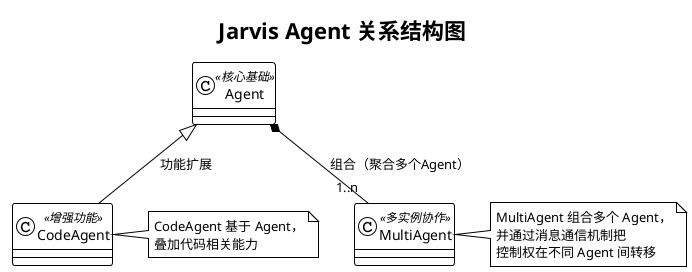

接下来依此对每个模块进行详细说明。


### Agent 系统架构设计

本文档围绕 Jarvis 的核心执行实体 Agent，基于源码与现有文档进行结构化设计说明，覆盖模块组成、职责与接口、与外部系统/环境的交互、模块间交互流程、参数说明与典型执行过程。目标读者为本项目开发者与高级用户。


- 相关核心组件：EventBus、MemoryManager、TaskAnalyzer、FileMethodologyManager、PromptManager、SessionManager、ToolRegistry、AgentRunLoop、TaskPlanner、PlatformRegistry/BasePlatform、工具执行器 execute_tool_call、输入处理器链 builtin_input_handler/shell_input_handler/file_context_handler、EditFileHandler/RewriteFileHandler 等


#### 1. 设计目标与总体思路

- 轻协调、强委托：Agent 保持轻量化，侧重编排，将核心逻辑委托至独立组件（运行循环、工具注册表、平台适配层等）。
- 高解耦、可插拔：通过 Registry（ToolRegistry/PlatformRegistry）与事件总线（EventBus）实现能力可插拔与旁路扩展。
- 稳健运行：针对模型空响应、上下文超长、工具输出过大、异常回调等场景提供防御性处理。
- 易扩展与可观测：关键节点统一事件广播，支持 after_tool_call 回调动态注入；启动时输出资源统计，便于观测。
- 多场景友好：支持非交互模式、子 Agent 递归规划执行、文件上传/本地两种方法论与历史处理模式、工具筛选降噪等。


#### 2. 模块组成

下图展示 Agent 内部与其周边模块的静态组成与依赖关系，聚焦 Agent 直接协作的组件。

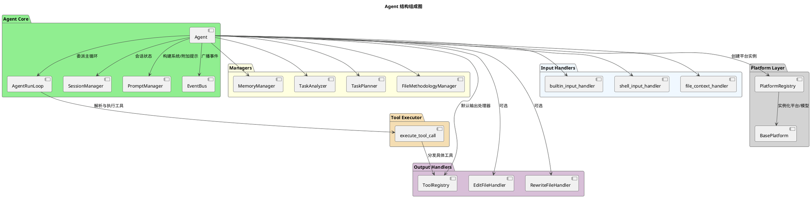


#### 3. 模块功能说明

##### 模块图型与聚焦清单
- Agent（协调中枢）
  - 图型：组件图（与 EventBus/Prompt/Session/Managers/Handlers 的关系）+ 精简时序图（初始化→委派→完成）
  - 聚焦：委派与事件广播边界；非交互/多 Agent/自动完成策略；工具筛选触发条件与系统提示重设时机
  - 源码位置：`src/jarvis/jarvis_agent/__init__.py::Agent`
- AgentRunLoop（主循环）
  - 图型：活动图（循环判定、自动摘要阈值、工具调用与中断分支）
  - 聚焦：进入/跳出循环条件；auto_summary_rounds 触发；need_return 的短路返回；工具提醒轮次机制
  - 源码位置：`src/jarvis/jarvis_agent/run_loop.py::AgentRunLoop`
- AgentManager（Agent 生命周期管理）
  - 图型：工厂模式活动图（初始化→恢复会话→任务执行）
  - 聚焦：Agent 构造与配置注入；会话恢复；预定义任务加载；非交互模式下的任务处理
  - 源码位置：`src/jarvis/jarvis_agent/agent_manager.py::AgentManager`
- ToolRegistry（工具注册与执行）
  - 图型：时序图（Agent→ToolRegistry→具体工具→返回）
  - 聚焦：单响应一次调用约束；格式容错；长输出分流策略
- execute_tool_call（统一入口）
  - 图型：时序图（选择处理器→可选确认→处理器执行→标准返回）
  - 聚焦：返回协议（need_return/tool_prompt）；多处理器冲突拒绝策略；执行前确认机制
  - 源码位置：`src/jarvis/jarvis_agent/tool_executor.py::execute_tool_call`
- SessionManager（会话）
  - 图型：状态图（Active↔Persisted(file)；Clear 重置）或活动图（save/restore/clear）
  - 聚焦：清理历史后“保留系统提示约束”；保存/恢复文件命名与作用域；user_data 存储
  - 源码位置：`src/jarvis/jarvis_agent/session_manager.py::SessionManager`
- PromptManager（提示）
  - 图型：数据流/组件图（system_prompt=系统规则+工具提示；addon_prompt=工具规范+记忆引导+完成标记）
  - 聚焦：拼装来源与回退策略（无 PromptManager 时的兼容）
  - 源码位置：`src/jarvis/jarvis_agent/prompt_manager.py::PromptManager`
- EventBus（事件）
  - 图型：时序图（emit→多订阅者回调→异常隔离）
  - 聚焦：关键事件节点与“旁路增强不影响主流程”的承诺；同步广播机制
  - 源码位置：`src/jarvis/jarvis_agent/event_bus.py::EventBus`
- MemoryManager（记忆）
  - 图型：活动图（TASK_STARTED/BEFORE_HISTORY_CLEAR/TASK_COMPLETED→是否 force_save_memory→prompt_memory_save）
  - 聚焦：强制保存门控；标签提示注入位置；工具存在性检查；事件驱动的自动保存
  - 源码位置：`src/jarvis/jarvis_agent/memory_manager.py::MemoryManager`
- TaskPlanner（规划）
  - 图型：活动图（需拆分?/深度限制→子 Agent 执行→结果汇总写回）
  - 聚焦：不拆分条件；深度与步数上限；写回块 <PLAN>/<SUB_TASK_RESULTS>/<RESULT_SUMMARY>
  - 源码位置：`src/jarvis/jarvis_agent/task_planner.py::TaskPlanner`
- TaskAnalyzer（任务分析）
  - 图型：活动图（BEFORE_SUMMARY/TASK_COMPLETED→满意度收集→分析循环→方法论沉淀）
  - 聚焦：旁路分析与去重机制；满意度反馈收集；方法论生成
  - 源码位置：`src/jarvis/jarvis_agent/task_analyzer.py::TaskAnalyzer`
- FileMethodologyManager（文件/方法论）
  - 图型：决策活动图（upload 模式 vs 本地模式；历史转移流程）
  - 聚焦：提示写回 session 的语义；上传失败回退到本地策略
  - 源码位置：`src/jarvis/jarvis_agent/file_methodology_manager.py::FileMethodologyManager`
- PlatformRegistry（平台）
  - 图型：组件+流程（目录扫描→校验→注册→创建/普通平台获取）
  - 聚焦：用户目录与内置目录合并策略；必需方法校验
- 输入处理器链 & 用户交互封装
  - 图型：管线式活动图（按序处理，遇 need_return 提前返回；多行输入签名兼容）
  - 聚焦：提前返回对主循环的影响；交互层可替换性（CLI→TUI/WebUI）；UserInteractionHandler 封装
  - 源码位置：`src/jarvis/jarvis_agent/user_interaction.py::UserInteractionHandler`
- EditFileHandler/RewriteFileHandler（文件写入）
  - 图型：活动图（PATCH 单点/区间校验→原子写入；REWRITE 整文件回滚）
  - 聚焦：唯一匹配/区间合法性；原子写与回滚保障

##### 读者使用建议
- 先读“模块职责要点”，再看“对应图”，如需实现细节再去源码。文档图用于建立“概念模型”，不替代源码阅读。

- Agent（核心协调者）
  - 初始化并组装组件（EventBus/Managers/Handlers/Platform/Session），初始化顺序：EventBus → Managers → PromptManager → TaskPlanner → 系统提示设置
  - 设置系统提示，首轮按需进行工具筛选与文件/方法论处理
  - 将主运行循环委派给 AgentRunLoop
  - 在关键节点广播事件（TASK_STARTED、BEFORE/AFTER_MODEL_CALL、BEFORE/AFTER_HISTORY_CLEAR、BEFORE/AFTER_ADDON_PROMPT、BEFORE/AFTER_SUMMARY、BEFORE_TOOL_FILTER、TOOL_FILTERED、AFTER_TOOL_CALL、INTERRUPT_TRIGGERED）
  - 动态加载 after_tool_call 回调：扫描 JARVIS_AFTER_TOOL_CALL_CB_DIRS，支持三种导出形式（直接回调、get_* 工厂、register_* 工厂）
- AgentRunLoop（主循环执行体）
  - 驱动“模型思考 → 工具执行 → 结果拼接/中断处理 → 下一轮”的迭代
  - 统一处理工具返回协议与异常兜底，支持自动完成
  - 工具提醒机制：每 `tool_reminder_rounds` 轮（默认20）注入工具使用提示
  - 自动摘要轮次控制：达到 `auto_summary_rounds` 阈值时触发摘要与历史清理，重置轮次计数
- AgentManager（Agent 工厂与生命周期管理）
  - 负责 Agent 的构造、配置注入、会话恢复
  - 处理预定义任务加载（非交互模式跳过）
  - 支持任务内容直接传入（命令行参数）或交互式输入
- SessionManager（会话状态）
  - 管理 prompt、附加提示、会话长度计数、用户数据；负责保存/恢复/清理历史
- PromptManager（提示管理）
  - 构建系统提示（系统规则 + 工具使用提示），构建默认附加提示（工具规范 + 记忆提示）
- EventBus（事件总线）
  - 提供 subscribe/emit/unsubscribe；同步回调异常隔离，不影响主流程
- ToolRegistry（工具注册表，默认输出处理器）
  - 发现/加载/执行工具（内置、外部 .py、MCP）；解析 TOOL_CALL，执行并返回标准化结果
- EditFileHandler/RewriteFileHandler
  - 文件编辑/重写能力；可通过 disable_file_edit 禁用
- MemoryManager（记忆管理）
  - 记忆标签提示注入；关键事件驱动下进行记忆整理/保存；与 save/retrieve/clear_memory 工具协作
- TaskAnalyzer（任务分析）
  - 任务完成阶段旁路分析与满意度收集；必要时沉淀方法论
- TaskPlanner（任务规划）
  - 递归任务拆分与子任务调度；将 <PLAN>/<SUB_TASK_RESULTS>/<RESULT_SUMMARY> 写回父 Agent 上下文
- FileMethodologyManager（文件与方法论）
  - 基于平台能力选择“文件上传模式”或“本地模式”；加载/上传方法论；上下文溢出时以文件方式转移历史
- PlatformRegistry/BasePlatform（平台/模型）
  - 屏蔽不同 LLM 服务商差异；Agent 通过统一接口 chat_until_success/set_system_prompt/upload_files 等进行交互
- 工具执行器 execute_tool_call
  - 解析模型响应中的工具调用，仅允许单次调用；执行前确认、执行后回调、长输出处理（上传或智能截断）等
  - 多处理器冲突检测：当多个输出处理器同时可处理响应时，返回错误提示，要求模型明确选择
  - 执行确认机制：通过 `execute_tool_confirm` 参数控制是否在执行前进行用户确认
- UserInteractionHandler（用户交互封装）
  - 封装多行输入与确认回调，便于未来替换为 TUI/WebUI
  - 多行输入兼容性：优先使用带 `print_on_empty` 参数的签名，失败时回退为单参数签名
  - 确认回调委派：保持与原有 `user_confirm` 一致的行为

##### 3.1 Agent 设计

- 内部实现结构（PlantUML）
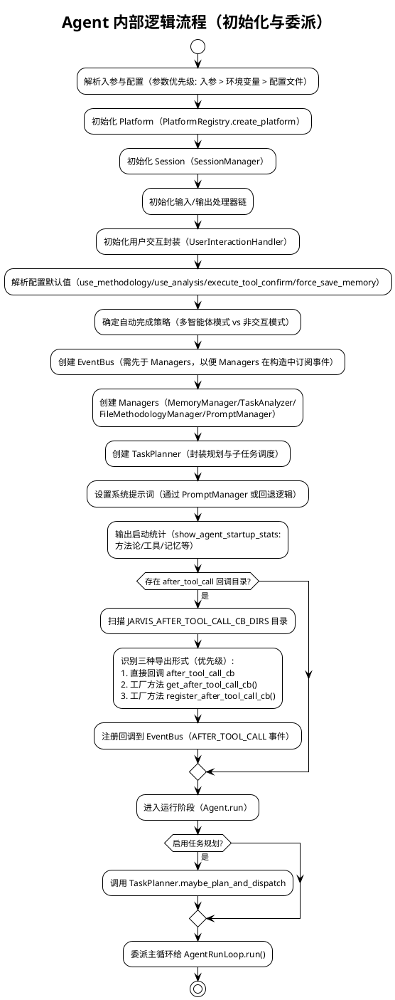

- 职责与定位：
  - 轻量协调者：初始化组件、构建系统/附加提示、委派主循环、广播事件
  - 通过 Registry 与事件总线实现可插拔能力与旁路扩展
- 核心方法：
  - __init__: 解析参数与配置；初始化 Platform/Session/Handlers/Managers/Prompt；设置系统提示；统计资源；加载 after_tool_call 回调
  - run/_main_loop: 进入主循环，委派 AgentRunLoop
  - _call_model/_invoke_model: 输入处理、附加提示拼接、上下文计数与模型调用（含 BEFORE/AFTER_MODEL_CALL 事件）
  - _call_tools: 工具执行委派至 execute_tool_call
  - _complete_task: 处理总结与任务完成事件，触发记忆/分析旁路
  - _filter_tools_if_needed: 工具超过阈值时使用临时模型筛选并重设系统提示
  - _summarize_and_clear_history: 上下文过长的摘要/文件上传分流与历史清理
- 关键参数影响行为：auto_complete、need_summary、use_methodology、use_analysis、execute_tool_confirm、force_save_memory、non_interactive、in_multi_agent、plan/plan_max_depth/plan_depth、disable_file_edit、use_tools/files 等
- 小型结构图：
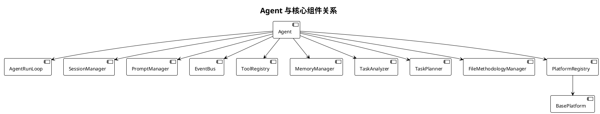

- 历史清理与摘要分流（Agent）
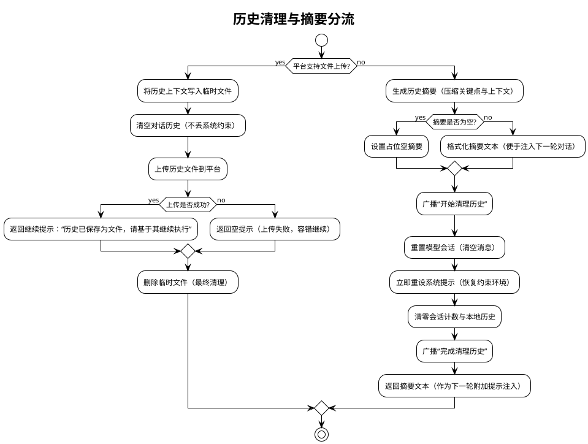

图示说明
- 分流依据：根据平台是否支持文件上传选择路径；支持时将历史写为文件上传；不支持则生成摘要
- 关键约束：清理历史后必须重设系统提示，避免丢失行为规范与工具约束
- 失败回退：上传失败返回空提示；摘要为空则使用占位文本；流程不中断

- 工具筛选流程（Agent._filter_tools_if_needed）

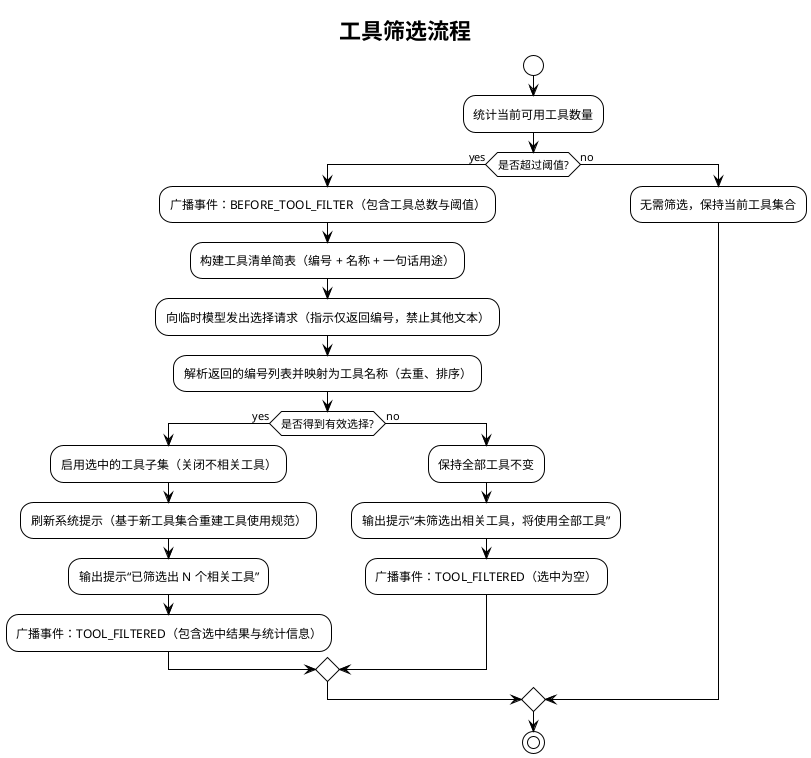

图示说明
- 触发条件：仅当可用工具数量超过阈值时进行筛选；否则保持原集合
- 选择方式：向临时模型请求“只返回编号”，再映射为工具名；启用子集后需刷新系统提示以降低决策复杂度
- 容错路径：未选出任何工具时维持原集合并继续任务

##### 3.2 AgentRunLoop 设计
- 职责：承载主运行循环；控制迭代、工具执行、拼接提示、处理中断与完成
- 核心流程：
  - 首轮初始化（由 Agent._first_run 触发）后循环执行：
    1) 轮次计数递增（conversation_rounds）
    2) 工具提醒机制：每 `tool_reminder_rounds` 轮（默认20）注入工具使用提示
    3) 自动摘要检查：达到 `auto_summary_rounds` 阈值时触发摘要与历史清理，重置轮次计数
    4) 更新输入处理器标志（run_input_handlers_next_turn）
    5) 首次运行处理（Agent._first_run：工具筛选、文件/方法论处理）
    6) _call_model → 获取响应（含输入处理器链处理）
    7) _handle_run_interrupt → 处理用户中断（INTERRUPT_TRIGGERED）
    8) execute_tool_call → 执行工具（若识别到 TOOL_CALL）
    9) join_prompts → 拼接工具结果到 session.prompt
    10) 自动完成检测（!!!COMPLETE!!!）→ _complete_task
    11) 获取下一步用户动作（continue/complete）→ 继续或完成
- 事件：在工具与模型调用关键节点广播 BEFORE/AFTER_TOOL_CALL
- 返回协议：当工具返回 need_return=True，立即返回当前上下文；否则继续循环
- 关键参数：
  - `conversation_rounds`：当前对话轮次计数
  - `tool_reminder_rounds`：工具提醒轮次间隔（环境变量 JARVIS_TOOL_REMINDER_ROUNDS，默认20）
  - `auto_summary_rounds`：自动摘要触发阈值（Agent 入参或配置，默认20）

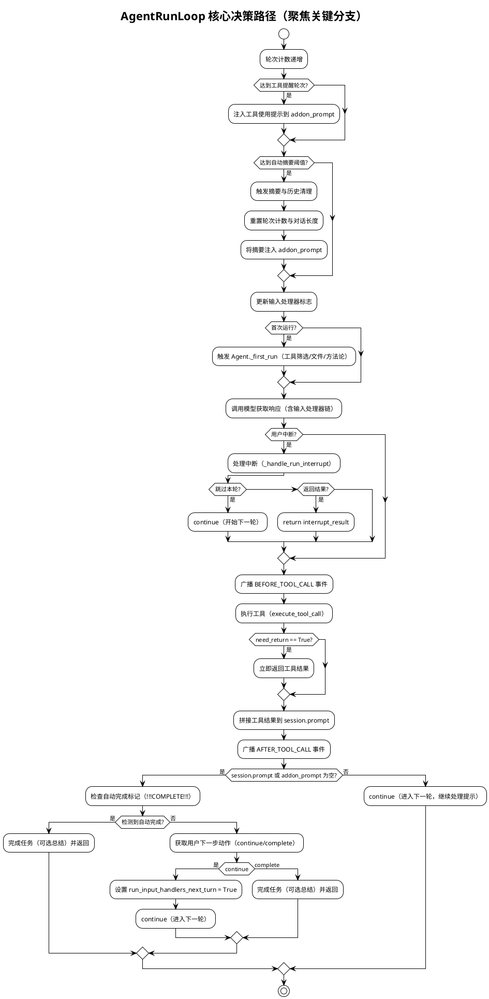

##### 3.3 SessionManager 设计

读者要点
- 会话语义：清理历史仅重置对话与计数，但保留并立即重新应用系统提示，确保约束持续生效
- 保存/恢复作用域：基于平台名与模型名生成唯一文件名（格式：`saved_session_{agent_name}_{platform_name}_{model_name}.json`），避免跨平台/模型污染；恢复后自动删除文件
- 使用场景：长对话需释放上下文时的重置；跨运行的会话持久化与恢复
- 风险与约束：清理后必须重新设置系统提示；恢复失败或文件缺失时应平稳回退，不影响主流程
- 数据存储：`prompt`（当前提示）、`addon_prompt`（附加提示）、`conversation_length`（会话长度计数）、`user_data`（用户自定义数据字典）

- 内部逻辑结构（PlantUML）
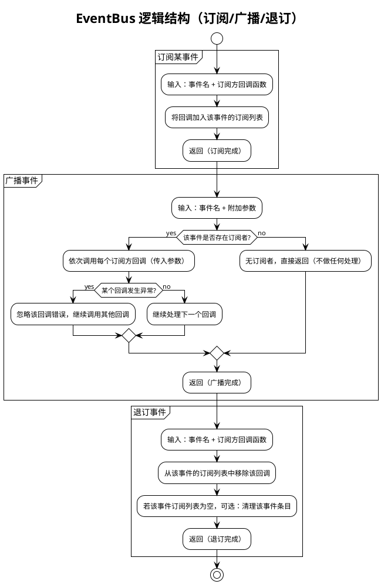

图示说明
- 目的：以“事件名”为索引，支持外部模块在关键节点进行旁路扩展（统计、记忆、分析等），不干扰主流程
- 异常处理：广播过程中单个订阅回调失败被忽略并继续执行其他订阅者，保证主流程稳定
- 边界：EventBus 不做业务判断与流程控制，仅负责调用订阅者；是否保存记忆/执行分析由订阅者自行决定
- 使用建议：为每类关键节点定义清晰事件名（如 BEFORE_MODEL_CALL、AFTER_TOOL_CALL 等），订阅者内部做好容错与幂等

- API：subscribe(callback)、emit(event, **kwargs)、unsubscribe(callback)
- 特性：同步广播、回调异常隔离，便于旁路扩展（记忆保存、任务分析、统计）

- 事件总线全局事件流（总览图）
下图以通俗步骤展示“任务启动 → 模型/工具 → 历史清理 → 总结 → 完成”的全链路广播与响应，弱化内部术语，便于整体理解。

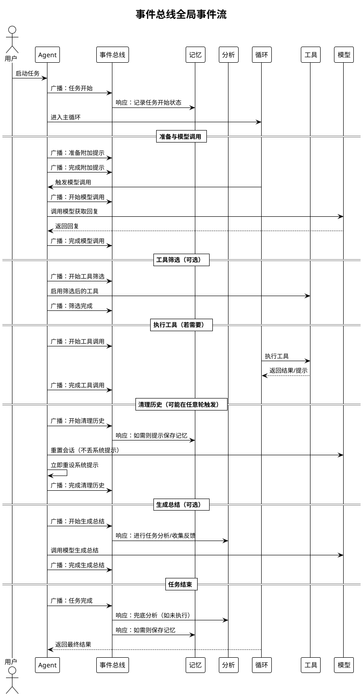

图示说明
- 图使用“广播/响应/调用/返回”等通俗术语；不展示内部函数名与具体实现
- “可选”表示仅在特定条件触发（如工具筛选、生成总结）
- 实际事件名在代码中对应 TASK_STARTED、BEFORE/AFTER_MODEL_CALL、BEFORE/AFTER_TOOL_CALL、BEFORE/AFTER_HISTORY_CLEAR、BEFORE/AFTER_SUMMARY 等；图强调流程含义，避免细节干扰

##### 3.5 execute_tool_call 设计

- 职责：统一解析模型响应中的工具调用，选择并执行合适的输出处理器，返回标准协议
- 核心流程：
  1) 遍历 Agent 的输出处理器列表，筛选可处理响应的处理器（can_handle）
  2) 多处理器冲突检测：若多个处理器同时可处理，返回错误提示，要求模型明确选择
  3) 无处理器匹配：返回空结果，继续循环
  4) 执行前确认：若 `execute_tool_confirm` 为 True，进行用户确认；用户拒绝则返回空结果
  5) 执行处理器：调用 `handler.handle(response, agent)`
  6) 返回标准协议：`(need_return: bool, tool_prompt: Any)`
- 返回协议：
  - `need_return=True`：工具要求立即结束本轮，直接返回结果给用户（如 MultiAgent 的 SEND_MESSAGE）
  - `need_return=False`：工具结果将拼接回上下文，继续下一轮循环
  - `tool_prompt`：工具执行结果文本或返回对象
- 异常处理：工具执行异常被捕获并返回错误信息，不影响主循环稳定

##### 3.6 ToolRegistry 设计
- 角色：默认输出处理器，解析并执行 TOOL_CALL
- 加载来源：内置工具、外部 .py 工具、MCP 工具（外部进程）
- 执行协议：
  - 单步约束：一次响应仅允许一个调用块，检测到多个则拒绝执行
  - 结束标签容错：缺失结束标签时尝试自动补全并提示规范
  - 大输出处理：平台支持时上传文件并清理历史；否则智能截断（前后各 30 行）
  - 统计与记录：执行计数与最近执行工具记录（__last_executed_tool__/__executed_tools__）
- 微结构图：
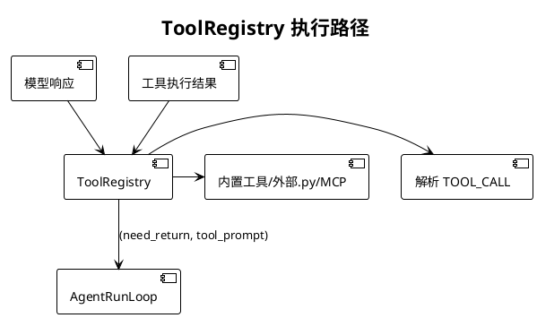

- 关键交互时序（PlantUML）
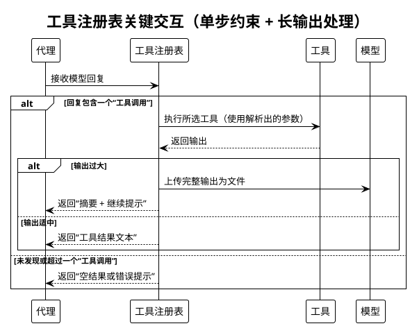

图示说明
- 单步约束：每次回复仅允许一个工具调用；多个调用直接拒绝并提示规范
- 长输出处理：优先按平台能力上传文件并提供简短摘要；不支持上传时进行智能截断（保留头/尾片段）
- 返回约定：统一返回“是否需立即结束本轮 + 文本提示”，主循环据此决定直接返回或继续迭代

##### 3.7 EditFileHandler / RewriteFileHandler 设计

读者要点
- 用途：在单步响应中进行最小必要变更（PATCH）或整文件替换（REWRITE）
- 安全约束：PATCH 强制唯一匹配（SEARCH 仅一次命中）；区间替换需合法起止标记；REWRITE 采用原子写并可回滚
- 选择策略：优先 PATCH（影响最小），仅在大范围重构或整文件生成时使用 REWRITE
- 结果呈现：返回成功与差异摘要；失败时明确说明原因（未命中、多处命中、区间非法等）

关键决策路径（活动图）
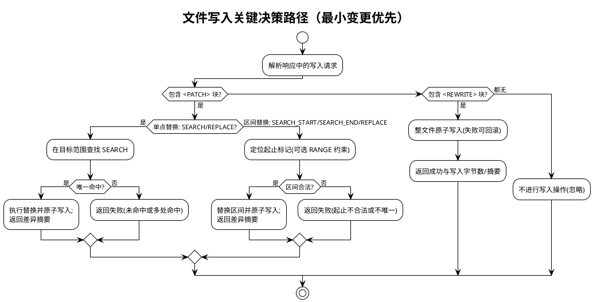

##### 3.7 UserInteractionHandler 设计

- 职责：封装用户交互接口（多行输入与确认），便于未来替换为 TUI/WebUI
- 设计目标：抽象用户交互层，保持向后兼容，支持不同 UI 实现
- 核心方法：
  - `multiline_input(tip: str, print_on_empty: bool) -> str`：多行输入封装
    - 优先使用带 `print_on_empty` 参数的签名
    - 失败时回退为单参数签名（`multiline_inputer(tip)`）
  - `confirm(tip: str, default: bool) -> bool`：确认回调委派
    - 直接调用传入的 `confirm_callback`，保持行为一致
- 初始化时机：在 Agent 初始化输入/输出处理器后创建，将 Agent 的 `confirm_callback` 指向封装后的方法

##### 3.8 MemoryManager 设计

- 内部逻辑结构（PlantUML）
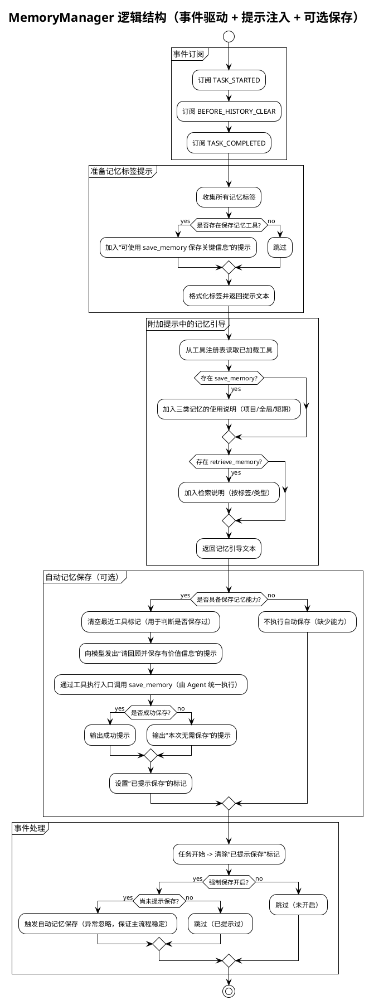

图示说明
- 事件驱动：在任务开始、历史清理前、任务完成后按需触发“提示或执行记忆保存”，不阻塞主流程
- 提示注入：将记忆标签与工具使用说明拼入每轮附加提示，促进模型主动使用记忆工具
- 能力门控：仅在存在 save_memory/retrieve_memory 工具时提供对应指引与自动保存；否则安全跳过
- 强制保存：force_save_memory 开启且尚未提示时，在 BEFORE_HISTORY_CLEAR 或 TASK_COMPLETED 触发一次自动保存
- 容错：自动保存调用异常被忽略，不影响任务输出与流程推进；状态标记避免重复提示

- 记忆类型与存储策略
- 短期记忆（short_term）
  - 存储位置：进程内存（jarvis_utils.globals.add_short_term_memory / get_short_term_memories）
  - 生命周期：仅在当前任务/进程内有效，不落盘；适合临时上下文、当前步骤的中间信息
  - 检索方式：retrieve_memory memory_types=["short_term"]，可按标签过滤
- 项目长期记忆（project_long_term）
  - 存储位置：当前项目目录 .jarvis/memory 下，JSON 文件按条目存储
  - 适用内容：项目相关的约定、配置、实现细节、架构决策等
  - 作用域：当前仓库/目录；随项目版本控制与协作共享更方便
- 全局长期记忆（global_long_term）
  - 存储位置：数据目录 get_data_dir()/memory/global_long_term 下，JSON 文件按条目存储
  - 适用内容：通用方法论、常用命令、用户偏好、跨项目知识与最佳实践
  - 作用域：同一用户在本机的所有项目/任务通用

数据模型（统一结构）
- 字段：id、type（memory_type）、tags、content、created_at、updated_at（可选）、merged_from（整理后可选）
- 命名与ID：save_memory 按微秒级时间戳生成唯一 ID（例如 20251101_072947_388226）

- 记忆整理（MemoryOrganizer）
- 目标：合并标签高度重叠的长期记忆，消除冗余、提升可检索性
- 适用类型：project_long_term、global_long_term（不处理 short_term）
- 合并策略：
  - 基于标签重叠度（min_overlap ≥ 2），按重叠数量从高到低分组
  - 调用 LLM 将同组记忆合并为一个综合记忆（最近时间权重更高）
  - 生成 YAML 格式的 <merged_memory>，包含 content 与 tags；解析后写为新记忆，并删除原始条目
- 使用方法（CLI）：
  - 整理（模拟运行）：jarvis-memory-organizer organize --type project_long_term --dry-run
  - 整理（指定重叠数）：jarvis-memory-organizer organize --type global_long_term --min-overlap 3
  - 导出：jarvis-memory-organizer export output.json -t project_long_term -t global_long_term --tag API
  - 导入：jarvis-memory-organizer import memories.json --overwrite
- 平台选择：统一使用 normal 平台与模型（PlatformRegistry.get_global_platform_registry），支持通过 -g/--llm-group 覆盖模型组
- 数据安全与回滚：
  - 新记忆创建后再删除旧记忆文件，失败日志汇总输出
  - 导出/导入支持类型校验、标签过滤、覆盖策略；异常明确告警且不中断其他记录

- 典型使用场景
- 在任务完成前自动提示保存本次关键经验（force_save_memory 开启）
- 在复杂项目中将架构决策与约定沉淀为 project_long_term，跨项目方法论沉淀为 global_long_term
- 在对话中临时缓存当前轮上下文与关键结论为 short_term，便于下一步工具调用
- 定期使用 MemoryOrganizer 合并重复/冗余的长期记忆，保持知识库整洁与高质

##### 3.9 TaskAnalyzer 设计

读者要点
- 触发时机：生成总结前（BEFORE_SUMMARY）优先触发；若无总结需求，则在 TASK_COMPLETED 兜底触发
- 目标产出：基于任务过程沉淀方法论/改进建议，并收集"是否满意"的反馈
- 对主流程影响：旁路执行；回调异常或失败不影响任务完成；完成后设置去重标记避免重复分析
- 核心方法：
  - `analysis_task(satisfaction_feedback: str)`：执行任务分析循环
    - 构建分析提示（TASK_ANALYSIS_PROMPT + 满意度反馈）
    - 循环处理模型调用与工具执行（支持工具调用以完成分析任务）
    - 处理用户中断（采集补充信息后继续或退出）
  - `collect_satisfaction_feedback(auto_completed: bool) -> str`：收集用户满意度
    - 仅在非自动完成且启用分析时收集
    - 询问用户是否满意，不满意时收集详细反馈
- 去重机制：通过 `_analysis_done` 标记和 `__task_analysis_done__` 用户数据避免重复分析

关键交互（PlantUML）
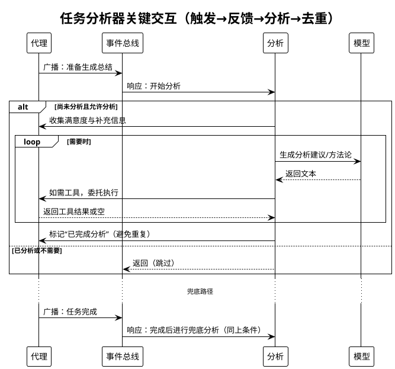

图示说明
- 触发：生成总结前优先；无总结需求时在任务完成阶段兜底触发一次
- 产出：方法论与改进建议；同时收集满意度反馈
- 去重：设置“已完成分析”标记，避免重复分析
- 容错：分析过程中模型或工具出错忽略返回，不影响任务完成

输出与约束
- 输出：方法论/改进建议（写入会话上下文，由上层继续整合），满意度反馈记录
- 约束：仅在 use_analysis 启用时执行；触发一次后设置去重标记
- 容错：模型/工具异常不影响主流程；中断时优先采集用户补充信息再继续分析

##### 3.10 TaskPlanner 设计
- 职责：复杂任务拆分与子任务调度，控制递归深度（plan_max_depth/plan_depth）
- 产出：<PLAN>（YAML 列表）、<SUB_TASK_RESULTS>、<RESULT_SUMMARY> 合并回父 Agent 上下文
- 子 Agent 构造：通过 `_build_child_agent_params` 继承父 Agent 能力与配置，默认非交互自动完成
- 核心方法：
  - `maybe_plan_and_dispatch(task_text: str)`：评估是否需要拆分并执行子任务
    - 深度限制检查：当前深度 >= 最大深度时直接返回
    - 使用临时模型评估是否需要拆分（输出 <PLAN> 或 <DONT_NEED/>）
    - 子任务数量限制：超过 4 个时重试一次，仍超过则放弃拆分
    - 子任务执行：为每个子任务创建子 Agent，传递原始任务与前置结果
    - 结果汇总：使用临时模型生成 <RESULT_SUMMARY>，将规划与结果写回父 Agent 上下文

- 内部逻辑流程（PlantUML）
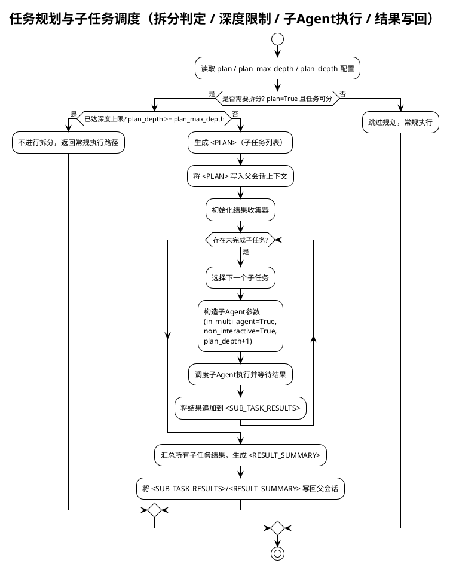

图示说明
- 触发条件：仅在 plan=True 且任务可拆分时进入规划路径
- 深度限制：plan_depth >= plan_max_depth 时不再递归拆分
- 子 Agent：默认非交互自动完成，继承父 Agent 能力与配置
- 写回约定：将 <PLAN>/<SUB_TASK_RESULTS>/<RESULT_SUMMARY> 写回父会话，便于后续模型使用
- 容错：单个子任务失败不阻断整体流程，按需记录并继续其他子任务

##### 3.11 FileMethodologyManager 设计
- 模式选择：
  - 文件上传模式：平台支持 upload_files 时，方法论与历史以文件上传
  - 本地模式：不支持上传时，加载本地方法论库并管理上下文
- 历史处理：handle_history_with_file_upload 在上下文溢出时转移历史并返回继续提示

- 内部逻辑流程（PlantUML）
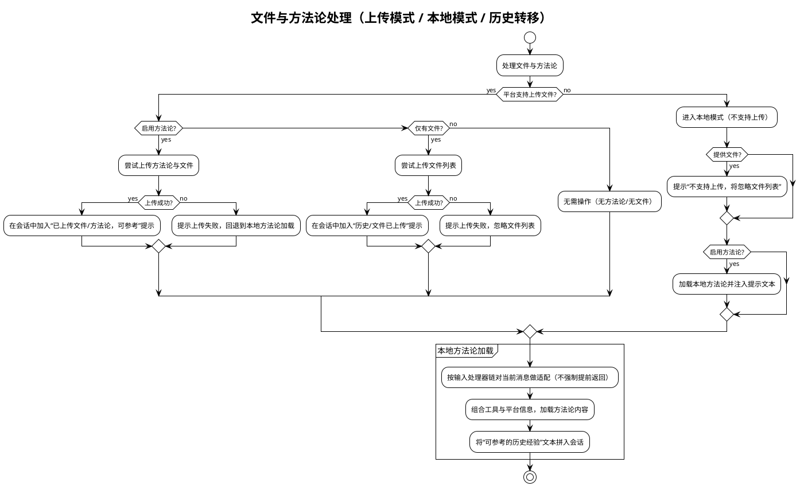

图示说明
- 模式选择：优先“上传模式”（平台支持时），否则“本地模式”加载方法论与经验
- 提示注入：成功上传或成功加载后，将“可参考经验/已上传文件”文本拼入会话，便于引用
- 失败回退：上传失败不阻断流程；方法论加载失败时回退为常规对话
- 输入处理器：本地方法论加载前对当前消息做轻量适配（如从文件/终端输入抽取上下文），不强制提前返回
- 无操作路径：既不启用方法论也无文件时，本轮不处理，保持最小影响

- 历史转移（上下文过长）流程
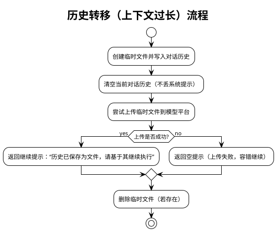

##### 3.12 PlatformRegistry / BasePlatform 设计
- PlatformRegistry：动态创建平台实例，选择“普通平台/模型”，兼容不同厂商
- BasePlatform：统一接口（chat_until_success、set_system_prompt、upload_files、reset、set_model_name/group、name/platform_name）
- 行为：Agent 通过该层以统一方式与不同 LLM 平台交互，并按平台能力决定是否支持文件上传等增强特性

读者要点
- 边界与职责：统一发现与注册平台实现；向上提供“创建平台实例/获取普通平台”的简化接口
- 能力归一：通过 BasePlatform 接口屏蔽不同厂商差异（聊天/系统提示/文件上传等）
- 生命周期：启动时加载用户目录与内置目录的实现；运行时按名称创建实例或返回“普通平台”
- 失败回退：未找到平台或创建失败时进行明确告警并返回 None，不阻断上层流程

可视化（组件 + 关键流程）
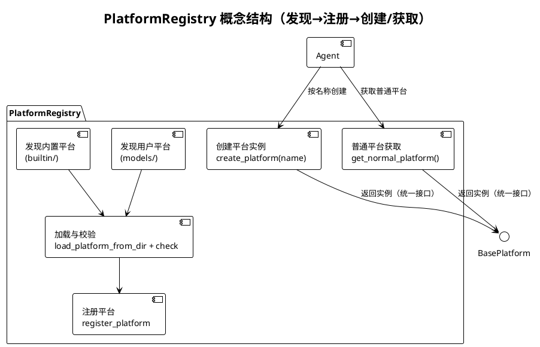

##### 3.13 工具执行器 execute_tool_call 设计

- 内部逻辑流程（PlantUML）
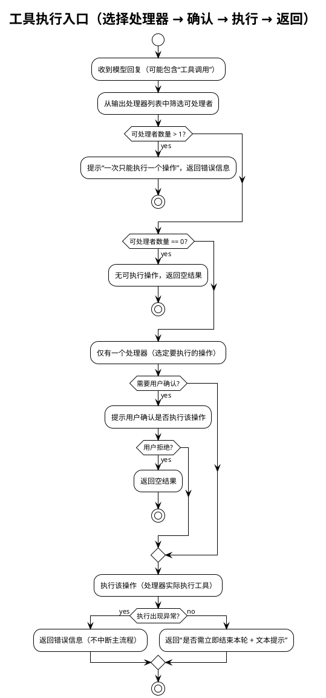

图示说明
- 入口职责：统一选择并执行一个合适的输出处理器（如工具、文件写入等），返回标准结果
- 约束与容错：一次仅执行一个操作；执行前可选确认；异常不影响主循环稳定推进
- 返回约定：统一返回“是否立即结束本轮 + 文本提示”，主循环据此决定直接返回或继续迭代

- 职责：统一解析模型响应中的 TOOL_CALL，执行业务处理并返回标准协议
- 协议：返回 (need_return: bool, tool_prompt: str)；need_return=True 时由运行循环直接返回结果
- 策略：执行前确认（execute_tool_confirm）；after_tool_call 回调（由 EventBus 与动态注入目录触发）；长输出与格式容错见 ToolRegistry 章节

##### 3.14 输入处理器链与用户交互封装

- 内部逻辑流程（PlantUML）
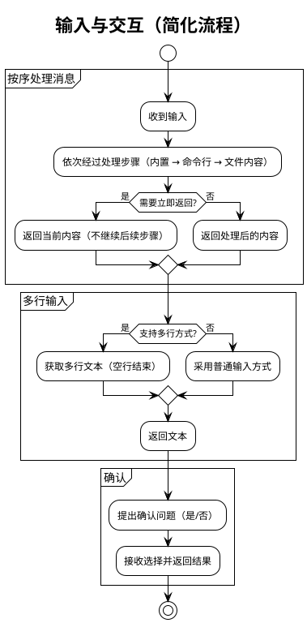

- 输入处理器：builtin_input_handler、shell_input_handler、file_context_handler（按序处理，返回 need_return 标志控制是否提前返回）
- UserInteractionHandler：
  - 多行输入：兼容函数签名 func(tip, print_on_empty) 与 func(tip)
  - 确认交互：封装 confirm 回调，便于替换为 TUI/GUI/WebUI

- 用户交互封装（UserInteractionHandler）内部逻辑结构
```plantuml
@startuml
!theme plain
title 用户交互（多行输入 + 确认，简化）

start
partition "多行输入" {
  if (可用多行方式?) then (是)
    :提示并接收多行文本（空行结束）;
  else (否)
    :使用普通输入方式接收文本;
  endif
  :返回文本;
}

partition "确认" {
  :提出确认问题（可设默认选项）;
  :接收是/否并返回结果;
}
stop
@enduml
```

- 目标：抽象用户交互（多行输入与确认），便于未来替换为 TUI/WebUI
- 兼容策略：优先使用带 print_on_empty 的多参签名，失败时回退为单参签名；confirm 委派保持一致行为

##### 3.15 事件与回调扩展
- 事件常量：TASK_STARTED/COMPLETED、BEFORE/AFTER_MODEL_CALL、BEFORE/AFTER_HISTORY_CLEAR、BEFORE/AFTER_SUMMARY、BEFORE_TOOL_FILTER/TOOL_FILTERED、AFTER_TOOL_CALL、INTERRUPT_TRIGGERED、BEFORE/AFTER_ADDON_PROMPT
- 动态回调：扫描 JARVIS_AFTER_TOOL_CALL_CB_DIRS；支持 after_tool_call_cb、get_after_tool_call_cb()、register_after_tool_call_cb() 三种导出形式；回调包装隔离异常


#### 4. 与外部系统/环境的交互

- LLM 平台与模型
  - 通过 PlatformRegistry 动态创建 BasePlatform 实例，统一设置模型名称/组；Agent 使用 chat_until_success/set_system_prompt 调用
  - 支持文件上传：当模型支持 upload_files，历史与大输出以文件上传方式释放/节省上下文
- 工具生态
  - ToolRegistry 加载内置工具、外部 .py 工具与 MCP 工具；MCP 工具通过外部进程提供能力，支持跨应用集成
- 文件与方法论仓库
  - 加载本地方法论库；可与中心方法论库通过 Git 同步，实现团队共享最佳实践
- 记忆系统
  - 三层记忆：短期（内存）、项目长期（.jarvis/memory）、全局长期（~/.jarvis/data/memory/global_long_term）
  - 通过 save_memory/retrieve_memory/clear_memory 工具使用
- CLI 与环境变量/配置
  - 通过 CLI 运行任务；支持 JARVIS_NON_INTERACTIVE 等环境变量控制非交互模式
  - 通过 jarvis_utils.config 获取默认配置（如计划开关、筛选阈值、after_tool_call 回调扫描目录等）
- 动态回调注入
  - 读取 JARVIS_AFTER_TOOL_CALL_CB_DIRS 指定目录下的 Python 文件，动态注册 after_tool_call 回调（三种导出方式优先级约定），用于旁路增强工具调用后处理
- 可观测性
  - show_agent_startup_stats 启动统计：输出方法论数量、工具可用数/总数、全局/项目记忆数量、工作目录等


#### 5. 模块间交互流程（PlantUML）

下图展示一次典型端到端执行过程的时序，涵盖初始化、首轮处理、模型调用、工具执行与收尾。

```plantuml
@startuml
!theme vibrant
title 端到端执行流程（简化）

actor 用户 as User
participant "代理" as Agent
participant "循环" as Loop
participant "平台" as Platform
participant "工具" as Tools
participant "记忆" as Mem
participant "规划" as Planner
participant "方法论" as Fm

User -> Agent : 启动任务
Agent -> Agent : 初始化与准备（平台/工具/方法论/记忆）
Agent -> Planner : 规划任务 [可选]
Agent -> Fm : 处理文件与方法论 [可选]
Agent -> Loop : 进入循环

Loop -> Agent : 准备提示与输入
Agent -> Platform : 调用模型
Platform --> Agent : 返回回复

alt 回复包含工具调用
  Agent -> Tools : 执行工具
  Tools --> Agent : 返回结果/提示
end

alt 上下文过长
  Agent -> Platform : 重置会话（保留规则）
  Agent -> Agent : 立即重设系统提示
end

alt 任务完成
  Agent -> Mem : 保存/整理记忆 [按需]
  Agent -> Agent : 生成总结 [可选]
  Agent --> User : 输出结果
else 继续迭代
  Loop --> Loop : 下一轮
end
@enduml
```


#### 6. 参数与配置说明

以下参数来自 Agent.__init__。默认值或行为参考 jarvis_utils.config 与内部回退逻辑。除特别标注外，布尔型参数可通过入参覆盖配置默认值。

- system_prompt: 系统提示词，定义 Agent 行为准则（必要）
- name: Agent 名称，默认 "Jarvis"，用于全局登记与交互提示
- description: Agent 描述信息
- model_group: 模型组标识，用于按组选择平台与模型（get_normal_platform_name/get_normal_model_name）
- summary_prompt: 任务总结提示词；为空时回退 DEFAULT_SUMMARY_PROMPT 或 SUMMARY_REQUEST_PROMPT
- auto_complete: 自动完成开关；非交互模式默认开启；多智能体模式下仅在显式 True 时开启
- output_handler: 输出处理器列表；默认 [ToolRegistry,(EditFileHandler),(RewriteFileHandler)]（括号内可禁用）
- use_tools: 指定允许使用的工具名白名单；为空时加载默认集合；当工具过多时 Agent 首轮可触发 AI 筛选并动态缩减
- execute_tool_confirm: 执行工具前是否进行用户确认（可由配置 is_execute_tool_confirm 决定）
- need_summary: 是否在完成阶段生成总结
- auto_summary_rounds: 自动摘要轮次上限（由 AgentRunLoop 读取并决定触发时机）
- multiline_inputer: 多行输入函数；由 UserInteractionHandler 进行向后兼容封装
- use_methodology: 是否启用方法论引导；默认从配置读取（is_use_methodology）
- use_analysis: 是否启用任务完成后的分析（TaskAnalyzer）；默认从配置读取（is_use_analysis）
- force_save_memory: 是否在关键节点强制提示/执行记忆保存；默认从配置读取（is_force_save_memory）
- disable_file_edit: 禁用文件编辑相关输出处理器（EditFileHandler/RewriteFileHandler）
- files: 需要处理或上传的文件列表（触发 FileMethodologyManager 处理）
- confirm_callback: 确认回调，签名 (tip: str, default: bool) -> bool；默认 CLI user_confirm
- non_interactive: 非交互模式（最高优先级）；若显式提供会同步到环境变量 JARVIS_NON_INTERACTIVE
- in_multi_agent: 多智能体运行标志；用于控制自动完成（子 Agent 默认非交互自动完成）
- plan: 是否启用任务规划与子任务拆分（默认从配置 is_plan_enabled）
- plan_max_depth: 规划最大深度（默认 get_plan_max_depth，异常回退 2）
- plan_depth: 当前规划深度（父 +1 传递至子；默认 0）
- agent_type: "normal" 或 "code"；"code" 时构造 CodeAgent（转发构造参数）

行为与默认策略补充
- 非交互与自动完成：
  - 非交互模式（或子 Agent）默认自动完成为 true；多智能体模式时除非显式 True 否则不自动完成
- 工具筛选：
  - 可用工具数超过阈值（get_tool_filter_threshold）时，使用临时模型产生选择编号，更新 ToolRegistry.use_tools，并重置系统提示
- 大输出处理：
  - 平台支持上传：生成摘要并清理历史后，上传大输出文件，返回“摘要 + 调用上下文”提示继续
  - 平台不支持：智能截断前 30/后 30 行，中间以占位提示
- 历史与上下文：
  - conversation_length 由 get_context_token_count 计数；超过阈值时走摘要或文件上传流程（FileMethodologyManager 处理）
- 动态回调：
  - 扫描 JARVIS_AFTER_TOOL_CALL_CB_DIRS，支持 after_tool_call_cb、get_after_tool_call_cb()、register_after_tool_call_cb() 三种导出形式；注入 AFTER_TOOL_CALL 回调


#### 7. 典型执行过程（端到端）

以“分析代码并修改某个函数”为例（伪场景）：
1. CLI 将用户需求交给 Agent.run
2. Agent 初始化与启动统计：加载 Platform 与 ToolRegistry；设置系统提示；输出方法论/工具/记忆统计信息
3. 首轮处理：
   - FileMethodologyManager：若平台支持上传，尝试上传 files 与方法论；否则本地加载
   - MemoryManager：准备记忆标签提示并注入上下文
   - 工具筛选（可选）：当工具过多时用临时模型筛选相关工具子集，更新系统提示
4. 进入 AgentRunLoop：
   - 生成 addon prompt（包含工具使用规则、记忆提示、是否需要 !!!COMPLETE!!! 标记）
   - 调用 BasePlatform.chat_until_success 获取响应
   - 若响应包含 TOOL_CALL，交由 ToolRegistry 解析并执行对应工具（如 read_code 或 patch）
   - 工具输出拼接回上下文（utils.join_prompts），广播 AFTER_TOOL_CALL；need_return=True 时直接返回结果
   - 若用户中断（INTERRUPT_TRIGGERED），采集补充输入，决定是否继续或跳过当前轮
   - 检查自动完成：检测到 !!!COMPLETE!!! 或 ot('!!!COMPLETE!!!') 标记进入收尾
5. 收尾：
   - 通过事件驱动执行 TaskAnalyzer 分析、MemoryManager 记忆保存（受 force_save_memory 控制）
   - need_summary=True 时生成总结
   - 返回最终结果至 CLI

```plantuml
@startuml
!theme vibrant
title 典型执行过程（代码分析与修改，简化）

actor 用户 as User
participant "界面" as UI
participant "代理" as Agent
participant "循环" as Loop
participant "平台" as Platform
participant "工具" as Tools
participant "文件修改器" as Writer
participant "记忆" as Mem
participant "事件总线" as Bus

User -> UI : 描述需求
UI -> Agent : 发送任务
Agent -> Bus : 广播：任务开始
Agent -> Agent : 首轮准备（工具筛选/文件与方法论/记忆标签）[可选]
Agent -> Loop : 进入主循环

Loop -> Agent : 生成提示并准备输入
Agent -> Platform : 调用模型
Platform --> Agent : 返回回复（可能包含工具调用）

alt 需要工具
  Agent -> Tools : 执行工具
  Tools --> Agent : 返回结果/提示
end

alt 需要修改文件
  Agent -> Writer : 应用变更
  Writer --> Agent : 返回修改结果
end

Agent -> Bus : 广播：步骤完成

alt 检测到完成
  Agent -> Agent : 生成总结 [可选]
  Agent -> Mem : 保存/整理记忆 [按需]
  Agent -> Bus : 广播：任务完成
  Agent --> UI : 输出结果
else 继续迭代
  Loop --> Loop : 下一轮
end
@enduml
```

该过程对长输出、上下文长度与外部失败具备防御性回退策略，保证流程可持续推进。


#### 8. 可靠性与容错设计

- 模型空响应回退为空串并告警，避免 None/空字符串导致逻辑断流
- 摘要与完成阶段同样进行空响应防御
- 事件回调异常隔离，避免影响主流程
- 工具调用格式容错：ToolRegistry 对缺失结束标签的 TOOL_CALL 尝试自动补全并提示规范
- 长输出安全处理：优先文件上传，其次智能截断，抑制上下文溢出
- 规划失败或无需拆分不影响主流程，主循环按常规路径继续
- 历史清理后自动重置系统提示，保持约束环境持续生效


#### 9. 扩展与二次开发建议

- 工具扩展：在内置路径或 ~/.jarvis/tools 下新增 .py 工具；跨进程/应用集成优先采用 MCP 工具
- 平台扩展：在 jarvis_platform 下新增 BasePlatform 子类，通过 PlatformRegistry 自动发现
- 旁路增强：通过 JARVIS_AFTER_TOOL_CALL_CB_DIRS 注入 AFTER_TOOL_CALL 回调，实现统计/审计等旁路能力
- 方法论共享：建立中心方法论库（Git），团队同步沉淀最佳实践，提升协作效率
- 子 Agent：利用 TaskPlanner 与 _build_child_agent_params 继承父 Agent 能力，构建递归执行的子任务体系
- UI 替换：UserInteractionHandler 与 OutputHandlerProtocol 的抽象便于替换为 TUI/GUI/WebUI

### CodeAgent 系统架构设计

本章节不展开 Agent 的内部实现，聚焦 CodeAgent 如何使用 Agent，并在此基础上为“代码工程”场景提供的增强能力与流程封装。内容基于源码进行结构化说明，覆盖模块组成、职责与接口、关键交互流程、CLI 入口与参数说明、可靠性与扩展建议。

- 关联组件与工具：Git 提交工作流工具、工具注册生态（由 Agent 承载）、事件系统（AFTER_TOOL_CALL）、StatsManager、lint 工具建议、配置系统（jarvis_utils.config）、输出交互（PrettyOutput）


#### 1. 设计目标与总体思路

- 使用 Agent：通过统一接口调用 Agent，文档不描述其内部结构与实现细节。
- 场景聚焦：围绕“代码分析与修改”的端到端流程，提供仓库管理、补丁预览、提交确认与统计、静态检查引导等增值能力。
- 最小侵入：仅通过启动参数注入系统提示与工具白名单、订阅 AFTER_TOOL_CALL 事件，不改变 Agent 的行为边界。
- 稳健与可观测：强调 git 配置/仓库状态检查、换行符策略、错误回退；对代码行增删与提交进行统计记录；大变更摘要化预览，避免上下文膨胀。


#### 2. 模块组成（PlantUML）

下图展示 CodeAgent 与其协作组件的静态组成与依赖关系，Agent 作为运行与工具执行的统一入口，不展开内部细节。

```plantuml
@startuml
!theme vibrant
title CodeAgent 结构组成图（面向 Agent 的使用）

package "CodeAgent Layer" #LightGreen {
  component "CodeAgent" as CodeAgent
  component "CLI (typer)" as CLI
}

package "Agent Layer" #LightGray {
  component "Agent" as AgentNode
  component "EventBus" as EventBus
}

package "Agent Tools" #Wheat {
  component "read_code" as ToolReadCode
  component "PATCH" as ToolPatch
  component "REWRITE" as ToolRewrite
  component "execute_script" as ToolExecuteScript
  component "search_web" as ToolSearchWeb
  component "memory_tools(save/retrieve/clear)" as ToolMemory
}

package "Git & Repo Utils" #LightYellow {
  component "提交工作流工具" as GitCommitTool
  component "git_utils" as GitUtils
}

package "Config & IO" #Thistle {
  component "jarvis_utils.config" as Config
  component "PrettyOutput" as Output
}

package "Stats & Lint" #AliceBlue {
  component "StatsManager" as Stats
  component "LintToolsSelector" as Lint
}

CodeAgent --> AgentNode : 构造/运行（统一接口）
CodeAgent --> EventBus : 订阅 AFTER_TOOL_CALL

AgentNode --> ToolReadCode
AgentNode --> ToolPatch
AgentNode --> ToolRewrite
AgentNode --> ToolExecuteScript
AgentNode --> ToolSearchWeb
AgentNode --> ToolMemory

CodeAgent --> GitUtils : 仓库检测/差异/历史
CodeAgent --> GitCommitTool : 提交工作流封装
CodeAgent --> Config : 读取/覆盖配置项
CodeAgent --> Output : 提示与代码块输出
CodeAgent --> Stats : 行数与提交统计
CodeAgent --> Lint : 修改后静态检查建议
CLI --> CodeAgent : 入口与参数传递
@enduml
```

关键点
- CodeAgent 通过“启动参数 + 工具白名单 + 事件订阅”使用 Agent；工具执行与对话循环由 Agent 承载。
- AFTER_TOOL_CALL 用于在工具执行后进行旁路增强（展示 diff、提交、统计、静态扫描引导）。
- Git 工具链与配置/输出/统计等均为 CodeAgent 外层增强能力。


#### 3. CodeAgent 核心功能与与 Agent 的使用边界

读者要点
- 与 Agent 的交互仅限：
  - 启动参数：注入系统提示、工具白名单、自动完成/总结/规划/非交互等行为开关。
  - 事件订阅：订阅 AFTER_TOOL_CALL 事件进行旁路增强。
  - 运行入口：agent.run(input) 启动任务。
  - 追加提示：在必要时追加附加提示（如静态扫描引导）。
  - 会话写入：在确定结果后将补充文本追加至当前会话上下文。

- CodeAgent 的外层增强能力（独立于 Agent 实现）：
  - 环境与仓库管理：发现仓库根、更新 .gitignore、处理未提交修改、统一换行符敏感策略（含 Windows 建议）。
  - 提交工作流：自动/交互式 commit、提交历史展示与接受/重置。
  - 差异与预览：按文件输出 diff，针对删除/重命名/大变更进行适配与摘要化处理。
  - 统计与提示：记录代码行增删、修改次数；根据文件类型生成 lint 建议与静态扫描引导。
  - CLI 入口：非交互约束、单实例锁（按仓库维度）、会话恢复、参数同步配置。


##### 3.1 系统提示与工具白名单

- 系统提示：注入“代码工程师工作准则与流程规范”，并按顺序拼接全局规则（数据目录 rules）与项目规则（.jarvis/rules）为单一 <rules> 区块。
- 工具白名单（最小可用集）：
  - execute_script、search_web、ask_user、read_code、save_memory、retrieve_memory、clear_memory、sub_code_agent
  - 支持通过 append_tools 追加工具名，自动去重后传入 Agent。
- 行为开关：
  - 默认禁用：方法论引导与完成后分析（聚焦代码改造）
  - auto_complete 关闭（由 CodeAgent 控制交互流程）
  - 规划开关 plan：默认从配置读取，可由 CLI 覆盖


##### 3.2 环境与仓库初始化

```plantuml
@startuml
!theme plain
title 环境与仓库初始化流程

start
:定位并切换至git根目录(find_git_root_and_cd);
:更新 .gitignore（追加常用语言规则，忽略 .jarvis）;
:处理未提交修改（可选交互式临时提交）;
:配置git换行符敏感设置（仅在不一致时修改）;
if (Windows?) then (是)
  :提示最小化 .gitattributes 建议（非强制）;
endif
stop
@enduml
```

说明
- 保守策略：仅在必要时变更 git 配置；Windows 平台提供 .gitattributes 建议，以避免 CRLF/LF 差异导致的大 diff。
- 未提交修改处理：支持确认大量新增文件的添加并引导修改 .gitignore；失败不阻断流程。


##### 3.3 工具执行后旁路增强（差异/提交/统计/静态检查）

```plantuml
@startuml
!theme plain
title 工具执行后旁路增强（差异预览/提交/统计/静态检查提示）

participant "EventBus" as Bus
participant "CodeAgent" as CA
participant "git_utils" as Git
participant "提交工作流工具" as GCT
participant "StatsManager" as Stats

Bus -> CA: AFTER_TOOL_CALL

CA -> Git: 获取 diff/文件列表/最新哈希
CA -> CA: 构建按文件预览（删除提示/重命名适配/大变更摘要>300行）
CA -> GCT: 提交工作流（交互或自动）
GCT --> CA: 返回是否已提交

alt 提交成功
  CA -> Stats: 行数变化/修改次数统计
  CA -> CA: 追加“补丁内容（按文件）”到当前会话上下文
  CA -> CA: 如启用静态扫描 -> 生成 lint 建议与附加提示
else 被拒绝或未提交
  CA -> CA: 输出预览并提示拒绝
end
@enduml
```

说明
- 差异预览策略：
  - 删除文件：不展示 diff，仅输出删除提示（附带删除行数若可用）。
  - 大变更（新增+删除 > 300 行）：仅输出统计行数，避免上下文过长。
  - 其它文件：输出该文件的 diff 代码块（文本无法获取时给出友好提示）。
- 统计记录：
  - 插入/删除行数（基于 shortstat）
  - 修改次数（code_modifications）
  - 可扩展提交计数（如生成/接受的提交数）
- 静态检查提示：
  - 根据文件类型选择 lint 工具并生成建议文本
  - 当启用静态分析时，追加“集中扫描与一次性修复”的附加提示


##### 3.4 CLI 入口与运行约束

```plantuml
@startuml
!theme plain
title CLI 入口与运行约束（非交互/会话恢复/单实例锁）

start
:解析 CLI 参数（模型组/工具组/需求/非交互/恢复会话/plan/提交前后缀等）;
:校验 git 仓库；必要时支持初始化（交互或非交互自动）;
:切换到仓库根目录并加仓库维度单实例锁;
:同步 CLI 选项到配置（model_group/tool_group/restore_session/non_interactive）;
:create CodeAgent 并构造 Agent 启动参数;
if (restore_session?) then (是)
  :尝试恢复会话（失败不阻断）;
endif
if (传入 requirement?) then (是)
  :直接运行 CodeAgent.run(requirement);
else (否)
  :进入多行输入循环运行;
endif
stop
@enduml
```

约束与行为
- 非交互模式：必须通过 --requirement 传入任务；多行输入不可用；执行脚本超时受限（由平台环境约束）。
- 单实例锁：按仓库维度加锁（基于 repo_root 的 md5），避免跨仓库互斥。
- 会话恢复：从存档文件恢复；失败不影响继续运行。


##### 3.5 核心工具能力（Agent 工具调用）

- 代码读取：read_code
  - 用途：读取源代码文件并按需添加行号，便于精确分析与定位修改点。
  - 最佳实践：遵循“先读后写”，优先按范围读取（start_line/end_line）以避免上下文膨胀。

- 文件修改与重写：PATCH / REWRITE
  - PATCH（推荐）：进行最小必要变更，支持
    - 单点替换：SEARCH / REPLACE（要求唯一命中）
    - 区间替换：SEARCH_START / SEARCH_END / REPLACE（可选 RANGE 约束，区间合法且唯一）
    - 原子写入与失败回滚；未命中、多处命中或区间不合法需明确失败原因。
  - REWRITE：整文件重写，适用于大范围生成或重构，支持原子写与回滚。
  - 建议：优先使用 PATCH，仅在确需整文件重写时使用 REWRITE。

- 命令执行（静态检测等）：execute_script
  - 用途：执行 shell/脚本命令，用于 lint、静态分析、单元测试、构建等工程化操作。
  - 约束：非交互环境有超时限制；避免输出过长，建议配合 rg/grep 等做过滤；不支持交互式命令。
  - 提示：集中在所有修改完成后统一进行静态检查，一次性调用相关工具，避免多次分散调用。

- Web 搜索：search_web
  - 用途：检索外部信息（API/错误/最佳实践/安全建议），辅助方案设计与问题定位。
  - 最佳实践：明确查询上下文与预期结果；对关键结论进行复核，并按需写入记忆或备注。

- 用户交互：ask_user
  - 场景：信息不足或关键决策需确认时使用；尽量提出最少且关键的问题以减少打断。

- 记忆工具：save_memory / retrieve_memory / clear_memory
  - 用途：沉淀项目约定、架构决策、常用命令与方法论；支持按类型与标签检索与清理。
  - 建议：在任务完成或历史清理前根据需要进行保存与整理。

说明
- 上述能力均通过 Agent 的工具调用接口执行；CodeAgent 通过工具白名单进行启用与收敛，并在 AFTER_TOOL_CALL 事件中进行旁路增强（差异预览、提交与统计、静态检查引导）。

#### 4. 端到端执行流程（PlantUML）

下图展示一次典型“代码分析与修改”的端到端流程，不展开 Agent 内部细节。

```plantuml
@startuml
!theme vibrant
title 端到端执行流程（Agent + CodeAgent 增强）

actor 用户 as User
participant "CLI" as CLI
participant "CodeAgent" as CA
participant "EventBus" as Bus
participant "提交工作流工具" as GCT
participant "git_utils" as Git
participant "Stats" as Stats

User -> CLI : 输入需求或传参
CLI -> CA : 构造 CodeAgent
CA -> CA : 环境与仓库初始化
CA -> Agent : 运行（注入系统提示与工具白名单）
... 模型与工具调用（由 Agent 处理） ...
Bus -> CA : AFTER_TOOL_CALL

CA -> Git : 收集 diff/文件列表/哈希
CA -> CA : 生成按文件补丁预览（智能摘要）
CA -> GCT : 提交工作流（交互或自动）
GCT --> CA : 提交结果

alt 提交成功
  CA -> Stats : 行数变化/修改次数统计
  CA -> CA : 将补丁内容追加到当前会话上下文
  CA -> CA : 注入静态检查引导（可选）
else 用户拒绝/无提交
  CA -> CLI : 输出预览与拒绝提示
end

... 任务结束（由 Agent 决定是否总结与返回） ...
@enduml
```

说明
- CodeAgent 不介入模型/工具的调用细节，均由 Agent 处理。
- AFTER_TOOL_CALL 作为主要旁路增强点，承载仓库提交、预览与统计、静态检查提示。


#### 5. 参数与配置说明（外层）

- 启动参数（传给 Agent 的外层注入）
  - system_prompt：注入“代码工程师工作准则与流程规范”，并拼接 <rules>（全局/项目规则）
  - use_tools：工具白名单（支持追加、去重）
  - auto_complete：自动完成任务，默认关闭
  - need_summary：是否在完成阶段生成总结（代码场景通常关闭或由 CLI 控制）
  - non_interactive：非交互模式（最高优先级）
  - plan：任务规划与子任务拆分开关
- CLI 入口（typer）
  - -g/--llm-group：覆盖模型组
  - -G/--tool-group：覆盖工具组
  - -f/--config：配置文件路径
  - -r/--requirement：任务内容（非交互必须）
  - --append-tools：追加工具白名单
  - --restore-session：恢复会话状态
  - --prefix/--suffix：提交信息前后缀
  - -n/--non-interactive：非交互模式
  - --plan/--no-plan：规划开关
- 配置项与行为
  - 非交互、模型组、工具组、规划、静态分析、补丁确认等通过配置读取，可被 CLI 覆盖
  - git 校验模式（strict/warn）控制未配置用户名/邮箱时的处理方式


#### 6. 可靠性与容错设计（外层）

- Git 配置检查：user.name / user.email 未设置时严格模式退出；warn 模式提示并继续。
- 非仓库场景：支持初始化新仓库；失败明确告警并退出。
- 换行符策略：仅在与目标设置不一致时修改；Windows 提供 .gitattributes 建议（非强制）。
- 差异容错：HEAD 不存在时以临时索引方式统计未跟踪文件；重命名/复制以新路径记录；无法获取 diff 时给出友好提示。
- 大输出抑制：单文件新增+删除 > 300 行时采用统计摘要，防止上下文过长。
- 提交失败与拒绝：不阻断主流程；输出预览与建议；会话继续。
- 统计容错：shortstat 获取失败时忽略，不影响最终输出。


#### 7. 扩展与二次开发建议

- 工具扩展：通过 --append-tools 追加白名单；在内置或用户目录新增工具（具体加载由 Agent 处理）。
- 事件增强：除 AFTER_TOOL_CALL 外的扩展由 Agent 支持；CodeAgent 保持单事件订阅策略以控制复杂度。
- lint 建议：扩展 get_lint_tools 映射；基于配置开关进行自动引导与集中修复流程提示。
- 提交策略：自定义提交工作流（提交信息模板、分组或批量提交）。
- 统计集成：扩展指标（语言分布、文件修改热度）以增强可观测性。
- 配置策略：引入项目级配置（.jarvis/config）以调节阈值（如大变更 > 300 行）与行为开关。


#### 8. 典型使用场景（面向代码工程）

- 小粒度修改：工具生成补丁后，自动预览 diff 并辅以提交；必要时注入静态扫描提示。
- 批量重构：多文件大变更时按文件摘要化展示；提交后生成聚合静态检查引导。
- 非交互流水线：CI 场景以 --non-interactive + --requirement 运行，受限时间内完成工具执行与提交。
- 会话恢复与断点续跑：通过 --restore-session 恢复上下文，继续在 AFTER_TOOL_CALL 旁路进行增强。


#### 9. 总结

- CodeAgent 专注于“代码工程”场景的外围增强：环境与仓库管理、提交工作流、差异预览与统计、静态检查引导。
- 通过“启动参数 + 事件订阅”的最小侵入方式使用 Agent，避免对底层实现的耦合与依赖。
- 借助 CLI 与配置体系，兼顾交互与非交互场景，提供稳定可控、可扩展的工程化实践路径。

### MultiAgent 系统架构设计

本章节围绕多智能体协作组件 MultiAgent，基于源码进行结构化设计说明，聚焦“如何在多个 Agent 之间进行消息路由与协作”，并说明与 Agent 的集成方式、消息协议、运行流程、容错机制与配置参数。本章节不展开 Agent 的内部实现细节。

- 相关组件与工具：
  - Agent（对话与工具执行的统一入口）
  - OutputHandler（输出处理器协议；MultiAgent 为其实现之一）
  - ToolRegistry、EditFileHandler、RewriteFileHandler（工具与文件变更处理）
  - PrettyOutput（统一输出）
  - YAML（SEND_MESSAGE 解析）


#### 1. 设计目标与总体思路

- 面向协作的消息路由：提供跨 Agent 的消息发送能力与基本的校验、修复建议，降低多智能体协作的格式/路由错误率。
- 低耦合集成：以 OutputHandler 形式接入 Agent 输出处理链，与 ToolRegistry/编辑器保持并列关系，不改变 Agent 的主循环逻辑。
- 一致的交互体验：统一的 SEND_MESSAGE 消息格式与提示，约束“每轮仅发送一个消息”，并提供明确的错误定位与修复指引。
- 可读与可追溯：发送前可选生成“交接摘要”，携带上下文关键信息；支持“发送后清理历史”以降低单体上下文压力。
- 安全稳健：对字段缺失、类型不符、目标不存在、YAML 解析失败、多消息块等进行诊断与容错，明确反馈并不中断整体流程。


#### 2. 结构组成（PlantUML）

下图展示 MultiAgent 与其协作组件的静态组成与依赖关系。MultiAgent 以 OutputHandler 的形式加入各个 Agent 的输出处理列表中，并负责在 Agent 之间路由消息。

```plantuml
@startuml
!theme vibrant
title 多智能体结构图（简化）

package "多智能体" #LightGreen {
  component "多智能体" as MultiAgent
  component "智能体配置" as AgentsCfg
  component "通用规则" as CommonSP
}

package "智能体层" #LightGray {
  component "主智能体" as AgentMain
  component "智能体A1" as AgentA1
  component "智能体A2" as AgentA2
}

package "输出处理" #Thistle {
  component "工具列表" as ToolRegistry
  component "文件修改" as EditHandler
  component "整文件重写" as RewriteHandler
  component "多智能体处理" as MAHandler
}

package "可用工具" #Wheat {
  component "读取代码" as ToolReadCode
  component "补丁修改" as ToolPatch
  component "整文件重写" as ToolRewrite
  component "执行命令" as ToolExec
  component "网页搜索" as ToolSearch
  component "记忆（存/取/清）" as ToolMemory
}

MultiAgent --> AgentsCfg
MultiAgent --> CommonSP

AgentMain --> ToolRegistry
AgentMain --> EditHandler
AgentMain --> RewriteHandler
AgentMain --> MAHandler

AgentA1 --> ToolRegistry
AgentA1 --> EditHandler
AgentA1 --> RewriteHandler
AgentA1 --> MAHandler

AgentA2 --> ToolRegistry
AgentA2 --> EditHandler
AgentA2 --> RewriteHandler
AgentA2 --> MAHandler

' 智能体可调用以下工具完成开发与协作
AgentMain --> ToolReadCode
AgentMain --> ToolPatch
AgentMain --> ToolRewrite
AgentMain --> ToolExec
AgentMain --> ToolSearch
AgentMain --> ToolMemory

AgentA1 --> ToolReadCode
AgentA1 --> ToolPatch
AgentA1 --> ToolRewrite
AgentA1 --> ToolExec
AgentA1 --> ToolSearch
AgentA1 --> ToolMemory

AgentA2 --> ToolReadCode
AgentA2 --> ToolPatch
AgentA2 --> ToolRewrite
AgentA2 --> ToolExec
AgentA2 --> ToolSearch
AgentA2 --> ToolMemory
@enduml
```

关键点
- MultiAgent 以 OutputHandler 形式存在于每个受管 Agent 的输出处理器链中，负责识别并处理 SEND_MESSAGE 指令。
- 消息总线角色：MultiAgent 作为 OutputHandler 注入每个智能体，相当于为其接入“消息总线”，使其具备与其他智能体通信的能力；在转发过程中携带并控制部分上下文（如交接摘要），并可按配置进行历史清理，实现“上下文的部分转移与控制”。
- 每个 Agent 仍通过 ToolRegistry/编辑器等执行代码工程所需的核心工具能力（read_code、PATCH/REWRITE、execute_script、search_web、memory 工具等）。
- MultiAgent 仅负责消息路由与必要的补充（如交接摘要），不干预工具执行流程。


#### 3. 消息协议与处理逻辑

##### 3.1 交互原则与格式（面向模型提示）

- 单一操作原则：每轮仅发送一个消息或进行一个工具调用，避免并发歧义。
- 完整性与明确性：消息需包含目标 to 与内容 content，表达清晰、携带必要上下文。
- 上下文保留：在 content 中包含必要背景、资源、期望结果，便于接收方继续工作。

建议的消息格式（示例）：
```
<SEND_MESSAGE>
to: 目标Agent名称
content: |2
  # 消息主题
  ## 背景信息
  [提供必要的上下文与背景]
  ## 具体需求
  [明确表达期望完成的任务]
  ## 相关资源
  [列出相关文档、数据或工具]
  ## 期望结果
  [描述期望的输出格式和内容]
  ## 下一步计划
  [描述下一步的计划和行动]
</SEND_MESSAGE>
```

或反馈结果形式：
```
<SEND_MESSAGE>
to: 目标Agent名称
content: |2
  # 任务结果
  [用于反馈的简要结果/结论/产出链接]
</SEND_MESSAGE>
```


##### 3.2 OutputHandler 行为（can_handle/handle）

- can_handle(response)：
  - 规则：只要检测到起始标签 <SEND_MESSAGE> 即认为可处理。
- handle(response, agent)：
  - 流程：
    - 优先尝试解析出单个 SEND_MESSAGE 块（严格 YAML 解析）。
    - 字段校验：必须包含 to（str）、content（str，建议多行 |2）；缺失或空白时返回明确错误与修复建议。
    - 目标校验：to 必须存在于 agents_config 的 name 集合；否则返回“可用智能体列表”与修复建议。
    - 多块检测：若检测到多个 SEND_MESSAGE 块，返回“一次仅允许一个块”的错误提示。
    - YAML 异常：提供常见错误修复建议（缩进、引号、冒号等）。
  - 返回：
    - 成功：True, {"to": "...", "content": "..."}
    - 失败：False, "错误原因与修复指导"

说明
- 解析前会进行换行规范化；若发现缺少结束标签，会自动在尾部补齐后再尝试解析（尽量给出可操作反馈）。
- 即使 can_handle 判断“可处理”，handle 仍可能因格式/字段错误而返回失败信息（帮助模型自修）。


#### 4. Agent 构造与配置继承

MultiAgent 负责按需延迟构造参与协作的各个 Agent，核心策略如下：

- 受控构造：当首次需要某个目标智能体时，通过其配置创建 Agent：
  - output_handler = [ToolRegistry(), EditFileHandler(), RewriteFileHandler(), MultiAgent]
- 运行形态约束：
  - in_multi_agent=True（标记多智能体运行环境）
  - 非主智能体：统一设置 auto_complete=False，避免并行时误触发自动完成
- 系统提示拼接（可选）：
  - common_system_prompt：若配置则拼接到该 Agent 的 system_prompt 前部
  - original_question：对非主智能体，将“原始问题”作为附加段落拼入 system_prompt 末尾，明确共同目标
- 命名与检索：agents_config_map 按 name 建立索引，便于路由目标校验与构造


#### 5. 运行与路由流程

##### 5.1 顶层运行与回环（run）

- 初始化：记录 original_question，获取 main_agent 实例并以用户输入启动。
- 循环路由：
  - 若 Agent.run 返回字符串（最终输出），流程结束。
  - 若返回字典（来自 MultiAgent.handle 的 {"to", "content"}），则进行路由：
    - 生成交接摘要（可选）：summary_on_send=True 时，基于当前会话上下文直接模型调用生成“交接摘要”（不通过 OutputHandler 以避免循环）。
    - 构造对接收方的输入：
      - from: 上一发送者
      - summary_of_sender_work: 交接摘要（可为空）
      - content: 发送内容
    - 获取/创建目标 Agent，并调用其 run(prompt)。
    - 若发送方配置 clear_after_send_message=True，发送后清理其历史以控长。
  - 当返回值不为 str 也不为 dict 时，输出警告并中止循环（防御性处理）。

##### 5.2 时序图（PlantUML）

```plantuml
@startuml
!theme plain
title 路由与协作时序（简化）

actor 用户 as User
participant "多智能体" as MA
participant "主智能体" as A0
participant "目标智能体" as Ai
participant "其他智能体" as Aj

User -> MA : 运行(原始问题)
MA -> A0 : 运行(用户输入)
A0 --> MA : 消息{收件人/内容} 或 文本

alt 发送消息
  MA -> MA : 生成交接摘要（可选）
  MA -> Ai : 获取/创建目标\n并运行(包含摘要与内容)
  Ai --> MA : 文本 或 新消息
  alt 继续转发
    MA -> Aj : 获取/创建下一个目标并运行
    Aj --> MA : 文本 或 新消息
  end
else 返回文本
  MA --> User : 输出结果
end
@enduml
```

说明
- 交接摘要通过直接模型调用完成，不走 Agent 输出处理器链，避免递归。
- 每次仅处理一个 SEND_MESSAGE，保证路由串行、语义清晰。


#### 6. 核心工具能力（Agent 工具调用）

多智能体协作以 Agent 为执行单元，核心开发与工程能力通过 Agent 的工具调用完成：

- 代码读取：read_code
  - 用途：读取源代码文件、带行号，便于精准分析与定位。
  - 最佳实践：先读后写，按范围读取避免上下文膨胀。

- 文件修改与重写：PATCH / REWRITE
  - PATCH（推荐）：最小必要变更
    - 单点替换：SEARCH / REPLACE（要求唯一命中）
    - 区间替换：SEARCH_START / SEARCH_END / REPLACE（可选 RANGE，区间唯一且合法）
    - 原子写与失败回滚；未命中、多处命中、区间不合法需明确失败原因
  - REWRITE：整文件重写（大范围生成/重构），原子写与回滚
  - 建议：优先 PATCH，仅在确需时使用 REWRITE

- 命令执行（静态检测等）：execute_script
  - 用途：执行 lint/静态分析/测试/构建等脚本
  - 约束：非交互模式下有超时；避免超长输出，配合 rg/grep 做过滤
  - 建议：修改完成后集中进行一次性静态检查，避免分散多次调用

- Web 搜索：search_web
  - 用途：检索 API/错误/最佳实践/安全建议等外部信息，辅助决策
  - 最佳实践：明确查询目标，重要结论做二次验证，可结合记忆工具沉淀

- 用户交互：ask_user
  - 场景：信息不足或关键决策需确认；尽量提最少且关键的问题

- 记忆工具：save_memory / retrieve_memory / clear_memory
  - 用途：沉淀项目约定、架构决策、常用命令、方法论；支持按类型/标签检索与清理
  - 建议：在任务完成或历史清理前按需保存与整理

提示
- MultiAgent 不改变 Agent 的工具调用协议，仅在消息路由完成后继续由目标 Agent 决定是否调用工具与如何处理结果。


#### 7. 参数与配置说明

- MultiAgent(agents_config: List[Dict], main_agent_name: str, common_system_prompt: str="")

- agents_config（每个 Agent 的配置，示例字段）：
  - name: 智能体名称（必填，唯一）
  - description: 说明（可选，用于生成“可用智能体资源”提示）
  - system_prompt: 该 Agent 的系统提示（可与 common_system_prompt 组合）
  - in_multi_agent: True（MultiAgent 运行时默认加上）
  - auto_complete: False（非主智能体默认关闭）
  - summary_on_send: bool（发送前是否生成交接摘要，默认 True）
  - clear_after_send_message: bool（发送后是否清理发送方历史）
  - 其他与 Agent 兼容的构造参数均可按需设置

- main_agent_name：主智能体名称（首次入口）
- common_system_prompt：可选公共系统提示，自动拼接至各 Agent 的 system_prompt 前部（若存在）


#### 8. 可靠性与容错设计

- 标签与 YAML 解析：
  - 缺失结束标签：自动补齐后再解析，仍失败则给出修复建议与示例
  - YAML 格式错误：返回具体错误原因与验证建议（缩进、引号、冒号等）
- 字段与类型校验：
  - 缺失/空白字段（to/content）：明确列出缺失项与修复示例
  - 类型错误：返回需要的类型及修复示例
- 目标校验：
  - 不存在的目标：返回可用智能体列表与修复建议
- 多块检测：
  - 一次仅允许一个 SEND_MESSAGE，多个块时提示“合并或分多轮发送”
- 运行时稳健性：
  - 生成交接摘要失败：忽略并继续发送（摘要置空）
  - 返回类型异常：记录警告并结束循环（防御性收束）
  - 可选清理：发送后按配置清理发送方历史，控制上下文增长


#### 9. 典型执行流程（端到端，PlantUML）

```plantuml
@startuml
!theme vibrant
title 多智能体协作（端到端，简化）

actor 用户 as User
participant "多智能体" as MA
participant "主智能体" as A0
participant "智能体A1" as A1

User -> MA : 运行(原始问题)
MA -> A0 : 运行(用户输入)
A0 --> MA : 文本 或 消息{收件人:A1, 内容}

alt 路由到 A1
  MA -> MA : 生成交接摘要（可选）
  MA -> A1 : 运行(来自A0的摘要与内容)
  A1 --> MA : 文本 或 新消息
  alt 需要继续
    MA -> ... : 获取/创建下一个目标并运行
  else 完成
    MA --> User : 输出结果
  end
else 无需路由
  MA --> User : 输出结果
end
@enduml
```

特点
- 路由串行清晰；每轮仅处理一个 SEND_MESSAGE。
- 交接摘要（可选）提升跨 Agent 协作的上下文传递质量。
- 工具与文件编辑等核心能力由各 Agent 通过自身工具执行完成（read_code、PATCH/REWRITE、execute_script、search_web、memory 工具等）。


#### 10. 扩展与二次开发建议

- 自定义路由策略：
  - 目前策略为显式 to 指定目标；可在上层为“没有明确 to 的情况”注入一个调度器智能体负责仲裁。
- 交接摘要模板：
  - 可替换或扩展摘要提示模板，以适配不同团队的交接规范（如引入风险等级/合规点/性能指标等）。
- 发送后策略：
  - clear_after_send_message 针对历史控制有效；也可扩展为“按 token/轮次阈值”触发清理。
- 错误教育与自修：
  - 当前提供格式与字段级修复建议；可扩展为“给出修复后完整块”，提升自修成功率。
- 可观测性：
  - 结合日志与统计对跨 Agent 的消息数量、平均跳数、失败原因等指标进行记录与可视化。


#### 11. 总结

- MultiAgent 以 OutputHandler 方式接入 Agent，负责识别与路由 SEND_MESSAGE，实现多智能体间的明确协作。
- 保持与 Agent 的工具生态解耦：代码读取、修改/重写、命令执行（静态检测）、Web 搜索与记忆工具等仍通过各 Agent 的工具调用完成。
- 通过格式约束、字段校验、目标检索、摘要生成与历史清理等机制，提供稳定、可解释、可扩展的多智能体协作能力。

### jarvis-sec 系统架构设计

本文档基于源码目录 src/jarvis/jarvis_sec 下的实现，对"Jarvis安全分析套件（jarvis-sec）"进行结构化架构说明，覆盖模块组成、模块关系、工作流程、以及各模块内部设计。面向本项目开发者与使用者。

参考风格：与本仓库现有架构文档一致，使用 PlantUML 以通俗术语呈现角色与流程，强调职责边界与可回退策略。

- 主要源码模块：
  - cli.py（Typer 命令行入口）
  - __init__.py（单Agent编排：直扫 → 聚类 → 验证 → 聚合）
  - workflow.py（直扫基线、快速模式输出、Markdown 格式化）
  - report.py（统一报告聚合器：JSON + Markdown）
  - checkers/（语言检查规则集合）
    - c_checker.py（C/C++ 启发式规则）
    - rust_checker.py（Rust 启发式规则）
  - types.py（问题数据结构：Issue）

- 核心数据目录与产物（默认路径）：
  - <project_root>/.jarvis/sec/
    - heuristic_issues.jsonl（直扫候选问题）
    - cluster_report.jsonl（聚类快照）
    - agent_issues.jsonl（验证确认问题）
    - progress.jsonl（进度日志）


#### 1. 设计目标与总体思路

系统采用"四阶段流水线"设计：启发式扫描 → 聚类 → 分析 → 报告。

##### 四阶段概述

1. **启发式扫描阶段**：在不依赖外部服务的前提下，通过纯 Python + 启发式检查器提供"可复现、可离线"的安全问题直扫基线（direct_scan）。输出候选问题列表（heuristic_issues.jsonl）。
2. **聚类阶段**：将候选问题按文件分组，使用单Agent对每个文件内的告警进行"验证条件一致性"聚类，生成聚类批次（cluster_report.jsonl）。
3. **分析阶段**：将每个聚类批次交由单Agent执行"只读验证"，确认是否存在真实安全风险，输出验证确认问题（agent_issues.jsonl）。
4. **报告阶段**：通过报告聚合器将所有确认问题聚合为 JSON + Markdown 报告，包含统计概览与详细条目。

##### 核心设计原则

- 只读与安全：Agent 仅使用 read_code/execute_script 两类只读工具，不修改仓库；如检测到工作区变更则自动恢复（git checkout -- .）。
- JSONL 产物与断点续扫：各阶段产物集中在 .jarvis/sec，并通过 JSONL 与轻量进度日志支持断点续扫与中途观察。
- 简洁集成：提供 direct_scan（直扫一键输出）与 run_security_analysis（完整四阶段流水线）两类入口。


#### 2. 模块组成（PlantUML）

下图从"四阶段流水线"视角呈现模块静态组成与依赖关系。

```plantuml
@startuml
!theme vibrant
title jarvis-sec 结构组成图（四阶段）

package "命令行" #AliceBlue {
  component "CLI (Typer)" as CLI
}

package "阶段1: 启发式扫描" #Wheat {
  component "__init__\n(编排)" as Entry
  component "workflow\n(direct_scan)" as Workflow
  component "c_checker\n(C/C++规则)" as CChecker
  component "rust_checker\n(Rust规则)" as RustChecker
}

package "阶段2: 聚类" #Thistle {
  component "ClusterAgent\n(按文件聚类)" as Cluster
}

package "阶段3: 分析" #LightGreen {
  component "VerifyAgent\n(按批次验证)" as Verify
}

package "阶段4: 报告" #LightCoral {
  component "report\n(聚合器)" as Report
}

' CLI orchestrates pipeline
CLI --> Entry : agent
CLI --> Workflow : fast (可选，仅阶段1)

' 阶段1: 启发式扫描
Entry --> Workflow : direct_scan
Workflow --> CChecker : analyze_c_files
Workflow --> RustChecker : analyze_rust_files

' 阶段2: 聚类
Entry --> Cluster : 聚类任务

' 阶段3: 分析
Entry --> Verify : 验证任务

' 阶段4: 报告
Entry --> Report : 聚合输出

' 数据产物流向（按阶段）
Workflow --> Entry : heuristic_issues.jsonl (阶段1输出)
Cluster --> Entry : cluster_report.jsonl (阶段2输出)
Verify --> Entry : agent_issues.jsonl (阶段3输出)
Entry --> Report : all_issues + meta (阶段4输入)
@enduml
```

四阶段流程图（简化）
```plantuml
@startuml
allowmixing
!theme plain
title 四阶段流程：启发式扫描 → 聚类 → 分析 → 报告

rectangle "阶段1: 启发式扫描\n(direct_scan)" as 扫描 #Wheat
rectangle "阶段2: 聚类\n(同文件告警分组)" as 聚类 #Thistle
rectangle "阶段3: 分析\n(单Agent验证)" as 分析 #AliceBlue
rectangle "阶段4: 报告\n(JSON+Markdown)" as 报告 #LightGreen

扫描 --> 聚类 : 输出 heuristic_issues.jsonl
聚类 --> 分析 : 输出/使用 cluster_report.jsonl
分析 --> 报告 : 追加 agent_issues.jsonl → 聚合输出
@enduml
```

要点
- 四阶段依次执行：启发式扫描 → 聚类 → 分析 → 报告，每阶段产物作为下一阶段输入。
- CLI 提供 agent 子命令（完整四阶段）与 fast 模式（仅阶段1，可选）。
- 数据产物在各阶段生成并复用，形成稳定的"分析上下文"。
- Agent 仅使用只读工具，确保分析过程不修改仓库状态。


#### 3. 核心产物与文件约定

按四阶段分类：

##### 阶段1：启发式扫描产物
- heuristic_issues.jsonl：direct_scan 的结构化输出（issues），用于断点恢复与后续聚类/验证。

##### 阶段2：聚类产物
- cluster_report.jsonl：按文件/批次写入聚类结果（verification, gids, count, batch_index），支持断点复建。

##### 阶段3：分析产物
- agent_issues.jsonl：单Agent验证后将"确认存在风险"的问题增量写入（每行一个 issue）。

##### 阶段4：报告产物
- 最终输出（字符串）：通过报告聚合器将 issues 聚合，返回"JSON + Markdown"文本（字符串，包含统计与详细条目）。

##### 进度与元数据
- progress.jsonl：记录各阶段事件（pre_scan、batch_selection、cluster_status、batch_status、task_status），便于 resume 与中途观察。


#### 4. 命令与工作流程

命令行子命令（CLI）
- agent：执行完整四阶段流水线（启发式扫描 → 聚类 → 分析 → 报告），输出最终报告
  - --path/-p：待分析的根目录（必选）
  - --llm-group/-g：使用的模型组（可选）
  - --output/-o：最终Markdown报告输出路径（默认 ./report.md）
  - --cluster-limit/-c：聚类每批最多处理的告警数（默认 50）

四阶段流水线（PlantUML）
```plantuml
@startuml
!theme plain
title 四阶段流水线概览

start

partition "阶段1: 启发式扫描" {
  :递归枚举源文件;
  :调用检查器(analyze_c_files/analyze_rust_files);
  :生成候选问题列表;
  :写入 heuristic_issues.jsonl;
}

partition "阶段2: 聚类" {
  :按文件分组候选;
  :构造聚类Agent;
  :生成验证条件一致性聚类;
  :写入 cluster_report.jsonl;
}

partition "阶段3: 分析" {
  :构造验证Agent;
  :只读验证批次候选;
  :确认真实安全风险;
  :追加 agent_issues.jsonl;
}

partition "阶段4: 报告" {
  :聚合所有确认问题;
  :生成 JSON + Markdown;
  :输出最终报告;
}

stop
@enduml
```

典型流水线（PlantUML）
```plantuml
@startuml
!theme plain
title 单Agent验证模式（简化时序）

actor 用户 as User
participant "CLI" as CLI
participant "Entry\n(__init__)" as Entry
participant "Workflow\n(direct_scan)" as Scan
participant "ClusterAgent\n(每文件分批聚类)" as Cluster
participant "VerifyAgent\n(按批次验证)" as Verify
participant "Report\n(聚合器)" as Report

User -> CLI : jarvis-sec agent --path <dir>
CLI -> Entry : run_security_analysis(entry_path, ...)

alt 断点恢复
  Entry -> Entry : 从 heuristic_issues.jsonl 恢复候选
else 完整扫描
  Entry -> Scan : direct_scan()
  Scan --> Entry : {"summary","issues"} + 写 heuristic_issues.jsonl
end

Entry -> Entry : 精简候选并分配全局 gid (1..N)

Entry -> Entry : 按文件分组，构造聚类批次

loop 对每个文件
  loop 对每个批次
    Entry -> Cluster : 构造聚类任务
    Cluster --> Entry : <CLUSTERS> YAML → 写 cluster_report.jsonl
    Entry -> Verify : 构造验证任务(批次)
    Verify --> Entry : <REPORT> YAML → 追加 agent_issues.jsonl
    Entry -> Entry : 工作区保护（git checkout -- .）
  end
end

Entry -> Report : all_issues + meta
Report --> Entry : JSON + Markdown（字符串）
Entry --> CLI : 输出报告
CLI --> User : 写入文件并输出摘要
@enduml
```


#### 5. 模块内部设计

按四阶段组织模块内部设计：

##### 5.1 阶段1：启发式扫描（workflow.direct_scan）

职责
- 递归枚举源文件（默认扩展：c, cpp, h, hpp, rs；排除目录：.git/build/out/target/third_party/vendor）。
- 按语言分组并调用检查器（analyze_c_files / analyze_rust_files），收集 Issue。
- 汇总统计（by_language/by_category/top_risk_files/scanned_files/scanned_root），返回结构化 JSON。

关键接口（源码参考）
- _iter_source_files：递归枚举源文件，支持扩展名过滤与目录排除
- _try_rg_search：使用 ripgrep 辅助搜索（可选，若不可用则回退）
- direct_scan：主入口，调用检查器并汇总统计

流程（PlantUML）
```plantuml
@startuml
!theme plain
title 直扫基线流程

start
:递归枚举源文件(按扩展名/排除目录);
:按语言分组(c/cpp/h/hpp vs .rs);
:调用 C/C++ 检查器(analyze_c_files);
:调用 Rust 检查器(analyze_rust_files);
:汇总统计(by_language/by_category/top_risk_files);
:返回结构化 JSON({"summary", "issues"});
stop
@enduml
```

边界与容错
- 文件读取失败时跳过并继续；排除目录可配置；检查器返回空列表不影响汇总。
- 若 ripgrep 不可用，回退为纯 Python 扫描（不影响功能）。


##### 5.2 阶段2：聚类（__init__ 中的聚类逻辑）

职责：将候选问题按文件分组，使用单Agent对每个文件内的告警进行"验证条件一致性"聚类。

职责（精细拆解）
- 候选精简与全局编号：
  - 将候选精简为 compact_candidates（language/category/pattern/file/line/evidence/confidence/severity），为每条分配全局 gid（1..N）。
- 按文件分组：
  - 将候选按文件分组，每个文件内按 cluster_limit 分批（默认 50）。
- 构造聚类 Agent：
  - 以"验证条件一致性"为准聚合相近告警。
  - 摘要输出格式：仅在 <CLUSTERS>...</CLUSTERS> 内输出 YAML 数组：
    - verification: 字符串（本簇验证条件）
    - gids: 整数数组（属于该簇的全局编号）
- 断点恢复：
  - 支持断点恢复：若 cluster_report.jsonl 存在，优先复用已有聚类结果。
- 写入聚类快照：
  - 写入 cluster_status（running/done）与 cluster_report_snapshot/cluster_report_written 事件，快照 .jarvis/sec/cluster_report.jsonl。

关键接口（源码参考）
- _parse_clusters_from_text：解析 <CLUSTERS> YAML 内容
- _write_cluster_report_snapshot：写入聚类快照到 cluster_report.jsonl

流程（PlantUML）
```plantuml
@startuml
!theme plain
title 聚类阶段流程

start
:候选精简并分配全局 gid (1..N);
:按文件分组;
while (存在未处理文件?) is (yes)
  :按 cluster_limit 分批;
  while (文件内存在未处理批次?) is (yes)
    :检查 cluster_report.jsonl 是否存在对应批次;
    if (存在?) then (是)
      :复用已有聚类结果;
    else (否)
      :构造聚类Agent;
      :提交批次候选;
      :解析 <CLUSTERS> YAML;
      :写入 cluster_report.jsonl 快照;
    endif
  endwhile (no)
endwhile (no)
stop
@enduml
```

边界与容错
- 聚类摘要解析失败时重试（至多 2 次）；失败批次仍标记进度并继续。
- 聚类快照写入失败不阻断主流程，只打印或记录事件。


##### 5.3 阶段3：分析（__init__ 中的验证逻辑）

职责：将每个聚类批次交由单Agent执行"只读验证"，确认是否存在真实安全风险。

职责（精细拆解）
- 构造验证批次：
  - 基于聚类结果构造验证批次（每个批次包含同一验证条件的候选）。
- 构造验证 Agent：
  - 工具限制：read_code/execute_script；禁止写操作。
  - 摘要输出格式：仅在 <REPORT>...</REPORT> 内输出 YAML 数组，每个元素：
    - gid: int（全局编号，>=1）
    - has_risk: bool
    - preconditions/trigger_path/consequences/suggestions: string（当 has_risk=true 时四字段必须非空）
- 解析与校验：
  - 解析严格校验字段与类型；成功则将"确认风险"的条目增量写入 .jarvis/sec/agent_issues.jsonl。
  - 支持重试：摘要解析失败或关键字段缺失时，最多重试 2 次。
- 工作区保护：
  - 每次运行 Agent 后检测 git 工作区是否有变更；如有通过 git checkout -- . 恢复，记录 meta（workspace_restore）。
- 进度追踪：
  - 记录 batch_status 与 task_status 事件，并将每个候选标记为已处理。
  - 基于进度文件跳过已完成的候选（通过 candidate_signature 匹配）。

关键接口（源码参考）
- _try_parse_summary_report：解析 <REPORT> YAML 内容
- _build_summary_prompt：构建验证摘要提示词
- _git_restore_if_dirty：工作区保护（git checkout -- .）

流程（PlantUML）
```plantuml
@startuml
!theme plain
title 分析阶段流程

start
:基于聚类结果构造验证批次;
while (存在未处理批次?) is (yes)
  :构造验证Agent(只读工具);
  :提交批次候选;
  :解析 <REPORT> YAML;
  :校验字段(gid/has_risk/四字段);
  if (解析失败?) then (是)
    :重试(最多2次);
  endif
  if (has_risk=true?) then (是)
    :追加到 agent_issues.jsonl;
  endif
  :检测工作区变更;
  if (有变更?) then (是)
    :git checkout -- .;
  endif
  :更新 progress.jsonl;
endwhile (no)
stop
@enduml
```

边界与容错
- 验证摘要解析失败时重试（至多 2 次）；失败批次仍标记进度并继续。
- 严禁 Agent 写操作；通过工具白名单（read_code/execute_script）与只读约束保证安全。
- 工作区保护：若检测到文件被修改，立即恢复，确保分析只读。

##### 5.4 阶段4：报告（report 模块）

职责：通过报告聚合器将所有确认问题聚合为 JSON + Markdown 报告。

职责（精细拆解）
- 数据归一化：
  - _normalize_issue：归一化字段并补充缺省值（language/category/pattern/file/line/evidence/...）
  - _make_issue_id：基于文件/行/类别/模式哈希生成稳定 ID（C/R 前缀）
- 评分计算：
  - score = confidence * severity_weight（high:3.0, medium:2.0, low:1.0）
- 统计汇总：
  - summary.total：总问题数
  - summary.by_language：按语言统计（c/cpp, rust）
  - summary.by_category：按类别统计（unsafe_api, buffer_overflow, memory_mgmt, ...）
  - summary.top_risk_files：按累计分排序的前 10 个风险文件
- 报告生成：
  - aggregate_issues：聚合问题列表并生成 JSON 报告（summary + issues）
  - format_markdown_report：将聚合后的 JSON 报告渲染为 Markdown
  - build_json_and_markdown：一次性生成报告文本（仅 Markdown）

关键接口（源码参考）
- aggregate_issues：聚合问题列表并生成 JSON 报告
- format_markdown_report：将聚合后的 JSON 报告渲染为 Markdown
- build_json_and_markdown：一次性生成报告文本

流程（PlantUML）
```plantuml
@startuml
!theme plain
title 报告阶段流程

start
:接收确认问题列表(agent_issues.jsonl);
:归一化每条问题(_normalize_issue);
:生成稳定ID(_make_issue_id);
:计算评分(confidence * severity_weight);
:统计汇总(by_language/by_category/top_risk_files);
:生成 JSON 报告;
:渲染 Markdown 报告;
:返回文本字符串;
stop
@enduml
```

边界与容错
- 接受 Issue/dict 两种形态；缺失字段使用缺省值；评分四舍五入到 2 位小数。
- Markdown 渲染失败时返回空字符串；JSON 序列化失败抛出异常。


##### 5.5 checkers/c_checker（C/C++ 启发式规则）

说明：本模块属于阶段1（启发式扫描）的检查器实现。

职责
- 针对 .c/.cpp/.h/.hpp 文件识别基础安全问题，输出 Issue 列表，字段包含 language/category/pattern/file/line/evidence/description/suggestion/confidence/severity。
- 支持多种规则类别：unsafe_api、buffer_overflow、memory_mgmt、error_handling、unsafe_usage、concurrency、thread_safety、input_validation、crypto、resource_leak、network_api、insecure_permissions 等。

关键规则（正则/启发式）
- unsafe_api：strcpy/strcat/gets/sprintf/vsprintf 等不安全字符串 API
- boundary_funcs：memcpy/memmove/strncpy/strncat 等边界操作，需确认长度来源
- realloc_assign_back：realloc 直接覆盖原指针，可能导致内存泄漏
- malloc_no_null_check：内存分配后未见 NULL 检查
- uaf_suspect：use-after-free 线索（free 后解引用使用）
- unchecked_io：I/O/系统调用可能未检查返回值
- format_string：格式化字符串参数不是字面量
- insecure_tmpfile：tmpnam/tempnam/mktemp 不安全临时文件 API
- command_execution：system/popen/exec* 命令执行，参数非字面量
- scanf_no_width：scanf 使用 %s 但未指定最大宽度
- possible_null_deref：指针解引用附近未见 NULL 检查
- uninitialized_ptr_use：野指针使用（声明后未初始化即解引用）
- deadlock_patterns：双重加锁、锁顺序反转、缺失解锁
- double_free_and_free_non_heap：重复释放、释放非堆内存
- 其他：atoi_family、rand_insecure、strtok_nonreentrant、open_permissive_perms、alloca_unbounded、vla_usage、pthread_returns_unchecked、cond_wait_no_loop、thread_leak_no_join、inet_legacy、time_apis_not_threadsafe、getenv_unchecked 等

实现要点（准确性优化）
- 注释移除：_remove_comments_preserve_strings 移除注释（保留字符串/字符字面量），避免注释中的 API 命中导致误报。
- 字符串掩蔽：_mask_strings_preserve_len 将字符串字面量内容替换为空格，避免将字符串中的片段（如 "system("）当作代码。
- 条件编译跳过：_strip_if0_blocks 跳过 #if 0 ... #endif 块。
- 上下文检测：_has_null_check_around、_has_len_bound_around 等辅助函数检测邻近上下文，降低误报。
- 置信度调整：基于上下文线索（NULL 检查、边界检查、SAFETY 注释、测试上下文等）动态调整置信度。

流程（PlantUML）
```plantuml
@startuml
!theme plain
title C/C++ 检查器流程

start
:读取源码文本;
:预处理(#if 0 块跳过);
:移除注释(保留字符串字面量);
:字符串内容掩蔽(用于通用API匹配);
:应用各类规则(_rule_*);
:基于上下文调整置信度;
:返回 Issue 列表;
stop
@enduml
```

边界与容错
- 文件读取失败时返回空列表；正则匹配失败不影响其他规则；置信度始终落在 [0.4, 0.95] 区间。
- 头文件声明行（typedef/extern）跳过，避免将函数原型误报为调用。


##### 5.6 checkers/rust_checker（Rust 启发式规则）

说明：本模块属于阶段1（启发式扫描）的检查器实现。

职责
- 针对 .rs 文件识别基础安全问题，输出 Issue 列表，字段包含 language/category/pattern/file/line/evidence/description/suggestion/confidence/severity。

关键规则（正则/启发式）
- unsafe：存在不安全代码块/标识（检测 SAFETY 注释与测试上下文降低置信度）
- raw_pointer：出现原始指针（*mut/*const）
- mem::transmute：不安全类型转换
- mem::forget：跳过 Drop 导致资源泄漏风险
- MaybeUninit/assume_init：初始化与读取顺序问题
- unwrap/expect：错误处理不充分，可能 panic
- extern "C"：FFI 边界风险（指针有效性/对齐/生命周期/线程安全）
- unsafe impl Send/Sync：并发内存模型风险
- ignored_result：let _ = ... 或 .ok() 等可能忽略错误

实现要点
- 邻域窗口与 SAFETY 注释检测：_window/_has_safety_comment_around 检测邻近 SAFETY 注释（支持中英文），降低置信度。
- 测试上下文检测：_in_test_context 检测 #[test]/cfg(test)/mod tests，适度降低严重度。
- 置信度到严重性映射：_severity_from_confidence（>=0.8→high, >=0.6→medium, <0.6→low）。

流程（PlantUML）
```plantuml
@startuml
!theme plain
title Rust 检查器流程

start
:读取源码文本;
:按行遍历;
:应用各类规则(_rule_*);
:检测邻近 SAFETY 注释;
:检测测试上下文;
:调整置信度;
:映射严重性;
:返回 Issue 列表;
stop
@enduml
```

边界与容错
- 文件读取失败时返回空列表；规则匹配失败不影响其他规则；置信度始终落在合理区间。
- 避免对 unsafe impl 重复上报（由专门规则处理）。


##### 5.7 cli（命令行协调者）

职责
- 使用 Typer 暴露子命令：agent（单Agent验证模式）。
- 提供参数解析与错误处理，统一输出错误告警与阶段性摘要。

关键行为
- init_env：初始化运行环境与欢迎提示
- 懒加载：避免未使用模块的硬依赖
- 错误与摘要：统一输出错误告警与阶段性摘要
- 回退策略：Agent 无输出时回退到直扫基线（fast 模式）

参数说明
- --path/-p：待分析的根目录（必选）
- --llm-group/-g：使用的模型组（可选，仅对本次运行生效）
- --output/-o：最终Markdown报告输出路径（默认 ./report.md）
- --cluster-limit/-c：聚类每批最多处理的告警数（默认 50）

边界与容错
- 环境初始化失败不应阻塞 CLI 基础功能；报告写入失败打印错误但不中断流程。
- Agent 分析过程出错时回退到直扫基线，确保至少输出基础结果。


#### 6. 模块间交互流程（端到端）

典型"直扫 → 聚类 → 验证 → 聚合"的端到端时序。

```plantuml
@startuml
!theme vibrant
title 端到端安全分析流程（简化）

actor 用户 as User
participant "CLI" as CLI
participant "Entry\n(__init__)" as Entry
participant "Workflow\n(直扫)" as Scan
participant "检查器" as Checkers
participant "聚类Agent" as Cluster
participant "验证Agent" as Verify
participant "报告聚合器" as Report
collections "文件存储" as FS

User -> CLI : jarvis-sec agent --path <dir>
CLI -> Entry : run_security_analysis(entry_path, ...)

Entry -> Scan : direct_scan()
Scan -> Checkers : analyze_c_files / analyze_rust_files
Checkers --> Scan : Issue 列表
Scan --> Entry : {"summary","issues"}
Entry --> FS : 写 heuristic_issues.jsonl

Entry -> Entry : 精简候选并分配全局 gid

Entry -> Cluster : 构造聚类任务(按文件/批次)
Cluster --> Entry : <CLUSTERS> YAML
Entry --> FS : 写/快照 cluster_report.jsonl

Entry -> Verify : 构造验证任务(批次)
Verify --> Entry : <REPORT> YAML
Entry --> FS : 追加 agent_issues.jsonl
Entry -> Entry : 工作区保护(git checkout -- .)

Entry -> Report : all_issues + meta
Report --> Entry : JSON + Markdown（字符串）
Entry --> CLI : 输出报告
CLI --> User : 写入文件并输出摘要
@enduml
```

要点
- 每一阶段产物作为下一阶段输入，失败时提供容忍与继续策略；产物集中在 .jarvis/sec 便于断点续扫。
- Agent 全程只读；检测到工作区变更立即回退，保证"分析不破坏仓库状态"。
- 支持断点续扫：基于 progress.jsonl 和已有 JSONL 文件恢复状态，跳过已处理批次。


#### 7. 配置与参数说明（概览）

CLI 子命令主要参数（源码为准）
- agent
  - --path/-p：待分析的根目录（必选）
  - --llm-group/-g：使用的模型组（可选，仅对本次运行生效）
  - --output/-o：最终Markdown报告输出路径（默认 ./report.md）
  - --cluster-limit/-c：聚类每批最多处理的告警数（默认 50）

工作流参数
- languages：限定扫描的语言扩展（默认 ["c", "cpp", "h", "hpp", "rs"]）
- exclude_dirs：排除目录列表（默认 [".git", "build", "out", "target", "third_party", "vendor"]）
- report_file：增量报告文件路径（可选，默认 .jarvis/sec/agent_issues.jsonl）
- cluster_limit：聚类每批最多处理的告警数（默认 50）


#### 8. 可靠性与容错设计

- 产物稳定与断点续扫：直扫与聚类/验证结果以 JSONL 持久化；progress.jsonl 记录关键事件，便于中断后继续。
- 构建安全与回退：Agent 执行后如检测到文件被修改，则立即执行 git checkout -- . 恢复，保证只读分析。
- 摘要解析容错：聚类与验证摘要严格限定在标记内（<CLUSTERS>/<REPORT>），采用 YAML 安全解析并进行字段校验；失败时重试（最多 2 次）与告警。
- 工具白名单：Agent 仅能使用 read_code 与 execute_script，避免 rm/mv/cp/echo>、sed -i、git、patch、chmod/chown 等写操作。
- 目录与语言过滤：默认排除多类构建/第三方目录，降低误报与扫描耗时。
- 检查器容错：文件读取失败、正则匹配失败、解析异常等不影响主流程，返回空列表或跳过该文件。
- 进度追踪：通过 progress.jsonl 记录每批次状态，支持断点续扫与跳过已完成候选。


#### 9. 扩展与二次开发建议

- 规则扩展：在 checkers 中扩展 C/C++ 与 Rust 规则库（缓冲区操作、整数溢出、跨语言 FFI 边界）与置信度模型。
- 聚类策略增强：优化"验证条件一致性"聚类提示词，使簇内条件更可执行；引入局部上下文读取策略以减少误聚。
- 验证提示词细化：根据类别生成专用验证模板（指针边界、长度/对齐、错误传播），提升确认质量。
- 报告聚合增强：在 report 中扩展评分维度与审阅视图（文件粒度统计、按验证条件聚合）。
- 断点与原子写：为快照与增量报告引入原子写与校验，提升长任务可靠性。
- 多语言支持：扩展检查器支持更多语言（Java、Python、Go 等）的安全问题检测。
- 置信度模型优化：基于历史验证结果调整规则置信度，减少误报率。
- 并行化：支持多文件/多批次的并行处理，提升大规模代码库的分析效率。

### jarvis-c2rust 系统架构设计

本文档基于源码 src/jarvis/jarvis_c2rust 下的实现，对“C→Rust 迁移套件（jarvis-c2rust）”进行结构化架构说明，覆盖模块组成、模块关系、工作流程、以及各模块内部设计。面向本项目开发者和使用者。

参考风格：与本仓库现有架构文档一致，使用 PlantUML 以通俗术语呈现角色与流程，强调职责边界与可回退策略。

- 主要源码模块：
  - cli.py（Typer 命令行入口）
  - scanner.py（libclang 驱动的 C/C++ 函数与类型扫描 + 引用图）
  - collector.py（头文件函数名采集）
  - library_replacer.py（基于 LLM 的库替代评估与剪枝）
  - llm_module_agent.py（LLM 驱动的 Rust crate 结构规划与落盘）
  - transpiler.py（函数级转译器与构建修复循环）
  - optimizer.py（Rust 代码保守优化器）

- 核心数据目录与产物（默认路径）：
  - <project_root>/.jarvis/c2rust/
    - symbols.jsonl / symbols_raw.jsonl（函数与类型统一符号表）
    - translation_order.jsonl（转译顺序）
    - library_replacements.jsonl（库替代映射）
    - roots.txt（collect 阶段采集的根函数名）
    - progress.json / symbol_map.jsonl 等（迭代过程记录）


#### 1. 设计目标与总体思路

- 渐进式迁移流水线：从“扫描数据基线”出发，逐步执行“库替代评估 → 模块规划 → 转译 → 优化”的流水线。
- 明确产物与断点续跑：每阶段产物写入 .jarvis/c2rust，形成可复现与可继续的中间结果；转译与优化阶段支持 resume。
- 保守与可回退：转译与优化过程具备构建检测与回退策略（如 git_guard），尽可能保证最终 crate 可构建。
- 模块化与可替换：扫描、评估、规划、转译、优化模块边界清晰，可独立使用或替换。


#### 2. 模块组成（PlantUML）

下图从“命令行与流水线”视角呈现模块静态组成与依赖关系。

```plantuml
@startuml
!theme vibrant
title jarvis-c2rust 结构组成图

package "命令行" #AliceBlue {
  component "CLI (Typer)" as CLI
}

package "扫描与收集" #Wheat {
  component "scanner\n(libclang扫描/引用图/顺序)" as Scanner
  component "collector\n(头文件函数名采集)" as Collector
}

package "LLM 辅助阶段" #Thistle {
  component "library_replacer\n(库替代评估/剪枝)" as LibReplacer
  component "llm_module_agent\n(Rust crate 结构规划)" as Planner
  component "transpiler\n(函数级转译+构建修复)" as Transpiler
}

package "优化与落盘" #LightGreen {
  component "optimizer\n(Rust保守优化)" as Optimizer
}

' CLI orchestrates pipeline
CLI --> Collector : collect
CLI --> Scanner : scan
CLI --> LibReplacer : lib-replace
CLI --> Planner : prepare
CLI --> Transpiler : transpile
CLI --> Optimizer : optimize

' 数据产物流向
Scanner --> Transpiler : symbols.jsonl + translation_order.jsonl
LibReplacer --> Planner : 更新的 symbols.jsonl / mapping
Planner --> Transpiler : crate 目录结构与 Cargo.toml（已完成初始构建校验）
Transpiler --> Optimizer : 已生成的 crate 源码
@enduml
```

要点
- CLI 提供分组式子命令与一键 run 流水线，统一 orchestrate。
- 数据产物在各阶段生成并复用，形成稳定的“迁移上下文”。


#### 3. 核心产物与文件约定

- 统一符号表（JSONL）
  - symbols.jsonl：经过筛选/剪枝/替代后的主输入
  - symbols_raw.jsonl：原始扫描数据（作为回退与比对依据）
- 转译顺序
  - translation_order.jsonl：由 scanner.compute_translation_order_jsonl 计算；按引用关系排序函数转译顺序
- roots.txt
  - collect 输出的根函数名列表（每行一个），作为库替代评估的入口集合
- 库替代映射
  - library_replacements.jsonl：LLM 评估生成的库替代与剪枝结果
- 进度与映射
  - progress.json：转译或优化阶段的断点续跑记录
  - symbol_map.jsonl：符号名映射（转译过程中的辅助）


#### 4. 命令与工作流程

命令行子命令（CLI）
- collect：从头文件采集函数名，写入 roots.txt
- scan：执行 C/C++ 扫描，输出 symbols.jsonl / DOT 图（可生成 PNG）、子图等
- prepare：调用 LLM 规划 crate 结构并直接落盘（需扫描后已有 symbols.jsonl）
- lib-replace：对指定根列表进行库替代评估与剪枝（LLM-only 子树评估）
- transpile：按 translation_order.jsonl 逐函数转译并进行构建修复（支持 --resume、--max-retries、--only）
- optimize：对生成的 crate 执行保守优化（unsafe 清理、结构与可见性优化、文档补充、cargo check）
- run：一键流水线（collect → scan → lib-replace → prepare → transpile → optimize）

典型流水线（PlantUML）
```plantuml
@startuml
!theme plain
title 一键流水线（run）简化时序

actor 用户 as User
participant "CLI" as CLI
participant "Collector" as Collector
participant "Scanner" as Scanner
participant "LibReplacer" as LibReplacer
participant "Planner" as Planner
participant "Transpiler" as Transpiler
participant "Optimizer" as Optimizer

User -> CLI : jarvis-c2rust run [options]

alt 提供 --files
  CLI -> Collector : 采集函数名写 roots.txt
end

CLI -> Scanner : 执行 scan，生成 symbols.jsonl (+ dot/png/子图)
CLI -> LibReplacer : 库替代评估（candidates=roots或auto）
LibReplacer --> CLI : 返回 mapping + 新 symbols (+ 可选 order)

CLI -> Planner : 规划 crate 结构并落盘
CLI -> Transpiler : 按顺序转译并构建修复（resume/max-retries）
CLI -> Optimizer : 保守优化（unsafe/结构/可见性/文档 + cargo checks）
CLI --> User : 输出摘要与结果路径
@enduml
```


#### 5. 模块内部设计


##### 5.1 collector（头文件函数名采集）

职责
- 从指定头文件（.h/.hh/.hpp/.hxx）解析函数声明并生成唯一函数名列表，写入指定输出文件（如 roots.txt）。

关键接口
- collect_function_names(files, out_path, compile_commands_root?)

流程
```plantuml
@startuml
!theme plain
title 头文件函数名采集

start
:读取头文件列表;
:为每个文件准备解析参数(语言推断/编译参数);
:libclang 解析，提取函数声明唯一名;
:去重并写入 out_path (每行一个);
stop
@enduml
```

边界
- 非头文件后缀将被跳过；解析失败记录告警但不阻断其他文件。


##### 5.2 scanner（扫描与引用图）

职责
- 使用 libclang 扫描 C/C++ 文件，收集函数信息（名称、参数、调用关系、语言等）与类型信息。
- 生成统一数据（symbols.jsonl 或数据库形式）、引用图 DOT/PNG、根函数识别与转译顺序计算。
- 提供 run_scan 一体化入口。

关键接口（源码参考）
- find_compile_commands / load_compile_commands：编译参数发现与加载
- iter_source_files / scan_file / scan_directory：文件遍历与扫描
- generate_dot_from_db：生成引用关系 DOT 文件（可渲染 PNG）
- find_root_function_ids：识别根函数（引用图中的无入边或策略定义的入口）
- compute_translation_order_jsonl：根据引用关系生成函数转译顺序
- export_root_subgraphs_to_dir：导出每个根函数的引用子图

流程（PlantUML）
```plantuml
@startuml
!theme plain
title 扫描与顺序生成（简化）

start
:探测 compile_commands.json (可选);
:遍历源文件并用 libclang 解析 AST;
:收集函数信息(名称/参数/调用关系/语言);
:收集类型信息(可选独立路径);
:写入统一符号数据 symbols_raw.jsonl / symbols.jsonl;
:生成引用图 DOT (可选 PNG 渲染);
:识别根函数并计算 translation_order.jsonl;
stop
@enduml
```

边界与容错
- 若 compile_commands.json 不存在，回退为基本解析参数；对复杂宏/编译选项场景保持告警。
- DOT 生成与 PNG 渲染为可选；顺序缺失时可按“调用深度/文件顺序”回退策略。


##### 5.3 library_replacer（库替代评估）

系统核心：在扫描得到的函数依赖图上，按“根函数子树”进行评估，若整个子树可由一个或多个成熟 Rust 库整体替代，则以库占位替代该根的引用并剪除其子孙函数；保留类型记录不受影响。支持禁用库约束与断点续跑。

职责（精细拆解）
- 数据读取与图构建：
  - 读取 symbols.jsonl（统一符号表）；建立 id→记录、名称/限定名→id 索引
  - 仅针对函数类别构建调用边（id→id），形成邻接表
  - 识别根函数（无入边）；若无根，则回退为全量函数集合
- 根选择与评估顺序：
  - 默认从所有根函数开始，采用近似“父先子后”的顺序（广度遍历）
  - 支持 candidates（名称或限定名列表）：仅评估这些根，并限定作用域为其可达子树；不可达函数将直接删除（类型保留）
- 子树摘要与样本构建：
  - 对待评估根，收集其子树节点摘要（名称 | 签名），限制总条数
  - 提取部分代表性节点源码片段（根及最多两个直接子节点），限制行数
  - 构建子树边列表（caller -> callee）；边少时生成 DOT 文本辅助判断
- LLM 评估与解析：
  - 使用 PlatformRegistry 的普通平台与模型组（可选 llm_group），统一 system_prompt
  - 输出要求为 <SUMMARY> 块内的 <yaml>，或容忍 yaml 代码块/JSON；解析字段：replaceable、libraries、library（主库）、apis/api、confidence、notes
  - 禁用库约束：若建议命中 disabled_libraries（大小写归一），强制判定不可替代，并在备注中追加告警
- 入口函数保护：
  - 默认跳过 main，不进行库替代（改为深入评估其子节点）
  - 支持通过环境变量配置多个入口名：JARVIS_C2RUST_DELAY_ENTRY_SYMBOLS / JARVIS_C2RUST_DELAY_ENTRIES / C2RUST_DELAY_ENTRIES（逗号/空白/分号分隔）
- 剪枝与映射生成：
  - 可替代时：仅剪除子孙函数（根保留），将根的 ref 设置为库占位（lib::<library>，支持多库），并写入 lib_replacement 元数据（libraries/library/apis/api/confidence/notes/mode/updated_at）
  - 不可替代时：递归评估其子节点
  - 选中替代根的概要按 JSONL 写出到 library_replacements.jsonl
- 输出文件与别名：
  - 新符号表：symbols_library_pruned.jsonl（兼容输出 symbols_prune.jsonl），保留别名 symbols.jsonl 指向新表以统一后续流程
  - 转译顺序：translation_order_prune.jsonl（基于剪枝表计算），并复制为通用别名 translation_order.jsonl
- 断点续跑与原子写：
  - 断点文件：library_replacer_checkpoint.json（eval_counter/processed_roots/pruned_dynamic/selected_roots/timestamp/key）
  - 匹配关键键（symbols + library_name + llm_group + candidates + disabled_libraries + max_funcs）才恢复
  - 定期保存（checkpoint_interval），完成后可选清理（clear_checkpoint_on_done）；落盘使用原子写避免损坏
- 限流与稳健性：
  - max_funcs 用于限制评估根数量（调试/限流）
  - LLM 不可用或失败时，视为不可替代并继续评估子节点；解析失败容忍并警告

内部关系
```plantuml
@startuml
!theme plain
title Library Replacer 内部关系

component "读符号表\n(索引/调用边)" as SymReader
component "选根与顺序\n(父先子后)" as RootPicker
component "范围限定\n(仅 candidates 可达)" as ScopeLimiter
component "子树摘要\n(名单/源码样本/DOT)" as SubtreeSummarizer
component "评估助手\n(是否可用库整体替代)" as Evaluator
component "禁用库门控\n(命中则否决)" as Guard
component "入口保护\n(main/自定义入口)" as EntryProtect
component "动态剪枝\n(保留根/剪子孙)" as Pruner
component "写新符号表与映射\n(JSONL)" as Writer
component "生成顺序与别名\n(order)" as OrderGen
component "断点与原子写\n(周期/清理)" as Checkpointer

SymReader --> RootPicker
RootPicker --> ScopeLimiter
ScopeLimiter --> SubtreeSummarizer
SubtreeSummarizer --> Evaluator
Evaluator --> Guard
Guard --> EntryProtect
EntryProtect --> Pruner
Pruner --> Writer
Writer --> OrderGen
Evaluator --> Checkpointer : 每评估保存进度
@enduml
```

评估与剪枝流程（细化）
```plantuml
@startuml
!theme plain
title 库替代评估与剪枝（细化流程）

start
:读取 symbols.jsonl 并建索引/调用边;
:选择根(无入边)，构造近似父先子后顺序;
if (传入 candidates?) then (是)
  :过滤为候选根并限定作用域为其可达子树;
  :直接标记不可达函数删除(仅函数类别);
endif

repeat
  :取下一个根(fid)，构造其子树(desc);
  :构建子树摘要(函数列表/源码样本/DOT边);
  :调用 LLM 评估(输出yaml: replaceable/libraries/api/confidence/notes);
  :解析并应用禁用库门控;
  if (replaceable?) then (是)
    if (入口函数?) then (是)
      :跳过库替代(保护入口)，转而评估其子节点;
    else (否)
      :仅剪除子孙(根保留)，根ref置为lib::<库>占位(支持多库);
      :写入 lib_replacement 元数据;
      :记录替代映射(JSONL);
    endif
  else (否)
    :递归评估子节点(深度优先);
  endif
  :周期性保存断点文件;
repeat while (存在未评估根)

:写出新符号表(symbols_library_pruned.jsonl + 兼容别名);
:基于剪枝表生成 translation_order_prune.jsonl 并复制为别名;
:可选：清理断点文件;
stop
@enduml
```

参数与行为要点（与 CLI lib-replace 对应）
- db_path：符号表路径或其所在目录（自动解析至 .jarvis/c2rust/symbols.jsonl）
- library_name：指定库名（如 std/regex），评估时优先该库；解析结果支持多库组合
- llm_group：指定评估模型组；平台不可用时回退为“不可替代”
- candidates：仅评估这些根；作用域限制为其可达子树，不可达函数直接删除（类型保留）
- disabled_libraries：禁用库名列表（大小写不敏感），命中则强制不可替代
- resume / checkpoint_interval / clear_checkpoint_on_done：断点续跑相关配置
- max_funcs：评估根数量上限（限流/调试）
- out_symbols_path / out_mapping_path：输出路径（默认落在 .jarvis/c2rust）

边界与策略
- 类型记录：任何剪枝不影响类型记录；仅函数类别参与剪枝
- 库占位：以 lib::<name> 表示库引用，占位符在后续转译与优化阶段作为上下文提示
- 入口保护：main 默认保护（可配置），确保后续转译仍能生成入口实现
- 解析容错：支持 <yaml>、代码块 yaml 与 JSON；解析失败则不可替代并继续
- 原子写与报告：断点/输出文件使用原子写；在完成时输出统计摘要（选中替代根数/剪除函数数/新符号表与顺序路径）
##### 5.4 llm_module_agent（crate 规划与落盘）

职责
- 以 LLM 为核心，基于引用子图与实体元信息规划 crate 模块结构（YAML），并将结构应用到磁盘。
- 确保 Cargo.toml 存在，模块声明完整（pub mod），并创建必要的目录与文件占位。
- 在创建初始工程结构后，执行构建校验（cargo check）并进行必要的最小修复/占位补全，确保初始工程可构建通过。

关键类型与函数（源码参考）
- _FnMeta / _GraphLoader：函数元信息与子图加载
- plan_crate_yaml_text / plan_crate_yaml_llm：生成 YAML 结构文本
- entries_to_yaml / _parse_project_yaml_entries*：YAML 与内部结构互转
- _ensure_pub_mod_declarations / _apply_entries_with_mods：确保模块声明与写盘
- _resolve_created_dir / _ensure_cargo_toml：目录定位与 Cargo.toml 保障
- execute_llm_plan(apply=True, llm_group=...)

组件关系（PlantUML）
```plantuml
@startuml
!theme plain
title crate 规划组件关系

component "GraphLoader\n(根子图/元信息)" as GL
component "Planner\n(plan_crate_yaml_* / entries_to_yaml)" as PL
component "Applier\n(_apply_entries_with_mods)" as AP
component "CargoGuard\n(_ensure_cargo_toml)" as CG
component "BuildVerifier\n(cargo check + 最小修复)" as BV

[Scanner 数据] --> GL
GL --> PL : 元信息与子图
PL --> AP : 规划结果(entries/YAML)
AP --> CG : 落盘前后检查
AP --> [文件系统] : 创建目录/文件/声明
AP --> BV : 初始构建校验
BV --> AP : 占位/声明补全（最小修复）
@enduml
```

流程
```plantuml
@startuml
!theme plain
title 规划与落盘

start
:读取 symbols 与子图;
:LLM 生成 YAML 模块结构;
:解析 entries 并确保 pub mod 声明;
:创建目录/文件占位，写 Cargo.toml;
:执行 cargo check（初始构建校验）;
if (构建失败?) then (是)
  :进行最小修复/占位补全（如 mod 声明/空实现）;
  :再次 cargo check;
endif
:返回 crate 根路径(或确认路径);
stop
@enduml
```

边界与容错
- YAML 解析失败时尝试 fallback 解析；声明缺失时进行自动补全。
- 写盘过程中异常提供告警并尽量保持幂等。


##### 5.5 transpiler（转译与构建修复）

系统核心：Transpiler 负责按扫描顺序逐函数完成“模块与签名规划 → 代码生成 → 构建校验与最小修复 → 审查与类型边界复核 → 映射记录与占位清理”的完整闭环。

职责（精细拆解）
- 顺序与索引：
  - 确保并加载 translation_order.jsonl（_ensure_order_file/_iter_order_steps）
  - 构建自包含索引（id → FnRecord、name/qname → id）（_load_order_index）
- 模块与签名规划（Agent）：
  - 基于 C 源片段、调用者上下文（已转译/未转译）、crate 目录树，调用 Agent 选择目标模块文件与 Rust 函数签名（_plan_module_and_signature）
  - 对规划结果进行严格校验与至多 plan_max_retries 次重试，失败回退至兜底模块与启发式签名
- 进度记录：
  - 更新 progress.json 当前项（id/name/qname/file/位置/module/rust_signature/signature_hint/metrics）（_update_progress_current）
  - 支持 resume：跳过已完成函数（symbol_map.has_rec；progress['converted']）
- 上下文与复用：
  - 构建当前函数的上下文头部（全量/精简），在复用 Repair/Review 等 Agent 时拼接（_reset_function_context/_compose_prompt_with_context/_refresh_compact_context）
- 代码生成（CodeAgent）：
  - 在目标模块生成或更新实现，遵循“最小变更、禁止 todo!/unimplemented!、必要时补齐依赖实现”的约束（_codeagent_generate_impl）
  - 静态存在性校验，缺失则触发一次最小修复补齐实现（_ensure_impl_present）
- 模块可见性与声明链：
  - 确保 src/lib.rs 顶层 pub mod，补齐从目标模块文件向上的 mod.rs 声明链（_ensure_top_level_pub_mod/_ensure_mod_rs_decl/_ensure_mod_chain_for_module）
- 最小单元测试：
  - 为目标函数生成 #[cfg(test)] 的 smoke 测试（占位参数、unsafe 包裹），用于后续 cargo test 验证（_ensure_minimal_tests）
- 签名一致性检查与修复：
  - 基于 C 的 params/return_type 检查 Rust 签名的一致性（参数个数、指针可变性、ptr+len 组合、返回指针可变性）（_check_signature_consistency）
  - 按问题列表执行“仅签名层面”的最小修复（sig-fix），并记录 metrics（_infer_rust_signature_hint）
- 构建校验与最小修复（核心闭环）：
  - cargo check → 若失败：错误分类（missing_import/type_mismatch/visibility/borrow_checker/dependency_missing/module_not_found），提示最小修复并继续循环（_classify_rust_error/_cargo_build_loop）
  - 通过 check 后执行 cargo test → 若失败：同样分类与最小修复，直到通过或达上限（max_retries）
  - 每轮记录 build_attempts、impl_verified、last_build_error 等度量
- 审查与类型边界复核：
  - Review Agent 审查“关键逻辑一致性”，OK 则进入二次审查；否则最小优化并回到构建闭环（_review_and_optimize）
  - TypeBoundary Review Agent 聚焦指针可变性、空指针检查、边界检查与 unsafe SAFETY 注释，若不通过则最小修复（_type_boundary_review_and_fix）
- 映射与占位清理：
  - 记录 C→Rust 符号映射到 JSONL（支持同名/重载），更新 progress['converted']（_mark_converted，_SymbolMapJsonl）
  - 清理 crate 源码中对当前符号的 todo!("sym")/unimplemented!("sym") 占位，替换为真实调用并回归测试（_resolve_pending_todos_for_symbol）
- 初始工程自洽：
  - 在未执行 prepare 的情况下，兜底确保最小 Cargo.toml 与 src/lib.rs 存在（transpile开头的初始化逻辑）

组件关系（Transpiler 子系统）
```plantuml
@startuml
!theme plain
title Transpiler 内部关系

component "读取步骤\n(翻译顺序)" as StepReader
component "建立索引\n(函数清单)" as Indexer
component "选择放在哪儿/叫什么\n(智能助手)" as ModuleAndName
component "写代码并小修小补\n(助手)" as Writer
component "结果验收\n(是否符合预期)" as Reviewer
component "类型与边界再检查\n(指针/长度/unsafe)" as TypeChecker
component "构建与测试循环\n(cargo check/test)" as Builder
component "补齐模块声明\n(pub mod 链)" as ModDecl
component "补上最小测试\n(冒烟测试)" as TestMaker
component "记录映射\n(C→Rust 对应表)" as MapRecorder
component "记录进度\n(progress.json)" as Progress

[扫描得到的数据] --> StepReader
StepReader --> Indexer : 函数列表
Indexer --> ModuleAndName : 目标函数 + C 片段
ModuleAndName --> Writer : 目标文件 + 函数签名
Writer --> ModDecl : 确保可引用
Writer --> TestMaker : 生成最小测试
Writer --> Builder : 进入构建与测试
Builder --> Writer : 构建失败 → 小修小补
Reviewer --> Writer : 验收不通过 → 小优化
TypeChecker --> Writer : 类型/边界不通过 → 小修复
Writer --> MapRecorder : 写 C→Rust 对应
Writer --> Progress : 更新当前与完成列表
Writer --> Builder : 清理 todo!/unimplemented! 后再测
@enduml
```

核心流程
```plantuml
@startuml
!theme plain
title 函数级转译核心闭环（细化）

start
:加载/校验 translation_order.jsonl;
:构建索引 (id/name->FnRecord);
repeat
  :选择下一个函数 (跳过已转换/only过滤);
  :读取 C 源片段;
  :Agent 规划模块与签名 (重试≤plan_max_retries);
  :记录 progress.current + metrics 初始值;
  :初始化上下文与复用的修复Agent;
  :CodeAgent 生成/更新实现 (禁止 todo!/unimplemented!);
  :静态校验存在性 → 若缺失则最小修复补齐;
  :确保顶层 pub mod + 补齐 mod.rs 声明链;
  :生成最小单元测试 (smoke);
  :签名一致性检查 → 若问题则仅签名最小修复;
  :构建闭环: cargo check → (失败? 最小修复) → cargo test → (失败? 最小修复);
  if (构建通过?) then (是)
    :Review 审查逻辑一致性 (OK? 否则最小优化并回到构建闭环);
    :TypeBoundary 审查 (指针/边界/unsafe)，若不通过则最小修复并回到构建闭环;
    :记录映射 (JSONL) + progress.converted;
    :清理 todo!/unimplemented! 对当前符号的出现并回归测试;
  else (否)
    :记录错误摘要与度量，保留进度以便 resume;
    stop
  endif
repeat while (未完成)
stop
@enduml
```

边界与策略（与源码一致）
- 数据与顺序：
  - translation_order.jsonl 必须存在且包含有效步骤，若为空/无效则基于 symbols.jsonl 重新计算，一直校验通过为止
  - 仅支持新格式（每行含 ids/items），旧格式忽略
- 规划与生成：
  - 模块路径必须位于 crate/src/ 下，禁止指向 src/main.rs，文件后缀为 .rs 或 mod.rs
  - 签名需包含 fn 名称，参数个数与顺序对齐 C，指针可变性按 const/*const、非 const/*mut 区分（启发式映射）
- 构建闭环：
  - 先 cargo check（更快），通过后再 cargo test；失败时按分类标签进行聚焦修复，最多迭代 max_retries 次
  - 每轮修复均保持最小改动：修正声明/依赖、补齐未实现被调函数、精确 use 导入、避免通配，必要时更新 Cargo.toml
- 审查与复核：
  - Review 仅判断关键逻辑一致；TypeBoundary 仅关注指针可变性/空指针检查/边界检查/unsafe SAFETY
  - 审查失败不阻塞主流程，通过最小修复回到构建闭环，直到通过或达上限
- 进度与映射：
  - progress.json 持续更新 current/metrics 与 converted 集合，支持断点续跑
  - SymbolMap JSONL 每函数写入一条映射（带源位置），支持同名函数/重载区分
- 占位清理：
  - 针对 todo!("symbol")/unimplemented!("symbol") 的出现文件逐一最小修复为真实调用，并回归测试
- 兜底初始化：
  - 在未运行 prepare 时，兜底生成最小 Cargo.toml 与 src/lib.rs，以确保后续流程可运行
##### 5.6 optimizer（保守优化器）

系统核心：对已生成的 Rust crate 进行“保守、可回退”的质量提升，分步执行并在每步后用构建测试验证（本模块统一使用 cargo test 作为验证手段）。失败时尝试最小修复；如仍失败且开启 git_guard，则自动回滚到步骤前快照。

职责（精细拆解）
- 文件选择与进度管理：
  - 依据 include/exclude、max_files、resume 从 crate 中挑选本批次要处理的 .rs 文件
  - 使用 .jarvis/c2rust/optimize_progress.json 记录 processed 列表，支持断点续跑与重置
- 快照与回滚（git_guard）：
  - 每个优化步骤前记录当前 HEAD 快照；步骤后若构建仍失败且无法修复，自动 reset --hard 回快照
- 1) unsafe 清理（最小化）：
  - 逐处尝试移除 unsafe { ... }（仅去掉 unsafe 关键字）
  - 立即运行 cargo test 验证；失败则回滚该处，并在 unsafe 前添加 “/// SAFETY: ... 原因摘要”
- 2) 重复代码提示/最小消除：
  - 以“签名 + 主体文本”粗粒度比对重复函数；为后出现者添加 “/// TODO: duplicate of ...”
  - 在 CodeAgent 阶段允许最小化抽取公共辅助函数（易于安全完成时）
- 3) 可见性最小化：
  - 尝试将 pub fn 降为 pub(crate) fn，变更后运行 cargo test 验证，失败则回滚
- 4) 文档补充：
  - 文件头部无模块文档时补 “//! ...”；无函数文档时在函数前补 “/// ...”
- 5) CodeAgent 整体优化（可选）：
  - 对本批次文件执行一次保守整体优化（unsafe 范围缩小并补 SAFETY、重复消除、可见性最小化、文档补齐）
  - 要求仅输出补丁；自检用 cargo test；失败则触发本地最小修复循环

关键数据与度量
- 报告：.jarvis/c2rust/optimize_report.json（files_scanned、unsafe_removed/annotated、duplicates_tagged、visibility_downgraded、docs_added、cargo_checks、errors）
- 进度：.jarvis/c2rust/optimize_progress.json（processed 文件列表，posix 相对路径）
- 验证预算：max_checks 限制 cargo test 次数；超出预算将提前停止修复

内部关系
```plantuml
@startuml
!theme plain
title Optimizer 内部关系

component "挑文件\n(包含/排除/续跑)" as FilePicker
component "做快照\n(可回退)" as Snapshot
component "清理 unsafe\n(必要时加 SAFETY 注)" as UnsafeCleaner
component "找重复并标注\n(TODO duplicate)" as DupTagger
component "缩小可见性\n(pub -> pub(crate))" as VisibilityTuner
component "补文档\n(//! / /// 占位)" as DocAdder
component "构建与测试\n(cargo test)" as Tester
component "小修小补\n(助手)" as Fixer
component "写报告与进度\n(report/progress)" as Recorder

FilePicker --> Snapshot
Snapshot --> UnsafeCleaner
UnsafeCleaner --> Tester
Tester --> Fixer : 失败 → 最小修复
Fixer --> Tester : 再测

Tester --> Snapshot : 通过 → 进入下一步
Snapshot --> DupTagger
DupTagger --> Tester
Tester --> Fixer : 失败 → 最小修复
Fixer --> Tester

Tester --> Snapshot : 通过 → 下一步
Snapshot --> VisibilityTuner
VisibilityTuner --> Tester
Tester --> Fixer
Fixer --> Tester

Tester --> Snapshot : 通过 → 下一步
Snapshot --> DocAdder
DocAdder --> Tester
Tester --> Fixer
Fixer --> Tester

Tester --> Recorder : 每步记录统计/错误
@enduml
```

优化主流程（分步校验 + 可回滚）
```plantuml
@startuml
!theme plain
title 优化主流程（按步骤验证，失败可修复/回滚）

start
:计算目标文件集(包含/排除/最大数/续跑);
if (目标文件为空?) then (是)
  :写出空报告并结束;
  stop
endif

:步骤前做 git 快照(若启用);
:执行 unsafe 清理(逐处尝试);
:运行 cargo test;
if (失败?) then (是)
  :最小修复循环(build_fix_retries内);
  if (仍失败且启用git_guard?) then (是)
    :git reset --hard 回快照并结束;
    stop
  endif
endif

:步骤前做快照;
:执行 重复代码标注/最小消除;
:运行 cargo test; (同上修复/回滚逻辑)

:步骤前做快照;
:执行 可见性最小化(pub->pub(crate));
:运行 cargo test; (同上修复/回滚逻辑)

:步骤前做快照;
:执行 文档补充(//!//// 占位);
:运行 cargo test; (同上修复/回滚逻辑)

:可选：CodeAgent 整体优化(仅限本批次文件);
:自检 cargo test，不通过走最小修复循环;

:更新 processed 进度并写报告;
stop
@enduml
```

参数与行为要点（与 CLI optimize 对应）
- crate_dir：自动检测（当前目录/Cargo.toml/同级 <cwd>_rs/目录下首个 Cargo.toml）
- enable_*：四类优化步骤开关（unsafe/structure/visibility/doc）
- max_checks：限制 cargo test 次数预算；为 0 表示不限
- dry_run：仅统计潜在修改，不写盘；仍统计 files_scanned 及可能的计数增量
- include/exclude/max_files：大项目分批优化；路径相对 crate 根，支持通配
- resume/reset_progress：跳过已处理文件/清空 processed 并重跑
- build_fix_retries：构建失败时的最小修复重试次数（CodeAgent）
- git_guard：步骤失败后自动回滚到步骤前快照

边界与策略
- 验证统一使用 cargo test（而非 cargo check），确保最小测试也能通过；预算超限则提前终止修复
- 所有文本改动均以最小修改为目标；失败立即回滚本处修改（或整步回滚）
- CodeAgent 修改严格限制在本批次文件范围内（除非确有必要），避免扩大影响面
- 对公开 API 保持保守：可见性仅在不破坏外部使用时缩小；跨 crate 接口必须保留为 pub
##### 5.7 CLI（命令行协调者）

职责
- 使用 Typer 暴露子命令：scan / prepare / transpile / lib-replace / collect / run / optimize。
- 在 run 中统一 orchestrate 并处理约束（如 --files 与 --root-list-syms 的互斥/必选关系）。

关键行为
- init_env：初始化运行环境与欢迎提示
- 懒加载：避免未使用模块的硬依赖
- 错误与摘要：统一输出错误告警与阶段性摘要（mapping/order/优化统计等）


#### 6. 模块间交互流程（端到端）

典型“先收集根→扫描→库替代→规划→转译→优化”的端到端时序。

```plantuml
@startuml
!theme vibrant
title 端到端迁移流程（简化）

actor 用户 as User
participant "CLI" as CLI
participant "Collector" as Collector
participant "Scanner" as Scanner
participant "LibReplacer" as LibReplacer
participant "Planner" as Planner
participant "Transpiler" as Transpiler
participant "Optimizer" as Optimizer

User -> CLI : 选择子命令或 run
alt 集合根函数
  CLI -> Collector : collect(files -> roots.txt)
end

CLI -> Scanner : scan()
Scanner --> CLI : symbols.jsonl + DOT/PNG + order

CLI -> LibReplacer : apply_library_replacement(candidates, llm_group)
LibReplacer --> CLI : mapping + 新 symbols.jsonl (+ 可选 order)

CLI -> Planner : execute_llm_plan(apply=True)
Planner --> CLI : crate 结构已落盘 + 初始构建通过

CLI -> Transpiler : run_transpile(order, resume, max_retries)
Transpiler --> CLI : 源码生成 + 构建通过

CLI -> Optimizer : optimize_project(git_guard, resume, ...)
Optimizer --> CLI : 优化统计 + 最终结果
CLI --> User : 输出报告与路径
@enduml
```

要点
- 每一阶段产物作为下一阶段输入，失败时提供可回退策略（告警并保留当前产物，避免污染）。
- run 对参数进行约束与默认处理，提升整体可用性与确定性。


#### 7. 配置与参数说明（概览）

CLI 子命令主要参数（源码为准）
- scan
  - --dot / --only-dot：生成/仅生成 DOT
  - --subgraphs-dir / --only-subgraphs：导出根函数子图
  - 默认 png=True（CLI scan 中）
- prepare
  - -g/--llm-group：指定规划所用模型组
- transpile
  - -g/--llm-group、--only、-m/--max-retries、--resume/--no-resume
- lib-replace
  - -g/--llm-group、--root-list-file、--root-list-syms、--disabled-libs
- collect
  - files（头文件列表）、-o/--out、--cc-root（可选）
- run
  - --files / -o / -g / --root-list-syms / --disabled-libs / -m / --resume
  - 约束：提供 --files 时，lib-replace 固定读取 collect 的 out；未提供 --files 时必须提供 --root-list-syms
- optimize
  - --crate-dir、--unsafe/--no-unsafe、--structure/--no-structure、--visibility/--no-visibility、--doc/--no-doc
  - -m/--max-checks、--dry-run、--include/--exclude、-n/--max-files、--resume/--no-resume、--reset-progress
  - -r/--build-fix-retries、--git-guard/--no-git-guard


#### 8. 可靠性与容错设计

- 产物稳定与断点续跑：阶段产物集中在 .jarvis/c2rust，便于中断后继续（resume/进度文件）。
- 构建失败修复：转译与优化阶段提供最小修复循环（次数可控），失败时清晰告警并回退。
- git 保护（optimizer）：启用 git_guard 时在修复耗尽后自动 reset 到快照，避免破坏仓库状态。
- 懒加载与独立运行：CLI 避免不必要依赖；各模块可独立运行与调试。
- 参数约束与提示：run 对参数提供约束提示，减少误用；lib-replace 对根集合来源进行校验与去重。


#### 9. 扩展与二次开发建议

- 规则与扫描扩展：在 scanner 中扩展类型与函数信息采集策略（宏处理、更多语言支持），完善顺序计算与根识别。
- 评估策略扩展：library_replacer 中引入更多库策略与禁用集；对剪枝策略进行更精细控制（保留/替代的条件）。
- 结构规划增强：llm_module_agent 引入更多约束（命名规范、模块边界规则），增强 YAML 校验与可视化。
- 转译器增强：transpiler 中扩展语义映射与构建修复启发式，优化符号映射与跨文件依赖处理。
- 优化器细化：optimizer 中对 unsafe 清理与可见性优化提供更细粒度规则，增强重复代码检测与文档生成策略。
- CLI 生态：新增 analyze/export 等子命令，将各阶段摘要与统计导出为独立报告或图形化展示。


附：参考源码关键入口
- scanner.run_scan / compute_translation_order_jsonl / generate_dot_from_db / export_root_subgraphs_to_dir
- collector.collect_function_names
- library_replacer.apply_library_replacement
- llm_module_agent.execute_llm_plan / plan_crate_yaml_text / apply_project_structure_from_yaml
- transpiler.run_transpile
- optimizer.optimize_project
- cli 子命令：scan / prepare / transpile / lib-replace / collect / run / optimize

## 核心算法与策略

### 代码安全问题检测算法设计

本节基于 src/jarvis/jarvis_sec 下的实现，对"四阶段流水线"（启发式扫描 → 聚类 → 分析 → 报告）的安全问题检测算法进行结构化说明，覆盖总体流程、核心启发式规则、聚类与验证策略、证据与评分、误报控制、复杂度与可扩展性等。

#### 四阶段流水线概述

系统采用"四阶段流水线"设计：

1. **阶段1：启发式扫描**：通过纯 Python + 启发式检查器提供"可复现、可离线"的安全问题直扫基线，输出候选问题列表（heuristic_issues.jsonl）。
2. **阶段2：聚类**：将候选问题按文件分组，使用单Agent对每个文件内的告警进行"验证条件一致性"聚类，生成聚类批次（cluster_report.jsonl）。
3. **阶段3：分析**：将每个聚类批次交由单Agent执行"只读验证"，确认是否存在真实安全风险，输出验证确认问题（agent_issues.jsonl）。
4. **阶段4：报告**：通过报告聚合器将所有确认问题聚合为 JSON + Markdown 报告，包含统计概览与详细条目。

#### 一、阶段1：启发式扫描算法

**总体流程与数据流**
- 文件发现与过滤（workflow._iter_source_files）
  - 递归枚举目标仓库源文件
  - 包含扩展名：.c/.cpp/.h/.hpp/.rs
  - 默认排除目录：.git、build、out、target、third_party、vendor（任一祖先匹配即排除）
  - 以相对 entry_path 的相对路径输出，便于跨平台与报告呈现
- 语言分派与检查器
  - C/C++：checkers.c_checker.analyze_files
  - Rust：checkers.rust_checker.analyze_files
- 产物：heuristic_issues.jsonl（结构化候选问题列表）
- 可选加速
  - 预留 ripgrep（_rg_available/_try_rg_search）以便未来跨文件快速定位候选；当前默认逐文件正则扫描为主

**C/C++ 启发式检测算法（checkers/c_checker.py）**
1) 预处理（降低误报，保持行号稳定）
- _strip_if0_blocks：跳过 #if 0 主体，保留 #else 与行数
- _remove_comments_preserve_strings：移除注释（//、/* */），保留字符串/字符字面量与换行，维持列/行稳定
- _mask_strings_preserve_len：将字符串/字符字面量内容掩蔽为空格，保留引号与换行，便于“通用 API 匹配”避免把字面量当作代码
- 使用策略：
  - 需解析字面量的规则（如格式串、scanf 宽度）使用原始行（clean_text）
  - 通用 API/关键字匹配、复杂语义线索使用掩蔽行（masked_text）

2) 规则分类与要点（部分示例）
- 不安全/边界类
  - unsafe_api：strcpy/strcat/gets/sprintf/vsprintf 等（跳过头文件函数原型）
  - buffer_overflow：memcpy/memmove/strncpy/strncat 等；若第三参明显为 sizeof(非指针解引用) 且不含 strlen，则认定更安全用法并跳过；若出现 strlen/sizeof(*ptr) 则提高风险
  - strncpy/strncat 未保证 NUL 结尾（邻近窗口无 '\0' 处理提示风险）
  - scanf %s 未限宽（忽略 %*s、GNU %ms/%m[...] 等更安全用法）
  - alloc_size_overflow：malloc(size 含乘法且未显式使用 sizeof)
  - alloca_unbounded/VLA：非常量/未界定的栈分配
- 内存管理类
  - realloc_overwrite：realloc 直接覆写原指针（建议临时变量承接）
  - alloc_no_null_check：malloc/calloc/new 后未见 NULL 检查即使用
  - use_after_free_suspect：free(var) 后窗口内检测到解引用且未重新赋值/置空
  - double_free/free_non_heap：重复释放或对非堆内存（&var/字符串字面量）调用 free
  - possible_null_deref：p-> 或 *p 解引用附近无 NULL 判定（带上下文过滤乘法误报）
  - wild_pointer_deref：未初始化指针声明后在赋值前被解引用
- 错误处理与并发类
  - unchecked_io：I/O/系统调用可能未检查返回值（尝试识别赋值后对变量的判断以降低误报）
  - pthread_ret_unchecked：pthread 常见接口返回值未检查
  - cond_wait_no_loop：pthread_cond_wait 未置于 while 谓词循环
  - deadlock_patterns：双重加锁、锁顺序反转、缺失解锁怀疑（启发式）
  - thread_leak_no_join：创建线程后未见 join/detach
- 输入/权限/敏感信息与网络时间等
  - format_string：printf/snprintf/fprintf 等格式串参数非字面量（允许本地化包装与回看变量字面量赋值）
  - command_exec：system/exec* 非字面量参数（回看变量是否被赋值为字面量）
  - getenv_unchecked：从环境变量读取后未见显式校验
  - rand_insecure：安全敏感上下文使用 rand/srand
  - strtok_nonreentrant：非重入线程不安全
  - open_permissive_perms：open(..., O_CREAT, 0666/0777/...) 权限过宽；fopen 在敏感上下文写模式提示
  - inet_legacy/time_api_not_threadsafe：过期/非线程安全接口使用

3) 置信度与严重度
- 置信度 confidence ∈ [0,1]：按命中模式 + 临近窗口信号加减（如存在边界检查/NULL 检查/字面量赋值/SAFETY 注释等）
- 严重度 severity：_severity_from_confidence(conf, base) 阈值映射
  - conf ≥ 0.8 → high；≥ 0.6 → medium；否则 low
- 证据 evidence：截断 200 字符的命中行（剔除缩进与制表符）

**Rust 启发式检测算法（checkers/rust_checker.py）**
- unsafe_usage：unsafe 代码与关键不安全接口（mem::transmute、MaybeUninit/assume_init、原始指针）
- 错误处理：unwrap/expect 与忽略结果（let _ = / .ok() 等）
- FFI 与并发：extern "C"、unsafe impl Send/Sync
- 置信度与降噪：
  - SAFETY 注释附近降低置信度（_has_safety_comment_around）
  - 测试上下文（#[test] 或 mod tests）降低置信度
  - 严重度映射与 C/C++ 类似（high/medium/low）
- 证据与行号同上

#### 二、阶段2：聚类算法

**聚类策略与流程**
- 候选精简与全局编号：
  - 将候选精简为 compact_candidates（language/category/pattern/file/line/evidence/confidence/severity）
  - 为每条分配全局 gid（1..N），用于跨批次/跨文件统一编号与跟踪
- 按文件分组：
  - 将候选按文件分组，每个文件内按 cluster_limit 分批（默认 50）
- 验证条件一致性聚类：
  - 构造聚类 Agent，以"验证条件一致性"为准聚合相近告警
  - 摘要输出格式：仅在 <CLUSTERS>...</CLUSTERS> 内输出 YAML 数组：
    - verification: 字符串（本簇验证条件）
    - gids: 整数数组（属于该簇的全局编号）
- 断点恢复：
  - 支持断点恢复：若 cluster_report.jsonl 存在，优先复用已有聚类结果
- 产物：cluster_report.jsonl（按文件/批次写入聚类结果）

**聚类容错机制**
- 聚类摘要解析失败时重试（至多 2 次）；失败批次仍标记进度并继续
- 聚类快照写入失败不阻断主流程，只打印或记录事件

#### 三、阶段3：分析算法

**验证策略与流程**
- 构造验证批次：
  - 基于聚类结果构造验证批次（每个批次包含同一验证条件的候选）
- 构造验证 Agent：
  - 工具限制：read_code/execute_script；禁止写操作
  - 摘要输出格式：仅在 <REPORT>...</REPORT> 内输出 YAML 数组，每个元素：
    - gid: int（全局编号，>=1）
    - has_risk: bool
    - preconditions/trigger_path/consequences/suggestions: string（当 has_risk=true 时四字段必须非空）
- 解析与校验：
  - 解析严格校验字段与类型；成功则将"确认风险"的条目增量写入 .jarvis/sec/agent_issues.jsonl
  - 支持重试：摘要解析失败或关键字段缺失时，最多重试 2 次
- 工作区保护：
  - 每次运行 Agent 后检测 git 工作区是否有变更；如有通过 git checkout -- . 恢复，记录 meta（workspace_restore）
- 进度追踪：
  - 记录 batch_status 与 task_status 事件，并将每个候选标记为已处理
  - 基于进度文件跳过已完成的候选（通过 candidate_signature 匹配）
- 产物：agent_issues.jsonl（验证确认问题列表）

**验证容错机制**
- 验证摘要解析失败时重试（至多 2 次）；失败批次仍标记进度并继续
- 严禁 Agent 写操作；通过工具白名单（read_code/execute_script）与只读约束保证安全
- 工作区保护：若检测到文件被修改，立即恢复，确保分析只读

#### 四、阶段4：报告生成算法（report.py）

**数据归一化与评分**
- 统一结构化 Issue（types.Issue）：language、category、pattern、file、line、evidence、description、suggestion、confidence、severity
- 归一化与稳定 ID
  - _normalize_issue 将 Issue 或 dict 统一为 dict，并补默认值
  - 稳定 ID：id = PREFIX + sha1(file:line:category:pattern) 前 6 位；C 前缀为 C，Rust 为 R
- 评分规则
  - 严重度权重：_SEVERITY_WEIGHT = {"high":3.0, "medium":2.0, "low":1.0}
  - 分数：score = round(confidence × severity_weight, 2)
- Summary 聚合
  - total/by_language/by_category/top_risk_files
  - Top 风险文件按累计 score 降序，更稳定可解释
  - 预设类别顺序 _CATEGORY_ORDER 用于 Markdown 展示；不在该序列的类别仍出现在 JSON 的 by_category 中
- Markdown 渲染
  - format_markdown_report：输出统计概览与逐条问题详情（含评分），附改进建议段落
  - build_json_and_markdown：一次性输出 JSON + Markdown，便于评测
- 产物：最终报告（JSON + Markdown 文本字符串）

#### 五、误报控制与边界
- 误报控制要点
  - 注释移除 + 字符串掩蔽，避免把注释/字面量作为证据
  - 头文件原型过滤（unsafe_api）
  - 边界信号回看：长度上界/NULL 检查/条件判断/变量字面量赋值等
  - 复杂语义采用滑窗与多信号合成（UAF、死锁、线程生命周期等）
  - Rust 中 SAFETY 注释与测试上下文降低置信度
- 边界与取舍
  - 属启发式检测，部分规则需人工确认；报告中通过 confidence/severity/score 提示优先级
  - Markdown 概览按预设类别输出，新增类别以 JSON 为准
  - 直扫默认逐文件正则，保留 rg 加速接口；大仓库可结合目录排除降低复杂度

#### 六、复杂度与性能

**阶段1（启发式扫描）**
- 文件遍历 O(N_files)，行级规则总体 O(Σlines)
- 预处理按线性时间实现，字符串掩蔽与注释移除保持行号稳定
- 可按需启用目录排除/语言过滤；预留 rg 批搜索接口（批大小 200）

**阶段2（聚类）**
- 按文件分组 O(N_candidates)，聚类 Agent 调用按批次串行
- 聚类快照写入支持断点恢复，避免重复计算

**阶段3（分析）**
- 验证 Agent 调用按批次串行，每个批次独立验证
- 工作区保护开销可忽略（git status + checkout）

**阶段4（报告）**
- 聚合与评分 O(N_issues)，Markdown 渲染 O(N_issues)

**总体性能**
- 四阶段串行执行，总耗时主要取决于阶段1（文件扫描）与阶段3（Agent 验证）
- 支持断点续扫，中断后可恢复至任意阶段继续执行

#### 七、可扩展性

**规则库扩展**
- 规则库可在 c_checker/rust_checker 中按模块化函数扩展；优先保证：
  - 先预处理 → 再匹配 → 滑窗复核 → 动态调节置信度
  - 返回最小可用结构化 Issue，描述与建议清晰可操作

**聚类策略扩展**
- 优化"验证条件一致性"聚类提示词，使簇内条件更可执行
- 引入局部上下文读取策略以减少误聚

**验证策略扩展**
- 根据类别生成专用验证模板（指针边界、长度/对齐、错误传播），提升确认质量

**报告扩展**
- 聚合与报告通过 report 模块统一收敛；新增类别只需规则产出即可被 JSON 记录，Markdown 可通过 _CATEGORY_ORDER 配置显示顺序
- 扩展评分维度与审阅视图（文件粒度统计、按验证条件聚合）

**断点与可靠性**
- 为快照与增量报告引入原子写与校验，提升长任务可靠性
- 支持多文件/多批次的并行处理（未来扩展）

### C/C++到Rust转换策略和决策树

本节基于 src/jarvis/jarvis_c2rust 下的实现（scanner、library_replacer、llm_module_agent、transpiler、optimizer），梳理从“C/C++ 函数/子图候选”到“Rust 实现/库替代”的完整策略与决策树，覆盖路径选择、签名与类型映射、FFI 边界与错误语义、构建修复闭环与优化回退。

一、总体策略与阶段职责
- 扫描与顺序（scanner.py）
  - 产物：symbols.jsonl（统一符号表）、translation_order.jsonl（函数转译顺序）、子图/DOT（可选）
  - 用途：为“库替代评估”和“函数级转译”提供准确的函数/类型与引用关系基线
- 库替代评估与剪枝（library_replacer.py.apply_library_replacement）
  - 目标：若某“根函数的可达子树”可整体由成熟 Rust 库 API 组合替代，则保留根为库占位 lib::<library>，剪除其子孙函数
  - 保护与门控：main 等入口默认不替代；命中 disabled_libraries 强制不可替代；支持断点续跑与原子写
- 模块规划与落盘（llm_module_agent.py）
  - 目标：以引用子图为上下文，生成 crate 模块结构（YAML）并写盘，确保初始 cargo check 通过（最小修复）
- 函数级转译（transpiler.py.run_transpile）
  - 目标：按 translation_order 逐函数完成“模块与签名规划 → 代码生成 → 构建修复闭环 → 审查与类型边界复核 → 符号映射”
- 保守优化（optimizer.py）
  - 目标：在保持可构建前提下“最小”提升质量（unsafe清理、重复标注/最小消除、可见性缩小、文档补齐），失败可回滚

二、宏观路径选择（库替代 vs 函数级转译）
- 决策依据（library_replacer）
  - replaceable: LLM 评估该根的可达子树是否可由“指定库”或“多库组合”整体替代
  - 禁用库：若建议命中 disabled_libraries，强制判定不可替代
  - 入口保护：main 默认跳过库替代（可配置）
- 行为与产物
  - 可替代：保留根 → 根.ref=lib::<library>（可多库）→ 剪除子孙函数 → 写出新 symbols.jsonl 与 translation_order.jsonl
  - 不可替代：保持原图，进入函数级转译路径

PlantUML：路径选择（简化）
```plantuml
@startuml
!theme plain
title 库替代与函数级转译路径选择
start
:加载 symbols.jsonl/构建调用图;
:选择根(父先子后/candidates可选);
:对子树生成摘要与源码样本;
:LLM 评估 replaceable/libraries/confidence;
if (命中禁用库?) then (是)
  :视为不可替代;
endif
if (入口函数?) then (是)
  :跳过库替代, 评估子节点;
else
  if (可替代?) then (是)
    :根.ref = lib::<library>(支持多库);
    :剪除子孙函数; :写新 symbols/order;
  else
    :进入函数级转译路径;
  endif
endif
stop
@enduml
```

三、函数级转译闭环策略（transpiler）
- 模块与签名规划
  - 依据：C 源片段、调用上下文（已转译/未转译）、crate 目录树
  - 约束：目标文件位于 crate/src；不写 main.rs；超限重试（plan_max_retries）
- 代码生成与最小修复
  - 生成实现后立即 cargo check；失败分类为 missing_import/type_mismatch/visibility/borrow_checker/dependency_missing/module_not_found 等
  - 修复动作限于“最小必要变更”：精确 use 导入、补齐 pub mod 声明链、签名仅修复（sig-fix）、缺失实现最小占位、必要时最小增补依赖
- 审查与类型边界复核
  - Review：逻辑一致性；TypeBoundary：指针可变性、空指针/越界校验、FFI 不变式/unsafe SAFETY 注释
- 进度与映射
  - progress.json 记录 current/converted 与度量；symbol_map.jsonl 记录 C→Rust 符号映射（含源位置/可重复）

PlantUML：函数级转译闭环（简化）
```plantuml
@startuml
!theme plain
title 函数级转译闭环
start
:选择下一函数(跳过已完成/only过滤);
:LLM 规划模块与签名(限次重试);
:CodeAgent 生成实现;
:cargo check -> 分类错误;
while (失败且重试未达上限?)
  :最小修复(导入/可见性/签名/依赖/占位);
  :cargo check 再试;
endwhile
if (通过?) then (是)
  :cargo test(可选同策略);
  :Review/TypeBoundary 复核 + 小修小补;
  :记录映射与进度;
else
  :记录失败与上下文(供 resume);
endif
stop
@enduml
```

四、签名与类型映射决策树
- 指针与切片
  - 输入 const 指针：优先 &T / &[T]；若需保持 ABI（extern "C"），边界层采用 *const T，内部转换为引用/切片并做边界检查
  - 输入可变指针：优先 &mut T / &mut [T]；FFI 层使用 *mut T，内部最小 unsafe 包裹
- 指针+长度（ptr,len）
  - 首选 &[T]/&mut [T]；若 len 不可信或语义不明，保守保留原始指针，显式检查并在安全封装中转换
- 字符串与字节
  - const char* NUL 终止：&CStr / &str（需校验 UTF-8）
  - 可变 char* 或需要拥有：CString / Vec<u8>
- 所有权与生命周期
  - malloc/calloc/realloc/free → Box/Vec/Arc 等 RAII 容器；realloc 覆盖风险由容器规避
  - 输出参数/双指针：优先返回值或 Result<T,E>，必要时 &mut Option<T> 传回
- 结构体/枚举/联合
  - #[repr(C)] 保持 ABI；非等价抽象以 From/Into 实现转换；联合 union 需 unsafe 访问或以枚举+判别值建模
- 错误语义
  - errno/负值/NULL → Rust 层统一 Result<T,E>；保留 FFI 原返回码，在安全包装层转换
- 并发
  - pthread_* → std::thread/std::sync 映射；ABI 兼容场景保留 FFI，外层提供安全 API

PlantUML：签名与类型映射（简化）
```plantuml
@startuml
!theme plain
title 签名与类型映射决策
start
:读取C签名与上下文/ABI约束;
if (需对外FFI?) then (是)
  :extern "C"+#[repr(C)] 保持ABI;
  if (ptr+len) then (是)
    :FFI层原指针+显式检查; 内部转 slice;
  else
    :*const/*mut 在内部转 &/&mut;
  endif
  :返回码保留; 安全API映射为 Result;
else (否)
  :纯Rust API 设计;
  if (const指针) then (是)
    :&T / &[T] / &CStr/&str(校验);
  else if (可变指针) then (是)
    :&mut T / &mut [T];
  endif
  if (输出参数) then (是)
    :返回值/Result 或 &mut Option<T>;
  endif
endif
stop
@enduml
```

五、FFI 边界与安全不变式
- extern "C" + #[repr(C)] 保持 ABI；在边界层进行
  - 指针有效性与对齐校验、长度/边界校验、生命周期与别名约束
  - 错误返回码到 Result 的转换策略说明
  - 以 SAFETY 注释记录前置条件（与 rust_checker 中的约定一致）

六、构建修复闭环与度量
- 顺序：cargo check → 通过后 cargo test；每轮记录 build_attempts、impl_verified、last_build_error
- 修复动作（最小化）
  - use 导入精确到符号；补齐 pub/mod 声明链
  - 签名仅修复（ptr+len→slice、指针可变性一致、返回类型与错误语义）
  - 缺失实现最小占位；必要时最小增补 Cargo 依赖

七、优化与回退（optimizer）
- unsafe 最小化：逐处尝试移除，失败则回滚并补充 SAFETY 注释
- 重复标注与最小消除：签名+主体文本粗匹配；必要时抽取公共函数
- 可见性缩小：pub → pub(crate)，以 cargo check 保障回退
- 文档补齐：//! 模块与 /// 函数占位文档
- git_guard：步骤失败且修复耗尽时自动 reset 到快照

八、落地建议（与实现约束一致）
- 优先库替代：当子树可由成熟库覆盖时，优先选用，减少手写 unsafe 与维护面
- FFI 边界最小不变：对外接口保持 C ABI；真正的 Rust API 在安全包装层提供
- 所有权清晰：以 RAII 容器取代手动 malloc/free；在接口处一次性转换
- 错误一致：统一 Result；兼容旧接口保留 errno/返回码
- 构建先行：任何修复/优化后均以 cargo check/test 通过为准

### unsafe使用决策机制

目标与原则
- 最小面积原则：仅在无法通过安全抽象达成语义时使用 unsafe，且将不安全操作限制在最小作用域内（minimal unsafe block）。
- 可证明性：每处 unsafe 必须具备清晰的前置条件与不变式，并以 SAFETY: 注释进行说明（与 rust_checker 规则一致）。
- 边界优先：优先将 unsafe 收敛在 FFI 边界层（extern "C" + #[repr(C)]），对外提供安全包装 API。
- 可回退与可验证：通过构建与测试闭环验证，能去除则去除；失败则回滚并补全 SAFETY 注释（optimizer 行为）。

与实现的对应关系
- transpiler
  - 签名与模块规划后生成实现，尽量以 &/&mut、slice、RAII 容器取代原始指针/手动内存。
  - TypeBoundary Review 专注：指针可变性、一致性检查、空指针/越界检查、FFI 不变式与 SAFETY 注释。
- optimizer
  - 尝试移除 unsafe 块；若移除导致构建失败则回滚，同时为该处生成/补全 “/// SAFETY: ...” 注释并继续。
- jarvis-sec rust_checker
  - 对 unsafe/原始指针/transmute/MaybeUninit/assume_init 等规则进行提示；若附近存在 SAFETY 注释或测试上下文，置信度下降。

决策树（何时需要 unsafe）
```plantuml
@startuml
!theme plain
title unsafe 使用决策（简化）
start
:功能需求/现有C语义分析;
if (可用安全库/抽象覆盖?) then (是)
  :使用安全API/容器(RAII/slice/Result);
  stop
endif
if (是否FFI边界?) then (是)
  :extern "C" + #[repr(C)] 保持ABI;
  :边界层进行参数校验(非空/长度/对齐/别名/生命周期);
  :内部转为安全抽象(&/&mut/&[T]/&CStr 等);
  :必要处使用最小 unsafe 包裹;
else (否)
  if (涉及原始指针解引用/union/内存布局操作?) then (是)
    :在最小作用域使用 unsafe;
    :在进入前完成检查(非空/对齐/边界/初始化);
  else if (需要未初始化内存优化?) then (是)
    :MaybeUninit 写后再读; 严禁未初始化读取;
    :必要时 assume_init 前完成全部初始化证明;
  else if (涉及类型强转/transmute?) then (是)
    :优先替代方案(From/Into/bytemuck/指针强转);
    :若仍需, 在最小 unsafe 内并记录布局/对齐不变式;
  else
    :通常不需要 unsafe, 重新设计为安全写法;
  endif
endif
:为每处不安全点撰写 SAFETY 注释(前置条件/不变式/证明要点);
:cargo check/test 验证通过;
stop
@enduml
```

不变式与检查清单（用于 SAFETY 注释与自检）
- 指针与别名
  - 指针非空；可变引用/指针不存在别名（独占可变，不可变可多重）；指向内存对齐且有效。
- 生命周期与所有权
  - 引用在其生命周期内有效；返回的引用/切片不引用临时或已释放内存；跨 FFI 不悬空。
- 边界与初始化
  - 对 (ptr,len) 组合已做上界检查；读取前已完成初始化；使用 MaybeUninit 时“先写后读”，不提前 drop。
- 布局与对齐
  - transmute/union/FFI 结构体满足 #[repr(C)] 要求；类型大小/对齐与目标一致。
- 错误与异常安全
  - 错误路径保持资源与锁一致释放；panic 不破坏全局不变式；Result/Option 表示异常分支，避免 unwrap。
- 并发与可发送性
  - 避免手写 unsafe impl Send/Sync；若必须，证明线程安全的内部不变式；优先使用 std::sync 构件。

落地策略
- 先安全后不安全：评估是否可重写为安全抽象（slice/RAII/Iterator/Result）；确需不安全时再按决策树收敛。
- 作用域收敛：只在指针解引用/布局敏感段落使用 unsafe；将校验与转换放在 unsafe 外侧。
- 注释即契约：每处 unsafe 前添加 “/// SAFETY: ...” 说明，包含“假设/前置条件”和“为何成立”的简要证明。
- 验证闭环：每次改动后执行 cargo check/test；optimizer 在可能时尝试移除 unsafe 并回退失败，形成自动化收敛。

与工具链配合
- rust_checker：用于发现潜在不当 unsafe 用法与原始指针/类型强转等风险点；存在 SAFETY 注释时减置信度。
- transpiler/TypeBoundary：在生成与复核阶段强制补齐不变式与边界检查。
- optimizer：自动尝试缩小或移除 unsafe 面积，并在失败时自动补充 SAFETY 注释实现“可回退”。


### 渐进式代码演进路径规划

目标
- 在不打断业务与交付的前提下，分阶段将存量 C/C++ 代码演进为“更安全、更可维护”的形态，优先实现安全加固与可观测性增强，再逐步引入 Rust 化与库替代。
- 明确每个阶段的输入/输出、门禁指标与回退策略，保证每步可验证、可回退、可度量。

阶段分解与门禁
- 阶段0：安全基线评估（jarvis-sec）
  - 输入：项目根目录
  - 动作：workflow.direct_scan → report.build_json_and_markdown
  - 产出：issues.json(+md)、summary（by_language/by_category/top_risk_files）
  - 门禁：留存基线分数（score_sum/issue_count），作为后续阶段“安全分数改进量”的对比基线
- 阶段1：C/C++ 安全加固（最小修复）
  - 目标：修复高优先问题（unsafe_api、buffer_overflow、memory_mgmt、error_handling）
  - 方法：CodeAgent 驱动小步 PATCH（优先对 top_risk_files）；静态脚本验证（execute_script + rg/clang-tidy 可选）
  - 门禁：构建不退化、report.score_sum 显著下降（例如 ≥15%），关键类别计数下降
  - 回退：基于 git 提交与可逆补丁；失败不影响整体推进
- 阶段2：结构化与可测试化（可选）
  - 目标：拆分巨函数/巨文件、补充 smoke tests，明确模块边界与头文件契约
  - 方法：CodeAgent 生成最小单测占位；对 I/O 与错误路径添加断言
  - 门禁：构建通过；新增测试通过；report 问题不恶化
- 阶段3：FFI 边界安全包装
  - 目标：在 C 层引入“安全包装层”，将 (ptr,len)/返回码/errno 明确为契约
  - 方法：添加边界检查与统一错误转换；为未来 Rust 化准备可替换边界
  - 门禁：边界层单测通过；error-handling 类问题减少
- 阶段4：库替代评估与剪枝（library_replacer）
  - 目标：可由成熟 Rust 库整体替代的子树优先替代，减少自实现面积
  - 方法：apply_library_replacement（支持 candidates/disabled_libraries/resume）
  - 门禁：替代后 symbols/order 产物有效；后续转译规模减少
  - 回退：保持原始 symbols.jsonl 与 mapping，失败即放弃替代继续转译路径
- 阶段5：渐进式 Rust 转译（transpiler）
  - 目标：按 translation_order 逐函数转译；每次小步提交、可断点续跑
  - 方法：模块与签名规划 → CodeAgent 生成 → cargo check/test 闭环 → Review/TypeBoundary → 符号映射
  - 门禁：每批次构建/测试通过，进度与映射持续更新；report 中 unsafe_usage 与 memory_mgmt 类风险在 Rust 新增代码中接近 0
  - 回退：progress.json 断点；单函数级别失败可跳过/重试
- 阶段6：保守优化与面向外部接口收口（optimizer）
  - 目标：unsafe 最小化、重复消除、可见性缩小、文档补齐；对外接口稳定
  - 方法：optimizer.optimize_project（git_guard 可回滚）
  - 门禁：cargo test 全通过；unsafe_removed/annotated 指标提升；可见性收口不破坏 API
- 阶段7：替换调用与退役 C 代码（持续）
  - 目标：逐步用 Rust 安全封装替代 C 调用；最终退役对应 C 模块
  - 方法：构建脚本/链接配置切换；保持 FFI 兼容期；渐进删除旧实现
  - 门禁：覆盖率与性能不退化；关键路径延迟可接受；bug 回归为 0

任务挑选与优先级
- 以 report.summary.top_risk_files 为优先队列，穿插处理“高危类别”与“代价低收益高”的问题（如 format_string/scanf 未限宽、realloc 覆盖原指针）。
- 转译阶段优先选择“调用图下游（被调）→ 上游（调用者）”的顺序，减少接口震荡；利用 translation_order.jsonl 已排序步骤。
- 对可由库替代的子树优先替代（减少自实现与 unsafe），其余进入转译。

指标体系与度量
- 安全分数改进：Δscore_sum、各类别 Δcount（high/medium/low）
- 构建/测试：cargo check/test 成功率、重试次数、build_attempts 分布
- Rust 化进度：symbol_map.jsonl 映射条目数/占比、转译函数数/总数
- unsafe 面积：optimizer.unsafe_removed/annotated；rust_checker 中 unsafe_usage 的计数变化
- 可见性：pub→pub(crate) 成功数；文档补齐数（docs_added）
- 性能/资源（可选）：关键路径基准延迟/内存

回退与可靠性
- git_guard：优化阶段失败自动 reset 到步骤前快照
- 原子写：library_replacer 与产物写入使用原子写，避免部分写入损坏
- 断点续跑：transpiler.progress.json、optimizer.optimize_progress.json 持续记录进度
- 失败隔离：单函数/单文件失败不阻断全局流程，进入下一项

自动化编排建议
- 将阶段 0/1/4/5/6 编排为可重入流水线：
  - 安全基线 → 小步安全修复 → 库替代评估 → 渐进转译 → 保守优化
- 非交互运行：
  - jarvis-sec: run_security_analysis_fast
  - c2rust: scan → lib-replace → prepare → transpile → optimize
- 中间产物版本化并入仓（.jarvis/c2rust/* 与 issues 基线），支持跨分支协作与回归对比

PlantUML：演进路线图（简化）
```plantuml
@startuml
!theme plain
title 渐进式代码演进路线图
start
:阶段0 基线(直扫+报告);
:阶段1 C/C++小步安全修复(CodeAgent+脚本验证);
:阶段2 结构化与可测试化(可选);
:阶段3 FFI边界安全包装;
:阶段4 库替代评估与剪枝(library_replacer);
:阶段5 渐进式转译(transpiler, 按顺序小批次);
:阶段6 保守优化(optimizer, git_guard);
:阶段7 切换调用并退役C模块(持续);
stop
@enduml
```

门禁判定（示例策略）
- 若 report.score_sum 降幅 < X% 或 high 严重度问题仍 > N，继续阶段1修复
- 若 library_replacer 替代覆盖率 < Y%，放宽 candidates 或进入阶段5转译
- 若 cargo check/test 重试超过阈值，暂停本批次，返回阶段1/3补强边界与结构

与现有实现的映射
- 安全评估与修复：jarvis_sec.workflow/report + CodeAgent 小步补丁
- 库替代与剪枝：jarvis_c2rust.library_replacer（resume/disabled_libraries）
- 转译与闭环：jarvis_c2rust.transpiler（progress/symbol_map/Review/TypeBoundary）
- 优化与回滚：jarvis_c2rust.optimizer（unsafe/可见性/文档 + git_guard）

## 功能实现说明

### bzip2代码分析能力描述

